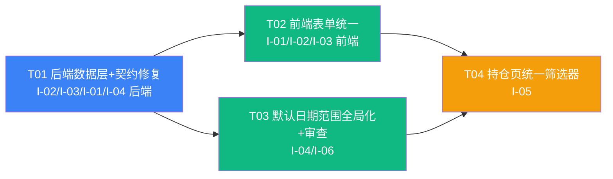

# 投资收益统计系统 — 增量架构设计（2026-08-07 · I-01 ~ I-06）

> **项目名**：`investment_return_tracker`
> **架构师**：高见远（Gao）
> **日期**：2026-08-07
> **性质**：**增量设计（Incremental）** —— 相对 `docs/ARCHITECTURE.md`（Canonical v2.7）与增量 PRD `docs/PRD-incremental-2026-08-07.md` 的**变更设计**，不重写全文。
> **权威优先级**：主 PRD v3.1.9（① 级）→ `ARCHITECTURE.md`（Canonical，② 级数据架构）→ 本文档（③ 级增量设计）。本文档与 Canonical 冲突时以 Canonical 为准；本文档新增/修订内容评审后并入 Canonical 下一版本。
> **上游输入**：产品经理增量 PRD（6 项需求 I-01~I-06，含验收标准与开放问题 Q-1~Q-8）。

---

## 目录

1. [增量实现方案总览](#1-增量实现方案总览)
2. [数据模型变更](#2-数据模型变更)
3. [后端接口契约变更](#3-后端接口契约变更)
4. [前端组件与状态设计](#4-前端组件与状态设计)
5. [文件列表](#5-文件列表)
6. [增量任务列表](#6-增量任务列表)
7. [依赖包变更](#7-依赖包变更)
8. [共享知识（跨文件约定）](#8-共享知识跨文件约定)
9. [待明确事项与架构裁决](#9-待明确事项与架构裁决)

---

## 1. 增量实现方案总览

| 需求 | 类型 | 优先级 | 技术方案要点 | 与既有架构的衔接点 |
|------|------|--------|-------------|-------------------|
| **I-01** 编辑界面统一 | 体验优化 | P1 | `SecurityTradeForm` 录入/编辑共用**同一 schema + 同一布局**；编辑态**展示费用三框**并回填关联 `FeeRecord`（按类型拆分）；保存时**重建式**维护该笔 `transactionId` 关联的 FeeRecord（删旧插新）；后端 `PATCH /security-trades/:id` 支持 `fee` 落库（前端按统一口径提交 `fee=0`） | 与录入态对称（U-4 行为反转）；费用仍走 `FeeRecord`（C-9/D-3 不参与计算）；`SecurityTrade` 仍是持仓推导唯一来源（§9） |
| **I-02** 分红所得税修复 | Bug | **P0** | `UpdateDividendRecordDto` 补 `type`（`@IsOptional @IsEnum`）；`DividendService.update()` 补 `type` 落库分支；净额仍由后端 `toResponse()` 统一计算（K-2）；`tax` 可选语义保持 | 根因确认：`main.ts` 全局 `ValidationPipe(whitelist+forbidNonWhitelisted)` + DTO 缺 `type`；`DividendRecord` **零 schema 变更** |
| **I-03** 费用记录合并 | 功能新增 | P1 | `FeeRecord` 新增 `scenario`（`FeeScenario { BUY, SELL }`，非空）；**不采纳 DB 层 `@@unique`**（裁决 Q-8），改为**展示层聚合**：`GET /fees?grouped=1` 按合并键 `(portfolioId, securityId, date, scenario, type)` 聚合返回合计行，明细行保留 `transactionId` 精确关联；新增 `PATCH /fees/:id` 支持修正场景/金额 | 费用仍不参与收益计算（D-03/C-09）；`SecurityTrade.fee` 口径不变（含费单价，fee 恒 0）；migration 含存量 `scenario` 回填（裁决 Q-4） |
| **I-04** 默认日期范围全局化 | 功能新增 | P1 | 单一真相源 = `QUICK_RANGE_OPTIONS`（`features/query/dimension-switcher.tsx`）；设置页**删除本地 `DATE_RANGE_OPTIONS`** 改复用；后端 `UpdatePreferenceDto.defaultDateRange` 取值域扩为 7 项；8 处接入点统一「URL 优先 > 偏好 > 1y」初始化 | `defaultDateRange` **保持 String**（裁决 Q-5，零迁移）；概览页 `createOverviewSchema` 已实现偏好默认范式（`overview-query-params.ts`），其余 7 处按同范式对齐 |
| **I-05** 持仓页统一筛选器 | 体验优化 | **P0** | `HoldingsToolbar` **原地升级**为统一筛选器（持仓日期卡片重新设计）；状态单一来源 = **URL query（`useUrlState`）驱动**，不新增 zustand store；三板块共享 state 按「适用维度」联动；URL key 扩展 `range/from/to/scenario`，`sec` 升级多值 | 沿用 `lib/url-query.ts` codec 体系（§10.1.6/§16.7）；后端 `securityId` 查询参数扩展**逗号分隔多值**（`{ in: [] }`）；as-of 语义独立（裁决 Q-6） |
| **I-06** 日期选择器全面审查 | 体验优化 | P1 | 范围型位置一律提供快捷范围（统一 `DateRangeQuickPicker`/`QUICK_RANGE_OPTIONS`），单点型保持；审查矩阵 13 位置逐项映射；新增范围型位置禁止裸 `<input type="date">` 成对自实现 | 复用 `components/date/date-range-quick-picker.tsx`（已支持受控 `quick` 双模，v2.7）；默认值接 I-04 |

**总体衔接原则**：本增量**不改动计算链路**（daily_nav/daily_xirr/持仓推导/总资产派生层零改动）；分红/费用仍不参与收益计算；全部变更落在「信息记录层（dividend/fee）+ 偏好 + 持仓页表现层 + 买卖流水编辑契约」。

---

## 2. 数据模型变更

### 2.1 `FeeRecord`：新增 `scenario`（I-03）

#### 2.1.1 Prisma schema（精确语法）

```prisma
// packages/backend/prisma/schema.prisma（修改后目标态，仅列出变更部分）

model FeeRecord {
  id            String      @id @default(uuid())
  portfolioId   String      @map("portfolio_id")
  securityId    String      @map("security_id")
  date          DateTime    @db.Date
  amount        Decimal     @db.Decimal(18, 2)
  type          FeeType     @default(OTHER)
  // 🆕 I-03：费用场景（BUY=买入时 / SELL=卖出时），非空
  scenario      FeeScenario @default(BUY)
  transactionId String?     @map("transaction_id")
  note          String?
  createdAt     DateTime    @default(now()) @map("created_at")
  portfolio     Portfolio   @relation(fields: [portfolioId], references: [id], onDelete: Cascade)
  security      Security    @relation(fields: [securityId], references: [id], onDelete: Cascade)

  @@index([portfolioId, date])
  @@index([securityId, date])
  // 🆕 I-03：场景筛选走统一筛选器（I-05）时的查询索引（可选；费用表量级小，非必须）
  @@index([portfolioId, scenario, date])
  @@map("fee_records")
}

enum FeeScenario {
  BUY
  SELL
}
```

> 🔴 **不采纳** `@@unique([portfolioId, securityId, date, scenario, type])`（裁决 Q-8，理由与备选方案见 §9）。`scenario` 保留 `@default(BUY)` 作为**安全网默认值**；正常写入路径由 `FeeService` 显式推断/校验后落库。

#### 2.1.2 Migration 方案（含存量回填，裁决 Q-4）

migration 采用 `prisma migrate dev --create-only` 生成后**手工补回填 SQL**（本库为开发/测试库，无生产数据风险；回填逻辑幂等可重跑）：

```sql
-- 1) 加列（可空 → 回填后收紧 NOT NULL）
ALTER TABLE "fee_records" ADD COLUMN "scenario" TEXT;

-- 2) 能按 transactionId 推断的：取 SecurityTrade.side（裁决 Q-4：能推断则推断）
UPDATE "fee_records" fr
SET "scenario" = CASE WHEN st."side" = 'BUY_SEC' THEN 'BUY' ELSE 'SELL' END
FROM "security_trades" st
WHERE fr."transaction_id" = st."id";

-- 3) 无法推断的（transactionId 为 NULL / 指向已删流水）：默认 BUY（裁决 Q-4 默认策略）
UPDATE "fee_records" SET "scenario" = 'BUY' WHERE "scenario" IS NULL;

-- 4) 收紧 + 校验约束
ALTER TABLE "fee_records" ALTER COLUMN "scenario" SET NOT NULL;
ALTER TABLE "fee_records" ADD CONSTRAINT "fee_records_scenario_check"
  CHECK ("scenario" IN ('BUY', 'SELL'));

-- 5) 可选索引（与 schema 对齐；若 schema 已含 @@index 则 migrate 自动生成）
CREATE INDEX IF NOT EXISTS "fee_records_portfolio_id_scenario_date_idx"
  ON "fee_records"("portfolio_id", "scenario", "date");
```

> **回填后动作**：UI 对默认 `BUY` 且无 `transactionId` 的存量记录不做静默修正，用户可在「费用记录」编辑弹窗（新增 `PATCH /fees/:id`）手动改场景。一次性数据修复工具列为 P2（仅当用户明确要求）。

### 2.2 `DividendRecord`：零 schema 变更（I-02）

- `amount` / `tax` / `type` 三列已存在（schema.prisma:230-247），**无任何列/索引变更**。
- 净额 `netAmount = amount − tax` 为运行时响应字段，**不落库**（延续 K-2）。
- 存量 `tax` 为空 → 服务层防御回退 0（`DividendService.toResponse` 已有）。

### 2.3 `UserPreference.defaultDateRange`：保持 String + 服务端校验（I-04，裁决 Q-5）

- **不改为 Prisma enum**：零 migration；取值域在白名单内即可。
- 后端 `UpdatePreferenceDto.defaultDateRange` 的 `@IsIn` 白名单由 `['3m','1y','ytd','all']` **扩为 7 项**：`['1w','1m','3m','6m','1y','ytd','all']`。
- `@default("1y")` 不变；`UserPreference` 表零 DDL。

### 2.4 `SecurityTrade`：零 schema 变更（I-01）

- `fee` 列已存在（`DECIMAL(18,2)`）；仅后端 `update` 契约补落库（§3.4）。
- 口径不变：`price` 恒为**含费单价**、`fee` 恒 0（C-5/K-4），费用拆分落 `FeeRecord`。

---

## 3. 后端接口契约变更

### 3.1 分红记录（I-02）

#### 3.1.1 `UpdateDividendRecordDto`（修改）

```ts
// packages/backend/src/modules/dividend/dto/update-dividend-record.dto.ts
import { IsEnum } from 'class-validator';
import { DividendType } from '@prisma/client';

// 新增字段（其余字段不变）：
@ApiPropertyOptional({
  description: '分红类型：CASH 现金分红 / STOCK_DIVIDEND 红利再投',
  enum: DividendType,
})
@IsOptional()
@IsEnum(DividendType)
type?: DividendType;
```

#### 3.1.2 `DividendService.update()`（修改）

```ts
// 落库分支新增（其余不变）：
...(dto.type !== undefined && { type: dto.type }),
```

#### 3.1.3 分红/费用相关 DTO 完整字段表（含校验规则）

| 字段 | Create Dividend | Update Dividend（修复后） | Create Fee（I-03 后） | Update Fee（新增） | 校验规则 |
|------|----------------|--------------------------|----------------------|--------------------|---------|
| `securityId` | 必填 `@IsUUID` | 可选 `@IsUUID` | 必填 `@IsUUID` | 可选 `@IsUUID` | 二级校验：标的属于该组合 |
| `date` | 必填 `@IsDateString` | 可选 `@IsDateString` | 必填 `@IsDateString` | 可选 `@IsDateString` | `YYYY-MM-DD`；不可未来（服务层） |
| `amount` | 必填 `@IsDecimal({0,2})` | 可选 `@IsDecimal({0,2})` | 必填 `@IsDecimal({0,2})` | 可选 `@IsDecimal({0,2})` | **> 0**，字符串传输 |
| `tax` | 可选 `@IsDecimal({0,2})` | 可选 `@IsDecimal({0,2})` | — | — | **≥ 0**；空/未传 = 0；净额 = amount − tax ≥ 0 |
| `type` | 可选 `@IsEnum(DividendType)` | 🔴 **补**：可选 `@IsEnum(DividendType)` | — | — | `CASH`/`STOCK_DIVIDEND`，缺省 `CASH` |
| `scenario` | — | — | 🆕 可选 `@IsEnum(FeeScenario)` | 🆕 可选 `@IsEnum(FeeScenario)` | `BUY`/`SELL`；服务层推断优先（见 §3.2.2） |
| `feeType`（前端表单字段） | — | — | — | — | 前端字段映射到 `type`，不直接传后端 |
| `transactionId` | — | — | 可选 `@IsUUID` | 可选 `@IsUUID` | 仅信息关联（C-9） |
| `note` | 可选 `@IsString @MaxLength(200)` | 可选 `@IsString @MaxLength(200)` | 可选 `@IsString @MaxLength(200)` | 可选 `@IsString @MaxLength(200)` | — |

> **三场景数据流（I-02 验收，后端不变式）**：
> ① 录时填税：`{amount:'320.00', tax:'60.00', type:'CASH'}` → `parseAmount(320)/parseTax(60)/validateNetAmount(260≥0)` → 落库 `{amount:320, tax:60}` → 展示净额 `260.00`；
> ② 录时不填税：`tax` 不传 → `parseTax(undefined)→0` → 展示 `320.00`；
> ③ 后补填税：`PATCH {tax:'60.00', type:'CASH'}` → resolve 现值 + 校验 → 展示 `260.00`。
> 净额恒由后端 `toResponse()` 计算（K-2），前端仅展示（`toFixed(2)`）。

### 3.2 费用记录（I-03）

#### 3.2.1 `CreateFeeRecordDto`（修改）+ `UpdateFeeRecordDto`（新增）

```ts
// create-fee-record.dto.ts 新增：
@ApiPropertyOptional({
  description: '费用场景：BUY 买入时 / SELL 卖出时（缺省按 transactionId 推断，无法推断默认 BUY）',
  enum: FeeScenario,
})
@IsOptional()
@IsEnum(FeeScenario)
scenario?: FeeScenario;

// update-fee-record.dto.ts（新增文件，全可选 PATCH 语义）：
export class UpdateFeeRecordDto {
  @IsOptional() @IsUUID() securityId?: string;
  @IsOptional() @IsDateString() date?: string;
  @IsOptional() @IsDecimal({ decimal_digits: '0,2' }) amount?: string;
  @IsOptional() @IsEnum(FeeType) type?: FeeType;
  @IsOptional() @IsEnum(FeeScenario) scenario?: FeeScenario;
  @IsOptional() @IsString() @MaxLength(200) note?: string;
}
```

#### 3.2.2 `FeeService` 场景推断与落库（修改）

```
create():
  scenario = dto.scenario
           ?? (dto.transactionId ? inferFromTradeSide(transactionId) : undefined)
           ?? FeeScenario.BUY        // 安全网
  # inferFromTradeSide：SecurityTrade.side === 'BUY_SEC' → BUY；'SELL_SEC' → SELL
  # 流水不存在/已删 → 回退默认 BUY（不抛错，仅信息记录）

update():   # 新增 PATCH /fees/:id
  双闸（portfolio.userId + security 归属）→ 可改 securityId/date/amount/type/scenario/note
```

#### 3.2.3 费用列表查询：按合并键聚合（推荐方案）

**推荐：应用层聚合**（Prisma `findMany` + 服务层 `groupBy` 键），理由：
1. 费用表量级小（个人应用，典型 < 千行），应用层聚合性能可忽略；
2. 需要带出 `security.name/code`（聚合键含 securityId，`groupBy` 无法直接 join）；
3. 与既有过滤（securityId 多值 / scenario / startDate / endDate）天然组合，先过滤后聚合避免多余行；
4. 可复用既有 `toResponse` 与排序逻辑，纯函数易单测。

备选：`prisma.feeRecord.groupBy({ by: ['portfolioId','securityId','date','scenario','type'], _sum: { amount: true } })` + 二次查 security —— 多一次关联查询且丢失 `transactionId` 明细，仅在费用量级 > 10⁴ 时考虑。

```ts
// GET /api/portfolios/:portfolioId/fees
// 查询参数（FeeQueryDto，全部可选）：
//   securityId?  string  逗号分隔多值（I-05 标的多选），如 'id1,id2' → { in: [...] }
//   scenario?    FeeScenario   I-05 场景过滤
//   startDate? / endDate?      I-05 日期范围过滤
//   grouped?     '1' | '0'     I-03 合并展示：按合并键聚合（缺省不聚合，兼容既有调用）

// grouped=1 响应行（FeeGroupedRow）：
interface FeeGroupedRow {
  mergeKey: string;          // `${securityId}|${date}|${scenario}|${type}`
  securityId: string;
  securityName: string;
  securityCode: string;
  date: string;              // YYYY-MM-DD
  scenario: FeeScenario;
  type: FeeType;
  amount: string;            // Σ 金额，toFixed(2)
  count: number;             // 组成笔数
  transactionIds: string[];  // 关联流水 ID 去重列表（Q-3 下每行保留自己的 transactionId，天然可追溯）
}

// 排序：date desc → scenario → type → securityCode asc（稳定）
```

#### 3.2.4 是否新增费用场景筛选参数（供 I-05）

**是**：`GET /fees` 新增 `scenario` 查询参数（`@IsOptional @IsEnum(FeeScenario)`）。买卖明细板块的场景过滤**无需后端新参数**——复用既有 `GET /security-trades` 的 `side`（`scenario=BUY → side=BUY_SEC`，`SELL → SELL_SEC`，统一筛选器前端映射）。分红板块无场景维度，不适用。

#### 3.2.5 导出（SET-P0-03）

费用导出新增 `scenario` 列（`data-transfer` 的 `export-schemas.ts` 中 fees 列定义追加，属于 T05 既有模块，本次仅在导出 schema 加一列，不改解析逻辑）。

### 3.3 `SecurityTrade` update 契约支持 `fee`（I-01，裁决 Q-2）

```ts
// UpdateSecurityTradeDto：fee 字段已存在（§4.2.6 契约），无需改 DTO
// SecurityTradeService.update() 修改（当前忽略 fee，补齐落库）：
...(dto.fee !== undefined && { fee: dto.fee }),
```

**Q-2 裁决（编辑态费用联动落位）**：
- 编辑买卖流水时，**仅维护该笔 `transactionId` 关联的 FeeRecord 组成**（删旧插新，见 §4.1 保存流程）；
- **合并展示在展示层自动聚合**（`GET /fees?grouped=1` 按合并键 Σ），不物理合并底层明细行；
- 前端按统一口径提交 `fee: 0`（含费单价入 `price`，费用拆分落 FeeRecord），`fee` 字段支持仅为契约完整性与旧口径兼容。

### 3.4 偏好接口（I-04）

`UpdatePreferenceDto.defaultDateRange` 的 `@IsIn` 扩为 7 项（见 §2.3）；`GET/PATCH /api/users/preferences` 路径与响应结构零变更。

### 3.5 持仓/买卖明细/分红/费用查询 securityId 多值（I-05）

| 接口 | 变更 |
|------|------|
| `GET /holdings` | `securityId` 支持逗号分隔 → `items.filter(h => ids.includes(h.securityId))`（controller 内 `bySecurity` 分支改为集合判断） |
| `GET /security-trades` | `where.securityId = { in: ids }` |
| `GET /fees` | `where.securityId = { in: ids }`（同 §3.2.3） |
| `GET /dividends` | 新增 `securityId` 多值 + `startDate/endDate`（I-05 分红板块日期范围过滤） |

---

## 4. 前端组件与状态设计

### 4.1 I-01：`SecurityTradeForm` 复用方案

**目标**：录入/编辑共用**同一 schema + 同一布局**，仅初始值不同。

- **统一字段与顺序**（沿用当前录入态布局，字段集合与 PRD I-01 验收 2 一致）：
  `方向 → 日期 → 标的 → 数量 → 成交额 → 费用三框（佣金/印花税/其他）→ 含费单价预览（只读）→ 备注`
- **统一公式**（K-3，买入/卖出同式）：
  - 成交额（输入，编辑态回填）：
    - 新口径（`trade.fee=0` 且有关联 FeeRecord）：`BUY: 成交额 = q×price − feeTotal`；`SELL: 成交额 = q×price + feeTotal`
    - 旧口径（`trade.fee≠0` 且无关联 FeeRecord，存量）：费用三框回填「其他」= `trade.fee`（佣金/印花税空），`成交额 = q×price`；保存时自动将旧 fee 并入含费单价（成本守恒）
  - 含费单价（只读预览，实时）：`price = (成交额 ± 费用合计) / 数量`，6 位小数收敛
  - 卖出硬校验：`费用合计 ≤ 成交额`（前端 C-7 闸 + 后端 price>0 兜底）；卖出数量 ≤ 当日持仓（后端硬校验沿用）
- **编辑态回填**：`quantity/date/side/securityId/note` 取 `trade`；费用三框按 `transactionId = trade.id` 的 FeeRecord **按类型拆分回显**（未关联则空）；成交额按上述公式回填。
- **保存流程（两态统一）**：
  1. `PATCH/POST /security-trades`：`{ date, side, securityId, quantity, price: 含费单价, fee: 0, note }`（create 先拿 `trade.id`）；
  2. **重建 FeeRecord**：`DELETE` 该 `transactionId` 关联的全部 FeeRecord（编辑态）→ 对 `amount > 0` 的费用类型逐个 `POST /fees`（`transactionId = trade.id`，`scenario = side` 映射）；
  3. 成功后 toast + 刷新（`holdings / trades / fees` 缓存失效，`useCreateSecurityTrade` onSuccess 连带失效 `['fees']` 已有 K-4 兜底）。
- **存量 `fee≠0` 提示**：编辑态若检测旧口径（`fee≠0` 且无关联 FeeRecord），展示 amber 提示「旧口径费用将并入含费单价」。
- **实现要点**：删除 `editTradeSchema` 分支，单一 `tradeSchema`；`isEdit` 仅影响初始值与提交目标（PATCH vs POST），**不再分叉 UI**。

### 4.2 I-02：`DividendFeeForm` 修复

- 编辑分红：所得税输入框**可编辑并回填现有 `tax`**（当前已可编辑，保持）；提交 payload 同时携带 `tax` 与 `type`（**必须**，否则 `forbidNonWhitelisted` 400）。
- 类型编辑（裁决 Q-1 建议允许）：编辑态显示 `type` 下拉（现金分红/红利再投，回填 `record.type`）；录入态保持固定「现金分红（红利再投不录入）」。
- `tax` 标签由「所得税 *」改为「所得税（可选）」；净额实时预览沿用 `computeNetAmount`（shared 整数分运算）。
- I-03 联动：费用模式新增「场景」必填选择器（买入时/卖出时，缺省按 `transactionId` 推断）；`record` prop 类型扩展为 `DividendRecord | FeeRecord`，费用编辑走 `PATCH /fees/:id`。

### 4.3 I-04：`QUICK_RANGE_OPTIONS` 单一真相源 + 全局生效

- **单一真相源**：`QUICK_RANGE_OPTIONS` 位于 `@/features/query/dimension-switcher`（已导出）。设置页**删除本地 `DATE_RANGE_OPTIONS`**，改为 `import { QUICK_RANGE_OPTIONS } from '@/features/query/dimension-switcher'`。
- **全局生效接入点（8 处）**：

| # | 位置 | 现状 | 本次要求 |
|---|------|------|---------|
| 1 | 概览页「趋势分析」筛选栏 | ✅ 已有 7 项（`createOverviewSchema` 已用偏好默认） | 核对保持 |
| 2 | 收益分析页 `/analysis/xirr` | ✅ 已有（dimension-switcher） | 接默认值 |
| 3 | 净值分析页 `/analysis/nav` | ✅ 已有 | 接默认值 |
| 4 | 出入金列表页 `/transactions` | ✅ 已有（DateRangeQuickPicker） | 接默认值 |
| 5 | 资产记录页 `/snapshots` | ✅ 已有 | 接默认值 |
| 6 | 现金余额变更历史 `cash-balance-history` | ✅ 已有 | 接默认值 |
| 7 | 持仓页统一筛选器（I-05 后） | 🔧 重构中 | 继承全局默认 |
| 8 | I-06 审查后新增范围型位置 | 待审 | 继承全局默认 |

- **初始化默认值逻辑**（统一约定，新建 hook `features/query/use-default-date-range.ts`）：
  ```
  effectiveDefault = URL 携带 range（或 from/to）→ 以 URL 为准（useUrlState 天然满足）
                    否则 → UserPreference.defaultDateRange（偏好异步到达后对齐一次）
                    偏好为空/首次登录 → '1y'
  ```
- **对齐模式**：沿用 HoldingsPage `closed` 偏好对齐范式（`useEffect` 在偏好到达且 URL 无对应参数时 setState 一次，首帧 schema 默认值固化后主动对齐）。

### 4.4 I-05：持仓页统一筛选器

#### 4.4.1 组件方案（推荐：升级 `HoldingsToolbar`，不新建文件）

- **推荐文件**：`features/holdings/holdings-toolbar.tsx` **原地升级**为统一筛选器（持仓日期卡片重新设计承载）。理由：当前卡片已是 `rounded-md border p-3` 容器，升级即满足「卡片重新设计」，避免无谓改名与 import 连锁。
- **新 props/state 设计**（纯受控组件，状态由 `useUrlState` 持有）：

```ts
export interface HoldingsFilterState {
  date: string;                  // as-of（持仓板块，默认今日，范围 [minDate, today]）
  closed: boolean;               // 显示已清仓（持仓专属，默认偏好 showLiquidated）
  types: SecurityType[];         // 类型多选（持仓专属，空=全部）
  sec: string[];                 // 🆕 标的多选（三板块，空=全部）
  scenario: 'all' | FeeScenario; // 🆕 场景（买卖明细→side、分红费用→scenario；持仓不适用置灰）
  range: string;                 // 🆕 快捷范围 1w|1m|3m|6m|1y|ytd|all|custom
  from: string;                  // 🆕 range=custom 起
  to: string;                    // 🆕 range=custom 止
}
export interface HoldingsToolbarProps {
  value: HoldingsFilterState;
  onChange: (patch: Partial<HoldingsFilterState>) => void;
  minDate: string;               // as-of 下限（首个交易日）
  allRangeStart?: string | null; // Portfolio.baseDate（range=all 起始日）
  securities: Security[];        // 标的多选数据源
  defaultRange: string;          // 偏好默认（URL 无 range 时）
}
```

- **卡片内部结构**：
  1. 快捷范围下拉（7 项 `QUICK_RANGE_OPTIONS`）+ 自定义起止（复用 `DateRangeQuickPicker` 口径）；
  2. 持仓日期（as-of）单点输入（label 内化为「持仓日期（as-of）」）；
  3. 证券多选下拉（含已选计数徽标）；
  4. 场景下拉（买入 / 卖出 / 全部）；
  5. 持仓专属折叠区：类型多选 + 显示已清仓开关（可折叠，避免卡片过重）。
- **标题**：「统一筛选器」；下方注明口径提示：「持仓板块以持仓日期为准，买卖明细/分红费用以日期范围为准」。

#### 4.4.2 URL key 扩展（`holdings-query-params.ts`）

```
date / closed / types / sec（升级多值，逗号分隔）/ range / from / to / scenario
```
- `sec`：`arrayCodec<string>([])`（单值读取向后兼容：'abc' → ['abc']）；
- `range`：`enumCodec(OVERVIEW_RANGE_VALUES 同构 7 项 + 'custom', defaultRange)`；
- `scenario`：`enumCodec(['all','BUY','SELL'], 'all')`；
- `from/to`：`dateCodec('')`（仅 `range=custom` 生效）；
- 等于默认值不写入 URL（沿用 §16.7）。

#### 4.4.3 三板块联动规则落地（URL query 驱动，不新增 zustand store）

| 维度变化 | 持仓板块 | 买卖明细板块 | 分红费用板块 |
|---------|---------|-------------|-------------|
| 日期范围 | 不变 | 区间过滤 | 区间过滤 |
| as-of | 精确推导 | 不变 | 不变 |
| 证券 | 过滤 | 过滤 | 过滤 |
| 场景 | 不适用（置灰） | `side` 过滤 | `scenario` 过滤 |
| 类型多选 | 过滤 | 不变 | 不变 |
| 显示已清仓 | 显示/隐藏 qty=0 | 不变 | 不变 |

- **状态驱动**：`HoldingsPage` 持有单一 `useUrlState<HoldingsFilterState>`（扩展 `createHoldingsSchema`），向下传给 `HoldingsToolbar` + 三个板块（`SecurityTradeList`、`DividendFeeSection` 改为接收筛选 props，或由页面把筛选转成查询参数传给 hooks）。
- **理由**：筛选状态需要 URL 持久化（PRD 6.2.5）+ 三板块共享；`useUrlState` 已在页面持有 date/closed/types/sec，扩展成本最低；zustand store 会引入「store ↔ URL 双源同步」复杂度。
- **数据获取**：
  - 持仓：`useHoldings({ date: as-of, includeClosed, types, securityId: sec.join(',') })`；
  - 买卖明细：`useSecurityTrades({ securityId: sec.join(','), side: scenario→side, startDate/endDate: resolveQuickRange(range) 或 from/to })`；
  - 分红费用：`useDividends({ securityId: sec.join(','), startDate, endDate })` + `useFees({ securityId: sec.join(','), scenario, startDate, endDate, grouped: 1 })`。
- **汇总条随筛选动态变化**（HOLD-B-P0-06 / 累计分红/费用卡）：在过滤后的数据上聚合（沿用 `aggregateBySecurity`/`sumNetAmount`，纯函数）。

### 4.5 I-06：`DateRangeQuickPicker` 统一接入 + 审查矩阵整改映射

- **统一组件**：`components/date/date-range-quick-picker.tsx`（已支持受控 `quick` 双模 + 7 项默认）。范围型位置一律用它或 `DimensionSwitcher` 的 `quickRanges`；**禁止**裸 `<input type="date">` 成对自实现。
- **审查矩阵整改映射（13 位置）**：

| # | 位置 | 类型 | 整改动作 |
|---|------|------|---------|
| 1~3 | 概览 / XIRR / NAV 分析筛选栏 | 范围型 | 已有快捷范围 → 接 I-04 默认值（`use-default-date-range`） |
| 4~6 | 出入金 / 资产记录 / 现金余额历史 | 范围型 | 已有 `DateRangeQuickPicker` → 接 I-04 默认值 |
| 7 | 持仓页统一筛选器（I-05 后） | 范围型 | I-05 提供 7 项快捷范围 |
| 8~12 | 出入金/买卖/分红费用/现金余额/总资产 表单日期 | 单点型 | 保持单日期，记录在案（不适用快捷范围） |
| 13 | 持仓日期 as-of | 单点型 | 并入统一筛选器（I-05） |

- **验收**：全站范围型位置 100% 提供快捷范围且行为一致；QA 按矩阵逐位置点检；代码评审防回归（范围内新增裸日期范围控件即失败）。

---

## 5. 文件列表

> 路径均相对仓库根；「修改」为既有文件增量变更，「新增」为新文件。

### 5.1 后端（backend）

| 文件 | 状态 | 变更要点 |
|------|------|---------|
| `packages/backend/prisma/schema.prisma` | 修改 | `FeeRecord` + `scenario`（`@default(BUY)`）+ `FeeScenario` enum + 可选 `@@index([portfolioId, scenario, date])` |
| `packages/backend/prisma/migrations/<new>/migration.sql` | 新增 | 加 `scenario` 列 + 回填 SQL（transactionId 推断 + 默认 BUY）+ NOT NULL + CHECK + 索引 |
| `packages/backend/src/modules/fee/dto/create-fee-record.dto.ts` | 修改 | + `scenario?: FeeScenario` |
| `packages/backend/src/modules/fee/dto/update-fee-record.dto.ts` | 新增 | PATCH 全可选 DTO（securityId/date/amount/type/scenario/note） |
| `packages/backend/src/modules/fee/fee.service.ts` | 修改 | create scenario 推断/落库；响应 + `scenario`；findAll 过滤（securityId 多值/scenario/startDate/endDate）+ `grouped` 聚合（`FeeGroupedRow`）；新增 update() |
| `packages/backend/src/modules/fee/fee.controller.ts` | 修改 | GET 查询参数；新增 `PATCH :id` |
| `packages/backend/src/modules/dividend/dto/update-dividend-record.dto.ts` | 修改 | + `type?: DividendType`（`@IsOptional @IsEnum`） |
| `packages/backend/src/modules/dividend/dividend.service.ts` | 修改 | `update()` 落库 `type` 分支；`findAll()` 过滤扩展（securityId 多值/startDate/endDate，I-05） |
| `packages/backend/src/modules/security-trade/security-trade.service.ts` | 修改 | `update()` 落库 `fee`；`findAll()` securityId 多值（I-05） |
| `packages/backend/src/modules/preference/dto/update-preference.dto.ts` | 修改 | `defaultDateRange` `@IsIn` 扩 7 项 |
| `packages/backend/src/modules/holding/holding.controller.ts` | 修改 | `securityId` 多值过滤（I-05） |
| `packages/backend/src/modules/data-transfer/csv/export-schemas.ts` | 修改 | 费用导出列 + `scenario`（I-03 验收 8） |

### 5.2 共享包（shared）

| 文件 | 状态 | 变更要点 |
|------|------|---------|
| `packages/shared/src/types/fee.ts` | 修改 | + `FeeScenario` const/type；`FeeRecord.scenario`；`CreateFeeRecordDto.scenario`；`FeeGroupedRow` |
| `packages/shared/src/types/dividend.ts` | 修改 | `DividendRecord` 补 `tax`/`netAmount`（与 web `api/types.ts` 对齐，可选但推荐） |

### 5.3 前端（web）

| 文件 | 状态 | 变更要点 |
|------|------|---------|
| `packages/web/src/api/types.ts` | 修改 | + `FeeScenario`；`FeeRecord.scenario`；`UpdateDividendRecordDto.type`；`UpdateFeeRecordDto`；`FeeGroupedRow` |
| `packages/web/src/api/fee.api.ts` | 修改 | list 参数（securityId/scenario/startDate/endDate/grouped）；create payload + scenario；+ updateFee |
| `packages/web/src/hooks/use-fees.ts` | 修改 | 查询参数透传；+ updateFee mutation |
| `packages/web/src/hooks/use-dividends.ts` | 修改 | 查询参数透传（securityId 多值/startDate/endDate，I-05） |
| `packages/web/src/features/security-trade/security-trade-form.tsx` | 修改 | 单一 schema；编辑态费用三框回填/重建 FeeRecord；统一保存流程 |
| `packages/web/src/features/security-income/dividend-fee-form.tsx` | 修改 | I-02 type 编辑/所得税可选；I-03 费用场景选择器；费用编辑态 |
| `packages/web/src/features/security-income/dividend-fee-section.tsx` | 修改 | 费用列表按合并键聚合展示 + scenario 徽标 + 费用编辑入口；接收筛选 props（I-05） |
| `packages/web/src/features/holdings/holdings-toolbar.tsx` | 修改 | 升级为统一筛选器（§4.4.1） |
| `packages/web/src/features/holdings/holdings-query-params.ts` | 修改 | `HoldingsFilterState` 扩展 + `createHoldingsSchema` 扩展（range/from/to/scenario/sec 多值） |
| `packages/web/src/pages/HoldingsPage.tsx` | 修改 | 统一筛选器接入；三板块联动；URL key |
| `packages/web/src/pages/settings.tsx` | 修改 | 删除本地 `DATE_RANGE_OPTIONS`，复用 `QUICK_RANGE_OPTIONS` |
| `packages/web/src/features/query/use-default-date-range.ts` | 新增 | 全局默认范围 hook（URL 优先 > 偏好 > 1y + 对齐 effect） |
| `packages/web/src/features/query/dimension-switcher.tsx` | 修改 | 常量已为单一真相源，仅补注释/导出确认；可选接 `use-default-date-range` |
| `packages/web/src/pages/dashboard.tsx` | 修改 | I-04 默认值核对（概览已实现，保持） |
| `packages/web/src/pages/xirr-analysis.tsx` | 修改 | I-04 默认值接入 |
| `packages/web/src/pages/nav-analysis.tsx` | 修改 | I-04 默认值接入 |
| `packages/web/src/pages/transactions.tsx` | 修改 | I-04 默认值接入 |
| `packages/web/src/pages/snapshots.tsx` | 修改 | I-04 默认值接入 |
| `packages/web/src/features/cashflow/cash-balance-history.tsx` | 修改 | I-04 默认值接入 |
| `packages/web/src/features/security-trade/security-trade-list.tsx` | 修改 | 接收统一筛选派生 query（I-05） |
| `packages/web/src/components/date/date-range-quick-picker.tsx` | 修改（可选） | I-06 审查确认；如无缺口可不动 |

---

## 6. 增量任务列表

> 硬约束：**≤ 5 任务**、每任务 **≥ 3 文件**、按模块分组、T01 为基础层。任务按实现顺序编号。

### 任务依赖图



### T01：后端数据层 + 契约修复（I-02 / I-03 / I-01 后端 / I-04 后端）

| 项 | 内容 |
|----|------|
| **优先级** | P0（含 I-02 P0 修复） |
| **依赖** | 无 |
| **需求编号** | I-02（后端）、I-03（schema/migration/service/dto/controller）、I-01（security-trade update fee）、I-04（preference DTO） |
| **涉及文件** | `schema.prisma`、`migrations/<new>/migration.sql`、`fee/dto/create-fee-record.dto.ts`、`fee/dto/update-fee-record.dto.ts`（新增）、`fee/fee.service.ts`、`fee/fee.controller.ts`、`dividend/dto/update-dividend-record.dto.ts`、`dividend/dividend.service.ts`（仅 update 落库 type）、`security-trade/security-trade.service.ts`（仅 update 落库 fee）、`preference/dto/update-preference.dto.ts`、`shared/src/types/fee.ts`、`shared/src/types/dividend.ts` |
| **交付标准** | ① `prisma migrate dev` 成功，`fee_records.scenario` 非空且存量回填正确（能推断则推断、否则 BUY）② 分红 PATCH 携带 `type` 不再 400 且落库 ③ 分红三场景净额正确（后端单测）④ 费用 create 场景推断（transactionId→side）与 grouped 聚合正确 ⑤ `PATCH /fees/:id` 生效 ⑥ `PATCH /security-trades/:id` 支持 fee 落库 ⑦ 偏好接受 7 项范围值并持久化 |

### T02：前端表单统一（I-01 / I-02 / I-03 前端）

| 项 | 内容 |
|----|------|
| **优先级** | P0（I-02 前端修复） |
| **依赖** | T01 |
| **需求编号** | I-01（编辑界面统一）、I-02（分红编辑）、I-03（费用场景/编辑/聚合展示） |
| **涉及文件** | `features/security-trade/security-trade-form.tsx`、`features/security-income/dividend-fee-form.tsx`、`features/security-income/dividend-fee-section.tsx`（聚合展示 + 徽标 + 费用编辑，不含筛选 props）、`api/types.ts`、`api/fee.api.ts`、`hooks/use-fees.ts` |
| **交付标准** | ① 买卖录入/编辑共用同一表单组件，编辑态展示费用三框并按 FeeRecord 回填 ② 编辑保存重建 FeeRecord（删旧插新，scenario=side）③ 成交额/含费单价预览两态一致 ④ 编辑分红不再报「property type should not exist」，tax 可编辑，三场景净额展示正确 ⑤ 费用表单含场景选择器，列表按合并键聚合展示一行 + 金额合计 + 场景徽标 ⑥ 费用编辑（PATCH）生效 ⑦ 前端 zod 与后端 DTO 规则一致 |

### T03：默认日期范围全局化 + 日期选择器审查（I-04 / I-06）

| 项 | 内容 |
|----|------|
| **优先级** | P1 |
| **依赖** | T01 |
| **需求编号** | I-04（前端 8 处）、I-06（审查矩阵整改） |
| **涉及文件** | `pages/settings.tsx`、`features/query/use-default-date-range.ts`（新增）、`features/query/dimension-switcher.tsx`、`pages/dashboard.tsx`、`pages/xirr-analysis.tsx`、`pages/nav-analysis.tsx`、`pages/transactions.tsx`、`pages/snapshots.tsx`、`features/cashflow/cash-balance-history.tsx`、`components/date/date-range-quick-picker.tsx`（审查确认） |
| **交付标准** | ① 设置页下拉 7 项与 `QUICK_RANGE_OPTIONS` 逐项一致（比对测试），全站无第二份范围选项数组 ② 改默认「近一周」→ 8 处首次进入默认近一周 ③ URL `range` 覆盖偏好 ④ 偏好空 → 回落 `1y` ⑤ 换设备仍生效 ⑥ I-06 审查矩阵逐位置点检通过，范围内无裸日期范围控件 |

### T04：持仓页统一筛选器 + 三板块联动（I-05）

| 项 | 内容 |
|----|------|
| **优先级** | P0 |
| **依赖** | T01、T02、T03 |
| **需求编号** | I-05（统一筛选器 + 持仓日期卡片重新设计 + URL 扩展 + 三板块联动） |
| **涉及文件** | `features/holdings/holdings-toolbar.tsx`、`features/holdings/holdings-query-params.ts`、`pages/HoldingsPage.tsx`、`modules/holding/holding.controller.ts`、`modules/security-trade/security-trade.service.ts`（findAll 多值）、`modules/dividend/dividend.service.ts`（findAll 过滤）、`features/security-trade/security-trade-list.tsx`、`features/security-income/dividend-fee-section.tsx`（筛选 props）、`hooks/use-dividends.ts` |
| **交付标准** | ① 页面顶部单一统一筛选器，三板块共享 ② 证券多选 → 三板块同步 ③ 场景 → 买卖明细/分红费用同步、持仓不适用 ④ 日期范围 → 买卖明细/分红费用；as-of → 持仓 ⑤ URL 持久化 `date/closed/types/sec/range/from/to/scenario`（等于默认不写入）⑥ 持仓日期能力不丢失（默认今日、范围校验、as-of 精确推导）⑦ 三板块空状态四态齐全，汇总条随筛选动态变化 ⑧ 卡片内日期范围含 7 项快捷范围（I-06 联动） |

---

## 7. 依赖包变更

**无需新增任何第三方依赖**，明确说明：

- 后端：`class-validator` 已含 `IsEnum/IsIn/IsDecimal`，Prisma 原生支持 `scenario` 枚举列与 migration；
- 前端：`useUrlState` codec 体系（`enumCodec/arrayCodec/dateCodec`）已具备；`DateRangeQuickPicker` / `QUICK_RANGE_OPTIONS` 均已存在；表单沿用 RHF + zod；
- 无新 UI 组件库引入（场景徽标复用 `Badge`，多选复用现有自绘面板范式）。

---

## 8. 共享知识（跨文件约定）

| 约定 | 内容 |
|------|------|
| **QUICK_RANGE_OPTIONS 引用路径** | `@/features/query/dimension-switcher`（唯一真相源，7 项：`1w/1m/3m/6m/1y/ytd/all`）。设置页**禁止**再定义第二份范围数组；新增范围型位置一律复用 |
| **FeeScenario 枚举定义位置** | 后端：`prisma/schema.prisma` `enum FeeScenario { BUY SELL }`（唯一 DB 真源）；shared：`packages/shared/src/types/fee.ts` const 对象 + type（与 `FeeType` 同模式）；web：`api/types.ts` enum（与现有 `FeeType` 同模式）。三处值必须一致（BUY/SELL） |
| **净额计算约定（K-2）** | `netAmount = amount − tax`，恒 ≥ 0；**后端 `toResponse()` 统一计算**，前端仅展示（`toFixed(2)`），不得二次计算；`netAmount` 不落库 |
| **trade.fee 口径（C-5/K-4）** | `SecurityTrade.price` 恒为**含费单价**、`fee` 恒 0；费用拆分落 `FeeRecord`（`transactionId` 关联）。`PATCH /security-trades/:id` 接受 `fee` 但前端按统一口径提交 0 |
| **费用合并语义（I-03/Q-8）** | 合并键 = `(portfolioId, securityId, date, scenario, type)`；**底层明细行不物理合并**，展示层 `grouped=1` 聚合；`transactionId` 保留精确关联（编辑/删除组成笔即重算） |
| **URL 规范（§16.7 沿用）** | 小写 key；布尔 `1/0`；多值逗号分隔；等于默认不写入；非法静默降级；持仓页扩展 key：`date/closed/types/sec/range/from/to/scenario` |
| **偏好对齐 effect 模式** | `useUrlState` schema 默认值首帧固化；偏好异步到达后须在 effect 中「URL 无对应参数时对齐一次」（沿用 HoldingsPage `closed` 范式），严禁在渲染期依赖未加载偏好 |
| **数据隔离双闸（C-3）** | 分红/费用/偏好接口继续 `user_id` + 组合归属双闸；`securityId` 二级校验防跨组合挂载 |
| **不参与计算（D-02/D-03/C-08/C-09）** | 分红/费用变更**不触发** `recalculateRange/recalculateNavRange`，不失效 `holdings/nav/xirr/snapshots/overview` 缓存（仅 `['fees']`/`['dividends']`） |
| **金额展示** | 金额 2 位小数右对齐 + 等宽字体；空值显示 `-`；涨跌配色正红负绿（§9.5） |

---

## 9. 待明确事项与架构裁决

### 9.1 架构师裁决（Q-2 / Q-4 / Q-5 / Q-6 / Q-8）

| 编号 | 问题 | 🏛️ 架构裁决 | 落地 |
|------|------|------------|------|
| **Q-2** | 编辑买卖流水时费用三框如何联动合并后的 FeeRecord？ | **仅维护该笔 `transactionId` 关联的费用组成（删旧插新重建）**；合并只在展示层聚合（`grouped=1`），底层明细行不物理合并。理由：物理合并后无法定位「该笔对合并行的贡献」，编辑会破坏成本语义；展示层聚合 100% 满足 I-03 验收 | §3.3 / §4.1 |
| **Q-4** | 存量费用 `scenario` 默认值策略？ | **能按 `transactionId` 推断则推断（`SecurityTrade.side`）**；无法推断（transactionId 空/流水已删）**默认 `BUY`**，UI 可编辑修正（新增 `PATCH /fees/:id`）；一次性数据修复工具列 P2 | §2.1.2 |
| **Q-5** | `defaultDateRange` 是否改 Prisma enum？ | **保持 String + 服务端校验**（`@IsIn` 7 项白名单），**零 migration**。改 enum 需 `ALTER TYPE` 且与「String 字段承载前端选项」的既有模式不符，收益仅类型安全，不划算 | §2.3 / §3.4 |
| **Q-6** | 「持仓日期(as-of)」与「日期范围」关系？ | **独立单点**：as-of 保持 HOLD-B-P0-11 精确回溯语义，只驱动持仓板块；日期范围只驱动买卖明细/分红费用。两口径在 UI 注明，不互相换算 | §4.4.3 |
| **Q-8** | `@@unique([portfolioId, securityId, date, scenario, type])` 是否采纳？ | **不采纳 DB 层唯一约束**，采纳「展示层聚合 + 明细行保留」方案。理由：① I-01 编辑需按 `transactionId` 精确重建，物理合并破坏该语义；② 累加 upsert 在「编辑单笔」时需知该笔对合并行的贡献，必须引入组成明细表（过度设计）；③ 个人应用写入并发极低，DB 层强制合并的并发收益可忽略；④ 金融数据审计要求保留明细。**备选（如评审坚持采纳）**：`prisma.feeRecord.upsert({ where: { mergeKey }, create, update: { amount: { increment } } })` + 捕获 P2002 重试一次 + `$transaction`（Serializable），但编辑语义需重构，**不推荐** | §2.1 / §3.2.3 |

### 9.2 需用户拍板（Q-1 / Q-3 / Q-7）——架构师建议

| 编号 | 问题 | 架构师建议 | 需确认方 |
|------|------|-----------|---------|
| **Q-1** | 编辑分红是否允许修改 `type`？ | **建议允许**（本次一并修复，DTO+service 均已覆盖；前端编辑态加 type 下拉，录入态保持现金分红） | 用户 |
| **Q-3** | 合并后 `transactionId` 保留哪一笔？ | 在「展示层聚合 + 明细行保留」方案下**自动消解**：底层明细行各自保留自己的 `transactionId`，聚合行携带 `transactionIds[]`（全量去重），无需"保留某一笔"。请用户确认接受该语义 | 用户 |
| **Q-7** | 单点型日期选择器是否需要快捷选择（今天/昨天）？ | **建议不做**（仅范围型提供快捷范围，单点型保持单日期选择），如需列入 P2 | 用户 |

### 9.3 实施前需 PM/用户补确认的小点

1. **I-01 统一表单的字段语义**：按 PRD I-01 验收 2 的字段集合，采用「数量 + 成交额 + 费用三框」输入、「含费单价」只读预览（与当前录入态一致，编辑态对齐）；若产品希望改为「数量 + 含费单价 + 费用三框」输入、「成交额」只读预览，需在评审时明确（两种均可实现，成本相同，仅 UX 取向）。
2. **I-03 费用编辑入口**：新增 `PATCH /fees/:id`（本次一并提供），若产品仅接受「删除重录」可去掉该端点（减少一个接口，但「修正迁移后默认 BUY 场景」将只能删除重录）。

---

*（本文档为增量架构设计，评审通过后并入 `ARCHITECTURE.md` 下版本；`ARCHITECTURE-CHANGELOG.md` / `PRD-COVERAGE-MATRIX.md` 同步更新。）*
