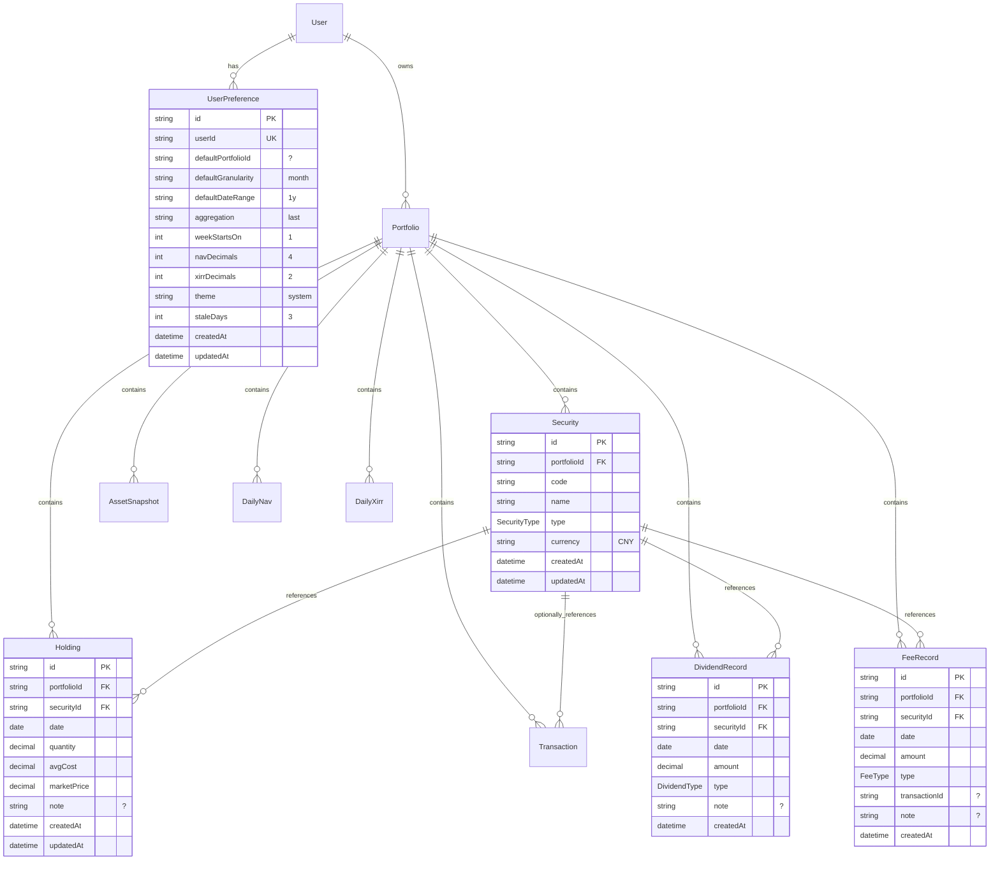
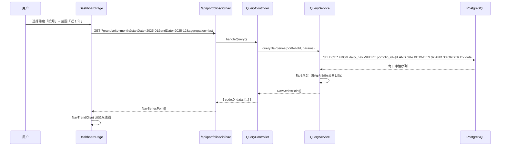
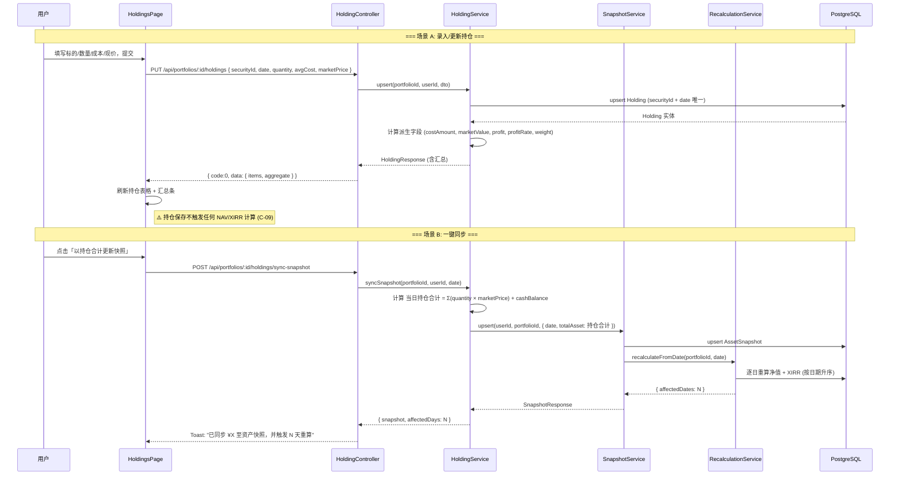
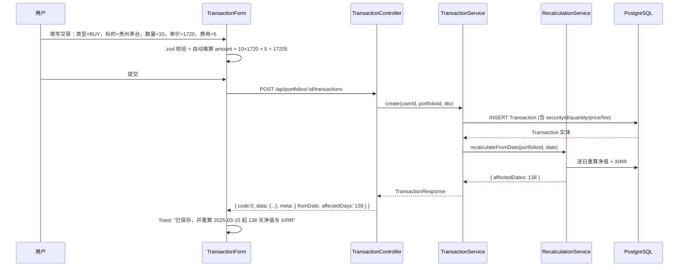
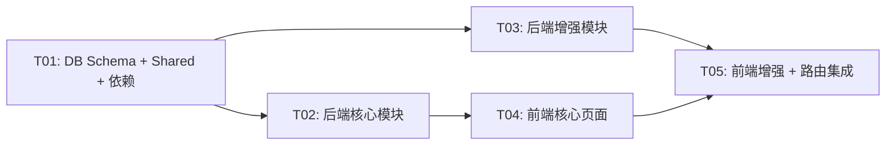

# 投资收益统计系统 — 五大模块架构设计文档

> **版本**: v1.0
> **作者**: 架构师 高见远（Bob）
> **日期**: 2026-08-01
> **依据**: `docs/PRD.md` v1.2 + `docs/archive/PRD-modules.md` v1.2
> **状态**: 待评审

---

## Part A：系统设计

### 1. 实现方案与框架选型

#### 1.1 整体分层架构

```
┌─────────────────────────────────────────────────────────────────┐
│                        Web Frontend                              │
│  Vite + React 18 + TS + Tailwind + shadcn/ui                     │
│  Zustand (状态) + TanStack Query (缓存) + ECharts (图表)          │
│  react-hook-form + zod (表单校验) + sonner (Toast)               │
├─────────────────────────────────────────────────────────────────┤
│                      REST API (HTTP)                             │
│           JWT Auth Header → NestJS Guard → Controller            │
├─────────────────────────────────────────────────────────────────┤
│                       NestJS Backend                              │
│  ┌──────────┬──────────┬──────────┬──────────┬──────────┐       │
│  │  Auth    │Portfolio │Transaction│Snapshot │ Holding  │       │
│  │  Module  │ Module   │  Module   │ Module  │ Module   │       │
│  ├──────────┼──────────┼──────────┼──────────┼──────────┤       │
│  │  Query   │Calculation│ Account  │Preference│  Upload  │       │
│  │  Module  │  Module   │ Module   │ Module   │  Module  │       │
│  └──────────┴──────────┴──────────┴──────────┴──────────┘       │
│                        Prisma ORM                                │
├─────────────────────────────────────────────────────────────────┤
│                     PostgreSQL 16                                │
│  新增表: securities, holdings, dividend_records, fee_records,    │
│          user_preferences                                        │
│  修改表: transactions (+4 可空字段), portfolios (+archivedAt)    │
└─────────────────────────────────────────────────────────────────┘
```

#### 1.2 核心架构决策

| 决策 | 选择 | 理由 |
|------|------|------|
| TransactionType 枚举 | **维持 BUY/SELL 两值不变** | C-10 约束，分红/费用独立建表 |
| 持仓数据隔离 | Holding 表**永不**被计算引擎读取 | C-08/C-09 约束，评审验收以全局搜索结果为 0 |
| 一键同步路径 | Holding → AssetSnapshot → recalculation | 走既有快照链路，不新写计算逻辑 |
| 偏好存储 | 列式存储（非 JSON） | Prisma 类型安全、可索引、字段可控（<15） |
| 成本口径 | 移动加权平均 + 手工录入 | 用户可直接抄券商 App，零学习成本 |
| 快照级联重算 | ✅ **已修复**（snapshot.service.ts:118 已调用 `recalculateFromDate`） | PRD-modules §8.2 声称的缺陷已不存在 |

#### 1.3 与现有模块的交互关系

```
新增/修改模块           依赖的现有模块          被依赖方
─────────────────────  ─────────────────────  ─────────────────────
HoldingModule          PrismaModule            Dashboard (间接)
                       SnapshotService         账户页 (间接)
                       RecalculationService

PreferenceModule       PrismaModule            Dashboard
                       AuthModule              设置页

AccountModule          PortfolioService        设置页 (摘要)
                       QueryService            账户页
                       AuthService

TransactionModule      现有 transaction/*      持仓 (securityId FK)
(扩展字段)             Security (新 FK)

Dashboard              现有 query/*            -
(增强)                 现有 snapshot/*
```

### 2. 文件列表

#### 2.1 后端新建文件 (`packages/backend/`)

```
# === Prisma ===
prisma/migrations/YYYYMMDDHHMMSS_add_holding_and_preference/
  migration.sql                                            # 🆕 迁移 SQL（自动生成）

# === Security 模块 ===
src/modules/security/
  security.module.ts                                       # 🆕
  security.controller.ts                                   # 🆕
  security.service.ts                                      # 🆕
  dto/create-security.dto.ts                               # 🆕
  dto/update-security.dto.ts                               # 🆕

# === Holding 模块 ===
src/modules/holding/
  holding.module.ts                                        # 🆕
  holding.controller.ts                                    # 🆕
  holding.service.ts                                       # 🆕
  dto/upsert-holding.dto.ts                                # 🆕
  dto/holding-query.dto.ts                                 # 🆕

# === Dividend / Fee 模块（归入 holding 目录） ===
src/modules/holding/
  dividend-record.service.ts                               # 🆕
  fee-record.service.ts                                    # 🆕
  dto/create-dividend-record.dto.ts                        # 🆕
  dto/create-fee-record.dto.ts                             # 🆕

# === Preference 模块 ===
src/modules/preference/
  preference.module.ts                                     # 🆕
  preference.controller.ts                                 # 🆕
  preference.service.ts                                    # 🆕
  dto/update-preference.dto.ts                             # 🆕

# === Overview（Dashboard 聚合接口） ===
src/modules/portfolio/
  portfolio-overview.service.ts                            # 🆕（或独立 overview 模块）

# === Account 统计 ===
src/modules/account/
  account.module.ts                                        # 🆕
  account.controller.ts                                    # 🆕
  account.service.ts                                       # 🆕

# === 导入导出 ===
src/modules/import-export/
  import-export.module.ts                                  # 🆕
  import-export.controller.ts                              # 🆕
  import-export.service.ts                                 # 🆕
  dto/import-options.dto.ts                                # 🆕
  dto/export-options.dto.ts                                # 🆕
  parsers/csv-parser.service.ts                            # 🆕
  writers/csv-writer.service.ts                            # 🆕
  templates/                                                # 🆕 模板文件目录

# === 数据管理 ===
src/modules/portfolio/
  portfolio-data.service.ts                                # 🆕（清空组合数据）
```

#### 2.2 后端修改文件

| 文件 | 修改原因 |
|------|---------|
| `prisma/schema.prisma` | 新增 Security / Holding / DividendRecord / FeeRecord / UserPreference 模型；Transaction 扩展 4 个可空字段；Portfolio 新增 archivedAt |
| `src/app.module.ts` | 注册 SecurityModule / HoldingModule / PreferenceModule / AccountModule / ImportExportModule |
| `src/modules/transaction/transaction.service.ts` | `create`/`update` 方法处理新增可选字段；`findAll` 扩展查询参数（types[]/securityId/sortBy/sortOrder） |
| `src/modules/transaction/transaction.controller.ts` | 扩展查询参数；DTO 新增可选字段 |
| `src/modules/transaction/dto/create-transaction.dto.ts` | 新增 securityId / quantity / price / fee 可选字段 |
| `src/modules/transaction/dto/update-transaction.dto.ts` | 同上 |
| `src/modules/query/query.controller.ts` | 新增 GET `/portfolios/:id/overview`（或独立 controller） |

#### 2.3 前端新建文件 (`packages/web/`)

```
# === API 层 ===
src/api/holding.api.ts                                     # 🆕 持仓 API 调用
src/api/preference.api.ts                                  # 🆕 偏好 API 调用
src/api/import-export.api.ts                               # 🆕 导入导出 API

# === 页面 ===
src/pages/holdings.tsx                                     # 🆕 持仓页
src/pages/account.tsx                                      # 🆕 账户页

# === Feature 组件 ===
src/features/holding/
  holdings-table.tsx                                       # 🆕
  holding-form.tsx                                         # 🆕
  security-dialog.tsx                                      # 🆕
  holdings-summary-bar.tsx                                 # 🆕
  snapshot-reconcile-banner.tsx                            # 🆕

src/features/dashboard/
  recent-transactions-card.tsx                             # 🆕
  portfolio-comparison-table.tsx                           # 🆕 (P1)
  stale-data-banner.tsx                                    # 🆕 (P1)

src/features/query/
  date-range-picker.tsx                                    # 🆕 (P1 提升至 P0)

src/features/account/
  user-profile-card.tsx                                    # 🆕
  asset-overview-card.tsx                                  # 🆕
  portfolio-list-card.tsx                                  # 🆕

src/features/settings/
  preference-form.tsx                                      # 🆕
  data-export-card.tsx                                     # 🆕
  data-import-dialog.tsx                                   # 🆕
  danger-zone-card.tsx                                     # 🆕

# === Hooks ===
src/hooks/use-holdings.ts                                  # 🆕
src/hooks/use-preferences.ts                               # 🆕
src/hooks/use-securities.ts                                # 🆕

# === Stores ===
src/stores/preference.store.ts                             # 🆕

# === Components ===
src/components/charts/allocation-donut-chart.tsx           # 🆕 (P1)
```

#### 2.4 前端修改文件

| 文件 | 修改原因 |
|------|---------|
| `src/lib/constants.ts` | ROUTE_PATH 新增 `/holdings`、`/account` |
| `src/App.tsx` | 注册新路由：HoldingsPage、AccountPage |
| `src/components/layout/sidebar.tsx` | 新增「持仓」「账户」导航项，调整顺序 |
| `src/pages/dashboard.tsx` | 6 卡片改造 + 维度切换器 + 近期交易卡片 + 空状态引导 |
| `src/pages/settings.tsx` | 账户区瘦身 + 偏好服务端化 + 数据管理落地 + 危险操作 |
| `src/pages/transactions.tsx` | 筛选/排序/分页组件 + 表格列扩展 |
| `src/features/transaction/transaction-form.tsx` | 新增标的/数量/单价/费用可选字段 |
| `src/features/transaction/transaction-list.tsx` | 扩展列 + 筛选条件 |
| `src/hooks/use-transactions.ts` | 查询参数扩展 |
| `src/api/transaction.api.ts` | 请求/响应类型扩展 |
| `src/api/types.ts` | 新增 DTO 类型 |

#### 2.5 Shared 包新建/修改

| 文件 | 修改内容 |
|------|---------|
| `packages/shared/src/types/security.ts` | 🆕 Security / SecurityType / Holding 类型 |
| `packages/shared/src/types/preference.ts` | 🆕 UserPreference 类型 |
| `packages/shared/src/types/dividend.ts` | 🆕 DividendRecord / DividendType |
| `packages/shared/src/types/fee.ts` | 🆕 FeeRecord / FeeType |
| `packages/shared/src/types/index.ts` | 导出新类型 |

### 3. 数据结构和接口

#### 3.1 Prisma Schema 新增（ER 图）



#### 3.2 Prisma Schema 增量变更

```prisma
// ==================== 新增枚举 ====================
enum SecurityType   { STOCK  FUND  BOND  CASH  OTHER }
enum DividendType   { CASH  STOCK_DIVIDEND }
enum FeeType        { COMMISSION  STAMP_TAX  OTHER }

// ==================== 新增模型 ====================
model Security {
  id          String       @id @default(uuid())
  portfolioId String       @map("portfolio_id")
  code        String
  name        String
  type        SecurityType @default(STOCK)
  currency    String       @default("CNY")
  createdAt   DateTime     @default(now()) @map("created_at")
  updatedAt   DateTime     @updatedAt @map("updated_at")

  portfolio Portfolio        @relation(fields: [portfolioId], references: [id], onDelete: Cascade)
  holdings  Holding[]
  dividends DividendRecord[]
  fees      FeeRecord[]

  @@unique([portfolioId, code])
  @@index([portfolioId])
  @@map("securities")
}

model Holding {
  id          String   @id @default(uuid())
  portfolioId String   @map("portfolio_id")
  securityId  String   @map("security_id")
  date        DateTime @db.Date
  quantity    Decimal  @db.Decimal(18, 6)
  avgCost     Decimal  @map("avg_cost")     @db.Decimal(18, 6)
  marketPrice Decimal  @map("market_price") @db.Decimal(18, 6)
  note        String?
  createdAt   DateTime @default(now()) @map("created_at")
  updatedAt   DateTime @updatedAt @map("updated_at")

  portfolio Portfolio @relation(fields: [portfolioId], references: [id], onDelete: Cascade)
  security  Security  @relation(fields: [securityId], references: [id], onDelete: Cascade)

  @@unique([securityId, date])
  @@index([portfolioId, date])
  @@map("holdings")
}

model DividendRecord {
  id          String       @id @default(uuid())
  portfolioId String       @map("portfolio_id")
  securityId  String       @map("security_id")
  date        DateTime     @db.Date
  amount      Decimal      @db.Decimal(18, 2)
  type        DividendType @default(CASH)
  note        String?
  createdAt   DateTime     @default(now()) @map("created_at")

  portfolio Portfolio @relation(fields: [portfolioId], references: [id], onDelete: Cascade)
  security  Security  @relation(fields: [securityId], references: [id], onDelete: Cascade)

  @@index([portfolioId, date])
  @@index([securityId, date])
  @@map("dividend_records")
}

model FeeRecord {
  id            String   @id @default(uuid())
  portfolioId   String   @map("portfolio_id")
  securityId    String   @map("security_id")
  date          DateTime @db.Date
  amount        Decimal  @db.Decimal(18, 2)
  type          FeeType  @default(OTHER)
  transactionId String?  @map("transaction_id")
  note          String?
  createdAt     DateTime @default(now()) @map("created_at")

  portfolio Portfolio @relation(fields: [portfolioId], references: [id], onDelete: Cascade)
  security  Security  @relation(fields: [securityId], references: [id], onDelete: Cascade)

  @@index([portfolioId, date])
  @@index([securityId, date])
  @@map("fee_records")
}

model UserPreference {
  id                 String   @id @default(uuid())
  userId             String   @unique @map("user_id")
  defaultPortfolioId String?  @map("default_portfolio_id")
  defaultGranularity String   @default("month") @map("default_granularity")
  defaultDateRange   String   @default("1y")    @map("default_date_range")
  aggregation        String   @default("last")
  weekStartsOn       Int      @default(1)       @map("week_starts_on")
  navDecimals        Int      @default(4)       @map("nav_decimals")
  xirrDecimals       Int      @default(2)       @map("xirr_decimals")
  theme              String   @default("system")
  staleDays          Int      @default(3)       @map("stale_days")
  createdAt          DateTime @default(now())   @map("created_at")
  updatedAt          DateTime @updatedAt        @map("updated_at")

  user User @relation(fields: [userId], references: [id], onDelete: Cascade)

  @@map("user_preferences")
}

// ==================== 修改现有模型 ====================

// Transaction 新增 4 个可空字段 + 索引
model Transaction {
  // ... 现有字段保持不变 ...
  securityId String?  @map("security_id")           // 🆕
  quantity   Decimal? @db.Decimal(18, 6)            // 🆕
  price      Decimal? @db.Decimal(18, 6)            // 🆕
  fee        Decimal? @db.Decimal(18, 2)            // 🆕

  security Security? @relation(fields: [securityId], references: [id], onDelete: SetNull)  // 🆕

  @@index([portfolioId, type])                       // 🆕
}
// TransactionType 枚举维持 BUY SELL 不变

// Portfolio 新增归档字段
model Portfolio {
  // ... 现有字段保持不变 ...
  archivedAt DateTime? @map("archived_at")           // 🆕 (P1)
}
```

#### 3.3 API 端点清单

##### 概览 (Overview)

| 方法 | 路径 | 说明 | 优先级 |
|------|------|------|--------|
| GET | `/api/portfolios/:id/overview` | 单组合概览：totalAsset / cumulativeNav / yearNav / xirr / netInvested / totalReturnRate / yearReturnRate / latestDate | P0 |
| GET | `/api/portfolios/summary` | 全部组合摘要列表（供概览页对比 + 账户页列表共用） | P0 |
| GET | `/api/portfolios/:id/metrics/drawdown` | 最大回撤 | P1 |

##### 持仓 (Holdings)

| 方法 | 路径 | 说明 | 优先级 |
|------|------|------|--------|
| GET | `/api/portfolios/:id/securities` | 标的列表 | P0 |
| POST | `/api/portfolios/:id/securities` | 新增标的 | P0 |
| PATCH | `/api/portfolios/:id/securities/:securityId` | 编辑标的 | P0 |
| DELETE | `/api/portfolios/:id/securities/:securityId` | 删除标的 | P0 |
| GET | `/api/portfolios/:id/holdings?date=&types=` | 持仓明细（含派生字段：市值/盈亏/盈亏率/占比） | P0 |
| PUT | `/api/portfolios/:id/holdings` | 持仓 upsert（单条或批量） | P0 |
| DELETE | `/api/portfolios/:id/holdings/:holdingId` | 删除单条持仓 | P0 |
| GET | `/api/portfolios/:id/holdings/dates` | 有持仓数据的日期列表 | P0 |
| POST | `/api/portfolios/:id/holdings/sync-snapshot` | 一键同步：持仓合计 → 资产快照 + 级联重算 | P0 |

##### 分红/费用 (Dividend/Fee)

| 方法 | 路径 | 说明 | 优先级 |
|------|------|------|--------|
| GET | `/api/portfolios/:id/dividends` | 分红列表 | P0 |
| POST | `/api/portfolios/:id/dividends` | 新增分红 | P0 |
| DELETE | `/api/portfolios/:id/dividends/:id` | 删除分红 | P0 |
| GET | `/api/portfolios/:id/fees` | 费用列表 | P0 |
| POST | `/api/portfolios/:id/fees` | 新增费用 | P0 |
| DELETE | `/api/portfolios/:id/fees/:id` | 删除费用 | P0 |

##### 交易 (Transactions) — 参数扩展

| 方法 | 路径 | 说明 | 优先级 |
|------|------|------|--------|
| GET | `/api/portfolios/:id/transactions?types[]=&securityId=&sortBy=&sortOrder=` | 扩展筛选/排序参数 | P0 |
| POST | `/api/portfolios/:id/transactions/import` | CSV 批量导入 | P1 |
| GET | `/api/portfolios/:id/transactions/export` | CSV 导出 | P1 |
| POST | `/api/portfolios/:id/transactions/batch-delete` | 批量删除 | P1 |

##### 账户 (Account)

| 方法 | 路径 | 说明 | 优先级 |
|------|------|------|--------|
| GET | `/api/auth/profile` | 用户信息（已有） | P0 |
| GET | `/api/account/stats` | 账户统计（交易笔数/快照天数/起止日期/使用天数） | P1 |

##### 偏好 (Preferences)

| 方法 | 路径 | 说明 | 优先级 |
|------|------|------|--------|
| GET | `/api/users/preferences` | 获取偏好 | P0 |
| PATCH | `/api/users/preferences` | 更新偏好 | P0 |

##### 导入导出 (Import/Export)

| 方法 | 路径 | 说明 | 优先级 |
|------|------|------|--------|
| GET | `/api/portfolios/:id/export?types=` | 导出（交易/快照/净值/XIRR 多选） | P0 |
| POST | `/api/portfolios/:id/import` | 导入（multipart CSV） | P0 |
| GET | `/api/templates/:type` | 下载导入模板 | P0 |
| DELETE | `/api/portfolios/:id/data` | 清空组合数据（危险操作） | P0 |

#### 3.4 后端 DTO 关键定义

```typescript
// === CreateTransactionDto 扩展 ===
export class CreateTransactionDto {
  @IsDateString() date!: string;
  @IsEnum(TransactionType) type!: TransactionType;
  @IsDecimal({ decimal_digits: '0,2' }) amount!: string;
  @IsOptional() @IsUUID() securityId?: string;      // 🆕
  @IsOptional() @IsDecimal({ decimal_digits: '0,6' }) quantity?: string;  // 🆕
  @IsOptional() @IsDecimal({ decimal_digits: '0,6' }) price?: string;     // 🆕
  @IsOptional() @IsDecimal({ decimal_digits: '0,2' }) fee?: string;       // 🆕
  @IsOptional() @IsString() note?: string;
}

// === Holding (upsert 请求体) ===
export class UpsertHoldingDto {
  @IsDateString() date!: string;
  @IsUUID() securityId!: string;
  @IsDecimal({ decimal_digits: '0,6' }) quantity!: string;
  @IsDecimal({ decimal_digits: '0,6' }) avgCost!: string;
  @IsDecimal({ decimal_digits: '0,6' }) marketPrice!: string;
  @IsOptional() @IsString() note?: string;
}

// === Holding 响应（含派生字段） ===
export interface HoldingResponse {
  id: string;
  securityId: string;
  securityName: string;
  securityCode: string;
  securityType: SecurityType;
  date: string;
  quantity: string;
  avgCost: string;
  marketPrice: string;
  costAmount: string;       // 派生: quantity × avgCost
  marketValue: string;      // 派生: quantity × marketPrice
  profit: string;           // 派生: marketValue − costAmount
  profitRate: string;       // 派生: profit / costAmount
  weight: string;           // 派生: marketValue / ΣmarketValue
  note: string | null;
}
```

#### 3.5 前端 TypeScript 类型扩展

```typescript
// shared/src/types/security.ts
export const SecurityType = { STOCK:'STOCK', FUND:'FUND', BOND:'BOND', CASH:'CASH', OTHER:'OTHER' } as const;
export type SecurityType = typeof SecurityType[keyof typeof SecurityType];

export interface Security {
  id: string; portfolioId: string; code: string; name: string;
  type: SecurityType; currency: string; createdAt: string; updatedAt: string;
}

export interface HoldingResponse {
  id: string; securityId: string; securityName: string; securityCode: string;
  securityType: SecurityType; date: string;
  quantity: string; avgCost: string; marketPrice: string;
  costAmount: string; marketValue: string; profit: string;
  profitRate: string; weight: string; note: string | null;
}

export interface HoldingsAggregate {
  date: string; totalMarketValue: string; totalCost: string;
  totalProfit: string; totalProfitRate: string; securityCount: number;
  cashBalance: string;                     // 🆕 手工录入现金余额
  combinedTotal: string;                   // 🆕 totalMarketValue + cashBalance
}

// shared/src/types/preference.ts
export interface UserPreference {
  defaultPortfolioId: string | null; defaultGranularity: string;
  defaultDateRange: string; aggregation: string; weekStartsOn: number;
  navDecimals: number; xirrDecimals: number; theme: string; staleDays: number;
}
```

### 4. 程序调用流程

#### 4.1 净值查询流程



#### 4.2 持仓管理流程



#### 4.3 交易录入流程



#### 4.4 概览数据聚合流程

```mermaid
sequenceDiagram
    participant D as DashboardPage
    participant OV as GET /portfolios/:id/overview
    participant POV as PortfolioOverviewService
    participant DB as PostgreSQL

    D->>OV: GET (首次加载)
    OV->>POV: getOverview(portfolioId)
    par 并行查询
        POV->>DB: SELECT totalAsset, date FROM asset_snapshots ORDER BY date DESC LIMIT 1
        POV->>DB: SELECT * FROM daily_nav ORDER BY date DESC LIMIT 1
        POV->>DB: SELECT * FROM daily_xirr ORDER BY date DESC LIMIT 1
        POV->>DB: SELECT SUM(CASE WHEN type='BUY' THEN amount ELSE 0 END) - SUM(CASE WHEN type='SELL' THEN amount ELSE 0 END) FROM transactions
    end
    DB-->>POV: 当前总资产 + 最新净值 + 最新XIRR + 净投入
    POV->>POV: 计算 totalReturnRate = cumulativeNav - 1; yearReturnRate = yearNav - 1
    POV-->>OV: OverviewResponse
    OV-->>D: { totalAsset, cumulativeNav, yearNav, xirr, netInvested, totalReturnRate, yearReturnRate, latestDate }
    D->>D: 渲染 6 张 StatCard
```

#### 4.5 前端路由结构

```
/                         → DashboardPage（概览）
/holdings                 → HoldingsPage（持仓）
/transactions             → TransactionsPage（交易）
/snapshots                → SnapshotsPage（快照）
/analysis/xirr            → XirrAnalysisPage（收益分析）
/analysis/nav             → NavAnalysisPage（净值分析）
/account                  → AccountPage（账户）
/settings                 → SettingsPage（设置）
/login                    → LoginPage
/register                 → RegisterPage
*                         → NotFoundPage
```

---

## Part B：任务分解

### 5. 依赖包列表

**后端 (packages/backend/package.json)**：

```
- @nestjs/platform-express  — 已有
- @prisma/client             — 已有
- multer                     — 🆕 文件上传（CSV 导入）
- csv-parse                  — 🆕 CSV 解析
- csv-stringify              — 🆕 CSV 写入
- archiver                   — 🆕 多文件 zip 打包
```

**前端 (packages/web/package.json)**：

```
- @tanstack/react-query      — 已有
- zustand                    — 已有
- react-hook-form            — 已有
- zod                        — 已有
- echarts                    — 已有
- echarts-for-react          — 🆕 ECharts React 封装（热力图）
- sonner                     — 已有
- date-fns                   — 🆕 日期处理（date-range-picker）
- cmdk                       — 🆕 shadcn/ui Command（标的搜索下拉）
```

**Shared (packages/shared/package.json)**：

```
- 无需新增，仅扩展现有类型文件
```

### 6. 任务列表（按实现顺序）

| 编号 | 任务名称 | 涉及文件 | 依赖 | 优先级 |
|------|---------|---------|------|--------|
| **T01** | **DB Schema 迁移 + Shared 类型 + 包依赖** | `prisma/schema.prisma`（新增 Security/Holding/DividendRecord/FeeRecord/UserPreference；扩展 Transaction/Portfolio）、`shared/src/types/security.ts`（🆕）、`shared/src/types/preference.ts`（🆕）、`shared/src/types/dividend.ts`（🆕）、`shared/src/types/fee.ts`（🆕）、`shared/src/types/index.ts`、`shared/src/types/transaction.ts`、`backend/package.json`、`web/package.json` | — | P0 |
| **T02** | **后端核心模块：持仓 + 偏好 + 概览 API + 导入导出** | `backend/src/modules/security/*`（🆕 全量）、`backend/src/modules/holding/*`（🆕 全量，含 dividend/fee service）、`backend/src/modules/preference/*`（🆕 全量）、`backend/src/modules/portfolio/portfolio-overview.service.ts`（🆕）、`backend/src/modules/import-export/*`（🆕 全量）、`backend/src/modules/portfolio/portfolio-data.service.ts`（🆕）、`backend/src/app.module.ts` | T01 | P0 |
| **T03** | **后端增强：Transaction 扩展 + Query 增强 + Account 统计** | `backend/src/modules/transaction/transaction.service.ts`、`backend/src/modules/transaction/transaction.controller.ts`、`backend/src/modules/transaction/dto/create-transaction.dto.ts`、`backend/src/modules/transaction/dto/update-transaction.dto.ts`、`backend/src/modules/query/query.controller.ts`、`backend/src/modules/account/*`（🆕 全量）、`backend/src/app.module.ts` | T01 | P0 |
| **T04** | **前端核心页面：概览增强 + 持仓页 + 账户页** | `web/src/pages/dashboard.tsx`、`web/src/pages/holdings.tsx`（🆕）、`web/src/pages/account.tsx`（🆕）、`web/src/features/holding/*`（🆕 全量 6 组件）、`web/src/features/dashboard/recent-transactions-card.tsx`（🆕）、`web/src/features/dashboard/portfolio-comparison-table.tsx`（🆕）、`web/src/features/dashboard/stale-data-banner.tsx`（🆕）、`web/src/features/query/date-range-picker.tsx`（🆕）、`web/src/features/account/*`（🆕 全量 3 组件）、`web/src/hooks/use-holdings.ts`（🆕）、`web/src/hooks/use-securities.ts`（🆕）、`web/src/hooks/use-preferences.ts`（🆕）、`web/src/stores/preference.store.ts`（🆕）、`web/src/api/holding.api.ts`（🆕）、`web/src/api/preference.api.ts`（🆕）、`web/src/api/import-export.api.ts`（🆕）、`web/src/api/types.ts` | T02 | P0 |
| **T05** | **前端增强 + 路由集成：设置页改造 + 交易页增强 + 路由/侧栏整合** | `web/src/pages/settings.tsx`、`web/src/pages/transactions.tsx`、`web/src/features/settings/*`（🆕 全量 4 组件）、`web/src/features/transaction/transaction-form.tsx`、`web/src/features/transaction/transaction-list.tsx`、`web/src/hooks/use-transactions.ts`、`web/src/api/transaction.api.ts`、`web/src/lib/constants.ts`、`web/src/App.tsx`、`web/src/components/layout/sidebar.tsx`、`web/src/components/charts/allocation-donut-chart.tsx`（🆕 P1） | T04 | P0 |

### 7. 任务依赖图



### 8. 共享知识

#### 8.1 跨文件常量与约定

```
# === API 响应格式 ===
所有 API 响应统一: { code: 0, data: T, message?: string }
错误响应: { code: number, message: string }
分页响应: { code: 0, data: { items: T[], total: number, page: number, pageSize: number } }

# === 金额精度 ===
金额: DECIMAL(18,2), 以 string 传输（避免 JSON 精度丢失）
净值: DECIMAL(12,6), 展示取 4 位
份额/数量: DECIMAL(18,6), 展示取 2 位
XIRR: DECIMAL(20,8), 展示百分比 2 位

# === 日期格式 ===
API 传输: YYYY-MM-DD (string)
DB 存储: DateTime @db.Date (PostgreSQL date 类型)
前端展示: 本地化格式，通过 date-fns format

# === 命名规范 ===
后端 Controller: 已有 {entity}.controller.ts 模式，新增保持一致
后端 Service: {entity}.service.ts
DTO: create-{entity}.dto.ts / update-{entity}.dto.ts / {entity}-query.dto.ts
前端页面: pages/{entity}.tsx
前端 Feature: features/{entity}/{component-name}.tsx
前端 Hook: hooks/use-{entity}.ts
前端 API: api/{entity}.api.ts

# === 颜色约定（A股涨跌色） ===
正收益 / 买入 / 上涨: 红色 (#ef4444)
负收益 / 卖出 / 下跌: 绿色 (#22c55e)
shadcn/ui Tailwind: text-red-500 / text-green-500

# === 数据隔离 ===
所有后端 Controller 必须通过 @UseGuards(JwtAuthGuard)
所有 Service 方法接收 userId: string 参数
查询条件始终包含 userId 过滤: WHERE portfolio.userId = $userId

# === 空状态处理 ===
每个页面/组件必须覆盖四态: loading / empty / error / data
- loading: <Skeleton /> 或 <Loader2 className="animate-spin" />
- empty: 友好文案 + 引导操作按钮
- error: 错误消息 + 重试按钮
- data: 正常渲染

# === 存量缺陷确认 ===
PRD-modules §8.2 声称 snapshot.upsert() 覆盖历史快照时"只重算当日、未做级联重算"。
经代码审查确认: snapshot.service.ts:118 已调用 recalculateFromDate(portfolioId, date)，
该缺陷已在前序迭代修复。sync-snapshot 直接复用现有 snapshot.upsert() 即可。

# === 持仓-计算引擎隔离验收 ===
评审时在以下 4 个 service 中全局搜索 Holding/HoldingSnapshot/HoldingPosition/
DividendRecord/FeeRecord 五关键词，搜索结果必须为 0:
- nav.service.ts
- xirr.service.ts
- calculation.service.ts
- recalculation.service.ts
```

### 9. 待明确事项

| 编号 | 问题 | 影响 | 建议 |
|------|------|------|------|
| U-01 | **GET /api/portfolios/summary 优先级**：PRD-modules 标注为 DASH-P1-01 (P1)，但 ACC-P0-03/P0-04 也依赖它。 | 若严格按 P1 排期，账户页 P0 功能会阻塞 | **建议提到 P0**，在 T02 中一并实现 |
| U-02 | **现金余额字段归属**：D-04 决定"在持仓模块手工录入现金余额"，但未明确是 Holding 表的字段还是独立存储 | Holding 模型设计 | **建议在 HoldingsAggregate 响应中体现**，不单独建表。前端在持仓汇总条旁提供输入框，其值仅用于前端合计展示和 sync-snapshot 时传参 |
| U-03 | **导入重算策略**：导入大量交易后是否一次性触发全量重算 | 用户体验与性能 | **建议导入完成后一次性调用 recalculateAll**（而非逐笔），与 TXN-P1-01 验收标准一致 |
| U-04 | **CSV 导出 zip 打包**：是否需要 archiver 依赖 | 包体积 | `archiver` + 内置 `zlib` 可满足需求，约增加 50KB |
| U-05 | **ECharts 热力图**：PRD-modules 提到月度收益热力图，是否需要 ECharts | 依赖引入 | Recharts 不自带热力图，建议引入 `echarts-for-react`（按需加载，不增加首屏体积）。**【INC-CHART-01 更新】已收敛为 ECharts 单库，Recharts 已移除。** |
| U-06 | **date-range-picker 组件选型**：shadcn/ui 无内置 DateRangePicker | 开发工作量 | 建议基于 `date-fns` + shadcn/ui `Popover` + `Calendar` 自行组装，或引入 `react-day-picker`（shadcn/ui 官方推荐） |
| U-07 | **snapshot.upsert 已做级联重算**：PRD-modules §8.2 声称的缺陷不存在 | 设计文档准确性 | 已在本架构文档中标注确认，sync-snapshot 直接复用 |
| U-08 | **技术风险：Prisma 迁移向后兼容** | 迁移失败会导致存量数据不可用 | 所有新增字段全部 nullable，`prisma migrate dev` 在测试环境先跑一遍确认无报错 |

---

> **文档结束** | 架构师 高见远（Bob） | 如需进一步澄清，请在评审中提出
