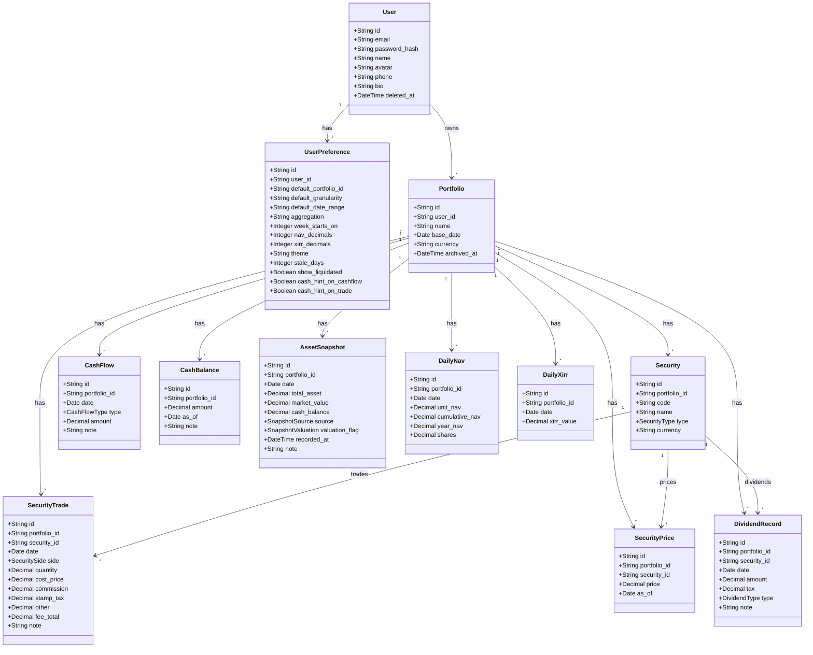
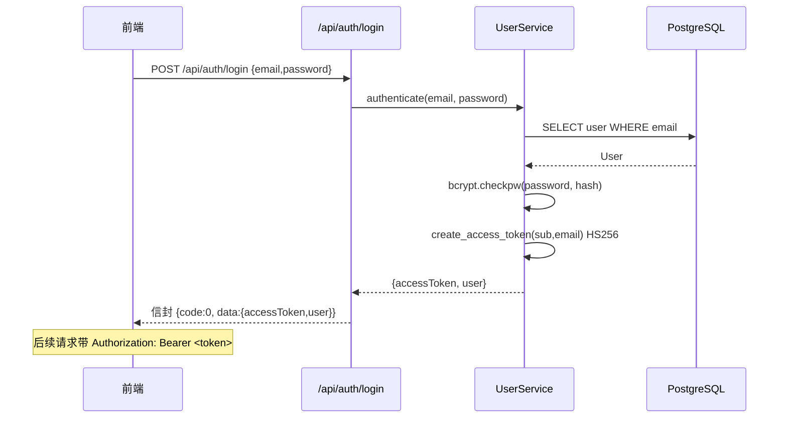
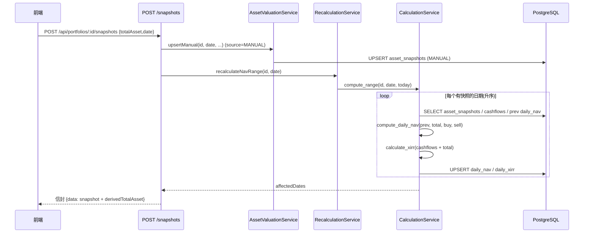
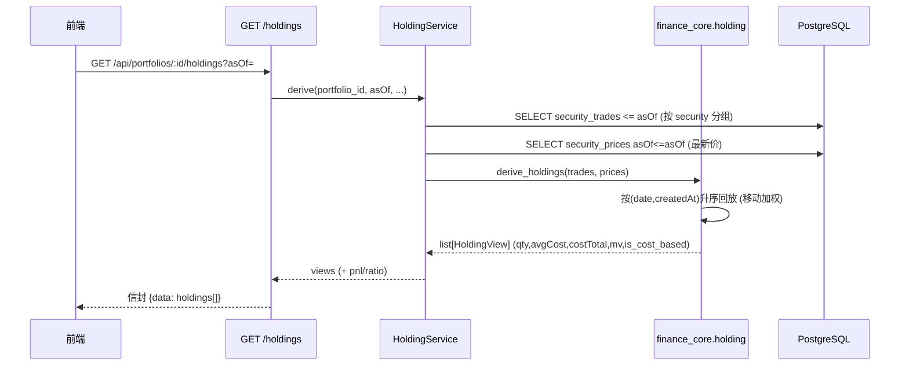
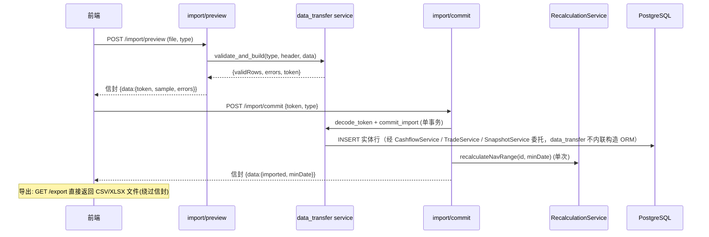

# 投资收益统计系统 — 架构设计文档（Canonical）

> 本文档是 **Python 重建项目 `investment_return_tracker`** 的架构唯一真相源（Canonical）。
> 上游参考源：`../app/docs/ARCHITECTURE.md`（NestJS + Prisma 原版，**只读参考，绝不动它**）。
> 本项目的后端为 **FastAPI + SQLAlchemy 2.0 + Alembic + PyJWT + bcrypt + pyxirr**，前端为 **Vite + React 18 + TypeScript + Tailwind + shadcn/ui + ECharts**。
> 金融口径（方案 B：交易明细法）、XIRR/净值口径沿用上游设计，但技术栈与数据模型已按真实代码纠正。
>
> 本文档聚焦**系统架构、模块职责、数据模型**，不含更新记录（changelog）与决策记录（decision log）。内容以 `docs/PRD.md` 为权威；凡与 PRD 冲突处一律以 PRD 为准。

## 目录

1. 架构总览
2. 技术栈最终确认表
3. 数据库设计
4. API 接口设计
5. 核心数据结构
6. 核心流程时序图
7. XIRR 与净值计算模块设计
8. 总资产派生层（方案 B 核心）
9. 持仓推导引擎（方案 B · 交易明细法）
10. 前端架构设计
13. REG-01~06 架构支撑与验收点（P0 强制门禁）
15. 依赖包列表
16. 共享知识（跨文件约定）
19. 附录 B：头像上传模块

> 说明：原 §11（架构裁决）、§12（Migration 决策）、§14（任务列表）、§17（待明确事项）、§18（HarmonyOS APP 端）为决策记录 / 实现追溯 / 已移除范围，已按清理要求整段删除。

---

## 1. 架构总览

### 1.1 系统架构图

```
┌──────────────────────────────────────────────────────────────┐
│  Web 前端 (Vite + React 18 + TS + Tailwind + shadcn/ui + ECharts)│
│  pages / features / components(charts) / hooks / stores / api   │
└───────────────────────────┬──────────────────────────────────┘
                              │  HTTPS · /api 前缀 · JWT Bearer
                              │  统一信封 { code, data, message }
┌───────────────────────────▼──────────────────────────────────┐
│  FastAPI 应用 (uvicorn)                                         │
│  ├─ routers/      API 路由层（get_portfolio 归属隔离 / 分页）      │
│  ├─ services/     业务逻辑层（calculation / recalculation /        │
│  │                asset_valuation / holding / aggregation /       │
│  │                data_transfer / user）                          │
│  ├─ finance_core/ 纯函数计算内核（xirr / nav / holding）           │
│  ├─ core/         security(JWT+bcrypt) / envelope / exceptions /  │
│  │                enums / config                                  │
│  ├─ schemas.py    请求体 DTO（金额统一 DecimalStr）               │
│  └─ schemas_resp.py 响应体 DTO（*Out）                            │
└───────────┬───────────────────────────────┬────────────────────┘
            │ SQLAlchemy 2.0 async            │
┌───────────▼────────────┐          ┌─────────▼─────────────────┐
│  ORM (SQLAlchemy 2.0)  │          │  Alembic 迁移              │
│  models/ (12 表+6 枚举) │          │  1 个初始迁移落地 schema     │
└───────────┬────────────┘          └────────────────────────────┘
            │ asyncpg
┌───────────▼────────────┐
│  PostgreSQL (pg)        │
│  UUID PK · NUMERIC 精度 │
└────────────────────────┘
```

### 1.2 分层说明

| 层 | 目录 | 职责 |
|----|------|------|
| 表现 / API | `web/` + `backend/app/routers/` | 前端页面与交互；后端路由负责参数校验、归属隔离、编排 service、返回信封数据 |
| 业务逻辑 | `backend/app/services/` | **唯一**业务规则落点。含 10 个资源 Service（Cashflow/Security/Trade/Price/CashBalance/Snapshot/Dividend/Portfolio/Preference/Upload，均继承 `PortfolioChildService` 基类做归属 404 / 枚举 coerce / 分页去重）+ 领域/聚合 Service（Recalculation/AssetValuation/Holding/Calculation/Aggregation/DataTransfer/User） |
| 计算内核 | `backend/app/finance_core/` | 无副作用纯函数：XIRR（pyxirr）、净值（单位份额法）、持仓推导（交易回放） |
| ORM / 模型 | `backend/app/models/` + `backend/app/db/` | SQLAlchemy 2.0 async 声明模型；`Base` / `pk_uuid()` / `TimestampMixin` |
| 基础设施 | `backend/app/core/` | JWT 鉴权、统一信封、异常→信封、业务错误码、配置 |
| 持久化 | PostgreSQL + Alembic | 关系存储；Schema 经 Alembic 演进（初始迁移已落地） |

> 计算内核只读 `AssetSnapshot`（派生层结果），不直接碰持仓 / 现价 / 现金（单一写入方约束，见 §8）。

### 1.3 目录结构（后端）

```
backend/app/
├── main.py              # 入口：路由注册、CORS、全局异常→信封、OpenAPI 注入 Bearer、静态挂载
├── core/                # config / enums / exceptions / envelope / security / date_utils / types
├── db/                  # database(engine/session) + base(Base, pk_uuid, mixins)
├── models/              # SQLAlchemy 2.0 模型（12 表 + 6 枚举）
│   ├── enums.py  user.py  portfolio.py  security.py
│   ├── cashflow.py  snapshot.py  calc.py  dividend.py
├── schemas.py           # 请求体 Pydantic DTO（金额统一 DecimalStr）
├── schemas_resp.py      # 响应体 Pydantic DTO（*Out，OpenAPI 单一真相源）
├── finance_core/        # 纯函数：xirr.py / nav.py / holding.py
├── services/            # 资源 Service(10): cashflow / security / trade / price
│                       #   / cashbalance / snapshot / dividend / portfolio
│                       #   / preference / upload + 基类 base(PortfolioChildService)
│                       #   + 领域/聚合: calculation / holding / asset_valuation
│                       #   / recalculation / aggregation / data_transfer / user
└── routers/             # 薄委托层：参数校验 + 归属隔离 + 调 service + 信封
                        #   health / auth / portfolios / aggregation / data(6 子路由)
                        #   / dividend / calc / data_transfer / preference / upload / common
```

---

## 2. 技术栈最终确认表

| 层 | 技术 |
|----|------|
| 后端框架 | FastAPI（异步，`EnvelopeRoute` 自定义路由类包裹信封）+ uvicorn |
| ORM | SQLAlchemy 2.0 async + asyncpg 驱动；Alembic 迁移 |
| 认证 | PyJWT（HS256）+ bcrypt（cost=10，直接调用 `bcrypt` 库，不依赖 passlib） |
| 计算内核 | `finance_core` 纯函数；XIRR 委托 `pyxirr`（guess=0.1，ACT/365）；净值单位份额法 |
| 序列化 | Pydantic v2；`Decimal` → **字符串**（金额精度 / 类型对齐） |
| 文件处理 | `python-multipart`（头像上传表单）；`openpyxl`（XLSX 导入导出） |
| 前端框架 | Vite + React 18 + TypeScript |
| 样式 / 组件 | Tailwind CSS + shadcn/ui（基于 Radix UI） |
| 图表 | ECharts 5（`echarts-for-react` 封装） |
| 状态管理 | Zustand（客户端 UI 态：auth / portfolio / preference）；TanStack Query（服务端数据） |
| 请求层 | axios（拦截器注入 JWT + 解包信封）；React Hook Form + Zod（表单） |
| 类型来源 | `docs/openapi.json` 经 `web/scripts/gen-api-types.py`（等价 openapi-typescript）生成 `web/src/types/api.ts` |
| 测试 | 后端 pytest + pytest-asyncio + httpx（TestClient）；前端 Vitest + Testing Library |

> 已彻底移除：NestJS / Prisma / TypeScript 后端栈 / @prisma/client / 原 shared 工作区包（曾改为 web 本地 `shared/index.ts` 垫片，已于 2026-08-09 退役，收敛到 `web/src/lib/types.ts`）。

---

## 3. 数据库设计（CRITICAL · 方案 B）

### 3.1 数据模型完整定义（真实态 · SQLAlchemy 2.0）

> 共 **12 张表 + 6 个 PostgreSQL 原生枚举**。所有表名 snake_case 复数；UUID 主键由库端 `gen_random_uuid()` 生成；`created_at` / `updated_at` 由 `TimestampMixin` 维护；软删除仅 `users.deleted_at`。

#### 3.1.1 用户与偏好

| 表 | 字段 | 类型 | 约束 | 说明 |
|----|------|------|------|------|
| `users` | id | String(36) UUID | PK | UUID 主键 |
| | email | String(255) | UNIQUE, NOT NULL | 登录账号 |
| | password_hash | String(255) | NOT NULL | bcrypt 哈希 |
| | name | String(255) | NULL | 显示名 |
| | avatar | String(512) | NULL | 头像 URL（相对路径 `/api/uploads/avatar/...`） |
| | phone | String(20) | NULL | |
| | bio | String(200) | NULL | |
| | deleted_at | DateTime tz | NULL | 软删除（注销冷静期） |
| `user_preferences` | id | String(36) UUID | PK | |
| | user_id | String(36) | UNIQUE FK→users.id CASCADE | 全站唯一偏好 |
| | default_portfolio_id | String(36) | NULL | 默认组合 |
| | default_granularity | String(20) | default 'month' | 默认粒度（day/week/month/year） |
| | default_date_range | String(20) | default '1y' | 默认范围（7 项：`1w/1m/3m/6m/1y/ytd/all`） |
| | aggregation | String(20) | default 'last' | last / avg |
| | week_starts_on | Integer | default 1 | 0=周日 / 1=周一 |
| | nav_decimals | Integer | default 4 | 净值展示小数位 |
| | xirr_decimals | Integer | default 2 | XIRR 百分比小数位 |
| | theme | String(20) | default 'system' | system/light/dark |
| | stale_days | Integer | default 3 | 数据新鲜度阈值 |
| | show_liquidated | Boolean | default false | 持仓列表「显示已清仓」开关初值 |
| | cash_hint_on_cashflow / cash_hint_on_trade | Boolean | default true | 出入金后 / 买卖后现金余额软提示开关 |

> `user_preferences` 字段集严格对齐 PRD §6.9.1（`SET-P0-02`）；新增字段一律可空（PRD C-05 向后兼容）。

#### 3.1.2 组合与证券

| 表 | 字段 | 类型 | 约束 | 说明 |
|----|------|------|------|------|
| `portfolios` | id | String(36) UUID | PK | |
| | user_id | String(36) | FK→users.id CASCADE | 归属用户 |
| | name | String(255) | NOT NULL | 组合名 |
| | description | Text | NULL | |
| | base_date | Date | NULL | 基准日（首笔存入日，设后不可改） |
| | currency | String(10) | default 'CNY' | 币种 |
| | archived_at | DateTime tz | NULL | 归档时间 |
| `securities` | id | String(36) UUID | PK | |
| | portfolio_id | String(36) | FK→portfolios.id CASCADE | |
| | code | String(64) | NOT NULL | 代码 |
| | name | String(50) | NOT NULL | 名称（≤ 50 字） |
| | type | Enum(SecurityType) | NOT NULL default STOCK | 证券类型 |
| | currency | String(10) | default 'CNY' | |
| | (UNIQUE(portfolio_id, code)) | | | 同组合代码唯一 |

#### 3.1.3 交易 / 价格 / 出入金 / 现金

| 表 | 字段 | 类型 | 约束 | 说明 |
|----|------|------|------|------|
| `security_trades` | id | String(36) UUID | PK | |
| | portfolio_id | String(36) | FK→portfolios.id CASCADE | |
| | security_id | String(36) | FK→securities.id CASCADE | |
| | date | Date | NOT NULL | 成交日 |
| | side | Enum(SecuritySide) | NOT NULL | 买卖方向（BUY_SEC / SELL_SEC） |
| | quantity | Numeric(18,6) | NOT NULL | 数量（始终 > 0） |
| | cost_price | Numeric(18,6) | NOT NULL | 含费单价 |
| | fee_total | Numeric(18,2) | default 0 | 费用合计（= 佣金 + 印花税 + 其他） |
| | commission / stamp_tax / other | Numeric(18,2) | default 0 | 费用分项 |
| | note | Text | NULL | |
| `security_prices` | id | String(36) UUID | PK | |
| | portfolio_id / security_id | String(36) | FK CASCADE | |
| | price | Numeric(18,6) | NOT NULL | 最新价 |
| | as_of | Date | NOT NULL | 价格日期（向前沿用） |
| `cashflows` | id | String(36) UUID | PK | |
| | portfolio_id | String(36) | FK→portfolios.id CASCADE | |
| | date | Date | NOT NULL | |
| | type | Enum(CashFlowType) | NOT NULL | **XIRR 现金流唯一来源**（BUY 负 / SELL 正） |
| | amount | Numeric(18,2) | NOT NULL | |
| | note | Text | NULL | 备注 |
| `cash_balances` | id | String(36) UUID | PK | |
| | portfolio_id | String(36) | FK→portfolios.id CASCADE | |
| | amount | Numeric(18,2) | NOT NULL | 现金余额 |
| | as_of | Date | NOT NULL | 余额日期（向前沿用） |
| | note | Text | NULL | 备注 |

> `fee_records` 表已物理并入 `security_trades`（分项费用收进 `commission`/`stampTax`/`other`/`fee_total`），不单独建表；费用不进现金流、不回冲成本（PRD C-08 / C-09）。

#### 3.1.4 派生结果（每日唯一）

| 表 | 字段 | 类型 | 约束 | 说明 |
|----|------|------|------|------|
| `asset_snapshots` | id | String(36) UUID | PK | |
| | portfolio_id | String(36) | FK→portfolios.id CASCADE | |
| | date | Date | NOT NULL | |
| | total_asset | Numeric(18,2) | NOT NULL | 总资产（市值+现金） |
| | market_value | Numeric(18,2) | NULL | 市值 |
| | cash_balance | Numeric(18,2) | NULL | 现金 |
| | source | Enum(SnapshotSource) | NOT NULL | DERIVED / MANUAL |
| | valuation_flag | Enum(SnapshotValuation) | NOT NULL | 估值标记 |
| | recorded_at | DateTime tz | NOT NULL | 记录写入时间 |
| | note | Text | NULL | 备注（手工记录强提示填写） |
| | (UNIQUE(portfolio_id, date)) | | | **每日唯一全局不变量（不含 source）** |
| `daily_nav` | id / portfolio_id / date | — | UNIQUE(portfolio_id, date) | |
| | unit_nav / cumulative_nav / year_nav | Numeric(12,6) | NOT NULL | 单位 / 累计 / 当年净值 |
| | shares | Numeric(18,6) | NOT NULL | 份额 |
| | base_cumulative_nav | Numeric(12,6) | NULL | 年度基准累计净值 |
| `daily_xirr` | id / portfolio_id / date | — | UNIQUE(portfolio_id, date) | |
| | xirr_value | Numeric(20,8) | NULL | 年化收益率（可空=不可计算） |
| `dividend_records` | id / portfolio_id | — | | |
| | security_id | String(36) | FK→securities.id CASCADE | |
| | date | Date | NOT NULL | |
| | amount / tax | Numeric(18,2) | NULL default 0(tax) | 分红额 / 税（tax 可选，空视为 0） |
| | type | Enum(DividendType) | default CASH | |
| | note | Text | NULL | **不参与收益计算** |

#### 3.1.5 6 个枚举（PostgreSQL 原生枚举，与上游 Prisma 类型名一致）

| 枚举 | 值 |
|------|----|
| `CashFlowType` | BUY, SELL |
| `SecurityType` | STOCK, FUND, BOND, OTHER, CASH |
| `SecuritySide` | BUY_SEC, SELL_SEC |
| `SnapshotSource` | DERIVED, MANUAL |
| `SnapshotValuation` | EXACT, CARRIED_FORWARD, COST_BASED, MANUAL_INPUT |
| `DividendType` | CASH, STOCK_DIVIDEND |

> 枚举定义：`backend/app/models/enums.py`（Python `str, enum.Enum`）；SQLAlchemy 以 `native_enum=True` 创建原生 PG 枚举类型。`CASH` 枚举值保留（避免破坏性迁移）但标注 `@deprecated`，新建标的隐藏该选项。

### 3.2 设计要点说明

#### 3.2.1 多组合关联

```
User (1) ──< Portfolio (N)
   ├──< CashFlow (N)         出入金（XIRR 现金流唯一来源）
   ├──< Security (N)
   │     ├──< SecurityTrade (N)   证券买卖流水（持仓推导唯一来源）
   │     └──< SecurityPrice (N)   最新价（向前沿用）
   ├──< CashBalance (N)      现金余额（独立、零联动）
   ├──< AssetSnapshot (N)    总资产每日唯一记录（派生+手工）
   ├──< DailyNav (N)
   ├──< DailyXirr (N)
   ├──< DividendRecord (N)   不参与计算
```

- 所有业务表均通过 `portfolio_id` 外键关联 `Portfolio`；`Portfolio.user_id` 实现用户级数据隔离。
- 级联删除：`ON DELETE CASCADE` 贯穿；删除 User 级联其所有 Portfolio 及子记录。
- **🔴 `Holding` 表已废除**（方案 B：持仓不落库，由 `SecurityTrade` 回放推导，见 §9）。

#### 3.2.2 数据精度（PRD C-04 / §9.1）

| 数据项 | 精度 | 存储 |
| --- | --- | --- |
| 交易金额 / 资产快照金额 / 现金余额 | 2 位小数 | NUMERIC(18,2) |
| XIRR | 显示 2 位小数（%），存储 8 位 | NUMERIC(20,8) |
| 累计净值 / 当年净值 | 显示 4 位，存储 6 位 | NUMERIC(12,6) |
| 份额 / 持仓数量 / 均价 / 现价 | 6 位 | NUMERIC(18,6) |

> JSON 层一律字符串传输（见 §16.3）。XIRR 精度 `NUMERIC(20,8)` 与 PRD §9.1 一致。

#### 3.2.3 AssetSnapshot 每日唯一不变量（数据库层）

- `UNIQUE(portfolio_id, date)` **不含 `source`** → 每组合每自然日至多一行，是全局硬约束（REG-05）。
- 两写方写同一行：`persistDerived()`（自动，遇 `MANUAL` 跳过）与 `upsertManual()`（手工，无条件覆盖）。读取直接读当日那一行，无需优先级判断（PRD C-12）。
- 详细写入/冲突规范与 `source`/`valuationFlag` 语义见 **§8 总资产派生层**。

#### 3.2.4 SecurityType.CASH 口径

- 枚举值保留（避免破坏性迁移），标注 `@deprecated`；新建标的时**隐藏 CASH 选项**，CASH 类记录不予建立，避免与 `CashBalance` 在 `totalAsset` 中双计（PRD §5.3）。

#### 3.2.5 软删除与归属隔离

- **软删除**：仅 `users.deleted_at`；鉴权链查库校验 `deleted_at IS NULL`，否则统一 1001（不泄露账户是否存在的枚举信息，PRD §6.10.1）。组合级联删除用 FK `ON DELETE CASCADE`，无需逐表清理。
- **归属隔离**：所有组合子资源经 `get_portfolio` 依赖校验 `user_id`，非本人或不存在 → 404（不泄露存在性）；分红 / 证券二级隔离（`security_id` 必须属于本组合）。

#### 3.2.6 数据校验规则（对齐 PRD §3.6）

| 校验项 | 规则 | 错误提示 |
|--------|------|---------|
| 出入金金额 | 必须 > 0 | "金额必须大于 0" |
| 出入金日期 | 不可晚于今天 | "日期不能为未来日期" |
| 取出金额 | 不可超过当日总资产（**软校验**，可忽略） | "取出金额接近/超过持仓总值，请确认" |
| 总资产记录 | 每组合每日仅一条（唯一索引强制），手工录入到已有日期即**覆盖**（不报"重复"） | "该日已有记录，保存后将被取代" |
| 首笔出入金 | 必须为**存入** | "首笔交易必须为存入" |
| XIRR 数据 | 至少 1 笔存入 + 1 条总资产记录 | "数据不足，请录入存入和资产数据后查看收益" |
| 日期格式 | `YYYY-MM-DD` | 标准化处理 |
| 证券买卖 | `quantity > 0`、`costPrice > 0`、`commission/stampTax/other ≥ 0`、`feeTotal ≥ 0`（= 三者之和）、日期不可未来 | 指向具体字段 |
| 卖出数量 | **硬校验**（2000）：不得超过该日持仓数量，且插入历史流水后后续日期不得出现负持仓 | "当前持有 X，最多可卖 X" |
| 现金余额 | `amount ≥ 0`、`asOf` 不可未来 | 指向具体字段 |
| 手工总资产 | `totalAsset ≥ 0`、日期不可未来；`marketValue`/`cashBalance` 选填；`note` 强提示填写 | 指向具体字段 |

### 3.3 迁移策略（Alembic）

- 全新项目、无存量数据 → Schema 由 **1 个初始迁移** `9a787407d654_initial_schema_phase_1_12_models_6_enums.py` 落地（12 模型 + 6 枚举 + 全部索引 / 唯一约束）。
- 后续结构演进经 Alembic 增量迁移推进，每次迁移须与模型定义保持一致。

---

## 4. API 接口设计

### 4.1 通用约定

- **全局前缀**：所有业务接口以 `/api` 为前缀（OpenAPI 文档 `/api/docs`，原始 schema `/api/openapi.json`）。
- **统一信封**：所有响应经 `EnvelopeRoute` 包裹为 `{ code, data, message }`（见 §16.5）。`code: 0` 成功；非 0 错误，`data` 为 null 或结构化对象。
- **鉴权**：受保护接口需 `Authorization: Bearer <JWT>`；缺失 / 失效 → 1001 / 1002。JWT 为 HS256，`payload={sub, email, iat, exp}`，后端验签后查库确认用户存在且未软删。
- **分页**：列表接口统一 `page`（默认 1）/ `pageSize`（默认 20，部分 50）Query 参数；响应 `{ items, total, page, pageSize }`。
- **金额 / 日期**：请求体金额可为数字或字符串（经 `DecimalStr` 校验），日期 `YYYY-MM-DD`；响应金额一律字符串，日期 ISO 序列化。
- **归属隔离**：`{portfolio_id}` 经 `get_portfolio` 校验；`{security_id}` 等二级资源再校验所属组合。

### 4.2 API 接口列表（每模块子节 · 与真实路由对齐）

> 模块按 `routers/` 分组；`{portfolio_id}` 等为路径参数。路径参数占位沿用 PRD `/:id` 形式，与 OpenAPI `{portfolio_id}` 等价。

#### 4.2.1 认证模块（`/api/auth`）

| Method | Path | 说明 | 请求体 / 参数 | 响应 data |
|--------|------|------|--------------|-----------|
| POST | `/api/auth/register` | 注册 | `{ email, password, name? }` | `{ id, email, name }` |
| POST | `/api/auth/login` | 登录（返回 accessToken + user） | `{ email, password }` | `{ accessToken, user }` |
| POST | `/api/auth/account/restore` | 注销冷静期内恢复账户（**免 JWT**，SYS-P1-02 / SET-P1-06） | `{ email, password }` | `{ accessToken, user }` |
| GET | `/api/auth/profile` | 当前用户（**Web 客户端以此路径读取当前用户**，见 §4.3） | — | `UserPublic`（id/email/name/phone/bio/avatar） |
| PATCH | `/api/auth/profile` | 改昵称 / 头像（**仅 `/settings` 调用**） | `{ name?, avatar? }` | `{ id, email, name, avatar }` |
| GET | `/api/auth/me` | 当前用户（Python 重建等价端点，须与 `/profile` 并存，见 §4.3） | — | `UserPublicOut`（id/email/name） |
| PATCH | `/api/auth/password` | 改密码（需当前密码） | `{ currentPassword, newPassword }` | `null` |
| PATCH | `/api/auth/email` | 改邮箱（需当前密码） | `{ password, newEmail }` | `null` |
| DELETE | `/api/auth/account` | 注销账户（软删 + 冷静期 30 天） | — | `null` |

> **登录冷静期信号（SYS-P1-02）**：账户软删除（`deleted_at` 非空）后处于 30 天冷静期，期间 `POST /api/auth/login` 命中信号（邮箱 + 密码均正确）→ 返回 **HTTP 409 + 业务码 1007**，响应 `data` 携带 `{ remainingDays }`。前端把 1007 列入 `SILENT_CODES` **不弹 toast**，由登录页渲染「恢复引导」。其他恢复错误码：**1008**（账户未注销、无需恢复，HTTP 409）、**1009**（冷静期已过、数据不可找回，HTTP 410）；邮箱/密码错误统一返回 **1001**。注意 1007/1008/1009 刻意**不使用 401**，避免被拦截器当「登录失效」清 token 踢回登录页。

#### 4.2.2 组合管理（`/api/portfolios`）

| Method | Path | 说明 | 请求体 / 参数 | 响应 data |
|--------|------|------|--------------|-----------|
| GET | `/api/portfolios` | 组合列表 | — | `Portfolio[]` |
| POST | `/api/portfolios` | 新建组合 | `{ name, description?, currency? }` | `Portfolio` |
| GET | `/api/portfolios/:id` | 组合详情 | — | `Portfolio` |
| PATCH | `/api/portfolios/:id` | 改名称 / 描述 | `{ name?, description? }` | `Portfolio` |
| DELETE | `/api/portfolios/:id` | 删除组合（级联） | — | `null` |
| DELETE | `/api/portfolios/:id/data` | 清空数据（保留组合） | — | `{ deletedCount: {...} }` |
| PATCH | `/api/portfolios/:id/archive` | 归档 / 取消归档 | — | `Portfolio` |

> 副作用：`/data` 清空在事务内逐层删（`asset_snapshots` → `cashflows` → `security_trades` → `security_prices` → `dividend_records`），删完后对整个组合触发一次 `recalculateNavRange`（起点=首笔事件日，终点=today），确保 `daily_nav`/`daily_xirr` 清空至初始状态（对应 PRD `SNAP-P0-05` / `SET-P0-05`）。

#### 4.2.3 出入金管理（`/cashflows`）

> 出入金是 XIRR 现金流与 NAV 申赎项的**唯一来源**，**不含** `securityId/quantity/price/fee`（证券明细归属 `security-trades`，见 §9）。

| Method | Path | 说明 | 请求体 / 参数 | 响应 data |
|--------|------|------|--------------|-----------|
| GET | `/api/portfolios/:id/cashflows` | 出入金列表（筛选/排序/分页，写入 URL query） | `?startDate&endDate&type&page&pageSize` | `Paginated<CashFlow>`（**无** `recalculation`） |
| POST | `/api/portfolios/:id/cashflows` | 录入出入金 | `{ date, type: BUY\|SELL, amount, note? }` | `CashFlow` **+ `recalculation`** |
| PATCH | `/api/portfolios/:id/cashflows/:cfId` | 编辑出入金 | `{ date?, type?, amount?, note? }` | `CashFlow` **+ `recalculation`** |
| DELETE | `/api/portfolios/:id/cashflows/:cfId` | 删除出入金 | — | `null`，`data` 体仅含 **`recalculation`** |

> **副作用**：经 `RecalculationService` 统一入口触发区间重建（见 §7.3）。出入金不含证券明细，现金流口径以 `amount` 唯一（PRD C-02）。保存成功后提示「是否同步调整现金余额」（仅软提示，绝不自动修改，PRD CASH-P0-05 / FLOW-P0-06）。
>
> **`recalculation` 响应字段（D3 修复 · 完整对齐 app/）**：仅出现在**写操作**端点（POST / PATCH 内嵌于 `CashFlow`；DELETE 独立返回，无 `CashFlow` 主体）。结构为 `RecalculationMeta`：
> ```json
> {
>   "fromDate": "2026-01-05",   // 重算区间起点（date）
>   "affectedDays": 12,         // 受影响（被重算）的天数（int）
>   "skippedManualDays": 0      // 因当日存在 MANUAL 记录而跳过的天数（int）
> }
> ```
> 含义：写入出入金后系统自动从 `fromDate` 起重算 NAV/XIRR，`affectedDays` 报告被覆盖的派生天数，`skippedManualDays` 报告因手工总资产（`valuationFlag=MANUAL_INPUT`）而保留、未覆盖的天数（对应 `asset_valuation.persistDerived` 双保险②，PRD C-09 / REG-06）。列表（GET）与读操作不携带该字段。

#### 4.2.4 总资产记录管理（`/snapshots` · 每日唯一）

> 🔴 **每日唯一一条**（`UNIQUE(portfolio_id, date)`，不含 `source`）。读取直接读当日那一行，无需优先级判断（PRD C-12）。两写方：派生层 `persistDerived()`（遇 `MANUAL` 跳过）与手工 `upsertManual()`（无条件覆盖）。详见 §8。

| Method | Path | 说明 | 请求体 / 参数 | 响应 data |
|--------|------|------|--------------|-----------|
| GET | `/api/portfolios/:id/snapshots` | 记录列表（含 `source`/`valuationFlag`/拆解/**`derivedTotalAsset`**） | `?startDate&endDate&source&page&pageSize` | `Paginated<AssetSnapshot>` |
| GET | `/api/portfolios/:id/snapshots/:date` | 单条快照（日期必须 `YYYY-MM-DD`，否则 400；无记录 → 404） | `date` | `AssetSnapshot`（含 `derivedTotalAsset`） |
| POST | `/api/portfolios/:id/snapshots` | 手工录入 / 覆盖（→`source=MANUAL`） | `{ date, totalAsset, marketValue?, cashBalance?, note? }` | `AssetSnapshot`（source=MANUAL，含 `derivedTotalAsset`） |
| PATCH | `/api/portfolios/:id/snapshots/:snapId` | 编辑手工记录 | `{ totalAsset?, marketValue?, cashBalance?, note? }` | `AssetSnapshot` |
| DELETE | `/api/portfolios/:id/snapshots/:snapId` | 删除记录（若属事件日立即回填 DERIVED） | — | `null` |
| POST | `/api/portfolios/:id/snapshots/:date/reset` | 「重置为自动值」→ `source=DERIVED`（撤销手工） | — | `AssetSnapshot`（source=DERIVED） |

> **`derivedTotalAsset`**：运行时计算的响应字段，不落库。取值规则（`source==='DERIVED'` → 等于 `totalAsset`；`source==='MANUAL'` → `computeDerivedBatch` 实时结果；失败 → `null`，列表仍返回 200）。N+1 规避：无论多少条 MANUAL 行，只调用一次 `computeDerivedBatch`。
> **读取语义**：无记录的自然日按**前值填充**（取前一个有记录日的 `totalAsset`，无需判断来源）；`marketValue`/`cashBalance` 为拆解项，`null` 表示未拆解。
> **手工记录校验**：`totalAsset ≥ 0`；`marketValue`/`cashBalance` 选填；`note` 强提示；不允许未来日期。
> 🔴 **写操作的级联义务（T5）**：`POST` / `PATCH` / `DELETE` / `reset` 四个写接口**均须**在完成快照层写入后调用 `recalculateNavRange(portfolio_id, date)`，重算 `[date, today]` 的 `daily_nav` / `daily_xirr`（REG-06）。漏做即产生「改了历史总资产但其后净值/XIRR 不变」的静默数据错误。响应统一附加 `meta.recalculatedDays` 供前端 toast 反馈。

#### 4.2.5 标的管理（`/securities`）

| Method | Path | 说明 | 请求体 / 参数 | 响应 data |
|--------|------|------|--------------|-----------|
| GET | `/api/portfolios/:id/securities` | 标的列表 | `?page&pageSize` | `Paginated<Security>` |
| POST | `/api/portfolios/:id/securities` | 新建标的（`type` 隐藏 `CASH` 选项） | `{ code, name, type?, currency? }` | `Security` |
| PATCH | `/api/portfolios/:id/securities/:secId` | 编辑标的 | `{ name?, type? }` | `Security` |
| DELETE | `/api/portfolios/:id/securities/:secId` | 删除标的（级联删其 trades/prices） | — | `null`，若存在成交日则返回 **`recalculation`**（否则纯 `null`，保持原契约） |

#### 4.2.6 证券买卖流水（`/security-trades` · 方案 B 持仓推导来源）

| Method | Path | 说明 | 请求体 / 参数 | 响应 data |
|--------|------|------|--------------|-----------|
| GET | `/api/portfolios/:id/security-trades` | 流水列表（按标的/日期/方向筛选） | `?securityId&side&startDate&endDate&page&pageSize` | `Paginated<SecurityTrade>` |
| POST | `/api/portfolios/:id/security-trades` | 录入买卖 | `{ date, securityId, side: BUY_SEC\|SELL_SEC, quantity, costPrice, commission?, stampTax?, other?, feeTotal?, note? }` | `SecurityTrade` |
| PATCH | `/api/portfolios/:id/security-trades/:tradeId` | 编辑流水 | `{ date?, quantity?, costPrice?, commission?, stampTax?, other?, feeTotal?, note? }` | `SecurityTrade` |
| DELETE | `/api/portfolios/:id/security-trades/:tradeId` | 删除流水 | — | `null` |

> **硬校验（卖出）**：卖出数量不得超过该日持仓（含未来日期不得出现负持仓），否则拒绝（2000 VALIDATION_FAILED，见 §16.4）。`avgCost` 由回放推导，用户不手填。`feeTotal` = 佣金 + 印花税 + 其他之和，不回冲成本（PRD C-08 / C-09）。

#### 4.2.7 标的最新价（`/security-prices`）

| Method | Path | 说明 | 请求体 / 参数 | 响应 data |
|--------|------|------|--------------|-----------|
| GET | `/api/portfolios/:id/security-prices` | 最新价列表（按 asOf 向前沿用） | `?securityId&page&pageSize` | `Paginated<SecurityPrice>` |
| POST | `/api/portfolios/:id/security-prices` | 录入 / 更新现价（upsert，同日期覆盖） | `{ securityId, price, asOf }` | `SecurityPrice` |
| PATCH | `/api/portfolios/:id/security-prices/:priceId` | 编辑 | `{ price?, asOf? }` | `SecurityPrice` |
| DELETE | `/api/portfolios/:id/security-prices/:priceId` | 删除 | — | `null` |

> 更新现价触发受影响日期自动记录重建（手工记录日期跳过）。批量保存合并为单次区间重建。

#### 4.2.8 现金余额（`/cash-balances` · 独立 · 零联动）

| Method | Path | 说明 | 请求体 / 参数 | 响应 data |
|--------|------|------|--------------|-----------|
| GET | `/api/portfolios/:id/cash-balances` | 余额变更历史（多行） | `?asOf&page&pageSize` | `Paginated<CashBalance>` |
| POST | `/api/portfolios/:id/cash-balances` | 录入 / 更新某日余额（upsert） | `{ amount, asOf, note? }` | `CashBalance` |
| PATCH | `/api/portfolios/:id/cash-balances/:cbId` | 编辑 | `{ amount?, note? }` | `CashBalance` |
| DELETE | `/api/portfolios/:id/cash-balances/:cbId` | 删除 | — | `null` |

> 🔴 **零联动**：存入/取出、证券买卖**不改**它；仅在保存后给软提示（PRD CASH-P0-05）。修改任一条 → 从该 `asOf` 起级联重算、覆盖 `DERIVED` 记录，手工记录跳过（PRD CASH-P0-03）。单一录入入口 = 出入金管理页「现金余额」区块（PRD CASH-P0-02）。

#### 4.2.9 持仓查询（`/holdings` · 方案 B 派生，只读）

> 🔴 方案 B 持仓**不入库**，由 `SecurityTrade` 流水按 `(date, created_at)` 升序回放推导（见 §9）。本端点为只读查询，**无 CRUD**；卖出硬校验口径见 §9.2。

| Method | Path | 说明 | 请求参数 | 响应 data |
|--------|------|------|----------|-----------|
| GET | `/api/portfolios/:id/holdings` | 持仓列表（实时推导） | `?asOf&securityId&includeClosed` | `HoldingView[]`（quantity/costTotal/avgCost/marketValue/pnl/ratio/isCostBased） |

#### 4.2.10 组合概览（`/overview` · Dashboard 落地页）

| Method | Path | 说明 | 请求参数 | 响应 data |
|--------|------|------|----------|-----------|
| GET | `/api/portfolios/:id/overview` | 核心指标 + 趋势（一屏，8 卡 + 趋势 + 近期出入金） | `?range&granularity` | `OverviewDTO`（资产构成 4 卡 + 收益表现 4 卡 + 净值序列片段 + 近期出入金 + `freshness`） |
| GET | `/api/portfolios/:id/summary` | 单组合关键指标摘要（Dashboard 卡片契约） | — | `PortfolioSummary`（cumulativeXirr/totalReturnRate/yearReturnRate/maxDrawdown/latestDate/inceptionDate/...） |

> **`freshness`**：数据新鲜度聚合对象（PRD DASH-P1-03），判定**全部在后端**完成，前端只渲染（`staleDays` 读 `UserPreference.staleDays`，默认 3；`latestPriceAsOf`/`latestCashAsOf` 及滞后天数）。计算失败降级为空 freshness，主响应照常返回。

#### 4.2.11 多组合对比与摘要（`/summary` · `/comparison`）

| Method | Path | 说明 | 请求参数 | 响应 data |
|--------|------|------|----------|-----------|
| GET | `/api/portfolios/summary` | 全部组合摘要（**Web 客户端 dashboard 对比 + 账户列表绑定此路径**，见 §4.3） | — | `PortfolioSummary[]`：`id/name/totalAsset/holdingsCount/lastUpdatedAt/baseDate/currency/createdAt/cumulativeNav/yearReturnRate/cumulativeReturnRate/xirr/netInvested/floatingProfit` |
| GET | `/api/portfolios/comparison` | 多组合对比摘要（须在 `/:id` 路由前注册） | — | 形状为 `PortfolioSummaryOut`（cumulativeXirr/totalReturnRate/yearReturnRate/maxDrawdown/latestDate/inceptionDate），**与 `/summary` 不同**，见 §4.3 |

> ⚠️ 两者返回形状不同（PRD 附录 E 明确）：`/summary` 是 Web 客户端契约权威形状；`/comparison` 为 Python 重建既有形状。迁移须补齐 `/summary` 并保证二者可对齐（见 §4.3）。

#### 4.2.12 XIRR 查询（四维度）

| Method | Path | 说明 | 请求参数 | 响应 data |
|--------|------|------|----------|-----------|
| GET | `/api/portfolios/:id/xirr` | XIRR 时间序列（年/月/周/日） | `?granularity=day\|week\|month\|year&startDate&endDate&aggregation=last\|avg` | `XirrSeriesPoint[]` |
| GET | `/api/portfolios/:id/xirr/latest` | 最新 XIRR | — | `{ date, xirrValue }` |
| GET | `/api/portfolios/:id/xirr/history` | XIRR 历史（分页） | `?page&pageSize` | `Paginated<XirrSeriesPoint>` |

**XirrSeriesPoint 结构**:
```typescript
{
  date: string;          // ISO 日期 YYYY-MM-DD
  xirrValue: number | null;  // null 表示数据不足（前端不展示、断线）
  label: string;         // 显示标签（如 "2025-03" 或 "2025-W12"）
}
```

> XIRR 序列来自 `daily_xirr`（累计口径）；终值取自 `AssetSnapshot` 当日唯一记录；本页/端点不直接计算 XIRR（PRD §8.2）。

#### 4.2.13 净值查询（四维度）

| Method | Path | 说明 | 请求参数 | 响应 data |
|--------|------|------|----------|-----------|
| GET | `/api/portfolios/:id/nav` | 净值时间序列（年/月/周/日） | `?granularity=day\|week\|month\|year&startDate&endDate&aggregation=last\|avg&metric=cumulative\|year\|both` | `NavSeriesPoint[]` |
| GET | `/api/portfolios/:id/nav/latest` | 最新净值 | — | `{ date, cumulativeNav, yearNav, shares }` |
| GET | `/api/portfolios/:id/nav/history` | 净值历史（分页） | `?page&pageSize` | `Paginated<NavSeriesPoint>` |

**NavSeriesPoint 结构**:
```typescript
{
  date: string;
  cumulativeNav: number | null;
  yearNav: number | null;
  shares: number | null;
  label: string;
}
```

#### 4.2.14 计算触发（区间 / 全量重算）

| Method | Path | 说明 | 请求体 | 响应 data |
|--------|------|------|--------|-----------|
| POST | `/api/portfolios/:id/recalculate-range` | 区间重算（带 startDate/endDate） | `{ startDate, endDate? }` | `{ affectedDates, duration }` |
| POST | `/api/portfolios/:id/recalculate` | 全量重算（从成立日起） | — | `{ affectedDates, duration }` |

> 五类事件（出入金 / 证券买卖 / 现价 / 现金余额 / 手工总资产）的写操作经 `RecalculationService` 统一入口触发，路由层不自行拼装级联逻辑（PRD C-09）。

#### 4.2.15 统计摘要与最大回撤

| Method | Path | 说明 | 请求参数 | 响应 data |
|--------|------|------|----------|-----------|
| GET | `/api/portfolios/:id/metrics/drawdown` | 最大回撤（MDD）时间序列 | `?startDate&endDate` | `DrawdownPoint[]`（date/drawdown/peakDate/label） |
| GET | `/api/account/stats` | 账户统计（ACC-P0-06：组合数 / 总资产 / 合计净投入 / 合计浮动盈亏 / 出入金笔数 / 证券买卖笔数 / 总资产记录天数 / 账户使用天数 / 起止日期） | — | `AccountStats` |

> 最大回撤基于 `daily_nav.cumulative_nav` 序列计算（PRD DASH-P1-02）。计算口径在后端，前端仅展示。

#### 4.2.16 账户设置与偏好（`/settings` 写入口）

> **职责重划**：`/account` 为纯只读聚合视图；所有「写」动作（资料、头像、偏好、密码、邮箱、注销）统一收口 `/settings`，经 `PATCH /api/auth/profile` + `GET/PATCH /api/users/preferences` + `DELETE /api/auth/account`（与 §10.1 前端职责一致）。

| Method | Path | 说明 | 请求参数 / 体 | 响应 data |
|--------|------|------|--------------|-----------|
| GET | `/api/users/preferences` | 取偏好（不存在则建默认） | — | `UserPreference` |
| PATCH | `/api/users/preferences` | 全站唯一偏好写入口（部分更新 + 服务端白名单） | `{ theme?, defaultPortfolioId?, defaultGranularity?, defaultDateRange?, aggregation?, weekStartsOn?, navDecimals?, xirrDecimals?, staleDays?, showLiquidated?, cashHintOnCashflow?, cashHintOnTrade? }` | `UserPreference` |

> `defaultDateRange` 取值域由服务端白名单约束，扩为 7 项 `['1w','1m','3m','6m','1y','ytd','all']`（PRD SET-P0-02）；非法值被拒绝。前端设置页下拉与全站 `QUICK_RANGE_OPTIONS` 逐项一致，全站唯一真相源。

#### 4.2.17 数据导入导出（`data-transfer`）

> 模块定位：设置页「数据管理区」（PRD `SET-P0-03` 导出 / `SET-P0-04` 导入）+ 出入金 CSV（`FLOW-P1-01`）+ 买卖流水 CSV（`HOLD-B-P1-01`）。**导出 7 类、导入 3 类；格式 `csv | xlsx`**。

| Method | Path | 说明 | 请求体 / 参数 | 响应 data |
|--------|------|------|--------------|-----------|
| GET | `/api/portfolios/:id/export` | 导出 7 类数据 | `?type={ExportType}&format=csv\|xlsx`（缺省 csv） | 🔴 **文件直出**（绕过信封；`Content-Disposition: attachment`），前端 `responseType:'blob'` |
| GET | `/api/data-transfer/template` | 下载导入模板（3 类，不需 portfolioId） | `?type={ImportType}&format=csv\|xlsx` | 🔴 文件直出（同上） |
| POST | `/api/portfolios/:id/import/preview` | 导入预览（**不落库**） | `multipart/form-data`：`file`（≤5MB）+ `type` | `ImportPreviewResult`（样例 + 全量行级错误 + `minDate` + token） |
| POST | `/api/portfolios/:id/import/commit` | 导入提交（单事务 + 单次重算） | `{ type, token }` | `ImportCommitResult`（`{inserted, updated, skipped, failed[], recalculated}`） |

**导出 7 类（`ExportType`）**：`securities` / `securityTrades` / `cashFlows` / `cashBalances` / `securityPrices` / `assetSnapshots` / `navSeries`（每日净值 + 每日 XIRR 合并列）。

**导入 3 类（`ImportType`）**：`securityTrades` / `cashFlows` / `assetSnapshots`。

**关键约定**：
- 文件格式：CSV = UTF-8 前置 BOM `\uFEFF`；XLSX 由后端 `openpyxl` 生成/解析。英文表头 + 第二行 `#` 注释行（导入跳过 `#` 开头行）；Decimal 一律字符串原样读写。
- 两阶段导入：`preview` 只解析 + 逐行校验，**绝不写库**；`commit` 持 preview token（10 分钟有效）在**单个事务**内写入。
- 🔴 **单次重算铁律**：commit 事务提交后，**全流程仅调用 1 次** `recalculateNavRange(portfolio_id, minDate)`（`[minDate, today]`），严禁逐行触发。
- 冲突策略：`securityTrades` / `cashFlows` 纯 insert 不去重；`assetSnapshots` 按 `(portfolio_id, date)` upsert，`source` 强制 `MANUAL`、`valuationFlag='MANUAL_INPUT'`（遵守每日唯一约束）。
- 跨组合安全：export / preview / commit 均校验 `portfolio_id` 归属当前用户。上传限制：`.csv` / `.xlsx` / `.xls`（MIME + 后缀双校验）、≤ 5MB、行数 ≤ 10000。
- 🔧 **写入归属（2026-08-10 收口）**：`commit_import` 三类分支不再内联构造 ORM，统一委托 `CashflowService.bulk_create` / `TradeService.bulk_create` / `SnapshotService.bulk_upsert`；`auth` 的 `me` / `get_profile` / `profile` 委托 `UserService.get_profile` / `update_profile`。详见 §8.4。

#### 4.2.18 分红记录（`/dividends` · HOLD-B-P0-10）

> 模块定位：持仓维度「分红」信息记录（与持仓页分红区块对应）。**不参与收益计算**（PRD C-08）。

| Method | Path | 说明 | 请求体 / 参数 | 响应 data |
|--------|------|------|--------------|-----------|
| GET | `/api/portfolios/:id/dividends` | 分红记录列表 | `?securityId&startDate&endDate&page&pageSize` | `DividendRecordResponse[]`（含 securityName/securityCode/tax/netAmount） |
| POST | `/api/portfolios/:id/dividends` | 新增分红记录 | `{ securityId, date, amount, tax?, type?, note? }` | `DividendRecordResponse` |
| PATCH | `/api/portfolios/:id/dividends/:divId` | 编辑分红记录 | `{ securityId?, date?, amount?, tax?, type?, note? }` | `DividendRecordResponse` |
| DELETE | `/api/portfolios/:id/dividends/:divId` | 删除分红记录 | — | `null` |

> 口径：分红类型 `DividendType`：`CASH`（现金分红）/ `STOCK_DIVIDEND`（红利再投，v1 仅记录、无现金进出）。金额 `NUMERIC(18,2)` 以字符串传输。净额 `netAmount = amount − tax` **恒由后端 `toResponse()` 统一计算**，不落库；`tax` 可选（空/未传 = 0），净额 ≥ 0 由服务层校验。🔴 **不进 CashFlow、不触发计算引擎、不污染 daily_nav/daily_xirr**（PRD C-08）。

#### 4.2.19 头像上传（`/upload`）

| Method | Path | 说明 | 请求体 | 响应 data |
|--------|------|------|--------|-----------|
| POST | `/api/upload/avatar` | 头像上传（魔数 + 类型双校验，2MB 上限） | `multipart/form-data`：`file` | `{ url }`（相对路径 `/api/uploads/avatar/<uuid>.<ext>`） |

> 详见 §19 附录 B。落盘后更新 `users.avatar`；「移除头像」仅把 `avatar` 置 NULL 并删磁盘文件。

---

### 4.3 Web 客户端端点绑定核对（app/ ↔ Python 重建）

> 本节锁定「保留的前端（来自 `app/packages/web`）实际消费的端点」与「Python 重建当前提供的端点」之间的差异。目的是保证前端零改动迁移到 Python 后端。差异须在 Python 重建补齐，否则保留前端会 404 / 解析失败。本小节作为「迁移对齐」记录，不与 PRD 矛盾。

| # | 前端实际绑定端点 | 前端期望返回形状 | Python 重建现状 | 必须动作 |
| --- | --- | --- | --- | --- |
| 1 | `GET /api/auth/profile`（读取当前用户） | `UserPublic`（id/email/name/phone/bio/avatar） | 仅提供 `GET /api/auth/me`（返回 `UserPublicOut`：id/email/name） | Python 须补 `GET /api/auth/profile`（GET），复用 `/me` 逻辑；或前端改绑 `/me` |
| 2 | `GET /api/portfolios/summary`（全部组合摘要，dashboard 对比 + 账户列表） | `PortfolioSummary[]`：`id/name/totalAsset/holdingsCount/lastUpdatedAt/baseDate/currency/createdAt/cumulativeNav/yearReturnRate/cumulativeReturnRate/xirr/netInvested/floatingProfit` | 仅提供 `GET /api/portfolios/comparison`，返回 `list[PortfolioSummaryOut]`（cumulativeXirr/totalReturnRate/yearReturnRate/maxDrawdown/latestDate/inceptionDate）——**形状不同** | Python 须补 `GET /api/portfolios/summary` 返回上述 `PortfolioSummary[]` 形状；`/comparison` 应与之对齐（同形状或别名），不可让前端解析 `PortfolioSummaryOut` |

**补充约定（非阻塞）**：

- 标的最新价 / 现金余额的更新：Web 客户端经 **`POST`（upsert，同日期覆盖）** 完成，不调用 `PATCH`；`PATCH` 为 Python 重建额外提供的按 id 更新能力，可作补充，但不得取代 POST upsert 作为前端主路径。
- `GET /api/portfolios/:id/summary`（单组合 Dashboard 卡片）与本条「全部组合 `/summary`」是**两个不同契约**，不可混淆（前端注释 `T01` 已明确消歧）。

---

## 5. 核心数据结构

### 5.1 类图（12 模型 + 关系）



### 5.2 共享 TypeScript 类型（已退役 · 2026-08-09）

> **退役状态：已完成**（数值策略 A）；**契约收敛 §5.2b 已完成**（2026-08-09 P1–P3）：后端 `*Out` 已补齐缺字段（portfolioId / userId / updatedAt 等）并将 6 领域枚举 + `ExportType`/`ImportType`/`ImportErrorCode` 提升为独立命名 schema（`types/api.ts` 生成 `components['schemas']['Xxx']` 联合类型），`lib/types.ts` 实体类型现可安全重导出。原 `shared` 别名与 `web/src/shared/index.ts` 垫片均已删除，全前端 ~60 处 `import` 改写为 `@/lib/types`；原测试 457/461 通过（4 失败为既存 `security-type-shared.test.tsx` 预存在问题）。

- **`web/src/types/api.ts`**：由 `docs/openapi.json`（OpenAPI 3.1）经 `web/scripts/gen-api-types.py` 生成，产出 `components['schemas']`（全部 `*Out` 响应模型）与 `operations` 映射。`npm run generate:api` 可重新生成。后端是这些 schema 的权威实现（`models/enums.py` 6 领域枚举 / `ExportType`/`ImportType`/`ImportErrorCode` / `core/enums.py` `BusinessErrorCode` / `schemas_resp.py` `*Out` DTO），OpenAPI 即其导出。生成器已修正 `null` 类型映射（`Optional[str]` → `T | null`，原误映射为 `unknown`），可选字段更准确。
- **`web/src/lib/types.ts`**：前端契约聚合层（唯一类型真相源），按四类维护（详见文件头注释）：
  1. **实体类型**：`CashFlow` / `Portfolio` / `AssetSnapshot` / `UserPublic` 已改为 `components['schemas']['XxxOut']` 的 **re-export 别名**（§5.2b：P1 补齐后端缺字段、P2 枚举独立 schema 后 DTO 与前端视图模型 1:1 对齐；`UserPublicOut` 经 `3f478dd` 修正 `name` 可空 / `createdAt` 必填，与前端 `name: string|null` / `createdAt: string` 一致，遂由手写改为 re-export）。金额字段一律 `string` 透传（Decimal→str 铁律 C-02）。
  2. **枚举 / 业务错误码 / 金额工具**（`SecurityType` / `CashFlowType` / `SecuritySide` / `SnapshotSource` / `SnapshotValuation` / `DividendType` / `isMoneyString` / `computeNetAmount` / …）= 前后端约定常量 `as const`。后端枚举值已逐对校验一致；枚举的**运行时 `as const` 对象**仍留本文件（下拉遍历需要值），与 `types/api.ts` 生成的联合类型值一致。`BUSINESS_ERROR_CODE` 现由 `types/api.ts` 生成层自 `backend/app/core/enums.py` 的 `BusinessErrorCode` 解析产出（单一事实来源在后端 enums.py），本文件仅 re-export 转发（§5.2b `6f98080`）；`ACCOUNT_RETENTION_DAYS` 因是简单整型常量且 `ACCOUNT_RETENTION_MS` 由前端派生，**保留手写**（唯一保留的运行时值残留项）。
  3. **分页响应 `PaginatedResponse<T>`**：`lib/types.ts` 已移除本地 `Paginated<T>`；分页统一使用 `@/api/types` 的 `PaginatedResponse<T>`（由 OpenAPI 生成的 `Paginated_XxxOut_` schema 经客户端封装为泛型）。FastAPI 泛型 `Paginated[T]` 在 OpenAPI 中展开为 `Paginated_XxxOut_` 命名 schema，前端客户端层据此封装。
  4. **`NavSeriesPoint` / `XirrSeriesPoint`** = **number 版展示类型**（ECharts 只认 number），移入 `web/src/types/series.ts`，`lib/types.ts` re-export 维持历史 import 点。后端返回 `string`（`NavPointOut` / `XirrPointOut`，字段名 `value` / `cumulativeNav` 等），由 `api/query.api.ts` 在取数边界用 `toNumberOrNull`（策略 A）转换产出。
- **边界转换函数** `toNumberOrNull(v: unknown): number | null`（`lib/types.ts`，null 安全、非有限数返回 null）是策略 A 的唯一转换点；所有 `NavSeriesPoint` / `XirrSeriesPoint` 消费方均经此函数，无残留裸 `Number()` 直读后端 `string`。

**同步约定**：后端改实体/枚举后，先 `npm run generate:api` 更新 `types/api.ts`，再确认 `lib/types.ts` 的 re-export 别名与新增命名字段/枚举同步——这是退役 + 收敛后的唯一同步点。详情见 `docs/plan-5.2b-enum-openapi-convergence.md`。

---

## 6. 核心流程时序图

### 6.1 登录 / 鉴权



### 6.2 快照写入 → 触发重算



### 6.3 持仓推导



### 6.4 数据导入导出



---

## 7. XIRR 与净值计算模块设计

> 计算内核为无副作用纯函数（`finance_core/`），由 `services/calculation.py` 编排落库。口径与上游方案 B 一致，但**数值内核已改为真实实现（委托 `pyxirr`，非自实现 Newton-Raphson）**。

### 7.1 XIRR 计算（`finance_core/xirr.py`）

- **数值内核委托 `pyxirr`**（**非自实现 Newton-Raphson**）：默认 `guess=0.1`、ACT/365（与 PRD §3.1 口径等价）。pyxirr 求解失败时兜底取最低解。
- **现金流来源**：`cashflows` 表（type BUY→负、SELL→正）+ 当日 `asset_snapshots.total_asset`（正终值）。`calculate_xirr(cashflows)` 对已排序现金流求解。
- **精度**：pyxirr 返回 float(f64) → 落库量化 `NUMERIC(20,8)`（`Decimal(str(rate)).quantize(1e-8)`）。
- **边界处理**：现金流 < 2 条 / 全同号 → 返回 `None`（不可计算，落库 `xirr_value` 为 NULL，前端不展示）；退化同日期等量反向 → pyxirr 返回 0.0；求解失败 / 非有限值 → `None`。

### 7.2 净值计算（`finance_core/nav.py`）

- **单位份额法**（`compute_daily_nav(prev, snapshot_total, day_buy, day_sell, date)`）：
  - **成立日**（prev=None）：首笔必须买入，`shares = 买入金额`，`unit_nav = cumulative_nav = year_nav = 1.0`，`base_cumulative_nav = 1.0`（与 PRD 附录 B 一致）。
  - **非成立日（单位份额法 · 期末口径）**：先还原为申赎前资产再算净值 —— `unit_nav = (当日资产 − 当日存入 + 当日取出) / 上日份额`（与 PRD §3.3 Step1 / §3.7 / 附录 B 一致；`当日资产` 为期末总额、含当日进出，故分子须扣回买入、加回取出）；`cumulative_nav = unit_nav`；当日申赎增量 `new_shares = (buy − sell) / unit_nav`，`shares_t = 上日份额 + new_shares`。
  - **跨年首个交易日**：`year_nav = 1.0`，`base_cumulative_nav = 上日累计净值`（上年末）。
  - **当年非首日**：`year_nav = cumulative_nav / base_cumulative_nav`。
- **份额链条传导性**：任意一日 `total_asset` 改写 → 该日及之后每天 `unit_nav / cumulative_nav / year_nav / shares` 全部失效，必须按日期升序逐日重算至今日（见 §7.3）。
- **防除零**：上日份额为 0 或申赎前资产（分子 `当日资产 − 当日存入 + 当日取出`）为 0 时，单位净值沿用上日累计净值，避免除零（与 `finance_core/nav.py` 一致）。

### 7.3 计算触发器（`services/calculation.py` + `services/recalculation.py`）

- `CalculationService.compute_range(portfolio_id, start, end)`：对 `[start, end]` 内每个有快照的日期**升序**计算净值 + XIRR 并 upsert 到 `daily_nav` / `daily_xirr`，返回处理天数。
- `RecalculationService` 统一入口：
  - `recalculateRange(...)`（T1~T4 用）：先 `DELETE` 区间内 `source='DERIVED'` 快照 → 逐事件日 `persistDerived` → 再 `recalculateNavRange`（计算层级联）。
  - `recalculateNavRange(...)`（T5 用）：只做 NAV/XIRR 层级联，范围 `[start, today]`。
- 写操作（快照 / 交易 / 出入金 / 价格 / 现金余额变更）经 `RecalculationService` 统一触发（路由层不自行拼装级联逻辑）。

**五类触发事件（PRD C-09）**：

| 触发事件 | 行为 |
|---------|------|
| 出入金 / 证券买卖 / 现价 / 现金余额 任一写操作 | 从该日起级联重算 + 区间重建自动记录（T1~T4） |
| 手工总资产记录 增/改/删/重置 | 从该日起重算 NAV/XIRR（不重建自动记录，T5） |

---

## 8. 总资产派生层（方案 B 核心）

> 定位：`AssetValuationService` 是 `asset_snapshots`（`source='DERIVED'`）记录的**唯一写入方**。它把「持仓市值（交易回放）+ 现金余额」聚合为每日总资产并落库；计算引擎（`services/calculation.py`）**只读** `AssetSnapshot`，不直接碰持仓 / 现价 / 现金。

### 8.1 核心函数（2 纯计算 + 3 手工路径）

| 函数 | 落库 | 语义 | 重算触发（调用方） |
|------|------|------|-----------|
| `computeDerived(portfolio_id, date)` | ❌ 纯计算 | 返回 `{ total_asset, market_value, cash_balance, valuation_flag }`，不写库；「系统本应算出多少」的唯一来源 | 无 |
| `computeDerivedBatch(portfolio_id, dates[])` | ❌ 纯计算 | 批量派生：N 日恒 3 次查库（trades/prices/cashbalances），规避 N+1 | 无 |
| `persistDerived(portfolio_id, date)` | ✅ | 逐事件日 upsert `DERIVED`；遇当日 `MANUAL` **跳过、不覆盖** | 由 `recalculateRange` 编排 |
| `upsertManual(portfolio_id, date, ...)` | ✅ | **无条件覆盖**当日行，`source=MANUAL`、`valuation_flag=MANUAL_INPUT` | 调用方(`SnapshotService`)写入后显式 `RecalculationService.recalculateNavRange(id, date)` |
| `deleteRecord(portfolio_id, date)` | ✅ | **事务内三删**：`asset_snapshots` + `daily_nav` + `daily_xirr`（避免幽灵 prevNav）；若当日仍为事件日则回填 DERIVED | 调用方(`SnapshotService`)写入后显式 `RecalculationService.recalculateNavRange(id, date)` |
| `resetToDerived(portfolio_id, date)` | ✅ | 「↺ 重置为自动值」：原地覆盖该行，`source` 置回 `DERIVED`（非 DELETE+persist） | 调用方(`SnapshotService`)写入后显式 `RecalculationService.recalculateNavRange(id, date)` |

> 双保险：① 区间重建 `DELETE ... AND source='DERIVED'`（不误删 MANUAL）；② `persistDerived` 遇 MANUAL 跳过。🔴 **单向依赖（2026-08-10 收敛）**：`AssetValuationService` 三手工路径**不再内部级联**重算（已移除 `cascade` 参数与对 `RecalculationService` 的反向调用）；级联由调用方（`SnapshotService` 在每条手工路径写入后、或 `RecalculationService` 编排）显式触发 `recalculateNavRange(portfolio_id, date)`（REG-06）。改日期时级联起点取 `min(旧日期, 新日期)`。

### 8.2 `valuation_flag` 四值

| 值 | 含义 | 赋值时机 |
|----|------|---------|
| `EXACT` | 市值与现金均为当日真实最新值 | 当日有现价 + 现金余额 |
| `CARRIED_FORWARD` | 现价或现金「向前沿用」历史值 | 缺当日现价 / 缺当日现金记录 |
| `COST_BASED` | 无现价，回退 `avgCost` 估值 | `SecurityPrice` 无 asOf ≤ date 记录 |
| `MANUAL_INPUT` | 用户手工记录 | `upsertManual()` 写入 |

### 8.3 读取（唯一权威口径）

- 列表/详情读取当日那一行；若当日为 MANUAL，同时附 `derivedTotalAsset`（由 `computeDerived` 计算，供「差异提示」与「↺ 重置」对比）。
- 读路径不出现 `source` 条件（MANUAL / DERIVED 同表同口径）。

### 8.4 写入归属收口状态（2026-08-10 全服务化完成）

`services/data_transfer.py` 的 `commit_import` 与 `routers/auth.py` 原存在「绕过 Service 直接造 ORM / 内联 DB」的旁路，构成 comparison 文档 §8.4 指出的「半服务化 / 双真源」。已于 2026-08-10 全部收口：

| 写入路径 | 收口前（双真源） | 收口后（现状） |
|----------|------------------|----------------|
| 导入 `cashFlows` | `data_transfer` 内联 `CashFlow(...)` + 复制 M1 校验 | `CashflowService.bulk_create`（M1 校验单点 `assert_first_must_be_deposit`，构造 + add，不 commit） |
| 导入 `securityTrades` | `data_transfer` 内联 `SecurityTrade(...)` + 复制卖出硬校验 | `TradeService.bulk_create`（卖出硬校验 `_check_no_oversell` 迁入 Service，构造 + add，不 commit） |
| 导入 `assetSnapshots` | `data_transfer` 直接调 `AssetValuationService.upsertManual` + 内联 `select` 计数 | `SnapshotService.bulk_upsert`（同源 upsert + 计数，不 commit） |
| auth `me` / `get_profile` / `profile` | router 内联 `select(User)` + `db.commit()` | `UserService.get_profile` / `update_profile`（头像变化才清旧文件） |

**契约约束（与现有 Service 一致）**：批量导入的 `commit` 仍由 `commit_import` 在末尾统一做（`bulk_*` 仅构造 + add，不各自提交）；单条 REST 写入的 `commit` 仍由各自 Service 内部做。`tests/test_arch_boundaries.py` / `test_import_linter.py` 以 AST 禁止在 `data_transfer` 内实例化上述 ORM，防止回归。

**现状**：后端写入路径与 app/（NestJS 瘦 Controller + 胖 Service）等价，comparison §8.4 的「半服务源」已解除。

---

## 9. 持仓推导引擎（方案 B · 交易明细法）

> 定位：持仓**不落库、不手工录入**，一律由 `SecurityTrade` 流水按 `(date, created_at)` 升序回放推导（`services/holding.py` 编排，`finance_core/holding.py` 纯函数）。

### 9.1 推导算法（口径不得自由发挥）

按 `(date, created_at)` 升序回放该标的全部流水：

```
买入 (q, p, fee):
    cost_total = cost_total + q × p + fee        // 费用计入成本
    qty        = qty + q
    avg_cost    = cost_total / qty                // 移动加权平均

卖出 (q, p, fee):
    qty        = qty − q
    avg_cost    = 不变                             // 单位成本价不变
    cost_total  = qty × avg_cost                   // 成本额随数量等比减少

清仓 (qty == 0):
    avg_cost = 0, cost_total = 0                   // 归零重置，下次买入重新起算
```

- 「卖出不减成本」指 **`avg_cost`（单位成本价）不变**，成本总额随数量等比减少；清仓后归零（否则残留幽灵成本）。
- **估值**：`现价(s, date)` = `security_prices` 中 asOf ≤ date 的最后一条（向前沿用）；无价格记录 → 回退 `avg_cost`，标记 `is_cost_based`（UI 标注「按成本估值」）。
- `持仓市值 = Σ 数量 × 现价`，是总资产**第一个加项**。
- 批量推导 `deriveBatch`：一次调用按 `(security_id, date)` 分组回放全部相关流水，配合 `computeDerivedBatch` 避免 N+1；口径与单日推导一致。

### 9.2 卖出硬校验（`finance_core/holding.validate_trades_no_negative`）

- 卖出数量 > 该日持仓数量 → 拒绝（**2000 VALIDATION_FAILED**，见 §16.4），提示「当前持有 X，最多可卖 X」。
- 插入历史日期流水时，校验后续日期（含未来）不出现负持仓，否则一并拒绝。
- 实现：`services/trade.py` 的 `TradeService._assert_sell_ok`（2026-08-10 从 `routers/data.py` 迁入）在创建 / 修改 SELL_SEC 前调用 `HoldingService.derive` 回放校验。

### 9.3 行级派生值不落库

持仓列表每行 `市值 / 盈亏 / 占比` 由 service 计算返回，不入库；仅**组合级每日总资产**必须落库（`asset_snapshots`，§8）。

### 9.4 验收映射（方案 B 持仓口径 → PRD / REG）

| 引擎能力 | PRD 对应需求 | 验收 / 不变量 |
|---------|-------------|--------------|
| 推导算法（§9.1 移动加权，`avg_cost` 自动推导） | HOLD-B-P0-03 | 不依赖手工快照，精确回溯任意历史日 |
| 费用内联（`feeTotal` = 佣金+印花税+其他，不回冲成本） | HOLD-B-P0-10 | 费用不进 `cashflows` / 不触发计算引擎（C-08/C-09） |
| 现价向前沿用 / 成本回退 | HOLD-B-P0-05 | `valuation_flag` 标记 `CARRIED_FORWARD` / `COST_BASED` |
| 卖出硬校验（§9.2） | HOLD-B-P0-08 | 超持卖出 → 2000（VALIDATION_FAILED），杜绝负持仓 |
| 行级派生不落库（§9.3） | HOLD-B-P0-04 | 仅组合级 `AssetSnapshot` 落库，每日唯一 |
| 持仓列表汇总 | HOLD-B-P0-06 | 总市值/总成本/总浮盈/总盈亏率/标的数（仅 `DERIVED` 时一致性断言生效） |
| 全局不变量 | REG-01~06 | 每日唯一 + 手工不被覆盖 + 计算层级联 |

---

## 10. 前端架构设计

### 10.1 Web 端

#### 10.1.1 页面路由

```
/login                  → 登录页
/register               → 注册页
/                       → Dashboard 首页（受保护）
/holdings               → 持仓推导展示页（只读，含买卖流水 / 现价 / 分红）
/cashflows              → 出入金管理页（映射 transactions；含现金余额区块）
/snapshots              → 历史总资产记录页（手工 CRUD + 重置 /reset）
/analysis/xirr          → XIRR 分析页
/analysis/nav           → 净值分析页
/account                → 账户页（展示：个人信息 / 资产全景 / 数据统计 / 我的组合）
/settings               → 设置页（偏好 / 资料 / 头像 / 触发重置重算 / 登出 / 注销）
*                       → 404 (not-found)
```

> 路由严格对齐 PRD §5 / §7 草图：`/cashflows`（`transactions` 路由）、`/analysis/xirr`、`/analysis/nav`。账户 / 设置职责重划：`/account` 仅展示，所有「写」操作（偏好、重置重算、头像上传入口）收口到 `/settings`。

#### 10.1.2 组件分层

| 层级 | 目录 | 职责 |
|------|------|------|
| pages | `src/pages/` | 页面级组件，组合 features，负责路由布局 |
| features | `src/features/` | 业务功能（dashboard 卡片、交易表单、统一筛选器、导入导出等），含业务逻辑 |
| components/ui | `src/components/ui/` | shadcn/ui 基础组件（纯展示） |
| components/charts | `src/components/charts/` | ECharts 封装（nav-trend / xirr-trend / yearly-bar / monthly-heatmap / stat-card / chart-grid / total-asset-trend / holding-donut / portfolio-compare） |
| components/layout | `src/components/layout/` | 布局组件（`app-layout` 外壳 / `sidebar` 8 项导航 / `portfolio-selector` 组合切换 / `portfolio-dialog` 新建组合） |
| hooks | `src/hooks/` | 数据获取 / 变更 / 缓存（useHoldings、useSnapshots、usePreferences…） |
| api | `src/api/` | API 请求层（按模块拆分 `*.api.ts`，对应后端接口） |
| stores | `src/stores/` | Zustand 全局态（auth / portfolio / preference） |
| lib | `src/lib/` | 工具（api-client 信封解包 / url-query / utils / constants） |
| types | `src/types/api.ts` / `src/lib/types.ts` | OpenAPI 生成类型（后端 `*Out` schema） / 前端契约聚合层（唯一类型真相源，取代原 shared 垫片） |

#### 10.1.3 状态管理分工

| 状态类型 | 方案 | 示例 |
|---------|------|------|
| 服务端数据（交易 / 快照 / 净值 / XIRR / 组合） | TanStack Query | `useTransactions()` / `useNavSeries()` |
| 客户端 UI 态（选中组合 / token / 用户） | Zustand | `useAuthStore()` / `usePortfolioStore()` / `usePreferenceStore()` |
| 表单态 | React Hook Form + Zod | 交易 / 快照录入表单 |

#### 10.1.4 图表组件（ECharts 5）

| 图表 | 组件 | 用途 |
|------|------|------|
| 净值趋势 | `nav-trend-chart` | 累计净值 + 当年净值双线 |
| XIRR 趋势 | `xirr-trend-chart` | XIRR 时间序列 |
| 年度收益 | `yearly-bar-chart` | 年度收益率对比 |
| 月度收益 | `monthly-heatmap` | 年份 × 月份热力图 |
| 指标卡 | `stat-card` | 指标卡片 |
| 总资产走势 | `total-asset-trend-chart` | 概览页 hero 图（含手工记录散点，PRD §7.4） |
| 标的 / 类型占比 | `holding-donut` | 持仓页双环形图（标的占比 + 类型占比，PRD §7.2） |
| 组合表现对比 | `portfolio-compare-chart` | 概览页多组合对比（PRD §7.4） |
| 图表网格 | `chart-grid` | 多图布局容器 |

#### 10.1.5 API 调用与信封解包

- `src/lib/api-client.ts`：axios 实例 + 拦截器。请求拦截器注入 `Authorization: Bearer <token>`，并对 `FormData` 放行 multipart（删 `Content-Type` 头，避免被序列化成 JSON）。
- 响应拦截器解包信封：`code===0` → 返回 `data`；`code∈{1001,1002}` → 清 token 跳登录；静默码（如 1007 注销冷静期）不弹 toast、交由 UI 渲染；其余 `code!==0` → Toast + 抛 `ApiError`（携带 `data`）。
- 每个业务模块对应 `src/api/*.api.ts`，调用 `http.get/post/...` 直接拿到纯数据 `T`。

#### 10.1.6 URL Query 持久化（`src/lib/url-query.ts`）

统一 `useUrlState<T>(schema)` + codec 原语（string / boolean / date / enum / array）。约定：小写 key；布尔 `1/0`；多值逗号分隔；等于默认值不写入 URL；未知 key 忽略；非法值静默降级默认。持仓页（date/closed/types/sec/range/from/to/scenario）、概览页（g/range/from/to）共用同一套 codec。范围型日期统一为唯一 `DateRangeQuickPicker`（7 项快捷范围），全站复用。

#### 10.1.7 交互与边界（对齐 PRD §7 草图）

- **认证守卫**：`app-layout` 包裹受保护路由，未登录（`token` 缺失 / 失效）→ 重定向 `/login`；守卫不依赖各页面自行判断（PRD §5.5 / §7）。
- **加载 / 空 / 错误三态**：所有数据页统一处理——加载中骨架、空数据引导、请求失败错误提示 + 重试；错误态经信封 `code!==0` 统一触发（PRD §7 各草图）。
- **导入两阶段**：数据导入为「预览 → 提交」两阶段，预览不落库、返回行级错误（高亮问题行）；提交单事务 + 一次重算（§16.8）。
- **图表断线**：XIRR / 净值趋势图 `connectNulls=false`（PRD §7.5），现金流失 / 不可计算日（XIRR 为 `null`）断开而非连成直线。
- **危险区区分**：设置页「清空当前组合数据」（保留账户，软清空业务数据，需输入组合名确认）与「注销账户」（软删账户 + 冷静期，需邮箱 + 法律确认）为两种不同操作，后端对应 `DELETE /api/portfolios/:id/data` 与 `DELETE /api/auth/account`，前端不得混用（PRD §7.8⑤）。
- **跨组合聚合语义**：账户页 / 多组合摘要仅对金额类字段求和、**跳过 `null`**、**不合计 XIRR / 净值**（XIRR 为组合级年化指标，跨组合无数学意义）；前端聚合卡须遵循此规则（PRD §7.7）。
- **旧路由重定向**：`/transactions` 重定向至 `/cashflows`（PRD §5.1 映射）；`*` → 404。

#### 10.1.8 主题系统（对齐 PRD §7.8② / §9.5）

- **主题变量**：`theme` 偏好（`system/light/dark`）经 CSS 变量驱动全站配色。
- **防闪烁（anti-flicker）**：首屏渲染前内联脚本读取偏好并置 `<html>` class，避免深 / 浅色闪一下；禁止组件挂载后异步读取主题导致闪烁（PRD §7.8②）。
- **涨跌配色强制**：全局正值红、负值绿（A 股惯例），由 `--color-up` / `--color-down` 统一提供，详见 §16.9。

---

## 13. REG-01~06 架构支撑与验收点（P0 强制门禁）

> 以下逐条映射「快照层每日唯一 / 手工不被覆盖 / 计算层级联」到本架构的 **service / ORM 约束 / 单测位置**。任一失败 = 交付阻塞。

| REG | 防护点 | 架构落位（service / ORM / 单测） |
|-----|--------|-------------------------------|
| **REG-01** | 同日先手工后触发派生 → 手工值不被覆盖 | `upsertManual()` 写入 `MANUAL`；`persistDerived()` 遇 `MANUAL` 跳过（§8.1）。单测：upsert + 重算触发 |
| **REG-02** | 区间重建不误删手工记录 | 区间重建 `DELETE … AND source='DERIVED'`（§8.1 / `recalculation.py`）；`persistDerived` 双保险跳过 MANUAL。代码级断言任一条件缺失即判失败 |
| **REG-03** | 手工覆盖自动且仍只有一条 | `upsertManual()` 原地覆盖，`source` 改 `MANUAL`，记录数恒为 1（§8.1） |
| **REG-04** | 重置可完整回退到派生值 | `computeDerived(date)` 纯计算不落库 → `resetToDerived()` 原地覆盖，`source` 置回 `DERIVED`（§8.1） |
| **REG-05** | 每日唯一全局不变量 | `UNIQUE(portfolio_id, date)` 不含 `source`；用例结束断言 `HAVING COUNT(*)>1` 返回 0 行；并发手工/重建交叉仍 `COUNT(*)≤1` |
| **REG-06** | 手工修改历史日期后，其后所有日期的净值 / XIRR 已更新（计算层级联） | `upsertManual()` / `deleteRecord()` / `resetToDerived()` 三条手工路径**均须**在完成快照层写入后调用 `RecalculationService.recalculateNavRange(id, date)`（§7.3 / §8.1）。代码级断言：三条路径任一未调用即判失败 |

> 双保险代码断言（缺一不可）：区间重建删除须带 `AND source='DERIVED'`；`persistDerived` 须跳过 MANUAL。路由层不得自行拼装级联逻辑，级联入口唯一收敛在 `RecalculationService`。

---

## 15. 依赖包列表

> 后端依赖由 **uv** 管理：声明文件 `backend/pyproject.toml`、锁定文件 `backend/uv.lock`，
> 开发与 CI 统一使用 `uv sync --extra dev` 安装（主依赖 + 测试/dev 依赖）。

### 15.1 后端主依赖（`backend/pyproject.toml` 声明 + `uv.lock` 锁定）

| 包 | 版本 | 用途 |
|----|------|------|
| fastapi | 0.141.1 | Web 框架 |
| uvicorn[standard] | 0.52.1 | ASGI 服务 |
| pydantic | 2.13.4 | 请求/响应 DTO |
| pydantic-settings | 2.15.0 | 配置 |
| sqlalchemy | 2.0.51 | ORM |
| greenlet | 3.1.1 | async 支撑 |
| asyncpg | 0.31.0 | PG 异步驱动 |
| alembic | 1.19.0 | 迁移 |
| PyJWT | 2.13.0 | JWT(HS256) |
| bcrypt | 5.0.0 | 密码哈希 |
| python-multipart | 0.0.32 | 头像上传表单解析 |
| pyxirr | 0.10.8 | XIRR 数值内核 |
| openpyxl | 3.1.5 | XLSX 读写 |

### 15.2 后端测试依赖

| 包 | 版本 | 用途 |
|----|------|------|
| pytest | >=8.4,<9 | 测试框架（9.x 与 pytest-asyncio 不兼容） |
| pytest-asyncio | 1.4.0 | 异步测试 |
| httpx | 0.28.1 | TestClient（或 httpx2 2.9.1） |

### 15.3 Web 依赖（`web/package.json`）

| 包 | 版本 | 用途 |
|----|------|------|
| react / react-dom | ^18.2.0 | 视图 |
| react-router-dom | ^6.22.0 | 路由 |
| vite | ^5.1.0 | 构建 |
| typescript | ^5.9.0 | 类型 |
| tailwindcss | ^3.4.1 | 样式 |
| @radix-ui/* | 1.x / 2.x | shadcn/ui 底层 |
| echarts / echarts-for-react | ^5.5.0 / ^3.0.2 | 图表 |
| @tanstack/react-query | ^5.20.0 | 服务端数据 |
| zustand | ^4.5.0 | 客户端状态 |
| axios | ^1.6.7 | 请求层 |
| react-hook-form / zod | ^7.50 / ^3.23 | 表单 |
| date-fns | ^3.3.0 | 日期格式化 |
| sonner | ^1.4.0 | Toast |
| papaparse | ^5.4.1 | CSV 解析 |
| lucide-react | ^0.330.0 | 图标 |

### 15.4 Web 测试依赖

| 包 | 版本 | 用途 |
|----|------|------|
| vitest | ^1.2.2 | 单测 |
| @testing-library/react | ^14.2.1 | 组件测试 |
| @testing-library/jest-dom | ^6.4.2 | 断言 |
| jsdom | ^24.0.0 | DOM 环境 |

---

## 16. 共享知识（跨文件约定）

### 16.1 命名规范

| 范围 | 规范 | 示例 |
|------|------|------|
| API 路径 | kebab-case，RESTful 资源名复数 | `/api/portfolios/:id/cashflows` |
| 数据库表名 | snake_case 复数 | `asset_snapshots`, `daily_nav` |
| 数据库字段名 | snake_case | `portfolio_id`, `total_asset` |
| SQLAlchemy model 名 | PascalCase 单数 | `AssetSnapshot`, `DailyNav` |
| TypeScript 类型/接口 | PascalCase | `NavSeriesPoint`, `Holding` |
| TypeScript 变量/函数 | camelCase | `calculateXirr`, `portfolioId` |
| TypeScript 常量 | UPPER_SNAKE_CASE | `MONEY_RE`, `SILENT_CODES` |
| React 组件 | PascalCase | `NavTrendChart`, `TransactionForm` |
| 文件名（TS/TSX） | kebab-case | `xirr-trend-chart.tsx`, `holding.service.ts` |

### 16.2 日期处理约定

| 约定 | 说明 |
|------|------|
| 存储格式 | PostgreSQL `DATE` 类型，无时区，仅存日期 |
| 传输格式 | API 请求/响应统一 `YYYY-MM-DD` 字符串 |
| 时区策略 | 按「业务日期」处理，不涉及时区转换；用户录入日期即业务日期 |
| 后端 | Python `date` 对象；SQLAlchemy 映射为 PG `DATE` |
| 前端 | Web 用 `date-fns` 格式化；应用时区工具 `todayInAppTzIso()` 取当日业务日期 |
| 年份判断 | 当年净值跨年判断用 `date.year` 比较 |

### 16.3 金额精度处理

| 场景 | 处理方式 |
|------|---------|
| 后端计算 | SQLAlchemy 返回 `Decimal`，直接以 `Decimal` 参与计算（金额在 Decimal 安全范围内） |
| 后端存储 | `Numeric(18,2)` / `(18,6)` / `(12,6)` / `(20,8)` 由 ORM 映射 |
| API 传输 | `Decimal` 序列化为**字符串**（如 `"10000.00"`），避免 JSON 精度丢失 |
| 前端接收 | 金额字段为 string，展示用 `formatCurrency()` 转换 |
| 前端计算 | 需计算时用 `Number()` 转换，计算后格式化展示 |
| 净值 / XIRR | 传输为字符串；净值展示 4 位小数、XIRR 百分比 2 位（受 `UserPreference` 控制） |

### 16.4 错误处理约定

**统一错误响应格式**：

```json
{ "code": 3001, "data": null, "message": "组合不存在" }
```

**业务错误码**（与 `core/enums.py` 一致，三端共用单一事实源）：

| 错误码 | 含义 | HTTP |
|--------|------|------|
| 0 | 成功 | 200 |
| 1001 | 未认证（Token 缺失 / 无效） | 401 |
| 1002 | Token 过期 / 无权限 | 403 |
| 1003 | 邮箱已被注册 | 409 |
| 1004 | 当前密码错误 | 400 |
| 1006 | 文件校验失败（类型/大小/内容/缺失） | 400 |
| 1007 | 注销冷静期（data 含 remainingDays，静默码） | 409 |
| 1008 | 账户未注销（无需恢复） | 409 |
| 1009 | 恢复期已过（数据不可找回） | 410 |
| 2000 | 参数 / 业务规则校验失败（含卖出数量超过持仓、取出超过当日总资产等硬性校验） | 400 |
| 3001 | 资源不存在（组合/标的/记录） | 404 |
| 5000 | 服务器内部错误 | 500 |

> 1007 / 1008 / 1009 刻意不使用 401，否则会被前端拦截器当「登录失效」清 token 踢回登录页（见 §4.2.1）。

### 16.5 API 响应格式约定（统一信封）

```json
{ "code": 0, "data": "<T | null>", "message": "ok" }
```

- `code: 0` 成功；`code: 非0` 错误，`data` 为 null 或结构化对象，`message` 描述。
- 实现：`EnvelopeRoute`（`core/envelope.py`）在构建依赖前包裹 endpoint；`EnvelopeJSONResponse.render` 用自带 `decimal_jsonable_encoder`（Decimal→str、date→iso、enum→value）。
- 已是信封（带 number 型 `code`，如 upload 手工信封）→ 原样透传，不二次包裹；`data` 为 `None` → 归一为 `null`。
- `openapi.json` / `docs` 路由不包裹信封（保证 Swagger 正常加载）。

### 16.6 前端 API 调用约定

```typescript
// 所有 API 请求经 axios 拦截器（src/lib/api-client.ts）
// 请求拦截器：自动注入 Authorization: Bearer <token>；FormData 放行 multipart
// 响应拦截器：
//   - code === 0 → 返回 data
//   - code === 1001/1002 → 清除 token，跳转 /login
//   - code ∈ SILENT_CODES(如 1007) → 不弹 toast，交由 UI 渲染
//   - code !== 0 → Toast 提示 message，抛出 ApiError(携带 data)
```

### 16.7 URL Query 命名规范

统一由 `lib/url-query.ts`（`useUrlState`）实现，多页面共用同一套 codec 原语，**禁止各页面另写 parse/serialize**。

| 规则 | 约定 |
|------|------|
| key 命名 | 小写（`date` / `closed` / `types` / `sec`(逗号多值) / `scenario` / `range` / `from` / `to` / `g`） |
| 布尔 | `1` / `0`（非 true/false） |
| 多值 | 逗号分隔（如 `types=STOCK,FUND`） |
| 默认值 | 等于默认值时不写入 URL（URL 保持干净、可分享） |
| 非法值 | 静默降级为默认值，不报错；未知 key 忽略（白名单） |

### 16.8 CSV / Excel 导入导出约定

| 项 | 约定 |
|----|------|
| 编码 / 格式 | CSV = UTF-8 前置 BOM `\uFEFF`；XLSX 由后端 `openpyxl` 生成/解析（前端不装 xlsx）。`format=csv\|xlsx`，缺省 `csv` |
| 表头 | 英文表头（与 API 字段一致，保证「导出 → 修改 → 导入」闭环）+ 第二行 `#` 注释行（导入跳过 `#` 开头行） |
| Decimal | 一律字符串原样读写（不经 `Number()`、不科学计数、不丢精度）；导入用正则校验小数位，超精度报错 |
| 日期 | 一律 `YYYY-MM-DD`（导入拒绝变体）；XLSX 序列号单元格转 `YYYY-MM-DD` |
| 导出文件名 | `{组合名}-{类型}-{YYYYMMDD}.{csv\|xlsx}`（组合名做文件系统安全清洗） |
| 上传限制 | `.csv` / `.xlsx` / `.xls`（MIME + 后缀双校验）、≤ 5MB、行数 ≤ 10000 |
| 重算铁律 | 导入 commit 单事务；提交后**全流程仅调用 1 次** `recalculateNavRange(portfolio_id, minDate)`（`[minDate, today]`），严禁逐行触发 |

---

### 16.9 涨跌配色约定（A 股惯例 · 正红负绿 · 强制）

> 对齐 PRD §9.5（全局强制，标注"均为强制"）。全站**不得出现任何反向配色**。

- **正值 = 红色，负值 = 绿色**（中国大陆 A 股惯例，与欧美「绿涨红跌」相反）。
- 适用范围：图表（折线 / 柱 / 热力 / 环形）、明细表、指标卡、徽标、Toast、Tooltip 一律遵守。
- 色值由主题变量统一提供（如 `--color-up` / `--color-down`），组件不得硬编码 RGB；明暗主题下均须满足「正红负绿」语义且对比度达标。
- 净值 / XIRR / 收益率等所有带符号数值展示，必须按**符号**取色，不得按「涨 / 跌」语义取色。

## 19. 附录 B：头像上传模块

> 已实现：`routers/upload.py`（`POST /api/upload/avatar`）。头像设置两种方式并列（PRD SET-P0-01 / §7.9）：① 本地文件上传（本接口返回相对路径写入 `user.avatar`）；② 外部 URL 直填（经 `PATCH /api/auth/profile` 的 `avatar` 字段，与上传并列）。「移除头像」仅把 `avatar` 置 NULL（派生功能，非 PRD 强制）。

| 项      | 值                                                                                         | 说明                                              |
| ------ | ----------------------------------------------------------------------------------------- | ----------------------------------------------- |
| 接口     | `POST /api/upload/avatar`                                                                 | 全局前缀 `/api` + `upload` 路由                       |
| 表单字段   | `file`（唯一 part）                                                                           |                                                 |
| 静态资源前缀 | `/api/uploads/`                                                                           | 由 `main.py` 挂载 `StaticFiles`，前缀含 `/api` 与全局前缀一致 |
| 返回 URL | `/api/uploads/avatar/<uuid>.<ext>`                                                        | 相对路径，同源 / 经 vite `/api` 代理                      |
| 落盘路径   | `<UPLOAD_DIR>/avatar/<uuid>.<ext>`                                                        | `UPLOAD_DIR` 默认 `<cwd>/uploads`                 |
| 类型白名单  | `image/jpeg` `image/png` `image/webp`                                                     | MIME 快筛 + **魔数嗅探**双重校验（杜绝伪装）                    |
| 大小上限   | 2 MB                                                                                      | 超出 → 1006（HTTP 400）                             |
| 错误码    | `1006`（HTTP 400）                                                                          | 类型 / 大小 / 内容不符 / 缺失统一用 1006                     |
| 安全     | 文件名 = `uuid4()`，扩展名由魔数推导，**绝不用原名**；删旧文件三重校验（前缀 + 文件名正则 + `path.resolve` 在 baseDir 内）防路径穿越 |                                                 |

> 扩展名由魔数推导（JPEG `\xff\xd8\xff` / PNG `\x89PNG` / WEBP `RIFF...WEBP`），落盘后更新 `user.avatar`；旧文件 best-effort 删除（失败仅告警）。「移除头像」仅把 `avatar` 置 NULL，删磁盘文件。
