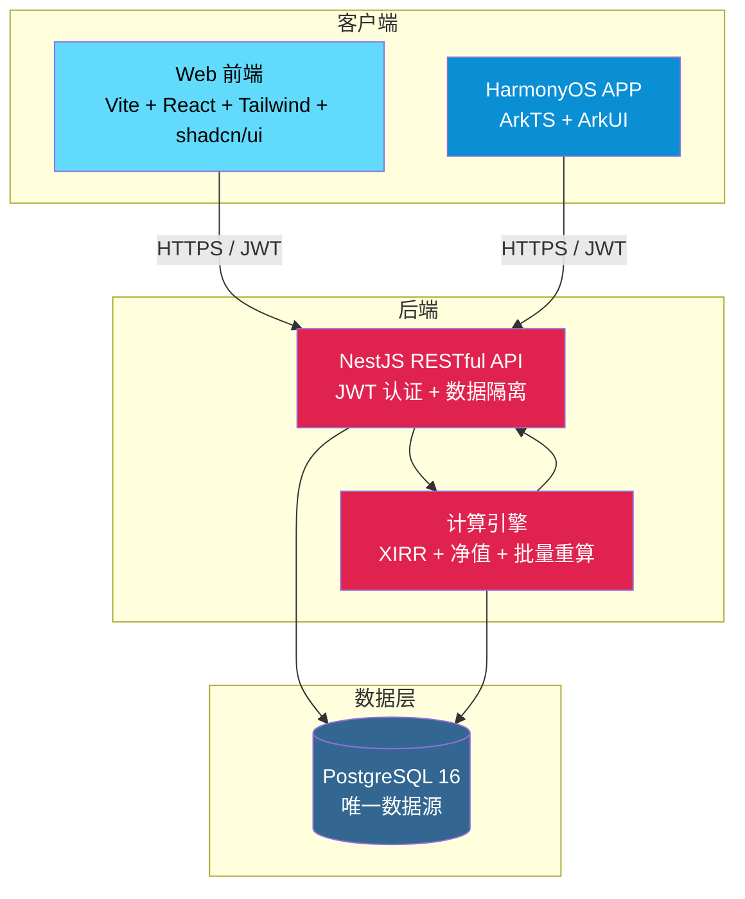
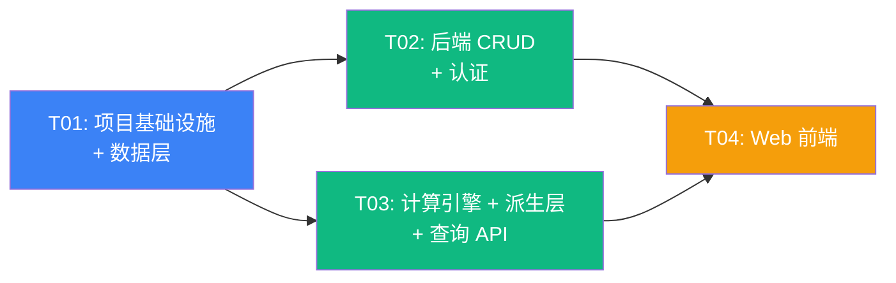

# 投资收益统计系统 — 架构设计文档（Canonical）

> **版本**: v2.1
> **架构师**: 高见远（Gao）
> **日期**: 2026-08-03
> **状态**: 重写发布（基于评审结论落地）+ **v2.1 修订：T5 手工总资产记录的计算层级联口径修正**（§6 / §7.3.1 / §7.3.2 / §8.1 / §13 REG-06；修复「快照层仅当日」被误写为「计算层也仅当日」导致的静默数据错误风险）
> **依据**: PRD v3.1.3（Consolidated，单一权威）+ ENVIRONMENT-SETUP + 用户拍板决策（含 v2.3 方案B 数据架构）
>
> **⚠️ 本档为唯一架构真相源（Canonical）**：取代并吸收 `ARCHITECTURE-modules.md`（已归档至 `docs/archive/`）。任何工程实现以本档 + PRD v3.1.3 为准；二者冲突时以 PRD 金融口径（① 级）与数据架构口径（② 级）裁决优先级为最高依据（见 PRD §2.1–§2.3）。

---

## 目录

1. [架构总览](#1-架构总览)
2. [技术栈最终确认表](#2-技术栈最终确认表)
3. [数据库设计（CRITICAL · 方案B）](#3-数据库设计critical-方案b)
4. [API 接口设计](#4-api-接口设计)
5. [核心数据结构](#5-核心数据结构)
6. [核心流程时序图](#6-核心流程时序图)
7. [XIRR 与净值计算模块设计](#7-xirr-与净值计算模块设计)
8. [总资产派生层（方案B 核心）](#8-总资产派生层方案b-核心)
9. [持仓推导引擎（方案B · 交易明细法）](#9-持仓推导引擎方案b--交易明细法)
10. [前端架构设计](#10-前端架构设计)
11. [架构裁决（Q-B 系列正式裁决）](#11-架构裁决q-b-系列正式裁决)
12. [Migration 策略（决策 A′）](#12-migration-策略决策-a)
13. [REG-01~06 架构支撑与验收点（P0 强制门禁）](#13-reg-01~06-架构支撑与验收点p0-强制门禁)
14. [任务列表](#14-任务列表)
15. [依赖包列表](#15-依赖包列表)
16. [共享知识（跨文件约定）](#16-共享知识跨文件约定)
17. [待明确事项（已裁决）](#17-待明确事项已裁决)
18. [附录 A：HarmonyOS APP 端（P2 交互基线）](#18-附录-aHarmonyos-app-端p2-交互基线)
19. [附录 B：头像上传模块（增量交付）](#19-附录-b头像上传模块增量交付)

---

## 1. 架构总览

### 1.1 系统架构图



### 1.2 分层说明

| 层级 | 职责 | 技术实现 |
|------|------|---------|
| **表现层** | 用户交互、数据展示、表单录入、图表渲染 | Web: React + shadcn/ui + ECharts；APP: ArkUI |
| **API 层** | 请求路由、JWT 认证、参数校验、数据隔离（user_id 过滤）、Swagger 文档 | NestJS Controllers + Guards + Pipes |
| **业务逻辑层** | XIRR 计算、净值计算、计算触发与批量重算、多维度查询聚合 | NestJS Services（纯 TypeScript，可独立测试） |
| **数据层** | 数据持久化、迁移管理、ORM 映射 | Prisma ORM + PostgreSQL 16 |

### 1.3 Monorepo 目录结构

```
投资收益app/
├── .gitignore
├── README.md
├── package.json                    # 根 package.json（workspace 配置 + 通用脚本）
├── pnpm-workspace.yaml             # pnpm monorepo 工作区声明
├── tsconfig.base.json              # TypeScript 共享基础配置
├── turbo.json                      # Turborepo 构建编排（可选加速）
├── .gitattributes                  # Git 属性（换行符 / 二进制标记等）
├── .github/
│   └── workflows/
│       └── ci.yml                  # CI 流水线
├── scripts/                        # 仓库辅助脚本
│   ├── push-all.ps1                # Windows 一键推送
│   ├── push-all.sh                 # Unix 一键推送
│   └── dev-env.ps1                 # 开发环境初始化
├── docs/
│   ├── PRD.md
│   ├── ARCHITECTURE.md             # 本文件
│   ├── ENVIRONMENT-SETUP.md
│   ├── class-diagram.mermaid       # 类图（独立提取）
│   └── sequence-diagram.mermaid    # 时序图（独立提取）
├── packages/
│   ├── shared/                     # 共享类型与 API 契约（三端共用）
│   │   ├── package.json
│   │   ├── tsconfig.json
│   │   └── src/
│   │       ├── index.ts            # 统一导出
│   │       ├── types.ts            # 类型汇总（re-export types/ 下各文件）
│   │       ├── enums.ts            # 枚举汇总（CashFlowType / SecuritySide / SnapshotSource 等）
│   │       ├── api-contracts.ts    # API 请求/响应契约汇总
│   │       └── types/              # 核心数据类型定义（13 个类型文件）
│   ├── finance-core/               # 零依赖纯金融算法库（XIRR / NAV 等纯函数，backend 依赖它）
│   │   ├── package.json
│   │   ├── tsconfig.json
│   │   └── src/
│   ├── backend/                    # NestJS 后端
│   │   ├── package.json
│   │   ├── tsconfig.json
│   │   ├── nest-cli.json
│   │   ├── .env.example
│   │   ├── prisma/
│   │   │   ├── schema.prisma       # Prisma schema（完整数据模型）
│   │   │   ├── seed.ts             # 种子数据
│   │   │   └── migrations/         # 自动生成的迁移
│   │   └── src/
│   │       ├── main.ts             # 应用入口（Swagger 配置、全局管道）
│   │       ├── app.module.ts       # 根模块
│   │       ├── prisma/
│   │       │   ├── prisma.module.ts
│   │       │   └── prisma.service.ts   # PrismaClient 封装
│   │       ├── common/             # 通用基础设施
│   │       │   ├── decorators/
│   │       │   │   ├── current-user.decorator.ts
│   │       │   │   └── api-pagination.decorator.ts
│   │       │   ├── guards/
│   │       │   │   └── jwt-auth.guard.ts
│   │       │   ├── filters/
│   │       │   │   └── http-exception.filter.ts
│   │       │   ├── pipes/
│   │       │   │   └── validation.pipe.ts
│   │       │   ├── dto/
│   │       │   │   ├── pagination.dto.ts
│   │       │   │   └── date-range.dto.ts
│   │       │   └── utils/
│   │       │       └── app-date.util.ts     # todayInAppTz / parseAppDate（UTC+8 感知）
│   │       └── modules/
│   │           ├── auth/           # 认证模块
│   │           │   ├── auth.module.ts
│   │           │   ├── auth.controller.ts
│   │           │   ├── auth.service.ts
│   │           │   ├── jwt.strategy.ts
│   │           │   └── dto/
│   │           │       ├── register.dto.ts
│   │           │       └── login.dto.ts
│   │           ├── portfolio/      # 组合管理模块
│   │           │   ├── portfolio.module.ts
│   │           │   ├── portfolio.controller.ts
│   │           │   ├── portfolio.service.ts
│   │           │   └── dto/
│   │           │       ├── create-portfolio.dto.ts
│   │           │       └── update-portfolio.dto.ts
│   │           ├── transaction/    # 交易录入模块
│   │           │   ├── transaction.module.ts
│   │           │   ├── transaction.controller.ts
│   │           │   ├── transaction.service.ts
│   │           │   └── dto/
│   │           │       ├── create-transaction.dto.ts
│   │           │       └── update-transaction.dto.ts
│   │           ├── snapshot/       # 资产快照模块
│   │           │   ├── snapshot.module.ts
│   │           │   ├── snapshot.controller.ts
│   │           │   ├── snapshot.service.ts
│   │           │   └── dto/
│   │           │       ├── create-snapshot.dto.ts
│   │           │       └── update-snapshot.dto.ts
│   │           ├── calculation/    # 计算引擎模块（单日 NAV→XIRR 叶子单元）
│   │           │   ├── calculation.module.ts
│   │           │   ├── calculation.service.ts     # 单日编排：快照→净值→XIRR
│   │           │   ├── xirr.service.ts            # XIRR Newton-Raphson 实现
│   │           │   └── nav.service.ts             # 净值份额法实现
│   │           ├── recalculation/  # 区间重建模块（T1~T4 区间重建 + T5 级联 + recalculateAll）
│   │           │   ├── recalculation.module.ts
│   │           │   └── recalculation.service.ts   # 唯一区间重建实现（CalculationModule 不再导出）
│   │           └── query/          # 查询聚合模块
│   │               ├── query.module.ts
│   │               ├── query.controller.ts        # XIRR/净值 四维度查询
│   │               ├── query.service.ts           # 聚合逻辑（期末值/均值）
│   │               └── dto/
│   │                   └── query.dto.ts
│   └── web/                        # Web 前端
│   │   ├── package.json
│   │   ├── tsconfig.json
│   │   ├── tsconfig.node.json
│   │   ├── vite.config.ts
│   │   ├── tailwind.config.ts
│   │   ├── postcss.config.js
│   │   ├── components.json         # shadcn/ui 配置
│   │   ├── index.html
│   │   └── src/
│   │       ├── main.tsx            # React 入口
│   │       ├── App.tsx             # 根组件 + 路由
│   │       ├── index.css           # Tailwind 指令 + 全局样式
│   │       ├── lib/
│   │       │   ├── utils.ts        # cn() 等工具函数
│   │       │   ├── api-client.ts   # Axios 实例 + 拦截器
│   │       │   └── format.ts       # 金额/百分比/日期格式化
│   │       ├── api/                # API 请求层
│   │       │   ├── auth.api.ts
│   │       │   ├── portfolio.api.ts
│   │       │   ├── transaction.api.ts
│   │       │   ├── snapshot.api.ts
│   │       │   ├── nav.api.ts
│   │       │   └── xirr.api.ts
│   │       ├── stores/             # Zustand 全局状态
│   │       │   ├── auth.store.ts
│   │       │   └── portfolio.store.ts  # 当前选中组合
│   │       ├── hooks/              # TanStack Query hooks
│   │       │   ├── use-transactions.hook.ts
│   │       │   ├── use-snapshots.hook.ts
│   │       │   ├── use-nav.hook.ts
│   │       │   ├── use-xirr.hook.ts
│   │       │   └── use-portfolios.hook.ts
│   │       ├── components/         # shadcn/ui 基础组件 + 通用组件
│   │       │   └── ui/             # shadcn/ui 生成的基础组件
│   │       │       ├── button.tsx
│   │       │       ├── input.tsx
│   │       │       ├── dialog.tsx
│   │       │       ├── select.tsx
│   │       │       ├── table.tsx
│   │       │       ├── tabs.tsx
│   │       │       ├── card.tsx
│   │       │       ├── badge.tsx
│   │       │       ├── toast.tsx
│   │       │       ├── date-picker.tsx
│   │       │       └── chart.tsx       # shadcn/ui chart 封装
│   │       ├── features/           # 业务功能组件
│   │       │   ├── auth/
│   │       │   │   ├── login-form.tsx
│   │       │   │   └── register-form.tsx
│   │       │   ├── dashboard/
│   │       │   │   ├── stat-cards.tsx       # 关键指标卡片
│   │       │   │   ├── nav-trend-chart.tsx  # 净值趋势（ECharts）
│   │       │   │   └── xirr-trend-chart.tsx # XIRR 趋势（ECharts）
│   │       │   ├── transaction/
│   │       │   │   ├── transaction-form.tsx
│   │       │   │   └── transaction-table.tsx
│   │       │   ├── snapshot/
│   │       │   │   └── snapshot-form.tsx
│   │       │   ├── analysis/
│   │       │   │   ├── xirr-analysis.tsx         # XIRR 分析页
│   │       │   │   ├── nav-analysis.tsx          # 净值分析页
│   │       │   │   ├── yearly-bar-chart.tsx       # 年度收益柱状图
│   │       │   │   └── monthly-heatmap.tsx        # 月度热力图（ECharts）
│   │       │   ├── portfolio/
│   │       │   │   ├── portfolio-selector.tsx
│   │       │   │   └── portfolio-manager.tsx
│   │       │   └── settings/
│   │       │       └── settings-page.tsx
│   │       └── pages/              # 页面组件
│   │           ├── login.page.tsx
│   │           ├── register.page.tsx
│   │           ├── dashboard.page.tsx
│   │           ├── transactions.page.tsx
│   │           ├── snapshots.page.tsx
│   │           ├── analysis-xirr.page.tsx
│   │           ├── analysis-nav.page.tsx
│   │           ├── settings.page.tsx
│   │           └── not-found.page.tsx
```

---

## 2. 技术栈最终确认表

| 层级 | 技术选型 | 版本 | 确认/微调 | 理由 |
|------|---------|------|----------|------|
| **后端框架** | NestJS | ^10.0 | ✅ 确认 | TypeScript 原生，模块化架构清晰，内置 DI/Guards/Pipes/Swagger，适合中型金融项目 |
| **ORM** | Prisma | ^5.0 | ✅ 确认 | TypeScript 类型安全，迁移管理优秀，PostgreSQL 支持完善，NUMERIC 类型映射为 Decimal |
| **数据库** | PostgreSQL | 16 | ✅ 确认 | NUMERIC 高精度，JSON/窗口函数支持，成熟稳定 |
| **XIRR 计算** | 自实现 Newton-Raphson | — | ✅ **微调：自实现**（不用 npm 包） | PRD 已提供完整伪代码，自实现约 60 行，可完全控制边界条件（全同号返回 null、收敛失败处理、精度阈值）。npm 包 `xirr` 维护停滞且边界处理不够，`financejs` 过重 |
| **Web 构建** | Vite | ^5.0 | ✅ 确认 | 极速 HMR，React 生态成熟 |
| **Web 框架** | React | ^18.2 | ✅ 确认 | 生态最丰富，shadcn/ui 原生支持 |
| **Web UI** | shadcn/ui + Tailwind CSS | shadcn latest + Tailwind ^3.4 | ✅ 确认 | Radix+Tailwind 零冲突，组件代码进项目可自由定制，弃用 MUI 避免样式冲突 |
| **Web 图表** | ECharts | echarts ^5.5 + echarts-for-react ^3.0 | ✅ 确认（INC-CHART-01 收敛） | 单库覆盖折线/柱状/热力图，移除 Recharts 避免双库冗余；大数据量时序性能更优 |
| **Web 状态** | Zustand + TanStack Query | Zustand ^4.5 + TanStack Query ^5.0 | ✅ 确认 | Zustand 管理客户端状态（auth/portfolio 选择），TanStack Query 管理服务端状态（缓存/重试/失效） |
| **Web 表单** | React Hook Form + Zod | RHF ^7.51 + Zod ^3.23 | ✅ 确认 | RHF 性能优秀，Zod schema 可前后端共享校验 |
| **Web 路由** | React Router | ^6.22 | ✅ 确认 | React 生态标准路由 |
| **Web HTTP** | Axios | ^1.6 | ✅ 确认 | 拦截器机制适合统一注入 JWT + 错误处理 |
| **APP 语言** | ArkTS | HarmonyOS API 12+ | ✅ 确认（P2，`packages/harmonyos` 已移除） | 鸿蒙官方语言，TypeScript 超集 |
| **APP UI** | ArkUI | API 12+ | ✅ 确认 | 声明式 UI，鸿蒙原生 |
| **APP 图表** | Canvas 自绘（折线/柱状）+ WebView+ECharts（热力图） | — | ✅ **推荐** | 鸿蒙三方图表库生态不成熟（`@ohos/mpchart` 兼容性存疑），Canvas API 稳定可靠。折线/柱状自绘约 200 行/组件；月度热力图较复杂，用 WebView 嵌入 ECharts HTML 更高效。v1 仅做折线/柱状自绘，热力图列入 P1 |
| **APP 网络** | @ohos.net.http | API 12+ | ✅ 确认 | 鸿蒙官方 HTTP 模块 |
| **认证** | JWT + bcrypt | @nestjs/jwt ^10 + bcrypt ^5.1 | ✅ 确认 | JWT 无状态适合多端，bcrypt 加盐哈希 |
| **API 文档** | Swagger | @nestjs/swagger ^7 | ✅ 确认 | NestJS 原生集成，自动生成 OpenAPI |
| **后端测试** | Jest | ^29 | ✅ 确认 | NestJS 默认测试框架 |
| **Web 测试** | Vitest + React Testing Library | Vitest ^1.6 + RTL ^15 | ✅ 确认 | Vite 原生测试，快速 |
| **仓库结构** | pnpm monorepo | pnpm ^9 | ✅ 确认 | 磁盘高效，workspace 协议支持共享包 |
| **构建编排** | Turborepo | ^2.0 | ✅ **新增**（可选） | 加速 monorepo 构建缓存，非必须但提升 DX |
| **金融算法库** | finance-core（内部包） | — | ✅ **新增** | 零依赖纯金融算法库（XIRR / NAV 等纯函数），`packages/finance-core`，backend 依赖它 |

---

## 3. 数据库设计（CRITICAL · 方案B）

> **数据架构范式（决策 A′ / 方案B）**：以**交易明细法**为唯一真相源。持仓**不落库**、由 `SecurityTrade` 流水回放推导；现金余额独立表 `CashBalance`、零联动；总资产 `AssetSnapshot` 由系统自动派生并**每日唯一一条**（`UNIQUE(portfolioId, date)`，不含 `source`）。本档取代旧 `Holding` 快照法（已废止，见 PRD §2.4 HOLD-P0-02）。

### 3.1 Prisma Schema 完整定义（目标态 · 文档记载，代码迁移见 §12）

```prisma
// packages/backend/prisma/schema.prisma（方案B 目标态）

generator client { provider = "prisma-client-js" }
datasource db { provider = "postgresql"; url = env("DATABASE_URL") }

// ==================== 用户表 ====================
model User {
  id           String   @id @default(uuid())
  email        String   @unique
  passwordHash String   @map("password_hash")
  name         String?
  avatar       String?  @db.VarChar(512)   // 头像（设置页账户区维护，见 §19）
  phone        String?  @db.VarChar(20)
  bio          String?  @db.VarChar(200)
  createdAt    DateTime @default(now()) @map("created_at")
  updatedAt    DateTime @updatedAt @map("updated_at")
  portfolios   Portfolio[]
  preferences  UserPreference?
  @@map("users")
}

// ==================== 投资组合表 ====================
model Portfolio {
  id          String    @id @default(uuid())
  userId      String    @map("user_id")
  name        String
  description String?
  baseDate    DateTime? @map("base_date") @db.Date  // 成立日=首笔出入金日，设后不可改
  currency    String    @default("CNY")
  archivedAt  DateTime? @map("archived_at")          // 非 null = 已归档（P1）
  createdAt   DateTime  @default(now()) @map("created_at")
  updatedAt   DateTime  @updatedAt @map("updated_at")
  user         User             @relation(fields: [userId], references: [id], onDelete: Cascade)
  cashflows    CashFlow[]                         // 出入金（原 Transaction 改名）
  securities   Security[]
  securityTrades SecurityTrade[]
  securityPrices SecurityPrice[]
  cashBalances CashBalance[]
  snapshots    AssetSnapshot[]
  dailyNavs    DailyNav[]
  dailyXirrs   DailyXirr[]
  dividends    DividendRecord[]
  fees         FeeRecord[]
  @@index([userId])
  @@map("portfolios")
}

// ==================== 出入金流水表（XIRR 现金流唯一来源）====================
model CashFlow {
  id          String   @id @default(uuid())
  portfolioId String   @map("portfolio_id")
  date        DateTime @db.Date
  // BUY = 存入（现金流为负），SELL = 取出（现金流为正）
  type        CashFlowType
  amount      Decimal  @db.Decimal(18, 2)   // 始终 > 0；是 XIRR 与份额申赎唯一输入（C-02）
  note        String?
  createdAt   DateTime @default(now()) @map("created_at")
  updatedAt   DateTime @updatedAt @map("updated_at")
  portfolio   Portfolio @relation(fields: [portfolioId], references: [id], onDelete: Cascade)
  @@index([portfolioId, date])
  @@map("cashflows")
}
enum CashFlowType { BUY SELL }   // 严禁复用 SecuritySide（C-10）

// ==================== 标的主数据表 ====================
model Security {
  id          String       @id @default(uuid())
  portfolioId String       @map("portfolio_id")
  code        String
  name        String       // ≤ 50 字，必填
  type        SecurityType @default(STOCK)
  currency    String       @default("CNY")
  createdAt   DateTime     @default(now()) @map("created_at")
  updatedAt   DateTime     @updatedAt @map("updated_at")
  portfolio      Portfolio       @relation(fields: [portfolioId], references: [id], onDelete: Cascade)
  trades         SecurityTrade[]
  prices         SecurityPrice[]
  dividends      DividendRecord[]
  fees           FeeRecord[]
  @@unique([portfolioId, code])
  @@map("securities")
}
enum SecurityType {
  STOCK FUND BOND OTHER
  CASH @deprecated("方案B 弃用：现金余额独立为 CashBalance，避免总资产双计")
}

// ==================== 证券买卖流水表（方案B · 持仓推导唯一来源）====================
model SecurityTrade {
  id          String       @id @default(uuid())
  portfolioId String       @map("portfolio_id")
  securityId  String       @map("security_id")
  date        DateTime     @db.Date
  side        SecuritySide              // 独立枚举，严禁复用 CashFlowType（C-10）
  quantity    Decimal      @db.Decimal(18, 6)  // 交易数量（始终 > 0）
  price       Decimal      @db.Decimal(18, 6)  // 成交单价
  fee         Decimal      @db.Decimal(18, 2)  // 费用（信息记录，计入成本，不回冲）
  note        String?
  createdAt   DateTime     @default(now()) @map("created_at")
  updatedAt   DateTime     @updatedAt @map("updated_at")
  portfolio   Portfolio @relation(fields: [portfolioId], references: [id], onDelete: Cascade)
  security    Security  @relation(fields: [securityId], references: [id], onDelete: Cascade)
  @@index([portfolioId, date])
  @@index([securityId, date])
  @@map("security_trades")
}
enum SecuritySide { BUY_SEC SELL_SEC }

// ==================== 标的最新价表（向前沿用）====================
model SecurityPrice {
  id          String   @id @default(uuid())
  portfolioId String   @map("portfolio_id")
  securityId  String   @map("security_id")
  price       Decimal  @db.Decimal(18, 6)
  asOf        DateTime @db.Date     // 语义：当前值 = asOf ≤ date 的最后一条
  createdAt   DateTime @default(now()) @map("created_at")
  portfolio   Portfolio @relation(fields: [portfolioId], references: [id], onDelete: Cascade)
  security    Security  @relation(fields: [securityId], references: [id], onDelete: Cascade)
  @@index([portfolioId, securityId, asOf])
  @@map("security_prices")
}

// ==================== 现金余额表（独立 · 零联动）====================
model CashBalance {
  id          String   @id @default(uuid())
  portfolioId String   @map("portfolio_id")
  amount      Decimal  @db.Decimal(18, 2)
  asOf        DateTime @db.Date     // 语义：当前值 = asOf ≤ date 的最后一条；首条之前 = 0
  note        String?
  createdAt   DateTime @default(now()) @map("created_at")
  portfolio   Portfolio @relation(fields: [portfolioId], references: [id], onDelete: Cascade)
  @@index([portfolioId, asOf])
  @@map("cash_balances")
}

// ==================== 总资产每日唯一记录表（派生层 + 手工）====================
model AssetSnapshot {
  id            String        @id @default(uuid())
  portfolioId   String        @map("portfolio_id")
  date          DateTime      @db.Date
  totalAsset    Decimal       @db.Decimal(18, 2)   // 当日总资产（加项1+加项2）
  marketValue   Decimal?      @db.Decimal(18, 2)   // 拆解：持仓市值合计
  cashBalance   Decimal?      @db.Decimal(18, 2)   // 拆解：当日现金余额
  source        SnapshotSource                 // DERIVED（自动）/ MANUAL（手工）
  valuationFlag SnapshotValuation              // EXACT/ CARRIED_FORWARD/ COST_BASED/ MANUAL_INPUT
  note          String?
  recordedAt    DateTime      @default(now()) @map("recorded_at")
  createdAt     DateTime      @default(now()) @map("created_at")
  updatedAt     DateTime      @updatedAt @map("updated_at")
  portfolio Portfolio @relation(fields: [portfolioId], references: [id], onDelete: Cascade)
  // 🔴 唯一约束：每组合每自然日至多一条，不含 source（见 §8.2）
  @@unique([portfolioId, date])
  @@index([portfolioId, date])
  @@map("asset_snapshots")
}
enum SnapshotSource { DERIVED MANUAL }
enum SnapshotValuation { EXACT CARRIED_FORWARD COST_BASED MANUAL_INPUT }

// ==================== 每日净值表 ====================
model DailyNav {
  id               String   @id @default(uuid())
  portfolioId      String   @map("portfolio_id")
  date             DateTime @db.Date
  unitNav          Decimal  @db.Decimal(12, 6) @map("unit_nav")
  cumulativeNav    Decimal  @db.Decimal(12, 6) @map("cumulative_nav")
  yearNav          Decimal  @db.Decimal(12, 6) @map("year_nav")
  shares           Decimal  @db.Decimal(18, 6)
  baseCumulativeNav Decimal? @db.Decimal(12, 6) @map("base_cumulative_nav")
  createdAt        DateTime @default(now()) @map("created_at")
  updatedAt        DateTime @updatedAt @map("updated_at")
  portfolio Portfolio @relation(fields: [portfolioId], references: [id], onDelete: Cascade)
  @@unique([portfolioId, date])
  @@index([portfolioId, date])
  @@map("daily_nav")
}

// ==================== 每日 XIRR 表 ====================
model DailyXirr {
  id          String    @id @default(uuid())
  portfolioId String    @map("portfolio_id")
  date        DateTime  @db.Date
  // 累计 XIRR 年化收益率（小数形式），null = 数据不足
  xirrValue   Decimal?  @db.Decimal(20, 8) @map("xirr_value")  // 🔴 精度 (20,8) 与代码/migration 对齐
  createdAt   DateTime  @default(now()) @map("created_at")
  updatedAt   DateTime  @updatedAt @map("updated_at")
  portfolio Portfolio @relation(fields: [portfolioId], references: [id], onDelete: Cascade)
  @@unique([portfolioId, date])
  @@index([portfolioId, date])
  @@map("daily_xirr")
}

// ==================== 分红 / 费用 / 偏好（不参与收益计算，C-08/C-09）====================
model DividendRecord {
  id String @id @default(uuid()); portfolioId String @map("portfolio_id")
  securityId String @map("security_id"); date DateTime @db.Date
  amount Decimal @db.Decimal(18,2); type DividendType @default(CASH)
  note String?; createdAt DateTime @default(now()) @map("created_at")
  portfolio Portfolio @relation(fields:[portfolioId],references:[id],onDelete:Cascade)
  security Security @relation(fields:[securityId],references:[id],onDelete:Cascade)
  @@index([portfolioId, date]); @@index([securityId, date]); @@map("dividend_records")
}
model FeeRecord {
  id String @id @default(uuid()); portfolioId String @map("portfolio_id")
  securityId String @map("security_id"); date DateTime @db.Date
  amount Decimal @db.Decimal(18,2); type FeeType @default(OTHER)
  transactionId String? @map("transaction_id"); note String?
  createdAt DateTime @default(now()) @map("created_at")
  portfolio Portfolio @relation(fields:[portfolioId],references:[id],onDelete:Cascade)
  security Security @relation(fields:[securityId],references:[id],onDelete:Cascade)
  @@index([portfolioId, date]); @@index([securityId, date]); @@map("fee_records")
}
model UserPreference {
  id String @id @default(uuid()); userId String @unique @map("user_id")
  defaultPortfolioId String? @map("default_portfolio_id")
  defaultGranularity String @default("month") @map("default_granularity")
  defaultDateRange String @default("1y") @map("default_date_range")
  aggregation String @default("last")
  weekStartsOn Int @default(1) @map("week_starts_on")
  navDecimals Int @default(4) @map("nav_decimals")
  xirrDecimals Int @default(2) @map("xirr_decimals")
  // 🆕 v2.0 新增偏好字段（SET-P0-02 服务端化扩展）
  theme String @default("system")
  staleDays Int @default(3) @map("stale_days")
  showLiquidated Boolean @default(false) @map("show_liquidated")  // 持仓列表显示已清仓
  costBasisView String @default("avg") @map("cost_basis_view")    // avg | fifo（P2）
  dashboardLayout Json? @map("dashboard_layout")
  createdAt DateTime @default(now()) @map("created_at")
  updatedAt DateTime @updatedAt @map("updated_at")
  user User @relation(fields:[userId],references:[id],onDelete:Cascade)
  @@map("user_preferences")
}
enum DividendType { CASH STOCK_DIVIDEND }
enum FeeType { COMMISSION STAMP_TAX OTHER }
```

### 3.2 设计要点说明

#### 3.2.1 多组合关联

```
User (1) ──< Portfolio (N)
   ├──< CashFlow (N)         出入金（XIRR 现金流唯一来源）
   ├──< Security (N)
   │     ├──< SecurityTrade (N)   证券买卖流水（持仓推导唯一来源）
   │     └──< SecurityPrice (N)   最新价（向前沿用）
   ├──< CashBalance (N)      现金余额（独立、零联动）
   ├──< AssetSnapshot (N)    总资产每日唯一记录（派生+手工）
   ├──< DailyNav (N)
   ├──< DailyXirr (N)
   ├──< DividendRecord (N)   不参与计算
   └──< FeeRecord (N)        不参与计算
```

- 所有业务表均通过 `portfolio_id` 外键关联 `Portfolio`；`Portfolio.userId` 实现用户级数据隔离。
- 级联删除：`onDelete: Cascade` 贯穿；删除 User 级联其所有 Portfolio 及子记录。
- **🔴 `Holding` 表已废除**（方案B：持仓不落库，由 `SecurityTrade` 回放推导，见 §9）。

#### 3.2.2 数据精度（C-04，统一为 (20,8)）

| 数据项 | Prisma / PostgreSQL | 精度 |
|--------|---------------------|------|
| 交易金额 / 资产快照金额 / 现金余额 | `DECIMAL(18,2)` | 2 位小数（分） |
| 单位/累计/当年净值 | `DECIMAL(12,6)` | 6 位小数（计算精度，展示 4 位） |
| 份额 / 持仓数量 / 均价 / 现价 | `DECIMAL(18,6)` | 6 位小数 |
| **XIRR** | **`DECIMAL(20,8)`** | **8 位小数（存储），展示百分比 2 位** |

> **XIRR 精度裁定（E2 决策）**：以代码实际 `Decimal(20,8)` 为准，反向统一 PRD §9.1 与 MEMORY.md（原 (10,8)/(10,6) 整条订正为 (20,8)）。展示仍为百分比 2 位小数，无变化。

#### 3.2.3 AssetSnapshot 每日唯一不变量（数据库层）

- `UNIQUE(portfolioId, date)` **不含 `source`** → 每组合每自然日至多一行，是全局硬约束（REG-05）。
- 两写方写同一行：`persistDerived()`（自动，遇 `MANUAL` 跳过）与 `upsertManual()`（手工，无条件覆盖）。读取直接读当日那一行，无需优先级判断（C-12）。
- 详细写入/冲突规范与 `source`/`valuationFlag` 语义见 **§8 总资产派生层**。

#### 3.2.4 SecurityType.CASH 口径裁决

- 枚举值保留（避免破坏性迁移），标注 `@deprecated`；新建标的时**隐藏 CASH 选项**，CASH 类记录不予建立，避免与 `CashBalance` 在 `totalAsset` 中双计（PRD §5.3 决策 A′）。

---

## 4. API 接口设计

### 4.1 通用约定

- **Base URL**: `/api`（🔴 统一前缀，**无 `/v1`**，与 PRD §附录E 一致；前端/APP `baseURL` 同步去除 `/v1`）
- **认证**: 除注册/登录外所有接口需 `Authorization: Bearer <JWT>` 头
- **响应信封**: 所有响应统一为 `{ code: number, data: T, message: string }`
- **日期格式**: 请求/响应中日期统一为 `YYYY-MM-DD`（ISO 8601 date-only）
- **分页**: `?page=1&pageSize=20`，响应含 `{ items: T[], total: number, page: number, pageSize: number }`

### 4.2 API 接口列表

#### 4.2.1 认证模块

| Method | Path | 说明 | 请求体 | 响应 data |
|--------|------|------|--------|-----------|
| POST | `/api/auth/register` | 用户注册 | `{ email, password, name }` | `{ id, email, name }` |
| POST | `/api/auth/login` | 用户登录 | `{ email, password }` | `{ accessToken, user: { id, email, name } }` |
| POST | `/api/auth/account/restore` | 注销账户自助恢复（**公开，SYS-P1-02 / SET-P1-06**）| `{ email, password }` | `{ accessToken, user }`（同登录，恢复后直接进入登录态）|
| GET | `/api/auth/me` | 获取当前用户 | — | `{ id, email, name }` |
| PATCH | `/api/auth/profile` | 更新个人资料（写入口，**仅 `/settings` 调用**）| `{ name?, avatar? }` | `{ id, email, name, avatar }` |

> **登录冷静期信号（SYS-P1-02）**：账户软删除（`deletedAt` 非空）后处于 30 天冷静期（保留期常量 `ACCOUNT_RETENTION_MS`，三端同源），期间 `POST /api/auth/login` 不会成功，而是返回 **HTTP 409 + 业务码 1007**，并在响应 `data` 中携带 `{ remainingDays: number }`（冷静期剩余天数，向上取整）。前端 `api-client` 把 1007 列入 `SILENT_CODES` **不弹 toast**，由登录页捕获后渲染「恢复引导卡片」，用户凭已输入的邮箱 + 密码调用 `POST /api/auth/account/restore` 一键恢复。
>
> 其他恢复相关错误码：**1008**（账户未注销、无需恢复，HTTP 409）、**1009**（冷静期已过、数据不可找回，HTTP 410）；邮箱/密码错误统一返回 **1001**（不泄露账户枚举信息）。注意 1007/1008/1009 刻意**不使用 401**，否则会被前端拦截器当成「登录失效」清 token 并踢回登录页。

#### 4.2.2 组合管理

| Method | Path | 说明 | 请求体/参数 | 响应 data |
|--------|------|------|------------|-----------|
| GET | `/api/portfolios` | 获取当前用户组合列表 | — | `Portfolio[]` |
| POST | `/api/portfolios` | 创建组合 | `{ name, description?, currency? }` | `Portfolio` |
| GET | `/api/portfolios/:id` | 获取组合详情 | — | `Portfolio` |
| PATCH | `/api/portfolios/:id` | 更新组合 | `{ name?, description? }` | `Portfolio` |
| DELETE | `/api/portfolios/:id` | 删除组合（级联删除子数据） | — | `null` |
| DELETE | `/api/portfolios/:id/data` | 清空组合所有数据（保留组合本身），含二次确认 | — | `{ deletedCount: { snapshots, cashflows, securityTrades, ... } }` |

> 🔴 **副作用**：`/data` 清除在事务内逐层删（`asset_snapshots` → `cashflows` → `security_trades` → `security_prices`），删完后对整个组合触发一次 `recalculateNavRange`（起点=首笔事件日，终点=today），确保 daily_nav/daily_xirr 表清空至初始状态。对应 PRD `SNAP-P0-06`(4) 删除功能 + US-S5「清空组合重来」。

#### 4.2.3 出入金管理（`/cashflows`）

> **命名变更（v2.0）**：原 `transactions` 端点**重命名为 `cashflows`**。旧路径 `/api/portfolios/:portfolioId/transactions` 保留 **301 重定向**至 `/api/portfolios/:portfolioId/cashflows`，至少保留 2 个大版本（避免前端/APP 断链）。出入金是 XIRR 现金流与 NAV 申赎项的**唯一来源**，**不含** `securityId/quantity/price/fee`（证券明细归属 `security-trades`，见 §9）。

| Method | Path | 说明 | 请求体/参数 | 响应 data |
|--------|------|------|------------|-----------|
| GET | `/api/portfolios/:portfolioId/cashflows` | 获取出入金列表 | `?startDate&endDate&page&pageSize` | `Paginated<CashFlow>` |
| POST | `/api/portfolios/:portfolioId/cashflows` | 录入出入金 | `{ date, type: BUY\|SELL, amount, note? }` | `CashFlow` |
| PATCH | `/api/portfolios/:portfolioId/cashflows/:id` | 编辑出入金 | `{ date?, type?, amount?, note? }` | `CashFlow` |
| DELETE | `/api/portfolios/:portfolioId/cashflows/:id` | 删除出入金 | — | `null` |

> **副作用**：经 `recalculation.service` 统一入口触发区间重建(见 §7.3 / §12)。出入金不含证券明细，现金流口径以 `amount` 唯一（C-02）。

#### 4.2.4 总资产记录管理（`/snapshots` · 每日唯一）

> 🔴 **每日唯一一条**（`UNIQUE(portfolioId, date)`，不含 `source`）。读取直接读当日那一行，无需优先级判断（C-12）。两写方：派生层 `persistDerived()`（遇 `MANUAL` 跳过）与手工 `upsertManual()`（无条件覆盖）。详见 §8。

| Method | Path | 说明 | 请求体/参数 | 响应 data |
|--------|------|------|------------|-----------|
| GET | `/api/portfolios/:portfolioId/snapshots` | 获取记录列表（含 `source`/`valuationFlag`/拆解） | `?startDate&endDate&page&pageSize` | `Paginated<AssetSnapshot>`（含 `marketValue`/`cashBalance`/`source`/`valuationFlag`/`recordedAt`） |
| POST | `/api/portfolios/:portfolioId/snapshots` | 手工录入/覆盖（→`source=MANUAL`） | `{ date, totalAsset, marketValue?, cashBalance?, note? }` | `AssetSnapshot`（source=MANUAL） |
| PATCH | `/api/portfolios/:portfolioId/snapshots/:id` | 编辑手工记录 | `{ totalAsset?, marketValue?, cashBalance?, note? }` | `AssetSnapshot` |
| DELETE | `/api/portfolios/:portfolioId/snapshots/:id` | 删除记录（若属事件日立即回填 DERIVED） | — | `null` |
| POST | `/api/portfolios/:portfolioId/snapshots/:date/reset` | 「重置为自动值」→ `source=DERIVED`（等价于撤销手工） | — | `AssetSnapshot`（source=DERIVED） |

> **读取语义**：无记录的自然日按**前值填充**（取前一个有记录日的 `totalAsset`，无需判断来源）；`GET` 响应中 `marketValue`/`cashBalance` 为拆解项，`null` 表示未拆解（Q-B15 选填）。
> **手工记录校验**：`totalAsset ≥ 0`；`marketValue`/`cashBalance` 选填；`note` 强提示；不允许未来日期。
> 🔴 **写操作的级联义务（T5，见 §7.3.1 / §8.1 / REG-06）**：`POST` / `PATCH` / `DELETE` / `reset` 四个写接口**均须**在完成快照层写入后调用 `recalculateNavRange(portfolioId, date)`，重算 `[date, today]` 的 `daily_nav` / `daily_xirr`。**快照层只动当日那一行，计算层必须级联至今日** —— 漏做即产生「改了历史总资产但其后净值/XIRR 不变」的静默数据错误。四个接口的响应体统一附加 `meta.recalculatedDays: number`，供前端 toast 反馈「已重算 N 天」（`SNAP-P0-06` 验收 4 / `SNAP-P0-07` 验收 5）。🔴 **写快照与级联未包在同一事务内**（交互式事务超时风险），以 `recalculateNavRange` 末尾抛聚合错误作为安全网（C6，见 §7.3.2）。

#### 4.2.5 标的管理（`/securities`）

| Method | Path | 说明 | 请求体/参数 | 响应 data |
|--------|------|------|------------|-----------|
| GET | `/api/portfolios/:portfolioId/securities` | 标的列表 | `?page&pageSize` | `Paginated<Security>` |
| POST | `/api/portfolios/:portfolioId/securities` | 新建标的（`type` 隐藏 `CASH` 选项） | `{ code, name, type?, currency? }` | `Security` |
| PATCH | `/api/portfolios/:portfolioId/securities/:id` | 编辑标的 | `{ name?, type? }` | `Security` |
| DELETE | `/api/portfolios/:portfolioId/securities/:id` | 删除标的（级联删其 trades/prices） | — | `null` |

#### 4.2.6 证券买卖流水（`/security-trades` · 方案B 持仓推导来源）

| Method | Path | 说明 | 请求体/参数 | 响应 data |
|--------|------|------|------------|-----------|
| GET | `/api/portfolios/:portfolioId/security-trades` | 流水列表 | `?securityId&startDate&endDate&page&pageSize` | `Paginated<SecurityTrade>` |
| POST | `/api/portfolios/:portfolioId/security-trades` | 录入买卖 | `{ date, securityId, side: BUY_SEC\|SELL_SEC, quantity, price, fee?, note? }` | `SecurityTrade` |
| PATCH | `/api/portfolios/:portfolioId/security-trades/:id` | 编辑流水 | `{ date?, quantity?, price?, fee? }` | `SecurityTrade` |
| DELETE | `/api/portfolios/:portfolioId/security-trades/:id` | 删除流水 | — | `null` |

> **硬校验（卖出）**：卖出数量不得超过当前持仓；若会导致负持仓（含未来日期）→ 拒绝（400）。`avgCost` 由回放推导，用户不手填（Q-04 改判）。

#### 4.2.7 标的最新价（`/security-prices`）

| Method | Path | 说明 | 请求体/参数 | 响应 data |
|--------|------|------|------------|-----------|
| GET | `/api/portfolios/:portfolioId/security-prices` | 最新价列表（按 asOf 向前沿用） | `?securityId&page&pageSize` | `Paginated<SecurityPrice>` |
| POST | `/api/portfolios/:portfolioId/security-prices` | 录入/更新现价 | `{ securityId, price, asOf }` | `SecurityPrice` |
| PATCH | `/api/portfolios/:portfolioId/security-prices/:id` | 编辑 | `{ price?, asOf? }` | `SecurityPrice` |
| DELETE | `/api/portfolios/:portfolioId/security-prices/:id` | 删除 | — | `null` |

> 更新现价触发受影响日期自动记录重建（手工记录日期跳过）。批量保存合并为单次区间重建（Q-B8）。

#### 4.2.8 现金余额（`/cash-balances` · 独立 · 零联动）

| Method | Path | 说明 | 请求体/参数 | 响应 data |
|--------|------|------|------------|-----------|
| GET | `/api/portfolios/:portfolioId/cash-balances` | 余额变更历史（多行） | `?asOf&page&pageSize` | `Paginated<CashBalance>` |
| POST | `/api/portfolios/:portfolioId/cash-balances` | 录入/更新某日余额 | `{ amount, asOf, note? }` | `CashBalance` |
| PATCH | `/api/portfolios/:portfolioId/cash-balances/:id` | 编辑 | `{ amount?, note? }` | `CashBalance` |
| DELETE | `/api/portfolios/:portfolioId/cash-balances/:id` | 删除 | — | `null` |

> 🔴 **零联动（决策 B）**：存入/取出、证券买卖**不改**它；仅在保存后给软提示。修改任一条 → 从该 `asOf` 起级联重算、覆盖 `DERIVED` 记录，手工记录跳过（CASH-P0-03）。单一录入入口 = 出入金管理页「现金余额」区块（CASH-P0-02）。

#### 4.2.9 持仓查询（`/holdings` · 方案B 派生，只读）

> 🔴 方案B 持仓**不入库**，由 `SecurityTrade` 流水按 `(date, createdAt)` 升序回放推导（见 §9）。本端点为只读查询，**无 CRUD**；卖出硬校验口径见 §9.2。

| Method | Path | 说明 | 请求参数 | 响应 data |
|--------|------|------|---------|-----------|
| GET | `/api/portfolios/:portfolioId/holdings` | 持仓列表（实时推导）| `?date&securityId&includeClosed` | `HoldingView[]`（含 `quantity`/`costTotal`/`avgCost`/`marketValue`/`pnl`/`ratio`）|

#### 4.2.10 组合概览（`/overview` · Dashboard 落地页）

| Method | Path | 说明 | 请求参数 | 响应 data |
|--------|------|------|---------|-----------|
| GET | `/api/portfolios/:portfolioId/overview` | 核心指标 + 趋势（一屏） | `?range` | `OverviewDTO`（当前总资产/累计XIRR/当年XIRR/净值序列片段/近期出入金） |
| GET | `/api/portfolios/comparison` | 多组合对比摘要（一次查询） | — | `PortfolioSummary[]` |

#### 4.2.11 XIRR 查询（四维度）

| Method | Path | 说明 | 请求参数 | 响应 data |
|--------|------|------|---------|-----------|
| GET | `/api/portfolios/:portfolioId/xirr` | 查询 XIRR 时间序列 | `?granularity=day\|week\|month\|year&startDate&endDate&aggregation=last\|avg` | `XirrSeriesPoint[]` |
| GET | `/api/portfolios/:portfolioId/xirr/latest` | 获取最新 XIRR | — | `{ date, xirrValue }` |

**XirrSeriesPoint 结构**:
```typescript
{
  date: string;          // ISO 日期 YYYY-MM-DD
  xirrValue: number | null;  // null 表示数据不足
  label: string;         // 显示标签（如 "2025-03" 或 "2025-W12"）
}
```

#### 4.2.12 净值查询（四维度）

| Method | Path | 说明 | 请求参数 | 响应 data |
|--------|------|------|---------|-----------|
| GET | `/api/portfolios/:portfolioId/nav` | 查询净值时间序列 | `?granularity=day\|week\|month\|year&startDate&endDate&aggregation=last\|avg&metric=cumulative\|year\|both` | `NavSeriesPoint[]` |
| GET | `/api/portfolios/:portfolioId/nav/latest` | 获取最新净值 | — | `{ date, cumulativeNav, yearNav, shares }` |

**NavSeriesPoint 结构**:
```typescript
{
  date: string;
  cumulativeNav: number | null;
  yearNav: number | null;
  shares: number | null;
  label: string;
}
```

#### 4.2.13 计算触发

| Method | Path | 说明 | 请求体 | 响应 data |
|--------|------|------|--------|-----------|
| POST | `/api/portfolios/:portfolioId/recalculate-range` | 区间重算（带 startDate/endDate） | `{ startDate, endDate? }` | `{ affectedDates: number, duration: number }` |
| POST | `/api/portfolios/:id/recalculate` | 全量重算（从成立日起） | — | `{ affectedDates: number, duration: number }` |

#### 4.2.14 统计摘要（Dashboard 卡片）

| Method | Path | 说明 | 请求参数 | 响应 data |
|--------|------|------|---------|-----------|
| GET | `/api/portfolios/:portfolioId/summary` | 获取关键指标摘要 | — | `PortfolioSummary` |

**PortfolioSummary 结构**:
```typescript
{
  cumulativeXirr: number | null;      // 累计 XIRR
  totalReturnRate: number | null;     // 总收益率 = (最新累计净值 - 1) * 100%
  yearReturnRate: number | null;      // 当年收益率 = (最新当年净值 - 1) * 100%
  maxDrawdown: number | null;         // 最大回撤（P1，v1 可返回 null）
  latestDate: string;                 // 最新有数据的日期
  inceptionDate: string;              // 成立日
}
```

#### 4.2.15 最大回撤（`/metrics/drawdown` · P1）

| Method | Path | 说明 | 请求参数 | 响应 data |
|--------|------|------|---------|-----------|
| GET | `/api/portfolios/:portfolioId/metrics/drawdown` | 最大回撤时间序列 | `?startDate&endDate` | `DrawdownPoint[]` |

**DrawdownPoint 结构**:
```typescript
{
  date: string;           // ISO 日期
  drawdown: number | null;  // 当日回撤比例（如 -0.15 = -15%），null=无数据
  peakDate: string | null;  // 回撤起算峰日
  label: string;
}
```

> `maxDrawdown` 在 `PortfolioSummary` 中仍保留为单值摘要字段（P1，v1 可返回 null），本端点提供时间序列视图。

#### 4.2.16 账户与设置（`/account` 只读 · `/settings` 写）

> **职责重划（SET-P0-02）**：`/account` 为纯只读聚合视图，数据来自 `GET /api/auth/me` + `GET /api/account/stats`；所有「写」动作（资料、头像、偏好、重置重算）统一收口 `/settings`，经 `PATCH /api/auth/profile` + `GET/PATCH /api/users/preferences`（与 §10.1 前端职责一致）。

| Method | Path | 说明 | 请求参数 | 响应 data |
|--------|------|------|---------|-----------|
| GET | `/api/account/stats` | 账户统计（ACC-P0-06）| — | `AccountStats`（组合数 / 总资产 / 累计XIRR / 当年XIRR）|
| GET | `/api/users/preferences` | 获取用户偏好（SET-P0-02）| — | `UserPreference` |
| PATCH | `/api/users/preferences` | 更新用户偏好（全站唯一写入口）| `{ theme?, defaultPortfolioId?, ... }` | `UserPreference` |

---

## 5. 核心数据结构

### 5.1 类图

> 🔴 **类图已外移至独立文件**：完整方案B 数据模型 + 服务类 + 关系图见 **[`docs/diagrams/class-diagram.mermaid`](./diagrams/class-diagram.mermaid)**（含 `CashFlow`/`SecurityTrade`/`SecurityPrice`/`CashBalance`/`AssetSnapshot`/`DailyNav`/`DailyXirr` 全量模型，以及 `AssetValuationService`/`HoldingDerivationService`/`RecalculationService` 服务依赖，标注 C-11/C-12 约束）。

<details><summary>核心类速览（点击展开）</summary>

- **数据模型**：`User` 1—N `Portfolio`；`Portfolio` 聚合 `CashFlow`(出入金) / `Security`—`SecurityTrade`(买卖流水) / `SecurityPrice`(现价) / `CashBalance`(独立) / `AssetSnapshot`(每日唯一) / `DailyNav` / `DailyXirr` / `DividendRecord` / `FeeRecord` / `UserPreference`。
- **服务类**：`AssetValuationService`(派生层入口：computeDerived/persistDerived/upsertManual)、`HoldingDerivationService`(持仓回放)、`RecalculationService`(区间重建编排)、`XirrService`、`NavService`。
- **关键不变量**：`AssetSnapshot` 的 `UNIQUE(portfolioId, date)` 不含 `source`；服务写 `asset_snapshots` 必须走 `AssetValuationService`（C-11），读路径不得依赖 `source`（C-12）。

</details>

### 5.2 Shared 包 TypeScript 类型定义

```typescript
// packages/shared/src/types/common.ts
export interface ApiResponse<T> {
  code: number;
  data: T;
  message: string;
}

export interface Paginated<T> {
  items: T[];
  total: number;
  page: number;
  pageSize: number;
}

export interface DateRangeQuery {
  startDate?: string;  // YYYY-MM-DD
  endDate?: string;
}

// packages/shared/src/enums/cashflow-type.ts
export enum CashFlowType {
  BUY = 'BUY',   // 存入（现金流为负）
  SELL = 'SELL', // 取出（现金流为正）
}

// packages/shared/src/enums/security-side.ts（严禁复用 CashFlowType，C-10）
export enum SecuritySide {
  BUY_SEC = 'BUY_SEC',
  SELL_SEC = 'SELL_SEC',
}

// packages/shared/src/enums/snapshot-source.ts
export enum SnapshotSource { DERIVED = 'DERIVED', MANUAL = 'MANUAL' }
export enum SnapshotValuation {
  EXACT = 'EXACT', CARRIED_FORWARD = 'CARRIED_FORWARD',
  COST_BASED = 'COST_BASED', MANUAL_INPUT = 'MANUAL_INPUT',
}

// packages/shared/src/enums/query-granularity.ts
export enum QueryGranularity {
  DAY = 'day', WEEK = 'week', MONTH = 'month', YEAR = 'year',
}
export enum AggregationMethod { LAST = 'last', AVG = 'avg' }

// packages/shared/src/types/cashflow.ts（XIRR 现金流唯一来源）
export interface CashFlow {
  id: string;
  portfolioId: string;
  date: string;            // YYYY-MM-DD
  type: CashFlowType;
  amount: string;          // Decimal 字符串（始终 > 0）
  note: string | null;
  createdAt: string;
  updatedAt: string;
}

// packages/shared/src/types/security-trade.ts（方案B 持仓推导唯一来源）
export interface SecurityTrade {
  id: string;
  portfolioId: string;
  securityId: string;
  date: string;
  side: SecuritySide;
  quantity: string;        // Decimal 字符串（> 0）
  price: string;           // Decimal 字符串
  fee: string;             // Decimal 字符串
  note: string | null;
  createdAt: string;
  updatedAt: string;
}

// packages/shared/src/types/security-price.ts（向前沿用）
export interface SecurityPrice {
  id: string;
  portfolioId: string;
  securityId: string;
  price: string;           // Decimal 字符串
  asOf: string;            // YYYY-MM-DD
  createdAt: string;
}

// packages/shared/src/types/cash-balance.ts（独立 · 零联动）
export interface CashBalance {
  id: string;
  portfolioId: string;
  amount: string;          // Decimal 字符串
  asOf: string;            // YYYY-MM-DD
  note: string | null;
  createdAt: string;
}

// packages/shared/src/types/portfolio.ts
export interface Portfolio {
  id: string;
  userId: string;
  name: string;
  description: string | null;
  baseDate: string | null;
  currency: string;
  createdAt: string;
  updatedAt: string;
}

// packages/shared/src/types/snapshot.ts（每日唯一，含 source/valuationFlag）
export interface AssetSnapshot {
  id: string;
  portfolioId: string;
  date: string;
  totalAsset: string;      // Decimal 字符串
  marketValue: string | null;   // 拆解：持仓市值合计
  cashBalance: string | null;   // 拆解：当日现金余额
  source: SnapshotSource;       // DERIVED | MANUAL
  valuationFlag: SnapshotValuation;
  note: string | null;
  recordedAt: string;
  createdAt: string;
  updatedAt: string;
}

// packages/shared/src/types/nav.ts
export interface DailyNav {
  id: string;
  portfolioId: string;
  date: string;
  unitNav: string;
  cumulativeNav: string;
  yearNav: string;
  shares: string;
  baseCumulativeNav: string | null;
  createdAt: string;
  updatedAt: string;
}

export interface NavSeriesPoint {
  date: string;
  cumulativeNav: number | null;
  yearNav: number | null;
  shares: number | null;
  label: string;
}

// packages/shared/src/types/xirr.ts
export interface DailyXirr {
  id: string;
  portfolioId: string;
  date: string;
  xirrValue: string | null;   // null = 数据不足
  createdAt: string;
  updatedAt: string;
}

export interface XirrSeriesPoint {
  date: string;
  xirrValue: number | null;
  label: string;
}

export interface PortfolioSummary {
  cumulativeXirr: number | null;
  totalReturnRate: number | null;
  yearReturnRate: number | null;
  maxDrawdown: number | null;
  latestDate: string;
  inceptionDate: string;
}
```

---

## 6. 核心流程时序图

> 🔴 **时序图已外移至独立文件**：完整方案B 时序图（方案B 全量主链路）见 **[`docs/diagrams/sequence-diagram.mermaid`](./diagrams/sequence-diagram.mermaid)**，包含两条主链路：

- **流程 A — 录入证券买卖 → 持仓推导 → 派生落库 → NAV/XIRR 级联**：`RecalculationService.recalculateRange` → `AssetValuationService.persistDerived`（调用 `HoldingDerivationService` 回放 `SecurityTrade` 推导持仓市值 + 读 `CashBalance` 独立余额）→ 写 `asset_snapshots`（`ON CONFLICT(portfolioId,date) WHERE source='DERIVED'`，不覆盖 MANUAL）→ 同事务顺序算 `DailyNav` → `DailyXirr`（`xirrValue DECIMAL(20,8)`）。
- **流程 B — 手工覆盖 / 重置 双路径（T5）**：`upsertManual` 无条件覆盖（含原 DERIVED 行，手工优先 REG-03）；`resetToDerived` = `computeDerived(date)` → **原地 upsert 覆盖**该行、`source` 置回 DERIVED（REG-04，🔴 **不是** DELETE + `persistDerived`，见 §8.1）。🔴 **两者及删除路径写完快照后，必须调用 `recalculateNavRange(portfolioId, date)` 完成 `[date, today]` 的 NAV/XIRR 级联**（快照层仅当日、计算层级联至今日，见 §7.3.1 T5 / REG-06）。**写快照与级联未包在同一事务内**（交互式事务超时风险），以 `recalculateNavRange` 末尾抛聚合错误兜底（C6，见 §7.3.2 / §8.1）。
- **区间重建**：`DELETE ... AND source='DERIVED'` + `INSERT ... ON CONFLICT DO NOTHING` 双保险；**快照重派生**用「事件日集合」（出入金/买卖/现价/余额 ∪ 区间端点），**NAV/XIRR 级联**用「快照日期集合」（`SELECT DISTINCT date FROM asset_snapshots`，含手工记录日）+ 读前值填充 + 惰性补齐（§7.3.2）。

> 旧四流程（快照触发 / 交易触发 / 查询聚合 / 历史修改重算）的语义已吸收进上述主链路与 §7.3 五类触发，不再单列。

---

## 7. XIRR 与净值计算模块设计

### 7.1 XIRR 计算服务

#### 7.1.1 方案选择：自实现 Newton-Raphson（不用 npm 包）

**理由**：
1. PRD 已提供完整伪代码，实现约 60 行
2. `xirr` npm 包最后更新较久，边界处理不够（全同号、收敛失败）
3. 自实现可完全控制精度阈值、迭代上限、边界返回值
4. 金融计算需要可审计、可测试的确定性实现

#### 7.1.2 核心实现

```typescript
// packages/backend/src/modules/calculation/xirr.service.ts

interface Cashflow {
  date: Date;       // 现金流日期
  amount: number;   // 金额：买入为负，卖出为正，终值为正
}

@Injectable()
export class XirrService {
  private readonly INITIAL_RATE = 0.1;       // 初始猜测 10%
  private readonly MAX_ITERATIONS = 100;     // 最大迭代次数
  private readonly TOLERANCE = 1e-7;         // 收敛阈值 |NPV| < 1e-7
  private readonly MIN_RATE = -0.999;        // 防止 (1+r) <= 0 溢出

  /**
   * 计算 XIRR 年化收益率
   * @param cashflows 现金流序列（买入=负，卖出=正，终值=正）
   * @returns 年化收益率（小数形式，如 0.1234 = 12.34%），全同号返回 null
   */
  calculateXirr(cashflows: Cashflow[]): number | null {
    if (cashflows.length < 2) return null;

    // 边界检查：全同号现金流无法求解
    const allPositive = cashflows.every(cf => cf.amount > 0);
    const allNegative = cashflows.every(cf => cf.amount < 0);
    if (allPositive || allNegative) return null;

    // 按日期排序
    const sorted = [...cashflows].sort((a, b) => a.date.getTime() - b.date.getTime());
    const firstDate = sorted[0].date;

    let rate = this.INITIAL_RATE;

    for (let i = 0; i < this.MAX_ITERATIONS; i++) {
      const npv = this.calculateNpv(rate, sorted, firstDate);
      if (Math.abs(npv) < this.TOLERANCE) {
        return rate;
      }
      const derivative = this.calculateDerivative(rate, sorted, firstDate);
      if (derivative === 0) break;
      rate = rate - npv / derivative;
      if (rate <= this.MIN_RATE) rate = this.MIN_RATE;
    }

    // 迭代结束未收敛，返回当前值（精度可能不足但仍可用）
    return rate;
  }

  private calculateNpv(rate: number, cashflows: Cashflow[], firstDate: Date): number {
    return cashflows.reduce((sum, cf) => {
      const yearFraction = (cf.date.getTime() - firstDate.getTime()) / (365 * 24 * 60 * 60 * 1000);
      return sum + cf.amount / Math.pow(1 + rate, yearFraction);
    }, 0);
  }

  private calculateDerivative(rate: number, cashflows: Cashflow[], firstDate: Date): number {
    return cashflows.reduce((sum, cf) => {
      const yearFraction = (cf.date.getTime() - firstDate.getTime()) / (365 * 24 * 60 * 60 * 1000);
      const base = Math.pow(1 + rate, yearFraction);
      return sum - (cf.amount * yearFraction) / (base * (1 + rate));
    }, 0);
  }

  /**
   * 为指定日期构建现金流序列并计算 XIRR
   * 现金流 = [成立日 ~ 当日的所有交易] + [当日资产快照作为正终值]
   */
  async calculateXirrForDate(portfolioId: string, date: Date): Promise<number | null> {
    // 1. 查询成立日到当日的所有出入金（方案B：XIRR 现金流唯一来源 = CashFlow）
    const cashflowsDb = await this.prisma.cashflow.findMany({
      where: { portfolioId, date: { lte: date } },
      orderBy: { date: 'asc' },
    });

    // 2. 查询当日总资产记录（终值，正）
    const snapshot = await this.prisma.assetSnapshot.findUnique({
      where: { portfolioId_date: { portfolioId, date } },
    });
    if (!snapshot) return null;

    // 3. 构建现金流：BUY(存入)=负，SELL(取出)=正，终值=当日总资产(正)
    const cashflows: Cashflow[] = cashflowsDb.map(c => ({
      date: c.date,
      amount: c.type === 'BUY' ? -Number(c.amount) : Number(c.amount),
    }));
    cashflows.push({ date, amount: Number(snapshot.totalAsset) });

    // 4. 计算（含 A1-5 钳制：rate ≤ -0.999 时钳制为 -0.999，防止 (1+r) ≤ 0 溢出）
    return this.calculateXirr(cashflows);
  }
}
```

#### 7.1.3 数据精度（E2 决策 · XIRR = `DECIMAL(20,8)`）

- **存储精度**：`DailyXirr.xirrValue DECIMAL(20,8)`（8 位小数）。以代码实际 `Decimal(20,8)` 为准，反向统一 PRD §9.1 与 MEMORY.md（原 `(10,8)`/`(10,6)` 整条订正为 `(20,8)`）。
- **展示精度**：百分比 2 位小数（`xirrDecimals = 2`，见 `UserPreference`），无变化。
- **计算中间值**：Newton-Raphson 在 JS `number` 双精度下迭代，落库时四舍五入至 8 位（`prisma Decimal` 序列化为字符串传输，避免前端精度丢失）。

#### 7.1.4 边界处理

| 场景 | 处理方式 |
|------|---------|
| 现金流 < 2 条 | 返回 null |
| 全为正（纯卖出+终值） | 返回 null |
| 全为负（纯买入无终值） | 返回 null |
| 迭代 100 次未收敛 | 返回当前 rate（精度可能不足） |
| 导数为 0（无法迭代） | break，返回当前 rate |
| rate ≤ -1 | 钳制为 -0.999 防止溢出 |

### 7.2 净值计算服务

#### 7.2.1 份额法实现

```typescript
// packages/backend/src/modules/calculation/nav.service.ts

interface NavResult {
  unitNav: number;
  cumulativeNav: number;
  yearNav: number;
  shares: number;
  baseCumulativeNav: number | null;
}

@Injectable()
export class NavService {
  /**
   * 计算指定日期的净值
   * 必须顺序计算（当日依赖前一日份额），批量重算时按日期升序逐日计算
   */
  async calculateNavForDate(portfolioId: string, date: Date): Promise<NavResult | null> {
    // 1. 查询当日资产快照
    const snapshot = await this.prisma.assetSnapshot.findUnique({
      where: { portfolioId_date: { portfolioId, date } },
    });
    if (!snapshot) return null; // 无快照则不计算

    // 2. 查询前一日净值记录
    const prevNav = await this.prisma.dailyNav.findFirst({
      where: { portfolioId, date: { lt: date } },
      orderBy: { date: 'desc' },
    });

    // 3. 查询当日交易
    const dayTransactions = await this.prisma.transaction.findMany({
      where: { portfolioId, date },
    });
    const buyAmount = dayTransactions
      .filter(t => t.type === 'BUY')
      .reduce((sum, t) => sum + Number(t.amount), 0);
    const sellAmount = dayTransactions
      .filter(t => t.type === 'SELL')
      .reduce((sum, t) => sum + Number(t.amount), 0);

    if (!prevNav) {
      // ===== 成立日 =====
      // 首笔必须为买入，份额 = 买入金额，净值 = 1.0
      if (buyAmount <= 0) {
        throw new BadRequestException('首笔交易必须为买入');
      }
      return {
        unitNav: 1.0,
        cumulativeNav: 1.0,
        yearNav: 1.0,
        shares: buyAmount,
        baseCumulativeNav: 1.0,
      };
    }

    // ===== 非成立日 =====
    const prevShares = Number(prevNav.shares);
    const unitNav = Number(snapshot.totalAsset) / prevShares;
    const cumulativeNav = unitNav;

    // 处理当日申赎
    const newShares = buyAmount / unitNav - sellAmount / unitNav;
    const shares = prevShares + newShares;

    // 当年净值计算
    let yearNav: number;
    let baseCumulativeNav: number | null;

    if (this.isYearFirstTradingDay(date, prevNav.date)) {
      // 当年首个有记录的交易日 → 重置年度基准
      // base = 上年末（prevNav）的累计净值，不是当日累计净值
      baseCumulativeNav = Number(prevNav.cumulativeNav);
      yearNav = 1.0;
    } else {
      baseCumulativeNav = prevNav.baseCumulativeNav;
      yearNav = baseCumulativeNav ? cumulativeNav / baseCumulativeNav : 1.0;
    }

    return { unitNav, cumulativeNav, yearNav, shares, baseCumulativeNav };
  }

  /**
   * 判断当前日期是否为当年首个有快照的交易日
   * 逻辑：当前日期的年份 != 前一日净值记录的年份
   */
  private isYearFirstTradingDay(currentDate: Date, prevDate: Date): boolean {
    return currentDate.getFullYear() !== prevDate.getFullYear();
  }
}
```

#### 7.2.2 关键逻辑说明

| 场景 | 处理 |
|------|------|
| **成立日** | prevNav = null → shares = 首笔买入金额, nav = 1.0, cumNav = 1.0, yearNav = 1.0, base = 1.0 |
| **非成立日** | unitNav = 当日资产 / 上日份额 → 处理买卖更新份额 |
| **当年首日** | date 年份 != prevNav 年份 → yearNav = 1.0, base = prevNav.cumulativeNav |
| **当年非首日** | yearNav = cumNav / base（base 从当年首日继承） |
| **无快照** | 不生成净值记录（周末/节假日沿用前值，不产生新记录） |

> 🔴 **份额链条的传导性（T5 级联的根因，见 §7.3.1）**：`unitNav_t = totalAsset_t / shares_{t-1}`、`shares_t = shares_{t-1} + 申赎/unitNav_t`。**任意一天的 `totalAsset` 被改写（无论来源是 DERIVED 还是 MANUAL），该日及其后每一天的 `unitNav` / `cumulativeNav` / `yearNav` / `shares` 全部失效**，必须按日期升序逐日重算至今日。这是「快照层可以只动一行、计算层绝不能只算一天」的数学依据。

### 7.3 计算触发器（五类触发 → `RecalculationService` 统一入口）

> **统一入口**：所有写操作（出入金 / 证券买卖 / 现价 / 现金余额 / 手工快照）的副作用**一律**经 `RecalculationService` 编排，不再各自调 `triggerCalculation`。`CalculationService.triggerCalculation`（单日 NAV→XIRR）仅作为被编排的叶子单元。
> `RecalculationService` 对外暴露**两个**入口（§7.3.2）：
> - `recalculateRange(portfolioId, start, end?)` —— **T1~T4** 用：快照层区间重建 **+** 计算层级联；
> - `recalculateNavRange(portfolioId, start, end?)` —— **T5** 用：**只做计算层级联，不碰快照层**（手工记录不重建自动记录）。
>
> 🔴 两个入口的 `end` 缺省值均为 **today**，绝非 `start`。

#### 7.3.1 五类触发事件

| # | 触发事件 | 入口 | 影响范围 |
|---|---------|------|---------|
| T1 | 录入/修改/删除 **出入金**（`/cashflows`） | `recalculateRange(portfolioId, date)` | 快照层 + 计算层均**自 `date` 起至今日**（现金流变动 → 申赎项 + XIRR 序列） |
| T2 | 录入/修改/删除 **证券买卖**（`/security-trades`） | `recalculateRange(portfolioId, date)` | 快照层 + 计算层均**自 `date` 起至今日**（持仓推导 → 总资产 → 净值） |
| T3 | 录入/修改/删除 **标的最新价**（`/security-prices`） | `recalculateRange(portfolioId, asOf)` | 快照层 + 计算层均**自 `asOf` 起至今日**（价格向前沿用 → 后续每日市值重估） |
| T4 | 录入/修改/删除 **现金余额**（`/cash-balances`，零联动） | `recalculateRange(portfolioId, asOf)` | 快照层 + 计算层均**自 `asOf` 起至今日**（覆盖 DERIVED，手工跳过） |
| T5 | 手工 **总资产记录**（`/snapshots`：新建 / 编辑 / 删除 / `reset`） | `upsertManual` / `deleteRecord` / `resetToDerived` → **`recalculateNavRange(portfolioId, date)`** | 🔴 **必须分两层看**：<br/>· **快照层 `asset_snapshots`＝仅当日** —— 只写/删当日那一行，不被区间重建覆盖、也不改写其他日期，**不触发 DERIVED 区间重建**（`SNAP-P0-03` 验收 5「但不重建自动记录」）<br/>· **计算层 `daily_nav`/`daily_xirr`＝自该日级联至今日 `[date, today]`** —— 依据 `SNAP-P0-06` 验收 4 / `SNAP-P0-07` 验收 5 |

> 🔴 **T5 最易踩的坑（存量缺陷，PRD §2.4 已列为必修项）**：手工总资产是**单位份额法的输入**（§7.2：`unitNav_t = totalAsset_t / shares_{t-1}`，`shares_t = shares_{t-1} + 申赎/unitNav_t`）。改 D 日 `totalAsset` → D 日 `unitNav`/`cumulativeNav`/`shares` 变 → D+1 日净值依赖 D 日份额 → **误差一路传导至今日**。因此 T5 在快照层「仅当日」，在计算层**绝不是**「仅当日」。
> 若工程师照「仅当日」实现，用户修改一笔历史手工总资产后，其后所有日期的累计净值 / 当年净值 / XIRR 都不会更新，构成**静默数据错误**（对应 PRD §2.4「`snapshot.upsert()` 覆盖历史快照时只重算当日、未做级联重算」→ ✅ 继承为必修项）。
> **T5 与 T1~T4 的唯一区别**：T5 跳过区间重建的第 ①② 步（`DELETE DERIVED` + `persistDerived`），只执行第 ③ 步（NAV → XIRR 级联）。**「不参与区间重建」≠「不参与级联」**，两者不可混为一谈。
>
> 🔵 **T1~T4 的区间起点补充**（PRD `SNAP-P0-04a`）：**修改**类操作若同时改动了日期，起点取 `min(新日期, 原日期)`；**删除**类操作起点取原记录日期。终点一律为 today。

**五类触发的层面对照（工程师速查）**

| 触发 | 快照层 `asset_snapshots` | 计算层 `daily_nav` / `daily_xirr` | 调用入口 |
|------|------------------------|----------------------------------|---------|
| T1~T4 | `DELETE … source='DERIVED'` + 逐事件日 `persistDerived`，范围 `[min(D,原D), today]` | 按**快照日期集合**逐日重算，范围 `[min(D,原D), today]` | `recalculateRange` |
| **T5** | **仅当日一行**（写 / 删 / 重置），**不做区间重建** | 按**快照日期集合**逐日重算，范围 **`[date, today]`** | `upsertManual`/`deleteRecord`/`resetToDerived` → `recalculateNavRange` |

#### 7.3.2 区间重建（核心算法）

```typescript
// packages/backend/src/modules/recalculation/recalculation.service.ts
// todayInAppTz / parseAppDate 统一从 common/utils/app-date.util.ts 导入（UTC+8 感知）

/**
 * T1~T4 入口：快照区间重建 + NAV/XIRR 级联
 * end 缺省 = today（PRD §5.4.4「任一事件发生在日期 D → 重建 [D, today]」）
 */
async recalculateRange(portfolioId: string, start: Date, end?: Date): Promise<number> {
  const until = end ?? todayInAppTz();                                   // 🔴 缺省至今日，不是仅当日
  const eventDates = await this.getEventDates(portfolioId, start, until); // T1~T4 事件日 ∪ 区间端点
  // 1) 删除区间内所有 DERIVED 记录（双保险①：不误删 MANUAL）
  await this.prisma.$executeRaw`
    DELETE FROM asset_snapshots
     WHERE portfolio_id = ${portfolioId}
       AND date IN (${eventDates})
       AND source = 'DERIVED'`;
  // 2) 逐事件日重派生（双保险②：persistDerived 内部 ON CONFLICT DO NOTHING 不覆盖 MANUAL）
  for (const d of eventDates) {
    await this.assetValuation.persistDerived(portfolioId, d); // 遇 MANUAL 跳过
  }
  // 3) 快照重建完成后，按「快照日期集合」而非「事件日集合」做 NAV/XIRR 级联
  return this.recalculateNavRange(portfolioId, start, until);
}

/**
 * T5 入口：**只做计算层级联，不碰快照层**
 * 用于手工总资产记录的 新建 / 编辑 / 删除 / 重置（SNAP-P0-03 验收 5：不重建自动记录）
 * 也被 recalculateRange 的第 ③ 步复用
 */
async recalculateNavRange(portfolioId: string, start: Date, end?: Date): Promise<number> {
  const until = end ?? todayInAppTz();
  // 🔴 日期集合 = 总资产记录表中实际存在的日期（SNAP-P0-03 验收 4），
  //    不能用 eventDates —— 手工记录日可能不是事件日，用 eventDates 会漏算并中断级联
  const navDates: Date[] = await this.prisma.$queryRaw`
    SELECT DISTINCT date FROM asset_snapshots
     WHERE portfolio_id = ${portfolioId}
       AND date BETWEEN ${start} AND ${until}
     ORDER BY date ASC`;                                   // 升序，不可乱序、不可并行
  // 同事务、同顺序：NAV → XIRR（当日份额依赖前日份额，§7.2）
  // C6：逐日尝试，末尾若有失败则抛聚合错误（不再静默吞掉返回成功）
  const failures: string[] = [];
  for (const d of navDates) {
    try {
      await this.calculation.triggerCalculation(portfolioId, d); // nav → xirr
    } catch (err) {
      failures.push(`${d.toISOString().slice(0,10)}: ${err.message}`);
    }
  }
  if (failures.length > 0) {
    throw new Error(`recalculateNavRange 部分日期失败:\n${failures.join('\n')}`);
  }
  return navDates.length;
}
```

- **双保险（REG-02 / REG-04）**：`DELETE … AND source='DERIVED'` 保证手工记录不被区间重建抹掉；`INSERT … ON CONFLICT DO NOTHING`（见 §8.2）保证 `persistDerived` 不覆盖 `MANUAL`。
- **同事务同顺序**：快照重建、净值、XIRR 必须按日期升序逐日计算，净值当日份额依赖前日份额（§7.2），不可并行。
- **事件日集合**：仅对「真实发生写操作的日期」落库/重算（稀疏落库），其余自然日读路径做**前值填充**（取前一个有记录日的 `totalAsset`），无需判断 `source`（C-12）。
- **惰性补齐**：读路径发现缺口时按需补齐 DERIVED；写路径以事件日为最小重算单元。
- 🔴 **两个日期集合不可混用**（本次修正的关键）：
  | 集合 | 定义 | 用途 |
  |------|------|------|
  | **事件日集合** | 出入金 ∪ 证券买卖 ∪ 现价 asOf ∪ 现金余额 asOf ∪ 今日 | 步骤 ①② —— 决定**哪些天需要重派生 DERIVED 快照** |
  | **快照日期集合** | `SELECT DISTINCT date FROM asset_snapshots`（= 事件日集合 ∪ **手工记录日期集合**） | 步骤 ③ —— 决定**哪些天需要重算 NAV/XIRR**（PRD `SNAP-P0-03` 验收 4） |
  手工记录日期**可能不属于事件日集合**（用户给一个没有任何上游写操作的历史日补录了总资产）。若步骤 ③ 沿用 `eventDates`，该日的 `DailyNav` 永远不会生成，且其后的份额链条从此断裂。
- **`end` 缺省语义**：`recalculateRange` / `recalculateNavRange` 的 `end` 缺省一律为 **today**，不是 `start`。调用方写 `recalculateRange(P, D)` 即表示重建 `[D, today]`（PRD §5.4.4 重算策略）。

#### 7.3.3 约束（C-11 / C-12）

- **C-11**：任何业务代码**严禁绕过 `AssetValuationService` 直写 `asset_snapshots`**；所有 DERIVED 写入走 `persistDerived`，所有手工路径走 `upsertManual` / `deleteRecord` / `resetToDerived`（§8.1）。
- **C-13**（🆕 v2.1）：`asset_snapshots` 的**任何**写操作（含手工三路径）**必须**在完成快照写入后触发计算层级联 —— T1~T4 经 `recalculateRange`、T5 经 `recalculateNavRange`，范围终点一律为 today。**严禁只写快照不重算净值**（REG-06 门禁）。🔴 **写快照与级联未包在同一事务内**（交互式事务超时风险），以 `recalculateNavRange` 末尾抛聚合错误兜底（C6，见 §7.3.2 / §8.1）。
- **C-12**：读路径（`getSnapshot` / 查询 API）**严禁依赖 `source` 字段做分支**；每日唯一一行即权威值，前值填充只看 `date`。

---

## 8. 总资产派生层（方案B 核心）

> **定位**：`asset-valuation.service` 是 `AssetSnapshot`（`source='DERIVED'`）记录的**唯一写入方**。它把「持仓市值（方案B 流水回放）+ 现金余额」聚合为每日总资产并落库。计算引擎（`nav`/`xirr`）**只读** `AssetSnapshot`，不直接碰持仓 / 现价 / 现金（C-08′）。

### 8.1 核心函数（2 读写分离 + 3 手工路径）

| 函数 | 是否落库 | 语义 | 计算层级联 |
|------|---------|------|-----------|
| `computeDerived(portfolioId, date)` | ❌ 纯计算 | 返回 `{ totalAsset, marketValue, cashBalance, valuationFlag }`，**不写库**。是「系统本应算出多少」的唯一来源（差异提示、`↺ 重置`、汇总统计均依赖它） | 无（无副作用） |
| `persistDerived(portfolioId, dateRange)` | ✅ 落库 | 逐事件日 upsert `DERIVED` 记录；遇当日 `MANUAL` **跳过、不覆盖、不新增** | 由 `recalculateRange` 统一编排（§7.3.2） |
| `upsertManual(portfolioId, date, payload)` | ✅ 落库 | **无条件覆盖**当日行，`source` 改写为 `MANUAL`、`valuationFlag='MANUAL_INPUT'` | 🔴 **必须** `recalculateNavRange(portfolioId, date)` → `[date, today]` |
| `deleteRecord(portfolioId, date)` | ✅ 落库 | **事务内三删**（C5/C7）：物理删除当日 `asset_snapshots` + `daily_nav` + `daily_xirr` 行（`prisma.$transaction`，避免幽灵 `prevNav`）。删除后若 `date` ∈ 事件日集合 → 立即 `persistDerived(date)` 回填 DERIVED；否则该日留空、读取时前值填充（`Q-B17`） | 🔴 **必须** `recalculateNavRange(portfolioId, date)` → `[date, today]`（三删与级联未包在同一事务内，见 §8.1 说明） |
| `resetToDerived(portfolioId, date)` | ✅ 落库 | 「↺ 重置为自动值」：`computeDerived(date)` → **upsert 原地覆盖该行**，`source` 置回 `DERIVED`、`valuationFlag` 置回计算结果、清空手工 `note`。🔴 **不是 DELETE + persistDerived**（PRD `SNAP-P0-07` 验收 1 明示「不是删除操作」；若该日非事件日，先删再派生会导致该行彻底消失） | 🔴 **必须** `recalculateNavRange(portfolioId, date)` → `[date, today]` |

> 🔴 **手工三路径（`upsertManual` / `deleteRecord` / `resetToDerived`）的级联义务（T5，见 §7.3.1）**
>
> | 层面 | 行为 | 范围 |
> |------|------|------|
> | 快照层 `asset_snapshots` | 只写/删**当日那一行**，不做 `DELETE … source='DERIVED'` 区间重建 | **仅当日** |
> | 计算层 `daily_nav` / `daily_xirr` | 逐日重算（升序、同事务） | **`[date, today]`，即自该日级联至今日** |
>
> 三个函数必须先完成快照层写入、再调用 `recalculateNavRange(portfolioId, date)`；任一路径漏调 = REG-06 失败 = 交付阻塞（§13）。🔴 **写快照与级联未包在同一事务内**（交互式事务超时风险），以 `recalculateNavRange` 末尾抛聚合错误作为安全网（C6，见 §7.3.2）。对比：`security-price` / `cash-balance` 的 `deleteMany`+`create` 以及 `deleteRecord` 的三删（快照 + `daily_nav` + `daily_xirr`）已事务化（`prisma.$transaction`）。
> Controller 层不得自行拼装级联逻辑，级联入口唯一收敛在 `RecalculationService`（与 §7.3 统一入口约定一致）。
> API 契约对应：`POST /snapshots`（`SNAP-P0-06` 验收 4）、`DELETE /snapshots/:id`（验收 5）、`POST /snapshots/:date/reset`（`SNAP-P0-07` 验收 5）三者均要求「触发 `[date, today]` 重算并 toast 反馈已重算 N 天」。
>
> 🔴 **改日期时的级联起点（C5）**：`PATCH /snapshots/:id` 若修改了日期（旧日期 → 新日期），`recalculateNavRange` 起点取 `min(旧日期, 新日期)`，而非仅从新日期起（避免旧日期残留陈旧 `daily_nav`/`daily_xirr`）。

### 8.2 写入 SQL 模板（双保险）

```sql
-- 自动派生写入（手工优先：仅当当日仍为 DERIVED 时覆盖）
INSERT INTO asset_snapshots
  (portfolio_id, date, total_asset, market_value, cash_balance,
   source, valuation_flag, note, recorded_at)
VALUES (:P, :D, :total, :mv, :cb, 'DERIVED', :flag, NULL, now())
ON CONFLICT (portfolio_id, date) DO UPDATE
  SET total_asset = EXCLUDED.total_asset,
      market_value = EXCLUDED.market_value,
      cash_balance = EXCLUDED.cash_balance,
      valuation_flag = EXCLUDED.valuation_flag,
      recorded_at = now()
  WHERE asset_snapshots.source = 'DERIVED';   -- 当日为 MANUAL 则不更新

-- 手工写入（无条件覆盖）
INSERT INTO asset_snapshots (...) VALUES (..., 'MANUAL', 'MANUAL_INPUT', :note, now())
ON CONFLICT (portfolio_id, date) DO UPDATE
  SET total_asset=EXCLUDED.total_asset, ..., source='MANUAL',
      valuation_flag='MANUAL_INPUT', note=EXCLUDED.note, recorded_at=now();
```

> 🔴 `UNIQUE (portfolio_id, date)` **不含 `source`**；区间重建的 `DELETE` 必须带 `AND source='DERIVED'`，`INSERT` 必须带 `ON CONFLICT DO NOTHING`（见 §12 / REG-02）。

### 8.3 `valuationFlag` 四值

| 值 | 含义 | 赋值时机 |
|----|------|---------|
| `EXACT` | 市值与现金均为当日真实最新值 | 当日有现价 + 现金余额记录 |
| `CARRIED_FORWARD` | 现价或现金「向前沿用」了历史值 | 缺当日现价 / 缺当日现金记录 |
| `COST_BASED` | 无现价，回退 `avgCost` 估值 | `SecurityPrice` 无 asOf ≤ date 记录 |
| `MANUAL_INPUT` | 用户手工记录 | `upsertManual()` 写入 |

### 8.4 读取（唯一权威口径）

`getSnapshot(portfolioId, date)`：直接读当日那一行；无记录则取**前一个有记录日**的 `totalAsset`（前值填充，无需判断 `source`）；首条之前返回 0。🔴 **读路径严禁出现 `source` 条件（C-12）**。

## 9. 持仓推导引擎（方案B · 交易明细法）

> **定位**：持仓**不落库、不手工录入**，一律由 `SecurityTrade` 流水按 `(date, createdAt)` 升序回放推导。`Holding` 模型已废弃（决策 A′ 删除重建）。

### 9.1 推导算法（P0 必须实现，口径不得自由发挥）

按 `(date, createdAt)` 升序回放该标的全部流水：

```
买入 (q, p, fee):
    cost_total = cost_total + q × p + fee        // 费用计入成本
    qty        = qty + q
    avgCost    = cost_total / qty                // 移动加权平均

卖出 (q, p, fee):
    qty        = qty − q
    avgCost    = 不变                             // ← 单位成本价不变
    cost_total = qty × avgCost                   // ← 成本额随数量等比减少
    // v1 不记录卖出已实现盈亏；卖出 fee 仅作信息记录，不回冲成本

清仓 (qty == 0):
    avgCost = 0, cost_total = 0                  // 归零重置，下次买入重新起算
    该标的默认从持仓列表隐藏（可切换"显示已清仓"）
```

> ⚠️ **歧义澄清**：「卖出不减成本」指 **`avgCost`（单位成本价）不变**，**不是**成本总额不变。若成本总额不变，清仓后会残留幽灵成本。以上伪代码为准。

**估值规则**：
- `持仓数量(s, date)` = 该标的 ≤ date 全部流水回放结果
- `现价(s, date)` = `SecurityPrice` 中 asOf ≤ date 的最后一条（向前沿用）；**若无任何价格记录 → 回退 `avgCost` 估值**，UI 标注「按成本估值」
- `持仓市值(date)` = `Σ 数量(s,date) × 现价(s,date)`，是总资产**第一个加项**

### 9.2 卖出硬校验（HOLD-B-P0-08）

- 卖出数量 > 该日持仓数量 → 拒绝保存（400），提示「当前持有 X，最多可卖 X」
- 插入**历史日期**流水时，需校验后续日期不出现**负持仓**（含未来日期的负持仓一并拒绝）

### 9.3 行级派生值不落库

持仓列表每行 `市值 / 盈亏 / 占比` 等由 service 计算返回，不入库。仅**组合级每日总资产**必须落库（`AssetSnapshot`，§8）。

### 9.4 验收映射

`HOLD-B-P0-03` 单测覆盖：多次买入均价、部分卖出、全部清仓后再买入、同日多笔、跨日回放；修改 / 删除历史流水后推导结果与全量重放一致；数量 6 位、金额 2 位、均价 6 位。

## 10. 前端架构设计

### 10.1 Web 端

#### 10.1.1 页面路由结构

```
/login                          → 登录页
/register                       → 注册页
/                               → Dashboard 首页（受保护）
/holdings                       → 持仓推导展示页（方案B：由 SecurityTrade 回放，只读，含买卖流水 / 现价）
/transactions                   → 出入金管理页（映射后端 /cashflows）
/snapshots                      → 历史总资产记录页（手工 CRUD + 重置 /reset）
/analysis/xirr                  → XIRR 分析页
/analysis/nav                   → 净值分析页
/account                        → 账户页（只读：个人信息 / 头像展示）
/settings                       → 设置页（全站唯一修改入口：偏好 / 触发重置重算 / 登出）
*                               → 404
```

> **账户 / 设置职责重划（SET-P0-02）**：`/account` 仅展示（个人信息 + 头像），所有「写」操作（偏好、重置重算、头像上传入口）统一收口到 `/settings`，避免双入口不一致。头像上传实现见 §19。

> ✅ **ANL-P0-06 配色已裁决（PRD v3.1.4 闭环）**：每日收益明细表采用 **正收益红色、负收益绿色**（A 股涨跌色），统一口径见 **PRD §9.5 全局涨跌配色约定**。前端常量与 `UserPreference.theme` 以 PRD §9.5 为唯一权威，不再保留任何反向表述（原「待 PM 澄清」标注已随 v3.1.4 裁决关闭）。

#### 10.1.2 组件分层

| 层级 | 目录 | 职责 |
|------|------|------|
| **pages** | `src/pages/` | 页面级组件，组合 features，负责路由布局 |
| **features** | `src/features/` | 业务功能组件（如 dashboard 统计卡片、交易表单），含业务逻辑 |
| **components/ui** | `src/components/ui/` | shadcn/ui 基础组件（button, input, dialog 等），纯展示 |
| **hooks** | `src/hooks/` | TanStack Query hooks，封装数据获取/变更/缓存逻辑 |
| **api** | `src/api/` | API 请求层，Axios 封装，对应后端接口 |
| **stores** | `src/stores/` | Zustand 全局状态（auth token、当前选中组合） |
| **lib** | `src/lib/` | 工具函数（cn, format, api-client） |

#### 10.1.3 状态管理分工

| 状态类型 | 管理方案 | 示例 |
|---------|---------|------|
| 服务端数据（交易/快照/净值/XIRR/组合列表） | **TanStack Query** | `useTransactions()`, `useNavSeries()` |
| 客户端 UI 状态（选中组合、token、用户信息） | **Zustand** | `useAuthStore()`, `usePortfolioStore()` |
| 表单状态 | **React Hook Form** | 交易录入表单、快照录入表单 |

#### 10.1.4 shadcn/ui 组件使用清单

| 组件 | 用途 |
|------|------|
| Button | 按钮操作 |
| Input | 文本输入 |
| Dialog | 弹窗（交易/快照录入、确认删除） |
| Select | 下拉选择（组合切换、维度切换） |
| Table | 数据表格（交易列表、明细表） |
| Tabs | 标签页（维度切换：日/周/月/年） |
| Card | 卡片容器（指标卡片、图表容器） |
| Badge | 标签（买入/卖出标记） |
| Toast (Sonner) | 消息提示 |
| Calendar + Popover | 日期选择器 |

#### 10.1.5 图表组件设计

| 图表 | 库 | 组件 | 用途 |
|------|---|------|------|
| 净值趋势折线图 | ECharts | `NavTrendChart` | 累计净值 + 当年净值双线对比 |
| XIRR 趋势折线图 | ECharts | `XirrTrendChart` | XIRR 时间序列 |
| 年度收益柱状图 | ECharts | `YearlyBarChart` | 年度收益率对比 |
| 月度收益热力图 | ECharts | `MonthlyHeatmap` | 年份×月份收益热力图 |

---


## 11. 架构裁决（Q-B 系列正式裁决）

> 本节对 PRD §12.2 所列「⏳ 待架构师裁决」的技术侧问题给出**正式裁决**（v2.3 提供产品建议，此处拍板）。裁决与 §2.3 数据架构口径（② 级）一致。

| 编号 | 议题 | 🏛️ 正式裁决 | 落地章节 |
|------|------|------------|---------|
| **Q-B6** | 计算日历口径 | **事件日 + 前值填充**（与 Q-B10 合并）。仅对事件日（含今日）落库，读取时按前值填充补齐 | §8 |
| **Q-B7** | 无价格回退估值 | **`avgCost` 回退 + 持久化 `valuationFlag='COST_BASED'`**。回退值在 `AssetSnapshot.valuationFlag` 上落地，UI 标「按成本估值」 | §8.3 / §9.1 |
| **Q-B8** | 批量更新重算合并 | **合并为单次区间重建**。多次现价 / 现金余额变更合并为一次 `DELETE … AND source='DERIVED'` + `INSERT … ON CONFLICT DO NOTHING` | §12 / recalculation.service |
| **Q-B10** | 空日期是否物化 | **不物化**。稀疏落库 + 读取前值填充；不强行生成全自然日记录 | §8 |
| **Q-B11** | 今日记录生成时机 | **写时同步生成 + 查询惰性补齐**。写操作即时 `persistDerived(today)`；查询发现今日无记录则惰性补齐（遇手工记录跳过） | §8 / recalculation.service |
| **Q-B14** | 快照表与 `daily_nav` 关系 | **保持两张表**，通过 `date` 关联（非外键强约束）。`AssetSnapshot` 是 NAV/XIRR 的唯一取数来源 | §8 |
| **Q-B15** | 手工记录拆解字段必填性 | **选填**（`marketValue`/`cashBalance` 缺省留空/0），UI 标注「不可信」；`totalAsset ≥ 0` 为唯一硬校验 | §4 / §8 |
| **Q-B16** | 手工记录是否参与一致性校验 | **不参与**。持仓汇总条 / 总资产卡的一致性断言**仅 `source='DERIVED'` 时生效**；`MANUAL` 时 UI 提示「今日使用了您的手工记录」 | §9.4 / HOLD-B-P0-06 |
| **Q-B17** | 删除后是否立即回填 | **事件日回填，非事件日留空前值填充**。删除某日记录后，若该日属事件日集合则由派生层立即回填 `DERIVED`，否则该日无记录、读取时前值填充。🔴 **两种情况都必须紧接 `recalculateNavRange(portfolioId, date)`** —— 删除会改变该日的有效总资产（回填值 ≠ 原手工值；或转为前值填充），份额链条同样断裂，需级联至今日（REG-06） | §8 / §7.3.1 T5 |
| **Q-B18**<br/>🆕 | 手工记录的写操作是否触发级联 | **触发，但只触发计算层**。快照层仅动当日一行（不做 DERIVED 区间重建，`SNAP-P0-03` 验收 5「不重建自动记录」）；计算层 `daily_nav`/`daily_xirr` **必须自该日级联至今日**。裁决依据：单位份额法 `unitNav_t = totalAsset_t / shares_{t-1}` 具有前向传导性（§7.2）+ PRD §2.4 已将「覆盖历史快照只重算当日」列为必修项 | §7.3.1 T5 / §8.1 / §13 REG-06 |

## 12. Migration 策略（决策 A′）

> 依据 PRD §2.3 决策 **A′**（存量数据直接清空）+ §2.4 已废止旧决策。**本次仅改文档，不实际删代码**（代码侧删除重建属工程阶段，见团队任务 #2/#3 范围说明）。

### 12.1 总体策略：清库式纯 DDL

本项目库为**开发 / 测试库**，migration 只做两件事：
1. **清空 / 删除旧表**：`transactions`、`holdings`、`asset_snapshots`（旧结构）、`CASH` 类 `securities` 记录一律清空；
2. **建立新表结构**：`security_trades`、`security_prices`、`cash_balances`、`asset_snapshots`（新结构，含 `source`/`valuation_flag`/`market_value`/`cash_balance`/`recorded_at`）。

**无任何数据转换逻辑** —— 方案B 所需持仓必须由用户重新录入买卖流水产生，旧快照无法转写为流水。

### 12.2 废除旧策略

原 `ARCHITECTURE-modules.md` 的 **U-08「删除重建 Holding 快照」** 策略**正式废除**，由本决策 A′ 取代。`Holding` 模型在方案B 下**不存在**（§3 已删除该实体）。

### 12.3 关键约束

- `UNIQUE (portfolio_id, date)` **不含 `source`**（每日唯一一条）；
- `SecurityType.CASH` 枚举保留但标 `@deprecated`，不建立 CASH 类标的记录（§3）；
- 因清库式 migration，C-05「新增字段可空」约束仅适用于 A′ 之后的后续迭代。

## 13. REG-01~06 架构支撑与验收点（P0 强制门禁）

> 🔴 **P0 强制门禁**：以下逐条映射 PRD §10 `REG-01`~`REG-05` 到本架构的**服务 / SQL 约束 / 单测位置**。任一失败 = 交付阻塞（W-5 唯一验收闸门）。
> 🆕 **REG-06 为本架构新增**（v2.1）：PRD §10.3 现有五条全部围绕「快照层每日唯一 / 手工不被覆盖」，**无一条覆盖计算层级联**，而 PRD §2.4 已把「`snapshot.upsert()` 覆盖历史快照只重算当日、未做级联重算」列为**必修项**（`SNAP-P0-03` 验收 3/5、`SNAP-P0-06` 验收 4/5、`SNAP-P0-07` 验收 5）。该必修项缺少回归门禁，故在此补齐。**已提请 PM 将 REG-06 同步收编进 PRD §10.3**（见团队修订建议）。

| REG | 防护点 | 架构落位（service / SQL / 单测） |
|-----|--------|-------------------------------|
| **REG-01** | 同日先手工后触发派生 → 手工值不被覆盖 | `upsertManual()` 写入 `MANUAL`；`persistDerived()` 遇 `MANUAL` 跳过（§8.1 / §8.2 `WHERE source='DERIVED'`）。单测：`snapshot.service` upsert + recalculation 触发 |
| **REG-02** | 区间重建不误删手工记录 | 区间重建 `DELETE … AND source='DERIVED'` + `INSERT … ON CONFLICT DO NOTHING`（§8.2 / §12）。**代码级断言缺失任一条件即判失败** |
| **REG-03** | 手工覆盖自动且仍只有一条 | `upsertManual()` 走 `ON CONFLICT` 原地覆盖，`source` 改 `MANUAL`，记录数恒为 1（§8.1 / §8） |
| **REG-04** | 重置可完整回退到派生值 | `computeDerived(date)` 纯计算不落库 → `resetToDerived()` upsert 覆盖，`source` 置回 `DERIVED`（§8.1 / SNAP-P0-07） |
| **REG-05** | 每日唯一全局不变量 | `UNIQUE(portfolio_id, date)` 不含 `source`；每条用例结束执行 `INV-1`（`SELECT … HAVING COUNT(*)>1` 返回 0 行）。并发场景手工/重建交叉 ≥50 次仍 `COUNT(*)≤1` |
| 🆕 **REG-06** | **手工修改历史日期后，其后所有日期的净值 / XIRR 已更新**（计算层级联，防静默数据错误） | `upsertManual()` / `deleteRecord()` / `resetToDerived()` 三条手工路径**均须**在完成快照层写入后调用 `RecalculationService.recalculateNavRange(portfolioId, date)`（§8.1 / §7.3.2）。🔴 **写快照与级联未包在同一事务内**（交互式事务超时风险），以 `recalculateNavRange` 末尾抛聚合错误作为安全网（C6，见 §7.3.2）。**代码级断言：三条路径任一未调用即判失败**。单测：`snapshot.service` × 3 路径 + `recalculation.service.recalculateNavRange` |

**REG-06 回归步骤与断言**

1. 构造组合 `P`，在 `D0 < D1 < D2 = today` 三日均有总资产记录（`D0` 首笔买入建仓，`D1`、`D2` 为 DERIVED）。记录 `navBefore = SELECT date, unit_nav, cumulative_nav, year_nav, shares FROM daily_nav WHERE portfolio_id=P AND date >= D1 ORDER BY date`。
2. 对 `(P, D1)` 调用 `upsertManual(totalAsset = 原值 × 1.5, note='REG-06')`。
3. 断言：
   ```sql
   -- A. 快照层：仅 D1 变化，D0/D2 的 total_asset 与 source 均未被改写
   -- B. 计算层：D1 及其后每一天的 daily_nav 均已刷新
   SELECT COUNT(*) FROM daily_nav
    WHERE portfolio_id = :P AND date >= :D1
      AND updated_at < :opStartedAt;
   -- ✅ 期望：0 行（区间内无一条净值记录是"陈旧未更新"的）
   -- C. 数值断言：D1 的 unit_nav = 手工 totalAsset / D0 的 shares（误差 ≤ 1e-8）
   -- D. 传导断言：D2 的 cumulative_nav ≠ navBefore[D2].cumulative_nav
   ```
4. 对 `deleteRecord(P, D1)`、`resetToDerived(P, D1)` 重复步骤 1~3（断言 D 反向：值回到基线）。

> **双保险代码断言（缺一不可，构成 W-5 防护）**：区间重建删除语句**必须**形如 `DELETE ... WHERE source='DERIVED' AND date BETWEEN ...`；插入语句**必须**形如 `INSERT ... ON CONFLICT (portfolio_id, date) DO NOTHING`。建议以 SQL 日志断言或 service 层单测覆盖，不得仅靠数据结果推断。

## 14. 任务列表（CRITICAL）

> 工程师将基于此任务列表实现。遵循硬性约束：最多 5 个任务，每个任务 ≥3 文件，按模块分组，T01 为项目基础设施。**HarmonyOS 降级为 P2 附录（§18 附录A），不在 P0 交付任务内**（P0-9）。

### 任务依赖图



### T01: 项目基础设施 + 数据层

| 项 | 内容 |
|----|------|
| **任务名称** | 搭建 monorepo 骨架 + shared 类型包 + Prisma Schema（方案B）+ 各端入口 |
| **优先级** | P0 |
| **依赖** | 无 |
| **涉及文件** | 根 workspace 配置（`package.json`/`pnpm-workspace.yaml`/`tsconfig.base.json`/`turbo.json`）、`packages/shared/**`（类型 + 枚举 + api-contracts）、`packages/backend`（main/app.module/prisma module+service/`prisma/schema.prisma` 方案B 实体/`prisma/seed.ts`）、`packages/web`（vite/tailwind/postcss/components.json/`index.html`/`src/main.tsx`/`src/App.tsx`/`src/index.css`） |
| **交付标准** | ① `pnpm install` 成功 ② `prisma migrate dev` 能建表（含 `security_trades`/`security_prices`/`cash_balances`/`asset_snapshots` 新结构，`UNIQUE(portfolio_id,date)` 不含 source）③ 后端能启动（Swagger 可访问）④ 前端能启动 Vite |

### T02: 后端 CRUD 与认证模块

| 项 | 内容 |
|----|------|
| **任务名称** | 实现 Auth + Portfolio + CashFlow（/cashflows）+ Security + SecurityTrade + SecurityPrice + CashBalance + Snapshot 完整 CRUD（含数据隔离与触发重算钩子） |
| **优先级** | P0 |
| **依赖** | T01 |
| **涉及文件** | `packages/backend/src/common/**`（decorators/guards/filters/pipes/dto/utils）、`packages/backend/src/modules/auth/**`、`portfolio/**`、`cashflow/**`（原 transaction）、`security/**`、`security-trade/**`、`security-price/**`、`cash-balance/**`、`snapshot/**` |
| **交付标准** | ① 注册/登录返回 JWT ② JWT 守卫生效 ③ 数据隔离（user_id 过滤）④ 组合 CRUD ⑤ 七类资源 CRUD 完整，snapshot 走 `upsertManual`/`persistDerived` 语义 ⑥ 全局异常过滤器 + 响应信封 ⑦ Swagger 可访问 |

### T03: 计算引擎 + 派生层 + 查询 API

| 项 | 内容 |
|----|------|
| **任务名称** | 实现 XIRR + 净值（金融算法冻结）+ `asset-valuation.service`（computeDerived / persistDerived / upsertManual / deleteRecord / resetToDerived）+ `recalculation.service`（五类触发统一入口、区间重建双保险、`recalculateRange` + `recalculateNavRange` 两个入口）+ 四维度查询聚合 API |
| **优先级** | P0 |
| **依赖** | T01 |
| **涉及文件** | `packages/backend/src/modules/calculation/{calculation.service,xirr.service,nav.service}.ts`、`modules/recalculation/{recalculation.module,recalculation.service}.ts`、`modules/valuation/asset-valuation.service.ts`、`modules/query/{query.controller,query.service,query.dto}.ts`、对应 `.module.ts` |
| **交付标准** | ① XIRR Newton-Raphson 正确收敛（r₀=0.1/maxIter=100/tol=1e-7/rate≤-0.999 钳制/全同号返回 null）② 净值份额法（成立日=1.0，当年首日重置）③ `computeDerived` 纯计算不落库、`persistDerived` 遇 MANUAL 跳过 ④ T1~T4 经 `recalculateRange` 触发区间重建（`DELETE … AND source='DERIVED'` + `INSERT … ON CONFLICT DO NOTHING`）；🔴 **T5 手工三路径经 `recalculateNavRange` 只做计算层 `[date, today]` 级联、不重建 DERIVED**（§7.3.1 / §8.1）⑤ NAV/XIRR 级联的日期集合取自「快照日期集合」而非「事件日集合」⑥ 四维度查询聚合正确 ⑦ 单测覆盖核心计算 + **REG-01~06**（REG-06 为计算层级联门禁） |

### T04: Web 前端完整实现

| 项 | 内容 |
|----|------|
| **任务名称** | 实现全部 Web 页面 + 组件 + 图表 + 状态管理 + API 集成（含 /cashflows /holdings /account /settings 路由） |
| **优先级** | P0 |
| **依赖** | T01, T02, T03 |
| **涉及文件** | `packages/web/src/{lib,api,stores,hooks,components/ui,features,pages}/**` |
| **交付标准** | ① 登录/注册 ② Dashboard 指标卡片 + 净值/XIRR 趋势 ③ 出入金（/cashflows）录入/编辑/删除 ④ 持仓（/holdings）列表 + 买卖流水 ⑤ 历史总资产记录（/snapshots）手工 CRUD + 重置 ⑥ 分析页四维度切换 + 图表 ⑦ 账户页（/account 只读）+ 设置页（/settings 全站唯一修改入口）⑧ 响应式 ⑨ Axios 拦截器注入 JWT |

> **不在 P0 交付**：HarmonyOS APP（§18 附录A，P2 交互基线，按需独立排期）。

---

## 15. 依赖包列表

### 15.1 后端 dependencies

```json
{
  "@nestjs/common": "^10.3.0",
  "@nestjs/core": "^10.3.0",
  "@nestjs/platform-express": "^10.3.0",
  "@nestjs/config": "^3.1.0",
  "@nestjs/swagger": "^7.2.0",
  "@nestjs/jwt": "^10.2.0",
  "@nestjs/passport": "^10.0.3",
  "passport": "^0.7.0",
  "passport-jwt": "^4.0.1",
  "@prisma/client": "^5.10.0",
  "bcrypt": "^5.1.1",
  "class-validator": "^0.14.1",
  "class-transformer": "^0.5.1",
  "reflect-metadata": "^0.2.1",
  "rxjs": "^7.8.1"
}
```

### 15.2 后端 devDependencies

```json
{
  "@nestjs/cli": "^10.3.0",
  "@nestjs/schematics": "^10.1.0",
  "@nestjs/testing": "^10.3.0",
  "@types/bcrypt": "^5.0.2",
  "@types/express": "^4.17.21",
  "@types/node": "^20.11.0",
  "@types/passport-jwt": "^4.0.1",
  "prisma": "^5.10.0",
  "ts-node": "^10.9.2",
  "tsconfig-paths": "^4.2.0",
  "typescript": "^5.3.3",
  "jest": "^29.7.0",
  "ts-jest": "^29.1.2",
  "@types/jest": "^29.5.12",
  "source-map-support": "^0.5.21"
}
```

### 15.3 Web dependencies

```json
{
  "react": "^18.2.0",
  "react-dom": "^18.2.0",
  "react-router-dom": "^6.22.0",
  "axios": "^1.6.7",
  "@tanstack/react-query": "^5.20.0",
  "zustand": "^4.5.0",
  "react-hook-form": "^7.50.0",
  "@hookform/resolvers": "^3.3.4",
  "zod": "^3.23.0",
  "echarts": "^5.5.0",
  "echarts-for-react": "^3.0.2",
  "date-fns": "^3.3.0",
  "clsx": "^2.1.0",
  "tailwind-merge": "^2.2.0",
  "class-variance-authority": "^0.7.0",
  "lucide-react": "^0.330.0",
  "@radix-ui/react-dialog": "^1.0.5",
  "@radix-ui/react-select": "^2.0.0",
  "@radix-ui/react-tabs": "^1.0.4",
  "@radix-ui/react-label": "^2.0.2",
  "@radix-ui/react-popover": "^1.0.7",
  "@radix-ui/react-toast": "^1.1.5",
  "sonner": "^1.4.0"
}
```

### 15.4 Web devDependencies

```json
{
  "@types/react": "^18.2.55",
  "@types/react-dom": "^18.2.18",
  "@vitejs/plugin-react": "^4.2.1",
  "vite": "^5.1.0",
  "typescript": "^5.3.3",
  "tailwindcss": "^3.4.1",
  "postcss": "^8.4.35",
  "autoprefixer": "^10.4.17",
  "vitest": "^1.2.2",
  "@testing-library/react": "^14.2.1",
  "@testing-library/jest-dom": "^6.4.2",
  "jsdom": "^24.0.0"
}
```

### 15.5 Shared 包依赖

```json
{
  "dependencies": {},
  "devDependencies": {
    "typescript": "^5.3.3"
  }
}
```

### 15.6 HarmonyOS oh-package.json5（已移除）

> `packages/harmonyos` 已删除（P2 降级，见 §18 附录 A）。届时独立排期再创建。

---

## 16. 共享知识（跨文件约定）

### 16.1 命名规范

| 范围 | 规范 | 示例 |
|------|------|------|
| API 路径 | kebab-case，RESTful 资源名复数 | `/api/portfolios/:portfolioId/transactions` |
| 数据库表名 | snake_case 复数 | `asset_snapshots`, `daily_nav`, `daily_xirr` |
| 数据库字段名 | snake_case | `portfolio_id`, `total_asset`, `cumulative_nav` |
| Prisma model 名 | PascalCase 单数 | `AssetSnapshot`, `DailyNav` |
| TypeScript 类型/接口 | PascalCase | `Transaction`, `NavSeriesPoint` |
| TypeScript 变量/函数 | camelCase | `calculateXirr`, `portfolioId` |
| TypeScript 常量 | UPPER_SNAKE_CASE | `MAX_ITERATIONS`, `TOLERANCE` |
| React 组件 | PascalCase | `NavTrendChart`, `TransactionForm` |
| 文件名（TS/TSX） | kebab-case | `xirr.service.ts`, `nav-trend-chart.tsx` |
| HarmonyOS 文件名 | PascalCase | `IndexPage.ets`, `LineChart.ets` |

### 16.2 日期处理约定

| 约定 | 说明 |
|------|------|
| **存储格式** | 数据库中 `@db.Date` 类型，无时区信息，仅存日期 |
| **传输格式** | API 请求/响应统一用 `YYYY-MM-DD` 字符串 |
| **时区策略** | 日期按"业务日期"处理，不涉及时区转换。用户录入的日期即业务日期，前后端不做时区偏移 |
| **JavaScript Date** | 后端用 `Date` 对象操作，Prisma 自动映射为 PostgreSQL `DATE` |
| **前端日期** | Web 用 `date-fns` 格式化，APP 用 `DateUtils.ets` 手动格式化 |
| **年份判断** | 当年净值跨年判断用 `date.getFullYear()` 比较 |

### 16.3 金额精度处理

| 场景 | 处理方式 |
|------|---------|
| **后端计算** | Prisma 返回 `Decimal` 对象，用 `Number()` 转换后参与 JS 计算（金额在 Number 安全范围内） |
| **后端存储** | Prisma `@db.Decimal(18,2)` 自动映射 |
| **API 传输** | Decimal 序列化为 **字符串**（如 `"10000.00"`），避免 JSON 精度丢失 |
| **前端接收** | 金额字段为 string，展示时用 `formatCurrency()` 转换 |
| **前端计算** | 需要计算时用 `Number()` 转换，计算后展示时格式化 |
| **净值/XIRR** | 同上，传输为字符串，前端格式化展示（净值 4 位小数，XIRR 百分比 2 位） |

### 16.4 错误处理约定

**统一错误响应格式**：

```json
{
  "code": 4001,
  "data": null,
  "message": "金额必须大于 0"
}
```

**错误码规划**：

| 错误码范围 | 含义 |
|-----------|------|
| 0 | 成功 |
| 1000-1999 | 认证错误（1001=未认证, 1002=Token过期, 1003=邮箱已注册） |
| 2000-2999 | 参数校验错误（2001=金额无效, 2002=日期无效, 2003=首笔必须买入） |
| 3000-3999 | 业务逻辑错误（3001=组合不存在, 3002=快照已存在, 3003=计算数据不足） |
| 4000-4999 | 计算错误（4001=XIRR不收敛, 4002=净值计算异常） |
| 5000 | 服务器内部错误 |

### 16.5 API 响应格式约定

**统一信封**：

```json
{
  "code": 0,
  "data": <T | null>,
  "message": "success"
}
```

- `code: 0` 表示成功
- `code: 非0` 表示错误，`data` 为 null，`message` 为错误描述
- 后端通过全局响应包装自动包装成功响应（`transform.interceptor.ts` 已移除）
- 后端通过 `HttpExceptionFilter` 自动包装错误响应

### 16.6 前端 API 调用约定

```typescript
// 所有 API 请求经过 Axios 拦截器处理
// 请求拦截器：自动注入 Authorization header
// 响应拦截器：
//   - code === 0 → 返回 data
//   - code === 1001/1002 → 跳转登录页
//   - code !== 0 → Toast 提示 message，抛出错误
```

---

## 17. 待明确事项（已裁决）

| 编号 | 问题 | 影响 | 最终决策 |
|------|------|------|---------|
| Q-A01 | **HarmonyOS APP 分发方式**：仅自用模拟器调试，还是需上架华为应用市场？ | 影响签名配置、权限申请、审核流程 | ✅ **用户决策：v1 仅模拟器/真机调试，不上架**。使用调试证书，无需审核流程 |
| Q-A02 | **后端部署环境**：本地内网开发，还是需部署到云服务器？ | 影响 CORS 配置、HTTPS 证书、环境变量管理 | ✅ **用户决策：部署到自建服务器**。开发阶段 localhost:3000，部署阶段通过 .env 配置服务器地址/CORS/HTTPS；架构需支持环境变量切换，部署文档单独提供 |
| Q-A03 | **APP 端是否需要离线缓存**：纯走后端 API，还是需要本地 SQLite 缓存？ | 影响 APP 数据层架构（是否引入 @ohos.data.relationalStore） | ✅ **用户决策：v1 纯走后端 API，不引入本地数据库**。离线缓存列入 P2 |
| Q-A04 | **多币种**：v1 是否确认仅 CNY？后续是否需要预留多币种字段？ | 影响 schema 设计（是否加 currency 到 transaction/snapshot 级别） | ✅ **用户决策：v1 仅 CNY，后期可升级多币种**。currency 在 Portfolio 级别记录，transaction/snapshot 不带币种；后期升级时再扩展到交易级别 |
| Q-A05 | **数据导入导出**：P1 的 CSV/Excel 导入导出是否需要在 v1 预留 API？ | 影响后端是否提前设计 import/export 接口 | ✅ 采用默认：v1 不实现，P1 再加 |
| Q-A06 | **当年净值跨年场景**：如果某组合在年中（如 6 月）才创建第一笔交易，当年净值如何处理？ | 影响 base_cumulative_nav 的初始化 | ✅ 采用默认：成立日即为当年首日，yearNav = 1.0，base = 1.0；后续年度才需要真正的跨年重置 |
| Q-A07 | **同日多笔交易 XIRR 处理**：同一天多笔买入/卖出，是合并为净现金流还是按时间顺序逐笔？ | 影响 XIRR 现金流构建逻辑 | ✅ 采用默认：同日合并为净现金流（买入总额-卖出总额为净买入），与 PRD Q-08 一致 |
| Q-A08 | **热力图在 APP 端是否必须**：v1 APP 是否需要月度热力图？ | 影响 APP 图表复杂度 | ✅ 采用默认：v1 APP 不做热力图，仅 Web 端有；APP 端热力图列入 P1 |

---

## 18. 附录 A：HarmonyOS APP 端（P2 交互基线）

> **P2 降级（P0-9）**：HarmonyOS APP **不在 P0 交付任务内**（§14 任务列表 T01–T04 不含 APP；T05 已移出）。本附录仅固化 P2 交互基线，待 Web 端稳定后独立排期。

### 18.1 工程结构

```
entry/src/main/ets/
├── entryability/
│   └── EntryAbility.ets         # 入口 Ability（应用生命周期）
├── pages/                        # 页面（@Entry 装饰）
├── components/                   # 可复用组件 (@Component)
├── model/                        # 数据模型（interface/class）
├── network/                      # 网络请求层
├── store/                        # 状态管理 (@Observed/@ObjectLink)
└── utils/                        # 工具函数
```

### 18.2 页面路由

采用 **Navigation 组件**（HarmonyOS API 12+ 推荐）管理页面栈：

```typescript
// EntryAbility.ets 中初始化 Navigation
@Entry
@Component
struct EntryAbility {
  @Provide('navPathStack') navPathStack: NavPathStack = new NavPathStack()

  build() {
    Navigation(this.navPathStack) {
      // 首页内容
      IndexPage()
    }
    .navDestination(this.pageMap)
  }

  @Builder pageMap(name: string) {
    if (name === 'transaction') { TransactionPage() }
    if (name === 'snapshot') { SnapshotPage() }
    if (name === 'xirr') { XirrAnalysisPage() }
    if (name === 'nav') { NavAnalysisPage() }
    if (name === 'portfolio') { PortfolioPage() }
    if (name === 'settings') { SettingsPage() }
  }
}
```

### 18.3 状态管理

| 装饰器 | 用途 |
|--------|------|
| `@State` | 组件内部状态 |
| `@Prop` | 父→子单向传递 |
| `@Link` | 父↔子双向同步 |
| `@Observed` + `@ObjectLink` | 跨组件对象观察（全局状态） |
| `@Provide` + `@Consume` | 祖先→后代跨层级传递 |

全局状态（认证 token、当前组合）使用 `@Observed` class + `AppStorage` 管理。

### 18.4 网络请求封装

```typescript
// network/HttpClient.ets
import http from '@ohos.net.http';

export class HttpClient {
  private baseUrl: string = 'http://10.0.2.2:3000/api/v1'; // 模拟器访问本机

  async request<T>(method: string, path: string, data?: object): Promise<T> {
    const httpRequest = http.createHttp();
    const token = AppStorage.get<string>('authToken') || '';

    const response = await httpRequest.request(this.baseUrl + path, {
      method: method,
      header: {
        'Content-Type': 'application/json',
        'Authorization': token ? `Bearer ${token}` : '',
      },
      extraData: data ? JSON.stringify(data) : undefined,
    });

    const result = JSON.parse(response.result) as ApiResponse<T>;
    if (result.code !== 0) {
      throw new Error(result.message);
    }
    return result.data;
  }
}
```

### 18.5 图表方案（推荐）

| 图表类型 | 方案 | 理由 |
|---------|------|------|
| 折线图（净值/XIRR 趋势） | **Canvas 自绘** | 鸿蒙 Canvas API 稳定，折线图逻辑简单（~200 行），性能好 |
| 柱状图（年度收益） | **Canvas 自绘** | 同上，柱状图绘制简单 |
| 月度热力图 | **P1 再做**（v1 暂不做） | 热力图绘制复杂，v1 APP 端聚焦核心指标展示 |

**Canvas 自绘折线图核心思路**：

```typescript
@Component
struct LineChart {
  @Prop dataPoints: number[]    // Y 值数组
  @Prop labels: string[]        // X 轴标签
  @Prop color: string = '#3b82f6'

  build() {
    Canvas(this.context)
      .width('100%')
      .height(200)
      .onReady(() => this.draw())
  }

  private draw() {
    const ctx = this.context
    // 1. 计算坐标系（padding, min/max）
    // 2. 绘制坐标轴
    // 3. 绘制数据点连线
    // 4. 绘制 X/Y 轴标签
    // 5. 绘制触摸交互（长按显示数值）
  }
}
```

### 18.6 与 Web 端共用 API 契约

- HarmonyOS APP 无法直接引用 npm `shared` 包
- 通过 `packages/shared/src/` 中的 TypeScript 类型定义作为**契约文档**
- APP 端 `model/` 目录手动镜像对应的数据模型（interface 定义）
- 接口字段名、类型、响应格式与 shared 包完全一致
- 开发时对照 `packages/shared/src/api-contracts/` 确保一致性

---

## 19. 附录 B：头像上传模块（增量交付）

### 19.1 目录结构

```
packages/backend/src/modules/upload/
├── upload.constants.ts                      # 白名单/上限/URL 前缀/目录解析（单一事实来源）
├── upload.types.ts                          # UploadedFileLike（不依赖 @types/multer）
├── upload.module.ts                         # controller/service + StorageService factory
├── upload.controller.ts                     # POST /api/upload/avatar
├── upload.service.ts                        # 校验 → 魔数嗅探 → 落盘 → 清旧 → 写库
├── upload.service.spec.ts                   # 单元测试（mock storage / prisma）
├── filters/file-upload-exception.filter.ts  # 413/415/multer 错误 → 400 + 1006
└── storage/
    ├── storage.service.ts                   # 抽象驱动（save/remove/canRemove/resolvePath）
    └── local-disk.storage.ts                # 本地磁盘实现
```

### 19.2 关键约定

| 项 | 值 | 说明 |
|----|----|------|
| 接口 | `POST /api/upload/avatar` | 全局前缀 `/api` + `@Controller('upload')` |
| 表单字段 | `file`（唯一 part） | 不带任何额外字段，天然规避 `forbidNonWhitelisted` |
| 静态资源前缀 | `/api/uploads/` | `setGlobalPrefix` **不作用于** express 静态中间件，prefix 必须手写 `/api` |
| 返回 URL | `/api/uploads/avatar/<uuid>.<ext>` | 相对路径，前后端同源/经 vite `/api` 代理 |
| 落盘路径 | `<UPLOAD_DIR>/avatar/<uuid>.<ext>` | `UPLOAD_DIR` 默认 `<cwd>/uploads`，生产用绝对路径挂持久卷 |
| 类型白名单 | `image/jpeg` `image/png` `image/webp` | mimetype 快筛 + **魔数嗅探**双重校验 |
| 大小上限 | 2 MB | multer `limits.fileSize` + service 兜底 |
| 错误码 | `1006`（HTTP 400） | 类型 / 大小 / 内容不符 / 文件缺失统一用 1006 |
| 存储驱动 | `STORAGE_DRIVER=local` | factory provider 选择实现，cos / s3 预留 |

### 19.3 三处易踩的坑（已修复）

1. **M1 — 用户 ID 字段名**：`AuthenticatedUser` 是 `{ userId, email }`，取 `user.userId`，不是 `user.id`。
2. **M2 — FormData 被序列化成 JSON**：axios 实例级写死了 `Content-Type: application/json`，
   而 `transformRequest` 一旦看到 JSON 头就会把 FormData 转成 JSON（`formDataToJSON`），
   后端 multer 收不到文件。修复：**请求拦截器**（早于 transformRequest）检测到 FormData 时删除该头。
3. **M3 — 413 落到 5000**：`FileInterceptor` 把 multer 的 `LIMIT_FILE_SIZE` 转成
   `PayloadTooLargeException(413)`，而全局 `http-exception.filter.ts` 无 413 分支 → 返回 5000。
   修复：controller 作用域的 `FileUploadExceptionFilter`，把无自定义 code 的异常收敛为 400 + 1006；
   **401/403 保持原样映射 1001/1002**，不能被改写，否则前端识别不出「登录已失效」。

### 19.4 安全设计

- 文件名 = `crypto.randomUUID()`，扩展名由**魔数嗅探**推导，**绝不使用 `file.originalname`** → 杜绝路径穿越。
- `canRemove(url)` 三重校验后才允许删除旧文件：
  URL 前缀 `/api/uploads/avatar/` + 文件名匹配 `^[0-9a-f-]{36}\.(jpg|png|webp)$` + `path.resolve` 后仍在 baseDir 内。
- 旧文件删除是 fire-and-forget（`void ... .catch(logger.warn)`），失败只告警，不影响上传结果。
- 「移除头像」只把 `avatar` 置 NULL，**不删磁盘文件**（避免误操作不可逆）。

### 19.5 头像地址契约放宽（P0-5）

`UpdateProfileDto.avatar` 原来是 `@IsUrl({ require_protocol: true })`，会把上传返回的相对路径判为非法。
现改为正则，同时放行站内相对路径与 http(s) 外链：

```
/^(?:\/(?!\/)[\w\-.\/]*|https?:\/\/[\w-]+(\.[\w-]+)+\S*)$/i
```

`(?!\/)` 用于排除 `//evil.com` 这类协议相对 URL。空串 `''` 仍表示清空（由 `@ValidateIf` 跳过校验，service 转 NULL）。

### 19.6 手工联调清单（10 项）

| # | 场景 | 预期 |
|---|------|------|
| 1 | **M2 验证**：设置页点头像上传 JPG，看 Network 请求头 | `Content-Type: multipart/form-data; boundary=...`（**不是** application/json） |
| 2 | **M3 验证**：`curl -X POST /api/upload/avatar -H "Authorization: Bearer <t>" -F file=@3mb.jpg` | HTTP **400** + `{"code":1006,...}`（不是 413，也不是 5000） |
| 3 | **P0-5 验证**：上传成功后返回体 | `data.url` 形如 `/api/uploads/avatar/<uuid>.jpg`，`data.user.avatar` 同值 |
| 4 | **P0-5 验证**：`PATCH /api/auth/profile {"avatar":"/api/uploads/avatar/x.png"}` | 200，不再 400 |
| 5 | **P0-5 验证**：`PATCH /api/auth/profile {"avatar":""}` | 200，头像被清空为 NULL |
| 6 | 静态资源可达：浏览器直接访问返回的 url | 图片正常显示（走 vite `/api` 代理 → express static） |
| 7 | 类型拦截：上传 `.pdf`（改后缀伪装成 .png 也测一次） | 400 + 1006 + 「仅支持 JPG / PNG / WebP」/「内容与格式不符」 |
| 8 | 前端预校验：选 5MB 图片 | 直接 toast 报错，**Network 里没有请求发出** |
| 9 | 换头像清理：连续上传两张图 | `<UPLOAD_DIR>/avatar/` 下只剩最新一张，旧文件已删 |
| 10 | **AC-15 验证**：上传成功后不刷新页面 | 顶栏头像 + 下拉菜单头像立即变成新图；点「移除头像」后回落首字母占位 |

补充：未带 token 调 `/api/upload/avatar` 应返回 **401 + 1001**（不能被过滤器改写成 1006）。

---

> **文档结束** | 架构师 高见远（Gao） | 如有疑问请联系
