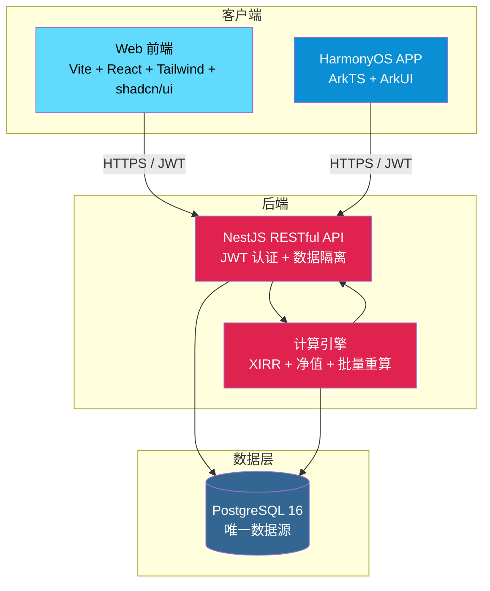
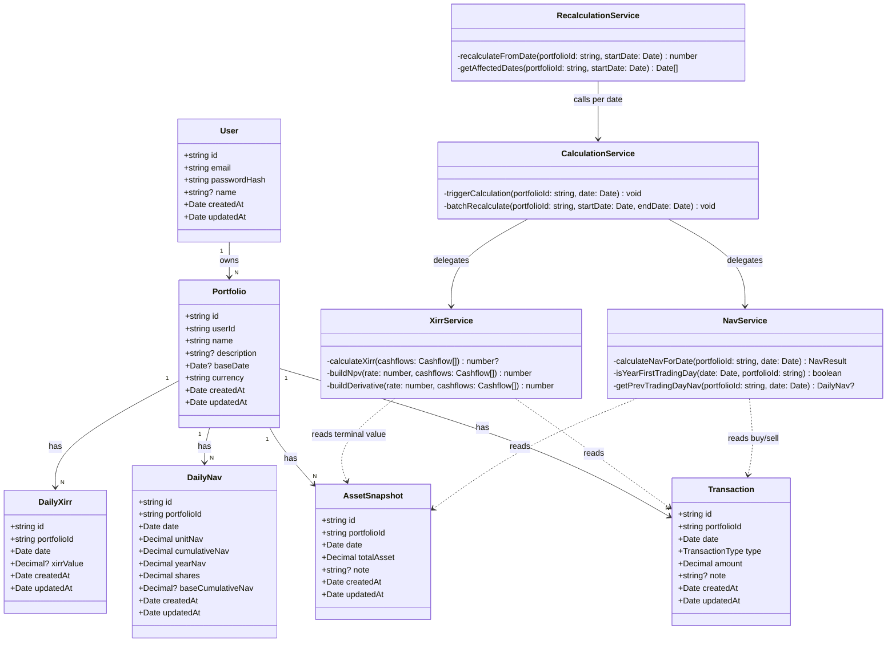
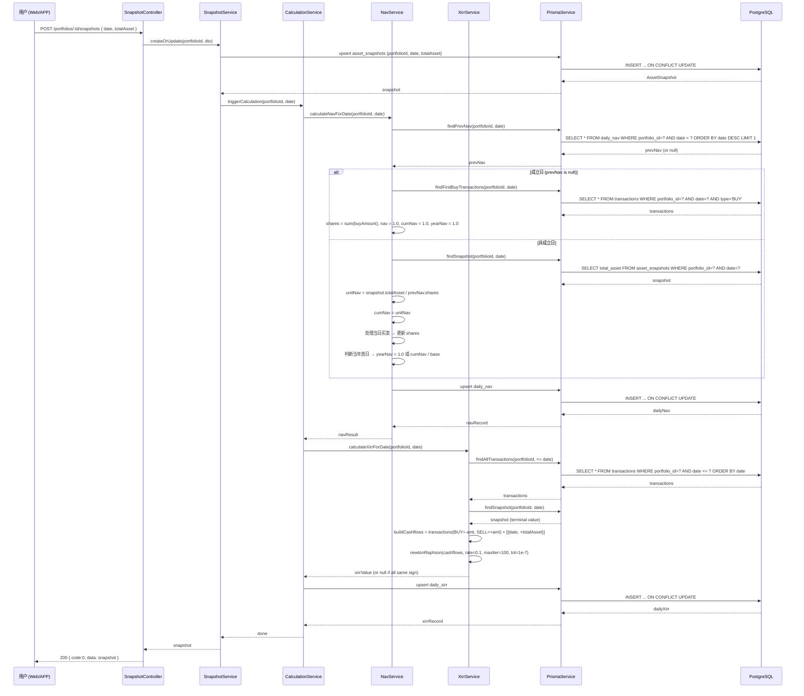
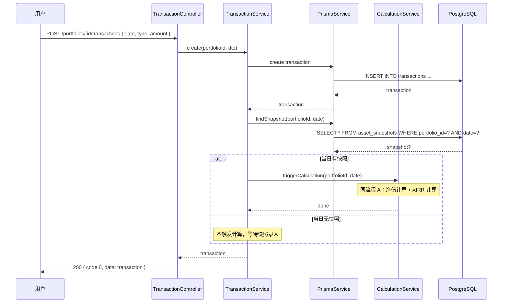
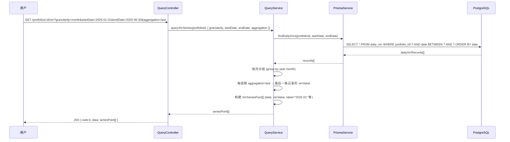
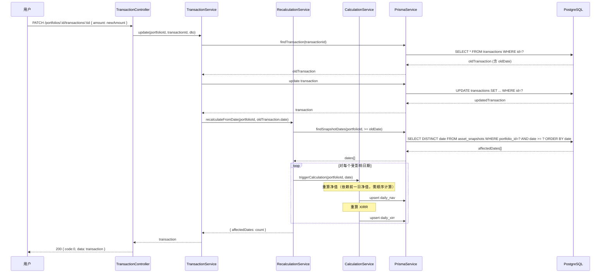
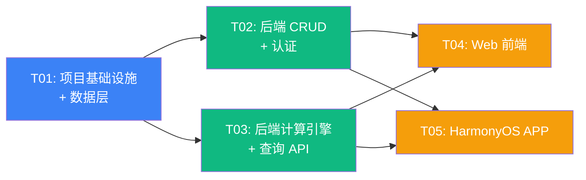

# 投资收益统计系统 — 架构设计文档

> **版本**: v1.0
> **架构师**: 高见远（Gao）
> **日期**: 2025-07-29
> **状态**: 评审就绪
> **依据**: PRD v1.0 + ENVIRONMENT-SETUP v1.0 + 用户拍板决策

---

## 目录

1. [架构总览](#1-架构总览)
2. [技术栈最终确认表](#2-技术栈最终确认表)
3. [数据库设计](#3-数据库设计critical)
4. [API 接口设计](#4-api-接口设计)
5. [核心数据结构](#5-核心数据结构)
6. [核心流程时序图](#6-核心流程时序图)
7. [XIRR 与净值计算模块设计](#7-xirr-与净值计算模块设计)
8. [前端架构设计](#8-前端架构设计)
9. [文件列表及相对路径](#9-文件列表及相对路径)
10. [任务列表](#10-任务列表critical)
11. [依赖包列表](#11-依赖包列表)
12. [共享知识（跨文件约定）](#12-共享知识跨文件约定)
13. [待明确事项](#13-待明确事项)

---

## 1. 架构总览

### 1.1 系统架构图



### 1.2 分层说明

| 层级 | 职责 | 技术实现 |
|------|------|---------|
| **表现层** | 用户交互、数据展示、表单录入、图表渲染 | Web: React + shadcn/ui + Recharts/ECharts；APP: ArkUI |
| **API 层** | 请求路由、JWT 认证、参数校验、数据隔离（user_id 过滤）、Swagger 文档 | NestJS Controllers + Guards + Pipes |
| **业务逻辑层** | XIRR 计算、净值计算、计算触发与批量重算、多维度查询聚合 | NestJS Services（纯 TypeScript，可独立测试） |
| **数据层** | 数据持久化、迁移管理、ORM 映射 | Prisma ORM + PostgreSQL 16 |

### 1.3 Monorepo 目录结构

```
投资收益app/
├── .gitignore
├── README.md
├── package.json                    # 根 package.json（workspace 配置 + 通用脚本）
├── pnpm-workspace.yaml             # pnpm monorepo 工作区声明
├── tsconfig.base.json              # TypeScript 共享基础配置
├── turbo.json                      # Turborepo 构建编排（可选加速）
├── docs/
│   ├── PRD.md
│   ├── ARCHITECTURE.md             # 本文件
│   ├── ENVIRONMENT-SETUP.md
│   ├── class-diagram.mermaid       # 类图（独立提取）
│   └── sequence-diagram.mermaid    # 时序图（独立提取）
├── packages/
│   ├── shared/                     # 共享类型与 API 契约（三端共用）
│   │   ├── package.json
│   │   ├── tsconfig.json
│   │   └── src/
│   │       ├── index.ts            # 统一导出
│   │       ├── types/              # 核心数据类型定义
│   │       │   ├── transaction.ts
│   │       │   ├── portfolio.ts
│   │       │   ├── snapshot.ts
│   │       │   ├── nav.ts
│   │       │   ├── xirr.ts
│   │       │   ├── user.ts
│   │       │   └── common.ts       # 通用类型（分页、API 响应信封等）
│   │       ├── enums/              # 枚举定义
│   │       │   ├── transaction-type.ts
│   │       │   └── query-granularity.ts
│   │       └── api-contracts/      # API 请求/响应契约
│   │           ├── auth.contract.ts
│   │           ├── portfolio.contract.ts
│   │           ├── transaction.contract.ts
│   │           ├── snapshot.contract.ts
│   │           ├── nav.contract.ts
│   │           └── xirr.contract.ts
│   ├── backend/                    # NestJS 后端
│   │   ├── package.json
│   │   ├── tsconfig.json
│   │   ├── nest-cli.json
│   │   ├── .env.example
│   │   ├── prisma/
│   │   │   ├── schema.prisma       # Prisma schema（完整数据模型）
│   │   │   ├── seed.ts             # 种子数据
│   │   │   └── migrations/         # 自动生成的迁移
│   │   └── src/
│   │       ├── main.ts             # 应用入口（Swagger 配置、全局管道）
│   │       ├── app.module.ts       # 根模块
│   │       ├── prisma/
│   │       │   ├── prisma.module.ts
│   │       │   └── prisma.service.ts   # PrismaClient 封装
│   │       ├── common/             # 通用基础设施
│   │       │   ├── decorators/
│   │       │   │   ├── current-user.decorator.ts
│   │       │   │   └── api-pagination.decorator.ts
│   │       │   ├── guards/
│   │       │   │   └── jwt-auth.guard.ts
│   │       │   ├── filters/
│   │       │   │   └── http-exception.filter.ts
│   │       │   ├── interceptors/
│   │       │   │   └── transform.interceptor.ts  # 统一响应信封
│   │       │   ├── pipes/
│   │       │   │   └── validation.pipe.ts
│   │       │   └── dto/
│   │       │       ├── pagination.dto.ts
│   │       │       └── date-range.dto.ts
│   │       └── modules/
│   │           ├── auth/           # 认证模块
│   │           │   ├── auth.module.ts
│   │           │   ├── auth.controller.ts
│   │           │   ├── auth.service.ts
│   │           │   ├── jwt.strategy.ts
│   │           │   └── dto/
│   │           │       ├── register.dto.ts
│   │           │       └── login.dto.ts
│   │           ├── portfolio/      # 组合管理模块
│   │           │   ├── portfolio.module.ts
│   │           │   ├── portfolio.controller.ts
│   │           │   ├── portfolio.service.ts
│   │           │   └── dto/
│   │           │       ├── create-portfolio.dto.ts
│   │           │       └── update-portfolio.dto.ts
│   │           ├── transaction/    # 交易录入模块
│   │           │   ├── transaction.module.ts
│   │           │   ├── transaction.controller.ts
│   │           │   ├── transaction.service.ts
│   │           │   └── dto/
│   │           │       ├── create-transaction.dto.ts
│   │           │       └── update-transaction.dto.ts
│   │           ├── snapshot/       # 资产快照模块
│   │           │   ├── snapshot.module.ts
│   │           │   ├── snapshot.controller.ts
│   │           │   ├── snapshot.service.ts
│   │           │   └── dto/
│   │           │       ├── create-snapshot.dto.ts
│   │           │       └── update-snapshot.dto.ts
│   │           ├── calculation/    # 计算引擎模块（核心）
│   │           │   ├── calculation.module.ts
│   │           │   ├── calculation.service.ts     # 编排：快照→净值→XIRR
│   │           │   ├── xirr.service.ts            # XIRR Newton-Raphson 实现
│   │           │   ├── nav.service.ts             # 净值份额法实现
│   │           │   └── recalculation.service.ts   # 批量重算
│   │           └── query/          # 查询聚合模块
│   │               ├── query.module.ts
│   │               ├── query.controller.ts        # XIRR/净值 四维度查询
│   │               ├── query.service.ts           # 聚合逻辑（期末值/均值）
│   │               └── dto/
│   │                   └── query.dto.ts
│   ├── web/                        # Web 前端
│   │   ├── package.json
│   │   ├── tsconfig.json
│   │   ├── tsconfig.node.json
│   │   ├── vite.config.ts
│   │   ├── tailwind.config.ts
│   │   ├── postcss.config.js
│   │   ├── components.json         # shadcn/ui 配置
│   │   ├── index.html
│   │   └── src/
│   │       ├── main.tsx            # React 入口
│   │       ├── App.tsx             # 根组件 + 路由
│   │       ├── index.css           # Tailwind 指令 + 全局样式
│   │       ├── lib/
│   │       │   ├── utils.ts        # cn() 等工具函数
│   │       │   ├── api-client.ts   # Axios 实例 + 拦截器
│   │       │   └── format.ts       # 金额/百分比/日期格式化
│   │       ├── api/                # API 请求层
│   │       │   ├── auth.api.ts
│   │       │   ├── portfolio.api.ts
│   │       │   ├── transaction.api.ts
│   │       │   ├── snapshot.api.ts
│   │       │   ├── nav.api.ts
│   │       │   └── xirr.api.ts
│   │       ├── stores/             # Zustand 全局状态
│   │       │   ├── auth.store.ts
│   │       │   └── portfolio.store.ts  # 当前选中组合
│   │       ├── hooks/              # TanStack Query hooks
│   │       │   ├── use-transactions.hook.ts
│   │       │   ├── use-snapshots.hook.ts
│   │       │   ├── use-nav.hook.ts
│   │       │   ├── use-xirr.hook.ts
│   │       │   └── use-portfolios.hook.ts
│   │       ├── components/         # shadcn/ui 基础组件 + 通用组件
│   │       │   └── ui/             # shadcn/ui 生成的基础组件
│   │       │       ├── button.tsx
│   │       │       ├── input.tsx
│   │       │       ├── dialog.tsx
│   │       │       ├── select.tsx
│   │       │       ├── table.tsx
│   │       │       ├── tabs.tsx
│   │       │       ├── card.tsx
│   │       │       ├── badge.tsx
│   │       │       ├── toast.tsx
│   │       │       ├── date-picker.tsx
│   │       │       └── chart.tsx       # shadcn/ui chart 封装
│   │       ├── features/           # 业务功能组件
│   │       │   ├── auth/
│   │       │   │   ├── login-form.tsx
│   │       │   │   └── register-form.tsx
│   │       │   ├── dashboard/
│   │       │   │   ├── stat-cards.tsx       # 关键指标卡片
│   │       │   │   ├── nav-trend-chart.tsx  # 净值趋势（Recharts）
│   │       │   │   └── xirr-trend-chart.tsx # XIRR 趋势（Recharts）
│   │       │   ├── transaction/
│   │       │   │   ├── transaction-form.tsx
│   │       │   │   └── transaction-table.tsx
│   │       │   ├── snapshot/
│   │       │   │   └── snapshot-form.tsx
│   │       │   ├── analysis/
│   │       │   │   ├── xirr-analysis.tsx         # XIRR 分析页
│   │       │   │   ├── nav-analysis.tsx          # 净值分析页
│   │       │   │   ├── yearly-bar-chart.tsx       # 年度收益柱状图
│   │       │   │   └── monthly-heatmap.tsx        # 月度热力图（ECharts）
│   │       │   ├── portfolio/
│   │       │   │   ├── portfolio-selector.tsx
│   │       │   │   └── portfolio-manager.tsx
│   │       │   └── settings/
│   │       │       └── settings-page.tsx
│   │       └── pages/              # 页面组件
│   │           ├── login.page.tsx
│   │           ├── register.page.tsx
│   │           ├── dashboard.page.tsx
│   │           ├── transactions.page.tsx
│   │           ├── snapshots.page.tsx
│   │           ├── analysis-xirr.page.tsx
│   │           ├── analysis-nav.page.tsx
│   │           ├── settings.page.tsx
│   │           └── not-found.page.tsx
│   └── harmonyos/                  # HarmonyOS APP
│       ├── build-profile.json5     # DevEco Studio 构建配置
│       ├── oh-package.json5        # 鸿蒙依赖管理
│       └── entry/
│           ├── src/
│           │   └── main/
│           │       ├── module.json5        # 模块配置
│           │       ├── resources/          # 资源文件（字符串/颜色/图片）
│           │       └── ets/
│           │           ├── entryability/
│           │           │   └── EntryAbility.ets   # 入口 Ability
│           │           ├── pages/
│           │           │   ├── IndexPage.ets       # Dashboard 首页
│           │           │   ├── TransactionPage.ets # 交易录入
│           │           │   ├── SnapshotPage.ets    # 快照录入
│           │           │   ├── XirrAnalysisPage.ets # XIRR 分析
│           │           │   ├── NavAnalysisPage.ets  # 净值分析
│           │           │   ├── PortfolioPage.ets    # 组合管理
│           │           │   ├── LoginPage.ets        # 登录
│           │           │   └── SettingsPage.ets     # 设置
│           │           ├── components/
│           │           │   ├── StatCard.ets         # 指标卡片
│           │           │   ├── LineChart.ets        # 折线图（Canvas 自绘）
│           │           │   ├── BarChart.ets         # 柱状图（Canvas 自绘）
│           │           │   ├── TransactionList.ets  # 交易列表
│           │           │   ├── SnapshotForm.ets     # 快照表单
│           │           │   ├── TransactionForm.ets  # 交易表单
│           │           │   ├── DatePicker.ets       # 日期选择器
│           │           │   └── NavRouter.ets        # 底部导航栏
│           │           ├── model/
│           │           │   ├── Transaction.ets
│           │           │   ├── Portfolio.ets
│           │           │   ├── Snapshot.ets
│           │           │   ├── NavRecord.ets
│           │           │   ├── XirrRecord.ets
│           │           │   └── ApiResponse.ets
│           │           ├── network/
│           │           │   ├── HttpClient.ets       # @ohos.net.http 封装
│           │           │   ├── ApiConfig.ets        # API 基址配置
│           │           │   ├── AuthApi.ets          # 认证接口
│           │           │   ├── PortfolioApi.ets
│           │           │   ├── TransactionApi.ets
│           │           │   ├── SnapshotApi.ets
│           │           │   ├── NavApi.ets
│           │           │   └── XirrApi.ets
│           │           ├── store/
│           │           │   ├── AppStore.ets         # 全局状态（@Observed）
│           │           │   ├── AuthStore.ets        # 认证状态 + Token
│           │           │   └── PortfolioStore.ets   # 当前组合状态
│           │           └── utils/
│           │               ├── DateUtils.ets
│           │               ├── FormatUtils.ets      # 金额/百分比格式化
│           │               └── ChartUtils.ets       # Canvas 图表绘制工具
│           └── build-profile.json5
```

---

## 2. 技术栈最终确认表

| 层级 | 技术选型 | 版本 | 确认/微调 | 理由 |
|------|---------|------|----------|------|
| **后端框架** | NestJS | ^10.0 | ✅ 确认 | TypeScript 原生，模块化架构清晰，内置 DI/Guards/Pipes/Swagger，适合中型金融项目 |
| **ORM** | Prisma | ^5.0 | ✅ 确认 | TypeScript 类型安全，迁移管理优秀，PostgreSQL 支持完善，NUMERIC 类型映射为 Decimal |
| **数据库** | PostgreSQL | 16 | ✅ 确认 | NUMERIC 高精度，JSON/窗口函数支持，成熟稳定 |
| **XIRR 计算** | 自实现 Newton-Raphson | — | ✅ **微调：自实现**（不用 npm 包） | PRD 已提供完整伪代码，自实现约 60 行，可完全控制边界条件（全同号返回 null、收敛失败处理、精度阈值）。npm 包 `xirr` 维护停滞且边界处理不够，`financejs` 过重 |
| **Web 构建** | Vite | ^5.0 | ✅ 确认 | 极速 HMR，React 生态成熟 |
| **Web 框架** | React | ^18.2 | ✅ 确认 | 生态最丰富，shadcn/ui 原生支持 |
| **Web UI** | shadcn/ui + Tailwind CSS | shadcn latest + Tailwind ^3.4 | ✅ 确认 | Radix+Tailwind 零冲突，组件代码进项目可自由定制，弃用 MUI 避免样式冲突 |
| **Web 图表** | Recharts + ECharts | Recharts ^2.12 + ECharts ^5.5 | ✅ 确认 | Recharts 用于折线/柱状（shadcn/ui chart 底层），ECharts 用于月度热力图等复杂图表 |
| **Web 状态** | Zustand + TanStack Query | Zustand ^4.5 + TanStack Query ^5.0 | ✅ 确认 | Zustand 管理客户端状态（auth/portfolio 选择），TanStack Query 管理服务端状态（缓存/重试/失效） |
| **Web 表单** | React Hook Form + Zod | RHF ^7.51 + Zod ^3.23 | ✅ 确认 | RHF 性能优秀，Zod schema 可前后端共享校验 |
| **Web 路由** | React Router | ^6.22 | ✅ 确认 | React 生态标准路由 |
| **Web HTTP** | Axios | ^1.6 | ✅ 确认 | 拦截器机制适合统一注入 JWT + 错误处理 |
| **APP 语言** | ArkTS | HarmonyOS API 12+ | ✅ 确认 | 鸿蒙官方语言，TypeScript 超集 |
| **APP UI** | ArkUI | API 12+ | ✅ 确认 | 声明式 UI，鸿蒙原生 |
| **APP 图表** | Canvas 自绘（折线/柱状）+ WebView+ECharts（热力图） | — | ✅ **推荐** | 鸿蒙三方图表库生态不成熟（`@ohos/mpchart` 兼容性存疑），Canvas API 稳定可靠。折线/柱状自绘约 200 行/组件；月度热力图较复杂，用 WebView 嵌入 ECharts HTML 更高效。v1 仅做折线/柱状自绘，热力图列入 P1 |
| **APP 网络** | @ohos.net.http | API 12+ | ✅ 确认 | 鸿蒙官方 HTTP 模块 |
| **认证** | JWT + bcrypt | @nestjs/jwt ^10 + bcrypt ^5.1 | ✅ 确认 | JWT 无状态适合多端，bcrypt 加盐哈希 |
| **API 文档** | Swagger | @nestjs/swagger ^7 | ✅ 确认 | NestJS 原生集成，自动生成 OpenAPI |
| **后端测试** | Jest | ^29 | ✅ 确认 | NestJS 默认测试框架 |
| **Web 测试** | Vitest + React Testing Library | Vitest ^1.6 + RTL ^15 | ✅ 确认 | Vite 原生测试，快速 |
| **仓库结构** | pnpm monorepo | pnpm ^9 | ✅ 确认 | 磁盘高效，workspace 协议支持共享包 |
| **构建编排** | Turborepo | ^2.0 | ✅ **新增**（可选） | 加速 monorepo 构建缓存，非必须但提升 DX |

---

## 3. 数据库设计（CRITICAL）

### 3.1 Prisma Schema 完整定义

```prisma
// packages/backend/prisma/schema.prisma

generator client {
  provider = "prisma-client-js"
}

datasource db {
  provider = "postgresql"
  url      = env("DATABASE_URL")
}

// ==================== 用户表 ====================
model User {
  id           String   @id @default(uuid())
  email        String   @unique
  passwordHash String   @map("password_hash")
  name         String?
  createdAt    DateTime @default(now()) @map("created_at")
  updatedAt    DateTime @updatedAt @map("updated_at")

  portfolios Portfolio[]

  @@map("users")
}

// ==================== 投资组合表 ====================
model Portfolio {
  id          String    @id @default(uuid())
  userId      String    @map("user_id")
  name        String
  description String?
  // 成立日：首笔买入日，首次录入买入交易时自动设置，设置后不可更改
  baseDate    DateTime? @map("base_date") @db.Date
  currency    String    @default("CNY")
  createdAt   DateTime  @default(now()) @map("created_at")
  updatedAt   DateTime  @updatedAt @map("updated_at")

  user         User            @relation(fields: [userId], references: [id], onDelete: Cascade)
  transactions Transaction[]
  snapshots    AssetSnapshot[]
  dailyNavs    DailyNav[]
  dailyXirrs   DailyXirr[]

  @@index([userId])
  @@map("portfolios")
}

// ==================== 交易记录表 ====================
model Transaction {
  id          String      @id @default(uuid())
  portfolioId String      @map("portfolio_id")
  date        DateTime    @db.Date
  // BUY = 买入（现金流为负），SELL = 卖出（现金流为正）
  type        TransactionType
  amount      Decimal     @db.Decimal(18, 2)   // 交易金额，始终 > 0
  note        String?
  createdAt   DateTime    @default(now()) @map("created_at")
  updatedAt   DateTime    @updatedAt @map("updated_at")

  portfolio Portfolio @relation(fields: [portfolioId], references: [id], onDelete: Cascade)

  // 查询索引：按组合 + 日期查询交易序列（XIRR/净值计算核心查询）
  @@index([portfolioId, date])
  @@map("transactions")
}

enum TransactionType {
  BUY
  SELL
}

// ==================== 资产快照表 ====================
model AssetSnapshot {
  id          String   @id @default(uuid())
  portfolioId String   @map("portfolio_id")
  date        DateTime @db.Date
  totalAsset  Decimal  @db.Decimal(18, 2)   // 当日持仓总市值，始终 > 0
  note        String?
  createdAt   DateTime @default(now()) @map("created_at")
  updatedAt   DateTime @updatedAt @map("updated_at")

  portfolio Portfolio @relation(fields: [portfolioId], references: [id], onDelete: Cascade)

  // 唯一约束：每个组合每日仅一条快照（重复录入时 upsert 覆盖）
  @@unique([portfolioId, date])
  @@index([portfolioId, date])
  @@map("asset_snapshots")
}

// ==================== 每日净值表 ====================
model DailyNav {
  id               String   @id @default(uuid())
  portfolioId      String   @map("portfolio_id")
  date             DateTime @db.Date
  // 当日单位净值 = 当日资产快照 / 上日末份额（成立日 = 1.0000）
  unitNav          Decimal  @db.Decimal(12, 6) @map("unit_nav")
  // 累计净值 = 单位净值（v1 无分红，累计净值即单位净值）
  cumulativeNav    Decimal  @db.Decimal(12, 6) @map("cumulative_nav")
  // 当年净值 = 当日累计净值 / base_cumulative_nav（当年首日 = 1.0000）
  yearNav          Decimal  @db.Decimal(12, 6) @map("year_nav")
  // 当日末总份额
  shares           Decimal  @db.Decimal(18, 6)
  // 当年基准累计净值（上年末最后一个有快照交易日的累计净值，当年首日设置后年内不变）
  baseCumulativeNav Decimal? @db.Decimal(12, 6) @map("base_cumulative_nav")
  createdAt        DateTime @default(now()) @map("created_at")
  updatedAt        DateTime @updatedAt @map("updated_at")

  portfolio Portfolio @relation(fields: [portfolioId], references: [id], onDelete: Cascade)

  // 唯一约束：每个组合每日仅一条净值记录
  @@unique([portfolioId, date])
  // 核心查询索引：按组合 + 日期范围查询净值序列
  @@index([portfolioId, date])
  @@map("daily_nav")
}

// ==================== 每日 XIRR 表 ====================
model DailyXirr {
  id          String    @id @default(uuid())
  portfolioId String    @map("portfolio_id")
  date        DateTime  @db.Date
  // 累计 XIRR 年化收益率（小数形式，如 0.1234 表示 12.34%），null 表示数据不足
  xirrValue   Decimal?  @db.Decimal(10, 8) @map("xirr_value")
  createdAt   DateTime  @default(now()) @map("created_at")
  updatedAt   DateTime  @updatedAt @map("updated_at")

  portfolio Portfolio @relation(fields: [portfolioId], references: [id], onDelete: Cascade)

  // 唯一约束：每个组合每日仅一条 XIRR 记录
  @@unique([portfolioId, date])
  // 核心查询索引：按组合 + 日期范围查询 XIRR 序列
  @@index([portfolioId, date])
  @@map("daily_xirr")
}
```

### 3.2 设计要点说明

#### 多组合关联

```
User (1) ──< Portfolio (N)
                ├──< Transaction (N)
                ├──< AssetSnapshot (N)
                ├──< DailyNav (N)
                └──< DailyXirr (N)
```

- 所有业务表均通过 `portfolio_id` 外键关联到 `Portfolio`
- `Portfolio.userId` 实现用户级数据隔离
- 级联删除：删除 Portfolio 时级联删除其下所有子记录（`onDelete: Cascade`）
- 删除 User 时级联删除其所有 Portfolio 及子记录

#### daily_nav 表字段说明

| 字段 | 含义 | 计算方式 |
|------|------|---------|
| `unit_nav` | 当日单位净值 | 成立日=1.0；其他日=当日资产快照/上日末份额 |
| `cumulative_nav` | 累计净值 | = unit_nav（v1 无分红） |
| `year_nav` | 当年净值 | 当年首日=1.0；其他日=累计净值/base_cumulative_nav |
| `shares` | 当日末总份额 | 上日末份额 + 买入份额 - 卖出份额 |
| `base_cumulative_nav` | 当年基准净值 | 当年首个有快照交易日设置=上年末累计净值，年内不变 |

#### daily_xirr 表字段说明

| 字段 | 含义 | 计算方式 |
|------|------|---------|
| `xirr_value` | 累计 XIRR | Newton-Raphson 求解，全同号现金流时为 null |

#### 索引设计

| 表 | 索引 | 用途 |
|----|------|------|
| portfolios | `@@index([userId])` | 用户查询自己的组合列表 |
| transactions | `@@index([portfolioId, date])` | XIRR/净值计算时按日期范围拉取交易序列 |
| asset_snapshots | `@@unique([portfolioId, date])` + `@@index([portfolioId, date])` | 每日唯一快照 + 日期范围查询 |
| daily_nav | `@@unique([portfolioId, date])` + `@@index([portfolioId, date])` | 每日唯一净值 + 四维度查询 |
| daily_xirr | `@@unique([portfolioId, date])` + `@@index([portfolioId, date])` | 每日唯一 XIRR + 四维度查询 |

#### 数据精度

| 数据项 | Prisma 类型 | PostgreSQL 类型 | 精度 |
|--------|------------|----------------|------|
| 交易金额 | `Decimal` | `DECIMAL(18,2)` | 2 位小数（分） |
| 资产快照金额 | `Decimal` | `DECIMAL(18,2)` | 2 位小数（分） |
| 单位/累计/当年净值 | `Decimal` | `DECIMAL(12,6)` | 6 位小数（计算精度，展示取 4 位） |
| 份额 | `Decimal` | `DECIMAL(18,6)` | 6 位小数 |
| XIRR | `Decimal` | `DECIMAL(10,8)` | 8 位小数（小数形式，如 0.12345678，展示取 2 位百分比） |

> **注意**：净值存储 6 位小数确保计算精度，前端展示时四舍五入到 4 位。XIRR 存储 8 位小数（小数形式），前端展示为百分比 2 位小数。

---

## 4. API 接口设计

### 4.1 通用约定

- **Base URL**: `/api/v1`
- **认证**: 除注册/登录外所有接口需 `Authorization: Bearer <JWT>` 头
- **响应信封**: 所有响应统一为 `{ code: number, data: T, message: string }`
- **日期格式**: 请求/响应中日期统一为 `YYYY-MM-DD`（ISO 8601 date-only）
- **分页**: `?page=1&pageSize=20`，响应含 `{ items: T[], total: number, page: number, pageSize: number }`

### 4.2 API 接口列表

#### 认证模块

| Method | Path | 说明 | 请求体 | 响应 data |
|--------|------|------|--------|-----------|
| POST | `/api/v1/auth/register` | 用户注册 | `{ email, password, name }` | `{ id, email, name }` |
| POST | `/api/v1/auth/login` | 用户登录 | `{ email, password }` | `{ accessToken, user: { id, email, name } }` |
| GET | `/api/v1/auth/me` | 获取当前用户 | — | `{ id, email, name }` |

#### 组合管理

| Method | Path | 说明 | 请求体/参数 | 响应 data |
|--------|------|------|------------|-----------|
| GET | `/api/v1/portfolios` | 获取当前用户组合列表 | — | `Portfolio[]` |
| POST | `/api/v1/portfolios` | 创建组合 | `{ name, description?, currency? }` | `Portfolio` |
| GET | `/api/v1/portfolios/:id` | 获取组合详情 | — | `Portfolio` |
| PATCH | `/api/v1/portfolios/:id` | 更新组合 | `{ name?, description? }` | `Portfolio` |
| DELETE | `/api/v1/portfolios/:id` | 删除组合（级联删除子数据） | — | `null` |

#### 交易管理

| Method | Path | 说明 | 请求体/参数 | 响应 data |
|--------|------|------|------------|-----------|
| GET | `/api/v1/portfolios/:portfolioId/transactions` | 获取交易列表 | `?startDate&endDate&page&pageSize` | `Paginated<Transaction>` |
| POST | `/api/v1/portfolios/:portfolioId/transactions` | 录入交易 | `{ date, type: BUY\|SELL, amount, note? }` | `Transaction` |
| PATCH | `/api/v1/portfolios/:portfolioId/transactions/:id` | 编辑交易 | `{ date?, type?, amount?, note? }` | `Transaction` |
| DELETE | `/api/v1/portfolios/:portfolioId/transactions/:id` | 删除交易 | — | `null` |

> **副作用**: 创建/编辑/删除交易后，若当日已有资产快照，后端自动触发当日净值+XIRR 重算。若修改的是历史交易，触发从该日期起的批量重算。

#### 资产快照管理

| Method | Path | 说明 | 请求体/参数 | 响应 data |
|--------|------|------|------------|-----------|
| GET | `/api/v1/portfolios/:portfolioId/snapshots` | 获取快照列表 | `?startDate&endDate&page&pageSize` | `Paginated<AssetSnapshot>` |
| POST | `/api/v1/portfolios/:portfolioId/snapshots` | 录入/覆盖快照 | `{ date, totalAsset, note? }` | `AssetSnapshot` |
| PATCH | `/api/v1/portfolios/:portfolioId/snapshots/:id` | 编辑快照 | `{ totalAsset?, note? }` | `AssetSnapshot` |
| DELETE | `/api/v1/portfolios/:portfolioId/snapshots/:id` | 删除快照 | — | `null` |

> **副作用**: 创建/编辑/删除快照后，后端自动触发当日净值+XIRR 计算。编辑/删除历史快照触发从该日期起的批量重算。

#### XIRR 查询（四维度）

| Method | Path | 说明 | 请求参数 | 响应 data |
|--------|------|------|---------|-----------|
| GET | `/api/v1/portfolios/:portfolioId/xirr` | 查询 XIRR 时间序列 | `?granularity=day\|week\|month\|year&startDate&endDate&aggregation=last\|avg` | `XirrSeriesPoint[]` |
| GET | `/api/v1/portfolios/:portfolioId/xirr/latest` | 获取最新 XIRR | — | `{ date, xirrValue }` |

**XirrSeriesPoint 结构**:
```typescript
{
  date: string;          // ISO 日期 YYYY-MM-DD
  xirrValue: number | null;  // null 表示数据不足
  label: string;         // 显示标签（如 "2025-03" 或 "2025-W12"）
}
```

#### 净值查询（四维度）

| Method | Path | 说明 | 请求参数 | 响应 data |
|--------|------|------|---------|-----------|
| GET | `/api/v1/portfolios/:portfolioId/nav` | 查询净值时间序列 | `?granularity=day\|week\|month\|year&startDate&endDate&aggregation=last\|avg&metric=cumulative\|year\|both` | `NavSeriesPoint[]` |
| GET | `/api/v1/portfolios/:portfolioId/nav/latest` | 获取最新净值 | — | `{ date, cumulativeNav, yearNav, shares }` |

**NavSeriesPoint 结构**:
```typescript
{
  date: string;
  cumulativeNav: number | null;
  yearNav: number | null;
  shares: number | null;
  label: string;
}
```

#### 计算触发

| Method | Path | 说明 | 请求体 | 响应 data |
|--------|------|------|--------|-----------|
| POST | `/api/v1/portfolios/:portfolioId/recalculate` | 手动触发批量重算 | `{ startDate, endDate? }` | `{ affectedDates: number, duration: number }` |

#### 统计摘要（Dashboard 卡片）

| Method | Path | 说明 | 请求参数 | 响应 data |
|--------|------|------|---------|-----------|
| GET | `/api/v1/portfolios/:portfolioId/summary` | 获取关键指标摘要 | — | `PortfolioSummary` |

**PortfolioSummary 结构**:
```typescript
{
  cumulativeXirr: number | null;      // 累计 XIRR
  totalReturnRate: number | null;     // 总收益率 = (最新累计净值 - 1) * 100%
  yearReturnRate: number | null;      // 当年收益率 = (最新当年净值 - 1) * 100%
  maxDrawdown: number | null;         // 最大回撤（P1，v1 可返回 null）
  latestDate: string;                 // 最新有数据的日期
  inceptionDate: string;              // 成立日
}
```

---

## 5. 核心数据结构

### 5.1 类图



### 5.2 Shared 包 TypeScript 类型定义

```typescript
// packages/shared/src/types/common.ts
export interface ApiResponse<T> {
  code: number;
  data: T;
  message: string;
}

export interface Paginated<T> {
  items: T[];
  total: number;
  page: number;
  pageSize: number;
}

export interface DateRangeQuery {
  startDate?: string;  // YYYY-MM-DD
  endDate?: string;
}

// packages/shared/src/enums/transaction-type.ts
export enum TransactionType {
  BUY = 'BUY',
  SELL = 'SELL',
}

// packages/shared/src/enums/query-granularity.ts
export enum QueryGranularity {
  DAY = 'day',
  WEEK = 'week',
  MONTH = 'month',
  YEAR = 'year',
}

export enum AggregationMethod {
  LAST = 'last',
  AVG = 'avg',
}

// packages/shared/src/types/transaction.ts
export interface Transaction {
  id: string;
  portfolioId: string;
  date: string;            // YYYY-MM-DD
  type: TransactionType;
  amount: string;          // Decimal as string (避免前端精度丢失)
  note: string | null;
  createdAt: string;
  updatedAt: string;
}

// packages/shared/src/types/portfolio.ts
export interface Portfolio {
  id: string;
  userId: string;
  name: string;
  description: string | null;
  baseDate: string | null;
  currency: string;
  createdAt: string;
  updatedAt: string;
}

// packages/shared/src/types/snapshot.ts
export interface AssetSnapshot {
  id: string;
  portfolioId: string;
  date: string;
  totalAsset: string;      // Decimal as string
  note: string | null;
  createdAt: string;
  updatedAt: string;
}

// packages/shared/src/types/nav.ts
export interface DailyNav {
  id: string;
  portfolioId: string;
  date: string;
  unitNav: string;
  cumulativeNav: string;
  yearNav: string;
  shares: string;
  baseCumulativeNav: string | null;
  createdAt: string;
  updatedAt: string;
}

export interface NavSeriesPoint {
  date: string;
  cumulativeNav: number | null;
  yearNav: number | null;
  shares: number | null;
  label: string;
}

// packages/shared/src/types/xirr.ts
export interface DailyXirr {
  id: string;
  portfolioId: string;
  date: string;
  xirrValue: string | null;   // null = 数据不足
  createdAt: string;
  updatedAt: string;
}

export interface XirrSeriesPoint {
  date: string;
  xirrValue: number | null;
  label: string;
}

export interface PortfolioSummary {
  cumulativeXirr: number | null;
  totalReturnRate: number | null;
  yearReturnRate: number | null;
  maxDrawdown: number | null;
  latestDate: string;
  inceptionDate: string;
}
```

---

## 6. 核心流程时序图

### 流程 A：录入资产快照 → 触发净值计算 → 触发 XIRR 计算



### 流程 B：录入交易 → 若当日有快照则触发重算



### 流程 C：按月查询 XIRR/净值 → 后端聚合 → 返回时间序列



### 流程 D：历史数据修改 → 批量重算受影响日期



---

## 7. XIRR 与净值计算模块设计

### 7.1 XIRR 计算服务

#### 方案选择：自实现 Newton-Raphson（不用 npm 包）

**理由**：
1. PRD 已提供完整伪代码，实现约 60 行
2. `xirr` npm 包最后更新较久，边界处理不够（全同号、收敛失败）
3. 自实现可完全控制精度阈值、迭代上限、边界返回值
4. 金融计算需要可审计、可测试的确定性实现

#### 核心实现

```typescript
// packages/backend/src/modules/calculation/xirr.service.ts

interface Cashflow {
  date: Date;       // 现金流日期
  amount: number;   // 金额：买入为负，卖出为正，终值为正
}

@Injectable()
export class XirrService {
  private readonly INITIAL_RATE = 0.1;       // 初始猜测 10%
  private readonly MAX_ITERATIONS = 100;     // 最大迭代次数
  private readonly TOLERANCE = 1e-7;         // 收敛阈值 |NPV| < 1e-7
  private readonly MIN_RATE = -0.999;        // 防止 (1+r) <= 0 溢出

  /**
   * 计算 XIRR 年化收益率
   * @param cashflows 现金流序列（买入=负，卖出=正，终值=正）
   * @returns 年化收益率（小数形式，如 0.1234 = 12.34%），全同号返回 null
   */
  calculateXirr(cashflows: Cashflow[]): number | null {
    if (cashflows.length < 2) return null;

    // 边界检查：全同号现金流无法求解
    const allPositive = cashflows.every(cf => cf.amount > 0);
    const allNegative = cashflows.every(cf => cf.amount < 0);
    if (allPositive || allNegative) return null;

    // 按日期排序
    const sorted = [...cashflows].sort((a, b) => a.date.getTime() - b.date.getTime());
    const firstDate = sorted[0].date;

    let rate = this.INITIAL_RATE;

    for (let i = 0; i < this.MAX_ITERATIONS; i++) {
      const npv = this.calculateNpv(rate, sorted, firstDate);
      if (Math.abs(npv) < this.TOLERANCE) {
        return rate;
      }
      const derivative = this.calculateDerivative(rate, sorted, firstDate);
      if (derivative === 0) break;
      rate = rate - npv / derivative;
      if (rate <= this.MIN_RATE) rate = this.MIN_RATE;
    }

    // 迭代结束未收敛，返回当前值（精度可能不足但仍可用）
    return rate;
  }

  private calculateNpv(rate: number, cashflows: Cashflow[], firstDate: Date): number {
    return cashflows.reduce((sum, cf) => {
      const yearFraction = (cf.date.getTime() - firstDate.getTime()) / (365 * 24 * 60 * 60 * 1000);
      return sum + cf.amount / Math.pow(1 + rate, yearFraction);
    }, 0);
  }

  private calculateDerivative(rate: number, cashflows: Cashflow[], firstDate: Date): number {
    return cashflows.reduce((sum, cf) => {
      const yearFraction = (cf.date.getTime() - firstDate.getTime()) / (365 * 24 * 60 * 60 * 1000);
      const base = Math.pow(1 + rate, yearFraction);
      return sum - (cf.amount * yearFraction) / (base * (1 + rate));
    }, 0);
  }

  /**
   * 为指定日期构建现金流序列并计算 XIRR
   * 现金流 = [成立日 ~ 当日的所有交易] + [当日资产快照作为正终值]
   */
  async calculateXirrForDate(portfolioId: string, date: Date): Promise<number | null> {
    // 1. 查询成立日到当日的所有交易
    const transactions = await this.prisma.transaction.findMany({
      where: { portfolioId, date: { lte: date } },
      orderBy: { date: 'asc' },
    });

    // 2. 查询当日资产快照（终值）
    const snapshot = await this.prisma.assetSnapshot.findUnique({
      where: { portfolioId_date: { portfolioId, date } },
    });
    if (!snapshot) return null;

    // 3. 构建现金流
    const cashflows: Cashflow[] = transactions.map(t => ({
      date: t.date,
      amount: t.type === 'BUY' ? -Number(t.amount) : Number(t.amount),
    }));
    cashflows.push({ date, amount: Number(snapshot.totalAsset) });

    // 4. 计算
    return this.calculateXirr(cashflows);
  }
}
```

#### 边界处理

| 场景 | 处理方式 |
|------|---------|
| 现金流 < 2 条 | 返回 null |
| 全为正（纯卖出+终值） | 返回 null |
| 全为负（纯买入无终值） | 返回 null |
| 迭代 100 次未收敛 | 返回当前 rate（精度可能不足） |
| 导数为 0（无法迭代） | break，返回当前 rate |
| rate ≤ -1 | 钳制为 -0.999 防止溢出 |

### 7.2 净值计算服务

#### 份额法实现

```typescript
// packages/backend/src/modules/calculation/nav.service.ts

interface NavResult {
  unitNav: number;
  cumulativeNav: number;
  yearNav: number;
  shares: number;
  baseCumulativeNav: number | null;
}

@Injectable()
export class NavService {
  /**
   * 计算指定日期的净值
   * 必须顺序计算（当日依赖前一日份额），批量重算时按日期升序逐日计算
   */
  async calculateNavForDate(portfolioId: string, date: Date): Promise<NavResult | null> {
    // 1. 查询当日资产快照
    const snapshot = await this.prisma.assetSnapshot.findUnique({
      where: { portfolioId_date: { portfolioId, date } },
    });
    if (!snapshot) return null; // 无快照则不计算

    // 2. 查询前一日净值记录
    const prevNav = await this.prisma.dailyNav.findFirst({
      where: { portfolioId, date: { lt: date } },
      orderBy: { date: 'desc' },
    });

    // 3. 查询当日交易
    const dayTransactions = await this.prisma.transaction.findMany({
      where: { portfolioId, date },
    });
    const buyAmount = dayTransactions
      .filter(t => t.type === 'BUY')
      .reduce((sum, t) => sum + Number(t.amount), 0);
    const sellAmount = dayTransactions
      .filter(t => t.type === 'SELL')
      .reduce((sum, t) => sum + Number(t.amount), 0);

    if (!prevNav) {
      // ===== 成立日 =====
      // 首笔必须为买入，份额 = 买入金额，净值 = 1.0
      if (buyAmount <= 0) {
        throw new BadRequestException('首笔交易必须为买入');
      }
      return {
        unitNav: 1.0,
        cumulativeNav: 1.0,
        yearNav: 1.0,
        shares: buyAmount,
        baseCumulativeNav: 1.0,
      };
    }

    // ===== 非成立日 =====
    const prevShares = Number(prevNav.shares);
    const unitNav = Number(snapshot.totalAsset) / prevShares;
    const cumulativeNav = unitNav;

    // 处理当日申赎
    const newShares = buyAmount / unitNumit - sellAmount / unitNav;
    const shares = prevShares + newShares;

    // 当年净值计算
    let yearNav: number;
    let baseCumulativeNav: number | null;

    if (this.isYearFirstTradingDay(date, prevNav.date)) {
      // 当年首个有快照的交易日 → 重置
      baseCumulativeNav = cumulativeNav; // wait... 应该用上年末累计净值
      // 修正：base = 上年末（prevNav）的累计净值
      baseCumulativeNav = Number(prevNav.cumulativeNav);
      yearNav = 1.0;
    } else {
      baseCumulativeNav = prevNav.baseCumulativeNav;
      yearNav = baseCumulativeNav ? cumulativeNav / baseCumulativeNav : 1.0;
    }

    return { unitNav, cumulativeNav, yearNav, shares, baseCumulativeNav };
  }

  /**
   * 判断当前日期是否为当年首个有快照的交易日
   * 逻辑：当前日期的年份 != 前一日净值记录的年份
   */
  private isYearFirstTradingDay(currentDate: Date, prevDate: Date): boolean {
    return currentDate.getFullYear() !== prevDate.getFullYear();
  }
}
```

#### 关键逻辑说明

| 场景 | 处理 |
|------|------|
| **成立日** | prevNav = null → shares = 首笔买入金额, nav = 1.0, cumNav = 1.0, yearNav = 1.0, base = 1.0 |
| **非成立日** | unitNav = 当日资产 / 上日份额 → 处理买卖更新份额 |
| **当年首日** | date 年份 != prevNav 年份 → yearNav = 1.0, base = prevNav.cumulativeNav |
| **当年非首日** | yearNav = cumNav / base（base 从当年首日继承） |
| **无快照** | 不生成净值记录（周末/节假日沿用前值，不产生新记录） |

### 7.3 计算触发器

```typescript
// packages/backend/src/modules/calculation/calculation.service.ts

@Injectable()
export class CalculationService {
  /**
   * 触发单日计算：净值 → XIRR
   * 快照录入/修改时调用
   */
  async triggerCalculation(portfolioId: string, date: Date): Promise<void> {
    // 1. 设置组合成立日（如果尚未设置）
    await this.ensureBaseDate(portfolioId, date);

    // 2. 计算净值
    const navResult = await this.navService.calculateNavForDate(portfolioId, date);
    if (navResult) {
      await this.prisma.dailyNav.upsert({
        where: { portfolioId_date: { portfolioId, date } },
        create: { portfolioId, date, ...navResult },
        update: { ...navResult },
      });
    }

    // 3. 计算 XIRR
    const xirrValue = await this.xirrService.calculateXirrForDate(portfolioId, date);
    await this.prisma.dailyXirr.upsert({
      where: { portfolioId_date: { portfolioId, date } },
      create: { portfolioId, date, xirrValue: xirrValue ?? null },
      update: { xirrValue: xirrValue ?? null },
    });
  }

  /**
   * 批量重算：从指定日期开始，按时间顺序逐日重算
   * 历史数据修改时调用
   */
  async batchRecalculate(portfolioId: string, startDate: Date, endDate?: Date): Promise<number> {
    const snapshots = await this.prisma.assetSnapshot.findMany({
      where: {
        portfolioId,
        date: { gte: startDate, ...(endDate ? { lte: endDate } : {}) },
      },
      orderBy: { date: 'asc' },
    });

    for (const snapshot of snapshots) {
      await this.triggerCalculation(portfolioId, snapshot.date);
    }

    return snapshots.length;
  }

  private async ensureBaseDate(portfolioId: string, date: Date): Promise<void> {
    const portfolio = await this.prisma.portfolio.findUnique({ where: { id: portfolioId } });
    if (!portfolio.baseDate) {
      // 查询第一笔交易日期
      const firstTx = await this.prisma.transaction.findFirst({
        where: { portfolioId, type: 'BUY' },
        orderBy: { date: 'asc' },
      });
      if (firstTx) {
        await this.prisma.portfolio.update({
          where: { id: portfolioId },
          data: { baseDate: firstTx.date },
        });
      }
    }
  }
}
```

#### 触发策略

| 触发时机 | 调用方法 | 说明 |
|---------|---------|------|
| 录入/修改资产快照 | `triggerCalculation(portfolioId, date)` | 实时计算当日净值+XIRR |
| 录入/修改交易（当日有快照） | `triggerCalculation(portfolioId, date)` | 实时重算当日 |
| 录入/修改交易（当日无快照） | 不触发 | 等待快照录入后计算 |
| 修改/删除历史交易 | `batchRecalculate(portfolioId, affectedDate)` | 从受影响日期起逐日重算 |
| 修改/删除历史快照 | `batchRecalculate(portfolioId, affectedDate)` | 从受影响日期起逐日重算 |
| 手动触发 | `batchRecalculate(portfolioId, startDate, endDate)` | 用户在设置页手动重算 |

> **批量重算注意事项**：净值计算是顺序依赖的（当日份额依赖前日份额），必须按日期升序逐日计算，不能并行。

---

## 8. 前端架构设计

### 8.1 Web 端

#### 页面路由结构

```
/login                          → 登录页
/register                       → 注册页
/                               → Dashboard 首页（受保护）
/transactions                   → 交易管理页
/snapshots                      → 资产快照页
/analysis/xirr                  → XIRR 分析页
/analysis/nav                   → 净值分析页
/settings                       → 设置页
*                               → 404
```

#### 组件分层

| 层级 | 目录 | 职责 |
|------|------|------|
| **pages** | `src/pages/` | 页面级组件，组合 features，负责路由布局 |
| **features** | `src/features/` | 业务功能组件（如 dashboard 统计卡片、交易表单），含业务逻辑 |
| **components/ui** | `src/components/ui/` | shadcn/ui 基础组件（button, input, dialog 等），纯展示 |
| **hooks** | `src/hooks/` | TanStack Query hooks，封装数据获取/变更/缓存逻辑 |
| **api** | `src/api/` | API 请求层，Axios 封装，对应后端接口 |
| **stores** | `src/stores/` | Zustand 全局状态（auth token、当前选中组合） |
| **lib** | `src/lib/` | 工具函数（cn, format, api-client） |

#### 状态管理分工

| 状态类型 | 管理方案 | 示例 |
|---------|---------|------|
| 服务端数据（交易/快照/净值/XIRR/组合列表） | **TanStack Query** | `useTransactions()`, `useNavSeries()` |
| 客户端 UI 状态（选中组合、token、用户信息） | **Zustand** | `useAuthStore()`, `usePortfolioStore()` |
| 表单状态 | **React Hook Form** | 交易录入表单、快照录入表单 |

#### shadcn/ui 组件使用清单

| 组件 | 用途 |
|------|------|
| Button | 按钮操作 |
| Input | 文本输入 |
| Dialog | 弹窗（交易/快照录入、确认删除） |
| Select | 下拉选择（组合切换、维度切换） |
| Table | 数据表格（交易列表、明细表） |
| Tabs | 标签页（维度切换：日/周/月/年） |
| Card | 卡片容器（指标卡片、图表容器） |
| Badge | 标签（买入/卖出标记） |
| Toast (Sonner) | 消息提示 |
| Calendar + Popover | 日期选择器 |
| Chart | shadcn/ui 图表封装（底层 Recharts） |

#### 图表组件设计

| 图表 | 库 | 组件 | 用途 |
|------|---|------|------|
| 净值趋势折线图 | Recharts | `NavTrendChart` | 累计净值 + 当年净值双线对比 |
| XIRR 趋势折线图 | Recharts | `XirrTrendChart` | XIRR 时间序列 |
| 年度收益柱状图 | Recharts | `YearlyBarChart` | 年度收益率对比 |
| 月度收益热力图 | ECharts | `MonthlyHeatmap` | 年份×月份收益热力图 |

### 8.2 HarmonyOS APP 端

#### 工程结构

```
entry/src/main/ets/
├── entryability/
│   └── EntryAbility.ets         # 入口 Ability（应用生命周期）
├── pages/                        # 页面（@Entry 装饰）
├── components/                   # 可复用组件 (@Component)
├── model/                        # 数据模型（interface/class）
├── network/                      # 网络请求层
├── store/                        # 状态管理 (@Observed/@ObjectLink)
└── utils/                        # 工具函数
```

#### 页面路由

采用 **Navigation 组件**（HarmonyOS API 12+ 推荐）管理页面栈：

```typescript
// EntryAbility.ets 中初始化 Navigation
@Entry
@Component
struct EntryAbility {
  @Provide('navPathStack') navPathStack: NavPathStack = new NavPathStack()

  build() {
    Navigation(this.navPathStack) {
      // 首页内容
      IndexPage()
    }
    .navDestination(this.pageMap)
  }

  @Builder pageMap(name: string) {
    if (name === 'transaction') { TransactionPage() }
    if (name === 'snapshot') { SnapshotPage() }
    if (name === 'xirr') { XirrAnalysisPage() }
    if (name === 'nav') { NavAnalysisPage() }
    if (name === 'portfolio') { PortfolioPage() }
    if (name === 'settings') { SettingsPage() }
  }
}
```

#### 状态管理

| 装饰器 | 用途 |
|--------|------|
| `@State` | 组件内部状态 |
| `@Prop` | 父→子单向传递 |
| `@Link` | 父↔子双向同步 |
| `@Observed` + `@ObjectLink` | 跨组件对象观察（全局状态） |
| `@Provide` + `@Consume` | 祖先→后代跨层级传递 |

全局状态（认证 token、当前组合）使用 `@Observed` class + `AppStorage` 管理。

#### 网络请求封装

```typescript
// network/HttpClient.ets
import http from '@ohos.net.http';

export class HttpClient {
  private baseUrl: string = 'http://10.0.2.2:3000/api/v1'; // 模拟器访问本机

  async request<T>(method: string, path: string, data?: object): Promise<T> {
    const httpRequest = http.createHttp();
    const token = AppStorage.get<string>('authToken') || '';

    const response = await httpRequest.request(this.baseUrl + path, {
      method: method,
      header: {
        'Content-Type': 'application/json',
        'Authorization': token ? `Bearer ${token}` : '',
      },
      extraData: data ? JSON.stringify(data) : undefined,
    });

    const result = JSON.parse(response.result) as ApiResponse<T>;
    if (result.code !== 0) {
      throw new Error(result.message);
    }
    return result.data;
  }
}
```

#### 图表方案（推荐）

| 图表类型 | 方案 | 理由 |
|---------|------|------|
| 折线图（净值/XIRR 趋势） | **Canvas 自绘** | 鸿蒙 Canvas API 稳定，折线图逻辑简单（~200 行），性能好 |
| 柱状图（年度收益） | **Canvas 自绘** | 同上，柱状图绘制简单 |
| 月度热力图 | **P1 再做**（v1 暂不做） | 热力图绘制复杂，v1 APP 端聚焦核心指标展示 |

**Canvas 自绘折线图核心思路**：

```typescript
@Component
struct LineChart {
  @Prop dataPoints: number[]    // Y 值数组
  @Prop labels: string[]        // X 轴标签
  @Prop color: string = '#3b82f6'

  build() {
    Canvas(this.context)
      .width('100%')
      .height(200)
      .onReady(() => this.draw())
  }

  private draw() {
    const ctx = this.context
    // 1. 计算坐标系（padding, min/max）
    // 2. 绘制坐标轴
    // 3. 绘制数据点连线
    // 4. 绘制 X/Y 轴标签
    // 5. 绘制触摸交互（长按显示数值）
  }
}
```

#### 与 Web 端共用 API 契约

- HarmonyOS APP 无法直接引用 npm `shared` 包
- 通过 `packages/shared/src/` 中的 TypeScript 类型定义作为**契约文档**
- APP 端 `model/` 目录手动镜像对应的数据模型（interface 定义）
- 接口字段名、类型、响应格式与 shared 包完全一致
- 开发时对照 `packages/shared/src/api-contracts/` 确保一致性

---

## 9. 文件列表及相对路径

### 9.1 根目录 + Shared 包

| 文件路径 | 职责 |
|---------|------|
| `package.json` | 根 workspace 配置 + 通用脚本（dev/build/lint） |
| `pnpm-workspace.yaml` | pnpm 工作区声明（packages/*） |
| `tsconfig.base.json` | TypeScript 共享基础配置 |
| `turbo.json` | Turborepo 构建编排 |
| `.gitignore` | Git 忽略规则 |
| `README.md` | 项目说明 |
| `packages/shared/package.json` | shared 包配置 |
| `packages/shared/tsconfig.json` | shared TS 配置 |
| `packages/shared/src/index.ts` | 统一导出 |
| `packages/shared/src/types/common.ts` | 通用类型（ApiResponse, Paginated, DateRangeQuery） |
| `packages/shared/src/types/user.ts` | User 类型 |
| `packages/shared/src/types/portfolio.ts` | Portfolio 类型 |
| `packages/shared/src/types/transaction.ts` | Transaction 类型 |
| `packages/shared/src/types/snapshot.ts` | AssetSnapshot 类型 |
| `packages/shared/src/types/nav.ts` | DailyNav, NavSeriesPoint 类型 |
| `packages/shared/src/types/xirr.ts` | DailyXirr, XirrSeriesPoint, PortfolioSummary 类型 |
| `packages/shared/src/enums/transaction-type.ts` | TransactionType 枚举 |
| `packages/shared/src/enums/query-granularity.ts` | QueryGranularity, AggregationMethod 枚举 |
| `packages/shared/src/api-contracts/auth.contract.ts` | 认证 API 契约 |
| `packages/shared/src/api-contracts/portfolio.contract.ts` | 组合 API 契约 |
| `packages/shared/src/api-contracts/transaction.contract.ts` | 交易 API 契约 |
| `packages/shared/src/api-contracts/snapshot.contract.ts` | 快照 API 契约 |
| `packages/shared/src/api-contracts/nav.contract.ts` | 净值 API 契约 |
| `packages/shared/src/api-contracts/xirr.contract.ts` | XIRR API 契约 |

### 9.2 后端（packages/backend）

| 文件路径 | 职责 |
|---------|------|
| `packages/backend/package.json` | 后端依赖配置 |
| `packages/backend/tsconfig.json` | 后端 TS 配置 |
| `packages/backend/nest-cli.json` | NestJS CLI 配置 |
| `packages/backend/.env.example` | 环境变量模板 |
| `packages/backend/prisma/schema.prisma` | Prisma 数据模型定义 |
| `packages/backend/prisma/seed.ts` | 种子数据 |
| `packages/backend/src/main.ts` | 应用入口（Swagger, 全局管道, CORS） |
| `packages/backend/src/app.module.ts` | 根模块（导入所有子模块） |
| `packages/backend/src/prisma/prisma.module.ts` | Prisma 模块 |
| `packages/backend/src/prisma/prisma.service.ts` | PrismaClient 封装（onModuleInit/onModuleDestroy） |
| `packages/backend/src/common/decorators/current-user.decorator.ts` | @CurrentUser() 装饰器 |
| `packages/backend/src/common/guards/jwt-auth.guard.ts` | JWT 认证守卫 |
| `packages/backend/src/common/filters/http-exception.filter.ts` | 全局异常过滤器（统一错误响应） |
| `packages/backend/src/common/interceptors/transform.interceptor.ts` | 响应转换拦截器（统一信封） |
| `packages/backend/src/common/dto/pagination.dto.ts` | 分页 DTO |
| `packages/backend/src/common/dto/date-range.dto.ts` | 日期范围 DTO |
| `packages/backend/src/modules/auth/auth.module.ts` | 认证模块 |
| `packages/backend/src/modules/auth/auth.controller.ts` | 认证控制器（register/login/me） |
| `packages/backend/src/modules/auth/auth.service.ts` | 认证服务（bcrypt 哈希, JWT 签发） |
| `packages/backend/src/modules/auth/jwt.strategy.ts` | JWT 策略（Passport） |
| `packages/backend/src/modules/auth/dto/register.dto.ts` | 注册 DTO |
| `packages/backend/src/modules/auth/dto/login.dto.ts` | 登录 DTO |
| `packages/backend/src/modules/portfolio/portfolio.module.ts` | 组合模块 |
| `packages/backend/src/modules/portfolio/portfolio.controller.ts` | 组合 CRUD 控制器 |
| `packages/backend/src/modules/portfolio/portfolio.service.ts` | 组合服务 |
| `packages/backend/src/modules/portfolio/dto/create-portfolio.dto.ts` | 创建组合 DTO |
| `packages/backend/src/modules/portfolio/dto/update-portfolio.dto.ts` | 更新组合 DTO |
| `packages/backend/src/modules/transaction/transaction.module.ts` | 交易模块 |
| `packages/backend/src/modules/transaction/transaction.controller.ts` | 交易 CRUD 控制器 |
| `packages/backend/src/modules/transaction/transaction.service.ts` | 交易服务（含触发重算逻辑） |
| `packages/backend/src/modules/transaction/dto/create-transaction.dto.ts` | 创建交易 DTO |
| `packages/backend/src/modules/transaction/dto/update-transaction.dto.ts` | 更新交易 DTO |
| `packages/backend/src/modules/snapshot/snapshot.module.ts` | 快照模块 |
| `packages/backend/src/modules/snapshot/snapshot.controller.ts` | 快照 CRUD 控制器 |
| `packages/backend/src/modules/snapshot/snapshot.service.ts` | 快照服务（含触发计算逻辑） |
| `packages/backend/src/modules/snapshot/dto/create-snapshot.dto.ts` | 创建快照 DTO |
| `packages/backend/src/modules/snapshot/dto/update-snapshot.dto.ts` | 更新快照 DTO |
| `packages/backend/src/modules/calculation/calculation.module.ts` | 计算引擎模块 |
| `packages/backend/src/modules/calculation/calculation.service.ts` | 计算编排服务（触发+批量重算） |
| `packages/backend/src/modules/calculation/xirr.service.ts` | XIRR Newton-Raphson 实现 |
| `packages/backend/src/modules/calculation/nav.service.ts` | 净值份额法实现 |
| `packages/backend/src/modules/calculation/recalculation.service.ts` | 批量重算服务 |
| `packages/backend/src/modules/query/query.module.ts` | 查询模块 |
| `packages/backend/src/modules/query/query.controller.ts` | 查询控制器（XIRR/净值四维度） |
| `packages/backend/src/modules/query/query.service.ts` | 聚合查询服务（期末值/均值） |
| `packages/backend/src/modules/query/dto/query.dto.ts` | 查询参数 DTO |

### 9.3 Web 前端（packages/web）

| 文件路径 | 职责 |
|---------|------|
| `packages/web/package.json` | Web 依赖配置 |
| `packages/web/tsconfig.json` | Web TS 配置 |
| `packages/web/tsconfig.node.json` | Node 环境 TS 配置 |
| `packages/web/vite.config.ts` | Vite 构建配置（proxy, alias） |
| `packages/web/tailwind.config.ts` | Tailwind 配置 |
| `packages/web/postcss.config.js` | PostCSS 配置 |
| `packages/web/components.json` | shadcn/ui 配置 |
| `packages/web/index.html` | HTML 入口 |
| `packages/web/src/main.tsx` | React 入口 |
| `packages/web/src/App.tsx` | 根组件 + 路由配置 |
| `packages/web/src/index.css` | Tailwind 指令 + 全局样式 |
| `packages/web/src/lib/utils.ts` | cn() 等工具 |
| `packages/web/src/lib/api-client.ts` | Axios 实例 + 拦截器 |
| `packages/web/src/lib/format.ts` | 格式化函数（金额/百分比/日期） |
| `packages/web/src/api/auth.api.ts` | 认证 API |
| `packages/web/src/api/portfolio.api.ts` | 组合 API |
| `packages/web/src/api/transaction.api.ts` | 交易 API |
| `packages/web/src/api/snapshot.api.ts` | 快照 API |
| `packages/web/src/api/nav.api.ts` | 净值 API |
| `packages/web/src/api/xirr.api.ts` | XIRR API |
| `packages/web/src/stores/auth.store.ts` | 认证状态（token, user） |
| `packages/web/src/stores/portfolio.store.ts` | 当前选中组合状态 |
| `packages/web/src/hooks/use-portfolios.hook.ts` | 组合列表 TanStack Query |
| `packages/web/src/hooks/use-transactions.hook.ts` | 交易 CRUD TanStack Query |
| `packages/web/src/hooks/use-snapshots.hook.ts` | 快照 CRUD TanStack Query |
| `packages/web/src/hooks/use-nav.hook.ts` | 净值查询 TanStack Query |
| `packages/web/src/hooks/use-xirr.hook.ts` | XIRR 查询 TanStack Query |
| `packages/web/src/components/ui/*.tsx` | shadcn/ui 基础组件（~12 个） |
| `packages/web/src/features/auth/login-form.tsx` | 登录表单 |
| `packages/web/src/features/auth/register-form.tsx` | 注册表单 |
| `packages/web/src/features/dashboard/stat-cards.tsx` | 指标卡片组 |
| `packages/web/src/features/dashboard/nav-trend-chart.tsx` | 净值趋势图（Recharts） |
| `packages/web/src/features/dashboard/xirr-trend-chart.tsx` | XIRR 趋势图（Recharts） |
| `packages/web/src/features/transaction/transaction-form.tsx` | 交易录入表单 |
| `packages/web/src/features/transaction/transaction-table.tsx` | 交易列表表格 |
| `packages/web/src/features/snapshot/snapshot-form.tsx` | 快照录入表单 |
| `packages/web/src/features/analysis/xirr-analysis.tsx` | XIRR 分析页内容 |
| `packages/web/src/features/analysis/nav-analysis.tsx` | 净值分析页内容 |
| `packages/web/src/features/analysis/yearly-bar-chart.tsx` | 年度柱状图（Recharts） |
| `packages/web/src/features/analysis/monthly-heatmap.tsx` | 月度热力图（ECharts） |
| `packages/web/src/features/portfolio/portfolio-selector.tsx` | 组合选择器 |
| `packages/web/src/features/portfolio/portfolio-manager.tsx` | 组合管理弹窗 |
| `packages/web/src/features/settings/settings-page.tsx` | 设置页内容 |
| `packages/web/src/pages/login.page.tsx` | 登录页 |
| `packages/web/src/pages/register.page.tsx` | 注册页 |
| `packages/web/src/pages/dashboard.page.tsx` | Dashboard 页 |
| `packages/web/src/pages/transactions.page.tsx` | 交易管理页 |
| `packages/web/src/pages/snapshots.page.tsx` | 快照管理页 |
| `packages/web/src/pages/analysis-xirr.page.tsx` | XIRR 分析页 |
| `packages/web/src/pages/analysis-nav.page.tsx` | 净值分析页 |
| `packages/web/src/pages/settings.page.tsx` | 设置页 |
| `packages/web/src/pages/not-found.page.tsx` | 404 页 |

### 9.4 HarmonyOS APP（packages/harmonyos）

| 文件路径 | 职责 |
|---------|------|
| `packages/harmonyos/build-profile.json5` | DevEco 构建配置 |
| `packages/harmonyos/oh-package.json5` | 鸿蒙依赖管理 |
| `packages/harmonyos/entry/build-profile.json5` | entry 模块构建配置 |
| `packages/harmonyos/entry/src/main/module.json5` | 模块配置 |
| `packages/harmonyos/entry/src/main/ets/entryability/EntryAbility.ets` | 入口 Ability + Navigation |
| `packages/harmonyos/entry/src/main/ets/pages/LoginPage.ets` | 登录页 |
| `packages/harmonyos/entry/src/main/ets/pages/IndexPage.ets` | Dashboard 首页 |
| `packages/harmonyos/entry/src/main/ets/pages/TransactionPage.ets` | 交易录入页 |
| `packages/harmonyos/entry/src/main/ets/pages/SnapshotPage.ets` | 快照录入页 |
| `packages/harmonyos/entry/src/main/ets/pages/XirrAnalysisPage.ets` | XIRR 分析页 |
| `packages/harmonyos/entry/src/main/ets/pages/NavAnalysisPage.ets` | 净值分析页 |
| `packages/harmonyos/entry/src/main/ets/pages/PortfolioPage.ets` | 组合管理页 |
| `packages/harmonyos/entry/src/main/ets/pages/SettingsPage.ets` | 设置页 |
| `packages/harmonyos/entry/src/main/ets/components/StatCard.ets` | 指标卡片 |
| `packages/harmonyos/entry/src/main/ets/components/LineChart.ets` | 折线图（Canvas 自绘） |
| `packages/harmonyos/entry/src/main/ets/components/BarChart.ets` | 柱状图（Canvas 自绘） |
| `packages/harmonyos/entry/src/main/ets/components/TransactionList.ets` | 交易列表 |
| `packages/harmonyos/entry/src/main/ets/components/TransactionForm.ets` | 交易表单 |
| `packages/harmonyos/entry/src/main/ets/components/SnapshotForm.ets` | 快照表单 |
| `packages/harmonyos/entry/src/main/ets/components/DatePicker.ets` | 日期选择器 |
| `packages/harmonyos/entry/src/main/ets/components/NavRouter.ets` | 底部导航栏 |
| `packages/harmonyos/entry/src/main/ets/model/Transaction.ets` | 交易模型 |
| `packages/harmonyos/entry/src/main/ets/model/Portfolio.ets` | 组合模型 |
| `packages/harmonyos/entry/src/main/ets/model/Snapshot.ets` | 快照模型 |
| `packages/harmonyos/entry/src/main/ets/model/NavRecord.ets` | 净值模型 |
| `packages/harmonyos/entry/src/main/ets/model/XirrRecord.ets` | XIRR 模型 |
| `packages/harmonyos/entry/src/main/ets/model/ApiResponse.ets` | API 响应模型 |
| `packages/harmonyos/entry/src/main/ets/network/HttpClient.ets` | HTTP 客户端封装 |
| `packages/harmonyos/entry/src/main/ets/network/ApiConfig.ets` | API 基址配置 |
| `packages/harmonyos/entry/src/main/ets/network/AuthApi.ets` | 认证接口 |
| `packages/harmonyos/entry/src/main/ets/network/PortfolioApi.ets` | 组合接口 |
| `packages/harmonyos/entry/src/main/ets/network/TransactionApi.ets` | 交易接口 |
| `packages/harmonyos/entry/src/main/ets/network/SnapshotApi.ets` | 快照接口 |
| `packages/harmonyos/entry/src/main/ets/network/NavApi.ets` | 净值接口 |
| `packages/harmonyos/entry/src/main/ets/network/XirrApi.ets` | XIRR 接口 |
| `packages/harmonyos/entry/src/main/ets/store/AppStore.ets` | 全局状态 |
| `packages/harmonyos/entry/src/main/ets/store/AuthStore.ets` | 认证状态 |
| `packages/harmonyos/entry/src/main/ets/store/PortfolioStore.ets` | 组合状态 |
| `packages/harmonyos/entry/src/main/ets/utils/DateUtils.ets` | 日期工具 |
| `packages/harmonyos/entry/src/main/ets/utils/FormatUtils.ets` | 格式化工具 |
| `packages/harmonyos/entry/src/main/ets/utils/ChartUtils.ets` | Canvas 图表绘制工具 |

---

## 10. 任务列表（CRITICAL）

> 工程师将基于此任务列表实现。遵循硬性约束：最多 5 个任务，每个任务 ≥3 文件，按模块分组，T01 为项目基础设施。

### 任务依赖图



### T01: 项目基础设施 + 数据层

| 项 | 内容 |
|----|------|
| **任务名称** | 搭建 monorepo 骨架 + shared 类型包 + Prisma Schema + 各端入口 |
| **优先级** | P0 |
| **依赖** | 无 |
| **涉及文件** | `package.json`, `pnpm-workspace.yaml`, `tsconfig.base.json`, `turbo.json`, `.gitignore`, `packages/shared/**` (全部), `packages/backend/package.json`, `packages/backend/tsconfig.json`, `packages/backend/nest-cli.json`, `packages/backend/.env.example`, `packages/backend/prisma/schema.prisma`, `packages/backend/prisma/seed.ts`, `packages/backend/src/main.ts`, `packages/backend/src/app.module.ts`, `packages/backend/src/prisma/prisma.module.ts`, `packages/backend/src/prisma/prisma.service.ts`, `packages/web/package.json`, `packages/web/tsconfig.json`, `packages/web/tsconfig.node.json`, `packages/web/vite.config.ts`, `packages/web/tailwind.config.ts`, `packages/web/postcss.config.js`, `packages/web/components.json`, `packages/web/index.html`, `packages/web/src/main.tsx`, `packages/web/src/App.tsx`, `packages/web/src/index.css`, `packages/harmonyos/build-profile.json5`, `packages/harmonyos/oh-package.json5`, `packages/harmonyos/entry/build-profile.json5`, `packages/harmonyos/entry/src/main/module.json5`, `packages/harmonyos/entry/src/main/ets/entryability/EntryAbility.ets` |
| **交付标准** | ① `pnpm install` 成功 ② `pnpm --filter backend prisma migrate dev` 能建表 ③ `pnpm --filter backend start:dev` 能启动 NestJS（Swagger 可访问） ④ `pnpm --filter web dev` 能启动 Vite ⑤ DevEco Studio 能打开 harmonyos 工程并预览空白页 ⑥ shared 包可被 backend 和 web 正确 import |

### T02: 后端 CRUD 与认证模块

| 项 | 内容 |
|----|------|
| **任务名称** | 实现 Auth + Portfolio + Transaction + Snapshot 完整 CRUD（含数据隔离与触发重算钩子） |
| **优先级** | P0 |
| **依赖** | T01 |
| **涉及文件** | `packages/backend/src/common/decorators/current-user.decorator.ts`, `packages/backend/src/common/guards/jwt-auth.guard.ts`, `packages/backend/src/common/filters/http-exception.filter.ts`, `packages/backend/src/common/interceptors/transform.interceptor.ts`, `packages/backend/src/common/dto/pagination.dto.ts`, `packages/backend/src/common/dto/date-range.dto.ts`, `packages/backend/src/modules/auth/**` (全部 6 文件), `packages/backend/src/modules/portfolio/**` (全部 5 文件), `packages/backend/src/modules/transaction/**` (全部 5 文件), `packages/backend/src/modules/snapshot/**` (全部 5 文件) |
| **交付标准** | ① 注册/登录返回 JWT ② JWT 守卫生效，未认证返回 401 ③ 用户只能操作自己的组合（数据隔离） ④ 组合 CRUD 完整 ⑤ 交易 CRUD 完整，录入交易时若当日有快照调用 CalculationService（T03 提供，先留接口） ⑥ 快照 CRUD 完整，upsert 语义正确 ⑦ 全局异常过滤器 + 响应信封生效 ⑧ Swagger 文档可访问 |

### T03: 后端计算引擎与查询 API

| 项 | 内容 |
|----|------|
| **任务名称** | 实现 XIRR 计算 + 净值计算 + 批量重算 + 四维度查询聚合 API |
| **优先级** | P0 |
| **依赖** | T01 |
| **涉及文件** | `packages/backend/src/modules/calculation/calculation.module.ts`, `packages/backend/src/modules/calculation/calculation.service.ts`, `packages/backend/src/modules/calculation/xirr.service.ts`, `packages/backend/src/modules/calculation/nav.service.ts`, `packages/backend/src/modules/calculation/recalculation.service.ts`, `packages/backend/src/modules/query/query.module.ts`, `packages/backend/src/modules/query/query.controller.ts`, `packages/backend/src/modules/query/query.service.ts`, `packages/backend/src/modules/query/dto/query.dto.ts` |
| **交付标准** | ① XIRR Newton-Raphson 正确收敛，全同号返回 null ② 净值份额法：成立日=1.0，当日资产/上日份额，当年首日重置 ③ 批量重算按日期升序逐日计算 ④ 四维度查询（日/周/月/年）聚合正确（期末值/均值） ⑤ 快照录入后自动触发净值+XIRR 计算 ⑥ 历史修改触发批量重算 ⑦ 单元测试覆盖核心计算逻辑 |

### T04: Web 前端完整实现

| 项 | 内容 |
|----|------|
| **任务名称** | 实现全部 Web 页面 + 组件 + 图表 + 状态管理 + API 集成 |
| **优先级** | P0 |
| **依赖** | T01, T02, T03 |
| **涉及文件** | `packages/web/src/lib/**` (3 文件), `packages/web/src/api/**` (6 文件), `packages/web/src/stores/**` (2 文件), `packages/web/src/hooks/**` (5 文件), `packages/web/src/components/ui/**` (~12 文件), `packages/web/src/features/**` (全部), `packages/web/src/pages/**` (全部 9 文件) |
| **交付标准** | ① 登录/注册流程完整 ② Dashboard 展示指标卡片 + 净值趋势 + XIRR 趋势 ③ 交易录入/编辑/删除 ④ 快照录入/覆盖确认 ⑤ XIRR 分析页四维度切换 + 折线图 + 柱状图 ⑥ 净值分析页四维度切换 + 双线对比 + 月度热力图 ⑦ 组合切换/创建/删除 ⑧ 设置页 ⑨ 响应式布局 ⑩ Axios 拦截器自动注入 JWT |

### T05: HarmonyOS APP 完整实现

| 项 | 内容 |
|----|------|
| **任务名称** | 实现全部 HarmonyOS 页面 + 组件 + Canvas 图表 + 网络层 + 状态管理 |
| **优先级** | P0 |
| **依赖** | T01, T02, T03 |
| **涉及文件** | `packages/harmonyos/entry/src/main/ets/pages/**` (8 文件), `packages/harmonyos/entry/src/main/ets/components/**` (8 文件), `packages/harmonyos/entry/src/main/ets/model/**` (6 文件), `packages/harmonyos/entry/src/main/ets/network/**` (8 文件), `packages/harmonyos/entry/src/main/ets/store/**` (3 文件), `packages/harmonyos/entry/src/main/ets/utils/**` (3 文件) |
| **交付标准** | ① 登录页 → JWT 存储 ② Dashboard 指标卡片 + Canvas 折线图 ③ 交易录入/列表 ④ 快照录入 ⑤ XIRR/净值分析页（四维度切换） ⑥ 组合切换 ⑦ 底部导航栏 ⑧ HTTP 封装自动注入 JWT ⑨ DevEco Studio Previewer 可预览 ⑩ 与后端 API 联调通过 |

---

## 11. 依赖包列表

### 11.1 后端 dependencies

```json
{
  "@nestjs/common": "^10.3.0",
  "@nestjs/core": "^10.3.0",
  "@nestjs/platform-express": "^10.3.0",
  "@nestjs/config": "^3.1.0",
  "@nestjs/swagger": "^7.2.0",
  "@nestjs/jwt": "^10.2.0",
  "@nestjs/passport": "^10.0.3",
  "passport": "^0.7.0",
  "passport-jwt": "^4.0.1",
  "@prisma/client": "^5.10.0",
  "bcrypt": "^5.1.1",
  "class-validator": "^0.14.1",
  "class-transformer": "^0.5.1",
  "reflect-metadata": "^0.2.1",
  "rxjs": "^7.8.1"
}
```

### 11.2 后端 devDependencies

```json
{
  "@nestjs/cli": "^10.3.0",
  "@nestjs/schematics": "^10.1.0",
  "@nestjs/testing": "^10.3.0",
  "@types/bcrypt": "^5.0.2",
  "@types/express": "^4.17.21",
  "@types/node": "^20.11.0",
  "@types/passport-jwt": "^4.0.1",
  "prisma": "^5.10.0",
  "ts-node": "^10.9.2",
  "tsconfig-paths": "^4.2.0",
  "typescript": "^5.3.3",
  "jest": "^29.7.0",
  "ts-jest": "^29.1.2",
  "@types/jest": "^29.5.12",
  "source-map-support": "^0.5.21"
}
```

### 11.3 Web dependencies

```json
{
  "react": "^18.2.0",
  "react-dom": "^18.2.0",
  "react-router-dom": "^6.22.0",
  "axios": "^1.6.7",
  "@tanstack/react-query": "^5.20.0",
  "zustand": "^4.5.0",
  "react-hook-form": "^7.50.0",
  "@hookform/resolvers": "^3.3.4",
  "zod": "^3.23.0",
  "recharts": "^2.12.0",
  "echarts": "^5.5.0",
  "echarts-for-react": "^3.0.2",
  "date-fns": "^3.3.0",
  "clsx": "^2.1.0",
  "tailwind-merge": "^2.2.0",
  "class-variance-authority": "^0.7.0",
  "lucide-react": "^0.330.0",
  "@radix-ui/react-dialog": "^1.0.5",
  "@radix-ui/react-select": "^2.0.0",
  "@radix-ui/react-tabs": "^1.0.4",
  "@radix-ui/react-label": "^2.0.2",
  "@radix-ui/react-popover": "^1.0.7",
  "@radix-ui/react-toast": "^1.1.5",
  "sonner": "^1.4.0"
}
```

### 11.4 Web devDependencies

```json
{
  "@types/react": "^18.2.55",
  "@types/react-dom": "^18.2.18",
  "@vitejs/plugin-react": "^4.2.1",
  "vite": "^5.1.0",
  "typescript": "^5.3.3",
  "tailwindcss": "^3.4.1",
  "postcss": "^8.4.35",
  "autoprefixer": "^10.4.17",
  "vitest": "^1.2.2",
  "@testing-library/react": "^14.2.1",
  "@testing-library/jest-dom": "^6.4.2",
  "jsdom": "^24.0.0"
}
```

### 11.5 Shared 包依赖

```json
{
  "dependencies": {},
  "devDependencies": {
    "typescript": "^5.3.3"
  }
}
```

### 11.6 HarmonyOS oh-package.json5

```json5
{
  "name": "investment_tracker_app",
  "version": "1.0.0",
  "description": "投资收益统计 HarmonyOS APP",
  "main": "",
  "author": "",
  "license": "ISC",
  "dependencies": {
    // 鸿蒙系统模块通过 import 引入，无需在 oh-package 中声明
  },
  "devDependencies": {
    "@ohos/hypium": "1.0.6"
  }
}
```

---

## 12. 共享知识（跨文件约定）

### 12.1 命名规范

| 范围 | 规范 | 示例 |
|------|------|------|
| API 路径 | kebab-case，RESTful 资源名复数 | `/api/v1/portfolios/:portfolioId/transactions` |
| 数据库表名 | snake_case 复数 | `asset_snapshots`, `daily_nav`, `daily_xirr` |
| 数据库字段名 | snake_case | `portfolio_id`, `total_asset`, `cumulative_nav` |
| Prisma model 名 | PascalCase 单数 | `AssetSnapshot`, `DailyNav` |
| TypeScript 类型/接口 | PascalCase | `Transaction`, `NavSeriesPoint` |
| TypeScript 变量/函数 | camelCase | `calculateXirr`, `portfolioId` |
| TypeScript 常量 | UPPER_SNAKE_CASE | `MAX_ITERATIONS`, `TOLERANCE` |
| React 组件 | PascalCase | `NavTrendChart`, `TransactionForm` |
| 文件名（TS/TSX） | kebab-case | `xirr.service.ts`, `nav-trend-chart.tsx` |
| HarmonyOS 文件名 | PascalCase | `IndexPage.ets`, `LineChart.ets` |

### 12.2 日期处理约定

| 约定 | 说明 |
|------|------|
| **存储格式** | 数据库中 `@db.Date` 类型，无时区信息，仅存日期 |
| **传输格式** | API 请求/响应统一用 `YYYY-MM-DD` 字符串 |
| **时区策略** | 日期按"业务日期"处理，不涉及时区转换。用户录入的日期即业务日期，前后端不做时区偏移 |
| **JavaScript Date** | 后端用 `Date` 对象操作，Prisma 自动映射为 PostgreSQL `DATE` |
| **前端日期** | Web 用 `date-fns` 格式化，APP 用 `DateUtils.ets` 手动格式化 |
| **年份判断** | 当年净值跨年判断用 `date.getFullYear()` 比较 |

### 12.3 金额精度处理

| 场景 | 处理方式 |
|------|---------|
| **后端计算** | Prisma 返回 `Decimal` 对象，用 `Number()` 转换后参与 JS 计算（金额在 Number 安全范围内） |
| **后端存储** | Prisma `@db.Decimal(18,2)` 自动映射 |
| **API 传输** | Decimal 序列化为 **字符串**（如 `"10000.00"`），避免 JSON 精度丢失 |
| **前端接收** | 金额字段为 string，展示时用 `formatCurrency()` 转换 |
| **前端计算** | 需要计算时用 `Number()` 转换，计算后展示时格式化 |
| **净值/XIRR** | 同上，传输为字符串，前端格式化展示（净值 4 位小数，XIRR 百分比 2 位） |

### 12.4 错误处理约定

**统一错误响应格式**：

```json
{
  "code": 4001,
  "data": null,
  "message": "金额必须大于 0"
}
```

**错误码规划**：

| 错误码范围 | 含义 |
|-----------|------|
| 0 | 成功 |
| 1000-1999 | 认证错误（1001=未认证, 1002=Token过期, 1003=邮箱已注册） |
| 2000-2999 | 参数校验错误（2001=金额无效, 2002=日期无效, 2003=首笔必须买入） |
| 3000-3999 | 业务逻辑错误（3001=组合不存在, 3002=快照已存在, 3003=计算数据不足） |
| 4000-4999 | 计算错误（4001=XIRR不收敛, 4002=净值计算异常） |
| 5000 | 服务器内部错误 |

### 12.5 API 响应格式约定

**统一信封**：

```json
{
  "code": 0,
  "data": <T | null>,
  "message": "success"
}
```

- `code: 0` 表示成功
- `code: 非0` 表示错误，`data` 为 null，`message` 为错误描述
- 后端通过 `TransformInterceptor` 自动包装成功响应
- 后端通过 `HttpExceptionFilter` 自动包装错误响应

### 12.6 前端 API 调用约定

```typescript
// 所有 API 请求经过 Axios 拦截器处理
// 请求拦截器：自动注入 Authorization header
// 响应拦截器：
//   - code === 0 → 返回 data
//   - code === 1001/1002 → 跳转登录页
//   - code !== 0 → Toast 提示 message，抛出错误
```

---

## 13. 待明确事项

| 编号 | 问题 | 影响 | 最终决策 |
|------|------|------|---------|
| Q-A01 | **HarmonyOS APP 分发方式**：仅自用模拟器调试，还是需上架华为应用市场？ | 影响签名配置、权限申请、审核流程 | ✅ **用户决策：v1 仅模拟器/真机调试，不上架**。使用调试证书，无需审核流程 |
| Q-A02 | **后端部署环境**：本地内网开发，还是需部署到云服务器？ | 影响 CORS 配置、HTTPS 证书、环境变量管理 | ✅ **用户决策：部署到自建服务器**。开发阶段 localhost:3000，部署阶段通过 .env 配置服务器地址/CORS/HTTPS；架构需支持环境变量切换，部署文档单独提供 |
| Q-A03 | **APP 端是否需要离线缓存**：纯走后端 API，还是需要本地 SQLite 缓存？ | 影响 APP 数据层架构（是否引入 @ohos.data.relationalStore） | ✅ **用户决策：v1 纯走后端 API，不引入本地数据库**。离线缓存列入 P2 |
| Q-A04 | **多币种**：v1 是否确认仅 CNY？后续是否需要预留多币种字段？ | 影响 schema 设计（是否加 currency 到 transaction/snapshot 级别） | ✅ **用户决策：v1 仅 CNY，后期可升级多币种**。currency 在 Portfolio 级别记录，transaction/snapshot 不带币种；后期升级时再扩展到交易级别 |
| Q-A05 | **数据导入导出**：P1 的 CSV/Excel 导入导出是否需要在 v1 预留 API？ | 影响后端是否提前设计 import/export 接口 | ✅ 采用默认：v1 不实现，P1 再加 |
| Q-A06 | **当年净值跨年场景**：如果某组合在年中（如 6 月）才创建第一笔交易，当年净值如何处理？ | 影响 base_cumulative_nav 的初始化 | ✅ 采用默认：成立日即为当年首日，yearNav = 1.0，base = 1.0；后续年度才需要真正的跨年重置 |
| Q-A07 | **同日多笔交易 XIRR 处理**：同一天多笔买入/卖出，是合并为净现金流还是按时间顺序逐笔？ | 影响 XIRR 现金流构建逻辑 | ✅ 采用默认：同日合并为净现金流（买入总额-卖出总额为净买入），与 PRD Q-08 一致 |
| Q-A08 | **热力图在 APP 端是否必须**：v1 APP 是否需要月度热力图？ | 影响 APP 图表复杂度 | ✅ 采用默认：v1 APP 不做热力图，仅 Web 端有；APP 端热力图列入 P1 |

---

## 14. 附录：头像上传模块（AC-11 / AC-15，增量交付）

### 14.1 目录结构

```
packages/backend/src/modules/upload/
├── upload.constants.ts                      # 白名单/上限/URL 前缀/目录解析（单一事实来源）
├── upload.types.ts                          # UploadedFileLike（不依赖 @types/multer）
├── upload.module.ts                         # controller/service + StorageService factory
├── upload.controller.ts                     # POST /api/upload/avatar
├── upload.service.ts                        # 校验 → 魔数嗅探 → 落盘 → 清旧 → 写库
├── upload.service.spec.ts                   # 单元测试（mock storage / prisma）
├── filters/file-upload-exception.filter.ts  # 413/415/multer 错误 → 400 + 1006
└── storage/
    ├── storage.service.ts                   # 抽象驱动（save/remove/canRemove/resolvePath）
    └── local-disk.storage.ts                # 本地磁盘实现
```

### 14.2 关键约定

| 项 | 值 | 说明 |
|----|----|------|
| 接口 | `POST /api/upload/avatar` | 全局前缀 `/api` + `@Controller('upload')` |
| 表单字段 | `file`（唯一 part） | 不带任何额外字段，天然规避 `forbidNonWhitelisted` |
| 静态资源前缀 | `/api/uploads/` | `setGlobalPrefix` **不作用于** express 静态中间件，prefix 必须手写 `/api` |
| 返回 URL | `/api/uploads/avatar/<uuid>.<ext>` | 相对路径，前后端同源/经 vite `/api` 代理 |
| 落盘路径 | `<UPLOAD_DIR>/avatar/<uuid>.<ext>` | `UPLOAD_DIR` 默认 `<cwd>/uploads`，生产用绝对路径挂持久卷 |
| 类型白名单 | `image/jpeg` `image/png` `image/webp` | mimetype 快筛 + **魔数嗅探**双重校验 |
| 大小上限 | 2 MB | multer `limits.fileSize` + service 兜底 |
| 错误码 | `1006`（HTTP 400） | 类型 / 大小 / 内容不符 / 文件缺失统一用 1006 |
| 存储驱动 | `STORAGE_DRIVER=local` | factory provider 选择实现，cos / s3 预留 |

### 14.3 三处易踩的坑（已修复）

1. **M1 — 用户 ID 字段名**：`AuthenticatedUser` 是 `{ userId, email }`，取 `user.userId`，不是 `user.id`。
2. **M2 — FormData 被序列化成 JSON**：axios 实例级写死了 `Content-Type: application/json`，
   而 `transformRequest` 一旦看到 JSON 头就会把 FormData 转成 JSON（`formDataToJSON`），
   后端 multer 收不到文件。修复：**请求拦截器**（早于 transformRequest）检测到 FormData 时删除该头。
3. **M3 — 413 落到 5000**：`FileInterceptor` 把 multer 的 `LIMIT_FILE_SIZE` 转成
   `PayloadTooLargeException(413)`，而全局 `http-exception.filter.ts` 无 413 分支 → 返回 5000。
   修复：controller 作用域的 `FileUploadExceptionFilter`，把无自定义 code 的异常收敛为 400 + 1006；
   **401/403 保持原样映射 1001/1002**，不能被改写，否则前端识别不出「登录已失效」。

### 14.4 安全设计

- 文件名 = `crypto.randomUUID()`，扩展名由**魔数嗅探**推导，**绝不使用 `file.originalname`** → 杜绝路径穿越。
- `canRemove(url)` 三重校验后才允许删除旧文件：
  URL 前缀 `/api/uploads/avatar/` + 文件名匹配 `^[0-9a-f-]{36}\.(jpg|png|webp)$` + `path.resolve` 后仍在 baseDir 内。
- 旧文件删除是 fire-and-forget（`void ... .catch(logger.warn)`），失败只告警，不影响上传结果。
- 「移除头像」只把 `avatar` 置 NULL，**不删磁盘文件**（避免误操作不可逆）。

### 14.5 头像地址契约放宽（P0-5）

`UpdateProfileDto.avatar` 原来是 `@IsUrl({ require_protocol: true })`，会把上传返回的相对路径判为非法。
现改为正则，同时放行站内相对路径与 http(s) 外链：

```
/^(?:\/(?!\/)[\w\-.\/]*|https?:\/\/[\w-]+(\.[\w-]+)+\S*)$/i
```

`(?!\/)` 用于排除 `//evil.com` 这类协议相对 URL。空串 `''` 仍表示清空（由 `@ValidateIf` 跳过校验，service 转 NULL）。

### 14.6 手工联调清单（10 项）

| # | 场景 | 预期 |
|---|------|------|
| 1 | **M2 验证**：设置页点头像上传 JPG，看 Network 请求头 | `Content-Type: multipart/form-data; boundary=...`（**不是** application/json） |
| 2 | **M3 验证**：`curl -X POST /api/upload/avatar -H "Authorization: Bearer <t>" -F file=@3mb.jpg` | HTTP **400** + `{"code":1006,...}`（不是 413，也不是 5000） |
| 3 | **P0-5 验证**：上传成功后返回体 | `data.url` 形如 `/api/uploads/avatar/<uuid>.jpg`，`data.user.avatar` 同值 |
| 4 | **P0-5 验证**：`PATCH /api/auth/profile {"avatar":"/api/uploads/avatar/x.png"}` | 200，不再 400 |
| 5 | **P0-5 验证**：`PATCH /api/auth/profile {"avatar":""}` | 200，头像被清空为 NULL |
| 6 | 静态资源可达：浏览器直接访问返回的 url | 图片正常显示（走 vite `/api` 代理 → express static） |
| 7 | 类型拦截：上传 `.pdf`（改后缀伪装成 .png 也测一次） | 400 + 1006 + 「仅支持 JPG / PNG / WebP」/「内容与格式不符」 |
| 8 | 前端预校验：选 5MB 图片 | 直接 toast 报错，**Network 里没有请求发出** |
| 9 | 换头像清理：连续上传两张图 | `<UPLOAD_DIR>/avatar/` 下只剩最新一张，旧文件已删 |
| 10 | **AC-15 验证**：上传成功后不刷新页面 | 顶栏头像 + 下拉菜单头像立即变成新图；点「移除头像」后回落首字母占位 |

补充：未带 token 调 `/api/upload/avatar` 应返回 **401 + 1001**（不能被过滤器改写成 1006）。

---

> **文档结束** | 架构师 高见远（Gao） | 如有疑问请联系
