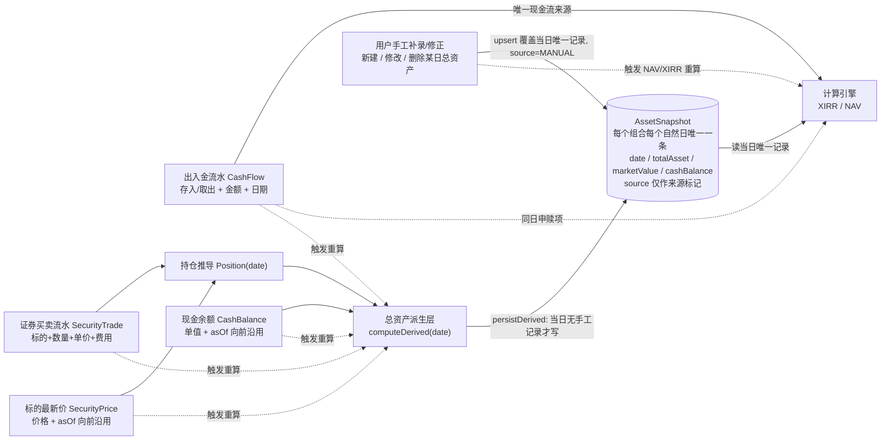

# 投资收益统计系统 — 单一权威 PRD（Consolidated）

> **项目名**：`investment_return_tracker`
> **版本**：v3.1.7（Consolidated / 单一权威版）
> **作者**：产品经理 许清楚（Alice）
> **日期**：2026-08-03
> **修订史（完整版）**：每版变更说明 + ID 核算已迁出至 **[docs/PRD-CHANGELOG.md](./PRD-CHANGELOG.md)**（最新为 v3.1.7）。
> **近期变更（v3.1.7）**：锚点修复 —— 2 处「见 §13」弱引用改为直链 [docs/PRD-COVERAGE-MATRIX.md](./PRD-COVERAGE-MATRIX.md)；补 1.4.1 / 1.4.2 子节编号（为手动索引铺路）；无需求 ID 增减。
> **语言**：中文（简体）

---

## 📌 本文档的地位（先读这一段）

本文档是**全系统唯一权威 PRD**。它由以下三份"活文档"规整合并而成：

| 源文档 | 版本 | 在本文档中的地位 |
|--------|------|-----------------|
| `docs/archive/PRD.md` | v1.2 | **金融口径基石** —— XIRR / 累计净值 / 当年净值 / 每日 XIRR / Newton-Raphson / 单位份额法。**数学口径一行不改，全部继承** |
| `docs/archive/PRD-modules.md` | v1.2 | 概览 / 持仓 / 交易 / 账户 / 设置 五大模块需求。**不冲突部分全部并入**；与 v2.3 架构冲突处以 v2.3 为准 |
| `docs/archive/PRD-incremental-v2.3.md` | v2.3 | 出入金 / 持仓方案B / 现金余额 / 总资产每日唯一 四模块的**当前权威口径**，冲突处**获胜** |

> ⛔ `docs/archive/PRD-incremental-v2.0.md` 是 v2.3 的**已作废演化前身**（含 v2.2「同日 MANUAL+DERIVED 并存」等已被推翻的内容）。**其作废内容一律不采纳**，该文件将被归档。
>
> ✅ 本文档创建后，上述三份源 PRD 与 v2.0 一并进入**归档只读**状态。**架构师与开发只读本文档**，不再去源文档考古。
>
> 🔍 每一条源需求/约束/决策的去向，见 **[docs/PRD-COVERAGE-MATRIX.md](./PRD-COVERAGE-MATRIX.md)**（遗漏数 = 0）。

---

## 目录

| 章节 | 内容 |
|------|------|
| §1 | 目标与范围 |
| §2 | **关键决策速览**（含理由 + 冲突裁决优先级声明） |
| §3 | **金融口径**（基石，不可改） |
| §4 | 数据流总览 |
| §5 | 模块定义 |
| §6 | **需求池**（F0 / P0 / P1 / P2 + 稳定 ID） |
| §7 | UI 草图 |
| §8 | 计算引擎契约 |
| §9 | 非功能性需求 |
| §10 | 🔴 **验收与强制回归测试**（P0 强制门禁 · REG-01~REG-06） |
| §11 | 风险登记册 |
| §12 | 待确认问题（已裁决 / 仍开放） |
| 覆盖对照 | **新旧覆盖对照表（Coverage Matrix）** → [PRD-COVERAGE-MATRIX.md](./PRD-COVERAGE-MATRIX.md) |
| 附录 | A XIRR 伪代码 / B 净值伪代码 / C 持仓推导伪代码 / D 数据模型汇总 / E 接口清单（E 完整契约见 ARCH §4.2） |

---

# §1 目标与范围

## 1.1 产品定位与基本信息

| 项目 | 内容 |
| ------- | ------------------------------------------------------------------------------------------------------------------------------------------------- |
| 产品名称 | `investment_return_tracker`（投资收益统计系统） |
| 一句话定位 | 基于 XIRR 算法的多端投资组合收益与净值追踪平台 |
| 目标用户 | 个人投资者、小型机构投资者 |
| 核心价值 | 精确计算真实年化收益率（XIRR），每日记录累计净值与当年净值，提供年/月/周/日多维度可视化分析 |
| 后端技术栈 | NestJS + Prisma + PostgreSQL 16 |
| Web 技术栈 | Vite + React 18 + TypeScript + Tailwind CSS + shadcn/ui + Zustand + TanStack Query + Axios + react-hook-form + zod + sonner；图表 ECharts（echarts + echarts-for-react，统一图表库） |
| APP 技术栈 | HarmonyOS 最新版（ArkTS + ArkUI）—— **本阶段不交付** |
| 仓库结构 | pnpm monorepo（`packages/backend` / `web` / `shared` / `harmonyos`） |
| 本阶段交付范围 | **仅 `backend` + `web` + `shared`**，不涉及 `packages/harmonyos` |
| 代码管理 | Git（monorepo） |

## 1.2 原始需求复述

**（一）基础需求（源自 `PRD.md` §1.2）**

1. 通过输入存入取出金额、期末资产额
2. 使用 XIRR 计算投资收益（存入 = 负、取出 = 正、当日资产额 = 正终值），记录每日的 XIRR，可以通过年月周日查询
3. 计算出净值，分为累计净值和当年净值，并且要记录出每日的累计净值和当年净值，可以通过年月周日查询
4. 所有年月周日查询都做成可视化
5. 后端使用 PostgreSQL 保存数据
6. 前端使用 HarmonyOS 最新版 APP 和 Web 版本，使用 Git 管理代码

**（二）模块完善需求（源自 `PRD-modules.md` §1.1）**

> 「完善投资收益统计系统，包含 dashboard，持仓，交易，账户，设置」

关键词是**「完善」**——增量迭代，在已有代码基础上补齐与打磨。

**（三）数据架构升级需求（源自 `PRD-incremental-v2.3.md`）**

> 出入金正名、持仓改为交易明细法（方案B）、现金余额独立、总资产由系统自动派生并每日落库且每日唯一一条。

## 1.3 产品目标

### 1.3.1 金融口径目标（基石）

| # | 目标 | 衡量口径 |
|---|------|---------|
| **FG1** | 收益率口径与公募基金披露一致 | 累计 XIRR + 单位份额法累计净值 + 当年净值三件套，精度与公式与基金业惯例一致 |
| **FG2** | 每日可追溯 | 每个计算日都留下 `daily_nav` / `daily_xirr` 记录，可按年/月/周/日查询 |
| **FG3** | 双端口径唯一 | 所有金融计算在后端完成，前端仅格式化展示 |

### 1.3.2 数据架构目标（源自 v2.3 §1.1，**当前权威**）

| # | 目标 | 衡量口径 |
|---|------|---------|
| **G1** | **现金流与资产口径彻底分离** | 出入金流水是 XIRR 现金流与 NAV 申赎项的**唯一**来源；证券买卖与现金余额**不进现金流**，只进资产 |
| **G2** | **持仓可精确回溯到任意历史日期** | 持仓由证券买卖流水回放推导，任意日期的数量为**精确值**，不依赖用户手工快照 |
| **G3** | **总资产成为稳定、可索引、可审计的每日事实** | 每个组合每个自然日在库中**至多一行**总资产记录；净值/XIRR 引擎只读这张表 |

### 1.3.3 模块体验目标（源自 `PRD-modules.md` §1.3）

| # | 目标 | 说明 |
|---|------|------|
| **M1 — 看得懂** | 用户登录后 3 秒内在概览页掌握"我赚了多少、赚得快不快、钱现在在哪"，并可自由切换年/月/周/日维度下钻 |
| **M2 — 记得全** | 在**完全不重写收益计算引擎**的前提下，提供持仓统计视图，让用户能追溯"钱具体分布在哪些标的上"，并记录分红与费用 |
| **M3 — 用得顺** | 账户与设置职责清晰不重复，偏好设置多端一致，数据可导入导出，让系统从"能算"走向"能长期用" |

## 1.4 范围边界

### 1.4.1 In Scope

- 出入金（存入/取出）现金流录入与管理
- 证券买卖流水录入 → 持仓推导（方案B）→ 持仓列表与估值
- 标的最新价 `SecurityPrice`（手工维护 + 向前沿用；行情自动获取为 P1）
- 现金余额 `CashBalance`（独立手填对账值，多行历史）
- 总资产每日记录 `AssetSnapshot`（自动派生落库 + 手工 CRUD，**每日唯一一条**）
- XIRR 年化收益率计算及每日记录
- 累计净值与当年净值的每日计算与记录
- 年/月/周/日四维度查询与可视化展示
- 概览（Dashboard）/ 账户中心（**纯只读聚合，零修改零登出**）/ 设置（**账户资料与安全修改的唯一入口**、**退出登录与注销账户的唯一入口**、偏好上云、导入导出、危险操作）
- 多组合管理、多用户认证与数据隔离
- 数据导入导出（CSV/Excel）
- **自动获取证券/基金行情估值**（公开 API 获取最新净值/价格），作为持有资产估值的自动化手段；具体数据源/更新频率/缓存策略待架构设计（落地前现价由用户手工录入）

### 1.4.2 Out of Scope（v1 明确不做）

| 项目 | 原因 |
|------|------|
| ❌ 在线交易 / 券商 / 银行账户对接 | 无合规资质与接口 |
| ❌ 多币种汇率自动换算 | v1 单币种（CNY），列 P2 |
| ❌ 社交 / 社区功能 | 超出产品定位 |
| ❌ 税务计算与合规报表 | 超出产品定位 |
| ❌ HarmonyOS 端适配 | 本阶段迭代范围外（`packages/harmonyos` 不动） |
| ❌ 已实现盈亏（卖出锁定盈亏） | 依赖批次成本跟踪，列 P2 |
| ❌ 公司行为（拆股/合股/配股/股票股利） | 改变数量但不产生现金流，需专门口径，列 P2 |
| ❌ FIFO 成本法 | 个人投资者少用，列 P2 |
| ❌ 标的级 XIRR | 依赖已实现盈亏与标的级现金流口径，列 P2 |
| ❌ 多现金账户（券商现金/银行活期分账） | 列 P2 |
| ❌ **重写 `nav.service.ts` / `xirr.service.ts` 核心算法** | 算法已修复且经测试验证，本次仅做**取数来源改造**，不得重写（见 §2.2 FIN-F0-11） |

---

# §2 关键决策速览（含理由 + 优先级声明）

> 本章是全文的决策索引。**每条决策的"为什么"直接写在这里**，架构师不需要去别处考古。

## 2.1 🔴 冲突裁决优先级总则（CRITICAL）

当本文档内部或与历史文档出现口径分歧时，按以下**四级优先级**裁决：

| 级别 | 领域 | 权威来源 | 说明 |
|------|------|---------|------|
| **① 最高** | **金融口径**：XIRR 公式 / 每日累计 XIRR / 单位份额法累计净值 / 当年净值（每年首个交易日重置为 1.0000）/ Newton-Raphson 迭代参数 / 数据精度 | 原 `PRD.md` §3、§5.3、§5.4、附录 A/B → 本文档 **§3** | **一行不改，永久基石。任何模块需求都不得改动这些数学口径** |
| **② 次高** | **数据架构口径**：出入金 / 持仓方案B / 现金余额 / 总资产每日唯一记录 / 计算引擎取数契约 | 原 `PRD-incremental-v2.3.md` → 本文档 **§2.3、§5.1–§5.4、§8** | **推翻一切与之冲突的旧表述**（包括 D-01 持仓隔离架构、D-04、D-05、C-08、C-09） |
| **③ 一般** | **模块需求**：概览 / 账户 / 设置 / 出入金列表 UI / 分析页 / 组件清单 / 接口清单 | 原 `PRD-modules.md` 的**不冲突部分** → 本文档 **§5.5–§5.8、§6.6–§6.9、§7** | 与 ① ② 不冲突者全部继承 |
| **④ 已废止** | 演化噪音：五代版本对照 / 变更摘要 / 作废声明 / `PRD-incremental-v2.0.md` 全文 | — | **丢弃**。但其中的**有效决策与需求 ID 已全部迁入本文档**（见 [docs/PRD-COVERAGE-MATRIX.md](./PRD-COVERAGE-MATRIX.md)） |

> 🔑 **一句话**：**金融算法听 `PRD.md`，数据架构听 v2.3，模块体验听 `PRD-modules.md`。三者冲突时，金融算法不动，架构以 v2.3 为准，模块需求让路。**

## 2.2 金融口径基石（① 级 · 永不改动）

| #          | 决策                                                     | 生效口径                                                                            | 为什么这么定                                                               |
| ---------- | ------------------------------------------------------ | ------------------------------------------------------------------------------- | -------------------------------------------------------------------- |
| **FIN-D1** | **采用 XIRR 而非 IRR / CAGR**                              | 按实际天数/365 折现，支持任意日期不规则现金流                                                       | IRR 假设等间隔，CAGR 忽略中间现金流；只有 XIRR 能精确处理个人投资者任意日期存取的真实场景，是衡量真实年化收益的金标准   |
| **FIN-D2** | **每日 XIRR = 累计口径**（非滚动）                                | 从第一笔存入日到当日的整体年化收益                                                               | 与公募/私募披露口径一致，用户认知成本低；跨年/月/周/日纵向可比。滚动 XIRR 列 P2                       |
| **FIN-D3** | **累计净值 = 单位份额法**                                       | 成立日净值 1.0000；`nav_t = (asset_t − buy_t + sell_t) / shares_{t-1}`；申赎按当日净值折算份额    | 公募基金标准模型，能正确剥离"追加/赎回"对净值的影响，是唯一无歧义的净值口径                              |
| **FIN-D4** | **当年净值每年首个交易日重置为 1.0000**                              | `year_nav_t = cum_nav_t / base`，`base` = **上年最后一个有记录的交易日**的累计净值                 | 各年度起点统一，便于横向比较年度表现                                                   |
| **FIN-D5** | **Newton-Raphson 求解 XIRR**                             | 初值 r₀=0.1，最大迭代 100 次，收敛阈值 \|NPV\| < 1e-7，`rate ≤ -0.999` 时钳到 -0.999；全同号现金流返回 `null` | 收敛快、实现简单、精度足够；参数已在现网验证                                               |
| **FIN-D6** | **净值基准日 = 第一笔存入日**                                     | 该日累计净值 = 1.0000                                                                 | 与"组合成立日"语义一致；自定义基准日列 P2                                              |
| **FIN-D7** | **同日多笔现金流合并为净现金流后计算**                                  | 同一天的存入/取出先聚合再代入 XIRR / 份额法                                                      | 避免同日多笔的顺序歧义，与份额法 `buy_t` / `sell_t` 的日聚合口径一致                         |
| **FIN-D8** | 🔴 **严禁重写 `nav.service.ts` / `xirr.service.ts` 的金融算法** | 本次只改**上游取数来源**，两个 service 内部"按 `type` 二分 + 按 `amount` 累加"的逻辑**原样保留**            | 算法 bug 已修复并经测试验证，重写是纯风险无收益。**这一条从 `PRD-modules.md` 完整继承，v2.3 亦明确确认** |

## 2.3 数据架构决策（② 级 · 当前权威 · 源自 v2.3）

> 🔑 **一句话总纲**
> **总资产 = 持仓当日最新市值 + 现金余额，由系统自动派生并每日落库。**
> **「每日总资产记录」表中，每个组合每个自然日有且仅有一条记录**，不论它是自动生成（`source='DERIVED'`）还是用户手工记录（`source='MANUAL'`）。手工记录取代同日的自动记录；自动派生遇到手工记录时跳过、不覆盖。
> —— 即：**自动为主、手工为辅、每日唯一。**

| # | 决策 | 生效口径 | **为什么这么定** |
|---|------|---------|-----------------|
| **A′** | **存量数据直接清空** | 本项目库为**开发/测试库**，`transactions` / `holdings` / `asset_snapshots` / CASH 类 `securities` 记录一律清空。migration 只做两件事：**① 清空/删除旧表；② 建立新表结构**。**无任何数据转换逻辑** | ① 库中不存在需要保全的生产数据资产，迁移成本纯属浪费；② 清库使 migration 退化为纯 DDL，省掉存量语义甄别、"迁移日"概念、回滚数据备份三类高风险工作；③ 空库直接按 `UNIQUE (portfolioId, date)` 建表即可，**不存在"存量同日多条记录需要合并"的难题**；④ 方案 B 所需的持仓数据本来就必须由用户重新录入买卖流水才能产生，旧快照无法转写为流水 |
| **B′** | **历史总资产记录可手工新建 / 修改 / 删除** | 用户可在 `/snapshots` 页对**任意历史日期**的总资产记录做完整 CRUD（`source='MANUAL'`、`valuationFlag='MANUAL_INPUT'`） | ① 上游三项数据（买卖流水 / 现价 / 现金余额）在真实场景下**必然存在无法还原的情况**：历史数据缺失、券商对账单口径差异、一次性资产变动无法建模；② 若只允许改上游，用户遇到这类情况就彻底无解，历史净值曲线会长期带错；③ 手工修正也是 W-1 / W-2「总资产双计 / 出入金与现金脱节」两个已知产品代价的**最后兜底通道**；④「只读」仅描述总资产卡（当前值）的**展示形态**，不等同于"全系统禁止手工录入" |
| **C′** | **每日总资产记录：每个组合每个自然日有且仅有一条，不论来源** | 唯一约束 `UNIQUE (portfolioId, date)`（**不含 `source`**），由数据库唯一索引强制。手工写入 **upsert 取代**当日记录；自动派生**遇手工记录跳过** | ① **读取路径彻底消除优先级判断** —— 引擎和 UI 直接读"当日那一行"，不需要判断来源、不需要排序取舍，取数逻辑与索引都最窄最快；② 同日并存两条会制造"哪条才是真的"的持久心智负担，并让所有下游聚合（曲线、CSV、堆叠图、一致性校验）都要重复实现同一套优先级规则，任一处漏实现即产生口径分裂；③ 唯一索引把"每日一条"从**惯例**升级为**数据库层不变量**，可被测试直接断言（`COUNT(*) ≤ 1`）；④ 用户心智直观 ——「这一天的总资产就是这个数」 |
| **方案 B** | **持仓 = 交易明细法**（由证券买卖流水推导） | 新增 `SecurityTrade`（标的级买卖流水），持仓状态由流水按 `(date, createdAt)` 升序回放推导；**取消持仓的手工快照录入**，`Holding` 每日快照模型废弃 | ① 流水是**原始凭证**，可回放、可审计、可修正，任意历史日期的持仓数量都是**精确值**；手工快照一旦漏录/错录即不可追溯；② 总资产要每日落库，其第一加项（持仓市值）必须有稳定可重算的来源，否则历史值无法幂等重建；③ 用户录入负担从"每天一条快照"降为"发生买卖才录一条"；④ 卖出校验、成本推导、占比等能力都依赖流水级数据，快照法做不到 |
| **决策 B（现金）** | **现金余额零联动** | `CashBalance` 是用户自行维护的**对账值**：出入金**不改**它，证券买卖**不改**它，系统**不代算**。仅在保存后给"是否同步调整"的**软提示** | ① 系统无法可靠推断资金在券商现金 / 银行活期 / 在途之间的真实分布，代算必然出错且错得隐蔽；② 与其给一个"看起来对但不敢信"的自动值，不如让用户显式对账；③ 该决策的代价（W-1 / W-2 双计与净值虚高）是**已知且被接受的产品口径代价**，工程侧只做软提示，**严禁自作主张实现自动扣减** |
| **`source` 字段保留** | `source ∈ {'DERIVED','MANUAL'}` **保留为普通字段，但不参与唯一键** | **第一理由（不可省）**：它是**区间重建的删除保护开关** —— 所有区间重建的 `DELETE` 必须带 `AND source='DERIVED'`，这是**用户手工记录不被自动重算静默抹掉的唯一保护机制**（W-5）。其次：② UI 来源徽标（`🤖自动`/`✋手工`）与筛选、CSV 导出；③ 审计追溯。<br>🔴 **但它绝不可出现在任何读取路径的优先级判断中** —— 一旦读路径依赖 `source`，"每日唯一"带来的全部简化收益即告消失 | 见左列 |
| **手工优先 / 派生跳过** | 手工 `upsertManual()` **无条件覆盖**当日行；自动 `persistDerived()` 当日为 `MANUAL` 时**跳过、不写、不覆盖** | ① **用户的显式意图优先于系统的推算结果** —— 用户手工录入必然发生在"他知道系统算错了"的时刻；② 自动派生是**高频、无人值守**的（五类事件任一发生即触发区间重建），若允许它覆盖手工值，用户的修正会在毫无感知的情况下被抹掉，且**无法恢复**（同日不再保留旧值）；③ 反过来让手工无条件覆盖是安全的 —— 手工写入是**低频、有二次确认、有 `note` 留痕**的显式操作 | 见左列 |
| **派生服务拆两函数** | `computeDerived(portfolioId, date)`（**纯计算、不落库**）与 `persistDerived(portfolioId, dateRange)`（**落库**，内含 upsert 与手工跳过逻辑） | ① 每日唯一模型下，被手工取代的那天**库里不再保留自动值**，"系统本应算出多少"只能**实时算** —— 这是差异提示、`↺ 重置为自动值`、差异汇总统计三项能力的**唯一数据来源**；② 纯函数无副作用，可被 UI 随意、批量、懒加载调用；③ 把落库副作用**收敛到 `persistDerived()` 唯一一处**，才能在这一处强制"删除保护 + `ON CONFLICT DO NOTHING`"双保险，并禁止其他路径直写该表 | 见左列 |

## 2.4 🔴 架构冲突裁决：已废止 / 已改判的旧决策

> 以下条目来自 `PRD-modules.md`，与 v2.3 架构直接冲突。**v2.3 获胜**。它们**不是被删除，而是被明确改判**，改判理由与替代物如下。

| 旧编号 | 旧口径 | 裁决 | 新口径 / 替代物 | 裁决理由 |
|--------|--------|------|----------------|---------|
| **D-01** | 持仓快照法；**持仓数据完全独立、不参与任何收益计算**，仅作标的统计；组合总市值 = Σ 标的市值 + 现金余额（与 `AssetSnapshot` 是两个独立数字） | 🔴 **废止** | **方案 B 持仓驱动总资产**：持仓由 `SecurityTrade` 流水推导，**持仓市值是总资产的第一加项**，经派生层 `AssetSnapshot` 间接进入 NAV/XIRR | 隔离架构让"总资产"永远依赖用户手工抄写，历史值无法幂等重建；方案 B 让总资产成为可重算的每日事实。**这是本次最大的方向性变更** |
| **边界 1** | 持仓表永远不被计算引擎读取；持仓写操作绝不触发任何计算 | 🔴 **废止（部分重建）** | 计算引擎仍**不直接 join 持仓表**，但改为**通过派生层 `asset-valuation.service` 间接依赖**；持仓写操作**必须触发**区间重建 | 隔离的价值（收敛改动面）保留，实现方式改为"唯一中间层"而非"物理隔绝" |
| **边界 2** | 现金余额是**持仓快照上的一个手工字段** | 🔴 **改判** | 现金余额升级为**独立表 `CashBalance`**（多行历史 + 向前沿用），录入入口在**出入金管理页** | 现金余额需要历史可追溯（任意日期可查、可编辑），挂在持仓快照上无法满足；且持仓快照本身已废弃 |
| **边界 3 / D-05** | 「一键同步」：持仓合计一键写入当日资产快照，与手动录入二选一、不互斥 | 🔴 **废止** | **总资产由 `persistDerived()` 每日自动落库**，无需"一键同步"；手工路径改为 `/snapshots` 页的**手工 CRUD**（`SNAP-P0-06`） | 自动派生后"同步"动作本身已无意义；手工兜底通道由 B′ 提供，能力**只增不减** |
| **D-04** | 现金余额在**持仓模块**手工录入 | 🔴 **改判** | 现金余额**单一录入入口 = 出入金管理页的「现金余额」区块**（`CASH-P0-02`），全站不得有第二个入口 | 现金余额属"资金口径"而非"持仓口径"，与出入金同页更符合心智；且方案 B 下持仓页无手工录入区 |
| **C-08** | `HoldingSnapshot`/`HoldingPosition`/`DividendRecord`/`FeeRecord` 四表**不得出现在 `nav.service` / `xirr.service` / `calculation.service` / `recalculation.service` 的任何查询中** | 🟡 **部分废止** | **前两表已不存在**（方案 B 废弃 `Holding`）。新约束见 **C-08′**：计算引擎**只读 `AssetSnapshot`**，不得直接读 `security_trades` / `security_prices` / `cash_balances` / `dividend_records` / `fee_records`。`DividendRecord` / `FeeRecord` **仍然不参与收益计算**（D-02/D-03 有效） | 隔离目标不变，隔离边界从"持仓表"上移到"派生层" |
| **C-09** | 持仓写操作**一律不得触发** `triggerCalculation` / `recalculateFromDate` | 🔴 **废止** | 新约束 **C-09′**：🔴 **五类事件必须触发重算**（出入金 / 证券买卖 / 现价更新 / 现金余额变更 / 手工总资产记录增改删重置），任一写操作都必须走 `recalculation.service` 统一入口；**分两层** —— T1~T4 触发**快照层区间重建 + 计算层级联** `[D, today]`，T5（手工总资产记录）触发**快照层仅当日（不重建自动记录）+ 计算层级联** `[date, today]`。完整口径见 **§2.5 `C-09′`** 与 **§8.4 计算触发规则**，本行不再重列 | 持仓已成为总资产来源，不触发就会产生过期资产值（W-4） |
| **HOLD-P0-02** | `Holding` 模型（标的×日期手工快照，`@@unique([securityId, date])`） | 🔴 **废止** | `SecurityTrade`（`HOLD-B-P0-01/02`）+ 推导引擎（`HOLD-B-P0-03`） | 同 方案 B 理由 |
| **HOLD-P0-05** | 持仓市值合计 vs 当日资产快照**不一致时高亮告警** + 一键更新快照 | 🟡 **改判** | 自动派生下二者天然一致；一致性断言下沉为 `HOLD-B-P0-06`，且**仅在当日记录 `source='DERIVED'` 时生效**；`MANUAL` 时改为提示「今日总资产使用了您的手工记录」（`Q-B16`） | 自动派生消除了"两个独立数字"，告警场景收敛为"手工记录例外" |
| **TXN-P0-02** | `Transaction` **新增** `securityId` / `quantity` / `price` / `fee` 四个可空字段 | 🔴 **反转** | `FLOW-P0-01`：从出入金表单/列表/DTO/共享类型中**移除**这四个字段，迁移至 `SecurityTrade` | 出入金是"资金进出组合边界"的纯现金流账本，携带证券明细会诱导把组合内部买卖误录为现金流，直接污染 XIRR |
| **Q-01** | 持仓采用**方案 A（持仓快照法）** | 🔴 **改判为方案 B** | 见"方案 B" | 见"方案 B"理由 |
| **Q-04** | `avgCost` 由**用户手工录入**（可抄券商 App） | 🟡 **改判** | 成本口径仍为**移动加权平均**（不变），但 `avgCost` 改为**系统由流水回放自动推导**（`HOLD-B-P0-03`），用户不再手填 | 方案 B 已提供标的级流水，自动推导比手填更精确、可审计 |
| **Q-06（`PRD.md`）** | 资产快照仅在有快照的日期计算，周末/节假日沿用前值、不生成新记录 | 🟡 **重定义** | 升级为**事件日稀疏落库 + 读取时前值填充**（§5.4.4）；"有当日快照才计算"的天然闸门被替换为事件日集合（W-3） | 总资产改为自动派生后，"用户是否录了快照"不再是计算闸门 |
| **`PRD.md` P0-02** | 资产快照录入（用户按日手填总资产，每日一条，重复覆盖确认） | 🟡 **改判** | 拆为两条：`SNAP-P0-04`（系统自动派生每日落库，主路径）+ `SNAP-P0-06`（手工 CRUD，例外补录）。"每日一条 + 重复覆盖确认"的核心约束**升级为数据库唯一索引**（C′） | 能力只增不减：原手工录入能力完整保留在 `SNAP-P0-06` |
| **`PRD-modules.md` §8.2 存量缺陷** | `snapshot.upsert()` 覆盖历史快照时只重算当日、未做级联重算 | ✅ **继承为必修项** | `SNAP-P0-03` 验收 3：**必须一并修复**，不再是"可选" | v2.3 明确将其从"可选"提升为"必修" |

## 2.5 全局约束（现行版 · 所有模块必须遵守）

| 编号        | 约束                                         | 说明                                                                                                                                                                                                                                                                                                          | 来源                         |
| --------- | ------------------------------------------ | ----------------------------------------------------------------------------------------------------------------------------------------------------------------------------------------------------------------------------------------------------------------------------------------------------------- | -------------------------- |
| **C-01**  | **金融计算全部在后端**                              | 前端只做格式化展示，禁止在 React 侧计算 XIRR、净值、份额                                                                                                                                                                                                                                                                          | modules，继承                 |
| **C-02**  | **`amount` 是现金流唯一口径**                      | `amount` 始终代表"实际资金真实进出投资组合边界的金额"，是 XIRR 与份额申赎的唯一输入                                                                                                                                                                                                                                                          | modules + v2.3，继承          |
| **C-03**  | **数据隔离**                                   | 所有接口必须经 `JwtAuthGuard` + `user_id` 过滤                                                                                                                                                                                                                                                                       | modules，继承                 |
| **C-04**  | **精度约定**                                   | 金额 2 位小数、净值展示 4 位（存储 6 位）、XIRR 展示百分比 2 位（存储 8 位）、份额/数量 6 位、均价 6 位                                                                                                                                                                                                                                           | modules + `PRD.md` §8.1，继承 |
| **C-05**  | **向后兼容**                                   | 新增 Prisma 字段一律可空（nullable），不得让存量数据迁移失败。⚠️ 本次因决策 A′ 采用**清库式 migration**，本约束仅适用于 A′ 之后的后续迭代                                                                                                                                                                                                                   | modules，条件继承               |
| **C-06**  | **空状态必备**                                  | 每个页面/卡片都必须有"无组合 / 无数据 / 加载中 / 请求失败"四态，不得白屏或报错                                                                                                                                                                                                                                                               | modules，继承                 |
| **C-07**  | **复用优先**                                   | 优先复用 `components/ui/*`（shadcn）、`features/*` 已有组件，禁止重复造轮子                                                                                                                                                                                                                                                    | modules，继承                 |
| **C-08′** | 🔴 **计算引擎只读派生结果**                          | `nav.service` / `xirr.service` / `calculation.service` / `recalculation.service` **只能读 `AssetSnapshot` 与 `Transaction`（出入金）**；不得出现 `security_trades` / `security_prices` / `cash_balances` / `dividend_records` / `fee_records` 的查询，也不得出现 `Σ(quantity × price)` 之类的市值计算。验收手段：在这四个 service 中全局搜索上述表名，结果必须为 0 | **改写自 C-08**               |
| **C-09′** | 🔴 **五类事件必须触发重算**                          | 出入金 / 证券买卖 / 现价更新 / 现金余额变更 / 手工总资产记录增改删重置 —— 任一写操作都必须走 `recalculation.service` 统一入口。🔴 **两层分流**：**T1~T4**（出入金 / 证券买卖 / 现价更新 / 现金余额变更）触发**快照层区间重建 + 计算层级联 `[D, today]`**；**T5**（手工总资产记录增/改/删/重置）触发**快照层仅当日（不重建自动记录）+ 计算层级联 `[date, today]`**。**严禁「只写快照不重算净值」**（对齐 `docs/ARCHITECTURE.md` v2.1 §7.3.1 / `C-13`；落地口径见 §8.4，回归门禁见 §10.3 `REG-06`） | **改写自 C-09**               |
| **C-10**  | **`TransactionType` 保持 `BUY`/`SELL` 两值不变** | 不得扩展 `DIVIDEND` / `FEE`。分红与费用属于持仓模块独立表。证券买卖使用**独立枚举** `BUY_SEC` / `SELL_SEC`，⚠️ **严禁复用 `TransactionType`**                                                                                                                                                                                                  | modules + v2.3，继承并强化       |
| **C-11**  | 🔴 **禁止绕过服务层直写 `asset_snapshots`**         | 任何接口/脚本都必须经 `persistDerived()` 或 `upsertManual()` 写入该表                                                                                                                                                                                                                                                      | v2.3，继承                    |
| **C-12**  | 🔴 **读路径禁止依赖 `source`**                    | 严禁在取数逻辑中出现 `WHERE source='DERIVED'`、`ORDER BY source` 之类的优先级判断（区间重建的 `DELETE` 保护是唯一例外）                                                                                                                                                                                                                      | v2.3，继承                    |

> 🎨 **展示层全局约定（同样必须遵守，不占用 `C-*` 编号）**：**涨跌配色一律采用 A 股惯例「正值 = 红色、负值 = 绿色」**，全站图表 / 明细表 / 卡片 / 徽标统一，**不得出现反向配色**。完整口径见 **§9.5 展示规范 —— 全局涨跌配色约定**（v3.1.4 由用户拍板确立）。

---

# §3 金融口径（基石 · ① 级 · 一行不改）

> 本章完整继承 `PRD.md` §3 / §5.3 / §5.4 / §5.5 与附录 A/B。**这是整个项目的地基，XIRR 与净值的计算口径必须严谨无歧义。以下定义参照公募基金净值计算惯例。**

## 3.1 XIRR（扩展内部收益率）

**定义**：XIRR 是针对**非定期（不规则间隔）现金流**计算年化收益率的算法。它求解使所有现金流净现值（NPV）为零的年化折现率 r：

$$\sum_{i=0}^{n} \frac{CF_i}{(1+r)^{(d_i - d_0)/365}} = 0$$

其中 CF_i 为第 i 笔现金流，d_i 为对应日期，d_0 为第一笔现金流日期。

**输入数据约定**：

| 数据类型 | 现金流方向 | 符号 | 说明 |
|----------|-----------|------|------|
| 存入（投入资金） | 流出 | 负值（−金额） | 资金从投资者账户流出进入投资 |
| 取出（收回资金） | 流入 | 正值（+金额） | 资金从投资收回进入投资者账户 |
| 当日资产额（总资产） | 终值 | 正值（+金额） | 当日持仓的市值估值，作为 XIRR 的终值（terminal value） |

**与 IRR / CAGR 的区别**：

| 指标 | 现金流要求 | 时间假设 | 适用场景 |
|------|-----------|---------|---------|
| IRR | 定期（等间隔） | 假设各期等长 | 定期定额投资 |
| **XIRR** | **非定期（任意日期）** | **按实际天数/365 折现** | **本项目：不规则存取** |
| CAGR | 仅需首末两值 | 忽略中间现金流 | 简单首末对比，不反映追加/赎回影响 |

## 3.2 每日 XIRR

**定义**：指从**第一笔存入日**起，到**当日**为止的**累计 XIRR**。

**计算口径**：
- 现金流序列 = [第一笔存入日 ~ 当日的所有存入/取出记录] + [当日总资产作为终值]
- 即：将当日总资产视为一笔"当日发生的正现金流"，与历史所有存入取出现金流一起代入 XIRR 公式求解
- 每个计算日计算一次，得到一个 XIRR 值，形成时间序列

**为什么选累计口径而非滚动口径**：

| 方案 | 定义 | 优点 | 缺点 |
|------|------|------|------|
| ✅ **累计 XIRR**（采用） | 从第一笔存入到当日的整体年化收益 | 反映真实总回报，与基金披露口径一致，跨年/月/周/日查询均可纵向对比 | 长期后会趋稳，对近期变化不够敏感 |
| 滚动 XIRR | 过去 N 天（如 365 天）窗口的 XIRR | 反映近期表现 | 窗口初期数据不足，口径主观，跨期不可比 |

**查询维度说明**：按年/月/周/日查询时，展示的是该时间范围内**每日累计 XIRR 值的序列**。例如"按月查询 2025 年 3 月"，展示 3 月每一天的累计 XIRR 折线图。

## 3.3 累计净值（单位份额法）

**定义**：类比公募基金累计净值，反映投资组合从成立日（第一笔存入日）起的整体净值增长。

**计算方法 —— 单位份额法**：

1. **成立日（第一笔存入日）**：单位净值 = 1.0000，初始份额 = 存入金额 / 1.0000 = 存入金额
2. **每日估值流程**（日终处理）：
   - Step 1：根据当日总资产（**期末总额，含当日存入/取出**）、当日存入/取出金额和上日末份额，计算当日单位净值：

     $$当日单位净值 = \frac{当日总资产 − 当日存入总额 + 当日取出总额}{上日末总份额}$$

   - Step 2：按当日单位净值处理当日存入/取出（申赎）：
     - 存入新增份额 = 存入金额 / 当日单位净值
     - 取出赎回份额 = 取出金额 / 当日单位净值
     - 当日末总份额 = 上日末份额 + 新增份额 − 赎回份额
3. **累计净值 = 单位净值**（本项目 v1 不涉及分红，故累计净值即单位净值）

**基准日**：第一笔存入日，累计净值 = 1.0000

**示例**：
- Day 1：存入 10000 → 份额 10000，净值 1.0000，资产 10000
- Day 30：存入 6000 后账户期末总额 18000 → 申赎前资产 = 18000 − 6000 = 12000 → 净值 = 12000/10000 = 1.2000 → 新增份额 = 6000/1.2000 = 5000，总份额 15000
- Day 60：期末总资产 16500 → 净值 = 16500/15000 = 1.1000

## 3.4 当年净值

**定义**：反映本年度（自然年）内的净值增长，每年首个交易日重置基准。

**计算公式**：

$$当年净值_t = \frac{累计净值_t}{累计净值_{上年最后一个交易日}}$$

**规则**：
- 每年 1 月 1 日（或**当年第一个计算日**），当年净值 = 1.0000
- 当年净值 − 1 = 当年收益率
- 跨年对比时，各年度起点统一为 1.0000，便于横向比较
- 上年**最后一个有记录的交易日**的累计净值作为本年度基准值，记录为 `base_cumulative_nav`

**与累计净值的关系**：累计净值看长期（从成立日起），当年净值看年度（从本年起），两者互补。

## 3.5 存入 / 取出 / 总资产

| 数据类型 | 含义 | 录入粒度 | 符号约定 |
|----------|------|---------|---------|
| 存入（`BUY`） | 投入资金进入组合，资金流出投资者账户 | 按笔录入（日期 + 金额） | 现金流为负 |
| 取出（`SELL`） | 从组合收回资金，资金流入投资者账户 | 按笔录入（日期 + 金额） | 现金流为正 |
| 总资产（`AssetSnapshot.totalAsset`） | 当日组合总市值 | **系统每日自动派生落库**（例外可手工补录），**每组合每日唯一一条** | XIRR 终值为正 |

**录入规则**：
- 存入/取出：一笔一条记录，含日期、方向、金额、备注；同一天可有多笔
- 总资产：**每组合每自然日有且仅有一条记录**（`UNIQUE(portfolioId, date)`），详见 §5.4
- ⚠️ 与原 `PRD.md` 的差异：原文"资产快照是触发当日净值与 XIRR 计算的前提"的**天然闸门已被替换**为事件日集合（见 §5.4.4 与 W-3）

## 3.6 数据校验规则

| 校验项 | 规则 | 错误提示 |
|--------|------|---------|
| 出入金金额 | 必须 > 0 | "金额必须大于 0" |
| 出入金日期 | 不可晚于今天 | "日期不能为未来日期" |
| 取出金额 | 不可超过当日总资产（**软校验**，可忽略） | "取出金额接近/超过持仓总值，请确认" |
| 总资产记录 | 每组合每日仅一条（数据库唯一索引强制），手工录入到已有日期即**覆盖**（不报"重复"错） | "该日已有记录，保存后将被取代" |
| 首笔出入金 | 必须为**存入**（成立日不能以取出开始） | "首笔交易必须为存入" |
| XIRR 数据 | 至少需 1 笔存入 + 1 条总资产记录 | "数据不足，请录入存入和资产数据后查看收益" |
| 日期格式 | `YYYY-MM-DD` | 标准化处理 |
| 证券买卖 | `quantity > 0`、`price > 0`、`fee ≥ 0`、日期不可未来 | 指向具体字段 |
| 卖出数量 | **硬校验**：不得超过该日持仓数量，且插入历史流水后后续日期不得出现负持仓 | "当前持有 X，最多可卖 X" |
| 现金余额 | `amount ≥ 0`、`asOf` 不可未来 | 指向具体字段 |
| 手工总资产 | `totalAsset ≥ 0`、日期不可未来；`marketValue`/`cashBalance` 选填；`note` 强提示填写 | 指向具体字段 |

## 3.7 每日 XIRR / 净值的计算触发机制

| 触发时机 | 行为 |
|---------|------|
| **五类事件任一发生**（出入金 / 证券买卖 / 现价更新 / 现金余额变更 / 手工总资产记录增改删重置） | 从事件日 D 起**级联重算** `[D, today]` 的 `daily_nav` 与 `daily_xirr` |
| 查询时发现今日无总资产记录 | 惰性触发一次 `persistDerived(today)` 生成（`Q-B11`；今日若已有手工记录则跳过） |
| 历史数据修改 | 从修改日起到最新日期，批量重算受影响日期 |
| 日终批处理 | **不引入定时任务**（`Q-B11` 产品建议） |

**XIRR 算法实现要求**（不变）：
- 牛顿迭代法求解，初始猜测值 r₀ = 0.1（10%）
- 最大迭代 100 次，收敛阈值 |NPV| < 1e-7
- 特殊情况：全为同号现金流时返回 `null`，提示"数据不足"
- 后端实现，通过 API 返回结果

> ⚠️ **以上 4 条为要点摘要**（忠实复刻 `PRD.md` §5.3 原文四条），**不是完整规格**。
> **XIRR 求解的完整参数与边界处理 —— 初始猜测 r₀ = 0.1、最大迭代 100 次、收敛阈值 |NPV| < 1e-7、`rate ≤ -0.999 → rate = -0.999` 溢出钳制、导数 `dnpv == 0` 时中断、全同号 / 少于 2 笔现金流返回 `null` —— 一律以【附录 A：XIRR 计算伪代码】为准。**
> 本节与附录 A 若有任何出入，**以附录 A 为权威**。附录 A 与 `FIN-D5`（§2.2）中的 `rate ≤ -0.999 → -0.999` 溢出钳制**同源同义、已在现网实现，属 F0 冻结内容**（**D-1 经用户授权由 `≤ -1` 修正为 `≤ -0.999`**，与现网代码 `packages/finance-core/src/xirr.ts` 的 `MIN_RATE = -0.999` 一致），**不得删改**。

**每日净值计算逻辑**（不变，详见附录 B）：

```
对于每个计算日 t：
  1. 读取 t 日总资产 asset_t（= AssetSnapshot 当日唯一记录，无记录则前值填充）
  2. 读取 t-1 日末总份额 shares_{t-1}（若 t 为成立日，份额 = 首笔存入金额，净值 = 1.0）
  3. 计算当日申赎前净值：
     buy_t  = Σ(当日存入金额)
     sell_t = Σ(当日取出金额)
     nav_t  = (asset_t − buy_t + sell_t) / shares_{t-1}
  4. 处理当日申赎：shares_t = shares_{t-1} + buy_t/nav_t − sell_t/nav_t
  5. 累计净值 cumulative_nav_t = nav_t
  6. 当年净值：
     若 t 为当年首个计算日 → year_nav_t = 1.0000, base = cumulative_nav_{t-1}
     否则 → year_nav_t = cumulative_nav_t / base
  7. 存储当日：nav_t, cumulative_nav_t, year_nav_t, shares_t
```

---

# §4 数据流总览



> 🔑 **三句话钉死数据流**：
> 1. **出入金只贡献「现金流」；持仓市值 + 现金余额只贡献「总资产」。两者在计算引擎里汇合，谁变了都要触发重算。**
> 2. **总资产不是"算完就丢"的中间值 —— 它每天在 `AssetSnapshot` 里留下一条记录，计算引擎读的是这张持久化表，而不是运行时拼装。**
> 3. **这张表每个组合每个自然日只有一条记录。这条记录要么是派生层写的，要么是用户写的，二者不并存。读取方永远只需要"取当日那一条"，不做任何优先级判断。**

---

# §5 模块定义

## 5.1 出入金管理（`/cashflows`）

**定位**：纯组合级现金流账本，**XIRR 现金流的唯一来源**、NAV 申赎项的唯一来源。

| 项 | 定义 |
|----|------|
| 字段 | `date`（日期）、`type`（`BUY`=存入 / `SELL`=取出，UI 只出现"存入/取出"）、`amount`（金额，>0）、`note`（备注） |
| **不含字段** | ❌ `securityId` / `quantity` / `price` / `fee` **不属于出入金**，归属持仓模块的 `SecurityTrade` |
| 语义 | `amount` = 资金**真实进出投资组合边界**的金额（从银行卡打进来 / 提回银行卡）。**组合内部的证券买卖不是出入金** |
| 枚举 | 维持 `BUY`/`SELL` 两值（C-10），`xirr.service.ts` / `nav.service.ts` 的二分判断逻辑**不改** |
| 页面归属 | 出入金管理页（`/cashflows`，`/transactions` 保留 301 重定向），并**并入**现金余额录入区 + **总资产展示区**（当前值 + 近期走势，主卡只读，另设「管理历史记录」入口，见 §7.1【A】） |
| 初始数据 | `transactions` 表为空表建立，由用户以出入金语义录入（决策 A′） |

## 5.2 持仓模块（方案 B — 交易明细法，`/holdings`）

**定位**：以**证券买卖流水**为原始凭证，**推导**出任意日期的持仓状态；持仓市值是总资产的第一个加项。

### 5.2.1 实体

| 实体 | 说明 |
|------|------|
| `SecurityTrade`（证券买卖流水） | `date / securityId / side(BUY_SEC \| SELL_SEC) / quantity / price / fee / note`。**独立枚举**，⚠️ 严禁复用 `TransactionType`（C-10） |
| `SecurityPrice`（标的最新价） | `securityId / price / asOf`。**与现金余额同构的"最新值 + 向前沿用"语义**。行情自动获取落地前由用户手工更新 |
| `Security`（标的主数据） | `id / portfolioId / code / name / type / currency`；`type` 枚举 `STOCK`/`FUND`/`BOND`/`CASH`/`OTHER`，其中 **`CASH` 弃用**（见 §5.3）。同一组合内 `code` 唯一；`name` 必填 ≤ 50 字 |
| `DividendRecord`（分红记录） | 日期 / 标的 / 金额 / 类型（现金分红·红利再投）/ 备注。**不参与收益计算**（D-02 有效）。红利再投不录入（无现金进出） |
| `FeeRecord`（费用记录） | 日期 / 标的 / 金额 / 费用类型（佣金·印花税·其他）/ 关联流水 ID（可选）。**不参与收益计算**（D-03 有效） |
| `Holding` | ❌ **不存在**。持仓不落库、不手工录入，一律由 `SecurityTrade` 回放推导 |

### 5.2.2 推导算法（P0 必须实现，口径不得自由发挥）

按 `(date, createdAt)` 升序回放该标的全部流水：

```
买入 (q, p, fee):
    cost_total = cost_total + q × p + fee        // 费用计入成本
    qty        = qty + q
    avgCost    = cost_total / qty                // 移动加权平均

卖出 (q, p, fee):
    qty        = qty − q
    avgCost    = 不变                             // ← 单位成本价不变
    cost_total = qty × avgCost                   // ← 成本额随数量等比减少
    // v1 不记录本次卖出的已实现盈亏；卖出费用 fee 仅作信息记录，不回冲成本

清仓 (qty == 0):
    avgCost = 0, cost_total = 0                  // 归零重置，下次买入重新起算
    该标的从持仓列表默认隐藏（可切换"显示已清仓"）
```

> ⚠️ **歧义澄清（架构师最易做错）**：「卖出不减成本」指的是 **`avgCost`（单位成本价）不变**，**不是**成本总额不变。若成本总额不变，清仓后会残留幽灵成本。**以上伪代码为准。**
>
> 📎 **成本口径选择理由**（继承自 `PRD-modules.md` §4.5）：采用移动加权平均，与国内券商 App / 基金 App 展示口径一致，用户零学习成本；FIFO 需逐笔批次跟踪，复杂度高且个人投资者少用，列入 P2。**与旧版的差异**：`avgCost` 由**系统自动推导**，不再手工录入（Q-04 改判）。

**估值规则**：

- `持仓数量(s, date)` = 该标的 ≤ date 全部流水回放结果
- `现价(s, date)` = `SecurityPrice` 中 asOf ≤ date 的**最后一条**（向前沿用）；**若无任何价格记录 → 回退用 `avgCost` 估值**，UI 标注「按成本估值」徽标
- `持仓市值(date)` = `Σ 数量(s,date) × 现价(s,date)`
- `持仓市值(date)` 是每日总资产记录的**第一个加项**，其口径与本节完全一致，**不得另起炉灶**

### 5.2.3 持仓列表

各标的**当前持仓**一行：`标的名称 / 代码 / 类型 / 数量 / 成本价(avgCost) / 现价(+asOf) / 成本额 / 市值 / 浮动盈亏 / 盈亏率 / 占比`。
行级派生值一律**不落库**，由 service 计算返回。

> **边界澄清（避免误读）**：「派生值不落库」**仅适用于持仓列表的行级派生值**（市值 / 盈亏 / 占比等）。**组合级总资产是唯一例外 —— 它必须每日落库**（`AssetSnapshot`，每日唯一一条），因为 NAV / XIRR 序列需要稳定、可回溯、可索引的历史值。

## 5.3 现金余额（`CashBalance`）

| 项 | 定义 |
|----|------|
| 模型 | **独立表** `CashBalance`：`portfolioId / amount / asOf / note`。保留变更历史（多行），语义上「当前值 = asOf 最大的那条」 |
| 语义 | **最新值 + 向前沿用**。8/2 填 100 → 8/2 起余额 100；8/3 未改 → 仍 100；8/4 改 200 → 8/4 起 200。8/1（首条之前）→ 视为 0 |
| 录入 | **手填，单一入口**，位于**出入金管理页**的「现金余额」区块。这是**资产口径的常规手填项**；总资产手填属于**例外性补录**，二者性质不同 |
| 联动 | 🔴 **零联动**（决策 B）：存入/取出**不改**它，证券买卖**不改**它。只在保存后给"是否同步调整"的**软提示** |
| 参与计算 | ✅ **参与** —— 作为每日总资产记录的**第二个加项**（`cashBalance(date)` = asOf ≤ date 的最后一条），随后间接进入 XIRR 终值与 NAV 分子 |
| 变更后的效果 | 修改任一条 `CashBalance` → **从该 asOf 起级联重算并覆盖受影响日期的自动记录**（`CASH-P0-03` + `SNAP-P0-04a`）。**仅覆盖 `source='DERIVED'` 的记录；用户手工记录的日期被跳过，值保持不变** |
| **`SecurityType.CASH` 的口径裁决** | 🔴 **弃用 `CASH` 标的口径**。**理由**：若同时允许"现金类标的"和"现金余额字段"，两者会在 `totalAsset` 里**双计**。处置：① 新建标的时**隐藏** `CASH` 选项；② 枚举值保留（避免破坏性迁移），标注 `@deprecated`；③ CASH 类标的记录不予建立（决策 A′） |

## 5.4 总资产 / 每日唯一记录（`AssetSnapshot`）

### 5.4.1 最终口径（一句话定义）

> **总资产（TotalAsset）= 持仓当日最新市值 + 当日现金余额，由系统自动派生并每日落库。**
> 🔴 **硬约束**：**「每日总资产记录」表中，每个组合每个自然日有且仅有一条记录，不论其来源是自动生成还是手工记录。**
> **写入方有两个：派生层（自动，`source='DERIVED'`）与用户（手工，`source='MANUAL'`）。二者写的是同一行：**
> - **用户手工写入 → upsert 覆盖该日记录，`source` 改写为 `MANUAL`（手工取代自动）。**
> - **派生层写入 → 当日若已是 `MANUAL` 记录，则跳过、不写、不覆盖（手工优先）；否则写入/更新 `DERIVED` 记录。**
> - **读取 → 直接读当日那一条，无需任何优先级判断。**

形式化：

```
totalAsset(D) = marketValue(D) + cashBalance(D)          // 自动派生口径

其中：
  marketValue(D) = Σ_s [ quantity(s, D) × price(s, D) ]
      quantity(s, D) = 该标的 ≤D 全部 SecurityTrade 回放结果（精确，方案B）
      price(s, D)    = SecurityPrice 中 asOf ≤ D 的最后一条（向前沿用）
                       若无任何价格 → 回退 avgCost(s, D)，记录标记「按成本估值」
  cashBalance(D)  = CashBalance 中 asOf ≤ D 的最后一条（向前沿用）
                       若无任何记录 → 0

落库（每日唯一一条）：
  AssetSnapshot { portfolioId, date=D, totalAsset, marketValue, cashBalance,
                  source, valuationFlag, note, recordedAt }
  UNIQUE (portfolioId, date)          // ← 唯一约束不含 source

写入语义（upsert，唯一权威口径）：
  persistDerived(portfolioId, D):
      INSERT (…, source='DERIVED')
      ON CONFLICT (portfolioId, date) DO UPDATE
        SET … WHERE AssetSnapshot.source = 'DERIVED'   // 当日为 MANUAL 则不更新

  upsertManual(portfolioId, D, totalAsset, …):
      INSERT (…, source='MANUAL')
      ON CONFLICT (portfolioId, date) DO UPDATE
        SET totalAsset=…, marketValue=…, cashBalance=…,
            source='MANUAL', valuationFlag='MANUAL_INPUT', note=…, recordedAt=now()
      // 无条件覆盖，手工取代自动

  deleteRecord(portfolioId, D):
      DELETE WHERE portfolioId=… AND date=D
      // 之后若 D 属事件日 → 由 persistDerived 立即回填一条 DERIVED（见 Q-B17）

读取规则（唯一权威口径，两级）：
  effectiveTotalAsset(D)
      = AssetSnapshot(portfolioId, D).totalAsset       若该日存在记录（不论来源）
      = effectiveTotalAsset(前一个有记录的日期)          否则（前值填充，见 Q-B10）
      = 0                                             否则（首条记录之前）

自动值的实时计算（不落库）：
  computeDerived(portfolioId, D) -> { totalAsset, marketValue, cashBalance, valuationFlag }
      // 纯函数，仅计算不写库。用于：手工记录行的「自动值 / 差异」提示、
      //「重置为自动值」操作、差异汇总统计。
      // 🔴 由于同日不再保留自动记录行，此函数是获取"本应是多少"的唯一途径。
```

### 5.4.2 与上游两个数据源的关系（责任边界）

| 上游 | 谁维护 | 口径 | 在总资产中的角色 |
|------|--------|------|----------------|
| **持仓市值** | 系统推导（用户只录买卖流水 + 现价） | 方案B 流水回放数量 × ≤date 最后一条现价（无价回退 avgCost） | 加项 1 |
| **现金余额** | 🖊️ **用户手填当前值**（决策 B） | `asOf ≤ date` 的最后一条，向前沿用；首条之前视为 0 | 加项 2 |
| **总资产（自动）** | 🤖 **系统自动，每日落库** | 加项 1 + 加项 2 | **当日唯一记录（`source='DERIVED'`）** |
| **总资产（手工）** | 🖊️ **用户按需补录/修正** | 用户直接给定的 `totalAsset`（不参与加项计算） | **取代当日唯一记录（`source='MANUAL'`）** |

> 🔧 **口径澄清**：
> - **常规路径**：用户维护「买卖流水 + 现价 + 现金余额」三项上游 → 系统自动算出总资产并每日记录。**用户不需要碰总资产。**
> - **例外路径**：当上游数据无法还原真实情况时，用户可**直接手工新建/修改某日总资产记录**。该操作会**取代**当日的自动记录，成为该日唯一且权威的值。
> - **不可能出现的状态**：同一组合同一天既有自动记录又有手工记录。若在库中观察到这种情况，即为**数据缺陷**，需按唯一约束修复。
> - 现金余额与总资产手填**不是同一类东西**：现金余额是**日常维护项**，总资产手填是**例外补录**。

### 5.4.3 历史精度的口径局限

历史某日 D 的自动记录中：**数量来自流水（精确）**，**价格与现金来自"向前沿用的最新值"（近似）**。

> 🟡 **必须向用户明示**：用户若长期不更新现价 / 现金余额，历史曲线会呈现"阶梯状横盘"，这是**预期行为，不是 bug**。UI 需在净值/XIRR 图表与历史总资产表加一行说明，并在受影响记录上打 `valuationFlag`（`EXACT` / `CARRIED_FORWARD` / `COST_BASED`）。
> 由于这些近似值会**被固化落库**，`valuationFlag` 不是"UI 提示"而是**记录字段，必须持久化**。
> **手工记录的 `valuationFlag` 固定为 `MANUAL_INPUT`**，UI 用**独立徽标**与自动记录区分。

### 5.4.4 计算日历与稀疏落库（`SNAP-P0-03` 口径）

以「**事件日**」为准生成序列：

```
事件日集合   = 出入金日期 ∪ 证券买卖日期 ∪ 价格更新日期(asOf) ∪ 现金余额变更日期(asOf) ∪ 今日
快照日期集合 = 总资产记录表中实际存在的日期集合
             （因每日唯一，直接 SELECT DISTINCT date 即可，无需区分来源做并集运算）
```

- **落库策略**：仅对事件日（含今日）写入记录 → **稀疏存储**，避免 5 年 1800 天全量冗余。
- **读取策略**：查询任意日期区间时，对无记录的自然日按**前值填充**补齐，对外表现为"每日都有记录"。前值填充直接取前一个有记录日期的 `totalAsset`（**无需判断来源**）。
- **重算策略**：任一事件发生在日期 D → **删除并重建 `[D, today]` 区间内的记录**（幂等，见 W-4）。
  🔴 **关键约束**：
  - `DELETE` 语句**必须带 `AND source = 'DERIVED'`** —— 用户手工记录的日期不在删除范围内。
  - 重建 `INSERT` **必须带 `ON CONFLICT (portfolioId, date) DO NOTHING`**（或等价的手工跳过判断）—— 双保险。
- 该策略的取舍与替代方案见 `Q-B10`（是否改为全自然日物化）。

### 5.4.5 写入 / 冲突行为规范（唯一权威表）

> 核心原则：**每日唯一一条 · 手工覆盖自动 · 自动跳过手工**。

| 场景 | 行为 |
|------|------|
| **当日无任何记录，派生层触发** | 插入一条 `source='DERIVED'` 记录 |
| **当日已有 `DERIVED` 记录，派生层再次触发** | **更新**该行（`totalAsset`/拆解/`valuationFlag`/`recordedAt` 全部刷新），`source` 保持 `DERIVED`。仍是一条 |
| **当日已有 `MANUAL` 记录，派生层触发** | 🔴 **跳过，不写入、不覆盖、不新增**。该日记录保持为用户的手工值 |
| **当日无任何记录，用户手工新建** | 插入一条 `source='MANUAL'`、`valuationFlag='MANUAL_INPUT'` 的记录 |
| **当日已有 `DERIVED` 记录，用户手工录入** | 🔴 **upsert 覆盖该行**：值改为用户填写值，`source` 改写为 `MANUAL`，`valuationFlag` 改为 `MANUAL_INPUT`，刷新 `recordedAt`/`note`。**原自动值不保留在库中**（需要对比时由 `computeDerived(date)` 实时算出） |
| **当日已有 `MANUAL` 记录，用户再次编辑** | 更新该行，`source` 保持 `MANUAL` |
| **用户删除某日记录** | 物理删除该行。随后：若该日属于**事件日集合**（§5.4.4）→ 由派生层**立即回填一条 `DERIVED` 记录**；若不属于事件日 → 该日无记录，读取时按**前值填充**（见 `Q-B17`） |
| **「重置为自动值」（`SNAP-P0-07`）** | 调用 `computeDerived(date)` → **upsert 覆盖该行**，`source` 置回 `'DERIVED'`、`valuationFlag` 置回计算结果。**等价于"撤销手工修改"**。仍是一条 |
| **上游事件触发区间重建** | `DELETE … WHERE source='DERIVED' AND date BETWEEN D AND today` → 逐事件日 `INSERT … ON CONFLICT DO NOTHING`。**用户手工记录的日期原样保留，值不变、`source` 不变** |
| **手工记录能否指向未来日期** | ❌ 不允许，`date` 不可晚于今日 |
| **手工记录的必填校验** | `totalAsset ≥ 0`；`marketValue`/`cashBalance` 选填（`Q-B15`）；`note` 强提示填写（便于日后回溯，见 W-6） |
| **手工录入的二次确认** | 若当日已存在自动记录，弹窗必须显示「该日系统自动计算值为 ¥X，保存后该值将被您填写的值**取代**」并要求确认 |

### 5.4.6 `source` 字段的定位

🔴 **`source` 不是唯一键的一部分。** 它仅用于三件事：

1. **区间重建的删除保护开关**（`DELETE … WHERE source='DERIVED'`）—— **这是最关键、不可省的用途**，是手工记录不被自动重算抹掉的唯一机制（W-5）；
2. UI 来源徽标（`🤖自动` / `✋手工`）与筛选、CSV 导出列；
3. 审计追溯。

🔴 **任何读取路径都不得依赖 `source` 做优先级判断**（严禁 `WHERE source='DERIVED'`、`ORDER BY source` 之类出现在取数逻辑中）。

## 5.5 概览 / Dashboard（`/`）

**定位**：用户的默认落地页，一屏呈现核心收益指标与趋势，并作为流量枢纽向持仓 / 出入金 / 分析页下钻。

> ⚠️ **口径提醒（v2.3 版）**：概览页上的**全部指标均来自收益计算引擎**，即 `AssetSnapshot`（每日唯一记录）+ `Transaction`（出入金）+ `daily_nav` + `daily_xirr`。
> **「当前总资产」取自 `AssetSnapshot` 的当日/最新唯一记录**（该记录现在由系统自动派生，手工记录为例外）。
> 🔴 概览页**不得直接读取** `security_trades` / `security_prices` / `cash_balances` 表自行拼装总资产（C-08′）。

**目标**：
- 一屏呈现核心收益指标与趋势，作为默认落地页
- 提供统一的时间维度切换（年/月/周/日），驱动页面内所有图表联动
- 向持仓 / 出入金 / 分析页下钻

## 5.6 分析页（收益分析 `/analysis/xirr` · 净值分析 `/analysis/nav`）

**定位**：深度分析视图，承载 `PRD.md` §6 的四维度查询与可视化要求。

| 维度 | 展示内容 | X 轴 | 典型场景 |
|------|---------|------|---------|
| 按日 | 每日的 XIRR / 净值明细 | 具体日期 | 精确查看某段时间每日变化 |
| 按周 | 每周的 XIRR / 净值（周末值或周均） | 周起始日 | 中短期趋势观察 |
| 按月 | 每月的 XIRR / 净值（月末值或月均） | 月份 | 月度对比分析 |
| 按年 | 每年的 XIRR / 净值（年末值或年均） | 年份 | 长期年度对比 |

**聚合规则**：默认取各周期**最后一个计算日的值**（与基金披露一致），可在设置中切换为"平均值"（`UserPreference.aggregation`）。

**图表类型**：

| 图表类型 | 用途 | 适用指标 |
|---------|------|---------|
| 折线图 | 时间序列趋势 | XIRR、累计净值、当年净值 |
| 柱状图 | 周期对比 | 年度/月度收益率 |
| 热力图 | 分布与强度 | 月度收益热力图（年份×月份） |
| 面积图 | 累积增长感 | 累计净值 |
| 对比折线 | 多指标同图 | 累计净值 vs 当年净值 |
| 数据表格 | 精确数值查看 | 所有指标明细 |

## 5.7 账户（`/account`）

**定位**：「我」的**纯只读聚合视图** —— 身份信息 + 跨组合资产全景 + 组合列表 + 数据统计。**本页最终形态 = 只读展示 + 一个「前往设置 →」入口链接。**

- 与设置页**唯一分工**：**账户页 = 看**（只读展示 + 跳转入口），**设置页 = 改**（全部配置、修改动作与账户生命周期操作）
- **本页不承载任何账户资料修改动作**：邮箱 / 密码 / 资料（昵称·手机·简介）/ **头像**的修改入口**一律不在本页**，本页只提供「**前往设置修改 →**」链接跳转至 `/settings` 账户区（`SET-P0-01`）
- **零重复**：`ChangeEmailDialog` / `ChangePasswordDialog` / `EditProfileDialog` **全部归属设置页**，账户模块**不引用、不挂载**这些 Dialog。**头像修改入口在设置页账户区的「编辑资料」按钮；头像 URL 设置具体发生在「编辑资料」卡片（`EditProfileDialog`）内**，账户页不引用
- **只读原则的适用范围（v3.1.1 收紧）**：本页**零修改、零登出** —— 账户资料类修改（邮箱 / 密码 / 昵称 / 手机 / 简介 / 头像）、**退出登录**、**注销账户**一律不在本页。本页允许的交互**仅限「跳转」**：切换组合 / **前往设置 →** / 新建组合
- **v3.1.1 迁出清单**：**退出登录** → 设置页 `SET-P0-09`；**注销账户**（原 `ACC-P1-03`）→ 设置页危险操作区 `SET-P1-06`。旧 ID 依 §6.0 保留为迁移记录，不复用、不删除

**UI 草图（只读形态 · 风格对齐 §7.4 概览页）**

```
┌────────────────────────────────────────────────────────────────────────────────┐
│ [侧栏]  │ 顶栏: [组合选择▼]                        [🔔] [👤头像▼]              │
├─────────┼──────────────────────────────────────────────────────────────────────┤
│ 概览    │ 账户中心 · 纯只读聚合视图                    [前往设置 →] (ACC-P0-05)│
│ 持仓    │ ┌──────────────────────────────────────────────────────────────────┐ │
│ 出入金  │ │ 👤 个人信息（纯只读卡）                              (ACC-P0-02) │ │
│ 资产记录│ │ ╭────╮  张三                                                     │ │
│ 收益分析│ │ │头像│  zhangsan@example.com                                     │ │
│ 净值分析│ │ │展示│  手机 138****8000  ·  注册于 2025-01-15                   │ │
│>账户    │ │ ╰────╯  简介：长期价值投资者                                     │ │
│ 设置    │ │ ⓘ 卡内无任何修改控件：无「编辑资料」/ 无头像上传 / 无头像 URL    │ │
│         │ │   头像仅作展示，不可点击                                         │ │
│         │ │                                     [前往设置修改 →] (SET-P0-01) │ │
│         │ └──────────────────────────────────────────────────────────────────┘ │
│         │ ┌──────────────────────────────────────────────────────────────────┐ │
│         │ │ 📊 资产全景（跨组合合计）                            (ACC-P0-03) │ │
│         │ │ 组合数 3   │ 合计总资产 ¥520,800   │ 合计净投入 ¥420,000         │ │
│         │ │            │ 合计浮动盈亏 +¥100,800                              │ │
│         │ │ ⓘ 1 个组合暂无总资产记录，未计入合计                             │ │
│         │ │ ⓘ 仅做金额类求和；不做跨组合合计 XIRR / 合计净值（Q-07）         │ │
│         │ └──────────────────────────────────────────────────────────────────┘ │
│         │ ┌──────────────────────────────────────────────────────────────────┐ │
│         │ │ 💼 我的组合（点击行=切换组合并跳转概览） [+新建组合] (ACC-P0-04) │ │
│         │ │ ┌───────────┬───────────┬────┬──────────┬───────┬───────┬──────┐ │ │
│         │ │ │组合名称   │成立日     │币种│最新总资产│净值   │当年%  │更新日│ │ │
│         │ │ ├───────────┼───────────┼────┼──────────┼───────┼───────┼──────┤ │ │
│         │ │ │>A股组合   │2023-03-01 │CNY │  185,400 │ 1.4560│ +8.20%│08-01 │ │ │
│         │ │ │ 基金组合  │2024-01-05 │CNY │  335,400 │ 1.0820│ +3.10%│07-28 │ │ │
│         │ │ └───────────┴───────────┴────┴──────────┴───────┴───────┴──────┘ │ │
│         │ └──────────────────────────────────────────────────────────────────┘ │
│         │ ┌──────────────────────────────────────────────────────────────────┐ │
│         │ │ 📈 数据统计（纯只读卡）                              (ACC-P0-06) │ │
│         │ │ 出入金 128 笔 │ 证券买卖 340 笔 │ 总资产记录 612 天              │ │
│         │ │ 数据区间 2023-03-01 ~ 2026-08-03 │ 账户使用 887 天               │ │
│         │ └──────────────────────────────────────────────────────────────────┘ │
│         │ ⓘ 本页零修改、零登出（v3.1.1）：                                     │
│         │   邮箱/密码/资料/头像 → SET-P0-01 ｜ 退出登录 → SET-P0-09            │
│         │   注销账户 → SET-P1-06（三者均在 /settings，账户页仅跳转）           │
└─────────┴──────────────────────────────────────────────────────────────────────┘
```

> **草图口径校验（v3.1.1 硬约束）**：本页仅出现**跳转类**交互 —— 切换组合 / 「前往设置 →」/ 新建组合。草图内**不得**出现修改邮箱 / 修改密码 / 编辑资料 / 头像上传 / 头像 URL 输入 / 退出登录 / 注销账户任一控件（分别归 `SET-P0-01` / `SET-P0-09` / `SET-P1-06`）。

## 5.8 设置（`/settings`）

**定位**：配置中心 + **全站唯一的账户资料与安全修改入口** + **全站唯一的账户生命周期与会话操作入口**。

- **唯一修改入口**：**修改邮箱 / 修改密码 / 编辑资料（昵称·手机·简介）/ 头像修改（在「编辑资料」卡片内完成：本地上传 与 头像 URL 设置并列）** 四类动作全部且仅在本页账户区（`SET-P0-01`）；**设置页账户区只展示头像并提供「编辑资料」入口，不再设独立的「头像 URL」输入框**
- **唯一账户操作入口（v3.1.1 新增）**：除修改入口外，本页还承载两项**账户生命周期 / 会话操作** —— **退出登录**（`SET-P0-09`，账户与会话区）与**注销账户**（`SET-P1-06`，危险操作区，与 `SET-P0-05` 同区）。二者**均已自账户页迁入本页**，账户页不再提供
- 把当前 3 个 `disabled` 的数据管理占位按钮真正落地
- 偏好设置从 `localStorage` 升级为**服务端持久化**（`UserPreference`），实现多端/多浏览器一致
- 与账户中心分工明确：**账户页 = 看**（只读展示 + 跳转），**设置页 = 改 + 账户操作**（配置修改 + 退出登录 + 注销账户），两页零重复、无第二处修改或登出入口

**UI 草图（五分区 · 分区归属见 §6.9.2 · 风格对齐 §7.4 概览页）**

```
┌────────────────────────────────────────────────────────────────────────────────┐
│ [侧栏]  │ 顶栏: [组合选择▼]                        [🔔] [👤头像▼]              │
├─────────┼──────────────────────────────────────────────────────────────────────┤
│ 概览    │ 设置 · 配置中心（分区归属见 §6.9.2）                                 │
│ 持仓    │ ┌──────────────────────────────────────────────────────────────────┐ │
│ 出入金  │ │ ① 👤 账户与会话区                        (SET-P0-01 / SET-P0-09) │ │
│ 资产记录│ │ ╭──╮ 张三 · zhangsan@example.com    [前往账户中心 →] (ACC-P0-01) │ │
│ 收益分析│ │ ╰──╯ 手机 138****8000（仅一行摘要，详情见账户页）                │ │
│ 净值分析│ │ [修改邮箱]  [修改密码]  [编辑资料]              (SET-P0-01)      │ │
│ 账户    │ │ ⓘ 头像修改在「编辑资料」卡片内完成（本地上传 与 头像 URL 并列）  │ │
│>设置    │ │   本区只展示头像，不提供独立的「头像 URL」输入框                 │ │
│         │ │ ──────────────────────────────────────────────────────────────── │ │
│         │ │ [退出登录] 清空 auth.store 并跳转 /login             (SET-P0-09) │ │
│         │ └──────────────────────────────────────────────────────────────────┘ │
│         │ ┌──────────────────────────────────────────────────────────────────┐ │
│         │ │ ② ⚙ 偏好与外观区     (SET-P0-02 · 07 · 08 / SET-P1-02 · 03 · 05) │ │
│         │ │ 默认组合      [A股组合  ▼]    默认时间维度  [按月    ▼]          │ │
│         │ │ 默认日期范围  [近 1 年  ▼]    周期聚合方式  [期末值  ▼]          │ │
│         │ │ 周起始日      (●)周一 ( )周日  净值/XIRR 小数位 [4▼] [2▼]        │ │
│         │ │ 外观主题      (●)跟随系统 ( )亮色 ( )暗色            (SET-P0-08) │ │
│         │ │ 软提示开关    [x] 出入金后提示  [x] 买卖后提示       (SET-P0-07) │ │
│         │ │ 金额格式      [x] 千分位  [ ] 万/亿缩写              (SET-P1-03) │ │
│         │ │ 过期阈值 [ 3 ]天   通知 [站内提示条▼]    (SET-P1-05 / SET-P1-02) │ │
│         │ │                                           [保存偏好] (SET-P0-02) │ │
│         │ └──────────────────────────────────────────────────────────────────┘ │
│         │ ┌──────────────────────────────────────────────────────────────────┐ │
│         │ │ ③ 📊 数据管理区                          (SET-P0-03 / SET-P0-04) │ │
│         │ │ 导出 ☑出入金 ☑证券买卖 ☑现价 ☑现金余额 ☑总资产记录               │ │
│         │ │      ☐每日净值 ☐每日XIRR                  [导出 CSV] (SET-P0-03) │ │
│         │ │ 导入 [下载模板：出入金 | 证券买卖 | 总资产记录]                  │ │
│         │ │      [选择文件…] [预览前 10 行]  (●)全部回滚 ( )跳过错误行       │ │
│         │ │                                           [开始导入] (SET-P0-04) │ │
│         │ └──────────────────────────────────────────────────────────────────┘ │
│         │ ┌──────────────────────────────────────────────────────────────────┐ │
│         │ │ ④ 💼 组合管理区             [+ 新建组合] (SET-P0-06 / SET-P1-04) │ │
│         │ │ 名称 / 描述 / 成立日 / 币种 / 操作（设为默认·编辑·归档·删除）    │ │
│         │ └──────────────────────────────────────────────────────────────────┘ │
│         │ ┌──────────────────────────────────────────────────────────────────┐ │
│         │ │ ⑤ ⚠ 危险操作区                           (SET-P0-05 / SET-P1-06) │ │
│         │ │ 清空当前组合数据（保留账户与组合，仅删除该组合全部业务数据）     │ │
│         │ │   二次确认：手动输入组合名称              [清空数据] (SET-P0-05) │ │
│         │ │ ──────────────────────────────────────────────────────────────── │ │
│         │ │ 注销账户（软删除账户本身及全部组合，保留 30 天可恢复）           │ │
│         │ │   二次确认：输入邮箱 + 法律/隐私文案      [注销账户] (SET-P1-06) │ │
│         │ └──────────────────────────────────────────────────────────────────┘ │
└─────────┴──────────────────────────────────────────────────────────────────────┘
```

### 5.8.1 「编辑资料」卡片草图（`EditProfileDialog` · `SET-P0-01`）

> **归属调整（本次修订）**：**头像 URL 设置**由「设置页账户区的独立输入框」**移入「编辑资料」卡片**，与**本地上传**并列，构成头像修改的两种并列方式。设置页账户区自此**只展示头像 + 提供「编辑资料」入口**。
> **本调整不新增、不删除任何需求 ID** —— 仍全部归属 `SET-P0-01`，仅在 PRD 内部调整功能落位。

```
┌────────────────────────────────────────────────────────────────┐
│ 编辑资料（EditProfileDialog）                 (SET-P0-01)  [×] │
│ ────────────────────────────────────────────────────────────── │
│ 头像   ╭────╮  [更换头像] 点击头像或按钮选择本地图片           │
│        │预览│  [移除头像] 清空后回落默认字母头像               │
│        ╰────╯  限制：jpg / png / webp，≤ 2MB                   │
│                                                                │
│ 头像URL [https://example.com/avatar.png        ]  [应用]       │
│        ⓘ 输入图片 URL 后点「应用」即可设为头像；与本地上传     │
│          并列，二者最后生效者覆盖前者      (SET-P0-01 验收 2)  │
│ ────────────────────────────────────────────────────────────── │
│ 昵称   [张三                          ]   ≤ 20 字              │
│ 手机   [13800138000                   ]   选填，展示时脱敏     │
│ 简介   [长期价值投资者                 ]   ≤ 100 字，选填      │
│ ────────────────────────────────────────────────────────────── │
│                                                [取消]   [保存] │
└────────────────────────────────────────────────────────────────┘
```

> **一致性约束**：上方 §5.8 设置页草图的「① 账户与会话区」**不得**再出现独立的「头像 URL」输入框；头像 URL 的唯一录入位置为本卡片。

---

# §6 需求池（F0 / P0 / P1 / P2 + 稳定 ID）

## 6.0 优先级定义

| 级别 | 含义 | 处理规则 |
|------|------|---------|
| **F0** | **Foundation — 金融基石** | **口径已冻结，不得改动、不得重写。**优先级高于一切 P0。任何模块需求与 F0 冲突，模块需求让路 |
| **P0** | Must Have — 核心 MVP | 必须交付 |
| **P1** | Should Have — 增强体验 | 尽量交付 |
| **P2** | Nice to Have — 远期增强 | 明确延后 |

> **ID 稳定性承诺**：本章所有 ID 为**稳定 ID**，后续迭代只增不改。源 PRD 中的旧 ID 与本章 ID 的映射关系见 [docs/PRD-COVERAGE-MATRIX.md](./PRD-COVERAGE-MATRIX.md)。

## 6.1 金融核心 `FIN-`（F0 · 冻结）

| 编号 | 优先级 | 功能点 | 描述 | 验收标准 |
|------|--------|--------|------|---------|
| FIN-F0-01 | F0 | XIRR 算法与符号约定 | 按 §3.1 实现：存入为负、取出为正、总资产为正终值，按实际天数/365 折现 | 1) 符号约定与 §3.1 表一致；2) 与 Excel `XIRR()` 对拍误差 < 1e-6；3) 精度存储 8 位、展示百分比 2 位 |
| FIN-F0-02 | F0 | 每日累计 XIRR 计算与落库 | 从第一笔存入日到当日的累计 XIRR，每个计算日一条，形成 `daily_xirr` 序列 | 1) 累计口径（非滚动）；2) 每个计算日算一次；3) 存储每日 XIRR 时间序列；4) 数据不足时返回 `null` 并断线而非画 0 |
| FIN-F0-03 | F0 | 累计净值（单位份额法）计算与落库 | 按 §3.3 单位份额法逐日计算，存储 `daily_nav` | 1) 成立日 = 1.0000；2) 严格按份额法流程（先算净值、再按净值处理当日申赎）；3) 展示 4 位 / 存储 6 位；4) 存储每日序列含 `shares` |
| FIN-F0-04 | F0 | 当年净值计算与年度重置 | `year_nav = cum_nav / base`，`base` = 上年最后一个有记录交易日的累计净值 | 1) 每年首个计算日 = 1.0000；2) `base_cumulative_nav` 落库；3) 精度 4 位小数；4) 跨年切换单测覆盖 |
| FIN-F0-05 | F0 | Newton-Raphson 求解参数冻结 | r₀=0.1、maxIter=100、tolerance=1e-7、`rate ≤ -0.999` 钳到 -0.999、全同号返回 null | 见附录 A 伪代码，实现必须逐行对应 |
| FIN-F0-06 | F0 | 每日净值计算流程冻结 | 按 §3.7 七步流程与附录 B 伪代码实现 | 期末口径：`asset` 含当日进出，需还原为申赎前资产再算净值 |
| FIN-F0-07 | F0 | 同日多笔现金流合并 | 同一天多笔存入/取出先聚合为净现金流/日聚合量再计算 | 与份额法 `buy_t` / `sell_t` 的日聚合口径一致 |
| FIN-F0-08 | F0 | 数据校验规则 | 按 §3.6 全表实现，前端 zod 与后端 DTO 规则完全一致 | 错误提示中文且指向具体字段 |
| FIN-F0-09 | F0 | 金融计算全部在后端（C-01） | 前端禁止计算 XIRR / 净值 / 份额 | 代码评审：`packages/web` 中不得出现 XIRR/份额计算逻辑 |
| FIN-F0-10 | F0 | `amount` 是现金流唯一口径（C-02） | 只有出入金 `amount` 进入 XIRR 与份额申赎 | 证券买卖 / 现金余额 / 分红 / 费用**均不进现金流** |
| FIN-F0-11 | F0 | 🔴 **严禁重写 `nav.service.ts` / `xirr.service.ts` 金融算法** | 本次仅改上游取数来源，两个 service 内部按 `type` 二分 + 按 `amount` 累加的逻辑原样保留 | 1) 存量纯 `BUY`/`SELL` 数据回归测试结果与改动前**完全一致**；2) 代码 diff 中两个 service 的算法段落无实质变更 |

## 6.2 出入金管理 `FLOW-`

| 编号 | 优先级 | 功能点 | 描述 | 验收标准 |
|------|--------|--------|------|---------|
| FLOW-P0-01 | P0 | 模块正名与字段剥离 | 交易 → 出入金管理；从表单/列表/DTO/共享类型中移除 `securityId/quantity/price/fee` | 1) UI 全站无"交易/买入/卖出"字样，统一"出入金/存入/取出"；2) 四个明细字段在出入金相关接口与表单中**完全消失**；3) 枚举仍为 `BUY/SELL` 两值；4) 路由 `/transactions` → `/cashflows` 并保留 301 重定向 |
| FLOW-P0-02 | P0 | 出入金 CRUD + 列表（筛选/排序/分页） | 日期/类型/金额/备注的增删改查；筛选（日期范围、类型多选）、排序（日期·金额，升降序）、分页（20/50/100） | 1) 列表列 = 日期/类型/金额/备注/操作；2) 筛选与排序写入 URL query，刷新/分享后保持；3) 1000 条分页 < 500ms；4) 空状态四态齐全（C-06）；5) 结果为空时显示空状态 + 清除筛选按钮 |
| FLOW-P0-03 | P0 | **总资产区块（自动记录 + 历史入口）** | 页面顶部展示 `totalAsset` 的**当日记录值**，并附精简历史曲线。**卡片主体不可编辑**，但提供「管理历史记录 →」入口跳转 `/snapshots` | 1) 显示总额 + 拆解（持仓 ¥X / 现金 ¥Y）+ 各自 asOf；2) **卡片主体无任何输入控件与行内编辑图标**；3) 近 N 期（默认 30 天）迷你曲线或紧凑列表；4) 上游任一变更后自动刷新且曲线同步更新；5) 常驻文案「**由系统每日自动记录；如需补录或修正历史，请前往「管理历史记录」**」；6) 若当日记录 `source='MANUAL'`，显示 `✋手工` 徽标 + 「系统自动计算值为 ¥X」（该值由 `computeDerived(today)` **实时计算**，不从库中读取） |
| FLOW-P0-04 | P0 | 重算结果反馈 | 增删改出入金后 toast 提示重算范围 | 1) 返回 `{ fromDate, affectedDays }`；2) >2s 显示进度；3) 失败回滚事务并明确报错；4) `affectedDays` 需同时反映**被重写的自动记录条数**；5) 若区间内存在手工记录日期，toast 追加「其中 N 天为您的手工记录，已跳过、未被覆盖」 |
| FLOW-P0-05 | P0 | 校验一致性 | 前端 zod 与后端 DTO 规则一致 | 1) `amount > 0`；2) 日期不可未来；3) 首笔必须为存入；4) 错误提示中文指向字段 |
| FLOW-P0-06 | P0 | 现金余额同步软提示（W-2） | 存入/取出保存成功后提示"是否同步调整现金余额" | 1) toast + 快捷跳转到现金余额录入；2) **绝不自动修改** `CashBalance`；3) 可在设置中关闭该提示 |
| FLOW-P0-07 | P0 | 列表信息密度优化 | 列展示规范与响应式布局 | 1) 空值显示 `-` 而非空白；2) 移动端（< 768px）折叠为卡片式布局；3) 金额右对齐 + 等宽字体；4) 存入红色、取出绿色（遵循 A 股涨跌色） |
| FLOW-P1-01 | P1 | CSV 导入 / 导出 | 模板含新字段集（**无证券明细列**）；导出当前筛选结果 | 1) UTF-8 **带 BOM**，Excel 中文不乱码；2) 导入前预览前 10 行 + 显示识别总行数；3) 行级报错定位到行号 + 字段 + 原因；4) 可选「跳过错误行」/「全部回滚」，默认全部回滚；5) 导入完成后**一次性触发全量重算**（而非逐笔）；6) 导出行数与筛选结果一致 |
| FLOW-P1-02 | P1 | 批量删除 | 多选批量删除 | 1) 二次确认显示条数；2) 单次事务 + **只触发一次重算**（含一次区间重建） |
| FLOW-P1-03 | P1 | 同日多笔折叠 | 同一天多笔出入金折叠为一行，展开查看明细 | 1) 折叠行显示当日净现金流；2) 与后端"同日合并计算"口径（FIN-F0-07）呼应 |
| FLOW-P1-04 | P1 | 出入金标签 | 自定义标签（定投 / 止盈 / 打新等）并支持按标签筛选 | 1) 标签可复用历史输入；2) 单笔最多 3 个标签 |
| FLOW-P2-01 | P2 | 出入金 ↔ 现金余额对账视图 | 展示"理论现金 vs 实填现金"的差异说明（**仅提示，不联动**） | 优先级已裁决：**维持 P2**（`Q-B5`） |
| FLOW-P2-02 | P2 | 定投计划 | 设定定投规则自动生成待确认出入金 | — |

## 6.3 持仓（方案 B）`HOLD-B-`

| 编号 | 优先级 | 功能点 | 描述 | 验收标准 |
|------|--------|--------|------|---------|
| HOLD-B-P0-01 | P0 | 证券买卖流水模型 | 新增 `SecurityTrade`：`date/securityId/side/quantity/price/fee/note`，独立枚举 `BUY_SEC/SELL_SEC` | 1) 不复用 `TransactionType`（C-10）；2) `quantity>0`、`price>0`、`fee≥0`；3) 日期不可未来 |
| HOLD-B-P0-02 | P0 | 买卖明细录入表单 | 标的（下拉 + 内联新建）/ 方向 / 日期 / 数量 / 单价 / 费用 / 备注；自动显示成交额预览 | 1) 成交额 = 买入 `q×p+fee`、卖出 `q×p−fee`（只读预览）；2) 保存后持仓列表与总资产区块即时刷新；3) 保存后**自当日起的自动总资产记录被重建**（手工记录日期跳过） |
| HOLD-B-P0-03 | P0 | **持仓推导引擎** | 按 §5.2.2 算法由流水回放推导任意日期持仓（含 `avgCost` 自动推导） | 1) 单测覆盖：多次买入均价、部分卖出、全部清仓后再买入、同日多笔、跨日回放；2) 精度：数量 6 位、金额 2 位、均价 6 位；3) 修改/删除历史流水后推导结果与全量重放一致 |
| HOLD-B-P0-04 | P0 | 持仓列表 | 各标的当前持仓（列见 §5.2.3） | 1) 市值=数量×现价，成本额=数量×avgCost，盈亏=市值−成本额，盈亏率=盈亏/成本额；2) 占比之和=100%（误差≤0.01%）；3) 默认按市值降序；4) 红涨绿跌；5) 占比以横向进度条可视化；6) `qty=0` 默认隐藏，可切换显示 |
| HOLD-B-P0-05 | P0 | 标的最新价录入 | `SecurityPrice`：价格 + asOf，向前沿用；支持列表内联编辑与批量保存 | 1) 无价格时回退 `avgCost` 估值并显示「按成本估值」徽标；2) 更新价格触发总资产变更 → 重写受影响日期的自动记录（手工记录日期跳过）；3) 显示每个价格的 asOf；4) 批量保存为单次请求、合并为单次重算（`Q-B8`） |
| HOLD-B-P0-06 | P0 | 持仓汇总条 | 总市值 / 总成本 / 总浮盈 / 总盈亏率 / 标的数 | 1) 与明细逐行求和一致，随筛选条件动态变化；2) 与当日记录的 `marketValue` 字段一致（误差 ≤ 0.01）。**该一致性断言仅在当日记录 `source='DERIVED'` 时生效**；若为 `MANUAL`，二者**允许不一致**，UI 提示「今日总资产使用了您的手工记录」（`Q-B16`） |
| HOLD-B-P0-07 | P0 | 买卖流水列表与编辑删除 | 按标的/日期/方向筛选，可编辑删除 | 1) 编辑删除后从该日起级联重算（沿用 `recalculation.service`）；2) toast 提示影响范围 |
| HOLD-B-P0-08 | P0 | 卖出数量硬校验 | 卖出数量 > 该日持仓数量时**拒绝保存** | 1) 明确提示"当前持有 X，最多可卖 X"；2) 插入历史日期流水时需校验后续日期不会出现负持仓 |
| HOLD-B-P0-09 | P0 | 标的（`Security`）管理 | `Security` CRUD：`id/portfolioId/code/name/type/currency` | 1) 同一组合内 `code` 唯一；2) `name` 必填 ≤ 50 字；3) 删除标的时若存在买卖流水，需二次确认并级联删除；4) 新建/编辑下拉**不出现「现金」（CASH 已弃用，见 CASH-P0-04）** |
| HOLD-B-P0-10 | P0 | 分红 / 费用独立记录 | `DividendRecord`（日期/标的/金额/类型（现金分红·红利再投）/备注）与 `FeeRecord`（日期/标的/金额/费用类型（佣金·印花税·其他）/关联流水 ID 可选）。**两表均不参与 XIRR 与净值计算**（D-02 / D-03） | 1) 两表 CRUD + 权限隔离（`user_id` 过滤）；2) 可在持仓模块按标的查看累计分红与累计费用；3) **红利再投不录入**（无现金进出，其价值自然体现在持仓市值上升中）；4) 集成验证：分红/费用数据**不污染** `daily_nav` / `daily_xirr` |
| HOLD-B-P0-11 | P0 | 筛选与历史日期切换 | 顶部组合选择器（复用 `portfolio-selector`）+ 标的类型多选筛选 + **持仓日期选择（可选任意历史日期，默认今日）** | 1) 切换组合后列表与合计同步刷新；2) 类型筛选支持多选；3) 日期可选**首笔流水日之后的任意日期**（方案 B 下任意日期均可精确推导，不再限制"仅有数据的日期"） |
| HOLD-B-P1-01 | P1 | 买卖流水 CSV 导入 | 模板 + 行级报错 + 一次性重算 | 1) 提供模板下载；2) 逐行校验并报错到行号 + 字段 + 原因；3) 导入后一次性触发全量重算 |
| HOLD-B-P1-02 | P1 | 持仓历史回看 | 选择历史日期查看当时持仓结构 + 堆叠面积图 | 1) 日期限定在首笔流水之后；2) 堆叠图按标的着色，图例可点选 |
| HOLD-B-P1-03 | P1 | 资产配置图 | 标的占比 / 类型占比双环形图 | 1) 占比 < 3% 合并"其他"；2) hover 显示名称/市值/占比 |
| HOLD-B-P1-04 | P1 | 行情自动获取 | 自动更新 `SecurityPrice`（基础 PRD 已将行情估值纳入 In Scope，本项为其落地实现） | 1) 自动更新同样必须触发自动记录重建；2) 需防抖/批量合并（`Q-B8`）；3) 数据源/频率/缓存策略由架构设计 |
| HOLD-B-P1-05 | P1 | 单标的盈亏卡 | 点击标的行展开：持有天数、累计盈亏、成本变动历史、累计分红、累计费用 | 1) 数据源为该标的的 `SecurityTrade` 流水回放序列 + `DividendRecord` / `FeeRecord` |
| HOLD-B-P2-01 | P2 | 已实现盈亏 | 卖出锁定盈亏 | — |
| HOLD-B-P2-02 | P2 | 公司行为 | 拆股/合股/配股/股票股利（改变数量但不产生现金流，需专门口径） | — |
| HOLD-B-P2-03 | P2 | FIFO 成本法 | 除移动加权平均外，支持先进先出成本口径 | — |
| HOLD-B-P2-04 | P2 | 标的级 XIRR | 依赖已实现盈亏与标的级现金流口径，需单独评审 | — |
| HOLD-B-P2-05 | P2 | 目标配置与再平衡 | 设定各类型目标占比，偏离阈值时提示再平衡 | — |

## 6.4 现金余额 `CASH-`

| 编号 | 优先级 | 功能点 | 描述 | 验收标准 |
|------|--------|--------|------|---------|
| CASH-P0-01 | P0 | 现金余额模型 | `CashBalance`：`portfolioId/amount/asOf/note`；查询语义 = ≤date 的最后一条 | 1) `amount ≥ 0`；2) `asOf` 不可未来；3) 同一 asOf 重复录入走 upsert 覆盖；4) 首条之前的日期返回 0 |
| CASH-P0-02 | P0 | 单一录入入口 | 出入金管理页的「现金余额」区块，一个输入框 + 生效日期 + 保存 | 1) 显示"当前余额 ¥X（自 YYYY-MM-DD 起沿用）"；2) **全站不存在第二个现金余额录入入口**（D-04 改判：不在持仓模块） |
| CASH-P0-03 | P0 | 变更触发重算**并重写自动记录** | 新增/修改/删除现金余额记录 → 从该 asOf 起级联重算 | 1) toast 提示重算范围；2) `[asOf, today]` 区间的 **`source='DERIVED'`** 记录被 delete + re-insert；3) 历史总资产曲线相应段位同步变化；4) **区间内 `source='MANUAL'` 的日期不被删除、不被覆盖**，其展示值保持不变（**回归测试必须覆盖** —— 对应 **§10 `REG-02`**，P0 强制门禁，口径以 §10 为准） |
| CASH-P0-04 | P0 | 弃用 `SecurityType.CASH` | 新建标的时隐藏 CASH 选项，枚举标 `@deprecated` | 1) 新建/编辑标的下拉无"现金"；2) 不建立 CASH 类标的记录 |
| CASH-P0-05 | P0 | 买卖后同步软提示（W-1） | 证券买卖保存后提示"是否同步调整现金余额" | 1) 仅提示不联动；2) 可在设置关闭 |
| CASH-P1-01 | P1 | 变更历史列表 | 展示历次现金余额变更（日期/金额/备注），可编辑删除 | 历史可读 / 可编辑 / 可删除，删除同样触发 `CASH-P0-03` 的级联重算 |
| CASH-P2-01 | P2 | 多现金账户 | 区分券商现金 / 银行活期等 | — |

## 6.5 总资产 / 每日记录 `SNAP-`

| 编号              | 优先级    | 功能点                          | 描述                                                                                                                  | 验收标准                                                                                                                                                                                                                                                                                                                                                                                                                                         |
| --------------- | ------ | ---------------------------- | ------------------------------------------------------------------------------------------------------------------- | -------------------------------------------------------------------------------------------------------------------------------------------------------------------------------------------------------------------------------------------------------------------------------------------------------------------------------------------------------------------------------------------------------------------------------------------- |
| SNAP-P0-01      | P0     | 总资产派生服务（**纯计算 + 落库两分**）      | 提供总资产计算能力：持仓市值(date) + 现金余额(date)，并负责落库                                                                             | 1) 与持仓列表汇总条 + 现金余额展示逐项对齐（误差 ≤ 0.01）；2) 任一上游变更后取值立即变化；3) 计算结果**必须持久化**，同一 `(portfolioId, date)` **唯一一条**；4) **本服务是 `source='DERIVED'` 记录的唯一写入方**，手工记录由 `SNAP-P0-06` 的独立接口写入，两条写路径**必须分离**；5) **必须对外暴露纯计算函数 `computeDerived(portfolioId, date)`（只算不落库）**，供 UI 差异提示、`SNAP-P0-07` 重置、差异汇总统计调用；6) 落库函数 `persistDerived()` **必须实现"当日记录为 `MANUAL` 则跳过"** 的语义（`ON CONFLICT DO UPDATE … WHERE source='DERIVED'`）                                      |
| SNAP-P0-02      | P0     | 总资产卡数据契约                     | 见 `FLOW-P0-03`（同一区块，此处定义数据契约）                                                                                       | 返回 `{ totalAsset, marketValue, cashBalance, priceAsOf, cashAsOf, date, source, valuationFlag, recordedAt }`；`source` 为 `DERIVED` 或 `MANUAL`；当 `source='MANUAL'` 时额外返回 `derivedTotalAsset` —— 该值由 **`computeDerived(date)` 实时计算**得出（**不是**从库中另一行读取）；当 `source='DERIVED'` 时该字段为 `null`                                                                                                                                                         |
| SNAP-P0-03      | P0     | **计算触发闸门定义**                 | **事件驱动**：出入金 / 证券买卖 / 价格更新 / 现金余额变更 任一发生 → 从该日起级联重算                                                                 | 1) 四类事件均能触发；2) 计算日历按 §5.4.4 实现；3) **必须一并修复**「覆盖历史快照只重算当日」的存量缺陷（原 `PRD-modules.md` §8.2 披露，本次为**必修项**）；4) `daily_nav`/`daily_xirr` 的日期集合 = **总资产记录表中实际存在的日期集合**（每日唯一，无需并集运算）；5) **手工记录的增/改/删是第五类触发事件**，同样从该日起级联重算 NAV/XIRR（但**不重建自动记录**）                                                                                                                                                                                                      |
| **SNAP-P0-04**  | **P0** | **总资产每日自动记录（主项）**            | 系统**每日**为组合生成一条总资产记录：`AssetSnapshot { date, totalAsset = marketValue(date) + cashBalance(date), source='DERIVED' }` | 1) 任一日期 D 被查询/被事件影响时，库中存在该组合 D 日的记录（或可由前值填充确定性推出，见 `Q-B10`）；2) 记录含拆解字段 `marketValue`/`cashBalance` 与 `valuationFlag`；3) 自动记录满足 `totalAsset == marketValue + cashBalance`（误差 0）；4) **当日已存在 `source='MANUAL'` 记录时，派生层跳过写入 —— 不覆盖、不新增第二条**；🔴 5) **同一 `(portfolioId, date)` 唯一（数据库层唯一索引强制），不论 `source` 取值**；6) 单测必须覆盖「同日先手工后触发派生 → 记录数仍为 1 且 `source='MANUAL'`、值未变」                                                                             |
| **SNAP-P0-04a** | **P0** | **事件驱动落库 / 重建（幂等）**          | 出入金 / 证券买卖 / 现价更新 / 现金余额变更 任一写操作（增/改/删）发生于日期 D → **删除并重建 `[min(D, 原记录日期), today]` 区间内的自动记录**                        | 1) 四类事件均触发；2) 重复执行结果一致（幂等）；3) 批量写操作合并为一次区间重建（配合 `Q-B8`）；4) 重建失败整体回滚，不留半截数据；5) 记录 `recordedAt` 便于排查（W-4）；6) toast 反馈「已重算 X 天，更新 Y 条总资产记录，跳过 Z 条手工记录」；🔴 7) **`DELETE` 必须带 `AND source='DERIVED'`；`INSERT` 必须带 `ON CONFLICT (portfolioId, date) DO NOTHING`（双保险）。手工记录零影响 —— 回归测试必须覆盖此项（W-5）**，对应 **§10 `REG-01` / `REG-02`（P0 强制门禁，口径以 §10 为准）**；8) 重建后断言：区间内每个日期的记录数 ≤ 1，对应 **§10 `REG-05`**                                                  |
| **SNAP-P0-04b** | **P0** | **历史总资产记录查询与展示**             | 提供 `GET /snapshots?from&to`：返回区间内每日总资产（当日记录值，无记录的自然日按前值填充补齐），含拆解与标记；前端在 `/snapshots` 表格 + 出入金页迷你曲线中展示               | 1) 列：日期 / 总资产 / 其中持仓 / 其中现金 / 来源(`🤖自动`/`✋手工`) / 估值标记(`精确`/`沿用`/`按成本`/`手工`) / **操作**；2) 支持日期区间筛选、来源筛选与导出 CSV；3) 曲线与列表数值一致；4) **提供编辑/删除操作列与「+ 新建记录」按钮**（详见 `SNAP-P0-06`）；5) 5 年区间（约 1800 点）查询 < 500ms；6) 手工记录行需视觉高亮，并**实时计算并展示同日自动值与差异**（调用 `computeDerived`，可批量；若性能不足，允许仅在展开行/hover 时按需计算）；7) **接口返回的每个日期至多一条记录** —— 若出现同日多条，视为数据缺陷需报警                                                                                                       |
| SNAP-P0-05      | P0     | **手工记录的约束与标注规范**             | 手工录入入口的位置、标注与防误用约束                                                                                                  | 1) **出入金管理页的总资产卡内不得出现任何总资产输入控件**（手工入口只能在 `/snapshots`）；2) 手工记录在**所有**展示位置（卡片 / 列表 / 曲线 tooltip / CSV 导出）必须带 `✋手工` 标识；3) 新建/编辑手工记录时必须**实时显示同日自动派生值**作为参照，并二次确认，文案必须明确「该值将**取代**系统自动记录，此后该日不再保留自动值」；4) 后端自动写接口**不对外暴露**，仅供派生层内部调用；手工写接口对外暴露但需独立路由；5) **禁止任何接口/脚本绕过 `persistDerived()` / `upsertManual()` 直写 `asset_snapshots` 表**（C-11）                                                                                                        |
| **SNAP-P0-06**  | **P0** | **历史总资产记录手工 CRUD（决策 B′ 主项）** | 用户可在 `/snapshots` 页**新建**某日总资产记录、**修改**已有记录、**删除**记录。手工写入 `source='MANUAL'`、`valuationFlag='MANUAL_INPUT'`          | 1) 新建表单：日期*（不可未来；**允许选择已有自动记录的日期 —— 此时即为"覆盖"，不报"重复"错**）、总资产*（≥0）、其中持仓（选填）、其中现金（选填）、备注（强提示填写）；🔴 2) 保存走 **upsert**：该日无记录则插入，有记录则**就地覆盖并把 `source` 改写为 `MANUAL`**，**任何情况下该日记录数保持为 1**；3) 保存后该日展示值立即变为手工值，`✋手工` 徽标出现；4) 修改后立即触发 `[date, today]` 的 NAV/XIRR 重算并 toast 反馈；5) **删除**：物理删除该日记录；若该日属事件日则由派生层立即回填一条自动记录，否则该日无记录、读取时前值填充（`Q-B17`）；同样触发 `[date, today]` 重算；6) **删除入口对自动记录也可见**，但删除自动记录时提示「该日属事件日，删除后系统会立即重新生成」；7) 全流程二次确认弹窗，明确告知覆盖/删除后果 |
| **SNAP-P0-07**  | **P0** | **以自动值重置某日记录（W-6 处置）**       | 提供「↺ 重置为自动值」操作：单条重置 + 按日期区间批量重置                                                                                     | 🔴 1) **实现方式**：调用 `computeDerived(date)` → **upsert 覆盖该行** → `source` 置回 `'DERIVED'`、`valuationFlag` 置回计算结果、清空手工 `note`（或迁入审计日志）。**不是删除操作**；2) 单行按钮「↺ 重置为自动值」，仅在该行 `source='MANUAL'` 时可见；3) 区间批量重置入口（选择日期范围 → **预览将影响 N 条手工记录及各自差异额** → 确认）；4) 重置后该日显示值 = 系统自动计算值，记录数仍为 1；5) 触发 `[from, today]` 的 NAV/XIRR 重算；6) 页面顶部常驻汇总：「当前有 N 条手工记录，其中 M 条与自动值差异 > 1%」，点击可筛选（差异由 `computeDerived` 实时计算）                                                   |

## 6.6 概览 / Dashboard `DASH-`

**用户故事**：US-D1 登录后立刻看到当前总资产、累计收益率与年化 XIRR ｜ US-D2 切换年/月/周/日维度查看净值与 XIRR 曲线 ｜ US-D3 一张表对比各组合表现 ｜ US-D4 首页看到最近几笔出入金 ｜ US-D5 被提醒"资产数据已过期"

| 编号 | 优先级 | 功能点 | 描述 | 验收标准 |
|------|--------|--------|------|---------|
| DASH-P0-01 | P0 | 核心指标卡片补全 | **卡片集固定为 6 个**：**当前总资产**、**累计收益率**、**当年收益率**、**年化 XIRR（累计）**、**累计净值**、**净投入本金**。原写死为 `-` 的「最大回撤」卡片**本次移除**，待 `DASH-P1-02` 实现后再上架 | 1) 6 张卡片全部有真实数据，**不得保留 `-` 占位**；2) 无数据时显示"暂无数据"+ 引导录入，不报错；3) 金额千分位 + 2 位小数，收益率百分比 2 位，净值 4 位；4) 每张卡片副标题标注数据截止日期；5) 🔴 **「当前总资产」数据源必须是 `AssetSnapshot` 的当日/最新唯一记录**，**不得**在概览侧自行拼装 `Σ(quantity×price) + cashBalance`（C-08′）；6) 若最新记录 `source='MANUAL'`，卡片带 `✋手工` 徽标 |
| DASH-P0-02 | P0 | 时间维度切换器 | 顶部提供 `日/周/月/年` Tab + 日期范围选择器（快捷项：近 3 月 / 近 1 年 / 今年 / 全部） | 1) 复用 `features/query/dimension-switcher.tsx`；2) **默认值「按月 + 近 1 年」**，可被用户偏好覆盖（`SET-P0-02`），偏好为空时回落到「月 + 近 1 年」；3) 切换后两张图表同步刷新；4) 维度与范围写入 URL query，刷新/分享后保持；5) 单次查询响应 < 500ms |
| DASH-P0-03 | P0 | 净值趋势图接入维度 | `NavTrendChart`（累计净值 + 当年净值双线）接入 `DASH-P0-02` 的维度参数 | 1) 图例可点击隐藏单条线；2) hover 显示日期 + 两个净值（4 位小数）；3) 数据点 > 400 时自动降采样保证渲染 < 1s |
| DASH-P0-04 | P0 | XIRR 趋势图接入维度 | `XirrTrendChart` 同上 | 1) Y 轴以百分比显示；2) 0% 处有基准虚线；3) `xirrValue` 为 null 的点**断线**而非画成 0 |
| DASH-P0-05 | P0 | 近期出入金概览 | 卡片展示最近 5 笔出入金（日期 / 类型 / 金额 / 备注），底部"查看全部"跳转 `/cashflows` | 1) 复用 `GET /api/portfolios/:id/transactions?page=1&pageSize=5`；2) 存入红色、取出绿色（A 股涨跌色）；3) 无记录时显示"还没有出入金记录，去录入"；4) **仅展示 `BUY`/`SELL`** —— 分红与费用不在此卡片出现（C-10） |
| DASH-P0-06 | P0 | 空状态与首次引导 | 无组合 → 引导创建；有组合无数据 → 三步引导（**建组合 → 录首笔存入 → 录证券买卖/现价**） | 1) 引导按钮可直接打开对应表单弹窗；2) 统一样式并补全"有组合无数据"分支；⚠️ 第三步文案已按方案 B 更新（不再是"录当日快照"） |
| DASH-P1-01 | P1 | 多组合表现对比 | 表格列出全部组合：名称 / 最新总资产 / 累计净值 / 累计收益率 / 当年收益率 / 年化 XIRR / 最后更新日 | 1) 后端新增批量汇总接口 `GET /api/portfolios/summary`（一次查询返回全部组合摘要，避免 N+1）；2) 点击行切换当前组合；3) 支持按任意列排序；4) 组合数 ≤ 20 时响应 < 800ms |
| DASH-P1-02 | P1 | 最大回撤（MDD） | 基于 `daily_nav.cumulative_nav` 序列计算最大回撤及其区间 | 1) 后端计算，返回 `{ mdd, peakDate, troughDate, recoveredDate\|null }`；2) 卡片显示百分比，hover 显示区间；3) 净值趋势图上以阴影标注回撤区间与恢复时间 |
| DASH-P1-03 | P1 | 数据新鲜度提醒 | **最新现价 asOf 或现金余额 asOf** 距今 > N 个自然日时，页面顶部显示提示条 | 1) 提示条含"立即更新"按钮直达现价/现金余额录入；2) 阈值天数可在设置中调整（默认 3，`UserPreference.staleDays`）；⚠️ 判定口径已按方案 B 更新（不再是"快照未更新"） |
| DASH-P1-04 | P1 | 首页快捷录入 | 概览页上直接弹窗录入出入金 / 证券买卖，无需跳页 | 1) 复用 `CashFlowForm` / `SecurityTradeForm`；2) 提交成功后概览页数据自动 invalidate 刷新 |
| DASH-P1-05 | P1 | 年度收益柱状图 | 复用 `yearly-bar-chart.tsx`，展示各年度收益率对比 | 1) 正收益红柱、负收益绿柱；2) 当年柱高亮 |
| DASH-P2-01 | P2 | 全组合合并总览 | 虚拟"全部组合"视图。**注意**：跨组合合并 XIRR 需先合并现金流再重算，口径复杂，须单独评审（`Q-07`） | — |
| DASH-P2-02 | P2 | 布局自定义 | 卡片与图表支持拖拽排序、显示/隐藏，配置存入用户偏好 | — |
| DASH-P2-03 | P2 | 月度收益热力图上首页 | 复用 `monthly-heatmap.tsx` | — |
| DASH-P2-04 | P2 | 基准对比 | 叠加沪深 300 等基准指数曲线（依赖外部行情数据，v1 明确不做） | — |

## 6.7 分析页 `ANL-`

| 编号 | 优先级 | 功能点 | 描述 | 验收标准 |
|------|--------|--------|------|---------|
| ANL-P0-01 | P0 | 多维度查询接口 | 按年/月/周/日查询 XIRR、累计净值、当年净值 | 1) 四种粒度可切换；2) 返回该范围内每日数据序列；3) 支持自定义起止日期；4) 单次查询 < 500ms |
| ANL-P0-02 | P0 | 基础可视化（折线图） | 折线图展示 XIRR 与净值的时间序列 | 1) X 轴日期、Y 轴数值；2) 按查询维度自适应聚合；3) 支持缩放/悬停查看数值；4) 图表渲染 < 1s（1000 数据点以内） |
| ANL-P0-03 | P0 | 周期聚合规则 | 默认取各周期**最后一个计算日的值**，可在设置切换为"平均值" | 与 `UserPreference.aggregation` 联动；周起始日由 `UserPreference.weekStartsOn` 决定 |
| ANL-P0-04 | P0 | 收益分析页（XIRR） | 维度切换 + 当前累计 XIRR 摘要（含较年初变化 pp）+ XIRR 趋势折线 + 年度 XIRR 对比柱状 + 明细表（日期/XIRR/环比变化） | UI 见 §7.5 |
| ANL-P0-05 | P0 | 净值分析页 | 维度切换 + 指标选择（累计净值/当年净值/对比）+ 摘要卡 + 双线趋势 + 月度收益热力图 + **每日净值明细表** | UI 见 §7.6 |
| ANL-P0-06 | P0 | **每日净值明细表扩展** | 明细表列：日期 / 累计净值 / 当年净值 / **每日收益** / **收益百分比** / 份额 | 1) **每日收益** = (当日单位净值 − 前一日单位净值) × 前一日份额，**正收益红色、负收益绿色**（A 股涨跌色，遵循 §9.5 全局涨跌配色约定）；2) **收益百分比** = 每日收益 / 前一日总资产，百分比保留 2 位小数；3) 净值 4 位小数、份额 6 位 |
| ANL-P1-01 | P1 | 可视化增强 | 累计净值与当年净值同图对比、年度收益柱状图、月度收益热力图 | 三种图表均可用，配色与主题联动 |
| ANL-P2-01 | P2 | 滚动 XIRR | 支持过去 N 天滚动窗口 XIRR | 1) 可选 30/90/365 天窗口；2) 与累计 XIRR 同图对比 |
| ANL-P2-02 | P2 | 自定义基准日 | 允许用户自定义净值基准日 | 1) 可设置任意日期为基准；2) 重算净值序列 |
| ANL-P2-03 | P2 | 复杂现金流类型 | 支持分红、费用、利息等**作为现金流**纳入计算 | ⚠️ 与 D-02/D-03 的"不参与计算"是**同一议题的 P2 演进方向**，需重新评审后才可实施 |

## 6.8 账户 `ACC-`

**用户故事**：US-A1 有一个"我的"页面看到完整账户信息 ｜ US-A2 看到全部组合的合计总资产 ｜ US-A3 各组合摘要并一键切换 ｜ US-A4 **作为用户，我希望账户页只负责"看"，需要改邮箱/密码/资料/头像时能从账户页一键跳到设置页统一修改，这样不必在两个页面之间纠结去哪改；需要退出登录或注销账户时，也从账户页一键跳到设置页统一处理**

> 🔀 **v3.1.0 职责重划**：账户页 `/account` 为**纯只读**聚合视图，**不提供任何账户资料修改入口**；邮箱 / 密码 / 资料 / **头像**的修改**全部收归设置页** `/settings` 账户区（`SET-P0-01`，全站唯一入口）。详见 §5.7 / §5.8。
>
> 🔀 **v3.1.1 再收敛**：**退出登录**与**注销账户**（原 `ACC-P1-03`）**一并迁入设置页** —— 分别落位 `SET-P0-09`（设置页账户与会话区）与 `SET-P1-06`（设置页危险操作区）。账户页自此**零修改、零登出**，仅剩只读展示 + 「前往设置 →」入口。旧 ID `ACC-P1-03` 依 §6.0 保留为**迁移记录**，不复用、不删除。

| 编号        | 优先级    | 功能点               | 描述                                                                                    | 验收标准                                                                                                                                                                                                                     |
| --------- | ------ | ----------------- | ------------------------------------------------------------------------------------- | ------------------------------------------------------------------------------------------------------------------------------------------------------------------------------------------------------------------------ |
| ACC-P0-01 | P0     | 账户页路由与入口          | 新增路由 `/account`，侧边栏新增"账户"入口；顶栏头像下拉新增"账户中心"                                            | 1) 路由受 `ProtectedRoute` 保护；2) 侧边栏图标使用 `lucide-react` 的 `User`；3) `ROUTE_PATH` 常量同步新增                                                                                                                                     |
| ACC-P0-02 | P0     | 用户信息卡（只读）         | 展示：头像、昵称、邮箱、手机（脱敏 `138****8000`）、个人简介、注册时间                                            | 1) 复用 `UserAvatar` 组件与 `GET /api/auth/profile`；2) 手机号脱敏规则与设置页一致；3) 未填写字段显示 `-`；4) **纯只读卡：卡内不得出现任何修改控件**——无"编辑资料"按钮、无头像上传、无头像 URL 设置，头像仅作展示不可点击；5) 卡片**右上角提供「前往设置修改 →」链接**，跳转 `/settings` 账户区（`SET-P0-01`）完成邮箱/密码/资料/头像修改 |
| ACC-P0-03 | P0     | 资产全景卡             | 展示：组合总数、**合计总资产**（各组合最新记录求和）、合计净投入、合计浮动盈亏                                             | 1) 数据源为 `GET /api/portfolios/summary`；2) **明确不做跨组合合计 XIRR / 合计净值**（口径需先评审，`Q-07`），仅做金额类求和；3) 存在组合缺少总资产记录时，卡片下方提示"N 个组合暂无资产数据，未计入合计"                                                                                      |
| ACC-P0-04 | P0     | 组合列表卡             | 表格：组合名称 / 成立日 / 币种 / 最新总资产 / 累计净值 / 当年收益率 / 最后更新日                                     | 1) 点击行切换 `currentPortfolioId` 并跳转概览页；2) 当前组合行高亮；3) 提供"新建组合"按钮（复用 `PortfolioDialog`）；4) 与 `DASH-P1-01` **共用同一汇总接口，不重复开发**                                                                                                 |
| ACC-P0-05 | P0     | 跳转区（原「安全与操作区」→ v3.1.0「会话与跳转区」→ **v3.1.1「跳转区」**） | 本区**只提供跳转**，核心为 **「前往设置 →」** 入口链接（可并列「新建组合」等**纯跳转**动作）。**不得含任何退出登录 / 注销账户 / 账户资料修改按钮** —— 修改邮箱 / 修改密码 / 编辑资料 / 头像已收归 `SET-P0-01`，**退出登录**已迁至 `SET-P0-09`，**注销账户**已迁至 `SET-P1-06` | 1) 「前往设置 →」跳转 `/settings` 账户区（`SET-P0-01`）；2) 本区**不得出现「退出登录」「注销账户」按钮**，账户模块全局亦不得提供登出 / 注销动作（唯一入口在设置页 `SET-P0-09` / `SET-P1-06`）；3) 本区及整个账户模块**不得挂载/引用** `ChangeEmailDialog` / `ChangePasswordDialog` / `EditProfileDialog`；4) 本区所有动作均为纯跳转，账户页无任何表单，**无需未保存表单拦截**；5) 代码评审把关：账户模块内不得调用 `auth.store` 的清空 / 登出方法 |
| ACC-P0-06 | P0     | 数据统计卡             | 累计出入金笔数、证券买卖笔数、总资产记录天数、数据起止日期、账户使用天数（**由 `ACC-P1-01` 升级而来**）                          | 1) 后端新增统计接口 `GET /api/account/stats`（P0）或并入 summary；2) 无数据时显示 0 而非报错；3) 五项指标全部展示，缺失项显示 `0` / `-` 不得报错或白屏（`SYS-P0-05` 四态）；4) 纯只读卡，不含任何修改控件                                                                                |
| ACC-P1-01 | ~~P1~~ | 数据统计卡（已升级）        | **已升级为 P0，见 `ACC-P0-06`**（ID 稳定性承诺：旧 ID 保留、不复用、不删除）                                   | —                                                                                                                                                                                                                        |
| ACC-P1-02 | P1     | 最近登录记录            | 记录并展示最近 5 次登录时间与 IP                                                                   | 1) 需新增 `LoginLog` 模型；2) IP 部分脱敏                                                                                                                                                                                          |
| ACC-P1-03 | ~~P1~~ | 注销账户（已迁入设置页）        | **已迁入设置页，见 `SET-P1-06`**（设置页危险操作区）。本 ID 依 §6.0 ID 稳定性承诺**保留为迁移记录**，不复用、不删除；账户模块**不再实现**该功能，避免双处定义   | —                                                                                                                                                                                                                        |
| ACC-P2-01 | P2     | 第三方登录绑定           | 微信 / GitHub 等                                                                         | —                                                                                                                                                                                                                        |
| ACC-P2-02 | P2     | 双因素认证（2FA）        | TOTP                                                                                  | —                                                                                                                                                                                                                        |
| ACC-P2-03 | P2     | 会话管理              | 查看并踢出其他设备的登录会话                                                                        | —                                                                                                                                                                                                                        |

## 6.9 设置 `SET-`

**用户故事**：US-S1 设置默认时间维度与日期范围 ｜ US-S2 偏好跟着账号走 ｜ US-S3 导出数据做进一步分析或备份 ｜ US-S4 批量导入历史数据 ｜ US-S5 清空某个组合重来（需防误操作保护）

| 编号        | 优先级 | 功能点          | 描述                                                                                         | 验收标准                                                                                                                                                                                                 |
| --------- | --- | ------------ | ------------------------------------------------------------------------------------------ | ---------------------------------------------------------------------------------------------------------------------------------------------------------------------------------------------------- |
| SET-P0-01 | P0  | 账户资料与安全设置（**全站唯一修改入口**）        | 设置页账户区承载**全站唯一**的账户修改能力：**修改邮箱 / 修改密码 / 编辑资料（昵称·手机·简介）/ 头像修改（在「编辑资料」卡片内完成：本地上传 与 头像 URL 设置并列）**；区块顶部保留「头像 + 昵称 + 邮箱」一行摘要 + 「前往账户中心 →」链接                             | 1) 四类修改动作**全部且仅**在本区，复用现有 `ChangeEmailDialog` / `ChangePasswordDialog` / `EditProfileDialog`，其中 `ChangeEmailDialog` / `ChangePasswordDialog` **不要求改动内部实现**，`EditProfileDialog` 须按验收 2 内置「头像 URL」输入框；2) 头像修改支持**本地上传**（已有）与**头像 URL 设置**（输入图片 URL 即可用作头像），**两种方式并列置于「编辑资料」卡片（`EditProfileDialog`）内**（草图见 §5.8.1）；设置页账户区只展示头像并提供「编辑资料」入口，**不得再出现独立的「头像 URL」输入框**；3) **账户页 `/account` 不再提供任何修改入口**，本区为全站唯一入口，不得存在第二处账户资料修改入口；4) 手机号与简介的详细只读展示迁至账户页，本区只留摘要，与 `/account` 无信息重复；5) 修改成功后 toast 提示并刷新 profile 缓存                                                                                                                                    |
| SET-P0-02 | P0  | 偏好设置服务端化     | 新增 `UserPreference` 模型（`userId` 唯一），字段见 §6.9.1。原 `localStorage` 方案迁移为服务端存储                 | 1) 保存后**换浏览器/换设备登录仍生效**；2) 首次登录返回系统默认值；3) 保存为乐观更新 + 失败回滚；4) 概览页 / 分析页启动时读取偏好作为默认值；5) 迁移逻辑：首次加载时若检测到旧 `localStorage` 值且服务端为空，自动上传一次                                                                   |
| SET-P0-03 | P0  | 数据导出         | 导出当前组合的 **出入金 / 证券买卖流水 / 现价 / 现金余额 / 总资产记录 / 每日净值 / 每日 XIRR** 为 CSV（复选，可多选一次导出为 zip 或分别下载） | 1) UTF-8 **带 BOM**，Excel 打开中文不乱码；2) 导出行数与页面数据完全一致；3) 5 年数据（约 2000 行/表）导出 < 3s；4) 文件名格式 `{组合名}_{数据类型}_{YYYYMMDD}.csv`；5) 总资产记录导出必须含 `source` 与 `valuationFlag` 列                                      |
| SET-P0-04 | P0  | 数据导入         | CSV 导入**出入金 / 证券买卖流水 / 总资产记录**，提供模板下载                                                      | 1) 提供三套模板；2) 导入前预览前 10 行并显示识别到的总行数；3) 逐行校验，错误报告含**行号 + 字段 + 原因**；4) 提供「跳过错误行」/「全部回滚」两种模式，**默认全部回滚**（`Q-10`）；5) 导入成功后**一次性触发全量重算**（不逐笔触发）；6) 500 行导入 + 重算 < 10s；7) 导入总资产记录走 `upsertManual()`，遵守每日唯一约束 |
| SET-P0-05 | P0  | 危险操作区        | 「清空当前组合数据」：删除该组合下全部**出入金 / 证券买卖 / 现价 / 现金余额 / 总资产记录 / 分红 / 费用 / 净值 / XIRR**，但**保留组合本身**    | 1) 二次确认需**手动输入组合名称**才能提交；2) 弹窗明确列出将被删除的数据条数（按类型分列）；3) 操作不可撤销的警示文案；4) 执行后 `Portfolio.baseDate` 重置为 null                                                                                               |
| SET-P0-06 | P0  | 组合管理保持       | 现有组合 CRUD 保持不变，补充「设为默认组合」操作                                                                | 1) 默认组合写入用户偏好；2) 登录后自动选中默认组合；3) 默认组合被删除时回退为列表第一个                                                                                                                                                     |
| SET-P0-07 | P0  | 软提示开关        | 可关闭 `FLOW-P0-06`（出入金后现金余额提示）与 `CASH-P0-05`（买卖后现金余额提示）                                      | 两个开关独立，默认开启                                                                                                                                                                                          |
| SET-P0-08 | P0  | 外观主题         | 亮色 / 暗色 / 跟随系统（**由 `SET-P1-01` 升级而来**）                                                                             | 1) shadcn/ui 已内置 dark 变量，配置 Tailwind `darkMode: 'class'`；2) 主题存入用户偏好（`UserPreference.theme`，§6.9.1，**P0**）；3) 图表配色同步切换；4) 「跟随系统」跟随 `prefers-color-scheme` 实时切换；5) 刷新/换设备登录后主题保持一致（走服务端偏好 `SET-P0-02`）                                                                                                                     |
| SET-P0-09 | P0  | **退出登录**（**v3.1.1 由账户页迁入**）     | 设置页**账户与会话区**（紧邻 `SET-P0-01` 账户区，见 §6.9.2）提供「退出登录」：**清空 `auth.store` 并跳转 `/login`**。**全站唯一登出入口**；账户页 `ACC-P0-05` 不再提供 | 1) 点击后**清空 `auth.store`**（含 token 与用户态）并**跳转 `/login`**；2) **无需未保存表单拦截**（承袭原 `ACC-P0-05` 验收 4：账户页为纯只读，登出无表单风险；设置页登出前若有未保存表单，按设置页既有未保存提示处理）；3) 账户页 `/account` 及整个账户模块**不得再出现退出登录入口**，不得重复实现；4) 登出后访问受保护路由须被 `ProtectedRoute` 拦回 `/login` |
| SET-P1-01 | ~~P1~~  | 外观主题（已升级）         | **已升级为 P0，见 `SET-P0-08`**（ID 稳定性承诺：旧 ID 保留、不复用、不删除）                                                                             | —                                                                                                                                                     |
| SET-P1-02 | P1  | 通知设置         | 数据更新提醒（现价 / 现金余额过期）                                                                        | 1) 可开关；2) 可设提醒时间；3) **v1 只做站内提示条**（`DASH-P1-03`），邮件通知列 P2（`Q-09`）                                                                                                                                    |
| SET-P1-03 | P1  | 金额显示格式       | 千分位开关、单位缩写（万 / 亿）、货币符号                                                                     | 1) 全站金额展示统一走 `formatCurrency` 工具函数读取偏好                                                                                                                                                               |
| SET-P1-04 | P1  | 组合归档         | 归档组合：保留数据但从组合选择器隐藏                                                                         | 1) `Portfolio` 增加 `archivedAt` 可空字段；2) 归档组合在设置页可见并可恢复                                                                                                                                                |
| SET-P1-05 | P1  | 数据过期阈值       | 配置 `DASH-P1-03` 提醒的天数阈值                                                                    | 1) 范围 1~30 天，默认 3                                                                                                                                                                                    |
| SET-P1-06 | P1  | **注销账户**（**v3.1.1 由账户页迁入**，原 `ACC-P1-03`）  | 设置页**危险操作区**（与 `SET-P0-05`「清空当前组合数据」同区，置于其下方并视觉上更高危）：**软删除账户及全部数据**。**全站唯一注销入口**；账户页不再提供 | 1) 需**输入邮箱二次确认**才能提交；2) **软删除保留 30 天可恢复**；3) 需**明确的法律 / 隐私文案**（数据留存期、恢复方式、到期后彻底删除）；4) 与 `SET-P0-05`（仅清空单个组合数据、保留账户）**语义严格区分**，弹窗须明示"注销将删除账户本身及全部组合"；5) 提交成功后清空 `auth.store` 并跳转 `/login`；6) 账户页 `/account` 及整个账户模块**不得再出现注销入口**，不得重复实现 |
| SET-P2-01 | P2  | 多语言          | 中文 / English                                                                               | —                                                                                                                                                                                                    |
| SET-P2-02 | P2  | API Token 管理 | 生成个人访问令牌供脚本调用                                                                              | —                                                                                                                                                                                                    |
| SET-P2-03 | P2  | 全量数据备份/恢复    | 导出全账号 JSON 快照并可恢复                                                                          | —                                                                                                                                                                                                    |
| SET-P2-04 | P2  | 计算口径切换       | 允许切换 XIRR 累计/滚动口径                                                                          | ⚠️ 需与 §3.2（F0 冻结口径）联动评审后方可实施                                                                                                                                                                         |

### 6.9.1 `UserPreference` 字段定义（`SET-P0-02`）

| 字段 | 类型 | 默认值 | 说明 |
|------|------|--------|------|
| `defaultPortfolioId` | String? | null | 登录后自动选中的组合 |
| `defaultGranularity` | Enum(`day/week/month/year`) | `month` | 概览页与分析页默认时间维度 |
| `defaultDateRange` | Enum(`3m/1y/ytd/all`) | `1y` | 默认日期范围快捷项 |
| `aggregation` | Enum(`last/avg`) | `last` | 周期聚合方式（从 localStorage 迁移） |
| `weekStartsOn` | Int (0=周日, 1=周一) | `1` | 按周聚合的周起始日 |
| `navDecimals` | Int | `4` | 净值展示小数位 |
| `xirrDecimals` | Int | `2` | XIRR 百分比小数位 |
| `theme` | Enum(`light/dark/system`) | `system` | 主题（**P0**，`SET-P0-08`；原 `SET-P1-01` P1 已升级） |
| `staleDays` | Int | `3` | 数据过期提醒阈值（P1） |
| `cashHintOnCashflow` | Boolean | `true` | 出入金后现金余额软提示开关（`SET-P0-07`） |
| `cashHintOnTrade` | Boolean | `true` | 证券买卖后现金余额软提示开关（`SET-P0-07`） |

> 采用**列式存储**而非 JSON：便于后端校验、Prisma 类型安全、可加索引。字段数量可控（< 15）。

### 6.9.2 设置页分区归属（v3.1.1）

> 明确设置页各区块承载的需求 ID，供架构师与开发按区落地；**账户页 `/account` 不出现下表任何一项**。

| 区块 | 承载需求 | 说明 |
|------|---------|------|
| **账户与会话区** | `SET-P0-01`（账户资料与安全设置 · 全站唯一修改入口）、**`SET-P0-09`（退出登录）** | 区块顶部为「头像 + 昵称 + 邮箱」摘要 + 「前往账户中心 →」；四类修改动作在此；**退出登录**置于本区底部。**头像 URL 设置位于「编辑资料」卡片（`EditProfileDialog`，草图见 §5.8.1）内，本区不直接提供该输入框**，仅展示头像 + 提供「编辑资料」入口 |
| **偏好与外观区** | `SET-P0-02` / `SET-P0-07` / `SET-P0-08` / `SET-P1-02` / `SET-P1-03` / `SET-P1-05` | 服务端持久化偏好 |
| **数据管理区** | `SET-P0-03`（导出）/ `SET-P0-04`（导入） | — |
| **组合管理区** | `SET-P0-06` / `SET-P1-04` | — |
| **危险操作区** | `SET-P0-05`（清空当前组合数据）、**`SET-P1-06`（注销账户）** | 二者语义严格区分：前者**只清数据、留账户与组合**；后者**软删除账户本身及全部数据**。`SET-P1-06` 置于 `SET-P0-05` 下方，视觉层级更高危 |

## 6.10 平台与通用 `SYS-`

| 编号 | 优先级 | 功能点 | 描述 | 验收标准 |
|------|--------|--------|------|---------|
| SYS-P0-01 | P0 | 用户认证 | 注册 / 登录 / 登出，JWT Token（**登出的 UI 入口唯一落在设置页 `SET-P0-09`**，本条只定义认证能力本身） | 1) `JwtAuthGuard` 保护所有业务接口；2) 密码 bcrypt 加盐哈希；3) HTTPS 传输 |
| SYS-P0-02 | P0 | 多组合管理 | v1 即支持创建多个投资组合，各组合**独立计算**净值与 XIRR | 1) 可创建/重命名/删除组合；2) 各组合独立计算；3) 组合间切换；4) 每个组合独立持有出入金/买卖流水/现价/现金余额/总资产记录/净值/XIRR 序列 |
| SYS-P0-03 | P0 | 数据隔离（C-03） | 每个用户只能访问自己的数据，API 层强制 `user_id` 过滤 | 越权访问返回 403；需有针对性测试用例 |
| SYS-P0-04 | P0 | 精度约定（C-04） | 见 §9.1 精度表 | 存储类型与展示精度逐项对齐 |
| SYS-P0-05 | P0 | 空状态四态（C-06） | 每个页面/卡片都有"无组合 / 无数据 / 加载中 / 请求失败"四态 | 不得白屏或报错 |
| SYS-P0-06 | P0 | 复用优先（C-07） | 优先复用 `components/ui/*`、`features/*` 已有组件 | 代码评审把关 |
| SYS-P0-07 | P0 | 输入校验与安全 | 后端校验所有输入，防 SQL 注入 | Prisma 参数化查询 + DTO 校验 |
| SYS-P1-01 | P1 | 性能达标 | 见 §9.2 性能表 | 各项指标达标 |
| SYS-P2-01 | P2 | 多端数据同步 | Web 与 HarmonyOS APP 实时/准实时同步 | 1) 一端录入另一端可查；2) 冲突以服务器为准；3) 离线录入后联网同步 |
| SYS-P2-02 | P2 | HarmonyOS APP 端 | ArkTS + ArkUI 原生鸿蒙应用，交互差异见 **§9.4.1 双端交互差异表** | 本阶段不交付 |
| SYS-P2-03 | P2 | 多币种 | 外币 + 汇率折算 | v1 单币种 CNY |

---

# §7 UI 草图（文字版 Wireframe）

## 7.1 出入金管理页 `/cashflows`

```
┌──────────────────────────────────────────────────────────────┐
│ 出入金管理                [组合: 我的组合▼]      [+ 新增出入金] │
├──────────────────────────────────────────────────────────────┤
│ 【A】总资产（默认自动记录）        (SNAP-P0-02 / SNAP-P0-04)  │
│ ┌──────────────────────────────────────────────────────────┐ │
│ │  当前总资产   ¥285,400.00           记录日 2026-08-02      │ │
│ │  ├ 持仓市值   ¥185,400.00   (估值日 2026-08-02)           │ │
│ │  └ 现金余额   ¥100,000.00   (自 2026-08-02 起沿用)        │ │
│ │  🤖 由「持仓当日最新市值 + 现金余额」每日自动记录          │ │
│ │  ────────────────────────────────────────────────────    │ │
│ │  近 30 日总资产走势（来自每日记录）      (SNAP-P0-04b)     │ │
│ │        ¥290k ┤                                    ╭──●    │ │
│ │        ¥280k ┤                          ╭─────────╯       │ │
│ │        ¥270k ┤        ╭──✋─────────────╯                 │ │
│ │        ¥260k ┤────────╯                                   │ │
│ │              └──┬────────┬────────┬────────┬────────┬──   │ │
│ │               07-05    07-12    07-19    07-26    08-02   │ │
│ │  ⓘ 平直段表示该期间未更新现价/现金余额（按前值沿用）      │ │
│ │  ✋ 标记表示该日记录为您的手工记录            (SNAP-P0-06) │ │
│ │  [查看全部历史 →]     [⚙ 管理历史记录 →]                  │ │
│ │        两者均跳转 /snapshots（后者直接进入可编辑视图）     │ │
│ └──────────────────────────────────────────────────────────┘ │
├──────────────────────────────────────────────────────────────┤
│ 【B】现金余额（手工维护・日常对账项）              (CASH-P0-02)│
│  当前余额 ¥100,000.00（自 2026-08-02 起沿用）                 │
│  金额 [100000.00]  生效日期 [2026-08-02 📅]      [保存]       │
│  ⓘ 存取与证券买卖不会自动调整此值，请在操作后自行更新          │
│  ⓘ 修改后，自该日起的自动总资产记录将重新计算   (CASH-P0-03)  │
│     （您手工记录的日期会被跳过，值保持不变）                  │
│  [查看变更历史 ▾]                                   (CASH-P1-01)│
├──────────────────────────────────────────────────────────────┤
│ 【C】出入金流水                                    (FLOW-P0-02)│
│  筛选: 日期[2026-01-01]~[2026-08-02] 类型[✓存入 ✓取出] [重置] │
│ ┌──────────┬──────┬────────────┬──────────────┬──────┐      │
│ │ 日期     │ 类型 │ 金额        │ 备注         │ 操作 │      │
│ ├──────────┼──────┼────────────┼──────────────┼──────┤      │
│ │2026-08-01│ 存入 │ +10,000.00 │ 定投          │ ✎ 🗑 │      │
│ │2026-07-15│ 取出 │ − 5,000.00 │ 止盈          │ ✎ 🗑 │      │
│ └──────────┴──────┴────────────┴──────────────┴──────┘      │
│  共 128 条   每页[20▼]   [<] 1 2 3 … 7 [>]                   │
└──────────────────────────────────────────────────────────────┘

【新增/编辑出入金弹窗体】—— 不含证券明细字段
┌────────────────────────────────┐
│ 录入出入金                  [×]│
│ 类型* (●)存入  ( )取出         │
│ 日期* [2026-08-02 📅]          │
│ 金额* [10000.00] 元            │
│ 备注  [定投            ]       │
│            [取消] [保存]       │
└────────────────────────────────┘
  保存后 toast：已重算 2026-08-02 起 1 天的净值与 XIRR
             ＋ 已更新 1 条自动总资产记录          (SNAP-P0-04a)
             ＋ 是否同步调整现金余额？[去更新]     (FLOW-P0-06)
```

> 🔧 **交互边界**：
> - 【A】区块**卡片主体**（总资产数值、拆解、走势图）**不得出现**任何输入框、下拉、保存按钮或行内编辑图标 —— 它是展示区。
> - 但【A】区块**允许并且必须**提供跳转入口「⚙ 管理历史记录 →」。
> - 用户有两条修改总资产的路径 —— **改上游（推荐，默认）** 或 **直接手工补录/修正某日记录（例外，需二次确认，且会取代该日自动记录）**。

## 7.2 持仓页 `/holdings`

```
┌──────────────────────────────────────────────────────────────┐
│ 持仓        [组合: 我的组合▼] [日期: 2026-08-02▼] [+ 录入买卖] │
├──────────────────────────────────────────────────────────────┤
│ 【A】持仓汇总                                   (HOLD-B-P0-06)│
│ 总市值 ¥185,400 │ 总成本 ¥160,000 │ 浮盈 +¥25,400 (+15.88%)  │
│ 标的数 6        │ ⓘ 本页市值将自动计入每日总资产记录          │
├──────────────────────────────────────────────────────────────┤
│ 【B】持仓列表（由买卖流水推导）  类型[✓全部][股票][基金][债券] │
│                                  [ ] 显示已清仓  (HOLD-B-P0-04)│
│ ┌────────┬──────┬────┬──────┬──────┬─────────┬────────┬─────┐│
│ │标的     │代码  │类型│数量  │成本价│现价     │市值    │占比 ││
│ ├────────┼──────┼────┼──────┼──────┼─────────┼────────┼─────┤│
│ │贵州茅台 │600519│股票│  50  │1500.0│1720.00✎ │ 86,000 │46.4%││
│ │        │      │    │      │      │+22,000 (+29.3%)  ███▌ ││
│ ├────────┼──────┼────┼──────┼──────┼─────────┼────────┼─────┤│
│ │沪深300 │510300│基金│20000 │3.850 │ 3.920✎  │ 78,400 │42.3%││
│ ├────────┼──────┼────┼──────┼──────┼─────────┼────────┼─────┤│
│ │某某债   │xxxxxx│债券│ 100  │ 99.5 │[按成本] │  9,950 │ 5.4%││
│ └────────┴──────┴────┴──────┴──────┴─────────┴────────┴─────┘│
│  ✎ = 现价可内联编辑（含生效日期）              (HOLD-B-P0-05)│
│  ⓘ 修改现价将重算并更新自该日起的自动总资产记录 (SNAP-P0-04a) │
├──────────────────────────────────────────────────────────────┤
│ 【C】证券买卖明细流水                           (HOLD-B-P0-07)│
│  筛选: 标的[全部▼] 日期[……]~[……]  方向[✓买入 ✓卖出]         │
│ ┌──────────┬──────┬────────┬─────┬───────┬──────┬─────┬────┐│
│ │日期      │方向  │标的    │数量 │单价   │费用  │成交额│操作││
│ ├──────────┼──────┼────────┼─────┼───────┼──────┼─────┼────┤│
│ │2026-08-01│买入  │贵州茅台│ 10  │1720.00│ 5.00 │17,205│✎ 🗑││
│ │2026-07-20│卖出  │沪深300 │2000 │  3.90 │ 2.00 │ 7,798│✎ 🗑││
│ └──────────┴──────┴──────┴─────┴───────┴──────┴─────┴────┘│
├──────────────────────────────────────────────────────────────┤
│ 【D】🍩 标的占比 / 类型占比 双环形图            (HOLD-B-P1-03)│
├──────────────────────────────────────────────────────────────┤
│ 【E】分红 / 费用记录（不参与收益计算）          (HOLD-B-P0-10)│
│  [分红记录 ▾]  [费用记录 ▾]   按标的汇总累计分红 / 累计费用    │
└──────────────────────────────────────────────────────────────┘

【录入证券买卖弹窗】—— 注意：这里不是出入金
┌────────────────────────────────────┐
│ 录入证券买卖                    [×]│
│ ⓘ 组合内部买卖，不计入出入金现金流  │
│ 方向* (●)买入  ( )卖出             │
│ 日期* [2026-08-01 📅]              │
│ 标的* [贵州茅台 600519 ▼] [+ 新建] │
│ 数量* [10      ]                   │
│ 单价* [1720.00 ]                   │
│ 费用  [5.00    ]                   │
│ ────────────────────────────────   │
│ 成交额（自动） 17,205.00 元        │
│ 备注  [加仓                    ]   │
│            [取消]  [保存]          │
└────────────────────────────────────┘
  保存后 toast：持仓已更新，总资产 ¥285,400
             ＋ 已更新 2 条自动总资产记录        (SNAP-P0-04a)
             ＋ 是否同步调整现金余额？[去更新]  (CASH-P0-05)
```

## 7.3 历史总资产记录管理页 `/snapshots`

```
┌──────────────────────────────────────────────────────────────┐
│ 历史总资产记录       [组合: 我的组合▼]  [导出 CSV] [+ 新建记录]│
│ 🤖 默认由系统每日自动记录；✋ 您也可手工补录或修正某日数值      │
│ ⓘ 每天只保留一条记录：手工记录会取代当天的自动记录            │
│                                        (SNAP-P0-04b/06/07)   │
├──────────────────────────────────────────────────────────────┤
│ ⚠️ 当前有 2 条手工记录，其中 1 条与自动值差异 > 1%  [仅看手工]│
│                                                  (SNAP-P0-07)│
├──────────────────────────────────────────────────────────────┤
│ 筛选: 日期 [2026-01-01] ~ [2026-08-02]  来源[✓自动 ✓手工][重置]│
│ ┌──────────┬────────────┬───────────┬──────────┬────┬───────┐│
│ │ 日期     │ 总资产      │ 其中持仓   │ 其中现金 │来源│ 操作  ││
│ ├──────────┼────────────┼───────────┼──────────┼────┼───────┤│
│ │2026-08-02│ 285,400.00 │185,400.00 │100,000.00│🤖自动│ ✎ 🗑 ││
│ │2026-08-01│ 283,180.00 │183,180.00 │100,000.00│🤖自动│ ✎ 🗑 ││
│ │2026-07-31│ 290,000.00 │     —     │    —     │✋手工│✎ 🗑 ↺││
│ │   └ ⓘ 系统自动计算值 281,000.00，差异 +9,000.00 (+3.20%)  ││
│ │      （实时计算，该日库中只保留您的手工记录）              ││
│ │      备注：按券商对账单修正                                ││
│ │2026-07-20│ 276,400.00 │176,400.00 │100,000.00│🤖自动│ ✎ 🗑 ││
│ └──────────┴────────────┴───────────┴──────────┴────┴───────┘│
│  ⓘ「沿用」= 当日无价格/现金更新，按前值沿用                   │
│  ⓘ「按成本」= 存在无价格记录的标的，按成本价估值      (Q-B7)  │
│  ⓘ 每天唯一一条记录；手工录入会取代该日自动记录               │
│  ✎ = 编辑该日记录（保存后该日变为手工记录）    (SNAP-P0-06)   │
│  🗑 = 删除该日记录（事件日会被系统重新生成自动值）    (Q-B17)  │
│  ↺ = 撤销手工修改、恢复系统计算值（仅手工记录可用）(SNAP-P0-07)│
└──────────────────────────────────────────────────────────────┘

【新建 / 编辑总资产记录弹窗】                    (SNAP-P0-06)
┌────────────────────────────────────────────┐
│ 手工记录总资产                          [×]│
│ ⚠️ 该日系统自动计算值为 ¥281,000.00        │
│    保存后，您填写的值将【取代】该日的自动   │
│    记录（每天只保留一条），并用于净值/XIRR  │
│ ──────────────────────────────────────     │
│ 日期*     [2026-07-31 📅]  (不可选未来日期) │
│           ⓘ 该日已有自动记录，将被覆盖      │
│ 总资产*   [290000.00] 元                    │
│ 其中持仓  [          ] 元  (选填)  (Q-B15)  │
│ 其中现金  [          ] 元  (选填)           │
│ 备注      [按券商对账单修正            ]   │
│           ⓘ 建议填写修正原因，便于日后回溯  │
│ ──────────────────────────────────────     │
│              [取消]  [保存并重算]           │
└────────────────────────────────────────────┘
  保存后 toast：已记录 2026-07-31 总资产 ¥290,000.00（手工，已取代自动值）
             ＋ 已重算自该日起 3 天的净值与 XIRR

【↺ 重置确认】                                  (SNAP-P0-07)
┌────────────────────────────────────────────┐
│ 撤销 2026-07-31 的手工修改？            [×]│
│ 该日记录将恢复为系统自动计算值              │
│ ¥281,000.00（来源标记回到「自动」），        │
│ 并重算自该日起的净值与 XIRR                 │
│              [取消]  [确认恢复]             │
└────────────────────────────────────────────┘

【🗑 删除确认】                                 (SNAP-P0-06 / Q-B17)
┌────────────────────────────────────────────┐
│ 确认删除 2026-07-31 的总资产记录？      [×]│
│ ⓘ 该日属于事件日，删除后系统会立即重新     │
│   生成一条自动记录（¥281,000.00）           │
│ ⓘ 若为非事件日，删除后该日将无记录，        │
│   曲线按前一有记录日期的值沿用              │
│              [取消]  [确认删除]             │
└────────────────────────────────────────────┘
```

> **`🗑 删除` 与 `↺ 重置` 的入口区分**：在事件日上两者的最终效果一致，但**必须保留两个入口**且文案必须区分 ——
> `🗑 删除` =「删除这条记录（系统会重新生成自动值）」；`↺ 重置` =「撤销我的手工修改，恢复系统计算值」。

## 7.4 概览页 `/`

```
┌──────────────────────────────────────────────────────────────┐
│ [侧栏] │ 顶栏: [组合选择▼]              [🔔] [👤头像▼]        │
├────────┼─────────────────────────────────────────────────────┤
│概览     │ ⚠ 现价/现金余额已 5 天未更新  [立即更新] (DASH-P1-03)│
│持仓     │                                                     │
│出入金   │ 概览                    [+录入出入金][+录入买卖]     │
│资产记录 │ ┌────────┬────────┬────────┬────────┬────────┬─────┐│
│收益分析 │ │当前总资产│累计收益率│当年收益率│年化XIRR │累计净值│净投入││
│净值分析 │ │¥285,400│ +45.60%│ +8.20% │ 12.34% │ 1.4560 │¥120k ││
│账户     │ └────────┴────────┴────────┴────────┴────────┴─────┘│
│设置     │                                       (DASH-P0-01)  │
│        │ [日][周][月][年]  范围:[近1年▼] [起]~[止] (DASH-P0-02)│
│        │ ┌──────────────────────┬──────────────────────┐     │
│        │ │📈 净值趋势(累计+当年) │📊 XIRR 趋势           │     │
│        │ │     (DASH-P0-03)     │     (DASH-P0-04)     │     │
│        │ └──────────────────────┴──────────────────────┘     │
│        │ ┌──────────────────────┬──────────────────────┐     │
│        │ │📋 近期出入金(最近5笔) │💼 组合表现对比        │     │
│        │ │ 08-01 存入 ¥10,000   │ 组合A 1.456 +45.6%   │     │
│        │ │ 07-15 取出 ¥5,000    │ 组合B 1.082 +8.2%    │     │
│        │ │        [查看全部]     │    (DASH-P1-01)      │     │
│        │ │     (DASH-P0-05)     │                      │     │
│        │ └──────────────────────┴──────────────────────┘     │
└────────┴─────────────────────────────────────────────────────┘
```

侧边栏顺序：`概览 / 持仓 / 出入金 / 资产记录 / 收益分析 / 净值分析 / 账户 / 设置`

## 7.5 收益分析页 `/analysis/xirr`

```
┌──────────────────────────────────────────────────────────────┐
│  ← 返回    收益分析 (XIRR)                          [组合: ▼]  │
├──────────────────────────────────────────────────────────────┤
│  维度: [日][周][月][年]   范围:[2023]~[2025]    (DASH-P0-02)  │
│                                                              │
│  ┌─────────────────────────────────────────┐                │
│  │ 当前累计 XIRR: 12.34%                    │                │
│  │ 较年初: +2.1pp                            │                │
│  └─────────────────────────────────────────┘                │
│                                                              │
│  📈 XIRR 趋势折线图                              (DASH-P0-04) │
│  ┌─────────────────────────────────────────┐                │
│  │  15% ─ ─ ─ ─ ─ ─ ─ ─ ─ ─ ─ ─           │                │
│  │  12% ··········●··········●             │                │
│  │  10% ··●····················            │                │
│  │   8% ●                                ●│                │
│  │     2023.1    2024.1    2025.1         │                │
│  └─────────────────────────────────────────┘                │
│   ⓘ xirrValue 为 null 的点断线而非画成 0      (DASH-P0-04)  │
│                                                              │
│  📊 年度 XIRR 对比（柱状图）                     (DASH-P1-05) │
│  ┌─────────────────────────────────────────┐                │
│  │  ██   ██   ██                            │                │
│  │  ██   ██   ██   ██                       │                │
│  │  2022  2023  2024  2025                  │                │
│  └─────────────────────────────────────────┘                │
│                                                              │
│  📋 明细数据表                                  (ANL 见 §5.6)│
│  ┌────────────┬───────┬──────────┐                           │
│  │ 日期       │ XIRR  │ 环比变化 │                           │
│  ├────────────┼───────┼──────────┤                           │
│  │ 2025-07-29 │12.34% │  +0.05pp │                           │
│  │ 2025-07-28 │12.29% │  -0.02pp │                           │
│  └────────────┴───────┴──────────┘                           │
└──────────────────────────────────────────────────────────────┘
```

> ⚠️ **口径提醒**：XIRR 序列来自 `daily_xirr`（累计口径，见 §3.2）；终值取自 `AssetSnapshot` 当日唯一记录（见 §5.4 / §8）。本页不直接计算 XIRR，只做可视化与维度切换。

## 7.6 净值分析页 `/analysis/nav`

```
┌──────────────────────────────────────────────────────────────┐
│  ← 返回    净值分析                                   [组合: ▼]│
├──────────────────────────────────────────────────────────────┤
│  维度: [日][周][月][年]   范围:[2023]~[2025]    (DASH-P0-02)  │
│  指标: (●)累计净值  ( )当年净值  ( )对比           (DASH-P0-03)│
│                                                              │
│  ┌─────────────────────────────────────────┐                │
│  │ 当前累计净值: 1.4560  当年净值: 1.0820   │                │
│  │ 累计收益: +45.60%   当年收益: +8.20%     │                │
│  └─────────────────────────────────────────┘                │
│                                                              │
│  📈 净值趋势（累计 + 当年双线对比）              (DASH-P0-03) │
│  ┌─────────────────────────────────────────┐                │
│  │ 1.5 ╱╲     ╱── 累计净值                 │                │
│  │ 1.3╱  ╲╱╲╱                              │                │
│  │ 1.1· ··●····· ── 当年净值               │                │
│  │ 1.0●                                    │                │
│  └─────────────────────────────────────────┘                │
│                                                              │
│  🔥 月度收益热力图                               (DASH-P2-03) │
│  ┌─────────────────────────────────────────┐                │
│  │       1月  2月  3月 ... 12月             │                │
│  │ 2023  ░░  ▓▓  ██  ...  ░░               │                │
│  │ 2024  ▓▓  ██  ░░  ...  ▓▓               │                │
│  │ 2025  ██  ░░  ░░  ...                    │                │
│  └─────────────────────────────────────────┘                │
│                                                              │
│  📋 每日净值明细表                          (DASH-P0-03 增强)│
│  ┌────────────┬────────┬────────┬────────┬────────┬────────┐│
│  │ 日期       │累计净值│当年净值│每日收益│收益百分比│ 份额   ││
│  ├────────────┼────────┼────────┼────────┼────────┼────────┤│
│  │ 2025-07-29 │ 1.4560 │ 1.0820 │+600.00 │ +0.40% │15000.00││
│  │ 2025-07-28 │ 1.4520 │ 1.0790 │+300.00 │ +0.20% │15000.00││
│  └────────────┴────────┴────────┴────────┴────────┴────────┘│
│  * 每日收益 = (当日单位净值 − 前一日单位净值) × 前一日份额      │
│  * 收益百分比 = 每日收益 / 前一日总资产                        │
│  * 上述两列由 DASH-P0-03 新增，正收益红色 / 负收益绿色         │
└──────────────────────────────────────────────────────────────┘
```

---

# §8 计算引擎契约（XIRR / NAV 取数与触发）

> 本章是 v2.3 §7 与 PRD.md §5 的合并权威表述。**数学口径完全不变；取数来源与触发链路按 v2.3 改写。**

## 8.1 总述

- **金融数学（公式 / 牛顿迭代 / 单位份额法 / 当年净值）一行不改**（PRD.md §3.2/§3.3/§3.4 + 附录 A/B）。
- `TransactionType` 维持 `BUY`/`SELL` 两值（C-10 有效），`amount` 仍是现金流唯一口径（C-02 有效）—— `xirr.service.ts` / `nav.service.ts` 内部二分逻辑不变。
- 三条被改写的契约：① 终值/分子来源 → `AssetSnapshot` 每日唯一记录；② 计算触发源 → 五条链路；③ 触发闸门 → 事件日 + 前值填充（§5.4.4）。

## 8.2 取数契约

| 契约项 | 生效口径 |
|--------|---------|
| XIRR 终值 | 读最新一条 `AssetSnapshot` 记录作为终值现金流（不判断 `source`）；若无记录则惰性 `persistDerived(today)` 生成 |
| NAV 每日 `totalAsset` | `asset = 该日唯一记录.totalAsset`；无记录则前值填充。公式 `(asset − buy + sell)/shares` 不变 |
| 计算日期集合 | = 记录表中实际存在的日期集合（`SELECT DISTINCT date`） |
| 取数函数 | `getSnapshot(portfolioId, date)` 单行查询 + 前值填充，唯一取数入口；🔴 取数路径不得出现 `source` 条件 |
| 计算顺序 | 快照重建 `[D, today]` → `daily_nav` 重算 `[D, today]` → `daily_xirr` 重算 `[D, today]`，同一事务同一顺序；手工记录变更跳过第一步 |

## 8.3 四条硬约束（实现中钉死）

1. 🔴 计算引擎只读持久化快照表，绝不在引擎内部重算总资产。
2. 🔴 快照重建与 NAV/XIRR 重算同事务同顺序；手工变更跳过重建。
3. 🔴 计算 service 不得出现 `Σ(quantity × price)` 或读 `CashBalance` 的代码（唯一归属 `asset-valuation.service`）。
4. 🔴 每日唯一一条 / 手工覆盖自动 / 读当日唯一记录（详见 §5.4 与 v2.3 §7.3）。`source` 不参与唯一键；区间重建 `DELETE … AND source='DERIVED'` + `INSERT … ON CONFLICT DO NOTHING`；"自动值"由 `computeDerived()` 实时提供。

## 8.4 计算触发规则

| 触发事件 | 行为 |
|---------|------|
| 出入金 / 证券买卖 / 现价 / 现金余额 任一写操作 | 从该日起级联重算 + 区间重建自动记录 |
| 手工总资产记录 增/改/删/重置 | 从该日起重算 NAV/XIRR（不重建自动记录） |
| 覆盖历史快照只重算当日 | 🔴 **必修**（存量缺陷）：必须级联重算后续所有日期 |

---

# §9 非功能性需求

## 9.1 数据精度（C-04）

| 数据项           | 精度                 | 存储            |
| ------------- | ------------------ | ------------- |
| 交易金额 / 资产快照金额 | 2 位小数              | NUMERIC(18,2) |
| XIRR          | 显示 2 位小数（%），存储 8 位 | NUMERIC(20,8) |
| 累计净值 / 当年净值   | 显示 4 位，存储 6 位      | NUMERIC(12,6) |
| 份额 / 持仓数量     | 6 位                | NUMERIC(18,6) |
| 持仓均价          | 6 位                | NUMERIC(18,6) |

## 9.2 性能

| 场景 | 指标（来源 PRD.md §8.2 + v2.3 §7.4） |
|------|-------------------------------------|
| 单次查询（任意维度） | < 500ms |
| 当日 XIRR/净值计算 | < 200ms |
| 历史重算（5 年 / 约 1800 天，稀疏落库 200~400 条） | < 5s |
| 5 年总资产曲线查询（约 1800 点） | < 500ms（SNAP-P0-04b） |
| 图表渲染 | < 1s（≤1000 点） |
| 并发 | 100 并发用户（v1） |

## 9.3 安全性（C-03）

- JWT 认证；所有接口经 `JwtAuthGuard` + `user_id` 过滤（多用户数据隔离）。
- 密码 bcrypt 加盐哈希；HTTPS 传输；后端校验所有输入防注入。
- 多组合独立计算（FIN-F0 / PRD.md P0-09）。

## 9.4 多端一致性

- PostgreSQL 为唯一数据源（SSOT）；写入经后端 API；APP 端离线录入（P2）冲突以服务器为准。
- Web 与 HarmonyOS 共用后端 API（PRD.md §7）；本版 v2.3 范围不含 `harmonyos`（PRD-modules Q-14）。

### 9.4.1 Web 端与 HarmonyOS APP 端交互差异（承自 `PRD.md` §6.3）

> **范围说明**：**HarmonyOS 端为 P2 范围（`SYS-P2-02`，本阶段不交付），本表是其交互设计基线；Web 端为 v1 实现基准。** 本表 HarmonyOS 列不构成 v1 验收项，仅作为后续迭代的交互约束；Web 列为 v1 必须满足的交互形态。

| 维度 | Web 端（v1 实现基准） | HarmonyOS APP 端（P2 交互基线） |
|------|----------------------|--------------------------------|
| 布局 | 宽屏多面板，Dashboard + 图表 + 表格同屏 | 窄屏单列，标签页切换 |
| 图表交互 | 鼠标悬停 tooltip、缩放、多图联动 | 手势缩放、长按查看数值 |
| 数据录入 | 表单 + 批量导入 | 简化表单 + 快捷录入，暂不支持批量导入 |
| 查询筛选 | 丰富的日期选择器、多条件筛选 | 简化日期选择（快捷：本周 / 本月 / 本年） |
| 导出 | 支持 CSV / Excel 导出 | 暂不支持导出（v1） |
| 数据量展示 | 单页可展示更多数据 | 分页 / 懒加载，侧重关键指标 |

> **口径不变量**：无论哪一端，**所有金融计算（XIRR / NAV / 持仓推导 / 总资产派生）一律在后端完成**，前端仅做格式化展示（FG3 / C-08）。交互差异**只允许影响展示与录入形态，不得影响任何计算口径**。

## 9.5 展示规范 —— 全局涨跌配色约定（A 股惯例 · 正红负绿）

> 🎨 **本节为全站唯一权威的涨跌配色口径**，效力等同 §2.5 全局约束，**所有模块 / 所有页面 / 所有组件一律遵守**。本节为**纯展示层规范**，与 §3 金融口径无关。

| 语义 | 判定 | 配色 | 适用示例 |
|------|------|------|---------|
| **正向**（上涨 / 盈利 / 存入 / 增加） | 数值 > 0 | 🔴 **红色** | 每日收益为正、浮盈、当日上涨、存入（`BUY`）、环比正向变化 |
| **负向**（下跌 / 亏损 / 取出 / 减少） | 数值 < 0 | 🟩 **绿色** | 每日收益为负、浮亏、当日下跌、取出（`SELL`）、环比负向变化 |
| **中性**（持平 / 无数据） | = 0 或 `null` | 主题前景中性色 | 持平、空值 `-`、断线点 |

**规则（均为强制，`必须` / `不得`）：**

1. 全局**必须**遵循 **A 股涨跌色惯例：正值 = 红色，负值 = 绿色**。欧美「绿涨红跌」惯例在本产品**明确不采用**，全站**不得**出现任何反向配色。
2. 适用范围为**一切表达正负语义的展示载体**，包括但不限于：**图表**（折线图 / 柱状图 / 热力图 / 面积图）、**明细表**单元格文字、指标**卡片**、**徽标**与标签、趋势箭头与图标、toast 与 tooltip 中的数值。
3. 具体色值**必须**由主题变量统一提供，组件层**不得**硬编码色值；亮色 / 暗色主题下均须满足对比度要求（与 `SET-P0-08`「图表配色同步切换」联动）。
4. 与正负语义**无关**的着色不受本约定约束（例：`HOLD-B-P1-02` 堆叠面积图按标的着色、`HOLD-B-P1-03` 资产配置环形图按标的着色）。
5. **后续新增需求一律不得出现反向配色**。若任一需求条款文本与本节冲突，**以本节为准**，并须在下一次修订中同步改正该条款文本。
6. 本约定**不影响任何金融计算口径**：§3、`FIN-*`、附录 A、附录 B **一字不改**（本节仅约束前端渲染）。

**现行遵循本约定的条款一览：**

| 条款 | 表述 | 状态 |
|------|------|------|
| `FLOW-P0-07` | 存入红色、取出绿色（遵循 A 股涨跌色） | ✅ 一致（原文即正红负绿） |
| `HOLD-B-P0-04` | 红涨绿跌 | ✅ 一致 |
| `DASH-P0-05` | 存入红色、取出绿色（A 股涨跌色） | ✅ 一致 |
| `DASH-P1-05` | 正收益红柱、负收益绿柱 | ✅ 一致 |
| `ANL-P0-06` | 正收益红色、负收益绿色 | 🔧 **v3.1.4 由反向（正绿负红）修正** |
| §7.6 每日净值明细表线框注释 | 正收益红色 / 负收益绿色 | 🔧 **v3.1.4 由反向（正绿负红）修正** |

> 📌 **裁决来源**：**v3.1.4 由用户（产品负责人）拍板** —— 「PRD 全部改成 A 股正红负绿」。本节为该裁决的唯一权威落位；架构师与开发**只读本节**，不再逐条比对各模块表述。
>
> 📌 **本节不引入新的需求 ID**（体例与 §9.1~§9.4 一致，均为无 ID 的规范章节），故 §13 合计 **239 / 枚举行 221 / 遗漏 0** 不变。

---

# §10 验收与强制回归测试

> 🔴 **本章为 P0 强制门禁（Release Gate）**：`REG-01` ~ `REG-06` 六项**必须全部通过**，未全部通过**不得进入交付 / 上线**。**不接受"部分通过 + 上线后补测"，不接受任何形式的豁免或降级。**
>
> **来源**：`PRD-incremental-v2.3.md` §9.3「必须覆盖的强制回归测试（5 项）」，原文五条**逐条原样搬入**，本章为**唯一集中口径**。🆕 **`REG-06` 为 v3.1.5 新增**，**非 v2.3 原文**，对应 `docs/ARCHITECTURE.md` v2.1 §13（架构侧已落地，PRD 侧镜像收编）—— 补齐原五条**全部只覆盖快照层、无一条覆盖计算层级联**的门禁缺口。
>
> **防护对象**：最高危风险 **W-5** —— 手工总资产记录被自动重算**静默抹掉且不可恢复**（见 §11 风险登记册）。本章是 W-5 的**唯一验收闸门**。
>
> **与散落条款的关系**：`SNAP-P0-04a` 验收第 7 项、`CASH-P0-03` 验收第 4 项、W-5 处置列中所称的"强制回归测试"**均指本章**。散落表述保留用于就地提醒，**若与本章出现口径分歧，一律以本章为准**。

## 10.1 门禁规则

| 项 | 要求 |
|----|------|
| 优先级 | **P0 强制** —— 与 F0 金融口径同级，**不可降级、不可豁免、不可延期** |
| 通过标准 | `REG-01` ~ `REG-06` **全部通过**；任一失败 = 交付阻塞（Blocker） |
| 执行时机 | ① 任何触碰 `asset-valuation.service` / `snapshot.service` / `recalculation.service` 的变更**合并前**；② **每次发版前**完整跑一遍 |
| 实现形态 | **必须是自动化集成测试**（连真实 PostgreSQL，不 mock 持久层）；**不接受手工点测替代** |
| 留痕 | 测试报告须逐条记录实测的 `COUNT(*)`、`source`、`totalAsset`，以及 `INV-1` 的返回行数 |
| 归属 | QA 负责执行与出具报告；架构师负责保证被测服务可测（`computeDerived` 必须是**纯计算不落库**的可独立调用函数，见 §5.4.5 / §8） |

> 📌 **命名与标识约定**：SQL 中的表名 / 列名以最终 schema 为准（本章按 `asset_snapshots` + camelCase 列名书写）；`:P` = 组合 ID，`:D` = 测试日期。

## 10.2 公共前置与通用不变量

**公共前置（Fixture）**：单组合 `P`；测试日期 `D`；`D` 及其之前已存在若干出入金 / 证券买卖 / 现金余额记录，使 `computeDerived(P, D)` 有确定返回值且**不等于**测试中写入的手工值（便于区分"是否被覆盖"）。

**通用不变量 `INV-1` —— 每条用例结束后都必须执行，且必须返回 0 行：**

```sql
-- 每组合每日至多一条总资产记录（REG-05 的运行期形式，同时校验 UNIQUE(portfolioId, date) 生效）
SELECT "portfolioId", "date", COUNT(*)
FROM asset_snapshots
GROUP BY "portfolioId", "date"
HAVING COUNT(*) > 1;
-- ✅ 期望：0 行。返回任意行 = REG-05 失败 = 交付阻塞
```

## 10.3 强制回归测试清单（REG-01 ~ REG-06）

| ID | v2.3 §9.3 原文 | 核心断言 | 关联需求 |
|----|----------------|---------|---------|
| **REG-01** | ① 同日先手工后触发派生 → 记录数 = 1 且 `source='MANUAL'`、值未变 | 手工值**不被派生覆盖** | `SNAP-P0-04a`(7) / §5.4.5 |
| **REG-02** | ② 上游事件区间重建 → 区间内手工记录行原样保留（`source`/`totalAsset` 均不变） | 区间重建**不误删手工记录** | `SNAP-P0-04a`(7) / `CASH-P0-03`(4) |
| **REG-03** | ③ 手工录入到已有自动记录的日期 → 记录数仍为 1 且 `source` 变为 `MANUAL` | 手工**覆盖**自动，且**不产生第二条** | `SNAP-P0-06` / §3.6 / §5.4.5 |
| **REG-04** | ④ 「重置为自动值」后 → 记录数 = 1 且 `source='DERIVED'`、值 = `computeDerived` 结果 | 重置可**完整回退**到派生值 | `SNAP-P0-07` |
| **REG-05** | ⑤ 🔴 **任意时刻对任意组合任意日期执行 `COUNT(*) ≤ 1`** | 每日唯一**全局不变量** | `SNAP-P0-04a`(8) / 附录 D |
| 🆕 **REG-06** | 🆕 **v3.1.5 新增（非 v2.3 原文）** | 手工改历史日期 → **其后净值 / XIRR 已级联更新**（防静默数据错误） | `C-09′`（§2.5）/ §8.4 / `SNAP-P0-03`(3)(5) / `SNAP-P0-06`(4) / `SNAP-P0-07`(5) / `docs/ARCHITECTURE.md` v2.1 §13 |

> 🆕 **REG-06 的必要性**：`REG-01` ~ `REG-05` 五条**全部围绕快照层**（每日唯一 / 手工不被覆盖 / 可重置），**无一条校验计算层是否级联**。而 §2.4 已把「`snapshot.upsert()` 覆盖历史快照只重算当日、未做级联重算」列为**必修项**——该必修项此前缺少门禁，本条补齐。**通过 `REG-01`~`REG-05` 但漏做级联，仍会产出「改了历史总资产、其后净值/XIRR 纹丝不动」的静默数据错误。**

---

### REG-01 · 同日「先手工、后触发派生」→ 手工值不被覆盖

**步骤**
1. 对 `(P, D)` 调用 `snapshot.upsertManual(totalAsset = 100000.00, note='REG-01')`。
2. 制造一个会覆盖 `D` 的上游事件（任选：在 `D` 新增一笔出入金 / 证券买卖 / 现价更新 / 现金余额变更），触发 `persistDerived()` 或区间重建。
3. 执行断言。

**断言 SQL**

```sql
-- A. 记录数必须恰好 1
SELECT COUNT(*) AS cnt FROM asset_snapshots WHERE "portfolioId" = :P AND "date" = :D;
-- ✅ 期望：cnt = 1

-- B. 来源仍为手工、金额一字未改
SELECT "source", "totalAsset" FROM asset_snapshots WHERE "portfolioId" = :P AND "date" = :D;
-- ✅ 期望：source = 'MANUAL' 且 totalAsset = 100000.00（与步骤 1 写入值逐位相等）

-- C. 反向断言：不存在任何被派生改写的痕迹
SELECT 1 FROM asset_snapshots
WHERE "portfolioId" = :P AND "date" = :D AND ("source" <> 'MANUAL' OR "totalAsset" <> 100000.00);
-- ✅ 期望：0 行
```

**再执行 `INV-1`（必须 0 行）。**

---

### REG-02 · 上游事件区间重建 → 区间内手工记录原样保留

**步骤**
1. 在 `[D-10, D+10]` 区间内的 `D-5`、`D`、`D+5` 三天分别写入手工记录（值互不相同，均带 `note`），记下三者的 `totalAsset` 与 `recordedAt`。
2. 在 `D-10` 制造上游事件（如修改一条现金余额 `asOf = D-10`），触发 `[D-10, today]` 的区间重建。
3. 执行断言。

**断言 SQL**

```sql
-- A. 三条手工记录必须一条不少、一字不改（0 行 = 全部原样保留）
SELECT s."date", s."source", s."totalAsset"
FROM asset_snapshots s
WHERE s."portfolioId" = :P
  AND s."date" IN (:D_minus5, :D, :D_plus5)
  AND NOT (s."source" = 'MANUAL' AND s."totalAsset" = :expected_manual_total_for_that_date);
-- ✅ 期望：0 行

-- B. 三条都还在（没被 DELETE 掉）
SELECT COUNT(*) FROM asset_snapshots
WHERE "portfolioId" = :P AND "date" IN (:D_minus5, :D, :D_plus5) AND "source" = 'MANUAL';
-- ✅ 期望：= 3

-- C. 区间内非手工日期确实被刷新（证明重建真的跑了，避免"没跑所以没破坏"的假通过）
SELECT COUNT(*) FROM asset_snapshots
WHERE "portfolioId" = :P AND "date" BETWEEN :D_minus10 AND :today
  AND "source" = 'DERIVED' AND "recordedAt" >= :rebuild_started_at;
-- ✅ 期望：> 0
```

**代码级附加断言（缺一不可，构成 W-5 的"双保险"）**
- 区间重建的删除语句必须形如 `DELETE ... WHERE "source" = 'DERIVED' AND "date" BETWEEN ... `；**缺少 `source='DERIVED'` 条件即判定失败**。
- 区间重建的插入语句必须形如 `INSERT ... ON CONFLICT ("portfolioId", "date") DO NOTHING`；**缺少 `ON CONFLICT DO NOTHING` 即判定失败**。
- 建议以 SQL 语句日志断言或 service 层单测覆盖，不得仅靠数据结果推断。

**再执行 `INV-1`（必须 0 行）。**

---

### REG-03 · 手工录入到已有自动记录的日期 → 覆盖为 MANUAL 且仍只有一条

**步骤**
1. 制造上游事件，使 `(P, D)` 存在一条 `source='DERIVED'` 记录（先验证 `COUNT(*) = 1` 且 `source='DERIVED'`）。
2. 对同一 `(P, D)` 调用 `snapshot.upsertManual(totalAsset = 88888.00)`。
3. 执行断言。

**断言 SQL**

```sql
SELECT COUNT(*) AS cnt FROM asset_snapshots WHERE "portfolioId" = :P AND "date" = :D;
-- ✅ 期望：cnt = 1（不得变成 2 条 MANUAL + DERIVED 并存）

SELECT "source", "totalAsset" FROM asset_snapshots WHERE "portfolioId" = :P AND "date" = :D;
-- ✅ 期望：source = 'MANUAL' 且 totalAsset = 88888.00
```

**行为断言**：API / UI **不得**返回"该日已有记录，重复"类错误；按 §3.6 校验规则，应为提示「该日已有记录，保存后将被取代」后正常覆盖。

**再执行 `INV-1`（必须 0 行）。**

---

### REG-04 · 「重置为自动值」→ 回到 DERIVED 且值等于 `computeDerived`

**步骤**
1. 使 `(P, D)` 存在一条 `source='MANUAL'` 记录。
2. 先调用**纯计算**接口 `computeDerived(P, D)`，取回期望值 `E`（该调用**不得落库** —— 调用前后 `asset_snapshots` 行数必须相同，这是 §5.4.5 的强制要求）。
3. 调用 `snapshot.resetToDerived(P, D)`（`SNAP-P0-07`）。
4. 执行断言。

**断言 SQL**

```sql
-- A. computeDerived 不落库（步骤 2 前后各跑一次，两次结果必须相等）
SELECT COUNT(*) FROM asset_snapshots WHERE "portfolioId" = :P;
-- ✅ 期望：调用 computeDerived 前后完全一致

-- B. 重置后：一条、来源为自动、值等于 computeDerived
SELECT COUNT(*) AS cnt, MAX("source") AS src, MAX("totalAsset") AS total
FROM asset_snapshots WHERE "portfolioId" = :P AND "date" = :D;
-- ✅ 期望：cnt = 1，src = 'DERIVED'，total = :E（NUMERIC(18,2) 下逐位相等，误差必须为 0）
```

**再执行 `INV-1`（必须 0 行）。**

---

### REG-05 · 🔴 全局唯一性不变量：任意时刻 / 任意组合 / 任意日期 `COUNT(*) ≤ 1`

**步骤**
1. `REG-01` ~ `REG-04` **每条用例结束后**均执行 `INV-1`。
2. 追加并发压力场景：对同一 `(P, D)` **并发**发起「手工写入」与「上游事件触发的区间重建」各 ≥ 50 次（含交叉顺序），结束后执行 `INV-1`。
3. 校验数据库层约束确实存在且**不含 `source`**。

**断言 SQL**

```sql
-- A. 全库不变量（等价于 INV-1，扩到所有组合所有日期）
SELECT "portfolioId", "date", COUNT(*)
FROM asset_snapshots
GROUP BY "portfolioId", "date"
HAVING COUNT(*) > 1;
-- ✅ 期望：0 行

-- B. 唯一约束必须建在 (portfolioId, date) 上，且【不得】包含 source
SELECT indexname, indexdef
FROM pg_indexes
WHERE tablename = 'asset_snapshots' AND indexdef ILIKE '%UNIQUE%';
-- ✅ 期望：存在 UNIQUE (portfolioId, date)；任一 UNIQUE 索引定义中出现 "source" 即判定失败
```

**并发场景补充断言**：并发结束后，`(P, D)` 的最终 `source` 必须与"最后一次成功写入的语义"一致（手工写在后 → `MANUAL`；重建在后 → 仍应为 `MANUAL`，因为 `persistDerived()` 遇 `MANUAL` 必须跳过）。**任何一次并发导致手工值丢失，即 W-5 复现，直接判定交付阻塞。**

---

### REG-06 · 🆕 手工修改历史日期 → 其后净值 / XIRR 已级联更新

> 🆕 **v3.1.5 新增**（非 v2.3 §9.3 原文），镜像自 `docs/ARCHITECTURE.md` v2.1 §13。**防护点**：`C-09′` 两层分流中的 **T5 分支** —— 手工总资产记录的增/改/删/重置，**快照层只动当日一行，计算层必须级联至今日**。漏做即产生「改了历史总资产但其后净值/XIRR 不变」的**静默数据错误**（用户无任何报错感知）。

**步骤**

1. 构造组合 `P`，在 `D0 < D1 < D2 = today` 三日**均有**总资产记录（`D0` 为首笔买入建仓日，`D1` / `D2` 为 `DERIVED`）。记录操作前基线：
   `navBefore = SELECT date, unit_nav, cumulative_nav, year_nav, shares FROM daily_nav WHERE portfolio_id = :P AND date >= :D1 ORDER BY date`；并记下操作开始时刻 `opStartedAt`。
2. 对 `(P, D1)` 调用 `snapshot.upsertManual(totalAsset = 原值 × 1.5, note='REG-06')`。
3. 执行断言（A ~ D **缺一不可**）。
4. 对 `snapshot.deleteRecord(P, D1)`、`snapshot.resetToDerived(P, D1)` **各重复一遍步骤 1 ~ 3**（断言 D 取反向：`D2` 的 `cumulative_nav` 须**回到基线值**）。三条手工路径**逐一独立验证**，任一路径失败即整条 `REG-06` 失败。

**断言 SQL**

```sql
-- A. 快照层：仅 D1 变化，D0 / D2 的 totalAsset 与 source 均未被改写
SELECT "date", "source", "totalAsset" FROM asset_snapshots
WHERE "portfolioId" = :P AND "date" IN (:D0, :D2)
  AND ("totalAsset" <> :baseline_total_for_that_date OR "source" <> :baseline_source_for_that_date);
-- ✅ 期望：0 行（手工写 D1 不得殃及 D0 / D2 的快照行）

-- B. 计算层：D1 及其后每一天的 daily_nav 均已刷新（无一条陈旧未更新）
SELECT COUNT(*) FROM daily_nav
WHERE portfolio_id = :P AND date >= :D1 AND updated_at < :opStartedAt;
-- ✅ 期望：0 行。返回任意行 = 存在未级联的陈旧净值 = REG-06 失败 = 交付阻塞

-- C. 数值断言：D1 的 unit_nav = 手工 totalAsset / D0 的 shares
SELECT unit_nav FROM daily_nav WHERE portfolio_id = :P AND date = :D1;
-- ✅ 期望：= (手工 totalAsset) / (D0 的 shares)，误差 ≤ 1e-8

-- D. 传导断言：D2 的 cumulative_nav 必须已随 D1 的变化而改变
SELECT cumulative_nav FROM daily_nav WHERE portfolio_id = :P AND date = :D2;
-- ✅ 期望：≠ navBefore[D2].cumulative_nav
--    （步骤 4 的 deleteRecord / resetToDerived 取反向：须回到 navBefore[D2].cumulative_nav）
```

**代码级附加断言（缺一不可）**
- `upsertManual()` / `deleteRecord()` / `resetToDerived()` **三条手工路径均须**在**同一事务内**调用 `RecalculationService.recalculateNavRange(portfolioId, date)`，重算 `[date, today]` 的 `daily_nav` / `daily_xirr`。**三条路径任一未调用即判定失败**，不得仅靠数据结果推断。
- T5 路径**只做计算层级联，不得重建 `DERIVED` 区间**（`SNAP-P0-03` 验收 5「不重建自动记录」）—— 若观察到 `[D1, today]` 内的 `DERIVED` 快照行被 delete + re-insert，同样判定失败。
- 单测覆盖：`snapshot.service` × 3 条手工路径 + `recalculation.service.recalculateNavRange`。

**再执行 `INV-1`（必须 0 行）。**

## 10.4 本章与散落条款的对应关系（防止口径漂移）

| 本章 ID | 散落落点 | 说明 |
|---------|---------|------|
| REG-01 / REG-03 | §5.4.5 写入 / 冲突行为规范 | 手工优先、派生跳过 |
| REG-01 / REG-02 | `SNAP-P0-04a` 验收第 7 项（§6.5） | `DELETE ... AND source='DERIVED'` + `ON CONFLICT DO NOTHING` 双保险 |
| REG-02 | `CASH-P0-03` 验收第 4 项（§6.4） | 区间内 `MANUAL` 日期不被删除 / 不被覆盖 |
| REG-04 | `SNAP-P0-07`（§6.5）+ §5.4.5 | 重置为自动值；`computeDerived` 纯计算不落库 |
| REG-05 | `SNAP-P0-04a` 验收第 8 项（§6.5）+ 附录 D `AssetSnapshot` | `UNIQUE(portfolioId, date)`，不含 `source` |
| 🆕 REG-06 | `C-09′`（§2.5 两层分流 · T5）+ §8.4 计算触发规则 + `SNAP-P0-03`(3)(5) / `SNAP-P0-06`(4) / `SNAP-P0-07`(5) | 手工三路径**快照层仅当日 + 计算层级联 `[date, today]`**；§2.4「覆盖历史快照只重算当日」必修项的**唯一门禁** |
| REG-01 ~ REG-06（全部） | **W-5**（§11 风险登记册） | 本章是 W-5 的**唯一验收闸门**（含 🆕 `REG-06`，防手工记录静默不级联） |

---

# §11 风险登记册

| 编号 | 风险 | 说明 | 处置（落位） |
| ---- | ---- | ---- | ---- |
| W-1 | 总资产双计 | 现金余额不联动证券买卖 → 用户漏更新现金余额 → 总资产虚高 → 净值/XIRR 虚高 | 软提示（CASH-P0-05）；支持改现金余额后重算覆盖历史自动记录；SNAP-P0-06 手工修正兜底 |
| W-2 | 出入金与现金余额脱节 | 存入后未更新现金余额 → NAV 公式 `asset` 不含该笔 → 净值瞬间跳水 | 同 W-1，出入金保存后同样提示（FLOW-P0-06） |
| W-3 | 计算闸门消失 | 「有当日快照才计算」天然闸门被移除 | 闸门 = 总资产记录表实际存在的日期集合（SNAP-P0-03） |
| W-4 | 自动记录一致性漂移 | 上游回溯修改而重算漏跑 → 库残留过期总资产值 | 区间 delete+reinsert 幂等；带 `source='DERIVED'` 条件；记录 `recordedAt` |
| 🔴 W-5 | 手工记录被自动重算误删/误覆盖（最高危） | 每日唯一模型下两条写路径竞争；漏写 `source` 条件即覆盖且不可恢复 | 统一 `persistDerived()` 内部强制条件 + `ON CONFLICT DO NOTHING`；禁止其他路径直写；🔴 **验收闸门 = §10 `REG-01`~`REG-06`（P0 强制门禁，未全通过不得交付；含 🆕 `REG-06` 防手工记录静默不级联）** |
| W-6 | 手工与自动长期不一致 | 手工值被钉死，自动值持续更新 → 严重背离且用户遗忘 | `computeDerived()` 实时展示差异；SNAP-P0-07 重置；汇总条；`note`/`recordedAt` 留痕 |

> 另见 PRD.md §5.3（XIRR 迭代参数：r₀=0.1, maxIter=100, tol=1e-7, rate≤-0.999→-0.999, 同号返回 null）属金融核心，冻结于附录 A。

---

# §12 待确认问题

> 合并三份来源的所有 Q / 决策待办。标「✅ 已裁决」者产品侧已定；标「⏳ 待架构师」者需架构设计阶段回答。

## 12.1 已裁决（产品侧拍板，无需再讨论）

| 原ID | 来源 | 议题 | 结论 |
|------|------|------|------|
| Q-01~Q-10 | PRD.md | 多用户 / 基准日 / 多币种 / 聚合 / 年初基准 / 非交易日 / 多组合 / 同日多笔 / 仓库 / 框架 | 全部已裁决（多用户 P0-08、基准=首笔存入日、单币种、期末值、上年末交易日、仅快照日计算、v1 多组合 P0-09、同日合并、monorepo、Vite+React+shadcn）|
| Q-01~Q-14 | PRD-modules | 持仓方案 / 概览卡片 / 默认维度 / 成本口径 / 分红 / 费用 / 跨组合 / 公司行为 / 通知 / 导入策略 / 账户设置边界 / 设置子项 / 已实现盈亏 / HarmonyOS | 全部已裁决（详见各 D-* 与 §2）|
| Q-B5 | v2.3 | 出入金↔现金余额对账视图 | 维持 P2（FLOW-P2-01），仅提示不联动 |
| Q-B9 | v2.3 | `/snapshots` 路由 | 保留，定位"历史总资产记录管理页（可 CRUD）" |
| D-01 | PRD-modules | 持仓快照法 + 独立隔离 | 🔴 **已改判/废止**：v2.3 方案 B（交易明细法）取代快照法；"不参与收益计算"精神保留，隔离架构改为"派生层 `asset-valuation.service` 唯一中间层"（见 §2.4）|

## 12.2 待架构师裁决（v2.3 技术侧）

| 原ID | 议题 | 产品建议 |
|------|------|---------|
| Q-B6 | 计算日历口径 | 事件日 + 前值填充（与 Q-B10 合并） |
| Q-B7 | 无价格回退估值 | `avgCost` 回退 + 持久化 `valuationFlag` |
| Q-B8 | 批量更新重算合并 | 合并为单次区间重建 |
| Q-B10 | 空日期是否物化 | 不物化，稀疏落库 + 前值填充 |
| Q-B11 | 今日记录生成时机 | 写时同步 + 查询惰性补齐（走 `persistDerived`） |
| Q-B14 | 快照表与 `daily_nav` 关系 | 保持两张表，日期外键关联 |
| Q-B15 | 手工记录拆解字段必填性 | 选填（缺省留空/0，UI 标注不可信） |
| Q-B16 | 手工记录是否参与一致性校验 | 不参与（断言仅 `DERIVED` 时生效） |
| Q-B17 | 删除后是否立即回填 | 事件日回填，非事件日留空前值填充 |

---

# §13 新旧覆盖对照表（Coverage Matrix）

> 📌 本节全文（13.1 / 13.2 / 13.3 + 覆盖结论）已迁出至 **[docs/PRD-COVERAGE-MATRIX.md](./PRD-COVERAGE-MATRIX.md)**，独立审阅、不干扰主规格阅读。每一条源需求 / 约束 / 决策的去向仍可在该文档查得（遗漏数 = 0）。逐版 ID 核算见 **[docs/PRD-CHANGELOG.md](./PRD-CHANGELOG.md)**。

---

# 附录 A：XIRR 计算伪代码（PRD.md 附录 A · 冻结）

```
function calculateXIRR(cashflows):  // cashflows = [{date, amount}, ...]
    // amount: 存入为负，取出为正，终值（当日资产额）为正
    if cashflows.length < 2: return null
    if all same sign: return null  // 数据不足
    rate = 0.1  // 初始猜测 10%
    maxIter = 100
    tolerance = 1e-7
    for i in 0..maxIter:
        npv = sum(cf.amount / (1+rate)^((cf.date - cashflows[0].date)/365))
        dnpv = sum(-cf.amount * (cf.date - cashflows[0].date)/365
                   / (1+rate)^((cf.date - cashflows[0].date)/365 + 1))
        if abs(npv) < tolerance: return rate
        if dnpv == 0: break
        rate = rate - npv / dnpv
        if rate <= -0.999: rate = -0.999  // 防止溢出
    return rate  // 年化收益率
```

# 附录 B：净值计算伪代码（PRD.md 附录 B · 冻结）

```
function calculateDailyNav(date, assetSnapshot, transactions, prevRecord):
    if prevRecord is null:  // 成立日
        firstBuy = transactions.filter(t => t.date == date && t.type == 'BUY')
        shares = sum(firstBuy.amount)
        nav = 1.0000
        cumNav = 1.0000
        yearNav = 1.0000
        base = 1.0000
    else:
        shares = prevRecord.shares
        // 当日存入/取出金额
        buyAmount = sum(transactions.filter(BUY).amount)
        sellAmount = sum(transactions.filter(SELL).amount)
        // 期末口径：assetSnapshot 含当日进出，需还原为申赎前资产再计算净值
        nav = (assetSnapshot - buyAmount + sellAmount) / shares
        cumNav = nav
        if isYearFirstTradingDay(date):
            base = prevRecord.cumNav  // 上年末累计净值为基准
            yearNav = 1.0000
        else:
            yearNav = cumNav / base

        // 处理当日申赎
        shares += buyAmount / nav - sellAmount / nav

    return {date, nav, cumNav, yearNav, shares, base}
```

# 附录 C：持仓推导伪代码（v2.3 §4.2.2 · 方案B）

```
买入 (q, p, fee):
    cost_total = cost_total + q × p + fee
    qty        = qty + q
    avgCost    = cost_total / qty
卖出 (q, p, fee):
    qty        = qty − q
    avgCost    = 不变
    cost_total = qty × avgCost
清仓 (qty == 0):
    avgCost = 0, cost_total = 0
marketValue(date) = Σ_s [ quantity(s, date) × price(s, date) ]
price(s, date)   = SecurityPrice 中 asOf ≤ date 的最后一条（向前沿用）
                   若无价格 → 回退 avgCost(s, date)，标记「按成本估值」
```

# 附录 D：数据模型摘要

| 模型 | 来源 | 说明 |
|------|------|------|
| `Transaction` | PRD.md / PRD-modules | `date/type(BUY\|SELL)/amount/note` + 可空 `securityId/quantity/price/fee`（TXN-P0-02） |
| `Security` | PRD-modules §4.7 | 标的主数据；`SecurityType` 含 `CASH`（v2.3 弃用，@deprecated） |
| `SecurityTrade` | v2.3 | 证券买卖流水（方案B）；`side(BUY_SEC\|SELL_SEC)` 独立枚举 |
| `SecurityPrice` | v2.3 | 标的最新价，`asOf` 向前沿用 |
| `CashBalance` | v2.3 | 现金余额独立表，`asOf` 向前沿用，多行 |
| `AssetSnapshot` | v2.3 §9.1 | `UNIQUE(portfolioId, date)`（不含 source）；字段见 §5.4 |
| `DividendRecord` / `FeeRecord` | PRD-modules | 持仓模块独立建表，不参与计算（C-08） |
| `UserPreference` | PRD-modules §7.4 | 用户偏好服务端化（SET-P0-02） |
| `daily_nav` / `daily_xirr` | PRD.md | 收益计算结果序列，读 `AssetSnapshot` |

# 附录 E：API 列表（合并）

> **契约权威源**：本表仅列产品级接口需求与**优先级 / 来源追溯**；完整请求 / 响应契约以 `docs/ARCHITECTURE.md` §4.2 为权威，两端必须保持一致（ARCH §4.2 已引用本表为一致基准）。

| 接口 | 优先级 | 来源 |
|------|--------|------|
| `GET /api/portfolios/:id/overview` | P0 | PRD-modules §3.5 |
| `GET /api/portfolios/:id/nav?...` `.../xirr?...` | ✅已有 | PRD.md |
| `GET /api/portfolios/:id/snapshots?from&to` | P0 | v2.3 SNAP-P0-04b |
| `POST/GET/... /api/portfolios/:id/cashflows` | P0 | v2.3 FLOW |
| `GET/POST/PATCH/DELETE /api/portfolios/:id/securities` | P0 | PRD-modules §4.7 |
| `GET/POST/PATCH/DELETE /api/portfolios/:id/security-trades` | P0 | v2.3 HOLD-B |
| `GET /api/portfolios/:id/security-prices` | P0 | v2.3 |
| `GET/POST/PATCH/DELETE /api/portfolios/:id/cash-balances` | P0 | v2.3 CASH |
| `POST /api/portfolios/:id/snapshots` (手工 CRUD) | P0 | v2.3 SNAP-P0-06 |
| `POST /api/portfolios/:id/snapshots/:date/reset` | P0 | v2.3 SNAP-P0-07 |
| `GET /api/portfolios/summary` | P0/P1 | PRD-modules §3.5 |
| `GET /api/portfolios/:id/metrics/drawdown` | P1 | PRD-modules §3.5 |
| `GET/PATCH /api/users/preferences` | P0 | PRD-modules §7.6 |
| `GET /api/portfolios/:id/export` `POST .../import` | P1 | PRD-modules §7.6（对齐 FLOW-P1-01 / HOLD-B-P1-01） |
| `DELETE /api/portfolios/:id/data` | P0 | PRD-modules §7.6 |
| `GET /api/account/stats` | **P0** | PRD-modules §6.5 → `ACC-P0-06`（原 `ACC-P1-01` P1 已升级） |

---

> **文档结束** | 产品经理 许清楚（Xu）| **单一权威 PRD（Consolidated）** | 整合 PRD.md v1.2 + PRD-modules.md v1.2 + PRD-incremental-v2.3.md
