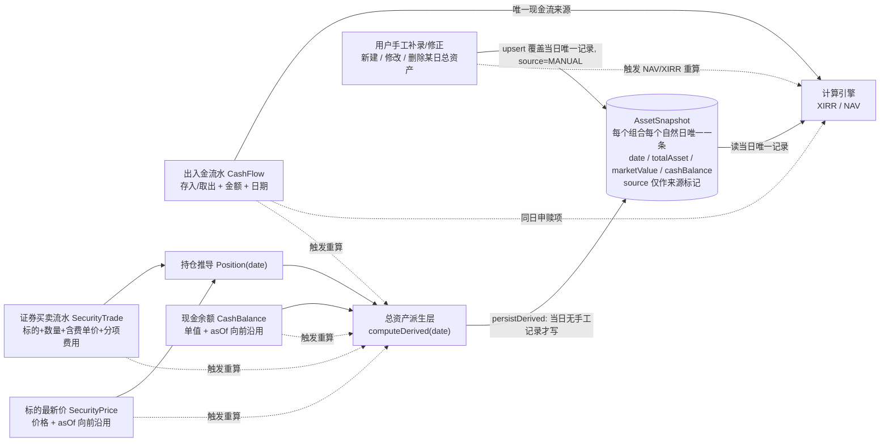

# 投资收益统计系统 — 产品需求文档（PRD）

> **项目名**：`investment_return_tracker` ｜ **语言**：中文（简体）
> **用途**：本文档是产品功能需求的权威规格，聚焦**功能范围、系统架构（简述）、模块职责、数据模型**。金融口径（§3）与计算伪代码（附录 A/B/C）为冻结的不变量，不得改动公式与口径。本系统以 **FastAPI 后端 + React Web 前端**交付。

---

## 实现现状

本 PRD 描述的所有功能模块均已实现，代码库为 `investment_return_tracker`：

- **后端（Python / FastAPI）**：已实现完整 API 面，模块含 `auth`（注册 / 登录 / 恢复 / me / 资料 / 密码 / 邮箱 / 注销）、`portfolios`（CRUD + 归档 + 清空数据）、`aggregation`（对比 / 摘要 / 概览 / 指标 / 回撤 / 账户统计）、`data`（cashflows、securities、security-trades、security-prices、cash-balances、snapshots + 重置）、`dividend`、`calc`（holdings / xirr / nav / 重算）、`data-transfer`（导出 / 导入 / 模板）、`preference`（用户偏好）、`upload`（头像）。
- **前端（React / Vite）**：已构建全部页面 —— `login`、`register`、`dashboard(/)`、`holdings(/holdings)`、`transactions`(路由 `/cashflows`)、`snapshots(/snapshots)`、`xirr-analysis(/analysis/xirr)`、`nav-analysis(/analysis/nav)`、`account(/account)`、`settings(/settings)`、`not-found`。功能模块：`cashflow`、`holdings`、`security-trade`、`security-price`、`snapshot`、`security-income`(分红)、`overview`、`portfolio`、`account`、`auth`、`data-transfer`、`query`。图表用 ECharts（`nav-trend`、`xirr-trend`、`yearly-bar`、`monthly-heatmap`、`stat-card`）。

> 各模块级别（§5）标注了对应的已实现后端模块与前端页面；文档其余部分不再逐行加「✅ 已实现」标记。

---

## 目录

| 章节 | 内容 |
|------|------|
| 实现现状 | 已实现代码范围概览 |
| §1 | 目标与范围 |
| §2 | 全局约束（所有模块必须遵守） |
| §3 | 金融口径（基石，不可改） |
| §4 | 数据流总览 |
| §5 | 模块定义（含已实现后端模块 / 前端页面映射） |
| §6 | 需求池（FIN / FLOW / HOLD-B / CASH / SNAP / DASH / ANL / ACC / SET / SYS） |
| §7 | UI 草图（线框） |
| §8 | 计算引擎契约（XIRR / NAV 取数与触发） |
| §9 | 非功能性需求 |
| §10 | 验收与强制回归测试（REG-01 ~ REG-06） |
| 附录 | A XIRR 伪代码 / B 净值伪代码 / C 持仓推导伪代码 / D 数据模型摘要 / E API 列表 |

---

# §1 目标与范围

## 1.1 产品定位与基本信息

| 项目 | 内容 |
|------|------|
| 产品名称 | `investment_return_tracker`（投资收益统计系统） |
| 一句话定位 | 基于 XIRR 算法的 Web 端投资组合收益与净值追踪平台 |
| 目标用户 | 个人投资者、小型机构投资者 |
| 核心价值 | 精确计算真实年化收益率（XIRR），每日记录累计净值与当年净值，提供年/月/周/日多维度可视化分析 |
| 后端技术栈 | Python / FastAPI + PostgreSQL；共享金融算法层 `finance_core`（纯金融算法库，XIRR / 净值等核心算法独立于此包） |
| Web 技术栈 | Vite + React + TypeScript + Tailwind CSS + Zustand + TanStack Query + Axios；图表 ECharts |
| 交付范围 | 仅 Web 端（前端 + 后端 + 共享金融算法层）；无移动端 |
| 代码管理 | Git |

## 1.2 原始需求复述

1. 通过输入存入取出金额、期末资产额。
2. 使用 XIRR 计算投资收益（存入 = 负、取出 = 正、当日资产额 = 正终值），记录每日 XIRR，可通过年/月/周/日查询。
3. 计算净值，分为累计净值和当年净值，记录每日的累计净值和当年净值，可通过年/月/周/日查询。
4. 所有年/月/周/日查询都做成可视化。
5. 后端使用 PostgreSQL 保存数据。
6. 前端使用 Web 版本，使用 Git 管理代码。

**增量需求**：
- 完善系统，包含 dashboard、持仓、交易、账户、设置。
- 数据架构升级：出入金正名、持仓改为交易明细法（方案 B）、现金余额独立、总资产由系统自动派生并每日落库且每日唯一一条。

## 1.3 产品目标

**金融口径目标（基石）**

| # | 目标 | 衡量口径 |
|---|------|---------|
| FG1 | 收益率口径与公募基金披露一致 | 累计 XIRR + 单位份额法累计净值 + 当年净值三件套，精度与公式与基金业惯例一致 |
| FG2 | 每日可追溯 | 每个计算日都留下 `daily_nav` / `daily_xirr` 记录，可按年/月/周/日查询 |
| FG3 | 口径唯一 | 所有金融计算在后端完成，前端仅格式化展示 |

**数据架构目标**

| # | 目标 | 衡量口径 |
|---|------|---------|
| G1 | 现金流与资产口径彻底分离 | 出入金流水是 XIRR 现金流与 NAV 申赎项的唯一来源；证券买卖与现金余额不进现金流，只进资产 |
| G2 | 持仓可精确回溯到任意历史日期 | 持仓由证券买卖流水回放推导，任意日期的数量为精确值，不依赖用户手工快照 |
| G3 | 总资产成为稳定、可索引、可审计的每日事实 | 每个组合每个自然日在库中至多一行总资产记录；净值/XIRR 引擎只读这张表 |

**模块体验目标**

| # | 目标 |
|---|------|
| M1 — 看得懂 | 用户登录后 3 秒内在概览页掌握「我赚了多少、赚得快不快、钱现在在哪」，可自由切换年/月/周/日维度下钻 |
| M2 — 记得全 | 在完全不重写收益计算引擎的前提下，提供持仓统计视图，追溯钱具体分布在哪些标的，并记录分红与费用 |
| M3 — 用得顺 | 账户与设置职责清晰不重复，偏好设置多端一致，数据可导入导出 |

## 1.4 范围边界

### 1.4.1 In Scope

- 出入金（存入/取出）现金流录入与管理
- 证券买卖流水录入 → 持仓推导（方案 B）→ 持仓列表与估值
- 标的最新价 `SecurityPrice`（手工维护 + 向前沿用；行情自动获取为 P1）
- 现金余额 `CashBalance`（独立手填对账值，多行历史）
- 总资产每日记录 `AssetSnapshot`（自动派生落库 + 手工 CRUD，**每日唯一一条**）
- XIRR 年化收益率计算及每日记录
- 累计净值与当年净值的每日计算与记录
- 年/月/周/日四维度查询与可视化展示
- 概览（Dashboard）/ 账户中心（聚合视图 + **全站唯一组合管理平面**；除「我的组合」块外整页只读，零账户资料修改、零登出）/ 设置（账户资料与安全修改的唯一入口、退出登录与注销账户的唯一入口、偏好上云、导入导出、危险操作；**不含组合管理**）
- 多组合管理、多用户认证与数据隔离
- 数据导入导出（CSV/Excel）

### 1.4.2 Out of Scope（明确不做 / 列 P2）

| 项目 | 原因 |
|------|------|
| 在线交易 / 券商 / 银行账户对接 | 无合规资质与接口 |
| 多币种汇率自动换算 | v1 单币种（CNY），列 P2 |
| 社交 / 社区功能 | 超出产品定位 |
| 税务计算与合规报表 | 超出产品定位 |
| 已实现盈亏（卖出锁定盈亏） | 依赖批次成本跟踪，列 P2 |
| 公司行为（拆股/合股/配股/股票股利） | 改变数量但不产生现金流，需专门口径，列 P2 |
| FIFO 成本法 | 个人投资者少用，列 P2 |
| 标的级 XIRR | 依赖已实现盈亏与标的级现金流口径，列 P2 |
| 多现金账户（券商现金/银行活期分账） | 列 P2 |
| 重写核心算法 `nav` / `xirr` 计算 | 算法已验证，本次仅做取数来源改造，不得重写 |

---

# §2 全局约束（所有模块必须遵守）

| 编号 | 约束 | 说明 |
|------|------|------|
| C-01 | 金融计算全部在后端 | 前端只做格式化展示，禁止在前端计算 XIRR、净值、份额 |
| C-02 | `amount` 是现金流唯一口径 | `amount` 始终代表「实际资金真实进出投资组合边界的金额」，是 XIRR 与份额申赎的唯一输入 |
| C-03 | 数据隔离 | 所有接口必须经认证 + `user_id` 过滤 |
| C-04 | 精度约定 | 金额 2 位小数、净值展示 4 位（存储 6 位）、XIRR 展示百分比 2 位（存储 8 位）、份额/数量 6 位、均价 6 位 |
| C-05 | 向后兼容 | 新增字段一律可空（nullable），不得让存量数据迁移失败 |
| C-06 | 空状态必备 | 每个页面/卡片都必须有「无组合 / 无数据 / 加载中 / 请求失败」四态，不得白屏或报错 |
| C-07 | 复用优先 | 优先复用已有组件与功能模块，禁止重复造轮子 |
| C-08 | 计算引擎只读派生结果 | 净值 / XIRR 计算引擎只能读 `AssetSnapshot` 与 `Transaction`（出入金）；不得出现 `security_trades` / `security_prices` / `cash_balances` / `dividend_records` 的查询，也不得出现 `Σ(quantity × price)` 之类的市值计算（费用字段同样不进计算引擎） |
| C-09 | 五类事件必须触发重算 | 出入金 / 证券买卖 / 现价更新 / 现金余额变更 / 手工总资产记录增改删重置 —— 任一写操作都必须走统一重算入口。**两层分流**：T1~T4 触发**快照层区间重建 + 计算层级联 `[D, today]`**；T5（手工总资产记录）触发**快照层仅当日 + 计算层级联 `[date, today]`**。严禁「只写快照不重算净值」 |
| C-10 | `TransactionType` 保持 `BUY`/`SELL` 两值不变 | 不得扩展 `DIVIDEND` / `FEE`。分红仍属持仓模块独立表；费用内联于 `security_trades`。证券买卖的 `side` 使用独立枚举 `BUY_SEC` / `SELL_SEC`，严禁复用 `TransactionType` |
| C-11 | 禁止绕过服务层直写 `asset_snapshots` | 任何接口/脚本都必须经派生层或手工 CRUD 接口写入该表 |
| C-12 | 读路径禁止依赖 `source` | 严禁在取数逻辑中出现 `WHERE source='DERIVED'`、`ORDER BY source` 之类的优先级判断（区间重建的 `DELETE` 保护是唯一例外） |

> **展示层全局约定**：涨跌配色一律采用 A 股惯例「正值 = 红色、负值 = 绿色」，全站图表 / 明细表 / 卡片 / 徽标统一，不得出现反向配色（完整口径见 §9.5）。

---

# §3 金融口径（基石 · 一行不改）

> 本章是项目的地基，XIRR 与净值的计算口径必须严谨无歧义。以下定义参照公募基金净值计算惯例。

## 3.1 XIRR（扩展内部收益率）

**定义**：XIRR 是针对**非定期（不规则间隔）现金流**计算年化收益率的算法。它求解使所有现金流净现值（NPV）为零的年化折现率 r：

$$\sum_{i=0}^{n} \frac{CF_i}{(1+r)^{(d_i - d_0)/365}} = 0$$

其中 CF_i 为第 i 笔现金流，d_i 为对应日期，d_0 为第一笔现金流日期。

**输入数据约定**：

| 数据类型 | 现金流方向 | 符号 | 说明 |
|----------|-----------|------|------|
| 存入（投入资金） | 流出 | 负值（−金额） | 资金从投资者账户流出进入投资 |
| 取出（收回资金） | 流入 | 正值（+金额） | 资金从投资收回进入投资者账户 |
| 当日资产额（总资产） | 终值 | 正值（+金额） | 当日持仓的市值估值，作为 XIRR 的终值（terminal value） |

**与 IRR / CAGR 的区别**：

| 指标 | 现金流要求 | 时间假设 | 适用场景 |
|------|-----------|---------|---------|
| IRR | 定期（等间隔） | 假设各期等长 | 定期定额投资 |
| **XIRR** | **非定期（任意日期）** | **按实际天数/365 折现** | **本项目：不规则存取** |
| CAGR | 仅需首末两值 | 忽略中间现金流 | 简单首末对比，不反映追加/赎回影响 |

## 3.2 每日 XIRR

**定义**：指从**第一笔存入日**起，到**当日**为止的**累计 XIRR**。

**计算口径**：
- 现金流序列 = [第一笔存入日 ~ 当日的所有存入/取出记录] + [当日总资产作为终值]
- 即将当日总资产视为一笔「当日发生的正现金流」，与历史所有存入取出现金流一起代入 XIRR 公式求解
- 每个计算日计算一次，得到一个 XIRR 值，形成时间序列

**为什么选累计口径而非滚动口径**：

| 方案 | 定义 | 优点 | 缺点 |
|------|------|------|------|
| ✅ **累计 XIRR**（采用） | 从第一笔存入到当日的整体年化收益 | 反映真实总回报，与基金披露口径一致，跨年/月/周/日查询均可纵向对比 | 长期后会趋稳，对近期变化不够敏感 |
| 滚动 XIRR | 过去 N 天（如 365 天）窗口的 XIRR | 反映近期表现 | 窗口初期数据不足，口径主观，跨期不可比 |

**查询维度说明**：按年/月/周/日查询时，展示的是该时间范围内**每日累计 XIRR 值的序列**。

## 3.3 累计净值（单位份额法）

**定义**：类比公募基金累计净值，反映投资组合从成立日（第一笔存入日）起的整体净值增长。

**计算方法 —— 单位份额法**：

1. **成立日（第一笔存入日）**：单位净值 = 1.0000，初始份额 = 存入金额 / 1.0000 = 存入金额
2. **每日估值流程**（日终处理）：
   - Step 1：根据当日总资产（**期末总额，含当日存入/取出**）、当日存入/取出金额和上日末份额，计算当日单位净值：

     $$当日单位净值 = \frac{当日总资产 − 当日存入总额 + 当日取出总额}{上日末总份额}$$

   - Step 2：按当日单位净值处理当日存入/取出（申赎）：
     - 存入新增份额 = 存入金额 / 当日单位净值
     - 取出赎回份额 = 取出金额 / 当日单位净值
     - 当日末总份额 = 上日末份额 + 新增份额 − 赎回份额
3. **累计净值 = 单位净值**（v1 不涉及分红，故累计净值即单位净值）

**基准日**：第一笔存入日，累计净值 = 1.0000

**示例**：
- Day 1：存入 10000 → 份额 10000，净值 1.0000，资产 10000
- Day 30：存入 6000 后账户期末总额 18000 → 申赎前资产 = 18000 − 6000 = 12000 → 净值 = 12000/10000 = 1.2000 → 新增份额 = 6000/1.2000 = 5000，总份额 15000
- Day 60：期末总资产 16500 → 净值 = 16500/15000 = 1.1000

## 3.4 当年净值

**定义**：反映本年度（自然年）内的净值增长，每年首个交易日重置基准。

**计算公式**：

$$当年净值_t = \frac{累计净值_t}{累计净值_{上年最后一个交易日}}$$

**规则**：
- 每年 1 月 1 日（或**当年第一个计算日**），当年净值 = 1.0000
- 当年净值 − 1 = 当年收益率
- 跨年对比时，各年度起点统一为 1.0000，便于横向比较
- 上年**最后一个有记录的交易日**的累计净值作为本年度基准值，记录为 `base_cumulative_nav`

**与累计净值的关系**：累计净值看长期（从成立日起），当年净值看年度（从本年起），两者互补。

## 3.5 存入 / 取出 / 总资产

| 数据类型 | 含义 | 录入粒度 | 符号约定 |
|----------|------|---------|----------|
| 存入（`BUY`） | 投入资金进入组合，资金流出投资者账户 | 按笔录入（日期 + 金额） | 现金流为负 |
| 取出（`SELL`） | 从组合收回资金，资金流入投资者账户 | 按笔录入（日期 + 金额） | 现金流为正 |
| 总资产（`AssetSnapshot.totalAsset`） | 当日组合总市值 | **系统每日自动派生落库**（例外可手工补录），**每组合每日唯一一条** | XIRR 终值为正 |

**录入规则**：
- 存入/取出：一笔一条记录，含日期、方向、金额、备注；同一天可有多笔
- 总资产：**每组合每自然日有且仅有一条记录**（`UNIQUE(portfolioId, date)`），详见 §5.4
- 与原描述的差异：「资产快照是触发当日净值与 XIRR 计算的前提」的天然闸门已被替换为事件日集合（见 §5.4.4）

## 3.6 数据校验规则

| 校验项 | 规则 | 错误提示 |
|--------|------|---------|
| 出入金金额 | 必须 > 0 | "金额必须大于 0" |
| 出入金日期 | 不可晚于今天 | "日期不能为未来日期" |
| 取出金额 | 不可超过当日总资产（**软校验**，可忽略） | "取出金额接近/超过持仓总值，请确认" |
| 总资产记录 | 每组合每日仅一条（数据库唯一索引强制），手工录入到已有日期即**覆盖**（不报"重复"错） | "该日已有记录，保存后将被取代" |
| 首笔出入金 | 必须为**存入**（成立日不能以取出开始） | "首笔交易必须为存入" |
| XIRR 数据 | 至少需 1 笔存入 + 1 条总资产记录 | "数据不足，请录入存入和资产数据后查看收益" |
| 日期格式 | `YYYY-MM-DD` | 标准化处理 |
| 证券买卖 | `quantity > 0`、`costPrice > 0`、`commission ≥ 0`、`stampTax ≥ 0`、`other ≥ 0`、`feeTotal ≥ 0`（= 佣金 + 印花税 + 其他）、日期不可未来 | 指向具体字段 |
| 卖出数量 | **硬校验**：不得超过该日持仓数量，且插入历史流水后后续日期不得出现负持仓 | "当前持有 X，最多可卖 X" |
| 现金余额 | `amount ≥ 0`、`asOf` 不可未来 | 指向具体字段 |
| 手工总资产 | `totalAsset ≥ 0`、日期不可未来；`marketValue`/`cashBalance` 选填；`note` 强提示填写 | 指向具体字段 |

## 3.7 每日 XIRR / 净值的计算触发机制

| 触发时机 | 行为 |
|---------|------|
| **五类事件任一发生**（出入金 / 证券买卖 / 现价更新 / 现金余额变更 / 手工总资产记录增改删重置） | 从事件日 D 起**级联重算** `[D, today]` 的 `daily_nav` 与 `daily_xirr` |
| 查询时发现今日无总资产记录 | 惰性触发一次自动生成（`today` 若已有手工记录则跳过） |
| 历史数据修改 | 从修改日起到最新日期，批量重算受影响日期 |
| 日终批处理 | **不引入定时任务** |

**XIRR 算法实现要求**：
- XIRR 求解**委托 `pyxirr` 库**（Python），日计数惯例 ACT/365，初始猜测值 `guess = 0.1`（10%），与 §3.1 口径等价
- 后端实现，通过 API 返回结果；`finance_core/xirr.py` 的 `calculate_xirr` 直接调用 `pyxirr.xirr`
- 边界处理：现金流少于 2 笔 / 全同号 → 返回 `null`（不可计算，落库 `xirr_value` 为 NULL，前端不展示）；退化同日期等量反向 → 0.0；求解失败 / 非有限值 → `null`
- 精度：pyxirr 返回 float(f64) → 落库量化 `NUMERIC(20,8)`（`Decimal(str(rate)).quantize(1e-8)`）

> 以上为要点摘要。XIRR 求解的完整参数与边界处理一律以**附录 A：XIRR 计算说明**为准；本节与附录 A 若有任何出入，**以附录 A 为权威**。金融口径（符号约定、ACT/365、精度 `NUMERIC(20,8)`）属冻结内容，不得删改。

**每日净值计算逻辑**（不变，详见附录 B）：

```
对于每个计算日 t：
  1. 读取 t 日总资产 asset_t（= AssetSnapshot 当日唯一记录，无记录则前值填充）
  2. 读取 t-1 日末总份额 shares_{t-1}（若 t 为成立日，份额 = 首笔存入金额，净值 = 1.0）
  3. 计算当日申赎前净值：
     buy_t  = Σ(当日存入金额)
     sell_t = Σ(当日取出金额)
     nav_t  = (asset_t − buy_t + sell_t) / shares_{t-1}
  4. 处理当日申赎：shares_t = shares_{t-1} + buy_t/nav_t − sell_t/nav_t
  5. 累计净值 cumulative_nav_t = nav_t
  6. 当年净值：
     若 t 为当年首个计算日 → year_nav_t = 1.0000, base = cumulative_nav_{t-1}
     否则 → year_nav_t = cumulative_nav_t / base
  7. 存储当日：nav_t, cumulative_nav_t, year_nav_t, shares_t
```

---

# §4 数据流总览



> **三句话钉死数据流**：
> 1. **出入金只贡献「现金流」；持仓市值 + 现金余额只贡献「总资产」。两者在计算引擎里汇合，谁变了都要触发重算。**
> 2. **总资产不是"算完就丢"的中间值 —— 它每天在 `AssetSnapshot` 里留下一条记录，计算引擎读的是这张持久化表，而不是运行时拼装。**
> 3. **这张表每个组合每个自然日只有一条记录。这条记录要么是派生层写的，要么是用户写的，二者不并存。读取方永远只需要"取当日那一条"，不做任何优先级判断。**

---

# §5 模块定义

## 5.1 出入金管理（`/cashflows`）

**定位**：纯组合级现金流账本，**XIRR 现金流的唯一来源**、NAV 申赎项的唯一来源。

> **已实现**：后端 `data`（cashflows 路由）；前端 `/cashflows`（transactions 页）+ `cashflow` 功能模块。

| 项 | 定义 |
|----|------|
| 字段 | `date`（日期）、`type`（`BUY`=存入 / `SELL`=取出，UI 只出现"存入/取出"）、`amount`（金额，>0）、`note`（备注） |
| **不含字段** | `securityId` / `quantity` / `costPrice` / `commission` / `stampTax` / `other` / `feeTotal` 不属于出入金，归属持仓模块的 `SecurityTrade` |
| 语义 | `amount` = 资金真实进出投资组合边界的金额（从银行卡打进来 / 提回银行卡）。组合内部的证券买卖不是出入金 |
| 枚举 | 维持 `BUY`/`SELL` 两值，二分判断逻辑不变 |
| 页面归属 | 出入金管理页（`/cashflows`），并**并入**现金余额录入区；总资产展示已迁至概览页；历史总资产记录统一于 `/snapshots` 浏览与管理 |

## 5.2 持仓模块（方案 B — 交易明细法，`/holdings`）

**定位**：以**证券买卖流水**为原始凭证，**推导**出任意日期的持仓状态；持仓市值是总资产的第一个加项。

> **已实现**：后端 `data`（security-trades、security-prices、securities 路由）、`dividend`；前端 `/holdings`（HoldingsPage）+ `holdings` / `security-trade` / `security-price` / `security-income` 功能模块。

### 5.2.1 实体

| 实体 | 说明 |
|------|------|
| `SecurityTrade`（证券买卖流水） | `date / securityId / side(BUY_SEC \| SELL_SEC) / quantity / costPrice / commission / stampTax / other / feeTotal / note`。`costPrice`=含费单价、`feeTotal` = 佣金+印花税+其他之和。独立枚举，严禁复用 `TransactionType` |
| `SecurityPrice`（标的最新价） | `securityId / price / asOf`。与现金余额同构的「最新值 + 向前沿用」语义。行情自动获取落地前由用户手工更新 |
| `Security`（标的主数据） | `id / portfolioId / code / name / type / currency`；`type` 枚举 `STOCK`/`FUND`/`BOND`/`CASH`/`OTHER`，其中 `CASH` 弃用。同一组合内 `code` 唯一；`name` 必填 ≤ 50 字 |
| `DividendRecord`（分红记录） | 日期 / 标的 / 金额 / **所得税 `tax`（可选，空视为 0，≥ 0）** / 类型（现金分红·红利再投）/ 备注。**不参与收益计算**。红利再投不录入（无现金进出）。净额 `netAmount` = 金额 − 所得税，由后端统一计算并随响应返回、不落库 |
| `SecurityTrade` 费用字段 | 费用由 `commission` / `stampTax` / `other` / `feeTotal` 字段承载（`fee_records` 表已并入并删除），费用场景由 `side` 推导（买入时 / 卖出时），费用数据仍不参与收益计算 |
| `Holding` | ❌ **不存在**。持仓不落库、不手工录入，一律由 `SecurityTrade` 回放推导 |

### 5.2.2 推导算法（P0 必须实现，口径不得自由发挥）

按 `(date, createdAt)` 升序回放该标的全部流水：

```
买入 (q, p, fee):
    cost_total = cost_total + q × p + fee        // 费用计入成本
    qty        = qty + q
    avgCost    = cost_total / qty                // 移动加权平均

卖出 (q, p, fee):
    qty        = qty − q
    avgCost    = 不变                             // ← 单位成本价不变
    cost_total = qty × avgCost                   // ← 成本额随数量等比减少
    // v1 不记录本次卖出的已实现盈亏；卖出费用 fee 仅作信息记录，不回冲成本

清仓 (qty == 0):
    avgCost = 0, cost_total = 0                  // 归零重置，下次买入重新起算
    该标的从持仓列表默认隐藏（可切换"显示已清仓"）
```

> **歧义澄清**：「卖出不减成本」指的是 **`avgCost`（单位成本价）不变**，不是成本总额不变。若成本总额不变，清仓后会残留幽灵成本。以上伪代码为准。

**成本口径**：采用移动加权平均，与国内券商 App / 基金 App 展示口径一致；`avgCost` 由系统自动推导，不再手工录入。

**估值规则**：
- `持仓数量(s, date)` = 该标的 ≤ date 全部流水回放结果
- `现价(s, date)` = `SecurityPrice` 中 asOf ≤ date 的**最后一条**（向前沿用）；**若无任何价格记录 → 回退用 `avgCost` 估值**，UI 标注「按成本估值」徽标
- `持仓市值(date)` = `Σ 数量(s,date) × 现价(s,date)`
- `持仓市值(date)` 是每日总资产记录的**第一个加项**

### 5.2.3 持仓列表

各标的**当前持仓**一行：`标的名称 / 代码 / 类型 / 数量 / 成本价(avgCost) / 现价(+asOf) / 成本额 / 市值 / 浮动盈亏 / 盈亏率 / 占比`。行级派生值一律**不落库**，由 service 计算返回。

> **边界澄清**：「派生值不落库」仅适用于持仓列表的行级派生值。组合级总资产是唯一例外 —— 它必须每日落库（`AssetSnapshot`，每日唯一一条）。

## 5.3 现金余额（`CashBalance`）

> **已实现**：后端 `data`（cash-balances 路由）；前端 `/cashflows` 现金余额区块。

| 项 | 定义 |
|----|------|
| 模型 | **独立表** `CashBalance`：`portfolioId / amount / asOf / note`。保留变更历史（多行），语义上「当前值 = asOf 最大的那条」 |
| 语义 | **最新值 + 向前沿用**。8/2 填 100 → 8/2 起余额 100；8/3 未改 → 仍 100；8/4 改 200 → 8/4 起 200。8/1（首条之前）→ 视为 0 |
| 录入 | **手填，单一入口**，位于**出入金管理页**的「现金余额」区块。这是资产口径的常规手填项；总资产手填属于例外性补录 |
| 联动 | 🔴 **零联动**：存入/取出不改它，证券买卖不改它。只在保存后给"是否同步调整"的软提示 |
| 参与计算 | ✅ **参与** —— 作为每日总资产记录的**第二个加项**（cashBalance(date) = asOf ≤ date 的最后一条），随后间接进入 XIRR 终值与 NAV 分子 |
| 变更后效果 | 修改任一条 `CashBalance` → 从该 asOf 起级联重算并覆盖受影响日期的自动记录（仅覆盖 `source='DERIVED'` 的记录；用户手工记录的日期被跳过） |
| `CASH` 标的口径 | 🔴 **弃用 `CASH` 标的口径**：新建标的时隐藏 `CASH` 选项；枚举值保留（避免破坏性迁移），标注 `@deprecated`；CASH 类标的记录不予建立（避免与现金余额双计） |

## 5.4 总资产 / 每日唯一记录（`AssetSnapshot`）

> **已实现**：后端 `data`（snapshots 路由 + 重置）、`calc`；前端 `/snapshots` + `snapshot` 功能模块。

### 5.4.1 最终口径（一句话定义）

> **总资产（TotalAsset）= 持仓当日最新市值 + 当日现金余额，由系统自动派生并每日落库。**
> 🔴 **硬约束**：**「每日总资产记录」表中，每个组合每个自然日有且仅有一条记录，不论其来源是自动生成还是手工记录。**
> **写入方有两个：派生层（自动，`source='DERIVED'`）与用户（手工，`source='MANUAL'`）。二者写的是同一行：**
> - **用户手工写入 → upsert 覆盖该日记录，`source` 改写为 `MANUAL`（手工取代自动）。**
> - **派生层写入 → 当日若已是 `MANUAL` 记录，则跳过、不写、不覆盖（手工优先）；否则写入/更新 `DERIVED` 记录。**
> - **读取 → 直接读当日那一条，无需任何优先级判断。**

形式化：

```
totalAsset(D) = marketValue(D) + cashBalance(D)          // 自动派生口径

其中：
  marketValue(D) = Σ_s [ quantity(s, D) × price(s, D) ]
      quantity(s, D) = 该标的 ≤D 全部 SecurityTrade 回放结果（精确，方案B）
      price(s, D)    = SecurityPrice 中 asOf ≤ D 的最后一条（向前沿用）
                       若无任何价格 → 回退 avgCost(s, D)，记录标记「按成本估值」
  cashBalance(D)  = CashBalance 中 asOf ≤ D 的最后一条（向前沿用）
                       若无任何记录 → 0

落库（每日唯一一条）：
  AssetSnapshot { portfolioId, date=D, totalAsset, marketValue, cashBalance,
                  source, valuationFlag, note, recordedAt }
  UNIQUE (portfolioId, date)          // ← 唯一约束不含 source

写入语义（upsert，唯一权威口径）：
  persistDerived(portfolioId, D):
      INSERT (…, source='DERIVED')
      ON CONFLICT (portfolioId, date) DO UPDATE
        SET … WHERE AssetSnapshot.source = 'DERIVED'   // 当日为 MANUAL 则不更新

  upsertManual(portfolioId, D, totalAsset, …):
      INSERT (…, source='MANUAL')
      ON CONFLICT (portfolioId, date) DO UPDATE
        SET totalAsset=…, marketValue=…, cashBalance=…,
            source='MANUAL', valuationFlag='MANUAL_INPUT', note=…, recordedAt=now()
      // 无条件覆盖，手工取代自动

  deleteRecord(portfolioId, D):
      DELETE FROM asset_snapshots WHERE portfolioId=… AND date=D
      DELETE FROM daily_nav WHERE portfolioId=… AND date=D
      DELETE FROM daily_xirr WHERE portfolioId=… AND date=D
      // 随后若 D 属事件日 → 由 persistDerived 立即回填一条 DERIVED
      // 随后由重算服务重算 [D, today] 的 daily_nav / daily_xirr

读取规则（唯一权威口径，两级）：
  effectiveTotalAsset(D)
      = AssetSnapshot(portfolioId, D).totalAsset       若该日存在记录（不论来源）
      = effectiveTotalAsset(前一个有记录的日期)          否则（前值填充）
      = 0                                             否则（首条记录之前）

自动值的实时计算（不落库）：
  computeDerived(portfolioId, D) -> { totalAsset, marketValue, cashBalance, valuationFlag }
      // 纯函数，仅计算不写库。用于：手工记录行的「自动值 / 差异」提示、
      //「重置为自动值」操作、差异汇总统计。
      // 🔴 由于同日不再保留自动记录行，此函数是获取"本应是多少"的唯一途径。
```

### 5.4.2 与上游两个数据源的关系（责任边界）

| 上游 | 谁维护 | 口径 | 在总资产中的角色 |
|------|--------|------|----------------|
| **持仓市值** | 系统推导（用户只录买卖流水 + 现价） | 方案B 流水回放数量 × ≤date 最后一条现价（无价回退 avgCost） | 加项 1 |
| **现金余额** | 🖊️ **用户手填当前值** | `asOf ≤ date` 的最后一条，向前沿用；首条之前视为 0 | 加项 2 |
| **总资产（自动）** | 🤖 **系统自动，每日落库** | 加项 1 + 加项 2 | **当日唯一记录（`source='DERIVED'`）** |
| **总资产（手工）** | 🖊️ **用户按需补录/修正** | 用户直接给定的 `totalAsset`（不参与加项计算） | **取代当日唯一记录（`source='MANUAL'`）** |

- **常规路径**：用户维护「买卖流水 + 现价 + 现金余额」三项上游 → 系统自动算出总资产并每日记录。用户不需要碰总资产。
- **例外路径**：当上游数据无法还原真实情况时，用户可直接手工新建/修改某日总资产记录，取代当日自动记录。
- **不可能出现的状态**：同一组合同一天既有自动记录又有手工记录。若在库中观察到这种情况，即为数据缺陷，需按唯一约束修复。

### 5.4.3 历史精度的口径局限

历史某日 D 的自动记录中：**数量来自流水（精确）**，**价格与现金来自"向前沿用的最新值"（近似）**。

> 必须向用户明示：用户若长期不更新现价 / 现金余额，历史曲线会呈现「阶梯状横盘」，这是预期行为，不是 bug。UI 需在净值/XIRR 图表与历史总资产表加一行说明，并在受影响记录上打 `valuationFlag`（`EXACT` / `CARRIED_FORWARD` / `COST_BASED`）。`valuationFlag` 是记录字段，必须持久化。手工记录的 `valuationFlag` 固定为 `MANUAL_INPUT`，UI 用独立徽标区分。

### 5.4.4 计算日历与稀疏落库

以「**事件日**」为准生成序列：

```
事件日集合   = 出入金日期 ∪ 证券买卖日期 ∪ 价格更新日期(asOf) ∪ 现金余额变更日期(asOf) ∪ 今日
快照日期集合 = 总资产记录表中实际存在的日期集合
             （因每日唯一，直接 SELECT DISTINCT date 即可，无需区分来源做并集运算）
```

- **落库策略**：仅对事件日（含今日）写入记录 → **稀疏存储**，避免 5 年 1800 天全量冗余。
- **读取策略**：查询任意日期区间时，对无记录的自然日按**前值填充**补齐，对外表现为"每日都有记录"。前值填充直接取前一个有记录日期的 `totalAsset`（无需判断来源）。
- **重算策略**：任一事件发生在日期 D → **删除并重建 `[D, today]` 区间内的记录**（幂等）。
  🔴 **关键约束**：
  - `DELETE` 语句**必须带 `AND source = 'DERIVED'`** —— 用户手工记录的日期不在删除范围内。
  - 重建 `INSERT` **必须带 `ON CONFLICT (portfolioId, date) DO NOTHING`**（或等价的手工跳过判断）—— 双保险。

### 5.4.5 写入 / 冲突行为规范（唯一权威表）

> 核心原则：**每日唯一一条 · 手工覆盖自动 · 自动跳过手工**。

| 场景 | 行为 |
|------|------|
| **当日无任何记录，派生层触发** | 插入一条 `source='DERIVED'` 记录 |
| **当日已有 `DERIVED` 记录，派生层再次触发** | **更新**该行，source 保持 `DERIVED`。仍是一条 |
| **当日已有 `MANUAL` 记录，派生层触发** | 🔴 **跳过，不写入、不覆盖、不新增**。该日记录保持为用户的手工值 |
| **当日无任何记录，用户手工新建** | 插入一条 `source='MANUAL'`、`valuationFlag='MANUAL_INPUT'` 的记录 |
| **当日已有 `DERIVED` 记录，用户手工录入** | 🔴 **upsert 覆盖该行**：值改为用户填写值，source 改写为 `MANUAL`。**原自动值不保留在库中**（需要对比时由 `computeDerived(date)` 实时算出） |
| **当日已有 `MANUAL` 记录，用户再次编辑** | 更新该行，source 保持 `MANUAL` |
| **用户删除某日记录** | 物理删除该行。随后：若该日属于**事件日集合** → 由派生层**立即回填一条 `DERIVED` 记录**；若不属于事件日 → 该日无记录，读取时按**前值填充** |
| **「重置为自动值」** | 调用 `computeDerived(date)` → **upsert 覆盖该行**，source 置回 `'DERIVED'`、`valuationFlag` 置回计算结果。等价于"撤销手工修改"。仍是一条 |
| **上游事件触发区间重建** | `DELETE … WHERE source='DERIVED' AND date BETWEEN D AND today` → 逐事件日 `INSERT … ON CONFLICT DO NOTHING`。用户手工记录的日期原样保留，值不变、source 不变 |
| **手工记录能否指向未来日期** | ❌ 不允许，date 不可晚于今日 |
| **手工录入的二次确认** | 若当日已存在自动记录，弹窗必须显示「该日系统自动计算值为 ¥X，保存后该值将被您填写的值**取代**」并要求确认 |

### 5.4.6 `source` 字段的定位

🔴 **`source` 不是唯一键的一部分。** 它仅用于三件事：
1. **区间重建的删除保护开关**（`DELETE … WHERE source='DERIVED'`）—— 用户手工记录不被自动重算抹掉的唯一机制；
2. UI 来源徽标（`🤖自动` / `✋手工`）与筛选、CSV 导出列；
3. 审计追溯。

🔴 **任何读取路径都不得依赖 `source` 做优先级判断**。

## 5.5 概览 / Dashboard（`/`）

> **已实现**：后端 `aggregation`（overview 路由）、`calc`（xirr/nav）；前端 `/`（dashboard 页）+ `overview` 功能模块。

**定位**：用户的默认落地页，一屏呈现核心收益指标与趋势，并作为流量枢纽向持仓 / 出入金 / 分析页下钻。

> 本页已承接出入金页总资产概览能力：① 指标卡扩为 **8 张**、分两组：**资产构成**（当前总资产 / 持仓市值 / 现金余额 / 净投入）+ **收益表现**（累计收益率 / 当年收益率 / 年化 XIRR / 累计净值）；② 新增「趋势分析」分区：日期筛选栏（快捷区间 + 自定义起止）→ 总资产走势图（hero，含手工记录散点，卡头单一 `/snapshots` 入口）→ 四宫格。

> **口径提醒**：概览页上的**全部指标均来自收益计算引擎**，即 `AssetSnapshot`（每日唯一记录）+ `Transaction`（出入金）+ `daily_nav` + `daily_xirr`。「当前总资产」取自 `AssetSnapshot` 的当日/最新唯一记录。概览页**不得直接读取** `security_trades` / `security_prices` / `cash_balances` 表自行拼装总资产。

**目标**：一屏呈现核心收益指标与趋势；提供统一的时间维度切换（年/月/周/日）驱动页面内所有图表联动；向持仓 / 出入金 / 分析页下钻。

## 5.6 分析页（收益分析 `/analysis/xirr` · 净值分析 `/analysis/nav`）

> **已实现**：后端 `aggregation`（xirr/nav/metrics 路由）、`calc`；前端 `/analysis/xirr`、`/analysis/nav`。

**定位**：深度分析视图，承载四维度查询与可视化要求。

| 维度 | 展示内容 | X 轴 | 典型场景 |
|------|---------|------|---------|
| 按日 | 每日的 XIRR / 净值明细 | 具体日期 | 精确查看某段时间每日变化 |
| 按周 | 每周的 XIRR / 净值（周末值或周均） | 周起始日 | 中短期趋势观察 |
| 按月 | 每月的 XIRR / 净值（月末值或月均） | 月份 | 月度对比分析 |
| 按年 | 每年的 XIRR / 净值（年末值或年均） | 年份 | 长期年度对比 |

**聚合规则**：默认取各周期**最后一个计算日的值**（与基金披露一致），可在设置中切换为"平均值"。

**图表类型**：折线图（时间序列趋势）、柱状图（周期对比）、热力图（月度收益分布）、面积图（累积增长）、对比折线（多指标同图）、数据表格（精确数值）。

## 5.7 账户（`/account`）

> **已实现**：后端 `auth`（me/profile）、`aggregation`（account stats、comparison）、`portfolios`；前端 `/account` + `account` 功能模块。

**定位**：「我」的**聚合视图 + 全站唯一组合管理平面** —— 身份信息 + 跨组合资产全景 + 我的组合 + 数据统计。**最终形态 = 块级只读（3 块只读 + 1 块可写）+ 一个「前往设置 →」入口链接。**

> **契约变更（2026-08-11 决议）**：本页原契约为「整页纯只读」。现将只读粒度**收窄**：**页级只读 → 块级只读**。仅「我的组合」块解禁为可写（承接组合 CRUD），其余块只读契约**一字不改**。决策留痕见 `docs/archive/analysis-three-issues-2026-08-11.md` §③「决议（2026-08-11）」。

| 块 | 读写 | 说明 |
|------|------|------|
| ① 个人信息 | **只读** | 头像 / 昵称 / 邮箱 / 手机（脱敏）/ 简介 / 注册时间；仅提供「前往设置修改 →」链接 |
| ② 资产全景 | **只读** | 跨组合金额类合计（不合计 XIRR / 净值） |
| ③ 数据统计 | **只读** | 笔数 / 天数 / 起止日期 |
| ④ 我的组合 | **可写（本页唯一例外）** | 组合 CRUD：新建 / 设为默认 / 编辑 / 归档 / 删除；点击组合名 = 切换当前组合并跳概览 |

- 与设置页**分工**：**账户页 = 看 + 管组合**（只读展示 + 跳转入口 + 组合实体 CRUD），**设置页 = 改账户与偏好**（账户资料与安全、偏好、导入导出、危险操作与账户生命周期）
- **本页不承载任何账户资料修改动作**：邮箱 / 密码 / 资料（昵称·手机·简介）/ **头像**的修改入口一律不在本页，本页只提供「**前往设置修改 →**」链接跳转至 `/settings`
- **只读原则的适用范围（收窄后）**：本页**零账户资料修改、零登出** —— 账户资料类修改、退出登录、注销账户一律不在本页。本页允许的写动作**仅限组合实体本身**（新建 / 编辑名称·描述 / 设为默认 / 归档 / 删除）；除此之外的交互仅限「跳转」：切换组合 / **前往设置 →**
- 草图内**不得**出现修改邮箱 / 修改密码 / 编辑资料 / 头像上传 / 头像 URL 输入 / 退出登录 / 注销账户任一控件
- **数据源约束（后端零改动）**：「我的组合」表格的性能字段取 `GET /api/portfolios/summary`，描述与归档态取 `GET /api/portfolios`，前端按 `id` 合并；组合 CRUD 复用既有端点（`POST /api/portfolios`、`PATCH /api/portfolios/:id`、`DELETE /api/portfolios/:id`、`PATCH /api/portfolios/:id/archive`、`PATCH /api/portfolios/:id/default`），本次变更**不新增、不修改任何后端接口**

## 5.8 设置（`/settings`）

> **已实现**：后端 `auth`（email/password/profile/avatar/restore）、`portfolio`（clear data）、`preference`、`data-transfer`、`upload`；前端 `/settings` + `data-transfer` 功能模块。

**定位**：配置中心 + **全站唯一的账户资料与安全修改入口** + **全站唯一的账户生命周期与会话操作入口**。

- **唯一修改入口**：修改邮箱 / 修改密码 / 编辑资料（昵称·手机·简介）/ 头像修改（在「编辑资料」卡片内完成：本地上传 与 头像 URL 设置并列）四类动作全部且仅在本页账户区
- **唯一账户操作入口**：退出登录、注销账户（冷静期 30 天，恢复入口在**登录页**，不在设置页）均在本页
- 偏好设置从 localStorage 升级为**服务端持久化**（`UserPreference`），实现多端/多浏览器一致
- **偏好即全局默认**：「默认日期范围」取值域 = 全站「快捷范围」同一组 7 项（`1w/1m/3m/6m/1y/ytd/all`）；该偏好在全站 8 处范围型日期位置生效，优先级 URL 参数 > 用户偏好 > 系统默认 `1y`
- **本页不含组合管理**：组合 CRUD（新建 / 编辑 / 归档 / 删除 / 设为默认）已于 2026-08-11 决议整体迁出，唯一平面为账户页「我的组合」（`ACC-P0-04`）；设置页删除「组合管理」整卡，仅在偏好与外观区保留「**默认组合**」下拉（写 `UserPreference.defaultPortfolioId`，属偏好而非组合 CRUD）
- 与账户中心分工明确：**账户页 = 看 + 管组合**（组合实体 CRUD 唯一平面），**设置页 = 改账户与偏好 + 账户生命周期操作**，两页零重复

---

## 5.9 系统管理（管理员 · `/admin`）

> 仅管理员可见可配。详细规格与五项待定项决策见 `docs/archive/prd-system-management.md`；本节约其要点，保证主 PRD 自洽。

系统管理页承载「金融数据接口」配置，含三个能力：

1. **数据来源（证券行情数据提供方，多提供方）**：取代旧的单 URL 系统配置。每个提供方（`SecuritiesDataProvider`）含 `name` / `provider_type` / `access_method`(https|sdk) / `config`(JSON，HTTPS 存 `base_url`、SDK 存 `sdk_name`) / `is_default` / `is_active` / `enabled` / `description`；解析链「当前(is_active) → 默认(is_default) → None」决定运行时使用哪个提供方（`get_active_provider`）。提供方可设默认 / 设当前（全局至多一个）；删除提供方级联删其接口。
2. **接口 API 来源（提供方接口）**：每个提供方下可配置多个接口（`QuoteInterface`）：`category_id`(分类 id，外键→interface_categories.id) / `name` / `endpoint`(地址或 SDK 函数名) / `http_method`(GET/POST/PUT/DELETE/PATCH，SDK 可空) / `params`(JSON 模板) / `enabled` / `direction`(in/out，默认 in) / `timeout` / `retry_count` / `rate_limit`。顶层 `GET /api/admin/quote-providers/interfaces` 扁平返回全部接口，供「按分类汇总所有提供方」总览。
3. **接口分类管理（InterfaceCategory）**：后台可配分类（`id`(UUID) / `label` / `icon`(lucide 名) / `sort_order`）；迁移预置 7 类（A股列表/行情、港股列表/行情、基金列表、可转债列表/行情）。`category_id` 为外键引用 interface_categories.id（ON DELETE SET NULL）；删除分类不影响接口（接口 category_id 置 NULL 变未分类）。

**权限**：所有端点 `require_admin` 查库校验（PRD `AUTH-P0-01` / `SYS-P0-08`）。前端全局主侧边栏「系统管理」为可折叠分组，子项「金融数据接口」进入本页；页面内以标签页呈现「接口 API 来源」「接口分类管理」两个模块。

**运行时配置字段（P0）**：提供方接口表含 `timeout`(秒) / `retry_count` / `rate_limit`(自由文本)，支持 SDK 统一 `endpoint` / `http_method` 字段；分类后台可配（预置 7 类 + 允许自定义）。

# §6 需求池（FIN / FLOW / HOLD-B / CASH / SNAP / DASH / ANL / ACC / SET / SYS）

## 6.0 优先级定义

| 级别 | 含义 | 处理规则 |
|------|------|---------|
| **F0** | Foundation — 金融基石 | 口径已冻结，不得改动、不得重写。优先级高于一切 P0 |
| **P0** | Must Have — 核心 MVP | 必须交付 |
| **P1** | Should Have — 增强体验 | 尽量交付 |
| **P2** | Nice to Have — 远期增强 | 明确延后 |

> 所有 ID 为**稳定 ID**，后续迭代只增不改。

## 6.1 金融核心 `FIN-`（F0 · 冻结）

| 编号 | 优先级 | 功能点 | 描述 |
|------|--------|--------|------|
| FIN-F0-01 | F0 | XIRR 算法与符号约定 | 按 §3.1 实现：存入为负、取出为正、总资产为正终值，按实际天数/365 折现 |
| FIN-F0-02 | F0 | 每日累计 XIRR 计算与落库 | 从第一笔存入日到当日的累计 XIRR，每个计算日一条，形成 `daily_xirr` 序列 |
| FIN-F0-03 | F0 | 累计净值（单位份额法）计算与落库 | 按 §3.3 单位份额法逐日计算，存储 `daily_nav` |
| FIN-F0-04 | F0 | 当年净值计算与年度重置 | `year_nav = cum_nav / base`，`base` = 上年最后一个有记录交易日的累计净值 |
| FIN-F0-05 | F0 | XIRR 求解内核（pyxirr） | 委托 `pyxirr` 库：ACT/365、`guess=0.1`、现金流 < 2 笔或全同号返回 `null`、精度 `NUMERIC(20,8)` |
| FIN-F0-06 | F0 | 每日净值计算流程冻结 | 按 §3.7 七步流程与附录 B 伪代码实现 |
| FIN-F0-07 | F0 | 同日多笔现金流合并 | 同一天多笔存入/取出先聚合为净现金流/日聚合量再计算 |
| FIN-F0-08 | F0 | 数据校验规则 | 按 §3.6 全表实现，前后端规则一致 |
| FIN-F0-09 | F0 | 金融计算全部在后端（C-01） | 前端禁止计算 XIRR / 净值 / 份额 |
| FIN-F0-10 | F0 | `amount` 是现金流唯一口径（C-02） | 只有出入金 `amount` 进入 XIRR 与份额申赎 |
| FIN-F0-11 | F0 | XIRR 求解内核为 `pyxirr` | 后端 `finance_core/xirr.py` 直接委托 `pyxirr` 求解；金融口径（符号约定、ACT/365、精度 `NUMERIC(20,8)`）冻结不改 |

## 6.2 出入金管理 `FLOW-`

| 编号 | 优先级 | 功能点 | 描述 |
|------|--------|--------|------|
| FLOW-P0-01 | P0 | 模块正名与字段剥离 | 交易 → 出入金管理；从表单/列表/DTO/共享类型中移除证券明细字段 |
| FLOW-P0-02 | P0 | 出入金 CRUD + 列表（筛选/排序/分页） | 日期/类型/金额/备注的增删改查；筛选与排序写入 URL query |
| FLOW-P0-03 | — | 总资产区块（已迁移至概览页） | 保留 ID 为迁移记录 |
| FLOW-P0-04 | P0 | 重算结果反馈 | 增删改出入金后 toast 提示重算范围 |
| FLOW-P0-05 | P0 | 校验一致性 | 前端与后端规则一致 |
| FLOW-P0-06 | P0 | 现金余额同步软提示（W-2） | 存入/取出保存成功后提示"是否同步调整现金余额"；v1 实现为自动切换至现金余额页签并弹出录入弹窗（非纯 toast），绝不自动修改余额值 |
| FLOW-P0-07 | P0 | 列表信息密度优化 | 空值显示 `-`；移动端折叠；金额右对齐等宽；存入红色、取出绿色 |
| FLOW-P1-01 | P1 | CSV/Excel 导入 / 导出 | 模板含新字段集；导出当前筛选结果，格式 csv 或 xlsx |
| FLOW-P1-02 | P1 | 批量删除 | 多选批量删除，单次事务 + 只触发一次重算 |
| FLOW-P1-03 | P1 | 同日多笔折叠 | 同一天多笔出入金折叠为一行，展开查看明细 |
| FLOW-P1-04 | P1 | 出入金标签 | 自定义标签（定投/止盈/打新等）并支持按标签筛选 |
| FLOW-P2-01 | P2 | 出入金 ↔ 现金余额对账视图 | 展示"理论现金 vs 实填现金"的差异说明（仅提示，不联动） |
| FLOW-P2-02 | P2 | 定投计划 | 设定定投规则自动生成待确认出入金 |

## 6.3 持仓（方案 B）`HOLD-B-`

| 编号 | 优先级 | 功能点 | 描述 |
|------|--------|--------|------|
| HOLD-B-P0-01 | P0 | 证券买卖流水模型 | `SecurityTrade`：`date/securityId/side/quantity/costPrice/commission/stampTax/other/feeTotal/note`，独立枚举 `BUY_SEC/SELL_SEC` |
| HOLD-B-P0-02 | P0 | 买卖明细录入 / 编辑表单（录入态与编辑态完全统一） | 标的/方向/日期/数量/成交额/费用三框（佣金·印花税·其他）/备注；自动显示含费单价只读预览；保存时费用可被更新 |
| HOLD-B-P0-03 | P0 | 持仓推导引擎 | 按 §5.2.2 算法由流水回放推导任意日期持仓（含 `avgCost` 自动推导） |
| HOLD-B-P0-04 | P0 | 持仓列表 | 各标的当前持仓（列见 §5.2.3） |
| HOLD-B-P0-05 | P0 | 标的最新价录入 | `SecurityPrice`：价格 + asOf，向前沿用；支持列表内联编辑与批量保存 |
| HOLD-B-P0-06 | P0 | 持仓汇总条 | 总市值 / 总成本 / 总浮盈 / 总盈亏率 / 标的数（一致性断言仅 `DERIVED` 时生效） |
| HOLD-B-P0-07 | P0 | 买卖流水列表与编辑删除 | 按标的/日期/方向筛选，可编辑删除；编辑弹窗与录入弹窗为同一组件 |
| HOLD-B-P0-08 | P0 | 卖出数量硬校验 | 卖出数量 > 该日持仓数量时拒绝保存 |
| HOLD-B-P0-09 | P0 | 标的（`Security`）管理 | `Security` CRUD；同一组合内 `code` 唯一；新建/编辑下拉不出现「现金」 |
| HOLD-B-P0-10 | P0 | 分红记录（含分红所得税净额）+ 费用内联于买卖明细 | `DividendRecord`（日期/标的/金额/所得税 `tax` 可选/类型/备注），分红不参与计算；费用内联于 `security_trades` |
| HOLD-B-P0-11 | P0 | 持仓页统一筛选器（已实现） | 顶部组合选择器 + 一个统一筛选器承载全部筛选维度，由【B】持仓列表/【C】买卖明细/【E】分红费用三板块共享；as-of 与日期范围为两套独立口径；买卖明细现真正按类型筛选生效（此前类型筛选仅作用于持仓列表、买卖明细无效，已修复） |
| HOLD-B-P1-01 | P1 | 买卖流水 CSV/Excel 导入 | 模板 + 行级报错 + 一次性重算 |
| HOLD-B-P1-02 | P1 | 持仓历史回看 | 选择历史日期查看当时持仓结构 + 堆叠面积图 |
| HOLD-B-P1-03 | P1 | 资产配置图 | 标的占比 / 类型占比双环形图 |
| HOLD-B-P1-04 | P1 | 行情自动获取 | 自动更新 `SecurityPrice`（基础 PRD 已将行情估值纳入 In Scope） |
| HOLD-B-P1-05 | P1 | 单标的盈亏卡 | 点击标的行展开：持有天数、累计盈亏、成本变动历史、累计分红、累计费用 |
| HOLD-B-P2-01 | P2 | 已实现盈亏 | 卖出锁定盈亏 |
| HOLD-B-P2-02 | P2 | 公司行为 | 拆股/合股/配股/股票股利 |
| HOLD-B-P2-03 | P2 | FIFO 成本法 | 除移动加权平均外，支持先进先出成本口径 |
| HOLD-B-P2-04 | P2 | 标的级 XIRR | 依赖已实现盈亏与标的级现金流口径 |
| HOLD-B-P2-05 | P2 | 目标配置与再平衡 | 设定各类型目标占比，偏离阈值时提示再平衡 |

## 6.4 现金余额 `CASH-`

| 编号 | 优先级 | 功能点 | 描述 |
|------|--------|--------|------|
| CASH-P0-01 | P0 | 现金余额模型 | `CashBalance`：`portfolioId/amount/asOf/note`；查询语义 = ≤date 的最后一条 |
| CASH-P0-02 | P0 | 单一录入入口 | 出入金管理页页头的「录入现金余额」按钮（与「录入出入金」并排），全站不存在第二个录入入口 |
| CASH-P0-03 | P0 | 变更触发重算并重写自动记录 | 新增/修改/删除现金余额记录 → 从该 asOf 起级联重算；区间内 `MANUAL` 日期不被删除/覆盖 |
| CASH-P0-04 | P0 | 弃用 `SecurityType.CASH` | 新建标的时隐藏 CASH 选项，枚举标 `@deprecated` |
| CASH-P0-05 | P0 | 买卖后同步软提示（W-1） | 证券买卖保存后提示"是否同步调整现金余额"，仅提示不联动 |
| CASH-P1-01 | P1 | 变更历史列表（已实现） | 展示历次现金余额变更，可编辑删除；每条支持编辑（复用录入弹窗）/删除（二次确认） |
| CASH-P2-01 | P2 | 多现金账户 | 区分券商现金 / 银行活期等 |

## 6.5 总资产 / 每日记录 `SNAP-`

| 编号 | 优先级 | 功能点 | 描述 |
|------|--------|--------|------|
| SNAP-P0-01 | P0 | 总资产派生服务（纯计算 + 落库两分） | 提供总资产计算能力并负责落库；暴露纯计算函数 `computeDerived(portfolioId, date)`（只算不落库）；落库函数 `persistDerived()` 实现"当日记录为 MANUAL 则跳过" |
| SNAP-P0-02 | P0 | 总资产卡数据契约 | 返回 `{ totalAsset, marketValue, cashBalance, priceAsOf, cashAsOf, date, source, valuationFlag, recordedAt, derivedTotalAsset }` |
| SNAP-P0-03 | P0 | 计算触发闸门定义 | 事件驱动：出入金/证券买卖/价格更新/现金余额变更任一发生 → 从该日起级算；手工记录的增/改/删是第五类触发事件 |
| SNAP-P0-04 | P0 | 总资产每日自动记录（主项） | 系统每日为组合生成一条总资产记录；当日已存在 MANUAL 记录时派生层跳过写入；同一 (portfolioId, date) 唯一 |
| SNAP-P0-04a | P0 | 事件驱动落库 / 重建（幂等） | 任一写操作发生于日期 D → 删除并重建 `[min(D, 原记录日期), today]` 区间内的自动记录；DELETE 带 `AND source='DERIVED'`，INSERT 带 `ON CONFLICT DO NOTHING` |
| SNAP-P0-04b | P0 | 历史总资产记录查询与展示 | `GET /snapshots?from&to` 返回区间内每日总资产（当日记录值，无记录自然日按前值填充补齐）；前端在 `/snapshots` 表格 + 概览页总资产走势图中展示 |
| SNAP-P0-05 | P0 | 手工记录的约束与标注规范 | 概览页/总资产卡内不得出现任何总资产输入控件；手工记录在全部展示位置必须带 `✋手工` 标识；实时显示同日自动派生值并二次确认 |
| SNAP-P0-06 | P0 | 历史总资产记录手工 CRUD | 用户可在 `/snapshots` 页新建/修改/删除某日记录，手工写入 `source='MANUAL'`；保存走 upsert，该日记录数保持为 1 |
| SNAP-P0-07 | P0 | 以自动值重置某日记录 | 提供「↺ 重置为自动值」操作：单条重置 + 按日期区间批量重置 |

## 6.6 概览 / Dashboard `DASH-`

| 编号 | 优先级 | 功能点 | 描述 |
|------|--------|--------|------|
| DASH-P0-01 | P0 | 核心指标卡片补全 | 卡片集固定为 8 个，分两组：资产构成（当前总资产、持仓市值、现金余额、净投入）+ 收益表现（累计收益率、当年收益率、年化 XIRR、累计净值） |
| DASH-P0-02 | P0 | 时间维度切换器 + 走势图日期筛选 | 顶部分日/周/月/年 Tab + 日期范围选择器（7 项快捷范围 + 自定义起止）；默认值「按月 + 近 1 年」，可被偏好覆盖；维度与范围写入 URL query |
| DASH-P0-03 | P0 | 净值趋势图接入维度 | 累计净值 + 当年净值双线，接入维度参数 |
| DASH-P0-04 | P0 | XIRR 趋势图接入维度 | Y 轴百分比显示；xirrValue 为 null 的点断线而非画成 0 |
| DASH-P0-05 | P0 | 近期出入金概览 | 卡片展示最近 5 笔出入金，跳转 `/cashflows`；仅展示 BUY/SELL |
| DASH-P0-06 | P0 | 空状态与首次引导 | 无组合 → 引导创建；有组合无数据 → 三步引导 |
| DASH-P1-01 | P1 | 多组合表现对比 | 表格列出全部组合：名称/最新总资产/累计净值/累计收益率/当年收益率/年化 XIRR/最后更新日 |
| DASH-P1-02 | P1 | 最大回撤（MDD） | 基于 `daily_nav.cumulative_nav` 序列计算最大回撤及其区间 |
| DASH-P1-03 | P1 | 数据新鲜度提醒 | 最新现价 asOf 或现金余额 asOf 距今 > N 天时显示提示条（判定全部在后端） |
| DASH-P1-04 | P1 | 首页快捷录入 | 概览页上直接弹窗录入出入金 / 证券买卖 |
| DASH-P1-05 | P1 | 年度收益柱状图 | 各年度收益率对比，正收益红柱、负收益绿柱 |
| DASH-P2-01 | P2 | 全组合合并总览 | 虚拟"全部组合"视图（跨组合合并 XIRR 需单独评审） |
| DASH-P2-02 | P2 | 布局自定义 | 卡片与图表支持拖拽排序、显示/隐藏 |
| DASH-P2-03 | P2 | 月度收益热力图上首页 | 复用 monthly-heatmap |
| DASH-P2-04 | P2 | 基准对比 | 叠加沪深 300 等基准指数曲线（依赖外部行情数据） |

## 6.7 分析页 `ANL-`

| 编号 | 优先级 | 功能点 | 描述 |
|------|--------|--------|------|
| ANL-P0-01 | P0 | 多维度查询接口 | 按年/月/周/日查询 XIRR、累计净值、当年净值 |
| ANL-P0-02 | P0 | 基础可视化（折线图） | 折线图展示 XIRR 与净值的时间序列 |
| ANL-P0-03 | P0 | 周期聚合规则 | 默认取各周期最后一个计算日的值，可在设置切换为"平均值" |
| ANL-P0-04 | P0 | 收益分析页（XIRR） | 维度切换 + 当前累计 XIRR 摘要 + XIRR 趋势折线 + 年度 XIRR 对比柱状 + 明细表 |
| ANL-P0-05 | P0 | 净值分析页 | 维度切换 + 指标选择 + 摘要卡 + 双线趋势 + 月度收益热力图 + 每日净值明细表 |
| ANL-P0-06 | P0 | 每日净值明细表扩展 | 列：日期/累计净值/当年净值/每日收益/收益百分比/份额 |
| ANL-P1-01 | P1 | 可视化增强 | 累计净值与当年净值同图对比、年度收益柱状图、月度收益热力图 |
| ANL-P2-01 | P2 | 滚动 XIRR | 支持过去 N 天滚动窗口 XIRR |
| ANL-P2-02 | P2 | 自定义基准日 | 允许用户自定义净值基准日 |
| ANL-P2-03 | P2 | 复杂现金流类型 | 支持分红、费用、利息等作为现金流纳入计算（需重新评审） |

## 6.8 账户 `ACC-`

| 编号 | 优先级 | 功能点 | 描述 |
|------|--------|--------|------|
| ACC-P0-01 | P0 | 账户页路由与入口 | 路由 `/account`，侧边栏"账户"入口 |
| ACC-P0-02 | P0 | 用户信息卡（只读） | 头像、昵称、邮箱、手机（脱敏）、个人简介、注册时间；**纯只读卡（块级只读契约完整适用，不受 `ACC-P0-04` 解禁影响）**，提供「前往设置修改 →」链接 |
| ACC-P0-03 | P0 | 资产全景卡（只读） | 组合总数、合计总资产、合计净投入、合计浮动盈亏（仅金额类求和，不做跨组合合计 XIRR） |
| ACC-P0-04 | P0 | **组合管理卡（全站唯一组合管理平面）** | 承接原 `SET-P0-06` + `SET-P1-04`。统一表格，列 = **组合名称**（点击 = 切换当前组合并跳转概览；已归档组合带「已归档」标记）/ 描述 / 成立日 / 币种 / **最新总资产 / 累计净值 / 当年收益率** / 最后更新日 / **管理操作**（★ 设为默认〔toggle〕· ✎ 编辑名称与描述 · 归档／取消归档 · 🗑 删除）；卡片右上「+新建组合」。本卡为账户页**唯一可写块**。数据源 = `GET /api/portfolios/summary`（性能字段）+ `GET /api/portfolios`（描述、归档态）前端按 `id` 合并，**后端零改动** |
| ACC-P0-05 | P0 | 跳转区与禁止项 | 除 `ACC-P0-04` 卡内的组合 CRUD 外，本页其余交互只提供跳转（前往设置 →、切换组合）；不得含退出登录/注销账户/账户资料修改按钮 |
| ACC-P0-06 | P0 | 数据统计卡（只读） | 累计出入金笔数、证券买卖笔数、总资产记录天数、数据起止日期、账户使用天数 |
| ACC-P1-01 | — | 数据统计卡（已升级为 P0，见 ACC-P0-06） | 保留 ID 为迁移记录 |
| ACC-P1-02 | P1 | 最近登录记录 | 记录并展示最近 5 次登录时间与 IP |
| ACC-P1-03 | — | 注销账户（已迁入设置页，见 SET-P1-06） | 保留 ID 为迁移记录 |
| ACC-P2-01 | P2 | 第三方登录绑定 | 微信 / GitHub 等 |
| ACC-P2-02 | P2 | 双因素认证（2FA） | TOTP |
| ACC-P2-03 | P2 | 会话管理 | 查看并踢出其他设备的登录会话 |

## 6.9 设置 `SET-`

| 编号 | 优先级 | 功能点 | 描述 |
|------|--------|--------|------|
| SET-P0-01 | P0 | 账户资料与安全设置（全站唯一修改入口） | 修改邮箱/修改密码/编辑资料/头像修改（在「编辑资料」卡片内完成：本地上传与头像 URL 设置并列） |
| SET-P0-02 | P0 | 偏好设置服务端化（含默认日期范围全局化） | `UserPreference` 模型；默认日期范围选项集合与全站快捷范围一致（7 项），全站全局生效 |
| SET-P0-03 | P0 | 数据导出 | 导出当前组合 7 类数据（标的主数据/证券买卖流水/出入金/现金余额/证券价格/总资产记录/净值序列），格式 csv 或 xlsx |
| SET-P0-04 | P0 | 数据导入 | CSV/Excel 导入出入金/证券买卖流水/总资产记录，提供模板下载，preview / commit 两阶段 |
| SET-P0-05 | P0 | 危险操作区 | 「清空当前组合数据」：删除该组合下全部业务数据，但保留组合本身 |
| SET-P0-06 | — | 组合管理（**已迁移至 `ACC-P0-04`**） | 组合 CRUD（新建 / 编辑 / 删除 / 设为默认）能力**本身不变**，但唯一承载平面于 2026-08-11 决议迁出设置页 → 账户页「我的组合」（见 `ACC-P0-04`）；设置页「组合管理」整卡移除。保留 ID 为迁移记录 |
| SET-P0-07 | P0 | 软提示开关 | 可关闭出入金后/买卖后现金余额提示 |
| SET-P0-08 | P0 | 外观主题 | 亮色 / 暗色 / 跟随系统，存入用户偏好 |
| SET-P0-09 | P0 | 退出登录（由账户页迁入） | 设置页账户与会话区提供「退出登录」，全站唯一登出入口 |
| SET-P1-01 | — | 外观主题（已升级为 P0，见 SET-P0-08） | 保留 ID 为迁移记录 |
| SET-P1-02 | P1 | 通知设置 | 数据更新提醒（现价/现金余额过期），v1 只做站内提示条 |
| SET-P1-03 | P1 | 金额显示格式 | 千分位开关、单位缩写（万/亿）、货币符号 |
| SET-P1-04 | — | 组合归档（**已迁移至 `ACC-P0-04`**） | 归档语义不变（保留数据但从组合选择器隐藏；归档时若为默认组合则同步清空默认）；入口于 2026-08-11 决议迁至账户页「我的组合」管理操作列。保留 ID 为迁移记录 |
| SET-P1-05 | P1 | 数据过期阈值 | 配置提醒的天数阈值，范围 1~30 天，默认 3 |
| SET-P1-06 | P1 | 注销账户（由账户页迁入） | 设置页危险操作区提供「注销账户」：软删除账户及全部数据，全站唯一注销入口；冷静期 30 天可自助恢复 |
| SET-P2-01 | P2 | 多语言 | 中文 / English |
| SET-P2-02 | P2 | API Token 管理 | 生成个人访问令牌供脚本调用 |
| SET-P2-03 | P2 | 全量数据备份/恢复 | 导出全账号 JSON 快照并可恢复 |
| SET-P2-04 | P2 | 计算口径切换 | 允许切换 XIRR 累计/滚动口径（需与 §3.2 联动评审） |
| SET-P2-05 | P2 | 费用导出（含买入/卖出方向列，数据源 = `security_trades`） | 在 `ExportType` 新增 `FEES` 类别，导出列含 `side`（由 `security_trades.side` 推导） |

### 6.9.1 `UserPreference` 字段定义（`SET-P0-02`）

| 字段 | 类型 | 默认值 | 说明 |
|------|------|--------|------|
| `defaultPortfolioId` | String? | null | 登录后自动选中的组合 |
| `defaultGranularity` | Enum(`day/week/month/year`) | `month` | 概览页与分析页默认时间维度 |
| `defaultDateRange` | String，取值域 7 项：`1w/1m/3m/6m/1y/ytd/all` | `1y` | 默认日期范围快捷项，= 全站快捷范围单一真相源；全局生效 8 处，优先级 URL > 偏好 > `1y` |
| `aggregation` | Enum(`last/avg`) | `last` | 周期聚合方式 |
| `weekStartsOn` | Int (0=周日, 1=周一) | `1` | 按周聚合的周起始日 |
| `navDecimals` | Int | `4` | 净值展示小数位 |
| `xirrDecimals` | Int | `2` | XIRR 百分比小数位 |
| `theme` | Enum(`light/dark/system`) | `system` | 主题 |
| `staleDays` | Int | `3` | 数据过期提醒阈值 |
| `showLiquidated` | Boolean | `false` | 持仓列表「显示已清仓」开关初值 |
| `cashHintOnCashflow` | Boolean | `true` | 出入金后现金余额软提示开关 |
| `cashHintOnTrade` | Boolean | `true` | 证券买卖后现金余额软提示开关 |

### 6.9.2 设置页分区归属

| 区块 | 承载需求 | 说明 |
|------|---------|------|
| **账户与会话区** | `SET-P0-01`、`SET-P0-09`（退出登录） | 四类修改动作在此；退出登录置于本区底部 |
| **偏好与外观区** | `SET-P0-02` / `SET-P0-07` / `SET-P0-08` / `SET-P1-02` / `SET-P1-03` / `SET-P1-05` | 服务端持久化偏好；「默认组合」下拉留在本区（写 `UserPreference.defaultPortfolioId`，属偏好而非组合 CRUD） |
| **数据管理区** | `SET-P0-03`（导出）/ `SET-P0-04`（导入） | — |
| ~~**组合管理区**~~（**已移除**） | ~~`SET-P0-06`~~ / ~~`SET-P1-04`~~ → 迁至 `ACC-P0-04` | 2026-08-11 决议整卡移除；组合 CRUD 唯一平面 = 账户页「我的组合」 |
| **危险操作区** | `SET-P0-05`（清空当前组合数据）、`SET-P1-06`（注销账户） | 前者只清数据留账户，后者软删除账户本身及全部数据 |
| **系统管理区**（/admin 独立页） | `SYS-P0-08` | 管理员专属全局配置（证券行情 API 地址）；仅 admin 可见可改，普通用户无入口、直接访问被后端 403 拦截 |

> 移除「组合管理区」后，设置页实际分区为**四区**：账户与会话 / 偏好与外观 / 数据管理 / 危险操作（对应 §7.8 草图）。「系统管理区」为独立顶层 `/admin` 页（**非**设置页子区，仅 admin 可见），管理员专属全局配置收口于此，见 `SYS-P0-08`。

## 6.10 平台与通用 `SYS-`

| 编号 | 优先级 | 功能点 | 描述 |
|------|--------|--------|------|
| SYS-P0-01 | P0 | 用户认证 | 注册 / 登录 / 登出，JWT Token（登出 UI 入口唯一落在设置页） |
| SYS-P0-02 | P0 | 多组合管理 | 创建多个投资组合，各组合独立计算净值与 XIRR |
| SYS-P0-03 | P0 | 数据隔离（C-03） | 每个用户只能访问自己的数据，API 层强制 `user_id` 过滤 |
| SYS-P0-04 | P0 | 精度约定（C-04） | 见 §9.1 精度表 |
| SYS-P0-05 | P0 | 空状态四态（C-06） | 每个页面/卡片都有"无组合/无数据/加载中/请求失败"四态 |
| SYS-P0-06 | P0 | 复用优先（C-07） | 优先复用已有组件与功能模块 |
| SYS-P0-07 | P0 | 输入校验与安全 | 后端校验所有输入，防注入 |
| SYS-P1-01 | P1 | 性能达标 | 见 §9.2 性能表 |
| SYS-P1-02 | P1 | 账户注销冷静期与自助恢复 | 登录页冷静期信号 + 自助恢复接口；不设管理后台、不设管理员代恢复 |
| SYS-P1-03 | P1 | 日期选择器统一规范（范围型必备快捷范围） | 全站范围型日期位置一律提供快捷范围（统一 `DateRangeQuickPicker`，7 项）；单点型保持单日期选择 |
| SYS-P2-01 | — | 多端数据同步（已移除） | 仅保留 Web 端 |
| SYS-P2-02 | — | HarmonyOS APP 端（已移除） | 仅保留 Web 端 |
| SYS-P2-03 | P2 | 多币种 | 外币 + 汇率折算 |

### 6.10.1 账户自助恢复契约（`SYS-P1-02` · 配套 `SET-P1-06`）

**① 状态机（唯一权威）**

| 账户状态 | `deletedAt` | 登录接口行为 | restore 接口行为 |
|---|---|---|---|
| 正常 | `null` | 正常签发 JWT | **拒绝** |
| 冷静期内 | 非空，距今 < 30 天 | 返回冷静期信号 + 剩余天数（不返回"邮箱或密码错误"） | **允许恢复** → 清空 `deletedAt` + 签发新 JWT |
| 已硬删 | 记录已物理删除 | 返回通用"邮箱或密码错误" | 失败（等同账户不存在） |

**② `POST /api/auth/account/restore`**

| 项 | 定义 |
|---|---|
| **鉴权** | **免 JWT**，须与登录接口同级做限流 / 防爆破 |
| **入参** | `email`（必填）、`password`（必填，明文经 HTTPS 传输，后端 bcrypt 比对） |
| **出参（成功）** | `token`（新签发 JWT）+ `user` → 前端写入会话并跳转概览页 |
| **前置约束** | ① 账户存在；② `deletedAt` 非空；③ `now - deletedAt < 30 天`；④ 密码校验通过 |
| **副作用** | 清空 `deletedAt`；不改任何组合/流水/快照数据；不重置密码或偏好 |

**③ 错误分支（全部须覆盖）**

| 场景 | 结果 | 对外文案 |
|---|---|---|
| 邮箱不存在 | 失败 | "邮箱或密码错误" |
| 密码错误 | 失败 | "邮箱或密码错误" |
| 账户未注销（`deletedAt = null`） | 失败 | "该账户无需恢复，请直接登录" |
| 软删已超 30 天 | 失败 | "恢复期已过，账户数据已不可找回" |
| 已硬删 | 失败 | "邮箱或密码错误" |
| 限流触发 | 失败 | "尝试过于频繁，请稍后再试" |

**④ 登录接口的冷静期信号**：触发条件 = 邮箱匹配到软删账户 且 密码校验通过 且 未满 30 天；返回专属业务码 + 剩余天数；前端识别后展示恢复引导（不显示错误提示）。

### 6.10.2 日期选择器审查矩阵（`SYS-P1-03`）

| # | 位置 | 类型 | 承载需求 |
|---|------|------|---------|
| 1 | 概览页「趋势分析」筛选栏 | 范围型 | `DASH-P0-02` / `SET-P0-02` |
| 2 | 收益分析页 `/analysis/xirr` | 范围型 | `ANL-P0-04` / `SET-P0-02` |
| 3 | 净值分析页 `/analysis/nav` | 范围型 | `ANL-P0-05` / `SET-P0-02` |
| 4 | 出入金列表页 `/cashflows` | 范围型 | `FLOW-P0-02` / `SET-P0-02` |
| 5 | 资产记录页 `/snapshots` | 范围型 | `SNAP-P0-04b` / `SET-P0-02` |
| 6 | 现金余额变更历史 | 范围型 | `CASH-P1-01` / `SET-P0-02` |
| 7 | 持仓页统一筛选器 | 范围型 | `HOLD-B-P0-11` / `SET-P0-02` |
| 8~12 | 出入金/证券买卖/分红录入编辑日期、现金余额 asOf、总资产记录手工日期 | 单点型 | 各对应模块 |
| 13 | 持仓日期（as-of，已并入统一筛选器） | 单点型 | `HOLD-B-P0-11` |

> 全站范围型日期筛选器统一为唯一的 `DateRangeQuickPicker`（7 项快捷范围）；新增页面若含范围型日期必须复用，不得再实现第二套控件。

---

## 6.11 角色与权限（新增）

> 2026-08-11 新增：仅管理员（admin）可见可改的全局配置（证券行情 API 地址）收口独立 `/admin` 页与侧边栏「系统管理」入口；后端以查库 `require_admin` 为最终防线，前端隐藏仅作体验优化。详见方案 `docs/archive/plan-admin-quote-api-config-2026-08-11.md`。

| 编号 | 优先级 | 功能点 | 描述 |
|------|--------|--------|------|
| AUTH-P0-01 | P0 | 用户角色模型（新增） | `User` 新增 `role`（`user` / `admin`，默认 `user`）；JWT 仅缓存 `role` 供前端显示，**后端授权以查库为准**（`require_admin` 校验 `current_user.role == "admin"`，否则 `FORBIDDEN 4001/403`）；注册默认 `user` |
| SYS-P0-08 | P0 | 管理员配置（证券行情 API 地址）（新增） | 仅 admin 可看可改；入口在 `/admin` 页与侧边栏「系统管理」；存储于 `system_configs` 全局表（**非** `UserPreference`）；提供 `get_quote_api_base_url()` 读取入口供未来行情客户端；非 admin 读写为 403 |

# §7 UI 草图（文字版 Wireframe）

> 以下线框描述真实页面的最终形态。

## 7.1 出入金管理页 `/cashflows`

```
┌──────────────────────────────────────────────────────────────┐
│ 出入金管理                [组合: 我的组合▼]      [+ 录入出入金] │
├──────────────────────────────────────────────────────────────┤
│ 【B】现金余额（手工维护・日常对账项）              (CASH-P0-02)│
│  当前余额 ¥100,000.00（自 2026-08-02 起沿用）                 │
│  金额 [100000.00]  生效日期 [2026-08-02 📅]      [保存]       │
│  ⓘ 存取与证券买卖不会自动调整此值，请在操作后自行更新          │
├──────────────────────────────────────────────────────────────┤
│ 【C】出入金流水                                    (FLOW-P0-02)│
│  筛选: 日期[2026-01-01]~[2026-08-02] 类型[✓存入 ✓取出] [重置] │
│ ┌──────────┬──────┬────────────┬──────────────┬──────┐      │
│ │ 日期     │ 类型 │ 金额        │ 备注         │ 操作 │      │
│ ├──────────┼──────┼────────────┼──────────────┼──────┤      │
│ │2026-08-01│ 存入 │ +10,000.00 │ 定投          │ ✎ 🗑 │      │
│ │2026-07-15│ 取出 │ − 5,000.00 │ 止盈          │ ✎ 🗑 │      │
│ └──────────┴──────┴────────────┴──────────────┴──────┘      │
│  共 128 条   每页[20▼]   [<] 1 2 3 … 7 [>]                   │
└──────────────────────────────────────────────────────────────┘
```

> 本页仅保留【B】现金余额与【C】出入金流水两块；总资产概览已迁至概览页；历史总资产记录统一于 `/snapshots`。

## 7.2 持仓页 `/holdings`

```
┌──────────────────────────────────────────────────────────────┐
│ 持仓        [组合: 我的组合▼]                  [+ 录入买卖]   │
├──────────────────────────────────────────────────────────────┤
│ 【F】🔍 统一筛选器（三板块共享）                              │
│  日期范围 [近 1 年 ▼] [2025-08-07]~[2026-08-07]  ← 范围型    │
│  持仓日期(as-of) [2026-08-07 📅]  ← 单点型，默认今日         │
│  证券 [已选 2 项 ▼]        场景 [全部 ▼](买入/卖出/全部)      │
│  ── 持仓专属筛选（可折叠）── 类型[✓全部]… [ ] 显示已清仓      │
├──────────────────────────────────────────────────────────────┤
│ 【A】持仓汇总（总市值/总成本/总浮盈/总盈亏率/标的数）         │
├──────────────────────────────────────────────────────────────┤
│ 【B】持仓列表（受 as-of/证券/类型/显示已清仓 驱动）           │
│  标的/代码/类型/数量/成本价/现价/市值/占比（红涨绿跌）        │
├──────────────────────────────────────────────────────────────┤
│ 【C】证券买卖明细流水（受 日期范围/证券/场景 驱动）           │
│  📊 买入金额 / 卖出金额 / 累计费用 三统计区块                  │
│  日期/方向/标的/数量/成本价/佣金/印花税/其他/费用合计/成交额  │
├──────────────────────────────────────────────────────────────┤
│ 【D】🍩 标的占比 / 类型占比 双环形图                          │
├──────────────────────────────────────────────────────────────┤
│ 【E】分红记录（净额 = 金额 − 所得税，后端统一计算）           │
└──────────────────────────────────────────────────────────────┘
```

> 录入与编辑证券买卖为同一表单（含费单价自动只读预览；费用三框佣金/印花税/其他）。

## 7.3 历史总资产记录管理页 `/snapshots`

```
┌──────────────────────────────────────────────────────────────┐
│ 历史总资产记录       [组合: 我的组合▼]  [导出 CSV] [+ 录入资产记录]│
│ 🤖 默认由系统每日自动记录；✋ 您也可手工补录或修正某日数值      │
│ ⓘ 每天只保留一条记录：手工记录会取代当天的自动记录            │
├──────────────────────────────────────────────────────────────┤
│ 筛选: 日期 [2026-01-01] ~ [2026-08-02]  来源[✓自动 ✓手工][重置]│
│ ┌──────────┬────────────┬───────────┬──────────┬────┬───────┐│
│ │ 日期     │ 总资产      │ 其中持仓   │ 其中现金 │来源│ 操作  ││
│ ├──────────┼────────────┼───────────┼──────────┼────┼───────┤│
│ │2026-08-02│ 285,400.00 │185,400.00 │100,000.00│🤖自动│ ✎ 🗑 ││
│ │2026-07-31│ 290,000.00 │     —     │    —     │✋手工│✎ 🗑 ↺││
│ └──────────┴────────────┴───────────┴──────────┴────┴───────┘│
│  ✎=编辑(保存后变手工)  🗑=删除(事件日会被系统重新生成)  ↺=重置  │
└──────────────────────────────────────────────────────────────┘
```

> `🗑 删除` 与 `↺ 重置` 入口区分：删除 = 删除这条记录（系统会重新生成自动值）；重置 = 撤销手工修改，恢复系统计算值。

## 7.4 概览页 `/`

```
侧边栏：概览 / 持仓 / 出入金 / 资产记录 / 收益分析 / 净值分析 / 账户 / 设置
┌──────────────────────────────────────────────────────────────┐
│ 概览                    [+录入出入金][+录入买卖]               │
│  ▍资产构成（4 卡）：当前总资产 / 持仓市值 / 现金余额 / 净投入  │
│  ▍收益表现（4 卡）：累计收益率 / 当年收益率 / 年化XIRR / 累计净值│
│  ▍趋势分析：[日][周][月][年] 范围:[近1年▼] [起]~[止]          │
│  ┌ 总资产走势 ──── [查看全部历史 →] ────────┐                 │
│  ┌ 净值趋势(累计+当年) │ XIRR 趋势 ┐                           │
│  ┌ 近期出入金(最近5笔) │ 组合表现对比 ┐                        │
└──────────────────────────────────────────────────────────────┘
```

## 7.5 收益分析页 `/analysis/xirr`

```
┌──────────────────────────────────────────────────────────────┐
│  ← 返回    收益分析 (XIRR)                          [组合: ▼]  │
│  维度: [日][周][月][年]   范围:[2023]~[2025]                  │
│  ┌ 当前累计 XIRR: 12.34%   较年初: +2.1pp ┐                  │
│  📈 XIRR 趋势折线图（null 点断线）                            │
│  📊 年度 XIRR 对比（柱状图）                                  │
│  📋 明细数据表（日期 / XIRR / 环比变化）                      │
└──────────────────────────────────────────────────────────────┘
```

> XIRR 序列来自 `daily_xirr`（累计口径）；终值取自 `AssetSnapshot` 当日唯一记录；本页不直接计算 XIRR。

## 7.6 净值分析页 `/analysis/nav`

```
┌──────────────────────────────────────────────────────────────┐
│  ← 返回    净值分析                                   [组合: ▼]│
│  维度: [日][周][月][年]   指标: (●)累计净值 ( )当年净值 ( )对比│
│  ┌ 当前累计净值: 1.4560  当年净值: 1.0820 ┐                  │
│  📈 净值趋势（累计 + 当年双线对比）                            │
│  🔥 月度收益热力图                                            │
│  📋 每日净值明细表（日期/累计净值/当年净值/每日收益/收益百分比/份额）│
└──────────────────────────────────────────────────────────────┘
```

> 每日收益 = (当日单位净值 − 前一日单位净值) × 前一日份额；正收益红色、负收益绿色。

## 7.7 账户页 `/account`

```
布局：四卡横排（grid）—— ①②③ 只读，④ 为本页唯一可写块
① 👤 个人信息（头像/昵称/邮箱/手机脱敏/简介/注册时间）[前往设置修改 →]           · 只读
② 📊 资产全景（组合数/合计总资产/合计净投入/合计浮动盈亏）                        · 只读
③ 📈 数据统计（出入金笔数/证券买卖笔数/总资产记录天数/账户使用天数/起止日期）       · 只读
④ 💼 我的组合 —— 全站唯一组合管理平面                          [+新建组合]  · 可写
   统一表格列：
     组合名称（点击=切换当前组合并跳概览；归档组合带「已归档」标记）
     / 描述 / 成立日 / 币种
     / 最新总资产 / 累计净值 / 当年%           ← 性能列（GET /portfolios/summary）
     / 更新日
     / 操作（★设为默认[toggle] ｜ ✎编辑 ｜ 归档/取消归档 ｜ 🗑删除）  ← 管理操作列
ⓘ 本页零账户资料修改、零登出（邮箱/密码/资料/头像 → 设置页；退出登录/注销账户 → 设置页）
ⓘ 只读粒度 = 块级：写动作仅限④内的组合实体 CRUD（原 SET-P0-06 / SET-P1-04 → ACC-P0-04）
```

## 7.8 设置页 `/settings`

```
四分区（2026-08-11 决议：原「💼 组合管理区」整卡移除）：
① 👤 账户与会话区（头像+昵称+邮箱摘要 + [前往账户中心 →]；[修改邮箱][修改密码][编辑资料]；[退出登录]）
② ⚙ 偏好与外观区（默认组合/默认时间维度/默认日期范围[7项]/周期聚合/周起始日/净值小数位/XIRR小数位/外观主题/软提示开关/金额格式/快照过期阈值/[保存偏好]）
③ 📊 数据管理区（导出复选框；导入模板下载 + 文件选择 + 预览 + 开始导入）
④ ⚠ 危险操作区（清空当前组合数据[手动输入组合名称确认]；注销账户[输入邮箱+法律文案]）
ⓘ 本页不含组合管理：组合 CRUD（新建/编辑/归档/删除/设为默认）→ 账户页「我的组合」（§7.7④ · ACC-P0-04）
ⓘ ②中的「默认组合」下拉保留，仅写 UserPreference.defaultPortfolioId（偏好，非组合 CRUD）
```

## 7.9 「编辑资料」卡片（`EditProfileDialog` · `SET-P0-01`）

```
头像（本地上传 与 URL 输入并列，均随「保存」提交生效，无独立「应用」按钮）
昵称 / 手机 / 简介
[取消] [保存]
```

## 7.10 登录页 · 注销冷静期恢复提示（`SYS-P1-02`）

- **状态 A · 常规失败**（邮箱不存在 / 密码错 / 已硬删）：显示"邮箱或密码错误"。
- **状态 B · 命中冷静期信号**（邮箱 + 密码均正确，软删未满 30 天）：显示"该账户处于注销冷静期，剩余 N 天"+ [恢复账户] / [暂不恢复]。
- 禁止全站登录/注销链路出现"如需恢复请联系客服"等人工恢复表述。

---

## 7.11 系统管理页 `/admin`

```
系统管理（全局主侧边栏 · 可折叠分组）
 └─ 金融数据接口  → 进入 /admin
        ┌──────────────────────────────────────────────────────┐
        │ 金融数据接口                                             │
        │ [ 接口 API 来源 | 接口分类管理 ]   ← 标签页分页切换       │
        │ ──────────────────────────────────────────────────── │
        │ 选中模块内容                                             │
        │  · 接口 API 来源：数据来源列表 + 各提供方接口表           │
        │  · 接口分类管理：分类列表（增删改）                       │
        └──────────────────────────────────────────────────────┘
```

- 仅管理员可见；非管理员整页「无权限访问该页面」。
- 板块标题「证券行情数据提供方」已重命名为「数据来源」；新增对话框描述「新增一个证券行情数据提供方」→「新增数据来源」。
- 提供方删除级联删其接口；分类删除不级联删接口。
- 接口 API 来源页内提供「按分类汇总所有提供方接口」总览（聚合 `GET /api/admin/quote-providers/interfaces`）。

# §8 计算引擎契约（XIRR / NAV 取数与触发）

## 8.1 总述

- **金融数学（公式 / XIRR 口径 / 单位份额法 / 当年净值）一行不改**（§3 + 附录 A/B）；XIRR 数值求解委托 `pyxirr` 库。
- `TransactionType` 维持 `BUY`/`SELL` 两值，`amount` 仍是现金流唯一口径 —— 后端二分逻辑不变。
- 三条被改写的契约：① 终值/分子来源 → `AssetSnapshot` 每日唯一记录；② 计算触发源 → 五条链路；③ 触发闸门 → 事件日 + 前值填充（§5.4.4）。

## 8.2 取数契约

| 契约项 | 生效口径 |
|--------|---------|
| XIRR 终值 | 读最新一条 `AssetSnapshot` 记录作为终值现金流（不判断 `source`）；若无记录则惰性生成 |
| NAV 每日 `totalAsset` | `asset = 该日唯一记录.totalAsset`；无记录则前值填充。公式 `(asset − buy + sell)/shares` 不变 |
| 计算日期集合 | = 记录表中实际存在的日期集合（`SELECT DISTINCT date`） |
| 取数函数 | `getSnapshot(portfolioId, date)` 单行查询 + 前值填充，唯一取数入口；取数路径不得出现 `source` 条件 |
| 计算顺序 | 快照重建 `[D, today]` → `daily_nav` 重算 `[D, today]` → `daily_xirr` 重算 `[D, today]`，同一事务同一顺序；手工记录变更跳过第一步 |

## 8.3 四条硬约束（实现中钉死）

1. 计算引擎只读持久化快照表，绝不在引擎内部重算总资产。
2. 快照重建与 NAV/XIRR 重算同事务同顺序；手工变更跳过重建。
3. 计算 service 不得出现 `Σ(quantity × price)` 或读 `CashBalance` 的代码（唯一归属总资产派生层）。
4. 每日唯一一条 / 手工覆盖自动 / 读当日唯一记录。`source` 不参与唯一键；区间重建 `DELETE … AND source='DERIVED'` + `INSERT … ON CONFLICT DO NOTHING`；"自动值"由 `computeDerived()` 实时提供。

## 8.4 计算触发规则

| 触发事件 | 行为 |
|---------|------|
| 出入金 / 证券买卖 / 现价 / 现金余额 任一写操作 | 从该日起级联重算 + 区间重建自动记录 |
| 手工总资产记录 增/改/删/重置 | 从该日起重算 NAV/XIRR（不重建自动记录） |
| 覆盖历史快照只重算当日 | **必修**：必须级联重算后续所有日期 |

---

# §9 非功能性需求

## 9.1 数据精度（C-04）

| 数据项 | 精度 | 存储 |
| --- | --- | --- |
| 交易金额 / 资产快照金额 | 2 位小数 | NUMERIC(18,2) |
| XIRR | 显示 2 位小数（%），存储 8 位 | NUMERIC(20,8) |
| 累计净值 / 当年净值 | 显示 4 位，存储 6 位 | NUMERIC(12,6) |
| 份额 / 持仓数量 | 6 位 | NUMERIC(18,6) |
| 持仓均价 | 6 位 | NUMERIC(18,6) |

## 9.2 性能

| 场景 | 指标 |
|------|-----|
| 单次查询（任意维度） | < 500ms |
| 当日 XIRR/净值计算 | < 200ms |
| 历史重算（5 年 / 约 1800 天，稀疏落库 200~400 条） | < 5s |
| 5 年总资产曲线查询（约 1800 点） | < 500ms |
| 图表渲染 | < 1s（≤1000 点） |
| 并发 | 100 并发用户 |

## 9.3 安全性（C-03）

- JWT 认证；所有接口经认证 + `user_id` 过滤（多用户数据隔离）。
- 密码 bcrypt 加盐哈希；HTTPS 传输；后端校验所有输入防注入。
- 多组合独立计算。

## 9.4 多端一致性

- PostgreSQL 为唯一数据源（SSOT）；写入经后端 API。系统仅保留 Web 端（无移动端）。
- 口径不变量：所有金融计算（XIRR / NAV / 持仓推导 / 总资产派生）一律在后端完成，前端仅做格式化展示。

## 9.5 展示规范 —— 全局涨跌配色约定（A 股惯例 · 正红负绿）

| 语义 | 判定 | 配色 | 适用示例 |
|------|------|------|---------|
| **正向**（上涨 / 盈利 / 存入 / 增加） | 数值 > 0 | 🔴 **红色** | 每日收益为正、浮盈、当日上涨、存入、环比正向变化 |
| **负向**（下跌 / 亏损 / 取出 / 减少） | 数值 < 0 | 🟩 **绿色** | 每日收益为负、浮亏、当日下跌、取出、环比负向变化 |
| **中性**（持平 / 无数据） | = 0 或 `null` | 主题前景中性色 | 持平、空值 `-`、断线点 |

**规则（均为强制）：**
1. 全局必须遵循 A 股涨跌色惯例：正值 = 红色，负值 = 绿色。欧美「绿涨红跌」惯例不采用，全站不得出现任何反向配色。
2. 适用范围为一切表达正负语义的展示载体（图表 / 明细表 / 卡片 / 徽标 / 趋势箭头 / toast / tooltip）。
3. 具体色值必须由主题变量统一提供，组件层不得硬编码；亮色/暗色主题下均须满足对比度要求。
4. 与正负语义无关的着色不受本约定约束（如按标的着色的堆叠图/环形图）。
5. 后续新增需求一律不得出现反向配色。
6. 本约定不影响任何金融计算口径（§3、附录 A/B 一字不改）。

---

# §10 验收与强制回归测试

> 🔴 **本章为 P0 强制门禁（Release Gate）**：`REG-01` ~ `REG-06` 六项**必须全部通过**，未全部通过不得交付/上线。必须是自动化集成测试（连真实 PostgreSQL，不 mock 持久层）。

## 10.1 门禁规则

| 项 | 要求 |
|----|------|
| 优先级 | **P0 强制** —— 与 F0 金融口径同级，不可降级、不可豁免、不可延期 |
| 通过标准 | `REG-01` ~ `REG-06` 全部通过；任一失败 = 交付阻塞 |
| 执行时机 | ① 任何触碰总资产派生/快照/重算服务的变更合并前；② 每次发版前完整跑一遍 |
| 实现形态 | 自动化集成测试（不 mock 持久层）；`computeDerived` 必须是纯计算不落库的可独立调用函数 |

## 10.2 公共前置与通用不变量

**公共前置（Fixture）**：单组合 `P`；测试日期 `D`；`D` 及其之前已存在若干出入金/证券买卖/现金余额记录，使 `computeDerived(P, D)` 有确定返回值且不等于测试中写入的手工值。

**通用不变量 `INV-1` —— 每条用例结束后都必须执行，且必须返回 0 行：**

```sql
-- 每组合每日至多一条总资产记录（REG-05 的运行期形式）
SELECT "portfolioId", "date", COUNT(*)
FROM asset_snapshots
GROUP BY "portfolioId", "date"
HAVING COUNT(*) > 1;
-- ✅ 期望：0 行。返回任意行 = REG-05 失败 = 交付阻塞
```

## 10.3 强制回归测试清单（REG-01 ~ REG-06）

| ID | 核心断言 | 关联需求 |
|----|---------|---------|
| **REG-01** | 同日先手工后触发派生 → 记录数 = 1 且 `source='MANUAL'`、值未变 | `SNAP-P0-04a` / §5.4.5 |
| **REG-02** | 上游事件区间重建 → 区间内手工记录行原样保留（`source`/`totalAsset` 均不变） | `SNAP-P0-04a` / `CASH-P0-03` |
| **REG-03** | 手工录入到已有自动记录的日期 → 记录数仍为 1 且 `source` 变为 `MANUAL` | `SNAP-P0-06` / §3.6 / §5.4.5 |
| **REG-04** | 「重置为自动值」后 → 记录数 = 1 且 `source='DERIVED'`、值 = `computeDerived` 结果 | `SNAP-P0-07` |
| **REG-05** | 🔴 任意时刻对任意组合任意日期执行 `COUNT(*) ≤ 1` | `SNAP-P0-04a` / 附录 D |
| **REG-06** | 手工改历史日期 → 其后净值 / XIRR 已级联更新（防静默数据错误） | §8.4 / `SNAP-P0-03` / `SNAP-P0-06` / `SNAP-P0-07` |

> **REG-06 的必要性**：`REG-01`~`REG-05` 全部围绕快照层，无一条校验计算层是否级联。若漏做级联，会产出「改了历史总资产、其后净值/XIRR 纹丝不动」的静默数据错误 —— 必须通过 `REG-01`~`REG-05` 但漏做级联仍属交付阻塞。

### REG-01 · 同日「先手工、后触发派生」→ 手工值不被覆盖

1. 对 `(P, D)` 调用手工 upsert（`totalAsset = 100000.00`）。
2. 制造一个会覆盖 `D` 的上游事件（新增一笔出入金/证券买卖/现价更新/现金余额变更），触发自动派生或区间重建。
3. 断言：
   - `SELECT COUNT(*) FROM asset_snapshots WHERE portfolioId=:P AND date=:D` → 1
   - `source = 'MANUAL'` 且 `totalAsset = 100000.00`（逐位相等）
   - 反向断言：不存在 `source <> 'MANUAL' OR totalAsset <> 100000.00` 的行
4. 执行 `INV-1`（必须 0 行）。

### REG-02 · 上游事件区间重建 → 区间内手工记录原样保留

1. 在 `[D-10, D+10]` 区间内 `D-5`、`D`、`D+5` 三天分别写入手工记录（值互不相同，均带 note）。
2. 在 `D-10` 制造上游事件（如修改一条现金余额 `asOf = D-10`），触发 `[D-10, today]` 的区间重建。
3. 断言：
   - 三条手工记录必须一条不少、一字不改（`source='MANUAL' AND totalAsset=期望值`）
   - 三条都还在（`COUNT(*) = 3`）
   - 区间内非手工日期确实被刷新（`source='DERIVED' AND recordedAt >= 重建开始时刻` 的行 > 0）
4. **代码级附加断言**：区间重建删除语句必须形如 `DELETE … WHERE "source" = 'DERIVED' AND "date" BETWEEN …`；插入语句必须形如 `INSERT … ON CONFLICT ("portfolioId", "date") DO NOTHING`。缺少 `source='DERIVED'` 或 `ON CONFLICT DO NOTHING` 即判定失败。
5. 执行 `INV-1`（必须 0 行）。

### REG-03 · 手工录入到已有自动记录的日期 → 覆盖为 MANUAL 且仍只有一条

1. 制造上游事件，使 `(P, D)` 存在一条 `source='DERIVED'` 记录（先验证 `COUNT(*) = 1` 且 `source='DERIVED'`）。
2. 对同一 `(P, D)` 调用手工 upsert（`totalAsset = 88888.00`）。
3. 断言：
   - `COUNT(*) = 1`（不得变成 2 条 MANUAL + DERIVED 并存）
   - `source = 'MANUAL'` 且 `totalAsset = 88888.00`
4. 行为断言：API / UI 不得返回"该日已有记录，重复"类错误；应为提示「该日已有记录，保存后将被取代」后正常覆盖。
5. 执行 `INV-1`（必须 0 行）。

### REG-04 · 「重置为自动值」→ 回到 DERIVED 且值等于 `computeDerived`

1. 使 `(P, D)` 存在一条 `source='MANUAL'` 记录。
2. 先调用**纯计算**接口 `computeDerived(P, D)`，取回期望值 `E`（该调用不得落库 —— 调用前后 `asset_snapshots` 行数必须相同）。
3. 调用重置接口。
4. 断言：
   - 调用 computeDerived 前后 `COUNT(*)` 完全一致
   - 重置后：`cnt = 1`，`src = 'DERIVED'`，`total = E`（逐位相等）
5. 执行 `INV-1`（必须 0 行）。

### REG-05 · 🔴 全局唯一性不变量：任意时刻 / 任意组合 / 任意日期 `COUNT(*) ≤ 1`

1. `REG-01`~`REG-04` 每条用例结束后均执行 `INV-1`。
2. 追加并发压力场景：对同一 `(P, D)` **并发**发起「手工写入」与「上游事件触发的区间重建」各 ≥ 50 次（含交叉顺序），结束后执行 `INV-1`。
3. 校验数据库层约束确实存在且**不含 `source`**：
   - `SELECT portfolioId, date, COUNT(*) FROM asset_snapshots GROUP BY portfolioId, date HAVING COUNT(*) > 1` → 0 行
   - 唯一索引必须建在 `(portfolioId, date)` 上，任一 UNIQUE 索引定义中出现 `source` 即判定失败
4. 并发场景补充断言：并发结束后最终 `source` 必须与"最后一次成功写入的语义"一致（手工写在后 → `MANUAL`；重建在后 → 仍应为 `MANUAL`）。任何一次并发导致手工值丢失即判定交付阻塞。

### REG-06 · 手工修改历史日期 → 其后净值 / XIRR 已级联更新

1. 构造组合 `P`，在 `D0 < D1 < D2 = today` 三日均有总资产记录（`D0` 为首笔建仓日，`D1`/`D2` 为 `DERIVED`）。记录操作前 `daily_nav` 基线。
2. 对 `(P, D1)` 调用手工 upsert（`totalAsset = 原值 × 1.5`）。
3. 断言：
   - 快照层：仅 D1 变化，D0/D2 的 totalAsset 与 source 均未被改写
   - 计算层：D1 及其后每一天的 `daily_nav` 均已刷新（无一条 `updated_at < 操作开始时刻` 的陈旧行）
   - 数值：`D1.unit_nav = 手工 totalAsset / D0.shares`（误差 ≤ 1e-8）
   - 传导：`D2.cumulative_nav` 必须已随 D1 变化而改变
4. 对 `deleteRecord(P, D1)`、`resetToDerived(P, D1)` **各重复一遍**（断言取反向）。三条手工路径逐一独立验证。
5. **代码级附加断言**：`upsertManual()` / `deleteRecord()` / `resetToDerived()` 三条手工路径均须在同一事务内调用重算服务，重算 `[date, today]` 的 `daily_nav`/`daily_xirr`；三条路径任一未调用即判定失败；T5 路径只做计算层级联，不得重建 `DERIVED` 区间。
6. 执行 `INV-1`（必须 0 行）。

> **最高危风险（W-5）**：手工记录被自动重算误删/误覆盖。每日唯一模型下两条写路径竞争；漏写 `source` 条件即覆盖且不可恢复。本章 `REG-01`~`REG-06` 是该风险的唯一验收闸门。

---

# 附录 A：XIRR 计算说明（冻结口径）

> XIRR 数值求解**委托 `pyxirr` 库**（Python），金融口径（符号约定、ACT/365、精度）保持不变，属冻结内容。

- 输入：`cashflows = [{date, amount}, ...]`，`amount` 符号约定：**存入为负、取出为正、当日总资产（终值）为正**
- 日计数惯例：**ACT/365**（实际天数 / 365），与 §3.1 口径一致
- 初始猜测 `guess = 0.1`（10%）
- 边界处理（与 `pyxirr` 行为对齐）：
  - 现金流 < 2 笔 / 全同号 → 返回 `null`（不可计算，落库 `xirr_value` 为 NULL，前端不展示）
  - 退化同日期等量反向 → `0.0`
  - 求解失败 / 非有限值 → `null`
- 精度：pyxirr 返回 `float(f64)` → 落库量化 `NUMERIC(20,8)`（`Decimal(str(rate)).quantize(1e-8)`）
- 落库字段：`daily_xirr.xirr_value`

# 附录 B：净值计算伪代码（冻结）

```
function calculateDailyNav(date, assetSnapshot, transactions, prevRecord):
    if prevRecord is null:  // 成立日
        firstBuy = transactions.filter(t => t.date == date && t.type == 'BUY')
        shares = sum(firstBuy.amount)
        nav = 1.0000
        cumNav = 1.0000
        yearNav = 1.0000
        base = 1.0000
    else:
        shares = prevRecord.shares
        buyAmount = sum(transactions.filter(BUY).amount)
        sellAmount = sum(transactions.filter(SELL).amount)
        // 期末口径：assetSnapshot 含当日进出，需还原为申赎前资产再计算净值
        nav = (assetSnapshot - buyAmount + sellAmount) / shares
        cumNav = nav
        if isYearFirstTradingDay(date):
            base = prevRecord.cumNav  // 上年末累计净值为基准
            yearNav = 1.0000
        else:
            yearNav = cumNav / base
        shares += buyAmount / nav - sellAmount / nav
    return {date, nav, cumNav, yearNav, shares, base}
```

# 附录 C：持仓推导伪代码（方案 B）

```
买入 (q, p, fee):
    cost_total = cost_total + q × p + fee
    qty        = qty + q
    avgCost    = cost_total / qty
卖出 (q, p, fee):
    qty        = qty − q
    avgCost    = 不变
    cost_total = qty × avgCost
清仓 (qty == 0):
    avgCost = 0, cost_total = 0
marketValue(date) = Σ_s [ quantity(s, date) × price(s, date) ]
price(s, date)   = SecurityPrice 中 asOf ≤ date 的最后一条（向前沿用）
                   若无价格 → 回退 avgCost(s, date)，标记「按成本估值」
```

# 附录 D：数据模型摘要

| 模型 | 说明 |
|------|------|
| `Transaction` | `date/type(BUY\|SELL)/amount/note` |
| `Security` | 标的主数据；`SecurityType` 含 `CASH`（弃用，@deprecated） |
| `SecurityTrade` | 证券买卖流水（方案 B）；`side(BUY_SEC\|SELL_SEC)` 独立枚举；费用字段 `costPrice`(含费单价)/`commission`/`stampTax`/`other`/`feeTotal`(=三者之和)（`fee_records` 已并入并删除） |
| `SecurityPrice` | 标的最新价，`asOf` 向前沿用 |
| `CashBalance` | 现金余额独立表，`asOf` 向前沿用，多行 |
| `AssetSnapshot` | `UNIQUE(portfolioId, date)`（不含 source）；字段见 §5.4 |
| `DividendRecord` | 分红记录，不参与计算。含 `tax`（所得税，可选，空视为 0）；净额 = 金额 − 所得税，由后端统一计算随响应返回、不落库 |
| `UserPreference` | 用户偏好服务端化（见 §6.9.1） |
| `daily_nav` / `daily_xirr` | 收益计算结果序列，读 `AssetSnapshot` |

# 附录 E：API 列表

> 完整请求 / 响应契约以 `docs/ARCHITECTURE.md` §4.2 为权威，两端必须保持一致。

| 接口                                                          | 优先级   | 来源                                                                                                            |
| ----------------------------------------------------------- | ----- | ------------------------------------------------------------------------------------------------------------- |
| `GET /api/portfolios/:id/overview`                          | P0    | 概览                                                                                                            |
| `GET /api/portfolios/:id/nav?...` `.../xirr?...`            | 已有    | XIRR/净值序列                                                                                                     |
| `GET /api/portfolios/:id/snapshots?from&to`                 | P0    | 历史总资产记录                                                                                                       |
| `GET /api/portfolios/:id/snapshots/:date`                   | P0    | 单条快照                                                                                                          |
| `POST/GET/... /api/portfolios/:id/cashflows`                | P0    | 出入金                                                                                                           |
| `GET/POST/PATCH/DELETE /api/portfolios/:id/securities`      | P0    | 标的                                                                                                            |
| `GET/POST/PATCH/DELETE /api/portfolios/:id/security-trades` | P0    | 证券买卖流水                                                                                                        |
| `GET /api/portfolios/:id/security-prices`                   | P0    | 标的最新价                                                                                                         |
| `GET/POST/PATCH/DELETE /api/portfolios/:id/cash-balances`   | P0    | 现金余额                                                                                                          |
| `POST /api/portfolios/:id/snapshots` (手工 CRUD)              | P0    | 手工总资产记录                                                                                                       |
| `POST /api/portfolios/:id/snapshots/:date/reset`            | P0    | 重置为自动值                                                                                                        |
| `GET /api/portfolios/summary`                               | P0    | 全部组合摘要（**Web 客户端 dashboard 对比 + 账户列表绑定此路径**，返回 PortfolioSummary[]；Python 重建当前仅有 `/comparison`，须补，见 ARCH §4.3） |
| `GET /api/portfolios/comparison`                            | P0/P1 | 多组合对比（形状为 PortfolioSummaryOut，与 `/summary` 不同，见 ARCH §4.3）                                                    |
| `GET /api/portfolios/:id/metrics/drawdown`                  | P1    | 最大回撤                                                                                                          |
| `GET/PATCH /api/users/preferences`                          | P0    | 用户偏好                                                                                                          |
| `GET /api/portfolios/:id/export?type=&format=`              | P1    | 导出 7 类数据，csv/xlsx                                                                                             |
| `GET /api/data-transfer/template?type=&format=`             | P1    | 下载导入模板                                                                                                        |
| `POST /api/portfolios/:id/import/preview`                   | P1    | 导入预览（不落库）                                                                                                     |
| `POST /api/portfolios/:id/import/commit`                    | P1    | 导入提交（单事务 + 一次重算）                                                                                              |
| `DELETE /api/portfolios/:id/data`                           | P0    | 清空当前组合数据                                                                                                      |
| `GET /api/account/stats`                                    | P0    | 账户统计                                                                                                          |
| `POST /api/auth/account/restore`                            | P1    | 自助恢复账户（免 JWT，email + password）                                                                                |
| `GET /api/auth/profile`                                     | P0    | 当前用户读取（**Web 客户端绑定此路径**）                                                                                      |
| `GET /api/auth/me`                                          | P0    | 当前用户（Python 重建等价端点，须与 `/profile` 并存，见 ARCH §4.3）                                                              |
| `POST /api/auth/login`（冷静期信号扩展）                             | P1    | 软删账户 + 密码正确时返回冷静期业务码                                                                                          |

> ⚠️ 端点绑定一致性：Web 客户端实际绑定的 `GET /api/auth/profile` 与 `GET /api/portfolios/summary` 在当前 Python 重建中尚未提供（分别等价于 `/api/auth/me` 与 `/api/portfolios/comparison`），迁移须补齐，详见 ARCH §4.3。

---

> **文档结束** ｜ 产品经理 许清楚（Xu）｜ 投资收益统计系统 PRD（干净版，功能需求权威规格）
