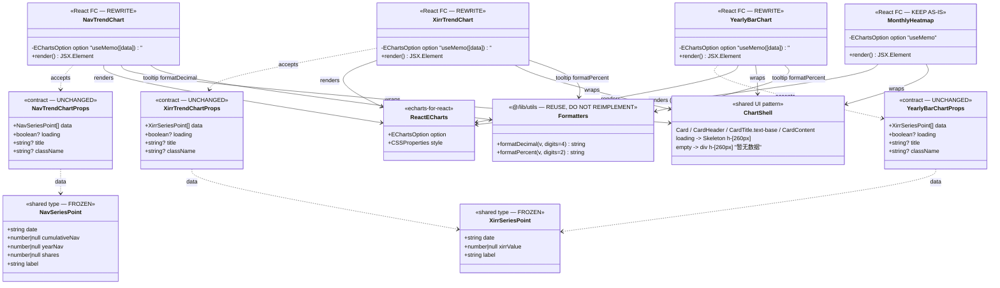
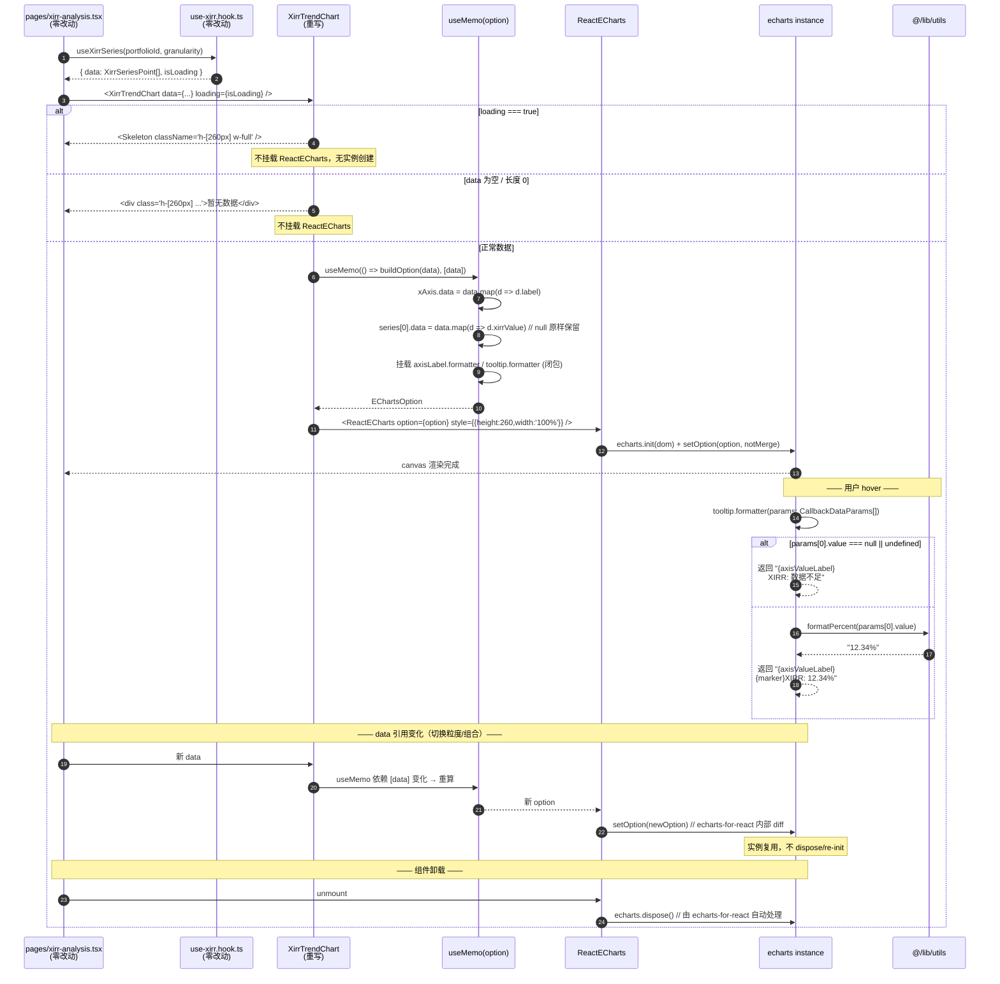
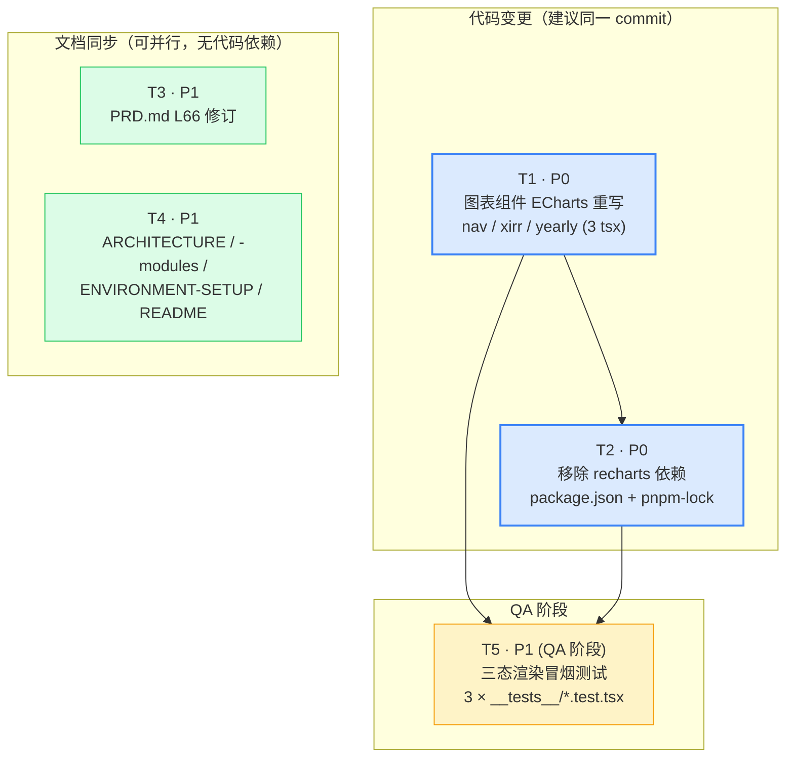

> 本文档已落地·只读，作为架构决策记录（ADR），不再更新

# 增量系统设计：Web 图表库统一为 ECharts（INC-CHART-01~06）

> 架构师：高见远 ｜ 上游输入：许清楚《图表库选型定案增量 PRD》 ｜ 主理人裁决 Q1/Q2/Q3 已收口
> 变更性质：**表现层渲染库替换**，不触碰任何金融计算逻辑与数据口径，不违反 F0 冻结。
> 全部结论均基于本次实际 Read/Grep 现状核实，非记忆推断。

---

## 0. 现状核实结论（先于设计）

### 0.1 引用面核实（Grep 全仓 `recharts|Recharts`）

| 类别 | 位置 | 处理 |
|------|------|------|
| 代码（运行时依赖） | `packages/web/src/components/charts/{nav-trend-chart,xirr-trend-chart,yearly-bar-chart}.tsx` | ✅ 重写 |
| 依赖声明 | `packages/web/package.json:37`（`"recharts": "^3.10.1"`） | ✅ 删除 |
| 锁文件 | `pnpm-lock.yaml:207 / 3980 / 9009` | ✅ `pnpm install` 重生成 |
| 文档（必改） | `docs/PRD.md:66`、`docs/ARCHITECTURE.md:67/236/237/332/1434/1440-1442/1696/1697/1703/1899`、`docs/ARCHITECTURE-modules.md:21/748`、`docs/ENVIRONMENT-SETUP.md:136` | ✅ 修订 |
| **文档（PM 遗漏，新增）** | **`README.md:32`**：`\| 图表 \| Recharts 2（基础）+ ECharts 5（热力图等复杂图） \|` | ⚠️ **必须补入 T4** |
| 文档（历史存档，不改） | `docs/archive/PRD.md:345`、`docs/技术栈评审报告.md:13/31/92/111` | ❌ 保持原样（历史评审记录，本次决策的**依据**，改了反而失真） |
| 文档（低优先，建议加状态） | `docs/ARCHITECTURE-modules.md:852`（U-05 历史待决项） | 🔸 可选：追加「已由 INC-CHART-01 收敛为 ECharts 单库」 |
| 其他端（不改） | `packages/harmonyos/.../LineChart.ets:11` 注释「HarmonyOS 无 Recharts/ECharts」 | ❌ 事实陈述，且 harmonyos 不在本阶段交付范围 |

**结论**：PM「引用面已封闭」判断**成立**，但文档清单**漏了 `README.md:32`**。已补。

### 0.2 三项关键现状发现（影响实现方案，PM/主理人未覆盖）

| # | 发现 | 影响 |
|---|------|------|
| **F-1** | `ARCHITECTURE.md:1434` 的「Chart \| shadcn/ui 图表封装（底层 Recharts）」**确认为虚构**：`ls packages/web/src/components/ui/` 共 15 个组件，**无 `chart.tsx`** | 支持主理人 Q2 裁决，直接删行 |
| **F-2** | `ARCHITECTURE.md:1696/1697/1703` 记录的路径 `features/dashboard/nav-trend-chart.tsx`、`features/analysis/yearly-bar-chart.tsx` **与实际不符**，实际全部在 `components/charts/` | 已存在的文档漂移，本次顺带修正路径（否则改完库名路径还是错的） |
| **F-3** | PM 给的类型契约与 `packages/shared/src/types/` 实际定义**不一致**：`date` 为**必填**非可选；`NavSeriesPoint` 还有**必填** `shares: number \| null` 字段 | 影响 QA 构造 mock 数据，见 §3.2 |

### 0.3 视觉基线的一处重要修正（决定实现细节）

主理人视觉基线中「网格虚线 / 轴标签 fontSize 12」隐含"跟随主题"。**实测代码分析结论：现状 Recharts 的 `className="stroke-muted"` 与 `className="text-muted-foreground"` 均未生效**：

- `CartesianGrid className="stroke-muted"` → class 加在 `<g>` 上，子 `<line>` 自带 `stroke="#ccc"` presentation attribute，父级继承值不覆盖子元素自身属性 → **实际渲染 `#ccc`**
- `XAxis/YAxis className="text-muted-foreground"` → Tailwind `text-*` 设的是 CSS `color`，SVG `<text>` 上色靠 `fill`，且 Recharts tick 自带 `fill="#666"` → **实际渲染 `#666`**

**推论（对本次极其有利）**：现状图表的网格/轴色**本来就不跟随 dark 模式**。因此 ECharts 迁移直接硬编码 `#ccc` / `#666` 即可达成**像素级等价**，且**不引入任何 dark 模式回归**。无需为主题适配做任何额外设计。（Tooltip 例外，见 §7.4）

---

## 1. 实现方案与框架选型

### 1.1 选型确认

| 项 | 决策 | 版本 | 理由 |
|----|------|------|------|
| 图表渲染库 | **ECharts** | `echarts@^5.5.0`（已在 deps） | 单库覆盖折线/柱状/热力图；大数据量时序（PRD 5 年日维度 ~1800 点）性能优于 Recharts；已在 `monthly-heatmap` 生产验证 |
| React 封装 | **echarts-for-react** | `^3.0.2`（已在 deps） | 已使用中；`ReactECharts` 内置 resize observer + option 浅比较更新，无需自行管理实例生命周期 |
| 被移除 | ~~recharts~~ | ~~`^3.10.1`~~ | 双图表库冗余（`docs/技术栈评审报告.md:31` 早已指出）；打包体积重复；两套 API 心智负担 |

### 1.2 为什么直接沿用 `monthly-heatmap` 范式（而非另起封装）

`monthly-heatmap.tsx` 已是本仓库唯一的 ECharts 生产实现，其范式为：

```
Card 外壳
  └─ CardHeader / CardTitle(text-base) {title}
  └─ CardContent
       ├─ loading      → <Skeleton className="h-[N]px w-full" />
       ├─ 空数据       → <div className="flex h-[N]px items-center justify-center text-sm text-muted-foreground">暂无数据</div>
       └─ 正常         → <ReactECharts option={option} style={{ height: N, width: '100%' }} />

option 由组件内 useMemo(() => ({...}), [deps]) 就地构造
```

**采用理由（4 条）**：

1. **三态结构与现有 3 个 Recharts 组件完全同构** — Card/Skeleton/空态文案/高度写法一模一样，迁移只需替换 `<ResponsiveContainer>...</ResponsiveContainer>` 这一个分支，Card 外壳、loading、空态**零改动**，把 diff 面压到最小。
2. **仓库内已有唯一范式，不制造第二套** — 若为本次迁移新建 `chart-option-builder.ts` 之类的抽象层，`monthly-heatmap` 不会跟着改，仓库将同时存在"内联 useMemo"和"builder 封装"两套写法，属于典型过度设计与范式分裂。
3. **零新增依赖** — 满足 AC-8。
4. **AC-5 天然满足** — 组件对外只暴露 `Props`，内部换库对调用方完全透明，三个 page 无需任何改动。

### 1.3 迁移映射总表（Recharts → ECharts）

| Recharts 写法 | ECharts 对应 | 备注 |
|---------------|--------------|------|
| `<ResponsiveContainer width="100%" height={260}>` | `<ReactECharts style={{ height: 260, width: '100%' }} />` | echarts-for-react 自带 autoResize |
| `<LineChart data={data}>` + `dataKey="label"` | `xAxis: { type:'category', data: data.map(d => d.label) }` | ECharts 需显式拆列 |
| `<Line dataKey="cumulativeNav" />` | `series[i].data = data.map(d => d.cumulativeNav)` | 值为 `null` 直接传 `null` |
| `type="monotone"` | `smooth: true` | 曲线插值算法不同（三次单调 vs 贝塞尔），视觉近似，属**可接受容差 TOL-2** |
| `strokeWidth={2}` | `lineStyle: { width: 2 }` | 等价 |
| `dot={false}` | `showSymbol: false` | 等价 |
| `activeDot={{ r: 4 }}` | `symbolSize: 8` + `emphasis: { scale: false }` | ⚠️ **见 §7.3，主理人给的 `emphasis:{scale:true,symbolSize:8}` 会导致 hover 点被再放大 1.4x，超过 r=4** |
| `connectNulls` | `connectNulls: true` | 等价 |
| `<CartesianGrid strokeDasharray="3 3" />` | `xAxis.splitLine` + `yAxis.splitLine`：`{ show:true, lineStyle:{ type:[3,3], color:'#ccc' } }` | ⚠️ ECharts value 轴默认只有横向 splitLine，**category 轴 splitLine 需显式 `show:true`** 才等价于 Recharts 的横竖双向网格 |
| `tick={{ fontSize: 12 }}` | `axisLabel: { fontSize: 12, color: '#666' }` | 见 §0.3 |
| `tickFormatter={(v) => ...}` | `axisLabel.formatter: (v) => ...` | 等价 |
| `<Tooltip formatter={...} contentStyle={...} />` | `tooltip: { trigger:'axis', formatter, backgroundColor:'transparent', borderWidth:0, extraCssText }` | ⚠️ 入参结构完全不同，见 §7.5 |
| `<Legend wrapperStyle={{fontSize:12}} />` | `legend: { bottom:0, textStyle:{ fontSize:12 } }` + `grid.bottom` 留白 | 仅 NavTrendChart |
| `<Bar radius={[4,4,0,0]} />` | `series.itemStyle.borderRadius: [4,4,0,0]` | 等价 |
| `<Cell fill={...} />` 逐柱着色 | `itemStyle.color: (params) => ...` 回调 | 见 §7.2 |
| `margin={{top:5,right:20,bottom:5,left:0}}` | `grid: { top, right, bottom, left, containLabel: true }` | 用 `containLabel:true` 自动容纳轴标签，无需手算 left |

---

## 2. 文件列表（相对仓库根）

### 2.1 代码文件

| # | 路径 | 动作 | 说明 |
|---|------|------|------|
| 1 | `packages/web/src/components/charts/nav-trend-chart.tsx` | **重写** | Recharts 双线 → ECharts 双线（含图例） |
| 2 | `packages/web/src/components/charts/xirr-trend-chart.tsx` | **重写** | Recharts 单线 → ECharts 单线 |
| 3 | `packages/web/src/components/charts/yearly-bar-chart.tsx` | **重写** | Recharts 柱状 → ECharts 柱状（逐柱着色） |
| 4 | `packages/web/src/components/charts/monthly-heatmap.tsx` | **保留（0 改动）** | 统一范式基准，作为实现参照物 |
| 5 | `packages/web/src/components/charts/stat-card.tsx` | **保留（0 改动）** | 非图表库相关 |
| 6 | `packages/web/package.json` | **改** | 删第 37 行 `"recharts": "^3.10.1",` |
| 7 | `pnpm-lock.yaml` | **改（自动生成）** | `pnpm install` 重生成，禁止手改 |

**零改动（AC-5 验收锚点）**：
`packages/web/src/pages/dashboard.tsx`（L23-24, L371, L376）、`packages/web/src/pages/nav-analysis.tsx`（L31-32, L154, L161）、`packages/web/src/pages/xirr-analysis.tsx`（L31-32, L120, L128）
`packages/web/src/lib/utils.ts`、`packages/shared/src/types/{nav,xirr}.ts`、`packages/web/vite.config.ts`、`packages/web/vitest.config.ts`

### 2.2 文档文件

| # | 路径 | 修订点（行号为核实值） |
|---|------|------------------------|
| 8 | `docs/PRD.md` | L66 §1.1 技术栈表 |
| 9 | `docs/ARCHITECTURE.md` | L67 / L236-237 / L332 / **L1434（删虚构行）** / L1440-1442 / **L1696-1697、L1703（顺带修正错误路径）** / L1899 |
| 10 | `docs/ARCHITECTURE-modules.md` | L21 / L748 /（可选 L852） |
| 11 | `docs/ENVIRONMENT-SETUP.md` | L136 |
| 12 | **`README.md`** | **L32（PM 遗漏项，架构师补入）** |

### 2.3 QA 阶段测试文件（T5，本次仅声明，不实现）

| # | 路径 | 说明 |
|---|------|------|
| 13 | `packages/web/src/components/charts/__tests__/nav-trend-chart.test.tsx` | 三态冒烟 |
| 14 | `packages/web/src/components/charts/__tests__/xirr-trend-chart.test.tsx` | 三态冒烟 |
| 15 | `packages/web/src/components/charts/__tests__/yearly-bar-chart.test.tsx` | 三态冒烟 |

> 目录约定沿用仓库既有 `__tests__/` 惯例（参照 `src/pages/__tests__/settings.test.tsx`、`src/features/transaction/__tests__/`）。
> ⚠️ jsdom 无 Canvas，ECharts 直接渲染会抛错 — 见 §7.6 必读。

---

## 3. 数据结构与接口（**契约冻结：0 变更**）

### 3.1 对外契约（P0 硬性，不得改动任何一个字符）

```ts
// nav-trend-chart.tsx
export interface NavTrendChartProps  { data: NavSeriesPoint[];  loading?: boolean; title?: string; className?: string }
export function NavTrendChart(props: NavTrendChartProps): JSX.Element   // default title = '净值趋势'

// xirr-trend-chart.tsx
export interface XirrTrendChartProps { data: XirrSeriesPoint[]; loading?: boolean; title?: string; className?: string }
export function XirrTrendChart(props: XirrTrendChartProps): JSX.Element // default title = 'XIRR 趋势'

// yearly-bar-chart.tsx
export interface YearlyBarChartProps { data: XirrSeriesPoint[]; loading?: boolean; title?: string; className?: string }
export function YearlyBarChart(props: YearlyBarChartProps): JSX.Element // default title = '年度 XIRR 对比'
```

- 均为 **named export**（非 default），与现状一致，调用方 `import { NavTrendChart } from '@/components/charts/nav-trend-chart'` 保持可用。
- 内部私有的 `EmptyState()` 函数可保留（各文件内部实现细节，非契约）。

### 3.2 上游类型（`@investment-tracker/shared`，**不得修改**）

> ⚠️ **修正 PM 契约描述**（发现 F-3）：以下为 `packages/shared/src/types/` **实际定义**，`date` 必填，`NavSeriesPoint` 多一个必填 `shares`。工程师/QA 构造 mock 数据时以此为准，否则 `tsc -b` 会报错。

```ts
// packages/shared/src/types/nav.ts:48
export interface NavSeriesPoint {
  date: string;                  // 必填（非 date?）
  cumulativeNav: number | null;
  yearNav: number | null;
  shares: number | null;         // 必填，图表不使用但类型要求存在
  label: string;
}

// packages/shared/src/types/xirr.ts:41
export interface XirrSeriesPoint {
  date: string;                  // 必填（非 date?）
  xirrValue: number | null;
  label: string;
}
```

### 3.3 组件内部结构（类图）

见 `docs/class-diagram-echarts.mermaid`。



---

## 4. 程序调用流程

见 `docs/sequence-diagram-echarts.mermaid`。



> `NavTrendChart`（双 series + legend）与 `YearlyBarChart`（bar + itemStyle 回调）流程同构，仅 §5 表格中的差异项不同。

---

## 5. 三组件 option 规格差异表（实现验收对照）

| 维度 | NavTrendChart | XirrTrendChart | YearlyBarChart |
|------|---------------|----------------|----------------|
| 默认 title | `净值趋势` | `XIRR 趋势` | `年度 XIRR 对比` |
| series 类型 | `line` × 2 | `line` × 1 | `bar` × 1 |
| series name | `累计净值` / `当年净值` | `XIRR` | `XIRR` |
| 取值字段 | `cumulativeNav` / `yearNav` | `xirrValue` | `xirrValue` |
| 颜色 | `hsl(217, 91%, 60%)` / `hsl(142, 71%, 45%)` | `hsl(217, 91%, 60%)` | itemStyle 回调，见 §7.2 |
| 线宽 | `lineStyle.width: 2` | `lineStyle.width: 2` | — |
| 圆角 | — | — | `itemStyle.borderRadius: [4,4,0,0]` |
| 常驻点 | `showSymbol: false` | `showSymbol: false` | — |
| hover 点 | `symbolSize: 8` + `emphasis:{scale:false}` | 同左 | `emphasis` 默认即可 |
| `connectNulls` | `true` | `true` | —（bar 无此概念） |
| `smooth` | `true` | `true` | — |
| xAxis.boundaryGap | `false`（折线贴轴，对齐 Recharts） | `false` | `true`（柱居中，ECharts 默认） |
| yAxis.axisLabel.formatter | `(v) => v.toFixed(2)` | `` (v) => `${(v*100).toFixed(0)}%` `` | `` (v) => `${(v*100).toFixed(0)}%` `` |
| tooltip 数值格式 | `formatDecimal(v, 4)` | `formatPercent(v)` | `formatPercent(v)` |
| legend | ✅ `bottom:0, textStyle:{fontSize:12}` | ❌ 不配置 | ❌ 不配置 |
| grid | `{ left:8, right:20, top:10, bottom:28, containLabel:true }`（为 legend 留 bottom） | `{ left:8, right:20, top:10, bottom:5, containLabel:true }` | 同 XirrTrendChart |
| 画布高度 | `260` | `260` | `260` |

---

## 6. 依赖包清单

### 6.1 删除

```
recharts@^3.10.1        （packages/web/package.json dependencies）
```

### 6.2 保留（已存在，版本不动）

```
echarts@^5.5.0           — ECharts 核心
echarts-for-react@^3.0.2 — React 封装（ReactECharts）
```

### 6.3 新增

**无。严格 0 新增依赖（AC-8）。**

- ❌ 不引入 `@types/echarts`（echarts 5 自带类型）
- ❌ 不引入 `canvas` / `jest-canvas-mock`（QA 用 `vi.mock` 解决，见 §7.6）
- ❌ 不引入任何 ECharts 主题包 / option 构造工具库

### 6.4 副作用预期

`pnpm-lock.yaml` 将移除 `recharts@3.10.1` 及其独占传递依赖（`victory-vendor`、`d3-*` 系列、`react-smooth`、`redux`/`@reduxjs/toolkit` 等，若无其他包引用）。**这是预期收益（打包体积下降），不是异常**。工程师需在 PR 描述中说明 lock 文件行数变化原因。

---

## 7. 共享知识（跨文件强制约定 — 本节为工程师最高优先级参考）

### 7.1 ⚠️ 颜色语法：**必须从空格语法改为逗号语法**（头号坑点）

**问题**：现状 Recharts 使用 CSS Color Level 4 的**空格分隔** `hsl()` 语法：`hsl(217 91% 60%)`。这在浏览器 CSS/SVG 中有效，但 ECharts 的颜色解析器 **zrender `tool/color.js`** 使用的是 **逗号分隔正则**，对空格语法**解析失败并返回 `null`**，后果是系列被渲染成 ECharts 调色板默认色或不渲染 —— 且**不报错**，属静默失败。

**强制约定**：三个组件中所有颜色**一律改为逗号语法**，并在常量旁注释 hex 等价值：

```ts
// 各组件文件顶部 module-level 常量（不新建文件）
const COLOR_CUMULATIVE = 'hsl(217, 91%, 60%)'; // ≈ #3b82f6，原 Recharts hsl(217 91% 60%)
const COLOR_YEAR       = 'hsl(142, 71%, 45%)'; // ≈ #22c55e，原 Recharts hsl(142 71% 45%)
const COLOR_POSITIVE   = 'hsl(142, 71%, 45%)';
const COLOR_NEGATIVE   = 'hsl(0, 84%, 60%)';   // ≈ #ef4444
```

**为什么选逗号 hsl 而不是 hex**：数值与原 Recharts **100% 一致**，code review 时 diff 可逐字符审计"视觉等价"；转 hex 会引入 ±1 的舍入（如 `hsl(217,91%,60%)` 精确值为 `#3c83f6` 而非 `#3b82f6`），给"逐项等价"验收留下争议口实。

**中性色（网格/轴/文字）直接用 hex**（依据 §0.3 的现状实测）：

```ts
const GRID_COLOR = '#ccc';  // 对应 Recharts CartesianGrid 实际渲染色
const AXIS_COLOR = '#666';  // 对应 Recharts 轴线/tick 实际渲染色
```

### 7.2 ⚠️ CSS 变量在 ECharts canvas 中**无法解析**

`hsl(var(--muted-foreground))` 这类写法，在 Recharts（SVG，浏览器解析）有效，在 **ECharts canvas 中完全无效**（zrender 不读取 CSS 自定义属性）。

**涉及位置**：`yearly-bar-chart.tsx:81` 空值柱颜色。

**架构判断**：该分支实际是**死代码** —— Recharts 中 `xirrValue === null` 时柱高为空，柱形根本不绘制，`<Cell fill>` 从未生效；ECharts 中 `data` 传 `null` 同样不绘制图形。

**约定**（保留语义 + 消除无效写法）：

```ts
itemStyle: {
  borderRadius: [4, 4, 0, 0],
  // 逐柱着色：等价于 Recharts <Cell fill={...} />
  color: (params) => {
    const v = data[params.dataIndex]?.xirrValue;
    if (v === null || v === undefined) return COLOR_MUTED; // 分支保留，实际不可见（null 值不绘制柱）
    return v >= 0 ? COLOR_POSITIVE : COLOR_NEGATIVE;
  },
}
// const COLOR_MUTED = '#94a3b8';  // 替代原 hsl(var(--muted-foreground))，ECharts 不解析 CSS 变量
```

> 注意：`params.dataIndex` 取原始 `data` 数组下标，闭包捕获 `data` — 因此 `useMemo` 依赖必须包含 `data`。

### 7.3 ⚠️ hover 点尺寸：**不要用 `emphasis: { scale: true }`**

Recharts `activeDot={{ r: 4 }}` = hover 时显示**半径 4（直径 8）**的点。

ECharts 中 `symbolSize` 是**直径**，`emphasis.scale` 默认为 `true` 且放大系数约 **1.4x**。若按主理人给的 `emphasis: { scale: true, symbolSize: 8 }`，hover 点实际直径 ≈ 11.2（半径 5.6），**大于基线**。

**正确写法**：

```ts
showSymbol: false,          // 对应 dot={false}
symbolSize: 8,              // 直径 8 = 半径 4，对应 activeDot={{ r: 4 }}
emphasis: { scale: false }, // 关闭额外放大，锁死 r=4
```

### 7.4 Tooltip 样式：用 `extraCssText` 保住 CSS 变量（唯一需保留主题联动之处）

原 Recharts `contentStyle` 用了 `hsl(var(--popover))` 等 CSS 变量，且 Recharts tooltip 是 **HTML div**，变量由浏览器解析 → **现状 tooltip 是跟随 dark 模式的**（与 §0.3 的网格/轴不同）。

ECharts tooltip 默认 `renderMode: 'html'`，同样是 DOM 元素，因此可通过 `extraCssText` **保住主题联动**：

```ts
tooltip: {
  trigger: 'axis',
  backgroundColor: 'transparent',  // 让位给 extraCssText
  borderWidth: 0,
  padding: 0,
  textStyle: { fontSize: 12 },
  extraCssText:
    'background: hsl(var(--popover));' +
    'border: 1px solid hsl(var(--border));' +
    'border-radius: 6px;' +
    'color: hsl(var(--popover-foreground));' +
    'padding: 8px 12px;' +
    'box-shadow: none;',
  formatter: /* 见 7.5 */,
}
```

⚠️ `extraCssText` 内是标准 CSS 字符串（浏览器解析），**这是本次唯一允许出现 `var(--xxx)` 的地方**；`option` 中其他任何 canvas 绘制属性（series color / axisLabel.color / splitLine.color）**一律禁止使用 CSS 变量**。

### 7.5 ⚠️ Tooltip formatter 入参结构与 Recharts 完全不同

**Recharts**：`formatter(value, name) => [displayValue, displayName]`，逐 series 调用，返回数组。
**ECharts（`trigger: 'axis'`）**：`formatter(params) => string | HTMLString`，**一次性传入该 x 位置全部 series 的数组**，返回**完整 HTML 字符串**（含 x 轴标签行）。

`params` 元素关键字段：`axisValueLabel`（x 轴标签文本）、`seriesName`、`value`（可能为 `null`）、`marker`（彩色圆点 HTML 片段）、`dataIndex`。

**约定写法（单 series，XirrTrendChart / YearlyBarChart）**：

```ts
formatter: (params) => {
  const arr = Array.isArray(params) ? params : [params];
  const p = arr[0];
  const v = p.value;
  const text = (v === null || v === undefined) ? '数据不足' : formatPercent(Number(v));
  return `${p.axisValueLabel}<br/>${p.marker}XIRR: ${text}`;
}
```

**约定写法（双 series，NavTrendChart）**：

```ts
formatter: (params) => {
  const arr = Array.isArray(params) ? params : [params];
  const head = arr[0]?.axisValueLabel ?? '';
  const lines = arr.map((p) => {
    const v = p.value;
    const text = (v === null || v === undefined) ? '数据不足' : formatDecimal(Number(v), 4);
    return `${p.marker}${p.seriesName}: ${text}`;
  });
  return [head, ...lines].join('<br/>');
}
```

**硬性要求**：
- 数值格式化**必须**调用 `@/lib/utils` 的 `formatPercent` / `formatDecimal`，**禁止**在组件内自行写 `toFixed` 拼接（仅 **轴标签 formatter** 例外 —— 原 Recharts `tickFormatter` 本就是内联 `toFixed`，保持等价）。
- `null` 判定必须同时覆盖 `null` 与 `undefined`（`formatPercent(null)` 返回 `'-'` 而非 `'数据不足'`，因此**必须在调用前拦截**，不能依赖 utils 的空值兜底）。

### 7.6 ⚠️ QA 必读：jsdom 无 Canvas，ECharts 直接渲染会崩

`packages/web/vitest.config.ts` 使用 `environment: 'jsdom'`。jsdom **未实现 `HTMLCanvasElement.getContext()`**，`echarts.init()` 会抛错或产生 `Not implemented` 噪音。

> 说明：现状 `monthly-heatmap.tsx` 已用 ECharts 但**无对应测试**，所以此问题从未暴露。T5 新增 3 个测试后**必然触发**。

**约定方案（0 新增依赖）**：在各测试文件顶部 mock 掉渲染层，只验证三态 DOM 结构与 option 结构：

```ts
vi.mock('echarts-for-react', () => ({
  default: (props: { option: unknown }) =>
    <div data-testid="echarts-mock" data-option={JSON.stringify(props.option)} />,
}));
```

**禁止**为此引入 `canvas` / `jest-canvas-mock` 依赖（违反 AC-8）。

**三态冒烟用例最小集**（每组件 3 条，共 9 条）：
1. `loading={true}` → 断言 Skeleton 存在、`echarts-mock` **不存在**
2. `data={[]}` → 断言「暂无数据」文案存在、`echarts-mock` **不存在**
3. 正常数据（**必须含 1 个 `null` 值点**）→ 断言 `echarts-mock` 存在、title 文案正确、不抛错

> mock 数据构造须符合 §3.2 的**真实类型**（`date` 必填、`NavSeriesPoint` 含 `shares`）。

### 7.7 是否抽公共 helper —— **决策：不抽，各组件内联**

| 方案 | 评估 |
|------|------|
| A. 新建 `charts/echarts-preset.ts`（颜色常量 + baseOption 工厂 + formatter 工具） | ❌ **否决** |
| B. **各组件文件内 module-level 常量 + 内联 `useMemo` 构造 option** | ✅ **采纳** |

**否决 A 的 4 条理由**：
1. **范式分裂**：`monthly-heatmap.tsx` 是内联范式且本次 0 改动。抽 helper 后仓库将同时存在两套 ECharts 写法，比"统一图表库"这个目标本身造成的心智负担更大 —— 与本次需求初衷相悖。
2. **抽象收益低**：三者可复用的仅 4 个颜色常量 + 2 个中性色，而 series 结构（双线/单线/柱）、axis formatter、legend 有无、tooltip 单/多 series 全都不同，"公共 baseOption" 会立刻退化成一堆可选参数的配置函数，比直接写 option 更难读。
3. **扩大 review 与回归面**：本次是**契约冻结的等价迁移**，新增文件意味着 QA 需要额外覆盖该文件，与"最小风险面"原则冲突。
4. **有先例支撑 B**：`yearly-bar-chart.tsx:30-31` 现状就是文件内 `POSITIVE_COLOR` / `NEGATIVE_COLOR` 局部常量，B 方案只是延续既有做法。

**约束**：颜色常量在三个文件中会有少量重复（`hsl(217,91%,60%)` 出现 2 次、`hsl(142,71%,45%)` 出现 2 次）。**这是可接受的重复**（DRY 不适用于跨组件的视觉常量）。若未来图表数量超过 6 个，再另开重构需求，本次不做。

### 7.8 其他统一约定

| 约定 | 内容 |
|------|------|
| 导入方式 | `import ReactECharts from 'echarts-for-react';`（与 monthly-heatmap 一致，全量引入，不做 `echarts/core` 按需注册 —— 按需注册需改动 monthly-heatmap，超出本次范围） |
| 画布尺寸 | `style={{ height: 260, width: '100%' }}`（heatmap 是 320，勿混淆） |
| useMemo 依赖 | 严格 `[data]`；`title` / `className` / `loading` **不进 option**，不得列入依赖 |
| 空值传递 | `data.map(d => d.xirrValue)` 直接传 `null`，**不要**转成 `'-'` 或 `0`（转 0 会造成折线错误下探到 0，属严重视觉失真） |
| 文件头注释 | 各文件首行 JSDoc 中的「（Recharts）」**必须**改为「（ECharts）」 |
| 三态分支 | Card / CardHeader / CardTitle.text-base / CardContent / Skeleton / EmptyState **原样保留，一行不改** |
| 类型标注 | `option` 可不显式标 `EChartsOption`（避免为 formatter 回调参数补类型引发 `tsc` 噪音）；参照 monthly-heatmap 让 TS 推断即可 |

---

## 8. 任务列表（有序，含依赖与验收钩子）

> 依 §0 现状核实，对主理人建议顺序做**一处调整**（见 T1/T2 备注），其余保持。

| ID | 任务 | 改动文件 | 依赖 | 优先级 | 验收钩子 |
|----|------|----------|------|--------|----------|
| **T1** | **图表组件 ECharts 重写** | `charts/nav-trend-chart.tsx`<br/>`charts/xirr-trend-chart.tsx`<br/>`charts/yearly-bar-chart.tsx` | — | **P0** | ① `pnpm --filter web build`（`tsc -b && vite build`）通过<br/>② 三文件内 `grep -c recharts` = 0<br/>③ 导出符号/Props 与 §3.1 逐字符一致<br/>④ 对照 §5 规格表逐项核对<br/>⑤ **`git diff --stat` 中 `src/pages/` 必须为 0 行**（AC-5） |
| **T2** | **移除 recharts 依赖** | `packages/web/package.json`<br/>`pnpm-lock.yaml`（自动） | T1 | **P0** | ① package.json 无 `recharts`<br/>② `pnpm install` 成功且 lock 已更新<br/>③ `pnpm --filter web build` 通过<br/>④ 全仓 `grep -rn recharts --exclude-dir=node_modules packages/` 仅剩 harmonyos 注释 |
| **T3** | **PRD.md 技术栈修订** | `docs/PRD.md`（L66） | — | P1 | 该行分号后片段为 `图表 ECharts（echarts + echarts-for-react，统一图表库）`；表格其余列/行**零改动**（`git diff docs/PRD.md` 应仅 1 行） |
| **T4** | **架构/环境/README 文档同步** | `docs/ARCHITECTURE.md`<br/>`docs/ARCHITECTURE-modules.md`<br/>`docs/ENVIRONMENT-SETUP.md`<br/>**`README.md`** | — | P1 | 见 §9 逐行修订对照表；`grep -rn "Recharts" docs/*.md README.md` 结果仅剩 `技术栈评审报告.md`（历史存档） |
| **T5** | **（QA 阶段）三态渲染冒烟测试** | `charts/__tests__/nav-trend-chart.test.tsx`<br/>`charts/__tests__/xirr-trend-chart.test.tsx`<br/>`charts/__tests__/yearly-bar-chart.test.tsx` | T1, T2 | P1 | `pnpm --filter web test` 全绿；9 条用例（3 组件 × 三态）；必须按 §7.6 mock `echarts-for-react` 且不新增依赖 |

### 8.1 ⚠️ 对主理人建议顺序的一处调整（请裁决）

主理人建议 `T1 删依赖 → T2 改组件`。**架构师建议对调为 `T1 改组件 → T2 删依赖`**，理由：

- 若先删 `recharts`，三个组件的 `import ... from 'recharts'` 立即失效，仓库进入 **`tsc` 断裂的中间态**，`pnpm build` / IDE 全红，无法在迁移过程中做增量验证，也无法安全地"改一个验一个"。
- 反向顺序下，T1 完成时组件已不再 import recharts，此时删依赖是**纯粹的清理动作**，风险为零。
- 主理人原顺序的顾虑（"依赖删干净后类型/构建才干净"）由 **T2 的验收钩子③** 覆盖：删依赖后必须重跑 build 确认，效果等同。

**同时建议**：T1 + T2 **合并为一次 commit**（如 `refactor(web): 图表库统一为 ECharts，移除 recharts`），避免仓库出现"组件已迁移但依赖仍在"的半成品提交。

### 8.2 任务依赖图



> T3 / T4 与 T1 / T2 **无技术依赖，可并行**；但发布前需保证两组同时完成，避免文档与代码短暂不一致。

---

## 9. 文档逐行修订对照表（T3 / T4 实施清单）

### 9.1 `docs/PRD.md`（1 处）

| 行 | 原文（片段） | 新文（片段） |
|----|--------------|--------------|
| 66 | `...+ sonner；图表 Recharts / ECharts \|` | `...+ sonner；图表 ECharts（echarts + echarts-for-react，统一图表库） \|` |

> 表格结构、其余单元格**一律不动**。`git diff` 应恰好 1 行。

### 9.2 `docs/ARCHITECTURE.md`（8 处）

| 行 | 原文 | 新文 |
|----|------|------|
| 67 | `Web: React + shadcn/ui + Recharts/ECharts；APP: ArkUI` | `Web: React + shadcn/ui + ECharts；APP: ArkUI` |
| 236 | `│   │       │   │   ├── nav-trend-chart.tsx  # 净值趋势（Recharts）` | `...# 净值趋势（ECharts）` |
| 237 | `│   │       │   │   └── xirr-trend-chart.tsx # XIRR 趋势（Recharts）` | `...# XIRR 趋势（ECharts）` |
| 332 | `\| **Web 图表** \| Recharts + ECharts \| Recharts ^2.12 + ECharts ^5.5 \| ✅ 确认 \| Recharts 用于折线/柱状（shadcn/ui chart 底层），ECharts 用于月度热力图等复杂图表 \|` | `\| **Web 图表** \| ECharts \| echarts ^5.5 + echarts-for-react ^3.0 \| ✅ 确认（INC-CHART-01 收敛） \| 单库覆盖折线/柱状/热力图，移除 Recharts 避免双库冗余；大数据量时序性能更优 \|` |
| **1434** | `\| Chart \| shadcn/ui 图表封装（底层 Recharts） \|` | **整行删除**（Q2 裁决 + 发现 F-1：`components/ui/` 下无 `chart.tsx`，纯虚构） |
| 1440 | `\| 净值趋势折线图 \| Recharts \| ...` | `\| 净值趋势折线图 \| ECharts \| ...` |
| 1441 | `\| XIRR 趋势折线图 \| Recharts \| ...` | `\| XIRR 趋势折线图 \| ECharts \| ...` |
| 1442 | `\| 年度收益柱状图 \| Recharts \| ...` | `\| 年度收益柱状图 \| ECharts \| ...` |
| 1696 | `\| \`packages/web/src/features/dashboard/nav-trend-chart.tsx\` \| 净值趋势图（Recharts） \|` | `\| \`packages/web/src/components/charts/nav-trend-chart.tsx\` \| 净值趋势图（ECharts） \|` ⚠️**路径同步纠错（F-2）** |
| 1697 | `\| \`packages/web/src/features/dashboard/xirr-trend-chart.tsx\` \| XIRR 趋势图（Recharts） \|` | `\| \`packages/web/src/components/charts/xirr-trend-chart.tsx\` \| XIRR 趋势图（ECharts） \|` ⚠️**路径同步纠错** |
| 1703 | `\| \`packages/web/src/features/analysis/yearly-bar-chart.tsx\` \| 年度柱状图（Recharts） \|` | `\| \`packages/web/src/components/charts/yearly-bar-chart.tsx\` \| 年度柱状图（ECharts） \|` ⚠️**路径同步纠错** |
| 1899 | `  "recharts": "^2.12.0",` | **整行删除** |

> 🔸 附带建议（低优先，可选）：L1704 `features/analysis/monthly-heatmap.tsx` 同属路径错误，可一并纠正为 `components/charts/monthly-heatmap.tsx`。

### 9.3 `docs/ARCHITECTURE-modules.md`（2 必改 + 1 可选）

| 行 | 原文 | 新文 |
|----|------|------|
| 21 | `│  Zustand (状态) + TanStack Query (缓存) + Recharts/ECharts (图表) │` | `│  Zustand (状态) + TanStack Query (缓存) + ECharts (图表)          │` ⚠️**注意保持 ASCII 框图右边框 `│` 对齐**（该行在代码块内，宽度需与上下行一致，用空格补齐） |
| 748 | `- recharts                   — 已有` | **整行删除** |
| 852（可选） | `\| U-05 \| **ECharts 热力图**：... \| 依赖引入 \| Recharts 不自带热力图，建议引入 \`echarts-for-react\`（按需加载，不增加首屏体积） \|` | 末尾追加：`**【INC-CHART-01 更新】已收敛为 ECharts 单库，Recharts 已移除。**` |

### 9.4 `docs/ENVIRONMENT-SETUP.md`（1 处）

| 行 | 原文 | 新文 |
|----|------|------|
| 136 | `- **可视化库**：Recharts（基础图表，shadcn/ui chart 底层）+ ECharts 5.x（热力图等复杂图表，echarts-for-react 封装）` | `- **可视化库**：ECharts 5.x（统一图表库，\`echarts-for-react\` 封装，覆盖折线/柱状/热力图）` |

### 9.5 `README.md`（1 处 — **PM 遗漏，架构师补入**）

| 行 | 原文 | 新文 |
|----|------|------|
| 32 | `\| 图表 \| Recharts 2（基础）+ ECharts 5（热力图等复杂图） \|` | `\| 图表 \| ECharts 5（统一图表库，echarts-for-react 封装） \|` |

### 9.6 **不修改**清单（明确留档，防止工程师误改）

- `docs/技术栈评审报告.md`（L13/31/92/111）—— 历史评审记录，且 L31「同时引入两个图表库是冗余的」正是本次决策依据，改动会破坏决策溯源链
- `docs/archive/PRD.md`（L345）—— archive 归档
- `packages/harmonyos/entry/src/main/ets/components/LineChart.ets`（L11）—— 事实陈述，且 harmonyos 不在本阶段交付范围

---

## 10. 视觉等价验收清单（T1 逐项自检）

| # | 检查项 | 三组件通用 | 判定 |
|---|--------|-----------|------|
| V-01 | Card / CardHeader / CardTitle(`text-base`) / CardContent 外壳 | ✅ | `git diff` 中该段应为 0 改动 |
| V-02 | 画布高度 260px | ✅ | `style={{ height: 260 }}` |
| V-03 | loading → `<Skeleton className="h-[260px] w-full" />` | ✅ | 0 改动 |
| V-04 | 空数据 → `h-[260px] text-sm text-muted-foreground` 居中「暂无数据」 | ✅ | 0 改动 |
| V-05 | 网格**横竖双向**虚线 `#ccc`，dash `[3,3]` | ✅ | ⚠️ 需显式开 `xAxis.splitLine.show = true` |
| V-06 | 轴标签 `fontSize: 12`，色 `#666` | ✅ | — |
| V-07 | `null` 点 tooltip 显示「数据不足」 | ✅ | 需在 formatter 内拦截，勿依赖 utils |
| V-08 | 折线断点 `connectNulls: true` | 折线 ×2 | — |
| V-09 | 默认 title 文案 | 逐组件 | 见 §5 |
| V-10 | 线色 / 柱色逐字符匹配（逗号 hsl） | 逐组件 | 见 §7.1 |
| V-11 | 线宽 2、`showSymbol:false`、hover 直径 8 且不再放大 | 折线 ×2 | 见 §7.3 |
| V-12 | 柱圆角 `[4,4,0,0]`、正绿负红 | YearlyBar | 见 §7.2 |
| V-13 | Y 轴 formatter（`toFixed(2)` / `${(v*100).toFixed(0)}%`） | 逐组件 | 见 §5 |
| V-14 | Tooltip 数值走 `formatDecimal(v,4)` / `formatPercent(v)` | 逐组件 | 禁止自行实现 |
| V-15 | 图例：仅 NavTrendChart 有，`fontSize: 12` | NavTrend | — |
| V-16 | Tooltip 背景/边框跟随 popover 主题 | ✅ | 见 §7.4 `extraCssText` |

### 10.1 已知可接受容差（提前登记，避免 QA 误判为缺陷）

| ID | 容差 | 说明 |
|----|------|------|
| **TOL-1** | 曲线插值算法 | Recharts `type="monotone"`（单调三次样条） vs ECharts `smooth: true`（贝塞尔）。折线整体走势一致，局部曲率有肉眼几乎不可辨的差异。属渲染引擎固有差异，**不可消除**（除非改 `smooth: false` 用折线，但那与基线偏离更大）。 |
| **TOL-2** | 轴线/刻度线细节 | ECharts value 轴默认无 axisLine、category 轴默认有 axisTick，与 Recharts 默认略有出入。若需严格对齐可显式配 `axisLine`/`axisTick`，但视觉影响极小。 |
| **TOL-3** | Tooltip 触发区与动画 | Recharts 为 SVG hover + cursor 矩形，ECharts 为 axisPointer。触发灵敏度与过渡动画不同，属库固有行为。 |
| **TOL-4** | 网格/轴色在 dark 模式下不跟随主题 | **非本次引入的回归** —— 依 §0.3 实测，现状 Recharts 同样固定为 `#ccc`/`#666`。迁移保持现状。若需图表全面适配 dark，另开需求。 |

---

## 11. 待明确事项

| ID | 事项 | 现状 | 架构师建议 | 需谁裁决 |
|----|------|------|-----------|---------|
| **UNC-1** | **`README.md:32` 为 PM 文档清单遗漏项**，是否纳入本次 T4 | Grep 实证存在 | **建议纳入**。Q1 裁决的初衷是"避免文档漂移"，漏掉 README（项目门面文档）等于目标未达成。改动仅 1 行，成本为零。 | **主理人** |
| **UNC-2** | **T1/T2 执行顺序**：主理人原建议「先删依赖后改组件」 | — | **建议对调为「先改组件后删依赖」并合并为一次 commit**，理由见 §8.1（避免 `tsc` 断裂中间态） | **主理人** |
| **UNC-3** | PM 契约中 `date?: string` 与 shared 实际 `date: string`（必填）、`NavSeriesPoint.shares` 必填字段不符 | 已核实 shared 源码 | **以 shared 源码为准**（§3.2）。不属于契约变更，仅是 PM 转述精度问题，无需回改 PRD；但 T5 构造 mock 时必须按真实类型，否则 `tsc` 报错。 | 已自行收口，仅知会 |
| **UNC-4** | `ARCHITECTURE.md:1696/1697/1703` 路径错误（`features/*` vs 实际 `components/charts/`） | 已核实为存量漂移 | **建议本次顺带纠正**（§9.2）。同一行本来就要改库名，顺手改路径边际成本为零；不改则留下"改了一半仍是错的"文档。 | **主理人** |
| **UNC-5** | 是否做 ECharts 按需引入（`echarts/core` + 手动 register）以优化体积 | 现状 monthly-heatmap 全量 import | **本次不做**。会连带改动"0 改动"的 monthly-heatmap，扩大风险面且超出增量范围。移除 recharts 已带来可观体积收益，按需引入可另开优化需求。 | 已自行收口，仅知会 |

> 除上述 5 项外：**无其他待明确事项**。§1–§10 的设计与约定已可支撑工程师直接实施。

---

**附件**
- `docs/class-diagram-echarts.mermaid`
- `docs/sequence-diagram-echarts.mermaid`
