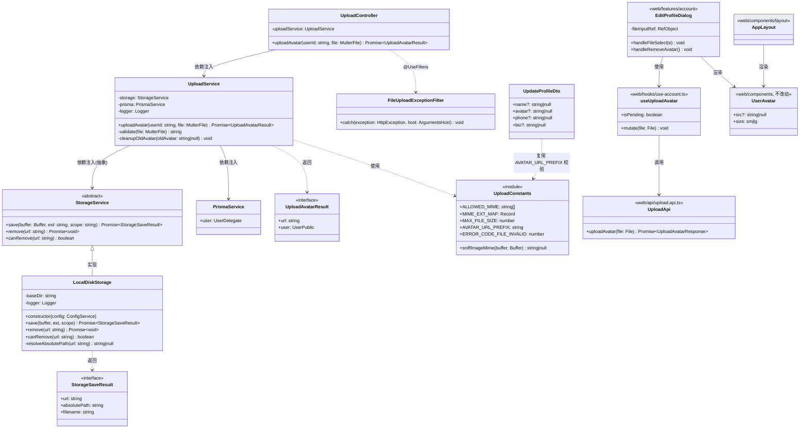
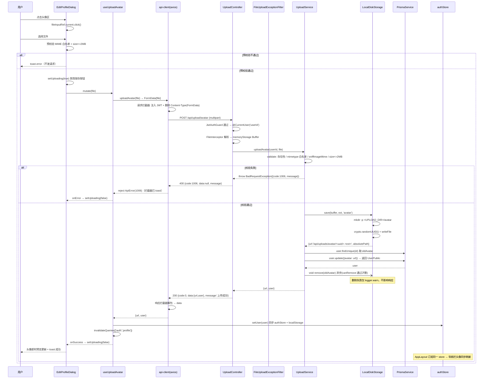
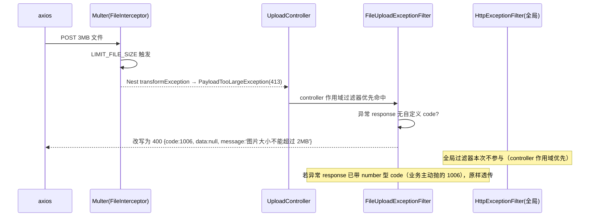
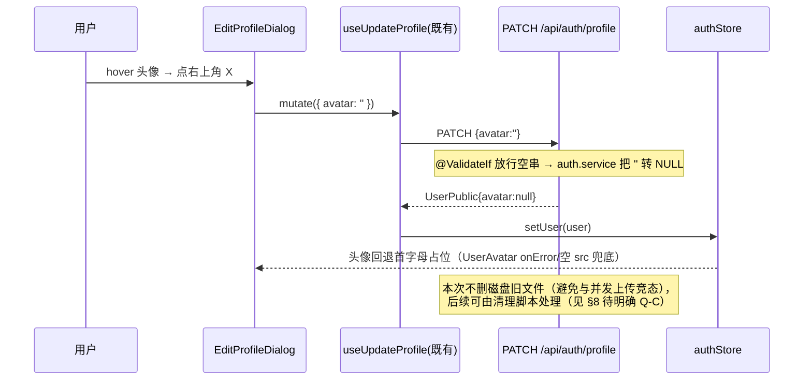
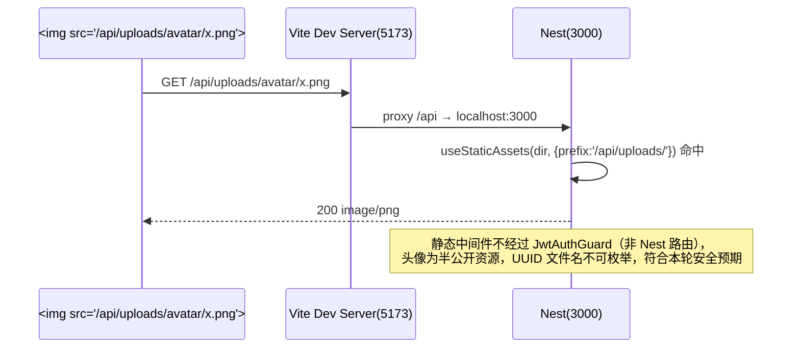
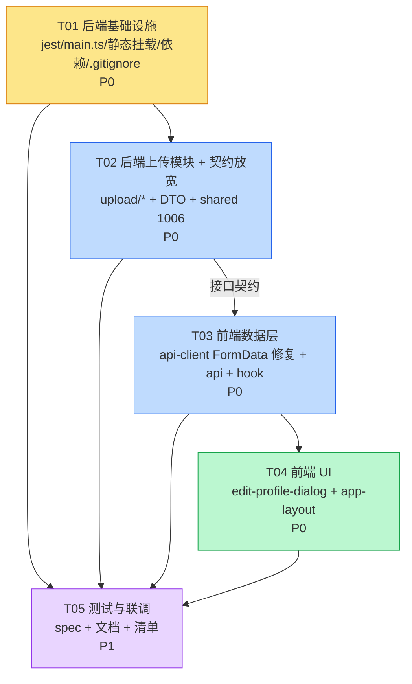

> 本文档已落地·只读，作为架构决策记录（ADR），不再更新

# 增量架构设计 — K2 配置修复 + AC-11 头像上传 + AC-15 导航栏头像

> 版本：v1.0（增量设计，仅覆盖本次变更，不重做已交付内容）
> 架构师：高见远（Gao）
> 上游输入：增量 PRD（Alice）+ 已确认决策 Q1–Q7
> 代码基线：已实读 `main.ts` / `app.module.ts` / `update-profile.dto.ts` / `http-exception.filter.ts` / `transform.interceptor.ts` / `current-user.decorator.ts` / `api-client.ts` / `auth.store.ts` / `edit-profile-dialog.tsx` / `app-layout.tsx` / `user-avatar.tsx` / `jest.config.js` / `vite.config.ts` / axios 1.18.1 源码

---

## 0. 实读代码后的三处「PRD 修正」（必须先看）

| # | PRD/任务书原文 | 实读代码结论 | 影响 |
|---|---|---|---|
| **M1** | 「从 JWT `req.user.id` 取」 | `current-user.decorator.ts` 定义 `AuthenticatedUser = { userId: string; email: string }`，**字段名是 `userId` 不是 `id`**；现有控制器统一写 `user.userId` | 上传控制器必须用 `@CurrentUser('userId') userId: string`，否则拿到 `undefined` |
| **M2** ⚠️ | 「FormData，不手动设 Content-Type」 | `api-client.ts` 在 `axios.create()` 里**实例级写死了 `headers: {'Content-Type': 'application/json'}`**；axios 1.18.1 `transformRequest` 逻辑：`if (isFormData) return hasJSONContentType ? JSON.stringify(formDataToJSON(data)) : data;` → **FormData 会被静默序列化成 JSON 字符串**，后端 multer 收不到任何文件，必现 1006 | **阻断级**。必须在 `api-client.ts` 请求拦截器中对 FormData 删除 Content-Type（拦截器早于 transformRequest 执行）。`api-client.ts` 由此成为本次**必改文件**（PRD 文件清单里没有它） |
| **M3** | 「大小 ≤2MB → 400 + 1006」 | Nest `FileInterceptor` 把 multer `LIMIT_FILE_SIZE` 转成 `PayloadTooLargeException`(**413**)；而 `http-exception.filter.ts` 的 `resolveErrorCode` switch 里**没有 413 分支 → 落到 default 返回 5000** | 必须加一个 controller 作用域的 `FileUploadExceptionFilter`，把上传端点的所有 `HttpException`（无自定义 code 的）统一改写为 400 + 1006 |

> M2/M3 若不处理，AC-11 无论前后端代码写得多对都跑不通。

---

## Part A：系统设计

### 1. 实现方案与框架选型

#### 1.1 技术选型结论：**零新增运行时依赖**

| 能力 | 选型 | 说明 |
|---|---|---|
| multipart 解析 | `@nestjs/platform-express` 内置 Multer | 已在 `dependencies`（^10.3.0），无需 `pnpm add` |
| 静态文件服务 | `NestExpressApplication.useStaticAssets()`（底层 `express.static`，platform-express 自带） | 无需 `@nestjs/serve-static` |
| UUID | `crypto.randomUUID()`（Node 18+ 内置） | 无需 `uuid` 包 |
| 文件读写/删除 | `node:fs/promises` | 内置 |
| 类型声明 | `@types/multer` | **唯一新增，devDependency** |
| 前端上传 | 原生 `FormData` + 现有 axios 实例 | 无新增依赖 |

#### 1.2 核心技术难点与对策

| 难点 | 对策 |
|---|---|
| **D1 静态资源前缀** — `setGlobalPrefix('api')` 只作用于 Nest 路由，**不作用于 express 静态中间件**；而 `vite.config.ts` 只代理 `/api`，前端 `API_BASE_URL='/api'` | `useStaticAssets(uploadDir, { prefix: '/api/uploads/' })` — 前缀里**手写 `/api`**，与决策 Q2 的返回 URL 一致 |
| **D2 ValidationPipe 拒绝额外字段** — 全局 `forbidNonWhitelisted:true` | 上传端点**无 `@Body()`、无 DTO、不收任何额外表单字段**，仅 `@UploadedFile()`；userId 从 JWT 取（决策 Q3），天然规避 |
| **D3 大小超限 HTTP 码不符**（见 M3） | controller 作用域 `@UseFilters(FileUploadExceptionFilter)`，统一改写为 400 + 1006 |
| **D4 axios FormData 被 JSON 化**（见 M2） | `api-client.ts` 请求拦截器：`if (config.data instanceof FormData) delete config.headers['Content-Type']` |
| **D5 MIME 可伪造** | 双重校验：`file.mimetype` 白名单 + **magic number 嗅探**（零依赖，读前 12 字节判 JPEG/PNG/WebP）；**扩展名由嗅探结果推导，绝不取 `originalname`**（防路径穿越 / 双扩展名） |
| **D6 未来换云存储** | 抽象 `StorageService` 抽象类 + `LocalDiskStorage` 实现，通过 `STORAGE_DRIVER` 环境变量在 `upload.module.ts` 里用 factory provider 选择（本轮只注册 local，预留 `cos`/`s3` 分支 TODO） |
| **D7 旧文件清理安全** | 只删「站内、路径前缀 `/api/uploads/avatar/`、basename 匹配 `^[0-9a-f-]{36}\.(jpg\|png\|webp)$`」的文件；`void unlink().catch(logger.warn)` 异步 fire-and-forget，失败不影响主流程 |
| **D8 Jest 解析 `.js` 扩展名** — `shared/src/index.ts` 用 `export * from './types/user.js'`（ESM 风格），ts-jest 找不到 `.js` 实体文件 | 在**既有** `moduleNameMapper` 对象内**追加**（非替换）`'^(\\.{1,2}/.*)\\.js$': '$1'` |

#### 1.3 架构模式

沿用既有分层：`Controller（HTTP 边界 / 校验编排）→ Service（业务：校验+落盘+写库+清理）→ StorageService（存储抽象）→ PrismaService（数据）`。
前端沿用 `api（纯 HTTP）→ hooks（TanStack Query mutation + store 同步）→ features/components（UI）`。

---

### 2. 文件列表（相对仓库根目录）

#### 2.1 新增文件（7 个，全部后端 + 1 前端 api）

| 路径 | 职责 |
|---|---|
| `packages/backend/src/modules/upload/upload.module.ts` | 模块装配：注册 `MulterModule`（memoryStorage + limits）、`UploadService`、`StorageService` factory provider |
| `packages/backend/src/modules/upload/upload.controller.ts` | `@Controller('upload')` → `POST /api/upload/avatar`；`@UseInterceptors(FileInterceptor('file'))`、`@UseFilters(FileUploadExceptionFilter)` |
| `packages/backend/src/modules/upload/upload.service.ts` | 校验 → 交给 Storage 落盘 → Prisma 更新 `avatar` → 异步删旧图 → 返回 `{url, user}` |
| `packages/backend/src/modules/upload/storage/storage.service.ts` | 抽象类 `StorageService`（`save` / `remove` / `resolveKeyFromUrl`）+ `StorageSaveResult` 类型 |
| `packages/backend/src/modules/upload/storage/local-disk.storage.ts` | `LocalDiskStorage implements StorageService`：`UPLOAD_DIR` 解析、`mkdir -p`、写文件、生成 `/api/uploads/avatar/<uuid>.<ext>` |
| `packages/backend/src/modules/upload/upload.constants.ts` | `ALLOWED_MIME` / `MAX_FILE_SIZE` / `AVATAR_URL_PREFIX` / `MIME_EXT_MAP` / `ERROR_CODE_FILE_INVALID = 1006` / `sniffImageMime()` |
| `packages/backend/src/modules/upload/filters/file-upload-exception.filter.ts` | 把 413 / 'Unexpected field' / 其它无 code 的异常统一改写为 `{code:1006}` + HTTP 400 |
| `packages/web/src/api/upload.api.ts` | `uploadAvatar(file: File): Promise<UploadAvatarResponse>` |

#### 2.2 修改文件（11 个）

| 路径 | 改动要点 |
|---|---|
| `packages/backend/jest.config.js` | **在既有 `moduleNameMapper` 对象内追加** `'^(\\.{1,2}/.*)\\.js$': '$1'`（保留 shared 映射） |
| `packages/backend/package.json` | devDependencies 追加 `"@types/multer": "^1.4.11"` |
| `packages/backend/src/main.ts` | `NestFactory.create<NestExpressApplication>(AppModule)`；在 `setGlobalPrefix` 之后加 `app.useStaticAssets(resolveUploadDir(), { prefix: '/api/uploads/' })`；启动日志打印上传目录 |
| `packages/backend/src/app.module.ts` | `imports` 数组加 `UploadModule` |
| `packages/backend/src/modules/auth/dto/update-profile.dto.ts` | `avatar` 去掉 `@IsUrl(...)`，改为 `@Matches(AVATAR_VALUE_PATTERN)`（见 §3.3），保留 `@ValidateIf` 空串放行 + `@MaxLength(512)` |
| `packages/backend/.env.example` | 追加 `UPLOAD_DIR=` / `STORAGE_DRIVER=local` 说明 |
| `.gitignore` | 追加 `packages/backend/uploads/`（决策 Q1） |
| `packages/shared/src/types/api.ts` | 错误码注释块登记 `1006`；新增导出 `BUSINESS_ERROR_CODE` 常量对象（见 §8 待明确） |
| `packages/web/src/lib/api-client.ts` | **【M2 阻断级】** 请求拦截器：FormData 时 `delete config.headers['Content-Type']` |
| `packages/web/src/api/types.ts` | 新增 `UploadAvatarResponse { url: string; user: UserPublic }` |
| `packages/web/src/hooks/use-account.ts` | 新增 `useUploadAvatar()`：`onSuccess` → `setUser(data.user)` + toast + `invalidateQueries(AUTH_PROFILE_KEY)` |
| `packages/web/src/features/account/edit-profile-dialog.tsx` | 删除头像 URL `<Input>` 与 `^https?://` 强约束；改为点击头像选文件 → 前端预校验 → 上传 → 即时预览；新增 hover「移除头像」X 按钮；zod 规则放宽 |
| `packages/web/src/components/layout/app-layout.tsx` | 顶栏触发器 `UserIcon` → `<UserAvatar size="sm" .../>` + 昵称（`hidden md:inline`）；`DropdownMenuLabel` 内加小头像 |

#### 2.3 明确「不改动」

- `packages/web/src/components/user-avatar.tsx` — 已内置 `sm/lg` 尺寸与 `onError` 首字母兜底，**零改动**
- `packages/web/vite.config.ts` — `/api` 代理已覆盖 `/api/uploads/*`，**零改动**
- `packages/backend/src/common/filters/http-exception.filter.ts` — 已支持从异常 response 读自定义 `code`，**零改动**
- `packages/backend/src/modules/auth/auth.service.ts` — `''→NULL` 已实现，**零改动**
- `packages/web/src/stores/auth.store.ts` — `setUser` 已归一化，**零改动**

---

### 3. 数据结构与接口

#### 3.1 类图



#### 3.2 API 契约

**`POST /api/upload/avatar`**

| 项 | 值 |
|---|---|
| 鉴权 | JWT（全局 `APP_GUARD`，**不加** `@Public()`） |
| Content-Type | `multipart/form-data`（boundary 由浏览器生成） |
| 字段 | **仅** `file`（单文件），无任何额外字段 |
| 成功 | `200 { code:0, data:{ url:"/api/uploads/avatar/<uuid>.<ext>", user:UserPublic }, message:"上传成功" }` |
| 失败-校验 | `400 { code:1006, data:null, message:"..." }` |
| 失败-未登录 | `401 { code:1001, data:null, message:"未认证" }` |

> 成功 message 为「上传成功」而非默认 `success`：`TransformInterceptor` 检测到返回值已是信封（含 number 型 `code`）就不二次包装，因此 **Controller 直接 `return { code: 0, data: {...}, message: '上传成功' }`**。这是仓库既有的合法用法，无需改拦截器。

1006 的具体 message 文案（前端直接展示）：

| 场景 | message |
|---|---|
| 未携带文件 / 字段名不是 `file` | `请选择要上传的图片文件` |
| MIME 或魔数不在白名单 | `仅支持 JPG / PNG / WebP 格式的图片` |
| 超过 2MB | `图片大小不能超过 2MB` |

#### 3.3 关键接口签名（TypeScript，供工程师照抄）

```ts
// upload.constants.ts
export const ALLOWED_MIME = ['image/jpeg', 'image/png', 'image/webp'] as const;
export const MIME_EXT_MAP: Record<string, string> = {
  'image/jpeg': 'jpg', 'image/png': 'png', 'image/webp': 'webp',
};
export const MAX_FILE_SIZE = 2 * 1024 * 1024;      // 2MB
export const AVATAR_URL_PREFIX = '/api/uploads/avatar/';
export const ERROR_CODE_FILE_INVALID = 1006;
/** 读前 12 字节判断真实图片类型，非白名单返回 null */
export function sniffImageMime(buf: Buffer): string | null;

// storage/storage.service.ts
export interface StorageSaveResult { url: string; absolutePath: string; filename: string; }
export abstract class StorageService {
  abstract save(buffer: Buffer, ext: string, scope: string): Promise<StorageSaveResult>;
  abstract remove(url: string): Promise<void>;
  abstract canRemove(url: string): boolean;   // 仅站内、格式合法的 URL 才可删
}

// upload.service.ts
export interface UploadAvatarResult { url: string; user: UserPublic; }
uploadAvatar(userId: string, file: Express.Multer.File): Promise<UploadAvatarResult>;

// upload.controller.ts（签名骨架）
@Controller('upload')
@UseFilters(FileUploadExceptionFilter)
export class UploadController {
  @Post('avatar')
  @UseInterceptors(FileInterceptor('file'))   // limits 在 MulterModule.register 里统一配
  async uploadAvatar(
    @CurrentUser('userId') userId: string,     // ← 注意是 userId（修正 M1）
    @UploadedFile() file: Express.Multer.File,
  ) { /* return { code: 0, data, message: '上传成功' } */ }
}
```

`UpdateProfileDto.avatar` 放宽规则（P0-5）：

```ts
/** 允许：站内相对路径 /xxx（不含协议、不含 //开头的协议相对URL） | http(s) 绝对 URL */
const AVATAR_VALUE_PATTERN = /^(?:\/(?!\/)[\w\-./]*|https?:\/\/[\w-]+(\.[\w-]+)+\S*)$/i;

@ValidateIf((o) => o.avatar !== undefined && o.avatar !== null && o.avatar !== '')
@IsString()
@Matches(AVATAR_VALUE_PATTERN, { message: '头像地址需为站内路径或 http(s) 链接' })
@MaxLength(512)
avatar?: string | null;
```
> 该正则明确拒绝 `javascript:alert(1)`、`data:...`、`//evil.com/x.png`（协议相对 URL 会被 `(?!\/)` 挡掉）。

前端 zod 同步放宽（**保持与后端同一语义**）：

```ts
avatar: z.string().max(512, '头像地址最多 512 字符')
  .refine((v) => v === '' || /^(?:\/(?!\/)[\w\-./]*|https?:\/\/[\w-]+(\.[\w-]+)+\S*)$/i.test(v),
    { message: '头像地址格式不正确' }),
```

#### 3.4 环境变量

| 变量 | 默认值 | 说明 |
|---|---|---|
| `UPLOAD_DIR` | `path.join(process.cwd(), 'uploads')`（即 `packages/backend/uploads`） | 支持绝对路径；相对路径按 backend 进程 cwd 解析；启动时 `mkdir -p` |
| `STORAGE_DRIVER` | `local` | 本轮只实现 `local`；`cos`/`s3` 为预留扩展点（factory provider 里 `default: LocalDiskStorage` + TODO） |

落盘结构：`<UPLOAD_DIR>/avatar/<uuid>.<ext>` ↔ URL `/api/uploads/avatar/<uuid>.<ext>`（`scope='avatar'` 同时是子目录名和 URL 段，一一对应）。

---

### 4. 程序调用流程

#### 4.1 头像上传主流程（含旧图清理）



#### 4.2 超限 / 类型错误的异常改写流程（M3）



#### 4.3 移除头像流程（Q5）



#### 4.4 静态资源读取



---

### 5. Anything UNCLEAR（假设与风险）

| # | 事项 | 我的假设/处理 |
|---|---|---|
| A1 | 静态头像文件未鉴权，任何人拿到 URL 均可访问 | 假设可接受（UUID 不可枚举 + 头像本就是半公开信息）。若需鉴权需改为 Nest 路由 + Stream，成本高，本轮不做 |
| A2 | 生产部署时 `uploads/` 与 `dist/` 的相对关系 | 假设生产用绝对路径 `UPLOAD_DIR` 挂载持久卷；`.env.example` 中给出注释提醒。Docker/PM2 部署文档不在本轮范围 |
| A3 | 前端「保存」按钮的 `isDirty` 判断 | 上传成功后头像已直接落库，头像不再进入表单提交内容；`avatar` 字段仍保留在 form 中（隐藏，仅用于预览与提交时携带当前值），避免「上传后不点保存则昵称字段回滚」的语义混乱 |
| A4 | 多标签页并发上传同一用户 | 后写覆盖 DB，先写的磁盘文件成为孤儿。决策 Q6 明确不做占用/频率限制，接受 |
| A5 | HarmonyOS 端 | 本轮不涉及，`packages/harmonyos` 零改动 |

---

## Part B：任务分解

### 6. 依赖包列表

| 包 | 版本 | 类型 | 位置 | 用途 |
|---|---|---|---|---|
| `@types/multer` | `^1.4.11` | **devDependency** | `packages/backend` | `Express.Multer.File` 类型声明 |

**运行时依赖新增：0 个。** 不需要 `@nestjs/serve-static`、`uuid`、`file-type`、`multer`（platform-express 已内置）。

安装命令：`pnpm --filter backend add -D @types/multer`

---

### 7. 任务列表（≤5 个任务，按依赖顺序）

| ID | 任务名 | 涉及文件 | 依赖 | 优先级 |
|---|---|---|---|---|
| **T01** | **后端基础设施：配置修复 + 静态挂载 + 依赖** | `packages/backend/jest.config.js`（追加 `.js` 映射，**不要替换既有对象**）<br>`packages/backend/package.json`（devDep `@types/multer`）<br>`packages/backend/src/main.ts`（`NestExpressApplication` 泛型 + `useStaticAssets(dir, {prefix:'/api/uploads/'})` + 启动日志）<br>`packages/backend/.env.example`（`UPLOAD_DIR` / `STORAGE_DRIVER`）<br>`.gitignore`（`packages/backend/uploads/`） | — | **P0** |
| **T02** | **后端上传模块 + 契约放宽** | 新增 `src/modules/upload/upload.module.ts`<br>新增 `upload.controller.ts`<br>新增 `upload.service.ts`<br>新增 `upload.constants.ts`<br>新增 `storage/storage.service.ts`<br>新增 `storage/local-disk.storage.ts`<br>新增 `filters/file-upload-exception.filter.ts`<br>改 `src/app.module.ts`（注册 UploadModule）<br>改 `src/modules/auth/dto/update-profile.dto.ts`（`@IsUrl`→`@Matches`）<br>改 `packages/shared/src/types/api.ts`（登记 1006） | T01 | **P0** |
| **T03** | **前端数据层：axios FormData 修复 + api + hook** | 改 `packages/web/src/lib/api-client.ts`（**M2 阻断级修复**：FormData 删 Content-Type）<br>新增 `packages/web/src/api/upload.api.ts`<br>改 `packages/web/src/api/types.ts`（`UploadAvatarResponse`）<br>改 `packages/web/src/hooks/use-account.ts`（`useUploadAvatar`） | T02（契约确定后即可，代码层面可与 T02 并行） | **P0** |
| **T04** | **前端 UI：编辑资料改造 + 导航栏头像** | 改 `packages/web/src/features/account/edit-profile-dialog.tsx`（去 URL 输入框 / 点击上传 / 预校验 / loading 禁用保存 / hover 移除按钮 / zod 放宽）<br>改 `packages/web/src/components/layout/app-layout.tsx`（触发器与 Label 用 `UserAvatar` + 昵称响应式）<br>校验 `packages/web/src/components/user-avatar.tsx`（**确认零改动**，仅回归） | T03 | **P0** |
| **T05** | **测试与端到端联调** | 验证 `packages/backend/src/modules/query/query.service.spec.ts` 16/16 通过<br>新增 `packages/backend/src/modules/upload/upload.service.spec.ts`（校验分支 + storage/prisma mock + 旧图清理调用断言）<br>更新 `docs/ARCHITECTURE.md`（上传模块与静态目录一节）<br>执行 §9 手工联调清单 | T01,T02,T03,T04 | **P1** |

> **与主理人建议 T0–T8 的映射**（本设计按「≥3 文件/任务、≤5 任务」的分组规范合并，覆盖度 100%）：
> T0→T01 ｜ T1→T02 ｜ T2→T01 ｜ T3→T02 ｜ T4→T03 ｜ T5→T04 ｜ T6→T04 ｜ T7→T01 ｜ T8→T05
> 额外补入原清单未覆盖的 3 项：`api-client.ts`（T03，阻断级）、`file-upload-exception.filter.ts`（T02）、`shared/types/api.ts` 1006 登记（T02）。

#### 各任务验收要点

- **T01**：`pnpm --filter backend test` 中 `query.service.spec.ts` 16/16；后端启动日志打印上传目录；手动放一张图到 `uploads/avatar/` 后浏览器访问 `http://localhost:5173/api/uploads/avatar/<name>` 能显示。
- **T02**：Swagger `/api/docs` 出现 `POST /api/upload/avatar`；curl 传 3MB 文件返回 `400 {code:1006}`（**不是 413/5000**）；传 `.txt` 改名 `.png` 返回 1006（魔数拦截）；不带 token 返回 401。
- **T03**：Network 面板中请求 `Content-Type: multipart/form-data; boundary=----WebKitFormBoundary...`（**若看到 `application/json` 说明 M2 未修好**）。
- **T04**：上传后弹窗内头像与顶栏头像**同时**刷新；上传中保存按钮 disabled；点 X 后头像变首字母。
- **T05**：全量 `pnpm test` 绿；联调清单全过。

---

### 8. 共享知识（跨文件约定，工程师必读）

| 约定 | 内容 |
|---|---|
| **URL 格式** | 头像 URL 只有两种合法形态：① 站内相对路径 `/api/uploads/avatar/<uuid>.<jpg\|png\|webp>`；② `http(s)://` 绝对 URL（历史数据）。**空串 `''` 表示清空**，后端转 `NULL`。前后端校验正则必须字面一致（见 §3.3） |
| **静态前缀** | `/api/uploads/` 是**硬约定**，因为 `vite.config.ts` 只代理 `/api`。任何地方都不要写裸 `/uploads` |
| **业务码 1006** | 「文件校验失败（缺失 / 类型不符 / 超过 2MB）」，HTTP **400**。与 1004（当前密码错误）平级，都属于「必须走 400 不能走 401」的业务错误——前端拦截器只对 1001/1002 与 HTTP 401 清 token 跳登录 |
| **响应信封** | 控制器返回裸对象由 `TransformInterceptor` 包成 `{code:0,data,message:'success'}`；**需要自定义 message 时直接返回完整信封**（拦截器检测到 number 型 `code` 会跳过二次包装） |
| **自定义错误码抛法** | `throw new BadRequestException({ code: 1006, message: '...' })` — 全局 `HttpExceptionFilter.resolveErrorCode` 优先读 response 对象里的 `code` |
| **当前用户** | 统一 `@CurrentUser('userId') userId: string`，**字段名 `userId`**，不是 `id`（见 M1） |
| **字段命名** | 数据库列、Prisma 字段、`UserPublic`、DTO、前端 form、store 全链路统一 `avatar`，不出现 `avatarUrl` / `photo` / `headimg` |
| **FormData 铁律** | 前端上传必须走 `api-client`（保证 JWT 注入 + 信封解包），且必须依赖拦截器里的「FormData 删 Content-Type」逻辑；**任何地方都不要手写 `'Content-Type': 'multipart/form-data'`**（会丢 boundary） |
| **文件名安全** | 落盘文件名 = `crypto.randomUUID()` + 由**魔数嗅探结果**映射的扩展名；**永不使用 `file.originalname`**（防路径穿越、双扩展名、中文名乱码） |
| **删除安全** | 删除前必须 `canRemove(url)`：前缀是 `/api/uploads/avatar/`，basename 匹配 `^[0-9a-f-]{36}\.(jpg\|png\|webp)$`，且 `path.resolve` 后仍在 `baseDir` 内 |
| **上传端点不收额外字段** | 全局 `ValidationPipe({whitelist,forbidNonWhitelisted})` 会拒绝未声明字段；上传端点无 DTO，**只能有 `file` 一个 part** |
| **jest 配置** | `moduleNameMapper` 是**追加**不是替换；`shared` 包用 ESM 风格 `.js` 后缀导入，必须靠 `'^(\\.{1,2}/.*)\\.js$': '$1'` 剥离 |

### 9. 手工联调清单（T05 执行）

1. 未登录访问 `POST /api/upload/avatar` → 401，前端跳登录 ✅
2. 上传 1.5MB JPG → 成功，弹窗 + 顶栏头像同步刷新，DB `avatar` 写入相对路径 ✅
3. 再次上传新图 → 新图生效，旧文件从磁盘消失（日志无 error） ✅
4. 上传 3MB PNG → 400 + 1006 + 「图片大小不能超过 2MB」，**未跳登录页** ✅
5. `.txt` 改名 `.png` 上传 → 1006 + 「仅支持 JPG / PNG / WebP」 ✅
6. 点「移除头像」→ 头像变首字母，DB `avatar` = NULL ✅
7. 历史 http(s) 绝对 URL 头像用户 → 打开编辑弹窗不报错、可正常显示与覆盖 ✅
8. PATCH `/api/auth/profile` 传 `avatar: 'javascript:alert(1)'` → 400 校验失败 ✅
9. 移动端宽度：顶栏只显示头像不显示昵称；≥md 显示昵称 ✅
10. 重启后端 → 已上传头像仍可访问（文件持久化 + 目录自动创建） ✅

### 10. 任务依赖图



### 11. 待明确事项（需主理人拍板）

| # | 事项 | 我的建议方案 | 影响面 |
|---|---|---|---|
| **Q-A** | **1006 在 shared 错误码表如何登记？** 目前 `shared/src/types/api.ts` 只有注释块 + `SUCCESS_CODE`，**没有错误码枚举** | 建议两步走：① 注释块内追加 `1006=文件校验失败（类型/大小/缺失）`（零风险，必做）；② **新增导出** `export const BUSINESS_ERROR_CODE = { SUCCESS:0, UNAUTHORIZED:1001, TOKEN_EXPIRED:1002, EMAIL_EXISTS:1003, WRONG_PASSWORD:1004, FILE_INVALID:1006 } as const;` 供前后端引用，**但本轮不强制改造既有硬编码**（`api-client.ts` 的 `UNAUTH_CODES`、`http-exception.filter.ts` 的 switch 保持不变，避免扩大回归面），后续单独技术债任务收敛 | 低（纯新增导出） |
| **Q-B** | 1005 空缺是否有含义？1004 后直接跳 1006（决策 Q7 明确不复用 1004） | 建议在注释里标注 `1005 (预留)`，避免后人误以为遗漏 | 无 |
| **Q-C** | 「移除头像」是否同时删磁盘文件？ | 建议**不删**（`PATCH /auth/profile` 是通用资料接口，塞文件删除逻辑会污染职责，且与并发上传有竞态）。孤儿文件由后续运维脚本按「DB 中无引用」清理 | 低（磁盘占用可忽略） |
| **Q-D** | 是否需要 `GET /api/upload/avatar` 之类的读接口或图片裁剪 | 建议不做，前端用 CSS `object-cover` 已满足 | 无 |
| **Q-E** | 生产环境静态文件是否改由 Nginx 直出（不经 Nest） | 建议本轮仍由 Nest 提供（部署简单）；Nginx 直出作为部署优化项记入待办，URL 契约 `/api/uploads/` 不变故不影响代码 | 无 |
