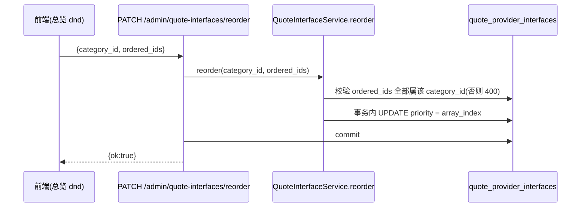
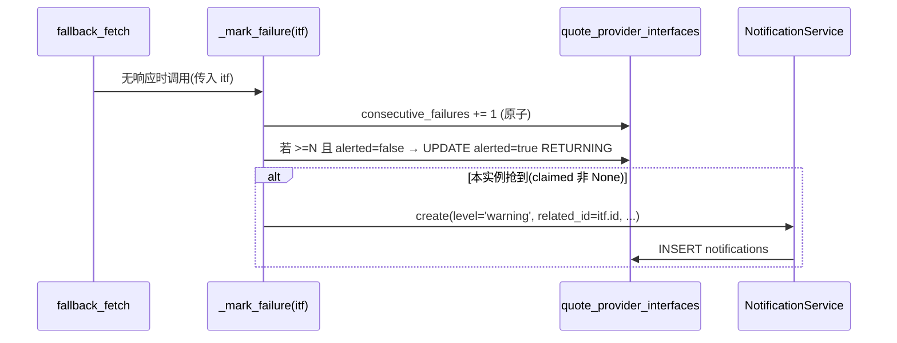
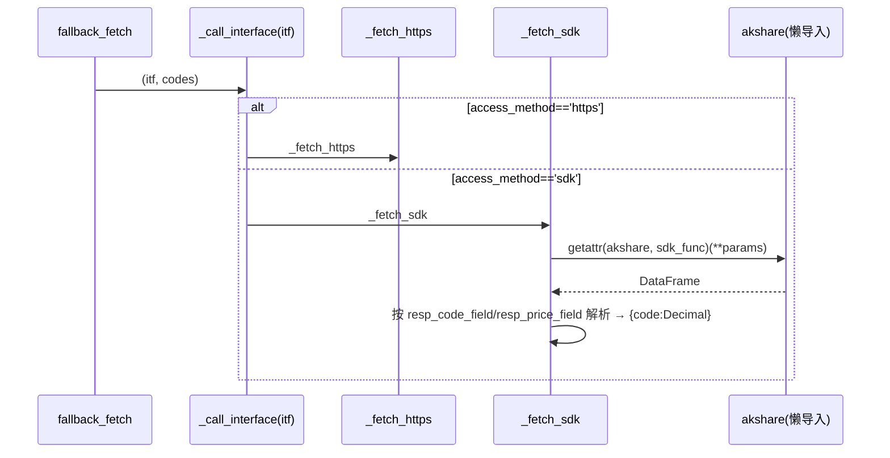
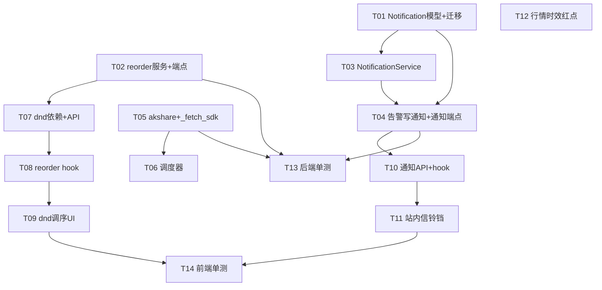

# ADR-002 增量任务清单 — 第 3 / 4 / 5 步 + Q2 / Q3 / Q4 默认落地

> 架构师：高见远（software-architect）｜ 上游：ADR-002（已冻结，§5 为落地范围，§3 为待确认项默认建议）
> 目标：在 V1（已完成 §5 第 1、2、6 步）之上，实现 **第 3 步（reorder）**、**第 4 步（告警站内信 + 红点，Q2 默认）**、**第 5 步（SDK 路径 + 可选调度器）**，并补齐 **Q3（行情时效红点）** 的前端 wiring。Q4 阈值 N=3 已在 `_mark_failure` 落地，不再实现。

---

## 0. 现状核实（本次增量不重复已做项）

| 项 | 状态 | 说明 |
|----|------|------|
| `QuoteInterface` 列 `priority` / `consecutive_failures` / `alerted` / `resp_code_field` / `resp_price_field` | ✅ 已存在 | V1 迁移 `g6b7c8d9e0f1` 已加，本次**不新增迁移** |
| `SecuritiesDataProvider` 仅 `enabled`（已移除 `is_active`/`is_default`） | ✅ 已存在 | V1 完成 |
| `SecurityPrice.fetched_at` / `source` | ✅ 已存在 | V1 完成 |
| `MarketDataSyncService.fallback_fetch` / `_fetch_https` / `_mark_failure`（原子自增 + `alerted` 抢占，N=3） | ✅ 已存在 | SDK 分支当前 `raise NotImplementedError` |
| 端点 `POST /portfolios/{id}/prices/refresh-async`(202) / `sync` / `GET sync-status` | ✅ 后端已存在 | **前端尚无任何调用**（Q3 缺口） |
| 管理面 `POST /admin/quote-providers/sync` | ✅ 已存在 | 调度器可复用其逻辑 |
| 前端 QuoteInterface 类型 / API / hooks | ✅ 基础 CRUD 已存在 | 无 `priority` 字段、无 reorder、无通知 |

**本次纯增量**：reorder 端点+前端 dnd、Notification 模型+服务+端点+前端铃铛、SDK `_fetch_sdk`+调度器、Q3 前端时效红点。

---

## 1. 设计要点（共享约束与契约）

### 1.1 后端约定（全部沿用，不另起炉灶）
- **信封契约**：统一经 `EnvelopeRoute` + `EnvelopeJSONResponse`，返回结构 `{code, data, message}`，禁返裸 int / 裸 bool。
- **鉴权**：管理面端点统一依赖 `require_admin`（`CurrentUser` 注入）；非 admin → 403。
- **会话**：全部 async（`AsyncSession`），写操作由端点 `await db.commit()`；服务内部仅 `flush()`。
- **Decimal 映射**：价统一 `Decimal(str(price))`；字段非空校验沿用 `_parse_rows`。
- **失败定义（Q1 已锁定）**：超时 / 连接错 / 5xx / 鉴权失败 / **HTTP 200 但业务空** = 无响应；非空业务数据 = 有响应。

### 1.2 数据模型增量
仅 **新增 `Notification` 表**（第 4 步需要）。`priority` 等列已存在，无需迁移。

```
Notification(notifications)
- id            UUID PK (gen_random_uuid)
- level         String(20)      NOT NULL   默认 'warning'   # warning | info | error
- title         String(255)     NOT NULL
- message       Text            NOT NULL
- related_type  String(40)      NULL       # 如 'quote_interface'
- related_id    String(36)      NULL       # 关联对象 id（如 interface id）
- read          Boolean         NOT NULL   default False
- created_at    DateTime(tz)    NOT NULL   server_default now()
```
- 注册到 `app/models/__init__.py`（确保 `Base.metadata` 收录，供 alembic autogenerate）。

### 1.3 端点契约（新增）
| 方法 & 路径 | 鉴权 | 请求体 | 返回 | 用途 |
|----|----|----|----|----|
| `PATCH /api/admin/quote-interfaces/reorder` | admin | `{category_id: str, ordered_ids: list[str]}` | `{ok: true}` | 同分类内重排 `priority=index` |
| `GET /api/admin/notifications` | admin | — | `NotificationOut[]`（按 `created_at` 倒序） | 站内信列表（前端算未读数） |
| `POST /api/admin/notifications/{id}/read` | admin | — | `NotificationOut` | 单条标记已读 |

> 路径说明：reorder 端点按 ADR §2.5 / 任务书指定为 `/api/admin/quote-interfaces/reorder`（无 `quote-providers` 前缀），与现有 `/api/admin/quote-providers/interfaces/...` 命名风格不一致 —— 见 §4 待明确事项 #1。

### 1.4 关键流程

**A. reorder 事务（第 3 步）**


**B. 告警抢占 → 写 Notification（第 4 步，阈值/claim 逻辑已存在，仅新增落库）**

> **不重复实现**阈值与 claim 去重；只在 claim 成功后插入一条 Notification。

**C. SDK 路径分发（第 5 步）**


---

## 2. 增量任务清单（有序，含依赖 / 文件 / 要点 / 验收）

> 标签：🔧后端 / 🖥前端 / 🗄迁移 / 🧪测试。序号即建议执行顺序；同层可并行（见 §3 依赖图）。

---

### T01 🗄迁移 + 🔧后端 — Notification 模型 + 注册 + Alembic 迁移
- **涉及文件**：`backend/app/models/notification.py`（新）、`backend/app/models/__init__.py`、`backend/alembic/versions/<rev>_add_notifications.py`（新）
- **依赖**：无
- **实现要点**：
  1. 新建 `Notification(Base, CreatedAtMixin)`，字段见 §1.2；用 `pk_uuid()` 作主键。
  2. 在 `app/models/__init__.py` 顶部 `import app.models.notification` 并把 `Notification` 加进 `__all__`（否则 alembic autogenerate 漏表）。
  3. 手写迁移 `op.create_table('notifications', ...)`，列定义与模型一致；`downgrade` 用 `op.drop_table('notifications')`。
- **验收点**：`alembic upgrade head` 成功；`\dt` 可见 `notifications` 表；`Notification` 出现在 `Base.metadata.tables`。

---

### T02 🔧后端 — reorder 服务 + 端点 + `QuoteInterfaceOut` 增加 `priority` + 创建时默认 priority
- **涉及文件**：`backend/app/services/quote_interface.py`、`backend/app/modules/admin/router.py`、`backend/app/models/quote_interface.py`（仅服务层改动）、`backend/app/services/__init__.py`（可选导出）
- **依赖**：无
- **实现要点**：
  1. `QuoteInterfaceService.reorder(category_id: str, ordered_ids: list[str])`：
     - 校验 `ordered_ids` 中**每个 id 都属同一个 `category_id`**（查库比对，否则 `HTTPException(400)`）。
     - 事务内 `UPDATE ... SET priority = :idx WHERE id = :id`（逐条或批量 CASE），`idx` 为数组下标。
     - 要求前端传入该分类**完整**接口 id 列表（含未启用），避免悬挂优先级的歧义。
  2. 端点 `PATCH /api/admin/quote-interfaces/reorder`：`require_admin` + `db: AsyncSession` + `EnvelopeRoute`，body `{category_id: str, ordered_ids: list[str]}`（pydantic 内联 schema），调用 `svc.reorder` 后 `await db.commit()`，返回 `{ok: true}`。
  3. `QuoteInterfaceOut` 增加 `priority: Optional[int] = None`（`from_attributes` 自动携带，前端据此渲染顺序）。
  4. `QuoteInterfaceService.create` 写入默认 `priority`：当 `category_id` 非 None 时 `priority = COALESCE(MAX(priority), -1)+1`（同分类末位）；未分类（None）留 NULL。
- **验收点**：拖拽后 `list_all` 返回顺序与 `priority` 升序一致；跨分类 id 混入 → 400；新增接口落到所属分类末位。

---

### T03 🔧后端 — NotificationService（列表 / 已读标记 / 创建）
- **涉及文件**：`backend/app/services/notification.py`（新）
- **依赖**：T01
- **实现要点**：
  1. `list_all(limit=50)`：按 `created_at` 倒序返回。
  2. `list_unread()`：返回 `read=false` 列表（前端可算红点数，亦可仅用 `list_all` 在端侧过滤）。
  3. `mark_read(notification_id)`：置 `read=true`；不存在 → 404。
  4. `create(*, level, title, message, related_type=None, related_id=None)`：插入并 `flush()`（提交由端点/调用方负责）。
  5. **不实现**任何阈值 / claim / 去重逻辑（那是 `_mark_failure` 的职责）。
- **验收点**：单测覆盖 `create`→`list_all` 顺序、`mark_read` 翻转 `read`、不存在 id 标已读 → 404。

---

### T04 🔧后端 — `_mark_failure` 告警成功写 Notification + 通知端点
- **涉及文件**：`backend/app/services/market_data_sync.py`、`backend/app/modules/admin/router.py`
- **依赖**：T01、T03
- **实现要点**：
  1. 改写 `_mark_failure` 签名：由 `(self, interface_id)` 改为 `(self, itf: QuoteInterface)`（`fallback_fetch` 循环内已有 `itf`，调用处同步改为 `await self._mark_failure(itf)`）。内部逻辑（原子自增 + `alerted` 抢占）**保持不变**。
  2. 在 `claimed` 非 None（本实例抢到告警）分支内，调用 `NotificationService(self.session).create(level='warning', title=f"接口「{itf.name}」连续 {FAILURE_THRESHOLD} 次无响应", message=f"提供方接口 {itf.name} 已连续 {FAILURE_THRESHOLD} 次无响应，已暂停重复告警，请检查。", related_type='quote_interface', related_id=itf.id)`。不 `commit`（由 `sync_portfolio_prices` 的调用方提交）。
  3. admin router 增加内联 `NotificationOut` schema（id/level/title/message/related_type/related_id/read/created_at，`from_attributes`）+ 两个端点：
     - `GET /api/admin/notifications` → `NotificationService(db).list_all()`，返回 `NotificationOut[]`。
     - `POST /api/admin/notifications/{id}/read` → `_mark...` 标已读，返回 `NotificationOut`。
  4. 同步更新任何直接调用旧 `_mark_failure(interface_id)` 的已有测试（见 T13）。
- **验收点**：模拟某接口连续 3 次无响应 → 生成**恰好 1 条**未读 `Notification`；多实例并发下 claim 保证仅 1 条；`POST .../read` 后 `read=true`；GET 列表含该条。

---

### T05 🔧后端 — akshare 依赖 + `_fetch_sdk` + `_call_interface` 分发
- **涉及文件**：`backend/pyproject.toml`、`backend/app/services/market_data_sync.py`
- **依赖**：无
- **实现要点**：
  1. `pyproject.toml` 在 `dependencies` 增加 `"akshare"`（取最新稳定版，如 `akshare>=1.14`）。
  2. `_fetch_sdk(self, itf, codes)`：
     - **懒导入** `import akshare`（模块级不 import，避免无 akshare 环境启动崩）。
     - 从 `itf.config` 读取 `sdk_func`（akshare 函数名，如 `'stock_zh_a_spot'`）；`params = itf.params or {}`。
     - 调用 `func = getattr(akshare, sdk_func)`；`df = func(**params)`；`codes` 透传（如 `func(symbol=",".join(codes))` 视函数而定，具体映射见 §4 #4）。
     - 解析 DataFrame：`code_field = itf.resp_code_field or 'code'`、`price_field = itf.resp_price_field or 'price'`，逐行取列 → `{str(row[code_field]): Decimal(str(row[price_field]))}`；空 → 返回 `{}`（触发向下）。
  3. `_call_interface` 改为：`if access_method=='https': return await self._fetch_https(...)`；`elif access_method=='sdk': return await self._fetch_sdk(...)`（删除 `NotImplementedError`）。
- **验收点**：单测 mock `akshare` 返回 DataFrame → 解析出 `{code: Decimal}`；业务空 → `{}`；**模块 import 阶段不 import akshare**（即便 pyproject 未实际安装也不影响 `import app.services.market_data_sync`）。

---

### T06 🔧后端 — 可选定时调度器（APScheduler，默认关闭）
- **涉及文件**：`backend/pyproject.toml`、`backend/app/core/config.py`、`backend/app/core/scheduler.py`（新）、`backend/app/main.py`
- **依赖**：T05（复用 `sync_portfolio_prices`）
- **实现要点**：
  1. `pyproject.toml` 增加 `"apscheduler"`。
  2. `app/core/config.py` 增加：
     - `QUOTE_SYNC_SCHEDULER_ENABLED: bool = False`
     - `QUOTE_SYNC_SCHEDULER_CRON: str = "0 16 * * 1-5"`（收盘后，工作日）
  3. `app/core/scheduler.py`：
     - `async def run_full_sync()`：用 `AsyncSessionLocal()` 开独立会话，遍历全部 `Portfolio.id`，逐组合 `await MarketDataSyncService(s).sync_portfolio_prices(pid)`，`await s.commit()`（复用 `POST /admin/quote-providers/sync` 的逻辑）。
     - `def start_scheduler()` / `def shutdown_scheduler()`：读 `get_settings()`；`enabled=False` 时直接返回（不创建 `BackgroundScheduler`、不注册 job），保证无 akshare 环境也不报错；`enabled=True` 时 `BackgroundScheduler.add_job(run_full_sync, CronTrigger.from_crontab(...), ...).start()`。
  4. `app/main.py` 增加 FastAPI `lifespan`：`startup` 调 `start_scheduler()`，`shutdown` 调 `shutdown_scheduler()`（用 `@asynccontextmanager` 包裹 `app` 构造）。
- **验收点**：`QUOTE_SYNC_SCHEDULER_ENABLED=False` 时启动应用不报错、无 job；`=True` 且 akshare 缺失时，调度触发后单接口异常被 `fallback_fetch` 吞掉，不导致调度器崩溃；设置 `enabled=True` 后可在测试环境用近未来 cron 验证触发一次全量同步。

---

### T07 🖥前端 — 依赖 + 类型/API（dnd-kit + priority + reorder）
- **涉及文件**：`web/package.json`、`web/src/api/quote-interface.api.ts`
- **依赖**：T02（端点就绪）
- **实现要点**：
  1. `web/package.json` 增加 `"@dnd-kit/core"`、`@dnd-kit/sortable`、`@dnd-kit/utilities`（sortable 所需）。
  2. `web/src/api/quote-interface.api.ts`：`QuoteInterface` 接口加 `priority: number | null`；新增 `ReorderQuoteInterfacesReq { category_id: string; ordered_ids: string[] }` 与 `reorderQuoteInterfaces(body): Promise<{ok: boolean}>` → `http.patch('/admin/quote-interfaces/reorder', body)`。
- **验收点**：`pnpm install` 成功；`pnpm lint`(tsc) 通过；请求打到正确端点与 body 形状。

---

### T08 🖥前端 — reorder hook
- **涉及文件**：`web/src/hooks/use-quote-interface.ts`
- **依赖**：T07
- **实现要点**：
  1. 新增 `useReorderInterfaces()`：`useMutation`，`mutationFn: (body: ReorderQuoteInterfacesReq) => reorderQuoteInterfaces(body)`；`onSuccess` 失效 `quoteInterfacesAllKey()` 及相关提供方子表缓存；`onError` → `toast.error('调序失败')`。
- **验收点**：调用后总览列表自动按新顺序刷新。

---

### T09 🖥前端 — 总览「同分类 dnd」调序 UI
- **涉及文件**：`web/src/features/admin/quote-provider-section.tsx`
- **依赖**：T08
- **实现要点**：
  1. 在 `InterfacesByCategoryOverview` 内，每个分类组用独立的 `DndContext` + `SortableContext`（`items = 该组 id 数组`）。
  2. 每行用 `useSortable({id})` 渲染拖拽手柄（`GripVertical` 图标），仅同组内可拖（不同 `DndContext` 天然隔离跨分类）。
  3. `onDragEnd`：用 `arrayMove` 重排该组 id，`mutate({category_id: type, ordered_ids: newIds})`；成功后依赖 T08 失效查询刷新（乐观更新可选）。
  4. 行内可展示 `priority` 序号辅助调试（可选）。
- **验收点**：同分类拖拽后刷新顺序持久化（与后端 `priority` 一致）；跨分类无法拖入；断网/失败有 toast 且不破坏现有顺序。

---

### T10 🖥前端 — 通知 API + hook
- **涉及文件**：`web/src/api/notification.api.ts`（新）、`web/src/hooks/use-notification.ts`（新）
- **依赖**：T04（端点就绪）
- **实现要点**：
  1. `web/src/api/notification.api.ts`：`Notification` 类型（id/level/title/message/related_type/related_id/read/created_at）；`listNotifications(): Promise<Notification[]>` → `http.get('/admin/notifications')`；`markNotificationRead(id): Promise<Notification>` → `http.post(\`/admin/notifications/${id}/read\`)`。
  2. `web/src/hooks/use-notification.ts`：`useNotifications()`（`useQuery`，`enabled: isAdmin`，可选 `refetchInterval` 轮询，如 30s）；`useMarkNotificationRead()`（`useMutation` → `markNotificationRead`，`onSuccess` 失效通知查询）。
- **验收点**：`tsc` 通过；admin 下能拉到通知列表；标已读后查询刷新、未读数下降。

---

### T11 🖥前端 — 站内信铃铛（红点 + 列表）
- **涉及文件**：`web/src/features/admin/notification-bell.tsx`（新）、`web/src/components/layout/app-layout.tsx`
- **依赖**：T10
- **实现要点**：
  1. 新建 `NotificationBell`：使用 `useNotifications()`；`unread = data?.filter(n=>!n.read).length`；铃铛（`Bell` 图标）右上角 `unread>0` 时显示红点 `Badge`。
  2. 点击展开 `DropdownMenu`/`Popover` 列出通知（标题 + 时间 + 未读高亮），每条「标为已读」按钮调用 `useMarkNotificationRead`；可加「全部已读」。
  3. 在 `app-layout.tsx` 顶栏（用户菜单左侧）渲染 `<NotificationBell />`，**仅 `useIsAdmin()` 为 true 时显示**。
- **验收点**：有未读通知时铃铛红点出现；点开可见列表；单条标已读后红点消失 / 计数 -1；非 admin 不显示铃铛。

---

### T12 🖥前端 — 行情时效红点（Q3：消费 `sync-status`）
- **涉及文件**：`web/src/api/portfolio-price.api.ts`（新或扩展）、`web/src/hooks/use-portfolio-price.ts`（新或扩展）、`web/src/features/portfolio/price-freshness-badge.tsx`（新）、挂载点（仪表盘/组合页头部，如 `web/src/pages/dashboard.tsx` 或组合详情头部）
- **依赖**：无（后端 `GET /portfolios/{id}/prices/sync-status` 已存在）
- **实现要点**：
  1. `getPriceSyncStatus(portfolioId)` → `http.get(\`/portfolios/${id}/prices/sync-status\`)` 返回 `{last_fetched_at: string|null, source: string|null}`。
  2. `usePriceSyncStatus(portfolioId)`：`useQuery`，`enabled` 有 portfolioId，挂载即轮询（如 `refetchInterval: 60_000`）。
  3. `PriceFreshnessBadge`：`last_fetched_at` 缺失或距现在超过阈值（默认复用用户偏好 `staleDays` 天；无则固定 8h）→ 显示「过旧」红点 + 文案；否则显示「数据截至 HH:MM · 来源」。
  4. 挂载到组合/仪表盘头部（与现有 Overview `freshness` 红点并列或替代该组合级展示，需与现有 freshness UI 协调，见 §4 #6）。
- **验收点**：`fetched_at` 新鲜时无红点并正确显示「数据截至 HH:MM · 来源」；陈旧 / 缺失时显示红点；轮询能随后台刷新解除红点。

---

### T13 🧪测试 — 后端单测（reorder / 告警通知 / SDK 解析）
- **涉及文件**：`backend/tests/test_quote_interface_reorder.py`（新）、`backend/tests/test_notification.py`（新）、`backend/tests/test_market_data_sdk.py`（新）
- **依赖**：T02、T04、T05
- **实现要点**：
  1. `test_quote_interface_reorder`：同分类 reorder 后 `priority` 与顺序一致；混入跨分类 id → 400；`create` 默认 priority 末位。
  2. `test_notification`：连续 3 次无响应生成 1 条未读；`mark_read` 翻转；（可用 monkeypatch 模拟 claim 成功）。
  3. `test_market_data_sdk`：monkeypatch `akshare` 返回 DataFrame → 解析正确；业务空 → `{}`；模块 import 不触发 akshare 导入。
- **验收点**：`pytest` 全绿（沿用现有 `asyncio_mode=strict` fixture）。

---

### T14 🧪测试 — 前端单测（dnd 调序 + 通知铃铛）
- **涉及文件**：`web/src/features/admin/__tests__/quote-provider-section.test.tsx`（新/扩展）、`web/src/features/admin/__tests__/notification-bell.test.tsx`（新）
- **依赖**：T09、T11
- **实现要点**：
  1. 总览 dnd：`onDragEnd` 触发 `reorderQuoteInterfaces` 且 body 形为 `{category_id, ordered_ids}`；跨分类不可拖。
  2. 铃铛：`data` 含未读时渲染红点；点「标为已读」调用 `markNotificationRead` 并使未读计数 -1。
- **验收点**：`pnpm test`（vitest）通过。

---

## 3. 任务依赖图



> 说明：T02 与 T04 都改动 `backend/app/modules/admin/router.py`，由同一工程师按 T02→T04 顺序提交即可避免冲突。T12 独立（后端端点已存在）。

---

## 4. 待明确事项（需用户/团队确认）

1. **reorder 端点路径不一致**：ADR §2.5 与任务书均指定 `PATCH /api/admin/quote-interfaces/reorder`（无 `quote-providers` 前缀），而现有接口 CRUD 统一在 `/api/admin/quote-providers/interfaces/...` 下。是否坚持该路径，还是改为 `/api/admin/quote-providers/interfaces/reorder` 以保持命名一致？*本清单按指定路径设计。*

2. **Notification 受众范围**：Q2 默认「管理面站内信」。当前设计为**全局通知（所有 admin 共享同一列表、可标已读）**，因为告警是系统级事件。是否需要按用户隔离（每人独立已读状态）？若需隔离，需加 `user_id` 列与 `WHERE user_id=...`。

3. **Notification 文案与跳转**：建议 `level='warning'`、`title="接口「{name}」连续 {N} 次无响应"`、`related_type='quote_interface'`、`related_id=interface id`，便于前端跳转到该接口编辑页。是否需要在铃铛里点击跳转到对应接口？跳转目标（admin 页锚点）待定。

4. **SDK 具体 akshare 函数与参数来源**：`_fetch_sdk` 设计为从 `itf.config.sdk_func` 取 akshare 函数名、`itf.params` 透传为调用参数；返回 DataFrame 用 `resp_code_field`/`resp_price_field` 取列。需确认：① akshare 函数名是否放 `config.sdk_func`（与现有 `config.sdk_name` 校验是否冲突）；② `codes` 如何传入 akshare 函数（参数名因函数而异）；③ DataFrame 列名与 `resp_code_field`/`resp_price_field` 的对应是否够用（部分 akshare 接口返回列名非 code/price，需逐接口配置）。

5. **调度器触发逻辑复用**：收盘后全量同步建议直接遍历全部 `Portfolio` 调 `sync_portfolio_prices`（含 `recalculateRange`）。是否要复用 `POST /admin/quote-providers/sync` 的封装，还是独立实现？是否需要调度器运行结果也落地一条「系统通知」？*本清单默认不额外发通知（告警已在 `_mark_failure` 处理）。*

6. **Q3「过旧」阈值**：`sync-status` 的 `fetched_at` 红点判定，建议复用用户偏好 `staleDays`（天）；亦可固定阈值（如 >8h）。需确认与现有仪表盘 `OverviewOut.freshness` 红点的关系——是**新增**组合级红点，还是**替换**现有 freshness 展示。挂载位置（dashboard 头部 vs 组合详情头部）待定。

7. **Notification 保留/清理策略**：默认不自动清理（仅人工标已读）。是否需要保留期 / 自动归档旧通知？默认：不清理。
