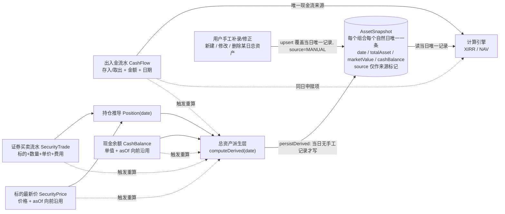

# 投资收益统计系统 — 增量 PRD v2.3（出入金 / 持仓方案B / 现金余额 / 总资产每日唯一一条记录）

> 版本：v2.3（在 v2.2 基础上，依据用户新约束修订：**每日总资产记录每个组合每个自然日只存在一条，不论来源**。v2.2 的「MANUAL 与 DERIVED 同日并存 + 读取时 MANUAL 优先」模型被本版**正式推翻**）
> **作者**：产品经理 许清楚（Alice）
> **基线**：`docs/PRD.md` v1.2 + `docs/PRD-modules.md` v1.2；本文档 v2.0 → v2.1 → v2.2 为直接前身，前序全部内容在本文中保留，冲突处以 **v2.3 标注为准**。
> **性质**：⚠️ **方向性重构**。本次不是"打磨"，是**推翻 v1.1/v1.2 的持仓隔离架构（D-01 系列）**，改为「持仓驱动总资产」的新模型。冲突时**以本文档为准**。
> **范围**：`packages/backend` + `packages/web` + `packages/shared`，不含 `harmonyos`。

> 🆕 **v2.3 一句话总纲**（**替换 v2.2 总纲**）：**总资产 = 持仓当日最新市值 + 现金余额，由系统自动派生并每日落库。「每日总资产记录」表中，每个组合每个自然日**有且仅有一条**记录，不论它是自动生成（`source=DERIVED`）还是用户手工记录（`source=MANUAL`）；手工记录**取代**（而非"并存并优先于"）同日的自动记录，自动派生遇到手工记录时**跳过、不覆盖**。**
> —— 即：**自动为主、手工为辅、每日唯一**。

---

## 0. 🆕 v2.3 变更摘要（只看这一节也能开工）

> **用户新约束原话**：「历史总资产记录每日只能存在一条，不管是自动生成还是手工记录。」

### 0.1 本版改了什么（v2.2 → v2.3）

| # | v2.2 结论（作废） | 🆕 v2.3 结论（生效） | 影响章节 |
|---|------------------|---------------------|---------|
| **1. 记录基数** | 同一 `(portfolioId, date)` 允许 **MANUAL + DERIVED 两条并存** | **每个组合每个自然日有且仅有一条记录**，不论来源 | §2.4 全节、§3.4、§6.1、§7 |
| **2. 唯一约束** | `(portfolioId, date, source)` | 🔴 **`(portfolioId, date)`**（回到每日唯一） | §3.4 `SNAP-P0-04`、§6.1、§7-3 |
| **3. `source` 字段** | 唯一键的并列组成部分 | ✅ **保留字段，但退出唯一键**；仅作①来源标记（UI 徽标 / CSV 导出）②**区间重建时的删除保护开关**（`DELETE ... WHERE source='DERIVED'`）③审计追溯 | §2.4.6、§6.1、§7-3 |
| **4. 读取语义** | `effectiveSnapshot()` 实现 `MANUAL > DERIVED > 前值填充` 三级优先级 | 🔧 **简化为**：读当日那条唯一记录 → 无记录则前值填充 → 再无则 0。**优先级判断从读路径彻底消失** | §2.4.1、§6.1 硬约束 4 |
| **5. 自动派生写入** | 无条件写入 DERIVED（即使同日已有 MANUAL） | 🔧 **upsert 且手工优先**：当日已有 `source='MANUAL'` 记录 → **跳过、不写、不覆盖**；当日无记录或记录为 `DERIVED` → 写入/更新 DERIVED | §2.4.6、`SNAP-P0-04`/`04a` |
| **6. 手工写入** | 新增一条 MANUAL，DERIVED 保留 | 🔧 **对当日唯一记录做 upsert**：存在则覆盖（`source` 改写为 `MANUAL`），不存在则插入。**手工录入即取代自动记录** | `SNAP-P0-06` |
| **7. 「自动值」的来源** | 从同日并存的 DERIVED 行读取 | 🔧 **改为实时纯计算**：派生服务必须拆出 **`computeDerived(portfolioId, date)` 纯函数（只算不落库）**，供 UI 差异提示与「重置为自动值」调用 | `SNAP-P0-01`、`SNAP-P0-07`、§5.3 |
| **8. 「重置为自动值」** | 删除 MANUAL 行 → 露出同日 DERIVED 行 | 🔧 **用 `computeDerived(date)` 的结果 upsert 覆盖该日记录，并把 `source` 置回 `DERIVED`** | `SNAP-P0-07` |
| **9. 计算日期集合** | DERIVED 日期集合 **∪** MANUAL 日期集合 | 🔧 **= 记录表中的日期集合**（单表单行，无需求并集） | §2.4.5、§6.1、W-3 |
| **10. 待确认问题** | `Q-B12` 已裁决 / `Q-B13` 已失效 | 🔧 `Q-B12` **改写并关闭**（保留手工 CRUD，但语义改为"取代"而非"并存优先"）；`Q-B13` **重新裁决并关闭**（冲突语义 = 每日唯一 + 手工优先 + 派生跳过）；🆕 新增 `Q-B17`（删除后是否立即回填） | §4 |

### 0.2 🔑 给架构师的三句话（v2.3 版）

1. **v2.2 里凡是出现「同日 MANUAL 与 DERIVED 并存 / 唯一约束 `(portfolioId, date, source)` / MANUAL 优先于 DERIVED / 删除 MANUAL 后回退到 DERIVED 行」的字样，一律按 v2.3 读作「每日唯一一条记录；唯一约束 `(portfolioId, date)`；手工写入覆盖同日自动记录；派生写入遇手工记录跳过」。**
2. **`source` 字段不要删** —— 它虽然不再是唯一键的一部分，但**区间重建的 `DELETE` 仍然必须靠它区分"哪些行是系统自己生成的、可以安全删"和"哪些是用户手工写的、必须保留"**。这是保留该字段的**第一理由**，UI 徽标只是第二理由。
3. **派生服务必须拆成两个函数**：`computeDerived(portfolioId, date)`（纯计算，不落库，可被 UI/重置/差异提示随意调用）与 `persistDerived(portfolioId, dateRange)`（落库，带 upsert 与手工跳过逻辑）。v2.2 靠"同日并存的 DERIVED 行"提供的一切能力，v2.3 全部改由前者实时提供。

### 0.3 前序版本决策速览（v2.2 起，本版不变）

| # | 决策 | 结论 |
|---|------|------|
| **决策 A′：存量数据直接清空** | 本项目库为开发/测试库，存量数据一律清空 | **migration 只需「清空旧表 + 建新表结构」，无任何数据转换逻辑**（`Q-B1`~`Q-B4` 已关闭） |
| **决策 B′：历史总资产记录保留手工 CRUD** | 用户可对历史总资产记录手工新建 / 修改 / 删除 | **本版仍然成立**，仅把落地语义由「并存 + 优先」改为「**每日唯一 + 取代**」 |

---

## 1. 变更摘要（Change Summary）

### 1.1 六条需求 + 决策 → 变更映射

| #         | 用户需求                                                                              | 变更实质                                                                                                                                                            | 受影响文档条款                                                                                                                                                                                                       |
| --------- | --------------------------------------------------------------------------------- | ----------------------------------------------------------------------------------------------------------------------------------------------------------------- | ------------------------------------------------------------------------------------------------------------------------------------------------------------------------------------------------------------- |
| **R1**    | 交易模块 → 出入金管理，仍用于收益计算                                                              | `Transaction` **正名**为「出入金流水（CashFlow）」，语义收敛为纯组合级现金流；`type` 仍为 `BUY/SELL` 两值（UI 文案「存入/取出」）；**剥离** `securityId/quantity/price/fee` 四个明细字段                         | 🔧修订 `PRD.md` §3.5、§5.1、§10.2；🔧重写 `PRD-modules.md` §5 全章；❌**推翻 TXN-P0-02**（交易字段扩展）、❌推翻 §5.4 映射表中标的/数量/单价/费用四行；✅**保留 C-02、C-10**<br/>v2.2：**存量 `transactions` 表直接清空**，由用户以出入金语义重新录入（Q-B1）                    |
| **R2**    | 交易明细并入持仓，持仓升级方案B，持仓由流水推导 + 持仓列表                                                   | 新增 `SecurityTrade`（证券买卖流水，标的级），持仓**由流水推导**不再手工录入；`Holding` 每日快照模型**废弃**                                                                                         | ❌**推翻 D-01**（持仓快照法）、❌推翻 §4.1 方案选型结论与 Q-01、❌推翻 **HOLD-P0-02**（手工持仓录入）、❌推翻 Q-04（`avgCost` 手工录入）、✅方案B 从 P2 提前到 **P0**<br/>v2.2：**存量 `holdings` 表直接清空**，不生成期初建仓流水（Q-B2）                                       |
| **R3**    | 现金余额 = 独立手填当前值，向前沿用                                                               | 新增 `CashBalance` 独立模型（值 + asOf），**不挂在持仓快照上**，录入口在出入金管理页                                                                                                         | ❌**推翻 边界2**、❌推翻 **D-04**（在持仓模块录入现金余额）、🔧修订 `shared/types/security.ts` 的 `HoldingsAggregate.cashBalance` 归属；🔧裁决 `SecurityType.CASH` **弃用**                                                                    |
| **R4**    | 快照并入出入金管理，最新值语义、不每日记录                                                             | 「资产快照」**降级为派生概念**，取消每日手工录入<br/>🔧 **v2.1 修订**：R4「手填」语义被否决；「不每日记录」被 R6 推翻<br/>**v2.2 再修订**：R4 的「**手填**」语义**部分恢复** —— 总资产**默认自动派生**，但**保留手工新建/修改/删除历史记录的能力**（决策B′）<br/>🆕 **v2.3 收紧**：手工与自动**不并存**，每日唯一一条 | ❌**推翻 `PRD.md` P0-02**（每日强制手工录入快照）、❌推翻 §5.2（快照录入流程）、❌推翻 Q-06；🔧修订 §3.5「期末资产额 按日录入」行<br/>v2.2：**恢复** R4 的手填语义为「**可选补录/修正**」，不再是「每日必填」                                                                       |
| **R5**    | 总资产 = 持仓最新市值 + 现金余额，自动填入                                                          | 持仓与现金**成为计算引擎的上游数据源**（经派生层）<br/>🔧 **v2.1 修订**：「自动计算」成立并强化，实现取向改为「自动计算 + 每日持久化」<br/>**v2.2**：自动计算仍是**默认机制**，但**手工记录可覆盖某日自动值**<br/>🆕 **v2.3**：「覆盖」的物理含义确定为 **upsert 同一行**，而非"新增一行并优先" | 🔴❌**推翻 边界1、C-08、C-09**（持仓零参与计算 / 写操作不触发计算）；❌推翻 §4.8 全章（一键同步）与 **HOLD-P0-05 / HOLD-P0-07**；🔧修订 `PRD-modules.md` §3.1 口径提醒、🔧修订 `PRD.md` §3.1 现金流表终值来源、§5.3 触发机制                                              |
| **R6** | **「增加总资产每日根据当日最新市值+现金余额做记录」**                                                     | **总资产从「运行时只读展示的派生值」升级为「自动派生 + 每日落库的持久化记录」**<br/>🆕 **v2.3**：R6 **完全成立且不变**，仅把"每日一条"从**惯例**升级为**数据库层强约束**                    | 🔧**修订 §2.4 全节**；🔧修订 `SNAP-P0-01/02`、`FLOW-P0-03`、`SNAP-P1-01`；🆕新增 `SNAP-P0-04 / 04a / 04b`；🔧修订 §6 计算引擎契约                                                                          |
| **决策A**   | ~~总资产自动计算、只读展示、不手填~~<br/>v2.2：总资产默认自动计算并每日落库；UI 主视图只读；另设独立的历史记录管理入口支持手工新建/修改/删除<br/>🆕 **v2.3 最终口径**：同上，**并追加"每日唯一一条"的硬约束** | 「只读」二字**仅描述总资产卡（当前值）的展示形态**，**不再等同于「全系统禁止手工录入」**                                                              | 见 R4 / R5 / **R6** / §2.4.6                                                                                                                                                                                 |
| **决策B（现金）**   | 现金余额完全独立、不联动出入金与证券买卖                                                              | 现金余额是**用户自行维护的对账值**，系统不代算                                                                                                                                       | 见 R3；引出 🔴风险 W-1。**v2.2/v2.3：本项不变**                                                                                                                                                                                |
| **决策A′（v2.2 用户决策·清库）** | 「都是开发测试数据库，存量数据都可以直接清空」                                                    | **所有存量业务数据直接清空，不做数据迁移**。migration 只做「清表 + 建新结构」                                                                                             | `Q-B1`/`B2`/`B3`/`B4` 已关闭；W-5 语义变更                                                                                                                                                            |
| **决策B′（v2.2 用户决策·手工CRUD）** | 「历史总资产记录可以手工新建、修改、删除」                                                       | **在 #6 自动记录之上，开放手工 CRUD**（`source=MANUAL`）                                              | `SNAP-P0-06`、`SNAP-P0-07`；Q-B12 采纳保留；风险 **W-6**                                     |
| 🆕 **决策C′（v2.3 用户决策·每日唯一）** | 「历史总资产记录每日只能存在一条，不管是自动生成还是手工记录」 | **同一组合同一自然日有且仅有一条记录**。手工写入 **upsert 取代** 自动记录；自动派生遇手工记录**跳过**。唯一约束回到 `(portfolioId, date)`；`source` 降级为标记字段 | 🔧 §2.4 全节；🔧 `SNAP-P0-01/04/04a/04b/05/06/07`；🔧 §6.1 硬约束 4；🔧 §5.3 UI；🔧 W-4/W-5/W-6；🔧 Q-B12/Q-B13；🆕 Q-B17；🔧 §7 |

### 1.1.1 🔧 口径统一说明（v2.3 修订：新增「决策C′」一行）

| 来源 | 原表述 | v2.2 裁决 | 🆕 **v2.3 最终裁决** |
|------|--------|----------|-------------------|
| 需求 #4 | 快照「像现金余额一样，一个地方填入最新值」（**手填**）、「**不每日记录**」 | 「不每日记录」作废；「手填」恢复为可选能力 | ✅ **不变**（手填 = 按需补录/修正） |
| 需求 #5 | 总资产 = 持仓最新市值 + 现金余额，**自动计算、只读展示、不手填** | 公式完全成立；「不手填」限缩为「默认不需要手填」；「只读」限缩为总资产卡 | ✅ **不变** |
| 需求 #6 | 总资产每日根据当日最新市值 + 现金余额做记录 | ✅ `AssetSnapshot(date, source=DERIVED).totalAsset = marketValue(date) + cashBalance(date)`，事件驱动重算落库 | ✅ **完全保留，仍是默认机制** |
| 决策B′ | 「历史总资产记录可以手工新建、修改、删除」 | ✅ 采纳；同一 `(portfolioId, date)` 上 **MANUAL 优先于 DERIVED**，两条并存 | 🔧 **落地方式改写**：手工 CRUD 能力**完全保留**，但**不再并存** —— 手工记录**就地取代**当日记录 |
| 决策A′ | 「存量数据都可以直接清空」 | ✅ 采纳 | ✅ **不变** |
| 🆕 **决策C′（v2.3 用户决策）** | 「历史总资产记录每日只能存在一条，不管是自动生成还是手工记录」 | — | ✅ **采纳**：唯一约束 **`(portfolioId, date)`**；写入为 **upsert**；**自动派生遇手工记录跳过（手工优先）**；**手工录入取代自动记录**；读取即读当日唯一记录（无优先级逻辑） |

> ⚠️ **v2.2 表述的正式收回清单**（架构师请逐条替换心智模型）：
> - ❌ ~~「唯一约束 `(portfolioId, date, source)`，允许同日两条并存」~~ → ✅ 「**唯一约束 `(portfolioId, date)`，每日唯一一条**」
> - ❌ ~~「读取时 MANUAL 优先于 DERIVED」~~ → ✅ 「**读当日唯一记录即可，无需优先级判断**」
> - ❌ ~~「删除 MANUAL 记录后自动回退到同日 DERIVED 记录」~~ → ✅ 「**删除即该日无记录；若该日属事件日则由派生层立即回填一条 DERIVED，否则读取时前值填充**」
> - ❌ ~~「DERIVED 记录保留不删，以便随时重置回自动值」~~ → ✅ 「**自动值由 `computeDerived(date)` 纯函数实时算出，不需要留一行在库里**」
> - ✅ **保留有效**：「区间重建的 `DELETE` 必须带 `AND source='DERIVED'`」—— 这条在 v2.3 **更加关键**，是手工记录不被抹掉的唯一保护。

### 1.1.2 逐句修订清单（v2.2 → 🆕 v2.3）

| 位置 | v2.2 原义 | 🆕 **v2.3 处置** |
|---|---|---|
| 总纲行 | 「自动为主、手工为辅」，同日两条并存、MANUAL 优先 | 🔧 「**自动为主、手工为辅、每日唯一**」，手工取代自动 |
| §2.0 数据流图 | `S` 节点标注 `source = DERIVED \| MANUAL`，边标「读取时 MANUAL 优先」 | 🔧 改为「每日唯一一条」「手工 upsert 覆盖」「派生遇手工跳过」 |
| §2.4.1 `effectiveTotalAsset(D)` 三级优先级 | `MANUAL > DERIVED > 前值填充 > 0` | 🔧 **二级**：`当日唯一记录 > 前值填充 > 0` |
| §2.4.2 对照表「存储」行 | 「事件日 DERIVED（稀疏） + 用户按需 MANUAL」 | 🔧 「事件日一条（稀疏）；该日若被手工写过则该条为 MANUAL」 |
| §2.4.2 对照表「优先级」行 | 「MANUAL > DERIVED」 | 🔧 「**无读取优先级**；写入侧：手工覆盖自动、自动跳过手工」 |
| §2.4.5 快照日期集合 | 「事件日集合（DERIVED） ∪ 手工记录日期集合（MANUAL）」 | 🔧 「= **记录表中实际存在的日期集合**」 |
| §2.4.6 行为规范表 | 以"并存/优先/回退"为核心 | 🔧 **整表重写**为 upsert 语义表 |
| §3.4 `SNAP-P0-01` 验收 3 | 「同一 `(portfolioId, date, source='DERIVED')` 唯一」 | 🔧 「同一 `(portfolioId, date)` 唯一」+ 🆕 拆出 `computeDerived` 纯函数 |
| §3.4 `SNAP-P0-04` 验收 4/5 | 「即使某日有 MANUAL，DERIVED 仍照常生成并保留」 | 🔧 「**当日已有 MANUAL 记录时，派生层跳过、不写入**」 |
| §3.4 `SNAP-P0-06` | 新建一条 MANUAL（不可与已有 MANUAL 重复） | 🔧 「**对当日唯一记录 upsert**；日期可与已有自动记录重复（即为覆盖），二次确认告知将取代自动值」 |
| §3.4 `SNAP-P0-07` | 「重置 = 删除 MANUAL 记录」 | 🔧 「重置 = **以 `computeDerived(date)` 结果 upsert 覆盖该行，`source` 置回 `DERIVED`**」 |
| §5.3 UI | 手工行下方显示"同日自动值"（读并存的 DERIVED 行） | 🔧 自动值改为**实时计算**后展示，语义不变、来源不同 |
| §6.1 硬约束 4 | 「MANUAL 优先于 DERIVED」+ `effectiveSnapshot()` 三级优先级 | 🔧 **整条重写**为「每日唯一一条；手工覆盖自动；读当日唯一记录」 |
| §7-3 表结构 | 唯一约束 `(portfolioId, date, source)` | 🔧 **`(portfolioId, date)`** |
| §4 `Q-B12` | 采纳保留手工覆盖 | 🔧 **改写并关闭**：保留能力，语义改为"取代" |
| §4 `Q-B13` | 已失效（存量清空） | 🔧 **重新裁决并关闭**：冲突语义 = 每日唯一 + 手工优先 + 派生跳过 |
| §4 | — | 🆕 新增 `Q-B17`（删除手工记录后是否立即回填自动值） |

### 1.2 条款处置总表（给架构师的 diff 清单）

| 处置 | 条款 |
|------|------|
| 🔴 **推翻（作废）** | `D-01`、`D-04`、`D-05`、**边界1**、**边界2**、**边界3**、`C-08`、`C-09`、`HOLD-P0-02`、`HOLD-P0-05`、`HOLD-P0-07`、`TXN-P0-02`、`PRD-modules.md §4.1 结论`、`§4.5 手工录入说明`、`§4.8 全章`、`PRD.md P0-02`、`PRD.md §5.2`、`Q-01`、`Q-04`、`Q-06`<br/>v2.1 追加：**R4 的「不每日记录」语义**、**决策A 的「不落库」隐含义**<br/>v2.2 追加：**v2.1 的「零手工录入」硬线**、**v2.1 `Q-B1`~`Q-B4` 的全部迁移脚本方案**、**`SNAP-P0-04b` 的"只读"约束**<br/>🆕 **v2.3 追加（推翻 v2.2 自身结论）**：**v2.2 的「同日 MANUAL/DERIVED 并存」模型**、**v2.2 的唯一约束 `(portfolioId, date, source)`**、**v2.2 §6.1 硬约束第 4 条的「MANUAL 优先」三级取数规则**、**v2.2「删除 MANUAL 后回退到同日 DERIVED 行」的实现路径**、**`SNAP-P0-04` 验收 4「DERIVED 照常生成并保留」** |
| 🟡 **修订** | `PRD.md §3.1`（终值来源）、`§3.5`、`§5.3`、`§5.5`、`§10.2`、`PRD-modules.md §3.1`、`§3.5`、`§5 全章`、`§8.1/§8.3/§8.4`、`shared/types/security.ts`<br/>v2.1/v2.2 追加：`§2.4 全节`、`SNAP-P0-01/02`、`FLOW-P0-03`、`§6`、`AssetSnapshot` 表结构<br/>🆕 **v2.3 追加**：`§2.4 全节（第三次）`、`SNAP-P0-04/04a/04b/05/06/07`、`§5.3`、`§6.1`、`W-4`、`W-5`、`W-6`、`Q-B12`、`Q-B13`、`§7` |
| 🟢 **保留不动** | `C-01`~`C-07`、**`C-10`**、**`C-02`**、`D-02/D-03`、`PRD.md §3.2/§3.3/§3.4`（XIRR / 累计净值 / 当年净值的**数学口径完全不变**）、`PRD.md 附录A/B` 算法<br/>强调：**决策B（现金余额零联动）完全不变**；**需求 #6 的每日自动记录机制完全不变**；**XIRR 终值与 NAV 每日 asset 仍取自「当日总资产记录」，取数目标表不变** |
| 🆕 **v2.3 新增** | `computeDerived()` 纯计算函数要求（`SNAP-P0-01` 验收 5）、§2.4.6 upsert 语义表、§6.1 硬约束第 4 条（重写版）、`Q-B17` |

### 1.3 🔴 本次重构引入的新风险（产品必须提前钉死）

| 编号         | 风险                                      | 说明                                                                                                   | 处置                                                                                                                                                                                                       |
| ---------- | --------------------------------------- | ---------------------------------------------------------------------------------------------------- | -------------------------------------------------------------------------------------------------------------------------------------------------------------------------------------------------------- |
| **W-1**    | **总资产双计**                               | 决策B 规定现金余额不联动证券买卖。用户用现金买入股票后，若不手动下调现金余额，则「持仓市值 ↑ + 现金余额不变」→ 总资产虚高 → 净值/XIRR **虚高**                   | 产品侧用**提示**兜底（`CASH-P0-05`）；文档明确「现金余额由用户对账维护」<br/>错误值会**被固化进每日记录**，必须支持「改现金余额后重算并覆盖历史自动记录」<br/>用户亦可通过 `SNAP-P0-06` **手工修正某日总资产**作为最后兜底                                                |
| **W-2**    | **出入金与现金余额脱节**                          | 存入 10000 后未更新现金余额 → NAV 公式 `(asset − buy + sell)/shares` 中 `asset` 不含这 10000，净值会瞬间跳水                 | 同 W-1，出入金保存后也给同样提示（`FLOW-P0-06`）                                                                                                                                                                         |
| **W-3**    | **计算闸门消失**                              | 原「有当日快照才计算」的天然闸门被移除，总资产变成每日恒有值 → 需重新定义"哪些日期生成 `daily_nav`/`daily_xirr`"                              | 见 `SNAP-P0-03`。🆕 v2.3 简化：闸门 = **总资产记录表中实际存在的日期集合**（每日唯一，无需求两个集合的并集）                                                                                                   |
| **W-4**    | **自动记录的一致性漂移**                    | 每日记录一旦落库，若上游被回溯修改而重算逻辑漏跑，库中会残留**过期的总资产值**                                                            | ① 重算必须**按日期区间 delete + re-insert**（幂等）；② 提供「全量重建快照」的运维命令；③ 记录带 `recordedAt`。<br/>🔴 **v2.3 关键约束（比 v2.2 更关键）**：区间重建的 `DELETE` **必须带 `AND source='DERIVED'`**。在每日唯一模型下，这是**用户手工记录不被静默抹掉的唯一保护机制**，且 `INSERT` 必须用 `ON CONFLICT (portfolioId, date) DO NOTHING` 兜底 |
| 🔧 **W-5** | **手工记录被自动重算误删/误覆盖**<br/>*v2.3 语义变更* | ~~MANUAL 与 DERIVED 同日混存的优先级问题~~（**已随每日唯一模型消失**）<br/>🆕 v2.3 新语义：由于同一行会被自动与手工两条写路径竞争，**一旦重建 SQL 漏写 `source` 条件，用户手工记录会被直接覆盖且无法恢复** | 🆕 v2.3 规则：① 自动写入统一走 `persistDerived()`，**内部强制 `WHERE source='DERIVED'` + `ON CONFLICT DO NOTHING`**，禁止任何其他路径直写该表；② **必须有回归测试**：「造一条 MANUAL 记录 → 触发上游事件区间重建 → 断言该行 `source` 仍为 `MANUAL` 且 `totalAsset` 未变」；③ 手工记录保留 `recordedAt`/`note` 便于事后核对 |
| 🔧 **W-6** | **手工记录与自动派生长期不一致**                      | 用户手工改了某日总资产后，上游（买卖流水 / 现价 / 现金余额）继续变化，自动派生值不断更新，但手工值**被永久钉死**，时间一长两者严重背离，用户已忘记自己改过<br/>🆕 v2.3 加剧点：由于同日**不再保留**自动记录行，用户在库里**看不到**"本应是多少"，差异只能靠实时计算暴露 | ① 🆕 **`computeDerived(date)` 纯函数是本风险的核心处置** —— UI 在手工记录行必须**实时计算并展示同日自动值与差异额/差异率**；② `SNAP-P0-07`：提供「**以自动值重置某日记录**」操作（单日 + 区间批量）；③ 手工行打醒目 `✋手工` 徽标；④ 历史列表顶部汇总条「当前有 N 条手工记录，其中 M 条与自动值差异 > 1%」；⑤ 手工记录必须存 `recordedAt` / `note`，便于回溯用户当时的修正意图 |

---

## 2. 新模块定义（精确）

### 2.0 数据流总览



> 🔑 **一句话钉死**：**出入金只贡献"现金流"，持仓+现金余额只贡献"总资产"；两者在计算引擎里汇合，谁变了都要触发重算。**（这与旧「边界1」完全相反，请架构师务必替换心智模型。）
>
> 🔧 **v2.1 补一句**：**总资产不再是"算完就丢"的中间值 —— 它每天在 `AssetSnapshot` 里留下一条记录，计算引擎读的是这张持久化表，而不是运行时拼装。**
>
> 🆕 **v2.3 再补一句（替换 v2.2 的补充）**：**这张表每个组合每个自然日只有一条记录。这条记录要么是派生层写的（`source=DERIVED`），要么是用户写的（`source=MANUAL`），二者不并存。用户写入会取代派生记录；派生层重建时会跳过用户写过的日期。读取方永远只需要"取当日那一条"，不需要做任何优先级判断。**

---

### 2.1 出入金管理（原「交易」模块）

**定位**：纯组合级现金流账本，**XIRR 现金流的唯一来源**、NAV 申赎项的唯一来源。

| 项 | 定义 |
|----|------|
| 字段 | `date`（日期）、`type`（`BUY`=存入 / `SELL`=取出，UI 只出现"存入/取出"）、`amount`（金额，>0）、`note`（备注） |
| **剥离字段** | ❌ `securityId` / `quantity` / `price` / `fee` **不再属于出入金**，迁往持仓模块的 `SecurityTrade` |
| 语义 | `amount` = 资金**真实进出投资组合边界**的金额（从银行卡打进来 / 提回银行卡）。组合内部的证券买卖**不是出入金** |
| 枚举 | 维持 `BUY/SELL` 两值（**C-10 继续有效**），`xirr.service.ts` / `nav.service.ts` 的二分判断逻辑**不改** |
| 页面归属 | 出入金管理页（`/cashflows`，原 `/transactions` 建议 301 重定向），并**并入**现金余额录入区 + **总资产展示区**（当前值 + 近期走势，主卡只读，另设「管理历史记录」入口，见 §5.1【A】） |
| 存量数据 | **`transactions` 表直接清空**，由用户以出入金语义重新录入（决策A′ / Q-B1） |

---

### 2.2 持仓模块（方案 B — 交易明细法）

**定位**：以**证券买卖流水**为原始凭证，**推导**出任意日期的持仓状态；持仓市值是总资产的组成部分。

#### 2.2.1 新增实体

| 实体 | 说明 |
|------|------|
| `SecurityTrade`（证券买卖流水） | `date / securityId / side(BUY_SEC \| SELL_SEC) / quantity / price / fee / note`。**独立枚举**，⚠️ 严禁复用 `TransactionType`（C-10） |
| `SecurityPrice`（标的最新价） | `securityId / price / asOf`。**与现金余额同构的"最新值 + 向前沿用"语义**。行情自动获取落地前由用户手工更新 |
| `Security` | 保留现有模型；`type` 枚举中的 `CASH` **弃用**（见 2.3） |
| ~~`Holding`~~ | **废弃**（每日手工快照）。**存量 `holdings` 表直接清空**，不生成期初建仓流水（Q-B2） |

#### 2.2.2 推导算法要点（P0 必须实现，口径不得自由发挥）

按 `(date, createdAt)` 升序回放该标的全部流水：

```
买入 (q, p, fee):
    cost_total = cost_total + q × p + fee        // 费用计入成本
    qty        = qty + q
    avgCost    = cost_total / qty                // 移动加权平均

卖出 (q, p, fee):
    qty        = qty − q
    avgCost    = 不变                             // ← 单位成本价不变
    cost_total = qty × avgCost                   // ← 成本额随数量等比减少
    // v1 不记录本次卖出的已实现盈亏；卖出费用 fee 仅作信息记录，不回冲成本

清仓 (qty == 0):
    avgCost = 0, cost_total = 0                  // 归零重置，下次买入重新起算
    该标的从持仓列表默认隐藏（可切换"显示已清仓"）
```

> ⚠️ **歧义澄清（架构师最易做错）**：「卖出不减成本」指的是 **`avgCost`（单位成本价）不变**，**不是**成本总额不变。若成本总额不变，清仓后会残留幽灵成本。以上伪代码为准。

**估值规则**：

- `持仓数量(s, date)` = 该标的 ≤ date 全部流水回放结果
- `现价(s, date)` = `SecurityPrice` 中 ≤ date 的**最后一条**（向前沿用）；**若无任何价格记录 → 回退用 `avgCost` 估值**，UI 标注「按成本估值」徽标
- `持仓市值(date)` = `Σ 数量(s,date) × 现价(s,date)`
- `持仓市值(date)` 是每日自动记录的**第一个加项**，其口径与本节完全一致，不得另起炉灶

**v1 明确不做**（Out of Scope，均列 P2）：

- ❌ 已实现盈亏（卖出锁定盈亏）
- ❌ 公司行为（拆股 / 合股 / 配股 / 股票股利）
- ❌ FIFO 成本法
- ❌ 标的级 XIRR
- ❌ 多币种

#### 2.2.3 持仓列表（R2 明确要求）

各标的**当前持仓**一行：`标的名称 / 代码 / 类型 / 数量 / 成本价(avgCost) / 现价(+asOf) / 成本额 / 市值 / 浮动盈亏 / 盈亏率 / 占比`。
派生值一律**不落库**，由 service 计算返回（沿用原 §4.7 的注意事项）。

> **边界澄清（避免误读）**：「派生值不落库」**仅适用于持仓列表的行级派生值**（市值/盈亏/占比等）。**组合级总资产是唯一例外 —— 它必须每日落库**（`AssetSnapshot`，每日唯一一条），因为 NAV/XIRR 序列需要稳定、可回溯、可索引的历史值。

---

### 2.3 现金余额（CashBalance）

| 项 | 定义 |
|----|------|
| 模型 | **独立表** `CashBalance`：`portfolioId / amount / asOf / note`。建议保留变更历史（多行），语义上「当前值 = asOf 最大的那条」 |
| 语义 | **最新值 + 向前沿用**。8/2 填 100 → 8/2 起余额 100；8/3 未改 → 仍 100；8/4 改 200 → 8/4 起 200。8/1（首条之前）→ 视为 0 |
| 录入 | **手填，单一入口**，位于**出入金管理页**的「现金余额」区块。这是**资产口径的常规手填项**；总资产手填属于**例外性补录**，二者性质不同 |
| 联动 | 🔴 **零联动**（决策B）：存入/取出**不改**它，证券买卖**不改**它。只在保存后给"是否同步调整"的**软提示** |
| 参与计算 | ✅ **参与**——作为每日自动总资产记录的**第二个加项**（`cashBalance(date)` = asOf ≤ date 的最后一条），随后间接进入 XIRR 终值与 NAV 分子 |
| 变更后的效果 | 修改任一条 `CashBalance` → **从该 asOf 起级联重算并覆盖受影响日期的自动记录**（`CASH-P0-03` + `SNAP-P0-04a`）。🆕 v2.3：**仅覆盖 `source='DERIVED'` 的记录，用户手工记录的日期被跳过、值保持不变** |
| **与 `SecurityType.CASH` 的口径裁决** | 🔴 **弃用 `CASH` 标的口径**。理由：若同时允许"现金类标的"和"现金余额字段"，两者会在 `totalAsset` 里**双计**。处置：① 新建标的时**隐藏** `CASH` 选项；② 枚举值保留（避免破坏性迁移），标注 `@deprecated`；③ **存量 CASH 类标的记录直接清空**，无需转写为 `CashBalance`（Q-B4） |

---

### 2.4 🔧 快照 / 总资产的定义（v2.1 重写，v2.2 开放手工 CRUD，🆕 v2.3 收紧为每日唯一一条）

> **v2.0 的「快照降级为派生展示概念 / 不落库」已作废（v2.1）。**
> **v2.1 的「无任何手工录入入口 / 绝不手填」已作废（v2.2，依据用户决策B′）。**
> **v2.2 的「同日 MANUAL 与 DERIVED 并存 / 读取时 MANUAL 优先」已作废（🆕 v2.3，依据用户决策C′）。**

#### 2.4.1 最终口径（一句话定义）

> **总资产（TotalAsset）= 持仓当日最新市值 + 当日现金余额，由系统自动派生并每日落库。**
> 🆕 **v2.3 硬约束**：**「每日总资产记录」表中，每个组合每个自然日有且仅有一条记录，不论其来源是自动生成还是手工记录。**
> **写入方有两个：派生层（自动，`source='DERIVED'`）与用户（手工，`source='MANUAL'`）。二者写的是同一行：**
> - **用户手工写入 → upsert 覆盖该日记录，`source` 改写为 `MANUAL`（手工取代自动）。**
> - **派生层写入 → 当日若已是 `MANUAL` 记录，则跳过、不写、不覆盖（手工优先）；否则写入/更新 `DERIVED` 记录。**
> - **读取 → 直接读当日那一条，无需任何优先级判断。**

形式化：

```
totalAsset(D) = marketValue(D) + cashBalance(D)          // 自动派生口径

其中：
  marketValue(D) = Σ_s [ quantity(s, D) × price(s, D) ]
      quantity(s, D) = 该标的 ≤D 全部 SecurityTrade 回放结果（精确，方案B）
      price(s, D)    = SecurityPrice 中 asOf ≤ D 的最后一条（向前沿用）
                       若无任何价格 → 回退 avgCost(s, D)，记录标记「按成本估值」
  cashBalance(D)  = CashBalance 中 asOf ≤ D 的最后一条（向前沿用）
                       若无任何记录 → 0

落库（每日唯一一条）：
  AssetSnapshot { portfolioId, date=D, totalAsset, marketValue, cashBalance,
                  source, valuationFlag, note, recordedAt }
  UNIQUE (portfolioId, date)          // ← 🆕 v2.3：唯一约束不含 source

🆕 v2.3 写入语义（upsert，唯一权威口径）：
  persistDerived(portfolioId, D):
      INSERT (…, source='DERIVED')
      ON CONFLICT (portfolioId, date) DO UPDATE
        SET … WHERE AssetSnapshot.source = 'DERIVED'   // 当日为 MANUAL 则不更新
      // 等价表述：当日已有手工记录 → 跳过；否则写入或刷新自动记录

  upsertManual(portfolioId, D, totalAsset, …):
      INSERT (…, source='MANUAL')
      ON CONFLICT (portfolioId, date) DO UPDATE
        SET totalAsset=…, marketValue=…, cashBalance=…,
            source='MANUAL', valuationFlag='MANUAL_INPUT', note=…, recordedAt=now()
      // 无条件覆盖，手工取代自动

  deleteRecord(portfolioId, D):
      DELETE WHERE portfolioId=… AND date=D
      // 之后若 D 属事件日 → 由 persistDerived 立即回填一条 DERIVED（见 Q-B17）

🆕 v2.3 读取规则（唯一权威口径，已简化为两级）：
  effectiveTotalAsset(D)
      = AssetSnapshot(portfolioId, D).totalAsset       若该日存在记录（不论来源）
      = effectiveTotalAsset(前一个有记录的日期)          否则（前值填充，见 Q-B10）
      = 0                                             否则（首条记录之前）

🆕 v2.3 自动值的实时计算（不落库）：
  computeDerived(portfolioId, D) -> { totalAsset, marketValue, cashBalance, valuationFlag }
      // 纯函数，仅计算不写库。用于：手工记录行的「自动值 / 差异」提示、
      //「重置为自动值」操作、差异汇总统计。
      // 🔴 由于同日不再保留自动记录行，此函数是获取"本应是多少"的唯一途径。
```

#### 2.4.2 新旧对照（五代口径）

| 项 | 旧（v1.2） | v2.0 | v2.1 | v2.2 | 🆕 **v2.3（最终）** |
|----|-----------|------|------|------|-------------------|
| 概念 | 每日一条**手工录入**的 `totalAsset` | 降级为**派生展示概念** | 自动派生 + 每日落库的持久化记录 | 自动派生 + 每日落库，且可被手工记录覆盖 | **自动派生 + 每日落库；每日唯一一条，可被手工记录取代** |
| 公式 | 用户手填 | `持仓市值 + 现金余额`（运行时） | `持仓市值(date) + 现金余额(date)`，算完即落库 | 同 v2.1 | 同 v2.1；**手工记录直接给定 `totalAsset` 值（拆解可选填）** |
| 录入 | P0-02 每日**强制**手工录入 | ❌ 取消手工录入 | ❌ 零手工录入 | 开放受控手工 CRUD | ✅ **开放受控手工 CRUD（不变）** |
| 存储 | 每日一条 MANUAL | ❌ 不落库 | 每日一条 DERIVED | 同日 DERIVED + MANUAL 并存 | 🔴 **每日唯一一条**（事件日稀疏落库；被手工写过的日期该条为 MANUAL） |
| 唯一约束 | `(portfolioId, date)` | — | `(portfolioId, date)` | `(portfolioId, date, source)` | 🔴 **`(portfolioId, date)`** |
| 写入方 | 用户 | 无 | 派生层 | 派生层 + 用户（各写各行） | **派生层 + 用户（写同一行，upsert 竞争）** |
| 冲突语义 | — | — | — | 并存，读取时 MANUAL 优先 | 🔴 **不并存**：手工覆盖自动；自动跳过手工 |
| 读取优先级 | — | — | — | `MANUAL > DERIVED > 前值 > 0` | 🔧 **`当日唯一记录 > 前值填充 > 0`**（无来源判断） |
| 「自动值」从哪来 | — | — | 库里的 DERIVED 行 | 库里同日并存的 DERIVED 行 | 🆕 **`computeDerived(date)` 实时计算，不落库** |
| 触发 | 用户提交快照 | — | 事件驱动（出入金/买卖/价格/现金） | 同上 + 手工增删改 | 同 v2.2（**五类触发事件**） |
| 展示 | 独立快照页录入表 | 出入金页只读卡 | 出入金页只读区块 + `/snapshots` 只读历史表 | 只读卡 + `/snapshots` 可 CRUD | **出入金页总资产卡（只读，当前值）+ `/snapshots` 历史记录管理页（可 CRUD）** |
| 历史曲线 | 读手填快照 | 运行时按日重建 | 直接读每日 DERIVED 记录 | 读有效值序列（MANUAL 优先） | **直接读记录序列 + 前值填充**（无优先级逻辑） |
| 触发闸门 | 「有当日快照才算」 | 需重新定义（W-3） | = DERIVED 快照日期集合 | = DERIVED ∪ MANUAL 日期集合 | 🔧 **= 记录表中实际存在的日期集合** |

#### 2.4.3 与上游两个数据源的关系（明确责任边界）

| 上游 | 谁维护 | 口径 | 在总资产中的角色 |
|------|--------|------|----------------|
| **持仓市值** | 系统推导（用户只录买卖流水 + 现价） | 方案B 流水回放数量 × ≤date 最后一条现价（无价回退 avgCost） | 加项 1 |
| **现金余额** | 🖊️ **用户手填当前值**（决策B，**不变**） | `asOf ≤ date` 的最后一条，向前沿用；首条之前视为 0 | 加项 2 |
| **总资产（自动）** | 🤖 **系统自动，每日落库** | 加项1 + 加项2 | **当日唯一记录（`source='DERIVED'`）** |
| **总资产（手工）** | 🖊️ **用户按需补录/修正** | 用户直接给定的 `totalAsset`（不参与加项计算） | 🆕 **取代当日唯一记录（`source='MANUAL'`）** |

> 🔧 **v2.3 口径澄清**：
> - **常规路径**：用户维护「买卖流水 + 现价 + 现金余额」三项上游 → 系统自动算出总资产并每日记录。**用户不需要碰总资产。**
> - **例外路径**：当上游数据无法还原真实情况（如历史缺失、券商对账单口径差异、一次性资产变动无法建模）时，用户可**直接手工新建/修改某日总资产记录**。该操作会**取代**当日的自动记录，成为该日唯一且权威的值。
> - **不可能出现的状态**：同一组合同一天既有自动记录又有手工记录。若在库中观察到这种情况，即为**数据缺陷**，需按唯一约束修复。
> - v2.0 的 R4 曾把总资产与现金余额类比为「都是一个地方填最新值」—— 该类比**仍不成立**：现金余额是**日常维护项**，总资产手填是**例外补录**。

#### 2.4.4 历史精度的口径局限（保留结论，措辞更新）

历史某日 D 的自动记录中：**数量来自流水（精确）**，**价格与现金来自"向前沿用的最新值"（近似）**。

> 🟡 **必须向用户明示**：用户若长期不更新现价 / 现金余额，历史曲线会呈现"阶梯状横盘"，这是**预期行为，不是 bug**。UI 需在净值/XIRR 图表与历史总资产表加一行说明，并在受影响记录上打 `valuationFlag`（`EXACT` / `CARRIED_FORWARD` / `COST_BASED`）。
> 由于这些近似值会**被固化落库**，`valuationFlag` 从"UI 提示"升级为**记录字段**，必须持久化。
> **手工记录的 `valuationFlag` 固定为 `MANUAL_INPUT`**，UI 用**独立徽标**与自动记录区分，避免用户误以为是系统算出来的。

#### 2.4.5 计算日历（`SNAP-P0-03` 口径）

以「**事件日**」为准生成序列：

```
事件日集合 = 出入金日期 ∪ 证券买卖日期 ∪ 价格更新日期(asOf) ∪ 现金余额变更日期(asOf) ∪ 今日
🆕 v2.3：快照日期集合 = 总资产记录表中实际存在的日期集合
         （= 事件日集合 ∪ 用户手工写过的日期；因每日唯一，无需区分来源做并集运算）
```

- **落库策略**：仅对事件日（含今日）写入记录 → **稀疏存储**，避免 5 年 1800 天全量冗余。
- **读取策略**：查询任意日期区间时，对无记录的自然日按**前值填充**补齐，对外表现为"每日都有记录"。前值填充直接取前一个有记录日期的 `totalAsset`（无需判断来源）。
- **重算策略**：任一事件发生在日期 D → **删除并重建 `[D, today]` 区间内的记录**（幂等，见 W-4）。
  🔴 **v2.3 关键约束**：
  - `DELETE` 语句**必须带 `AND source = 'DERIVED'`** —— 用户手工记录的日期不在删除范围内。
  - 重建 `INSERT` **必须带 `ON CONFLICT (portfolioId, date) DO NOTHING`**（或等价的手工跳过判断）—— 双保险，确保即使删除阶段有遗漏，也不会覆盖手工记录。
- 该策略的取舍与替代方案见 `Q-B10`（是否改为全自然日物化）。

#### 2.4.6 🆕 v2.3 重写：每日唯一记录的写入 / 冲突行为规范

> 本表**整体替换** v2.2 §2.4.6。核心原则：**每日唯一一条 · 手工覆盖自动 · 自动跳过手工**。

| 场景 | 🆕 v2.3 行为 |
|------|------|
| **当日无任何记录，派生层触发** | 插入一条 `source='DERIVED'` 记录 |
| **当日已有 `DERIVED` 记录，派生层再次触发** | **更新**该行（`totalAsset`/拆解/`valuationFlag`/`recordedAt` 全部刷新），`source` 保持 `DERIVED`。仍是一条 |
| **当日已有 `MANUAL` 记录，派生层触发** | 🔴 **跳过，不写入、不覆盖、不新增**。该日记录保持为用户的手工值 |
| **当日无任何记录，用户手工新建** | 插入一条 `source='MANUAL'`、`valuationFlag='MANUAL_INPUT'` 的记录 |
| **当日已有 `DERIVED` 记录，用户手工录入** | 🔴 **upsert 覆盖该行**：值改为用户填写值，`source` 改写为 `MANUAL`，`valuationFlag` 改为 `MANUAL_INPUT`，刷新 `recordedAt`/`note`。**原自动值不保留在库中**（需要对比时由 `computeDerived(date)` 实时算出） |
| **当日已有 `MANUAL` 记录，用户再次编辑** | 更新该行，`source` 保持 `MANUAL` |
| **用户删除某日记录** | 物理删除该行。随后：若该日属于**事件日集合**（§2.4.5）→ 由派生层**立即回填一条 `DERIVED` 记录**；若不属于事件日 → 该日无记录，读取时按**前值填充**（见 `Q-B17`） |
| **「重置为自动值」（`SNAP-P0-07`）** | 调用 `computeDerived(date)` → **upsert 覆盖该行**，`source` 置回 `'DERIVED'`、`valuationFlag` 置回计算结果。**等价于"撤销手工修改"**。仍是一条 |
| **上游事件触发区间重建** | `DELETE … WHERE source='DERIVED' AND date BETWEEN D AND today` → 逐事件日 `INSERT … ON CONFLICT DO NOTHING`。**用户手工记录的日期原样保留，值不变、`source` 不变** |
| **手工记录能否指向未来日期** | ❌ 不允许，`date` 不可晚于今日（与其他模块校验一致） |
| **手工记录的必填校验** | `totalAsset ≥ 0`；`marketValue`/`cashBalance` 选填（`Q-B15`）；`note` 强提示填写（便于日后回溯，见 W-6） |
| **手工录入的二次确认** | 若当日已存在自动记录，弹窗必须显示「该日系统自动计算值为 ¥X，保存后该值将被您填写的值**取代**」并要求确认 |
| **`source` 字段的定位** | 🔴 **不再是唯一键的一部分**。仅用于：① UI 来源徽标与筛选；② 区间重建的删除保护（`WHERE source='DERIVED'`）；③ 审计追溯。**任何读取路径都不得依赖 `source` 做优先级判断** |

---

## 3. 需求池（P0 / P1 / P2）

### 3.1 出入金管理 `FLOW-`

| 编号 | 优先级 | 功能点 | 描述 | 验收标准 |
|------|--------|--------|------|---------|
| FLOW-P0-01 | P0 | 模块正名与字段剥离 | 交易 → 出入金管理；从表单/列表/DTO/共享类型中移除 `securityId/quantity/price/fee` | 1) UI 全站无"交易/买入/卖出"字样，统一"出入金/存入/取出"；2) 四个明细字段在出入金相关接口与表单中**完全消失**；3) 枚举仍为 `BUY/SELL` 两值；4) 路由 `/transactions` → `/cashflows` 并保留重定向 |
| FLOW-P0-02 | P0 | 出入金 CRUD + 列表 | 日期/类型/金额/备注的增删改查；筛选（日期范围、类型多选）、排序、分页 | 1) 列表列 = 日期/类型/金额/备注/操作；2) 筛选写入 URL query；3) 1000 条分页 < 500ms；4) 空状态四态齐全（C-06） |
| 🔧 FLOW-P0-03 | P0 | **总资产区块（自动记录 + 历史入口）** | 页面顶部展示 `totalAsset` 的**当日记录值**，并附精简历史曲线。**卡片主体不可编辑**，但提供「管理历史记录 →」入口跳转 `/snapshots` 进行手工 CRUD | 1) 显示总额 + 拆解（持仓 ¥X / 现金 ¥Y）+ 各自 asOf；2) **卡片主体无任何输入控件与行内编辑图标**；3) 近 N 期（默认 30 天）迷你曲线或紧凑列表；4) 上游任一变更后自动刷新且曲线同步更新；5) 常驻文案「**由系统每日自动记录；如需补录或修正历史，请前往「管理历史记录」**」；6) 🔧 v2.3：若**当日记录的 `source='MANUAL'`**，卡片显示 `✋手工` 徽标 + 「系统自动计算值为 ¥X」提示（该值由 `computeDerived(today)` **实时计算**，不从库中读取） |
| FLOW-P0-04 | P0 | 重算结果反馈 | 增删改出入金后 toast 提示重算范围 | 返回 `{ fromDate, affectedDays }`；>2s 显示进度；失败回滚。`affectedDays` 需同时反映**被重写的自动记录条数**；🔧 v2.3：若区间内存在手工记录日期，toast 追加「其中 N 天为您的手工记录，已跳过、未被覆盖」 |
| FLOW-P0-05 | P0 | 校验一致性 | 前端 zod 与后端 DTO 规则一致 | 1) `amount > 0`；2) 日期不可未来；3) 首笔必须为存入；4) 错误提示中文指向字段 |
| FLOW-P0-06 | P0 | 现金余额同步软提示（W-2） | 存入/取出保存成功后提示"是否同步调整现金余额" | 1) toast + 快捷跳转到现金余额录入；2) **绝不自动修改** `CashBalance`；3) 可在设置中关闭该提示 |
| FLOW-P1-01 | P1 | CSV 导入/导出 | 模板含新字段集（无证券明细列） | 沿用 TXN-P1-01/02（含 UTF-8 BOM） |
| FLOW-P1-02 | P1 | 批量删除 | 多选批量删除 | 单次事务 + 只触发一次重算（含一次区间重建） |
| FLOW-P2-01 | P2 | 出入金 ↔ 现金余额对账视图 | 展示"理论现金 vs 实填现金"的差异说明（**仅提示，不联动**） | — |

### 3.2 持仓（方案 B） `HOLD-B-`

| 编号           | 优先级 | 功能点         | 描述                                                                                         | 验收标准                                                                                                            |
| ------------ | --- | ----------- | ------------------------------------------------------------------------------------------ | --------------------------------------------------------------------------------------------------------------- |
| HOLD-B-P0-01 | P0  | 证券买卖流水模型    | 新增 `SecurityTrade`：`date/securityId/side/quantity/price/fee/note`，独立枚举 `BUY_SEC/SELL_SEC` | 1) 不复用 `TransactionType`（C-10）；2) `quantity>0`、`price>0`、`fee≥0`；3) 日期不可未来                                      |
| HOLD-B-P0-02 | P0  | 买卖明细录入表单    | 标的（下拉 + 内联新建）/ 方向 / 日期 / 数量 / 单价 / 费用 / 备注；自动显示成交额预览                                       | 1) 成交额 = 买入 `q×p+fee`、卖出 `q×p−fee`（只读预览）；2) 保存后持仓列表与总资产区块即时刷新；3) 保存后**自当日起的自动总资产记录被重建**（手工记录日期跳过）      |
| HOLD-B-P0-03 | P0  | **持仓推导引擎**  | 按 §2.2.2 算法由流水回放推导任意日期持仓                                                                   | 1) 单测覆盖：多次买入均价、部分卖出、全部清仓后再买入、同日多笔、跨日回放；2) 精度：数量 6 位、金额 2 位、均价 6 位；3) 修改/删除历史流水后推导结果与全量重放一致                      |
| HOLD-B-P0-04 | P0  | 持仓列表        | 各标的当前持仓（列见 §2.2.3）                                                                         | 1) 市值=数量×现价，成本额=数量×avgCost，盈亏=市值−成本额，盈亏率=盈亏/成本额；2) 占比之和=100%（误差≤0.01%）；3) 默认按市值降序；4) 红涨绿跌；5) `qty=0` 默认隐藏，可切换显示 |
| HOLD-B-P0-05 | P0  | 标的最新价录入     | `SecurityPrice`：价格 + asOf，向前沿用；支持列表内联编辑与批量保存                                               | 1) 无价格时回退 `avgCost` 估值并显示「按成本估值」徽标；2) 更新价格触发总资产变更 → 重写受影响日期的自动记录（手工记录日期跳过）；3) 显示每个价格的 asOf                        |
| 🔧 HOLD-B-P0-06 | P0  | 持仓汇总条       | 总市值 / 总成本 / 总浮盈 / 总盈亏率 / 标的数                                                               | 与明细逐行求和一致；与当日记录的 `marketValue` 字段一致（误差 ≤ 0.01）。🔧 v2.3：**该一致性断言仅在当日记录 `source='DERIVED'` 时生效**；若当日记录为 `MANUAL`，二者**允许不一致**，UI 提示「今日总资产使用了您的手工记录」（见 `Q-B16`） |
| HOLD-B-P0-07 | P0  | 买卖流水列表与编辑删除 | 按标的/日期筛选，可编辑删除                                                                             | 1) 编辑删除后从该日起级联重算（沿用 `recalculation.service`）；2) toast 提示影响范围                                                    |
| HOLD-B-P0-08 | P0  | 卖出数量硬校验     | 卖出数量 > 该日持仓数量时**拒绝保存**                                                                     | 1) 明确提示"当前持有 X，最多可卖 X"；2) 插入历史日期流水时需校验后续日期不会出现负持仓                                                               |
| HOLD-B-P1-01 | P1  | 买卖流水 CSV 导入 | 模板 + 行级报错 + 一次性重算                                                                          | —                                                                                                               |
| HOLD-B-P1-02 | P1  | 持仓历史回看      | 选择历史日期查看当时持仓结构 + 堆叠面积图                                                                     | 日期限定在首笔流水之后                                                                                                     |
| HOLD-B-P1-03 | P1  | 资产配置图       | 标的占比 / 类型占比双环形图                                                                            | 占比<3% 合并"其他"                                                                                                    |
| HOLD-B-P1-04 | P1  | 行情自动获取      | 自动更新 `SecurityPrice`                                                                       | 自动更新同样必须触发自动记录重建（且需防抖，见 Q-B8）                                                                            |
| HOLD-B-P2-01 | P2  | 已实现盈亏       | 卖出锁定盈亏                                                                                     | —                                                                                                               |
| HOLD-B-P2-02 | P2  | 公司行为        | 拆股/合股/配股/股票股利                                                                              | —                                                                                                               |
| HOLD-B-P2-03 | P2  | FIFO 成本法    | —                                                                                          | —                                                                                                               |
| HOLD-B-P2-04 | P2  | 标的级 XIRR    | 依赖已实现盈亏与标的级现金流口径                                                                           | —                                                                                                               |

> **保留项**：`DividendRecord` / `FeeRecord`（D-02/D-03）继续存在于持仓模块，继续**不参与收益计算**——这两条决策**不受本次重构影响**。

### 3.3 现金余额 `CASH-`

| 编号 | 优先级 | 功能点 | 描述 | 验收标准 |
|------|--------|--------|------|---------|
| CASH-P0-01 | P0 | 现金余额模型 | `CashBalance`：`portfolioId/amount/asOf/note`；查询语义 = ≤date 的最后一条 | 1) `amount ≥ 0`；2) `asOf` 不可未来；3) 同一 asOf 重复录入走 upsert 覆盖；4) 首条之前的日期返回 0 |
| CASH-P0-02 | P0 | 单一录入入口 | 出入金管理页的「现金余额」区块，一个输入框 + 生效日期 + 保存 | 1) 显示"当前余额 ¥X（自 YYYY-MM-DD 起沿用）"；2) 全站不存在第二个**现金余额**录入入口 |
| 🔧 CASH-P0-03 | P0 | 变更触发重算**并重写自动记录** | 新增/修改/删除现金余额记录 → 从该 asOf 起级联重算 | 1) toast 提示重算范围；2) `[asOf, today]` 区间的 **`source='DERIVED'`** 记录被 delete + re-insert；3) 历史总资产曲线相应段位同步变化；🔧 4) **区间内 `source='MANUAL'` 的日期不被删除、不被覆盖**，其展示值保持不变（回归测试必须覆盖） |
| CASH-P0-04 | P0 | 弃用 `SecurityType.CASH` | 新建标的时隐藏 CASH 选项，枚举标 `@deprecated` | 1) 新建/编辑标的下拉无"现金"；2) **存量 CASH 标的记录随建库清空**，无需迁移提示（Q-B4） |
| CASH-P0-05 | P0 | 买卖后同步软提示（W-1） | 证券买卖保存后提示"是否同步调整现金余额" | 1) 仅提示不联动；2) 可在设置关闭 |
| CASH-P1-01 | P1 | 变更历史列表 | 展示历次现金余额变更（日期/金额/备注），可编辑删除 | — |
| CASH-P2-01 | P2 | 多现金账户 | 区分券商现金/银行活期等 | — |

### 3.4 总资产 / 快照 `SNAP-`（🆕 v2.3 重点修订）

| 编号                                           | 优先级         | 功能点                                         | 描述                                                                                                                              | 验收标准                                                                                                                                                                                                                                    |
| -------------------------------------------- | ----------- | ------------------------------------------- | ------------------------------------------------------------------------------------------------------------------------------- | --------------------------------------------------------------------------------------------------------------------------------------------------------------------------------------------------------------------------------------- |
| 🔧 SNAP-P0-01                                | P0          | 总资产派生服务（**纯计算 + 落库两分**） | 提供 `totalAsset(portfolioId, date)`：持仓市值(date) + 现金余额(date)，并负责落库 | 1) 与持仓列表汇总条 + 现金余额展示逐项对齐（误差 ≤ 0.01）；2) 任一上游变更后取值立即变化；3) 计算结果**必须持久化**，同一 `(portfolioId, date)` **唯一一条**；4) **本服务是 `source='DERIVED'` 记录的唯一写入方**；手工记录由 `SNAP-P0-06` 的独立接口写入，两条写路径**必须分离**；🆕 5) **必须对外暴露纯计算函数 `computeDerived(portfolioId, date)`（只算不落库）**，供 UI 差异提示、`SNAP-P0-07` 重置、差异汇总统计调用 —— 因每日唯一模型下库中不再保留"被覆盖的自动值"；🆕 6) 落库函数 `persistDerived()` **必须实现"当日记录为 `MANUAL` 则跳过"** 的语义（`ON CONFLICT DO UPDATE … WHERE source='DERIVED'`） |
| 🔧 SNAP-P0-02                                | P0          | 总资产卡数据契约 | 见 FLOW-P0-03（同一区块，此处定义数据契约）                                                                                                     | 返回 `{ totalAsset, marketValue, cashBalance, priceAsOf, cashAsOf, date, source, valuationFlag, recordedAt }`；`source` 为 `DERIVED` 或 `MANUAL`（即当日唯一那条的来源）；🔧 v2.3：当 `source='MANUAL'` 时额外返回 `derivedTotalAsset` —— 该值由 **`computeDerived(date)` 实时计算**得出（**不是**从库中另一行读取），用于差异提示；当 `source='DERIVED'` 时该字段为 `null` |
| 🔧 SNAP-P0-03                                | P0          | **计算触发闸门重定义**                               | 取消"有手工快照才算"；改为**事件驱动**：出入金 / 证券买卖 / 价格更新 / 现金余额变更 任一发生 → 从该日起级联重算                                                               | 1) 四类事件均能触发；2) 计算日历按 §2.4.5 实现；3) **必须一并修复** §8.2 披露的"覆盖历史快照只重算当日"存量缺陷；🔧 4) `daily_nav`/`daily_xirr` 的日期集合 = **总资产记录表中实际存在的日期集合**（每日唯一，无需并集运算）；5) **手工记录的增/改/删是第五类触发事件**，同样从该日起级联重算 NAV/XIRR（但**不重建自动记录**） |
| 🔧 **SNAP-P0-04**                            | **P0**      | **总资产每日自动记录（需求 #6 主项）**                     | 系统**每日**为组合生成一条总资产记录：`AssetSnapshot { date, totalAsset = marketValue(date) + cashBalance(date), source='DERIVED' }` | 1) 任一日期 D 被查询/被事件影响时，库中存在该组合 D 日的记录（或可由前值填充确定性推出，见 Q-B10）；2) 记录含拆解字段 `marketValue`/`cashBalance` 与 `valuationFlag`；3) 自动记录满足 `totalAsset == marketValue + cashBalance`（误差 0）；🔧 4) **当日已存在 `source='MANUAL'` 记录时，派生层跳过写入 —— 不覆盖、不新增第二条**；🔴 5) **同一 `(portfolioId, date)` 唯一（数据库层唯一索引强制），不论 `source` 取值**；🆕 6) 单测必须覆盖「同日先手工后触发派生 → 记录数仍为 1 且 `source='MANUAL'`、值未变」 |
| 🔧 **SNAP-P0-04a**                           | **P0**      | **事件驱动落库 / 重建（幂等）**                         | 出入金 / 证券买卖 / 现价更新 / 现金余额变更 任一写操作（增/改/删）发生于日期 D → **删除并重建 `[min(D, 原记录日期), today]` 区间内的自动记录**                            | 1) 四类事件均触发；2) 重复执行结果一致（幂等）；3) 批量写操作合并为一次区间重建（配合 Q-B8）；4) 重建失败整体回滚，不留半截数据；5) 记录 `recordedAt` 便于排查（W-4）；6) toast 反馈「已重算 X 天，更新 Y 条总资产记录，跳过 Z 条手工记录」；🔴 **7) `DELETE` 必须带 `AND source='DERIVED'`；`INSERT` 必须带 `ON CONFLICT (portfolioId, date) DO NOTHING`（双保险）。手工记录零影响 —— 回归测试必须覆盖此项（W-5）**；🆕 8) 重建后断言：区间内每个日期的记录数 ≤ 1 |
| 🔧 **SNAP-P0-04b**                           | **P0**      | **历史总资产记录查询与展示** | 提供 `GET /snapshots?from&to`：返回区间内每日总资产（当日记录值，无记录的自然日按前值填充补齐），含拆解与标记；前端在 `/snapshots` 表格 + 出入金页迷你曲线中展示 | 1) 列：日期 / 总资产 / 其中持仓 / 其中现金 / 来源(`🤖自动`/`✋手工`) / 估值标记(`精确`/`沿用`/`按成本`/`手工`) / **操作**；2) 支持日期区间筛选、来源筛选与导出 CSV；3) 曲线与列表数值一致；4) **提供编辑/删除操作列与「+ 新建记录」按钮**（详见 `SNAP-P0-06`）；5) 5 年区间（约 1800 点）查询 < 500ms；🔧 6) 手工记录行需视觉高亮，并**实时计算并展示同日自动值与差异**（调用 `computeDerived`，可批量计算；若性能不足，允许仅在展开行/hover 时按需计算）；🆕 7) **接口返回的每个日期至多一条记录** —— 若出现同日多条，视为数据缺陷需报警 |
| 🔧 SNAP-P0-05 | P0 | **手工记录的约束与标注规范** | 手工录入入口的位置、标注与防误用约束 | 1) **出入金管理页的总资产卡内不得出现任何总资产输入控件**（手工入口只能在 `/snapshots` 历史记录管理页）；2) 手工记录在**所有**展示位置（卡片 / 列表 / 曲线 tooltip / CSV 导出）必须带 `✋手工` 标识；3) 🔧 v2.3：新建/编辑手工记录时必须**实时显示同日自动派生值**作为参照，并二次确认，确认文案必须明确「该值将**取代**系统自动记录，此后该日不再保留自动值」；4) 后端自动写接口**不对外暴露**，仅供派生层内部调用；手工写接口对外暴露但需独立路由；🆕 5) **禁止任何接口/脚本绕过 `persistDerived()` / `upsertManual()` 直写 `asset_snapshots` 表** |
| 🔧 **SNAP-P0-06** | **P0** | **历史总资产记录手工 CRUD（决策B′ 主项，v2.3 改为 upsert 语义）** | 用户可在 `/snapshots` 页**新建**某日总资产记录、**修改**已有记录、**删除**记录。手工写入 `source='MANUAL'`，`valuationFlag='MANUAL_INPUT'` | 1) 新建表单：日期*（不可未来；🔧 **允许选择已有自动记录的日期 —— 此时即为"覆盖"，不报"重复"错**）、总资产*（≥0）、其中持仓（选填）、其中现金（选填）、备注（强提示填写）；🔴 2) 保存走 **upsert**：该日无记录则插入，有记录则**就地覆盖并把 `source` 改写为 `MANUAL`**，**任何情况下该日记录数保持为 1**；3) 保存后该日展示值立即变为手工值，`✋手工` 徽标出现；4) 修改后立即触发 `[date, today]` 的 NAV/XIRR 重算并 toast 反馈；🔧 5) **删除**：物理删除该日记录；若该日属事件日则由派生层立即回填一条自动记录，否则该日无记录、读取时前值填充（见 `Q-B17`）；同样触发 `[date, today]` 重算；🔧 6) **删除入口对自动记录也可见**（用户已确认历史总资产记录可手工删除），但删除自动记录时提示「该日属事件日，删除后系统会立即重新生成」；7) 全流程二次确认弹窗，明确告知覆盖/删除后果 |
| 🔧 **SNAP-P0-07** | **P0** | **以自动值重置某日记录（W-6 处置，v2.3 改为覆盖式）** | 提供「↺ 重置为自动值」操作：单条重置 + 按日期区间批量重置 | 🔴 1) **实现方式变更**：不再是"删除手工行露出自动行"，而是 **调用 `computeDerived(date)` → upsert 覆盖该行 → `source` 置回 `'DERIVED'`、`valuationFlag` 置回计算结果、清空手工 `note`（或迁入审计日志）**；2) 单行操作按钮「↺ 重置为自动值」，仅在该行 `source='MANUAL'` 时可见；3) 区间批量重置入口（选择日期范围 → **预览将影响 N 条手工记录及各自差异额** → 确认）；4) 重置后该日显示值 = 系统自动计算值，记录数仍为 1；5) 触发 `[from, today]` 的 NAV/XIRR 重算；6) 页面顶部常驻汇总：「当前有 N 条手工记录，其中 M 条与自动值差异 > 1%」，点击可筛选（差异由 `computeDerived` 实时计算） |
| ⚠️ ~~SNAP-P1-01~~                            | —           | ~~历史总资产明细表~~                                | **已并入 `SNAP-P0-04b` 并提升为 P0**                                                                            | 见 SNAP-P0-04b                                                                                                                                                                                                                           |
| ✅ ~~SNAP-P2-01~~ | — | ~~手工覆盖某日总资产（待裁决）~~ | **用户已拍板采纳**，并入 `SNAP-P0-06` 并从 P2 提升为 P0。🆕 v2.3：「覆盖」的物理语义确定为 **upsert 同一行**，而非新增一行 | 见 SNAP-P0-06 / SNAP-P0-07 |

---

## 4. 待确认问题（To Clarify）

### 4.0 数据迁移策略总纲：**清库重来**（v2.2 决策，v2.3 不变）

> **用户决策原话**：「都是开发测试数据库，存量数据都可以直接清空。」
>
> **产品裁决**：数据迁移策略为「**清库重来**」。
> **架构师的 migration 只需包含两件事：① 清空/删除旧表；② 建立新表结构。**
> **无需任何数据转换逻辑、无需"迁移日"概念、无需存量语义甄别、无需回滚数据备份方案。**
>
> 🆕 **v2.3 补充**：由于本版把唯一约束改回 `(portfolioId, date)`，且库为空库，**不存在"存量同日两条记录需要合并"的问题** —— 直接按新约束建表即可。

| 编号       | 问题                                                                             | 结论                                                                                                                                                                                                            | 状态               |
| -------- | ------------------------------------------------------------------------------ | ------------------------------------------------------------------------------------------------------------------------------------------------------------------------------------------------------------------- | ------------------ |
| **Q-B1** | 存量 `Transaction.securityId/quantity/price/fee` 明细如何迁移？ | ✅ **已裁决（用户）：直接清空 `transactions` 表**，重新以出入金（CashFlow）语义录入。**migration = DROP/TRUNCATE + 新结构（无 securityId/quantity/price/fee 四字段）** | ✅ **已关闭** |
| **Q-B2** | 存量每日 `Holding` 快照如何迁移？ | ✅ **已裁决（用户）：直接清空 `holdings` 表**，不生成期初建仓流水。方案B 所需的持仓数据由用户**重新录入证券买卖明细**（`SecurityTrade`）产生。`Holding` 表可直接 DROP | ✅ **已关闭** |
| **Q-B3** | 存量 `AssetSnapshot` 历史如何处理？ | ✅ **已裁决（用户）：直接清空 `asset_snapshots` 表**，重新由派生层每日记录。表结构升级为总资产记录表（新增 `source` / `valuationFlag` / `recordedAt`），🆕 v2.3：**唯一约束 `(portfolioId, date)`，每日唯一一条** | ✅ **已关闭** |
| **Q-B4** | 存量 `SecurityType.CASH` 标的怎么办？ | ✅ **已裁决（用户）：清空 CASH 类标的记录**。产品侧只需保证**新建标的 UI 隐藏 CASH 选项**、枚举标 `@deprecated` 即可 | ✅ **已关闭** |
| **Q-B5** | 现金余额与出入金的对账关系如何向用户表达？（W-1/W-2 的产品化） | 建议：**仅文档 + 软提示，不自动联动**（严格遵守决策B）。在出入金管理页放常驻说明："现金余额需您在每次存取或买卖后自行更新，系统不会自动调整"。是否需要 FLOW-P2-01 的差异对账视图提前到 P1？ | ✅ **已裁决（用户，2026-08-03）：保持 P2**（FLOW-P2-01 维持 P2，不提前到 P1） |
| **Q-B6** | 计算日历口径：事件日驱动 vs 全自然日落库 vs 仅今日？ | 建议**事件日 + 前值填充**（§2.4.5）。与 Q-B10 合并讨论 | 待架构师 |
| **Q-B7** | 无价格记录时的估值回退：用 `avgCost` 估值 vs 市值记 0 vs 阻塞计算？ | 建议 `avgCost` 回退 + UI 徽标标注；该标记需**持久化**到记录的 `valuationFlag` 字段 | 待架构师 |
| **Q-B8** | 重算性能：价格批量更新（如一次改 20 个标的现价）会触发 20 次级联重算吗？ | 建议批量接口**合并为单次重算**（取最早受影响日期），同样合并为**单次区间重建** | 待架构师 |
| **Q-B9** | `/snapshots` 路由处置：下线 vs 改为历史总资产表？ | **已裁决：保留**，定位为「历史总资产记录管理页（可 CRUD）」 | ✅ **已关闭** |
| **Q-B10** | **「空日期」是否补记录？** 无任何事件发生的自然日（周末、长假、停更期）要不要也物化一条记录？ | **建议保留原案：不物化，采用「事件日稀疏落库 + 读取时前值填充」**。理由：① 5 年 ≈1800 天全量物化收益极低；② 前值填充是确定性运算；③ 接入自动行情后稀疏与稠密自然收敛。**替代方案**（全自然日物化）仅在"必须支持按日期主键直接 JOIN"时才有必要。🆕 v2.3 补充：每日唯一模型下前值填充逻辑更简单（直接取前一条，无来源判断） | 待架构师（产品已给建议裁决） |
| **Q-B11** | **「今日」记录的生成时机**：写时同步生成 vs 每日 EOD 定时任务 vs 查询时惰性补齐？ | **建议保留原案：写时同步（事件驱动）为主 + 查询时惰性补齐 today 为辅，不引入定时任务**。🆕 v2.3 注意：惰性补齐 today 时**必须走 `persistDerived()`**，若今日已有手工记录则跳过，绝不能无脑 INSERT | 待架构师（产品已给建议裁决） |
| 🔧 **Q-B12** | **是否保留「手工覆盖某日总资产」？** | ✅ **保留（用户拍板，v2.2 确认）** —— 保留对历史总资产记录的**手工 CRUD 能力（新建 / 修改 / 删除）**。<br/>🆕 **v2.3 语义收紧**：「覆盖」的物理含义由 v2.2 的「**新增一条 MANUAL 与 DERIVED 并存、读取时优先**」改为「**upsert 就地取代当日唯一记录**」。能力不变，实现路径变更。落地为 `SNAP-P0-06`（upsert CRUD）+ `SNAP-P0-07`（重置为自动值 = 用 `computeDerived` 覆盖回 DERIVED），并配套 W-5/W-6 风险处置 | ✅ **已关闭（v2.3 重述）** |
| 🔧 **Q-B13** | **手工与自动在同一天冲突时如何处置？** | 🆕 **v2.3 重新裁决（原"已失效"结论作废，问题以新形式重新关闭）**：<br/>**① 不并存** —— 同一 `(portfolioId, date)` 有且仅有一条记录，唯一约束即 `(portfolioId, date)`。<br/>**② 写入侧手工优先** —— 用户手工写入**无条件 upsert 覆盖**当日记录；派生层写入时**当日若为 `MANUAL` 则跳过**。<br/>**③ 读取侧无优先级** —— 读当日那一条即可，不做 `source` 判断。<br/>**④ 区间重建保护** —— `DELETE … WHERE source='DERIVED'` + `INSERT … ON CONFLICT DO NOTHING`。<br/>详见 §2.4.1 / §2.4.6 / §6.1 硬约束第 4 条 | ✅ **已关闭（v2.3 重新裁决）** |
| **Q-B14** | 总资产记录表与 `daily_nav` 的关系：两张表还是一张宽表？ | **建议：保持两张表，`daily_nav` 通过日期外键读 `AssetSnapshot`**。理由：职责分离——快照表是"资产事实"，`daily_nav` 是"收益计算结果"。架构师可自行权衡是否为性能合并 | 待架构师 |
| **Q-B15** | **手工记录是否需要拆解字段（其中持仓 / 其中现金）必填？** | **建议：选填**。理由：用户手工补录时往往只知道总资产（如照抄券商 App 的总资产数字），强制拆解会阻塞录入。选填时 UI 显示「—」，导出 CSV 留空。**若架构师认为拆解字段 NOT NULL 更利于下游聚合，可改为"缺省填 0 并在 UI 标注不可信"**——请架构师权衡后回复。🆕 v2.3 注意：由于同日不再保留自动记录，**手工记录若不填拆解，该日的"其中持仓/其中现金"在库中就是空的**，历史堆叠图需处理该缺口 | 待架构师 |
| **Q-B16** | **手工记录是否需要参与「持仓汇总条与记录 marketValue 一致性校验」？** | **建议：不参与**。手工记录的 `marketValue` 可能为空或与持仓推导不一致，这是**预期行为**。相关一致性断言（`HOLD-B-P0-06`）应**只在当日记录 `source='DERIVED'` 时生效**，遇 `MANUAL` 记录时改为提示而非报错 | 待架构师 |
| 🆕 **Q-B17** | **删除某日记录后，是否立即回填自动值？** | **产品建议裁决**：**若该日属于事件日集合（§2.4.5）→ 由派生层立即回填一条 `DERIVED` 记录；若不属于事件日 → 该日保持无记录，读取时按前值填充。**<br/>理由：① 事件日本来就"应该有一条"，留空会让曲线出现语义空洞；② 非事件日本来就是稀疏不落库的，回填反而破坏稀疏策略。<br/>**副作用提示**：这意味着在事件日上，「🗑 删除」与「↺ 重置为自动值」的最终效果**一致**。产品仍要求**保留两个入口**（用户明确要求可删除历史记录），但 UI 文案必须区分：删除 = 「删除这条记录（系统会重新生成自动值）」，重置 = 「撤销我的手工修改，恢复系统计算值」。<br/>请架构师确认该实现的可行性与事务边界 | 待架构师（产品已给建议裁决） |

---

## 5. UI 草图（文字版）

### 5.1 出入金管理页 `/cashflows`

```
┌──────────────────────────────────────────────────────────────┐
│ 出入金管理                [组合: 我的组合▼]      [+ 新增出入金] │
├──────────────────────────────────────────────────────────────┤
│ 【A】总资产（默认自动记录）        (SNAP-P0-02 / SNAP-P0-04)  │
│ ┌──────────────────────────────────────────────────────────┐ │
│ │  当前总资产   ¥285,400.00           记录日 2026-08-02      │ │
│ │  ├ 持仓市值   ¥185,400.00   (估值日 2026-08-02)           │ │
│ │  └ 现金余额   ¥100,000.00   (自 2026-08-02 起沿用)        │ │
│ │  🤖 由「持仓当日最新市值 + 现金余额」每日自动记录          │ │
│ │  ────────────────────────────────────────────────────    │ │
│ │  近 30 日总资产走势（来自每日记录）      (SNAP-P0-04b)     │ │
│ │        ¥290k ┤                                    ╭──●    │ │
│ │        ¥280k ┤                          ╭─────────╯       │ │
│ │        ¥270k ┤        ╭──✋─────────────╯                 │ │
│ │        ¥260k ┤────────╯                                   │ │
│ │              └──┬────────┬────────┬────────┬────────┬──   │ │
│ │               07-05    07-12    07-19    07-26    08-02   │ │
│ │  ⓘ 平直段表示该期间未更新现价/现金余额（按前值沿用）      │ │
│ │  ✋ 标记表示该日记录为您的手工记录            (SNAP-P0-06) │ │
│ │  [查看全部历史 →]     [⚙ 管理历史记录 →]                  │ │
│ │        两者均跳转 /snapshots（后者直接进入可编辑视图）     │ │
│ └──────────────────────────────────────────────────────────┘ │
├──────────────────────────────────────────────────────────────┤
│ 【B】现金余额（手工维护・日常对账项）              (CASH-P0-02)│
│  当前余额 ¥100,000.00（自 2026-08-02 起沿用）                 │
│  金额 [100000.00]  生效日期 [2026-08-02 📅]      [保存]       │
│  ⓘ 存取与证券买卖不会自动调整此值，请在操作后自行更新          │
│  ⓘ 修改后，自该日起的自动总资产记录将重新计算   (CASH-P0-03)  │
│     （您手工记录的日期会被跳过，值保持不变）    🆕 v2.3       │
│  [查看变更历史 ▾]                                   (CASH-P1-01)│
├──────────────────────────────────────────────────────────────┤
│ 【C】出入金流水                                    (FLOW-P0-02)│
│  筛选: 日期[2026-01-01]~[2026-08-02] 类型[✓存入 ✓取出] [重置] │
│ ┌──────────┬──────┬────────────┬──────────────┬──────┐      │
│ │ 日期     │ 类型 │ 金额        │ 备注         │ 操作 │      │
│ ├──────────┼──────┼────────────┼──────────────┼──────┤      │
│ │2026-08-01│ 存入 │ +10,000.00 │ 定投          │ ✎ 🗑 │      │
│ │2026-07-15│ 取出 │ − 5,000.00 │ 止盈          │ ✎ 🗑 │      │
│ └──────────┴──────┴────────────┴──────────────┴──────┘      │
│  共 128 条   每页[20▼]   [<] 1 2 3 … 7 [>]                   │
└──────────────────────────────────────────────────────────────┘

【新增/编辑出入金弹窗体】—— 已剥离证券明细字段
┌────────────────────────────────┐
│ 录入出入金                  [×]│
│ 类型* (●)存入  ( )取出         │
│ 日期* [2026-08-02 📅]          │
│ 金额* [10000.00] 元            │
│ 备注  [定投            ]       │
│            [取消] [保存]       │
└────────────────────────────────┘
  保存后 toast：已重算 2026-08-02 起 1 天的净值与 XIRR
             ＋ 已更新 1 条自动总资产记录          (SNAP-P0-04a)
             ＋ 是否同步调整现金余额？[去更新]     (FLOW-P0-06)
```

> 🔧 **交互边界**：
> - 【A】区块**卡片主体**（总资产数值、拆解、走势图）**不得出现**任何输入框、下拉、保存按钮或行内编辑图标 —— 它是展示区。
> - 但【A】区块**允许并且必须**提供跳转入口「⚙ 管理历史记录 →」，用户在 `/snapshots` 页可对历史记录进行新建 / 编辑 / 删除。
> - 用户有两条修改总资产的路径 —— **改上游（推荐，默认）** 或 **直接手工补录/修正某日记录（例外，需二次确认，且会取代该日自动记录）**。

### 5.2 持仓页 `/holdings`

```
┌──────────────────────────────────────────────────────────────┐
│ 持仓        [组合: 我的组合▼] [日期: 2026-08-02▼] [+ 录入买卖] │
├──────────────────────────────────────────────────────────────┤
│ 【A】持仓汇总                                   (HOLD-B-P0-06)│
│ 总市值 ¥185,400 │ 总成本 ¥160,000 │ 浮盈 +¥25,400 (+15.88%)  │
│ 标的数 6        │ ⓘ 本页市值将自动计入每日总资产记录          │
├──────────────────────────────────────────────────────────────┤
│ 【B】持仓列表（由买卖流水推导）  类型[✓全部][股票][基金][债券] │
│                                  [ ] 显示已清仓  (HOLD-B-P0-04)│
│ ┌────────┬──────┬────┬──────┬──────┬─────────┬────────┬─────┐│
│ │标的     │代码  │类型│数量  │成本价│现价     │市值    │占比 ││
│ ├────────┼──────┼────┼──────┼──────┼─────────┼────────┼─────┤│
│ │贵州茅台 │600519│股票│  50  │1500.0│1720.00✎ │ 86,000 │46.4%││
│ │        │      │    │      │      │+22,000 (+29.3%)  ███▌ ││
│ ├────────┼──────┼────┼──────┼──────┼─────────┼────────┼─────┤│
│ │沪深300 │510300│基金│20000 │3.850 │ 3.920✎  │ 78,400 │42.3%││
│ ├────────┼──────┼────┼──────┼──────┼─────────┼────────┼─────┤│
│ │某某债   │xxxxxx│债券│ 100  │ 99.5 │[按成本] │  9,950 │ 5.4%││
│ └────────┴──────┴────┴──────┴──────┴─────────┴────────┴─────┘│
│  ✎ = 现价可内联编辑（含生效日期）              (HOLD-B-P0-05)│
│  ⓘ 修改现价将重算并更新自该日起的自动总资产记录 (SNAP-P0-04a) │
├──────────────────────────────────────────────────────────────┤
│ 【C】证券买卖明细流水                           (HOLD-B-P0-07)│
│  筛选: 标的[全部▼] 日期[……]~[……]  方向[✓买入 ✓卖出]         │
│ ┌──────────┬──────┬────────┬─────┬───────┬──────┬─────┬────┐│
│ │日期      │方向  │标的    │数量 │单价   │费用  │成交额│操作││
│ ├──────────┼──────┼────────┼─────┼───────┼──────┼─────┼────┤│
│ │2026-08-01│买入  │贵州茅台│ 10  │1720.00│ 5.00 │17,205│✎ 🗑││
│ │2026-07-20│卖出  │沪深300 │2000 │  3.90 │ 2.00 │ 7,798│✎ 🗑││
│ └──────────┴──────┴──────┴─────┴───────┴──────┴─────┴────┘│
├──────────────────────────────────────────────────────────────┤
│ 【D】🍩 标的占比 / 类型占比 双环形图            (HOLD-B-P1-03)│
└──────────────────────────────────────────────────────────────┘

【录入证券买卖弹窗】—— 注意：这里不是出入金
┌────────────────────────────────────┐
│ 录入证券买卖                    [×]│
│ ⓘ 组合内部买卖，不计入出入金现金流  │
│ 方向* (●)买入  ( )卖出             │
│ 日期* [2026-08-01 📅]              │
│ 标的* [贵州茅台 600519 ▼] [+ 新建] │
│ 数量* [10      ]                   │
│ 单价* [1720.00 ]                   │
│ 费用  [5.00    ]                   │
│ ────────────────────────────────   │
│ 成交额（自动） 17,205.00 元        │
│ 备注  [加仓                    ]   │
│            [取消]  [保存]          │
└────────────────────────────────────┘
  保存后 toast：持仓已更新，总资产 ¥285,400
             ＋ 已更新 2 条自动总资产记录        (SNAP-P0-04a)
             ＋ 是否同步调整现金余额？[去更新]  (CASH-P0-05)
```

### 5.3 🔧 历史总资产记录管理 `/snapshots`（v2.3：每日唯一一条）

```
┌──────────────────────────────────────────────────────────────┐
│ 历史总资产记录       [组合: 我的组合▼]  [导出 CSV] [+ 新建记录]│
│ 🤖 默认由系统每日自动记录；✋ 您也可手工补录或修正某日数值      │
│ ⓘ 每天只保留一条记录：手工记录会取代当天的自动记录  🆕 v2.3   │
│                                        (SNAP-P0-04b/06/07)   │
├──────────────────────────────────────────────────────────────┤
│ ⚠️ 当前有 2 条手工记录，其中 1 条与自动值差异 > 1%  [仅看手工]│
│                                                  (SNAP-P0-07)│
├──────────────────────────────────────────────────────────────┤
│ 筛选: 日期 [2026-01-01] ~ [2026-08-02]  来源[✓自动 ✓手工][重置]│
│ ┌──────────┬────────────┬───────────┬──────────┬────┬───────┐│
│ │ 日期     │ 总资产      │ 其中持仓   │ 其中现金 │来源│ 操作  ││
│ ├──────────┼────────────┼───────────┼──────────┼────┼───────┤│
│ │2026-08-02│ 285,400.00 │185,400.00 │100,000.00│🤖自动│ ✎ 🗑 ││
│ │2026-08-01│ 283,180.00 │183,180.00 │100,000.00│🤖自动│ ✎ 🗑 ││
│ │2026-07-31│ 290,000.00 │     —     │    —     │✋手工│✎ 🗑 ↺││
│ │   └ ⓘ 系统自动计算值 281,000.00，差异 +9,000.00 (+3.20%)  ││
│ │      （实时计算，该日库中只保留您的手工记录）  🆕 v2.3    ││
│ │      备注：按券商对账单修正                                ││
│ │2026-07-20│ 276,400.00 │176,400.00 │100,000.00│🤖自动│ ✎ 🗑 ││
│ └──────────┴────────────┴───────────┴──────────┴────┴───────┘│
│  ⓘ「沿用」= 当日无价格/现金更新，按前值沿用                   │
│  ⓘ「按成本」= 存在无价格记录的标的，按成本价估值      (Q-B7)  │
│  ⓘ 每天唯一一条记录；手工录入会取代该日自动记录       🆕 v2.3 │
│  ✎ = 编辑该日记录（保存后该日变为手工记录）    (SNAP-P0-06)   │
│  🗑 = 删除该日记录（事件日会被系统重新生成自动值）    (Q-B17)  │
│  ↺ = 撤销手工修改、恢复系统计算值（仅手工记录可用）(SNAP-P0-07)│
└──────────────────────────────────────────────────────────────┘

【新建 / 编辑总资产记录弹窗】🆕 v2.3            (SNAP-P0-06)
┌────────────────────────────────────────────┐
│ 手工记录总资产                          [×]│
│ ⚠️ 该日系统自动计算值为 ¥281,000.00        │
│    保存后，您填写的值将【取代】该日的自动   │
│    记录（每天只保留一条），并用于净值/XIRR  │
│ ──────────────────────────────────────     │
│ 日期*     [2026-07-31 📅]  (不可选未来日期) │
│           ⓘ 该日已有自动记录，将被覆盖      │
│ 总资产*   [290000.00] 元                    │
│ 其中持仓  [          ] 元  (选填)  (Q-B15)  │
│ 其中现金  [          ] 元  (选填)           │
│ 备注      [按券商对账单修正            ]   │
│           ⓘ 建议填写修正原因，便于日后回溯  │
│ ──────────────────────────────────────     │
│              [取消]  [保存并重算]           │
└────────────────────────────────────────────┘
  保存后 toast：已记录 2026-07-31 总资产 ¥290,000.00（手工，已取代自动值）
             ＋ 已重算自该日起 3 天的净值与 XIRR

【↺ 重置确认】                                  (SNAP-P0-07)
┌────────────────────────────────────────────┐
│ 撤销 2026-07-31 的手工修改？            [×]│
│ 该日记录将恢复为系统自动计算值              │
│ ¥281,000.00（来源标记回到「自动」），        │
│ 并重算自该日起的净值与 XIRR                 │
│              [取消]  [确认恢复]             │
└────────────────────────────────────────────┘

【🗑 删除确认】                                 (SNAP-P0-06 / Q-B17)
┌────────────────────────────────────────────┐
│ 确认删除 2026-07-31 的总资产记录？      [×]│
│ ⓘ 该日属于事件日，删除后系统会立即重新     │
│   生成一条自动记录（¥281,000.00）           │
│ ⓘ 若为非事件日，删除后该日将无记录，        │
│   曲线按前一有记录日期的值沿用              │
│              [取消]  [确认删除]             │
└────────────────────────────────────────────┘
```

---

## 6. 给架构师：本次重构对计算引擎（XIRR / NAV）的契约影响

**数学口径完全不变，输入来源彻底改变。** `PRD.md` §3.2/§3.3/§3.4 的 XIRR 公式、单位份额法、当年净值公式，以及附录 A/B 的伪代码**一行都不用改**；`TransactionType` 仍为 `BUY/SELL` 两值（C-10 有效），`amount` 仍是现金流唯一口径（C-02 有效），因此 `xirr.service.ts` / `nav.service.ts` 内部**按 type 二分 + 按 amount 累加**的逻辑保持原样——两个 service 的"必须成对修改"警告注释在本次**不触发**。真正被改写的是它们**上游的三份契约**：其一，**终值/分子来源从「读 `AssetSnapshot.totalAsset` 这张手工表」变为「读同一张表的每日唯一记录」**——注意这不是回到原点：表还是那张表、每日仍是一条，但**默认写入方从用户变成了派生层**（用户手工写入降级为例外补录，且是就地覆盖同一行），其中持仓数量由 `SecurityTrade` 流水回放精确得出、价格与现金余额则按 asOf 向前沿用（因此历史值含近似性，需在记录上保留 `valuationFlag` 来源标记）；其二，**计算触发源从「资产快照被写入」这一条链路，扩张为「出入金 / 证券买卖 / 价格更新 / 现金余额变更」四条链路**（追加**第五条：手工总资产记录的增/改/删/重置**），旧的 `C-08`「持仓表不得出现在计算 service 查询中」与 `C-09`「持仓写操作不触发计算」**正式作废**——但建议以「派生层（`asset-valuation.service`）作为唯一中间层」重建隔离：计算引擎仍只依赖派生层产出的快照表，不直接 join 持仓表，从而把改动面收敛在一处；其三，**"有当日快照才计算"的天然闸门消失**，必须由新的计算日历（建议事件日 + 前值填充）替代，且五类事件的任一次写入都必须走 `recalculateFromDate` **级联重算**，`§8.2` 披露的「覆盖历史只重算当日」存量缺陷在本次成为**必修项**而非可选项。最后请留意两个语义陷阱：**证券买卖不是现金流**（绝不可进 XIRR，否则净投入本金被重复计算），以及**现金余额与买卖/出入金零联动**（决策B）会导致用户漏更新时总资产双计、净值虚高——这属于**已知的产品口径代价**，工程侧只需按 `FLOW-P0-06` / `CASH-P0-05` 实现软提示，**严禁自作主张实现自动扣减**。

### 6.1 🔧 计算引擎的额外契约（v2.1 增补，v2.2 增补手工旁路，🆕 v2.3 收紧为每日唯一）

需求 #6 把总资产从"运行时派生值"提升为"每日持久化记录"，这对计算引擎是一次**净简化**——引擎不再需要在计算过程中临时拼装资产，而是直接读一张已经算好的、带索引的日表。🆕 **v2.3 在此之上进一步简化**：由于每日唯一一条，引擎**连"取哪一条"的判断都不需要做了** —— 直接读当日那一行即可。v2.2 引入的 `MANUAL > DERIVED` 三级优先级取数逻辑**从计算引擎中彻底移除**。

| 契约项 | v2.0（运行时派生） | v2.1（读持久化 DERIVED） | v2.2（读有效值：MANUAL 优先） | 🆕 **v2.3（读当日唯一记录）** |
|--------|------------------|------------------------|--------------------------|-----------------------------|
| **XIRR 终值** | 调用 `assetValuation.totalAsset(today)` 现场计算 | 读 `source=DERIVED` 的最新一条作为终值现金流 | 读最新一条「有效记录」，同日若有 MANUAL 取 MANUAL | 🔧 **读最新一条记录作为终值现金流（不判断来源）**。若最新日期无记录 → 惰性触发一次 `persistDerived(today)` 生成（Q-B11） |
| **NAV 每日 `totalAsset`** | 逐日现场拼装 `Σ(数量×价格) + 现金` | 直接读该日的 DERIVED 记录 | 读该日有效值（MANUAL 优先） | 🔧 **`asset = 该日唯一记录.totalAsset`；该日无记录则前值填充。公式 `(asset − buy + sell)/shares` 本身不变** |
| **计算日期集合** | 需自行推导事件日 | = DERIVED 快照表中的日期集合 | = DERIVED ∪ MANUAL 日期集合 | 🔧 **= 记录表中实际存在的日期集合**（每日唯一，`SELECT DISTINCT date` 即可） |
| **取数函数** | — | 直接查 `WHERE source='DERIVED'` | `effectiveSnapshot()` 三级优先级 | 🔧 **`getSnapshot(portfolioId, date)` 单行查询 + 前值填充**；**取数路径中不得出现 `source` 条件** |

**四条硬约束（请在实现中钉死）**：

1. 🔴 **计算引擎只读持久化快照表，绝不在引擎内部重算总资产** —— 无论该行 `source` 是 `DERIVED` 还是 `MANUAL`，引擎都当作"已经给定的事实值"读取。
2. 🔴 **快照重建与 NAV/XIRR 重算必须在同一事务、同一顺序内完成**：`重建自动快照 [D, today]` → `重算 daily_nav [D, today]` → `重算 daily_xirr [D, today]`。顺序颠倒会读到过期资产值（W-4）。**手工记录变更（增/改/删/重置）时跳过第一步**（不做区间重建），直接执行后两步。
3. 🔴 **不得在计算 service 内部再次计算总资产**。若发现 `xirr.service` / `nav.service` 中出现 `Σ(quantity × price)` 或读取 `CashBalance` 的代码，即为契约违规——该逻辑的唯一归属是 `asset-valuation.service`。
4. 🆕🔴 **每日唯一一条；手工覆盖自动；读当日唯一记录（v2.3 重写，最高优先级契约，整体替换 v2.2 第 4 条）**：
   - **唯一约束为 `(portfolioId, date)`**，由数据库唯一索引强制。**`source` 不参与唯一键。** 同一组合同一天在任何时刻都只能有一行。
   - **写入侧手工优先**：
     - 手工写入 `upsertManual()` —— `ON CONFLICT (portfolioId, date) DO UPDATE`，**无条件覆盖**，并把 `source` 改写为 `'MANUAL'`。
     - 自动写入 `persistDerived()` —— `ON CONFLICT (portfolioId, date) DO UPDATE … WHERE asset_snapshots.source = 'DERIVED'`，即**当日为手工记录时跳过、不覆盖**。
   - **读取侧无优先级判断**：`getSnapshot(date)` 直接返回当日那一行；无记录则前值填充；再无则 0。🔴 **严禁**在任何取数路径中写 `WHERE source='DERIVED'` 或 `ORDER BY source` 之类的优先级逻辑。
   - **区间重建的删除保护**：所有区间重建的 `DELETE` 语句**必须显式带 `AND source = 'DERIVED'`**，`INSERT` **必须带 `ON CONFLICT (portfolioId, date) DO NOTHING`**。这是手工记录不被自动重算抹掉的**唯一保护机制**（W-5），**必须有回归测试覆盖**：造一条手工记录 → 触发上游事件区间重建 → 断言该行 `source` 仍为 `MANUAL`、`totalAsset` 未变、该日记录数仍为 1。
   - **「自动值」由纯函数实时提供**：因同日不再保留被覆盖的自动记录，任何需要展示/对比"系统本应算出多少"的场景，一律调用 `computeDerived(portfolioId, date)`（只算不落库）。
   - **「重置为自动值」= 覆盖式写回**：`computeDerived(date)` → upsert 覆盖该行 → `source` 置回 `'DERIVED'`。不是删除操作。
   - **删除某日记录后**：若该日属事件日 → 立即 `persistDerived(date)` 回填；否则该日无记录、读取时前值填充（`Q-B17`）。
   - 手工记录的增/改/删/重置是**第五类重算触发事件**，同样必须调用 `recalculateFromDate(date)`。

**性能收益（可作为验收参考）**：5 年历史（约 1800 个自然日 / 稀疏落库约 200~400 条记录）的净值曲线查询，从"逐日回放全部流水 + 逐日查价格"降为"一次范围扫描 + 前值填充"，预期从秒级降至百毫秒级（`SNAP-P0-04b` 验收标准 < 500ms）。🆕 v2.3 相较 v2.2 **进一步减少**：取数路径少一层优先级取舍、单日结果集恒为 1 行、唯一索引更窄。唯一新增开销是 `/snapshots` 页对手工记录行的 `computeDerived` 实时计算（仅对手工行、可按需/懒加载，见 `SNAP-P0-04b` 验收 6）。

---

## 7. 🆕 v2.3 给架构师的开工清单（Next Step）

**数据层（因决策A′ 大幅简化；🆕 v2.3 唯一约束有变，请重点关注第 3 条）**

1. migration = **清空 `transactions` / `holdings` / `asset_snapshots` / CASH 类 `securities` 记录 + 建立新表结构**。**不写任何数据转换逻辑。**
2. 新建 `security_trades`、`security_prices`、`cash_balances` 三张表。
3. 🔴 **`asset_snapshots` 表结构（v2.3 修订，与 v2.2 的差异在唯一约束）**：
   ```
   portfolioId
   date
   totalAsset
   marketValue    (nullable，手工记录可留空，见 Q-B15)
   cashBalance    (nullable，同上)
   source         ('DERIVED' | 'MANUAL')   ← 🔴 保留字段，但【不参与唯一键】
   valuationFlag  ('EXACT' | 'CARRIED_FORWARD' | 'COST_BASED' | 'MANUAL_INPUT')
   note
   recordedAt

   UNIQUE (portfolioId, date)      ← 🔴 v2.3 变更点：由 v2.2 的 (portfolioId, date, source) 改回每日唯一
   INDEX  (portfolioId, date)      ← 区间扫描
   ```
   > **`source` 字段为什么还要留？** 三个用途：① UI 来源徽标与筛选（`🤖自动`/`✋手工`）；② **区间重建时的删除保护开关** —— `DELETE … WHERE source='DERIVED'` 是手工记录不被抹掉的唯一机制（这是最关键的用途，不可省）；③ 审计追溯。**但它绝不可再出现在任何读取路径的优先级判断中。**

**服务层**

4. `asset-valuation.service`：
   - `computeDerived(portfolioId, date)` —— **纯计算，不落库**（🆕 v2.3 新增强制要求，供 UI 差异提示与重置调用）。
   - `persistDerived(portfolioId, dateRange)` —— 落库，内部实现「当日为 MANUAL 则跳过」的 upsert 语义。
   - 区间重建：`DELETE … WHERE source='DERIVED' AND date BETWEEN …` + `INSERT … ON CONFLICT (portfolioId, date) DO NOTHING`。
5. `snapshot.service`：手工记录的 CRUD（`upsertManual()` / `deleteRecord()` / `resetToDerived()`）+ `getSnapshot()` 单行取数（**唯一取数入口，内部无 `source` 判断**）。
6. `recalculation.service`：五类触发事件统一入口（出入金 / 证券买卖 / 现价 / 现金余额 / 手工总资产记录变更）。

**必须覆盖的回归测试（🆕 v2.3 强制）**

7. ① 同日先手工后触发派生 → 记录数 = 1 且 `source='MANUAL'`、值未变；② 上游事件区间重建 → 区间内手工记录行原样保留；③ 手工录入到已有自动记录的日期 → 记录数仍为 1 且 `source` 变为 `MANUAL`；④ 「重置为自动值」后 → 记录数 = 1 且 `source='DERIVED'`、值 = `computeDerived` 结果；⑤ 任意时刻对任意组合任意日期执行 `COUNT(*)` ≤ 1。

**优先回答的问题**

8. `Q-B10`（空日期是否物化）、`Q-B11`（今日生成时机）、`Q-B14`（快照表与 daily_nav 关系）、`Q-B15`（手工记录拆解字段是否必填）、`Q-B16`（一致性校验是否豁免手工记录）、🆕 `Q-B17`（删除记录后是否立即回填自动值）。
9. ~~`Q-B1` / `Q-B2` / `Q-B3` / `Q-B4` / `Q-B12` / `Q-B13`~~ —— **已由用户决策关闭，无需回答**。

---

> **文档结束** | 产品经理 许清楚（Alice）| **v2.3**
> 建议架构师接续产出：`ARCHITECTURE-modules.md` 增量设计（派生层设计 + **每日唯一一条的快照表结构与 upsert/重建策略** + `computeDerived` 纯函数拆分 + 计算日历 + **清库式 migration**）。
> ⚠️ 本版**不含**任何存量数据迁移需求；
> ⚠️ 本版**收回** v2.2 的「同日 MANUAL/DERIVED 并存 + 读取时 MANUAL 优先」模型，改为「**每日唯一一条 · 手工覆盖自动 · 自动跳过手工 · 读当日唯一记录**」。
