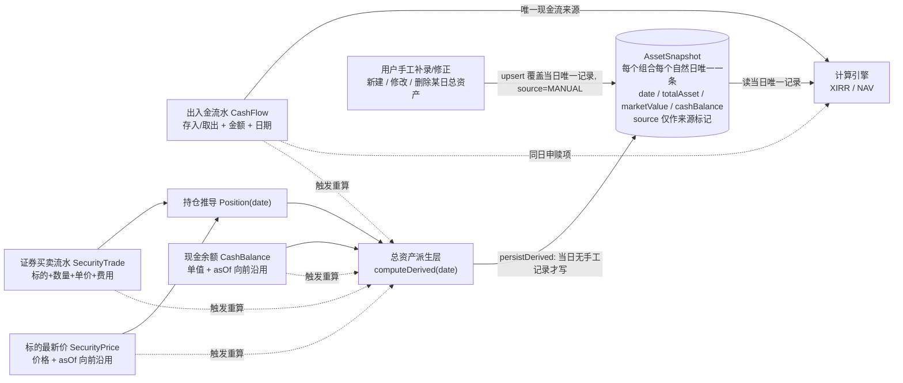

# 投资收益统计系统 — 增量 PRD v2.3（出入金 / 持仓方案B / 现金余额 / 总资产每日唯一一条记录）

> **作者**：产品经理 许清楚（Alice）
> **版本**：v2.3
> **范围**：`packages/backend` + `packages/web` + `packages/shared`，不含 `harmonyos`
> **基线文档**：`docs/PRD.md` v1.2、`docs/PRD-modules.md` v1.2。本文档为四个模块（出入金 / 持仓 / 现金余额 / 总资产记录）的**当前权威口径**，与基线文档表述冲突处**以本文档为准**。

> 🔑 **一句话总纲**
> **总资产 = 持仓当日最新市值 + 现金余额，由系统自动派生并每日落库。**
> **「每日总资产记录」表中，每个组合每个自然日有且仅有一条记录，不论它是自动生成（`source='DERIVED'`）还是用户手工记录（`source='MANUAL'`）。手工记录取代同日的自动记录；自动派生遇到手工记录时跳过、不覆盖。**
> —— 即：**自动为主、手工为辅、每日唯一。**

---

## 1. 目标与范围

### 1.1 产品目标

| # | 目标 | 衡量口径 |
|---|------|---------|
| **G1** | **现金流与资产口径彻底分离** | 出入金流水是 XIRR 现金流与 NAV 申赎项的**唯一**来源；证券买卖与现金余额**不进现金流**，只进资产 |
| **G2** | **持仓可精确回溯到任意历史日期** | 持仓由证券买卖流水回放推导，任意日期的数量为**精确值**，不依赖用户手工快照 |
| **G3** | **总资产成为稳定、可索引、可审计的每日事实** | 每个组合每个自然日在库中**至多一行**总资产记录；净值/XIRR 引擎只读这张表 |

### 1.2 范围

**In Scope（本次交付）**

- 出入金管理（原「交易」模块的正名与字段收敛）
- 持仓模块方案 B（证券买卖流水 → 持仓推导 → 持仓列表）
- 标的最新价 `SecurityPrice`（手工维护、向前沿用）
- 现金余额 `CashBalance`（独立手填对账值）
- 总资产每日记录 `AssetSnapshot`（自动派生落库 + 手工 CRUD，每日唯一一条）
- 计算引擎（XIRR / NAV）的**取数来源与触发链路**改造

**Out of Scope（v1 明确不做，均列 P2）**

- 已实现盈亏（卖出锁定盈亏）、公司行为（拆股/合股/配股/股票股利）、FIFO 成本法、标的级 XIRR、多币种、多现金账户

### 1.3 与基线文档保持一致的部分（不在本次改动面内）

- `PRD.md` §3.2 / §3.3 / §3.4 的 **XIRR 公式、单位份额法、当年净值公式**，以及附录 A/B 伪代码：**数学口径一行不改**
- `TransactionType` 仍为 `BUY/SELL` 两值（**C-10 有效**）；`amount` 仍是现金流的唯一口径（**C-02 有效**）
- `DividendRecord` / `FeeRecord`（**D-02 / D-03**）继续存在于持仓模块，继续**不参与收益计算**
- `C-01`~`C-07` 各项通用约束继续有效

---

## 2. 关键决策速览（含决策理由）

> 本节是全文的决策索引。**每条决策的"为什么"直接写在这里及对应正文章节**，架构师不需要去别处考古。

| #                 | 决策                                                                                                                   | 生效口径                                                                                                                                                                                                                                    | **为什么这么定**                                                                                                                                                                                                                                     |
| ----------------- | -------------------------------------------------------------------------------------------------------------------- | --------------------------------------------------------------------------------------------------------------------------------------------------------------------------------------------------------------------------------------- | ---------------------------------------------------------------------------------------------------------------------------------------------------------------------------------------------------------------------------------------------- |
| **A′**            | **存量数据直接清空**                                                                                                         | 本项目库为**开发/测试库**，`transactions` / `holdings` / `asset_snapshots` / CASH 类 `securities` 记录一律清空。migration 只做两件事：**① 清空/删除旧表；② 建立新表结构**。**无任何数据转换逻辑**                                                                                       | ① 库中不存在需要保全的生产数据资产，迁移成本纯属浪费；② 清库使 migration 退化为纯 DDL，省掉存量语义甄别、"迁移日"概念、回滚数据备份方案三类高风险工作；③ 空库直接按 `UNIQUE (portfolioId, date)` 建表即可，**不存在"存量同日多条记录需要合并"的难题**；④ 方案 B 所需的持仓数据本来就必须由用户重新录入买卖流水才能产生，旧快照无法转写为流水                                         |
| **B′**            | **历史总资产记录可手工新建 / 修改 / 删除**                                                                                           | 用户可在 `/snapshots` 页对**任意历史日期**的总资产记录做完整 CRUD（`source='MANUAL'`、`valuationFlag='MANUAL_INPUT'`）                                                                                                                                          | ① 上游三项数据（买卖流水 / 现价 / 现金余额）在真实场景下**必然存在无法还原的情况**：历史数据缺失、券商对账单口径差异、一次性资产变动无法建模；② 若只允许改上游，用户遇到这类情况就彻底无解，历史净值曲线会长期带错；③ 手工修正也是 W-1 / W-2「总资产双计 / 出入金与现金脱节」两个已知产品代价的**最后兜底通道**；④ 「只读」仅描述总资产卡（当前值）的**展示形态**，不等同于"全系统禁止手工录入"                           |
| **C′**            | **每日总资产记录：每个组合每个自然日有且仅有一条，不论来源**                                                                                     | 唯一约束 `UNIQUE (portfolioId, date)`（**不含 `source`**），由数据库唯一索引强制。手工写入 **upsert 取代**当日记录；自动派生**遇手工记录跳过**                                                                                                                                    | ① **读取路径彻底消除优先级判断** —— 引擎和 UI 直接读"当日那一行"，不需要判断来源、不需要排序取舍，取数逻辑与索引都最窄最快；② 同日并存两条会制造"哪条才是真的"的持久心智负担，并让所有下游聚合（曲线、CSV、堆叠图、一致性校验）都要重复实现同一套优先级规则，任一处漏实现即产生口径分裂；③ 唯一索引把"每日一条"从**惯例**升级为**数据库层不变量**，可被测试直接断言（`COUNT(*) ≤ 1`）；④ 用户心智直观 —— 「这一天的总资产就是这个数」 |
| **方案 B**          | **持仓 = 交易明细法**（由证券买卖流水推导）                                                                                            | 新增 `SecurityTrade`（标的级买卖流水），持仓状态由流水按 `(date, createdAt)` 升序回放推导；**取消持仓的手工快照录入**，`Holding` 每日快照模型废弃                                                                                                                                      | ① 流水是**原始凭证**，可回放、可审计、可修正，任意历史日期的持仓数量都是**精确值**；而手工快照一旦漏录/错录即不可追溯，且无法回答"这个数是怎么来的"；② 总资产要每日落库，其第一加项（持仓市值）必须有稳定可重算的来源，否则历史值无法幂等重建；③ 用户录入负担从"每天一条快照"降为"发生买卖才录一条"，长期成本更低；④ 卖出校验、成本推导、占比等能力都依赖流水级数据，快照法做不到                                           |
| **决策 B（现金）**      | **现金余额零联动**                                                                                                          | `CashBalance` 是用户自行维护的**对账值**：出入金**不改**它，证券买卖**不改**它，系统**不代算**。仅在保存后给"是否同步调整"的**软提示**                                                                                                                                                   | ① 系统无法可靠推断资金在券商现金 / 银行活期 / 在途之间的真实分布，代算必然出错且错得隐蔽；② 与其给一个"看起来对但不敢信"的自动值，不如让用户显式对账；③ 该决策的代价（W-1 / W-2 双计与净值虚高）是**已知且被接受的产品口径代价**，工程侧只做软提示，**严禁自作主张实现自动扣减**                                                                                       |
| **`source` 字段保留** | `source ∈ {'DERIVED','MANUAL'}` **保留为普通字段，但不参与唯一键**                                                                  | **第一理由（不可省）**：它是**区间重建的删除保护开关** —— 所有区间重建的 `DELETE` 必须带 `AND source='DERIVED'`，这是**用户手工记录不被自动重算静默抹掉的唯一保护机制**（W-5）。其次：② UI 来源徽标（`🤖自动`/`✋手工`）与筛选、CSV 导出；③ 审计追溯。<br/>🔴 **但它绝不可出现在任何读取路径的优先级判断中** —— 一旦读路径依赖 `source`，"每日唯一"带来的全部简化收益即告消失 |                                                                                                                                                                                                                                                |
| **手工优先 / 派生跳过**   | 手工 `upsertManual()` **无条件覆盖**当日行；自动 `persistDerived()` 当日为 `MANUAL` 时**跳过、不写、不覆盖**                                   | ① **用户的显式意图优先于系统的推算结果** —— 用户手工录入必然发生在"他知道系统算错了"的时刻；② 自动派生是**高频、无人值守**的（五类事件任一发生即触发区间重建），若允许它覆盖手工值，用户的修正会在毫无感知的情况下被抹掉，且**无法恢复**（同日不再保留旧值）；③ 反过来让手工无条件覆盖是安全的 —— 手工写入是**低频、有二次确认、有 `note` 留痕**的显式操作                                       |                                                                                                                                                                                                                                                |
| **派生服务拆两函数**      | `computeDerived(portfolioId, date)`（**纯计算、不落库**）与 `persistDerived(portfolioId, dateRange)`（**落库**，内含 upsert 与手工跳过逻辑） | ① 每日唯一模型下，被手工取代的那天**库里不再保留自动值**，"系统本应算出多少"只能**实时算**——这是差异提示、`↺ 重置为自动值`、差异汇总统计三项能力的**唯一数据来源**；② 纯函数无副作用，可被 UI 随意、批量、懒加载调用，不必担心误写库；③ 把落库副作用**收敛到 `persistDerived()` 唯一一处**，才能在这一处强制"删除保护 + `ON CONFLICT DO NOTHING`"双保险，并禁止其他路径直写该表       |                                                                                                                                                                                                                                                |

---

## 3. 数据流总览



> 🔑 **三句话钉死数据流**：
> 1. **出入金只贡献「现金流」；持仓市值 + 现金余额只贡献「总资产」。两者在计算引擎里汇合，谁变了都要触发重算。**
> 2. **总资产不是"算完就丢"的中间值 —— 它每天在 `AssetSnapshot` 里留下一条记录，计算引擎读的是这张持久化表，而不是运行时拼装。**
> 3. **这张表每个组合每个自然日只有一条记录。这条记录要么是派生层写的，要么是用户写的，二者不并存。读取方永远只需要"取当日那一条"，不做任何优先级判断。**

---

## 4. 模块定义（精确）

### 4.1 出入金管理（`/cashflows`）

**定位**：纯组合级现金流账本，**XIRR 现金流的唯一来源**、NAV 申赎项的唯一来源。

| 项 | 定义 |
|----|------|
| 字段 | `date`（日期）、`type`（`BUY`=存入 / `SELL`=取出，UI 只出现"存入/取出"）、`amount`（金额，>0）、`note`（备注） |
| **不含字段** | ❌ `securityId` / `quantity` / `price` / `fee` **不属于出入金**，归属持仓模块的 `SecurityTrade` |
| 语义 | `amount` = 资金**真实进出投资组合边界**的金额（从银行卡打进来 / 提回银行卡）。**组合内部的证券买卖不是出入金** |
| 枚举 | 维持 `BUY/SELL` 两值（C-10），`xirr.service.ts` / `nav.service.ts` 的二分判断逻辑**不改** |
| 页面归属 | 出入金管理页（`/cashflows`，`/transactions` 保留 301 重定向），并**并入**现金余额录入区 + **总资产展示区**（当前值 + 近期走势，主卡只读，另设「管理历史记录」入口，见 §6.1【A】） |
| 初始数据 | `transactions` 表为空表建立，由用户以出入金语义录入（决策 A′） |

---

### 4.2 持仓模块（方案 B — 交易明细法，`/holdings`）

**定位**：以**证券买卖流水**为原始凭证，**推导**出任意日期的持仓状态；持仓市值是总资产的第一个加项。

#### 4.2.1 实体

| 实体 | 说明 |
|------|------|
| `SecurityTrade`（证券买卖流水） | `date / securityId / side(BUY_SEC \| SELL_SEC) / quantity / price / fee / note`。**独立枚举**，⚠️ 严禁复用 `TransactionType`（C-10） |
| `SecurityPrice`（标的最新价） | `securityId / price / asOf`。**与现金余额同构的"最新值 + 向前沿用"语义**。行情自动获取落地前由用户手工更新 |
| `Security` | 保留现有模型；`type` 枚举中的 `CASH` **弃用**（见 §4.3） |
| `Holding` | ❌ **不存在**。持仓不落库、不手工录入，一律由 `SecurityTrade` 回放推导 |

#### 4.2.2 推导算法（P0 必须实现，口径不得自由发挥）

按 `(date, createdAt)` 升序回放该标的全部流水：

```
买入 (q, p, fee):
    cost_total = cost_total + q × p + fee        // 费用计入成本
    qty        = qty + q
    avgCost    = cost_total / qty                // 移动加权平均

卖出 (q, p, fee):
    qty        = qty − q
    avgCost    = 不变                             // ← 单位成本价不变
    cost_total = qty × avgCost                   // ← 成本额随数量等比减少
    // v1 不记录本次卖出的已实现盈亏；卖出费用 fee 仅作信息记录，不回冲成本

清仓 (qty == 0):
    avgCost = 0, cost_total = 0                  // 归零重置，下次买入重新起算
    该标的从持仓列表默认隐藏（可切换"显示已清仓"）
```

> ⚠️ **歧义澄清（架构师最易做错）**：「卖出不减成本」指的是 **`avgCost`（单位成本价）不变**，**不是**成本总额不变。若成本总额不变，清仓后会残留幽灵成本。**以上伪代码为准。**

**估值规则**：

- `持仓数量(s, date)` = 该标的 ≤ date 全部流水回放结果
- `现价(s, date)` = `SecurityPrice` 中 asOf ≤ date 的**最后一条**（向前沿用）；**若无任何价格记录 → 回退用 `avgCost` 估值**，UI 标注「按成本估值」徽标
- `持仓市值(date)` = `Σ 数量(s,date) × 现价(s,date)`
- `持仓市值(date)` 是每日总资产记录的**第一个加项**，其口径与本节完全一致，**不得另起炉灶**

#### 4.2.3 持仓列表

各标的**当前持仓**一行：`标的名称 / 代码 / 类型 / 数量 / 成本价(avgCost) / 现价(+asOf) / 成本额 / 市值 / 浮动盈亏 / 盈亏率 / 占比`。
行级派生值一律**不落库**，由 service 计算返回。

> **边界澄清（避免误读）**：「派生值不落库」**仅适用于持仓列表的行级派生值**（市值 / 盈亏 / 占比等）。**组合级总资产是唯一例外 —— 它必须每日落库**（`AssetSnapshot`，每日唯一一条），因为 NAV / XIRR 序列需要稳定、可回溯、可索引的历史值。

---

### 4.3 现金余额（`CashBalance`）

| 项                             | 定义                                                                                                                                                                |
| ----------------------------- | ----------------------------------------------------------------------------------------------------------------------------------------------------------------- |
| 模型                            | **独立表** `CashBalance`：`portfolioId / amount / asOf / note`。保留变更历史（多行），语义上「当前值 = asOf 最大的那条」                                                                       |
| 语义                            | **最新值 + 向前沿用**。8/2 填 100 → 8/2 起余额 100；8/3 未改 → 仍 100；8/4 改 200 → 8/4 起 200。8/1（首条之前）→ 视为 0                                                                       |
| 录入                            | **手填，单一入口**，位于**出入金管理页**的「现金余额」区块。这是**资产口径的常规手填项**；总资产手填属于**例外性补录**，二者性质不同                                                                                        |
| 联动                            | 🔴 **零联动**（决策 B）：存入/取出**不改**它，证券买卖**不改**它。只在保存后给"是否同步调整"的**软提示**                                                                                                  |
| 参与计算                          | ✅ **参与** —— 作为每日总资产记录的**第二个加项**（`cashBalance(date)` = asOf ≤ date 的最后一条），随后间接进入 XIRR 终值与 NAV 分子                                                                   |
| 变更后的效果                        | 修改任一条 `CashBalance` → **从该 asOf 起级联重算并覆盖受影响日期的自动记录**（`CASH-P0-03` + `SNAP-P0-04a`）。**仅覆盖 `source='DERIVED'` 的记录；用户手工记录的日期被跳过，值保持不变**                              |
| **`SecurityType.CASH` 的口径裁决** | 🔴 **弃用 `CASH` 标的口径**。**理由**：若同时允许"现金类标的"和"现金余额字段"，两者会在 `totalAsset` 里**双计**。处置：① 新建标的时**隐藏** `CASH` 选项；② 枚举值保留（避免破坏性迁移），标注 `@deprecated`；③ CASH 类标的记录不予建立（决策 A′） |

---

### 4.4 总资产 / 每日唯一记录（`AssetSnapshot`）

#### 4.4.1 最终口径（一句话定义）

> **总资产（TotalAsset）= 持仓当日最新市值 + 当日现金余额，由系统自动派生并每日落库。**
> 🔴 **硬约束**：**「每日总资产记录」表中，每个组合每个自然日有且仅有一条记录，不论其来源是自动生成还是手工记录。**
> **写入方有两个：派生层（自动，`source='DERIVED'`）与用户（手工，`source='MANUAL'`）。二者写的是同一行：**
> - **用户手工写入 → upsert 覆盖该日记录，`source` 改写为 `MANUAL`（手工取代自动）。**
> - **派生层写入 → 当日若已是 `MANUAL` 记录，则跳过、不写、不覆盖（手工优先）；否则写入/更新 `DERIVED` 记录。**
> - **读取 → 直接读当日那一条，无需任何优先级判断。**

形式化：

```
totalAsset(D) = marketValue(D) + cashBalance(D)          // 自动派生口径

其中：
  marketValue(D) = Σ_s [ quantity(s, D) × price(s, D) ]
      quantity(s, D) = 该标的 ≤D 全部 SecurityTrade 回放结果（精确，方案B）
      price(s, D)    = SecurityPrice 中 asOf ≤ D 的最后一条（向前沿用）
                       若无任何价格 → 回退 avgCost(s, D)，记录标记「按成本估值」
  cashBalance(D)  = CashBalance 中 asOf ≤ D 的最后一条（向前沿用）
                       若无任何记录 → 0

落库（每日唯一一条）：
  AssetSnapshot { portfolioId, date=D, totalAsset, marketValue, cashBalance,
                  source, valuationFlag, note, recordedAt }
  UNIQUE (portfolioId, date)          // ← 唯一约束不含 source

写入语义（upsert，唯一权威口径）：
  persistDerived(portfolioId, D):
      INSERT (…, source='DERIVED')
      ON CONFLICT (portfolioId, date) DO UPDATE
        SET … WHERE AssetSnapshot.source = 'DERIVED'   // 当日为 MANUAL 则不更新
      // 等价表述：当日已有手工记录 → 跳过；否则写入或刷新自动记录

  upsertManual(portfolioId, D, totalAsset, …):
      INSERT (…, source='MANUAL')
      ON CONFLICT (portfolioId, date) DO UPDATE
        SET totalAsset=…, marketValue=…, cashBalance=…,
            source='MANUAL', valuationFlag='MANUAL_INPUT', note=…, recordedAt=now()
      // 无条件覆盖，手工取代自动

  deleteRecord(portfolioId, D):
      DELETE WHERE portfolioId=… AND date=D
      // 之后若 D 属事件日 → 由 persistDerived 立即回填一条 DERIVED（见 Q-B17）

读取规则（唯一权威口径，两级）：
  effectiveTotalAsset(D)
      = AssetSnapshot(portfolioId, D).totalAsset       若该日存在记录（不论来源）
      = effectiveTotalAsset(前一个有记录的日期)          否则（前值填充，见 Q-B10）
      = 0                                             否则（首条记录之前）

自动值的实时计算（不落库）：
  computeDerived(portfolioId, D) -> { totalAsset, marketValue, cashBalance, valuationFlag }
      // 纯函数，仅计算不写库。用于：手工记录行的「自动值 / 差异」提示、
      //「重置为自动值」操作、差异汇总统计。
      // 🔴 由于同日不再保留自动记录行，此函数是获取"本应是多少"的唯一途径。
```

#### 4.4.2 与上游两个数据源的关系（责任边界）

| 上游 | 谁维护 | 口径 | 在总资产中的角色 |
|------|--------|------|----------------|
| **持仓市值** | 系统推导（用户只录买卖流水 + 现价） | 方案B 流水回放数量 × ≤date 最后一条现价（无价回退 avgCost） | 加项 1 |
| **现金余额** | 🖊️ **用户手填当前值**（决策 B） | `asOf ≤ date` 的最后一条，向前沿用；首条之前视为 0 | 加项 2 |
| **总资产（自动）** | 🤖 **系统自动，每日落库** | 加项 1 + 加项 2 | **当日唯一记录（`source='DERIVED'`）** |
| **总资产（手工）** | 🖊️ **用户按需补录/修正** | 用户直接给定的 `totalAsset`（不参与加项计算） | **取代当日唯一记录（`source='MANUAL'`）** |

> 🔧 **口径澄清**：
> - **常规路径**：用户维护「买卖流水 + 现价 + 现金余额」三项上游 → 系统自动算出总资产并每日记录。**用户不需要碰总资产。**
> - **例外路径**：当上游数据无法还原真实情况（历史缺失、券商对账单口径差异、一次性资产变动无法建模）时，用户可**直接手工新建/修改某日总资产记录**。该操作会**取代**当日的自动记录，成为该日唯一且权威的值。
> - **不可能出现的状态**：同一组合同一天既有自动记录又有手工记录。若在库中观察到这种情况，即为**数据缺陷**，需按唯一约束修复。
> - 现金余额与总资产手填**不是同一类东西**：现金余额是**日常维护项**，总资产手填是**例外补录**。

#### 4.4.3 历史精度的口径局限

历史某日 D 的自动记录中：**数量来自流水（精确）**，**价格与现金来自"向前沿用的最新值"（近似）**。

> 🟡 **必须向用户明示**：用户若长期不更新现价 / 现金余额，历史曲线会呈现"阶梯状横盘"，这是**预期行为，不是 bug**。UI 需在净值/XIRR 图表与历史总资产表加一行说明，并在受影响记录上打 `valuationFlag`（`EXACT` / `CARRIED_FORWARD` / `COST_BASED`）。
> 由于这些近似值会**被固化落库**，`valuationFlag` 不是"UI 提示"而是**记录字段，必须持久化**。
> **手工记录的 `valuationFlag` 固定为 `MANUAL_INPUT`**，UI 用**独立徽标**与自动记录区分，避免用户误以为是系统算出来的。

#### 4.4.4 计算日历与稀疏落库（`SNAP-P0-03` 口径）

以「**事件日**」为准生成序列：

```
事件日集合   = 出入金日期 ∪ 证券买卖日期 ∪ 价格更新日期(asOf) ∪ 现金余额变更日期(asOf) ∪ 今日
快照日期集合 = 总资产记录表中实际存在的日期集合
             （因每日唯一，直接 SELECT DISTINCT date 即可，无需区分来源做并集运算）
```

- **落库策略**：仅对事件日（含今日）写入记录 → **稀疏存储**，避免 5 年 1800 天全量冗余。
- **读取策略**：查询任意日期区间时，对无记录的自然日按**前值填充**补齐，对外表现为"每日都有记录"。前值填充直接取前一个有记录日期的 `totalAsset`（**无需判断来源**）。
- **重算策略**：任一事件发生在日期 D → **删除并重建 `[D, today]` 区间内的记录**（幂等，见 W-4）。
  🔴 **关键约束**：
  - `DELETE` 语句**必须带 `AND source = 'DERIVED'`** —— 用户手工记录的日期不在删除范围内。
  - 重建 `INSERT` **必须带 `ON CONFLICT (portfolioId, date) DO NOTHING`**（或等价的手工跳过判断）—— 双保险，确保即使删除阶段有遗漏，也不会覆盖手工记录。
- 该策略的取舍与替代方案见 `Q-B10`（是否改为全自然日物化）。

#### 4.4.5 写入 / 冲突行为规范（唯一权威表）

> 核心原则：**每日唯一一条 · 手工覆盖自动 · 自动跳过手工**。

| 场景 | 行为 |
|------|------|
| **当日无任何记录，派生层触发** | 插入一条 `source='DERIVED'` 记录 |
| **当日已有 `DERIVED` 记录，派生层再次触发** | **更新**该行（`totalAsset`/拆解/`valuationFlag`/`recordedAt` 全部刷新），`source` 保持 `DERIVED`。仍是一条 |
| **当日已有 `MANUAL` 记录，派生层触发** | 🔴 **跳过，不写入、不覆盖、不新增**。该日记录保持为用户的手工值 |
| **当日无任何记录，用户手工新建** | 插入一条 `source='MANUAL'`、`valuationFlag='MANUAL_INPUT'` 的记录 |
| **当日已有 `DERIVED` 记录，用户手工录入** | 🔴 **upsert 覆盖该行**：值改为用户填写值，`source` 改写为 `MANUAL`，`valuationFlag` 改为 `MANUAL_INPUT`，刷新 `recordedAt`/`note`。**原自动值不保留在库中**（需要对比时由 `computeDerived(date)` 实时算出） |
| **当日已有 `MANUAL` 记录，用户再次编辑** | 更新该行，`source` 保持 `MANUAL` |
| **用户删除某日记录** | 物理删除该行。随后：若该日属于**事件日集合**（§4.4.4）→ 由派生层**立即回填一条 `DERIVED` 记录**；若不属于事件日 → 该日无记录，读取时按**前值填充**（见 `Q-B17`） |
| **「重置为自动值」（`SNAP-P0-07`）** | 调用 `computeDerived(date)` → **upsert 覆盖该行**，`source` 置回 `'DERIVED'`、`valuationFlag` 置回计算结果。**等价于"撤销手工修改"**。仍是一条 |
| **上游事件触发区间重建** | `DELETE … WHERE source='DERIVED' AND date BETWEEN D AND today` → 逐事件日 `INSERT … ON CONFLICT DO NOTHING`。**用户手工记录的日期原样保留，值不变、`source` 不变** |
| **手工记录能否指向未来日期** | ❌ 不允许，`date` 不可晚于今日（与其他模块校验一致） |
| **手工记录的必填校验** | `totalAsset ≥ 0`；`marketValue`/`cashBalance` 选填（`Q-B15`）；`note` 强提示填写（便于日后回溯，见 W-6） |
| **手工录入的二次确认** | 若当日已存在自动记录，弹窗必须显示「该日系统自动计算值为 ¥X，保存后该值将被您填写的值**取代**」并要求确认 |

#### 4.4.6 `source` 字段的定位

🔴 **`source` 不是唯一键的一部分。** 它仅用于三件事：

1. **区间重建的删除保护开关**（`DELETE … WHERE source='DERIVED'`）—— **这是最关键、不可省的用途**，是手工记录不被自动重算抹掉的唯一机制（W-5）；
2. UI 来源徽标（`🤖自动` / `✋手工`）与筛选、CSV 导出列；
3. 审计追溯。

🔴 **任何读取路径都不得依赖 `source` 做优先级判断**（严禁 `WHERE source='DERIVED'`、`ORDER BY source` 之类出现在取数逻辑中）。

---

## 5. 需求池（P0 / P1 / P2）

### 5.1 出入金管理 `FLOW-`

| 编号 | 优先级 | 功能点 | 描述 | 验收标准 |
|------|--------|--------|------|---------|
| FLOW-P0-01 | P0 | 模块正名与字段剥离 | 交易 → 出入金管理；从表单/列表/DTO/共享类型中移除 `securityId/quantity/price/fee` | 1) UI 全站无"交易/买入/卖出"字样，统一"出入金/存入/取出"；2) 四个明细字段在出入金相关接口与表单中**完全消失**；3) 枚举仍为 `BUY/SELL` 两值；4) 路由 `/transactions` → `/cashflows` 并保留重定向 |
| FLOW-P0-02 | P0 | 出入金 CRUD + 列表 | 日期/类型/金额/备注的增删改查；筛选（日期范围、类型多选）、排序、分页 | 1) 列表列 = 日期/类型/金额/备注/操作；2) 筛选写入 URL query；3) 1000 条分页 < 500ms；4) 空状态四态齐全（C-06） |
| FLOW-P0-03 | P0 | **总资产区块（自动记录 + 历史入口）** | 页面顶部展示 `totalAsset` 的**当日记录值**，并附精简历史曲线。**卡片主体不可编辑**，但提供「管理历史记录 →」入口跳转 `/snapshots` 进行手工 CRUD | 1) 显示总额 + 拆解（持仓 ¥X / 现金 ¥Y）+ 各自 asOf；2) **卡片主体无任何输入控件与行内编辑图标**；3) 近 N 期（默认 30 天）迷你曲线或紧凑列表；4) 上游任一变更后自动刷新且曲线同步更新；5) 常驻文案「**由系统每日自动记录；如需补录或修正历史，请前往「管理历史记录」**」；6) 若**当日记录的 `source='MANUAL'`**，卡片显示 `✋手工` 徽标 + 「系统自动计算值为 ¥X」提示（该值由 `computeDerived(today)` **实时计算**，不从库中读取） |
| FLOW-P0-04 | P0 | 重算结果反馈 | 增删改出入金后 toast 提示重算范围 | 返回 `{ fromDate, affectedDays }`；>2s 显示进度；失败回滚。`affectedDays` 需同时反映**被重写的自动记录条数**；若区间内存在手工记录日期，toast 追加「其中 N 天为您的手工记录，已跳过、未被覆盖」 |
| FLOW-P0-05 | P0 | 校验一致性 | 前端 zod 与后端 DTO 规则一致 | 1) `amount > 0`；2) 日期不可未来；3) 首笔必须为存入；4) 错误提示中文指向字段 |
| FLOW-P0-06 | P0 | 现金余额同步软提示（W-2） | 存入/取出保存成功后提示"是否同步调整现金余额" | 1) toast + 快捷跳转到现金余额录入；2) **绝不自动修改** `CashBalance`；3) 可在设置中关闭该提示 |
| FLOW-P1-01 | P1 | CSV 导入/导出 | 模板含新字段集（无证券明细列） | 含 UTF-8 BOM；行级报错定位 |
| FLOW-P1-02 | P1 | 批量删除 | 多选批量删除 | 单次事务 + 只触发一次重算（含一次区间重建） |
| FLOW-P2-01 | P2 | 出入金 ↔ 现金余额对账视图 | 展示"理论现金 vs 实填现金"的差异说明（**仅提示，不联动**） | 优先级已裁决：**维持 P2**（见 `Q-B5`） |

### 5.2 持仓（方案 B）`HOLD-B-`

| 编号           | 优先级 | 功能点         | 描述                                                                                        | 验收标准                                                                                                                                                |
| ------------ | --- | ----------- | ----------------------------------------------------------------------------------------- | --------------------------------------------------------------------------------------------------------------------------------------------------- |
| HOLD-B-P0-01 | P0  | 证券买卖流水模型    | 新增 `SecurityTrade`：`date/securityId/side/quantity/price/fee/note`，独立枚举 `BUY_SEC/SELL_SEC` | 1) 不复用 `TransactionType`（C-10）；2) `quantity>0`、`price>0`、`fee≥0`；3) 日期不可未来                                                                          |
| HOLD-B-P0-02 | P0  | 买卖明细录入表单    | 标的（下拉 + 内联新建）/ 方向 / 日期 / 数量 / 单价 / 费用 / 备注；自动显示成交额预览                                      | 1) 成交额 = 买入 `q×p+fee`、卖出 `q×p−fee`（只读预览）；2) 保存后持仓列表与总资产区块即时刷新；3) 保存后**自当日起的自动总资产记录被重建**（手工记录日期跳过）                                                   |
| HOLD-B-P0-03 | P0  | **持仓推导引擎**  | 按 §4.2.2 算法由流水回放推导任意日期持仓                                                                  | 1) 单测覆盖：多次买入均价、部分卖出、全部清仓后再买入、同日多笔、跨日回放；2) 精度：数量 6 位、金额 2 位、均价 6 位；3) 修改/删除历史流水后推导结果与全量重放一致                                                          |
| HOLD-B-P0-04 | P0  | 持仓列表        | 各标的当前持仓（列见 §4.2.3）                                                                        | 1) 市值=数量×现价，成本额=数量×avgCost，盈亏=市值−成本额，盈亏率=盈亏/成本额；2) 占比之和=100%（误差≤0.01%）；3) 默认按市值降序；4) 红涨绿跌；5) `qty=0` 默认隐藏，可切换显示                                     |
| HOLD-B-P0-05 | P0  | 标的最新价录入     | `SecurityPrice`：价格 + asOf，向前沿用；支持列表内联编辑与批量保存                                              | 1) 无价格时回退 `avgCost` 估值并显示「按成本估值」徽标；2) 更新价格触发总资产变更 → 重写受影响日期的自动记录（手工记录日期跳过）；3) 显示每个价格的 asOf                                                          |
| HOLD-B-P0-06 | P0  | 持仓汇总条       | 总市值 / 总成本 / 总浮盈 / 总盈亏率 / 标的数                                                              | 与明细逐行求和一致；与当日记录的 `marketValue` 字段一致（误差 ≤ 0.01）。**该一致性断言仅在当日记录 `source='DERIVED'` 时生效**；若当日记录为 `MANUAL`，二者**允许不一致**，UI 提示「今日总资产使用了您的手工记录」（见 `Q-B16`） |
| HOLD-B-P0-07 | P0  | 买卖流水列表与编辑删除 | 按标的/日期筛选，可编辑删除                                                                            | 1) 编辑删除后从该日起级联重算（沿用 `recalculation.service`）；2) toast 提示影响范围                                                                                        |
| HOLD-B-P0-08 | P0  | 卖出数量硬校验     | 卖出数量 > 该日持仓数量时**拒绝保存**                                                                    | 1) 明确提示"当前持有 X，最多可卖 X"；2) 插入历史日期流水时需校验后续日期不会出现负持仓                                                                                                   |
| HOLD-B-P1-01 | P1  | 买卖流水 CSV 导入 | 模板 + 行级报错 + 一次性重算                                                                         | —                                                                                                                                                   |
| HOLD-B-P1-02 | P1  | 持仓历史回看      | 选择历史日期查看当时持仓结构 + 堆叠面积图                                                                    | 日期限定在首笔流水之后                                                                                                                                         |
| HOLD-B-P1-03 | P1  | 资产配置图       | 标的占比 / 类型占比双环形图                                                                           | 占比 <3% 合并"其他"                                                                                                                                       |
| HOLD-B-P1-04 | P1  | 行情自动获取      | 自动更新 `SecurityPrice`                                                                      | 自动更新同样必须触发自动记录重建（且需防抖，见 `Q-B8`）                                                                                                                     |
| HOLD-B-P2-01 | P2  | 已实现盈亏       | 卖出锁定盈亏                                                                                    | —                                                                                                                                                   |
| HOLD-B-P2-02 | P2  | 公司行为        | 拆股/合股/配股/股票股利                                                                             | —                                                                                                                                                   |
| HOLD-B-P2-03 | P2  | FIFO 成本法    | —                                                                                         | —                                                                                                                                                   |
| HOLD-B-P2-04 | P2  | 标的级 XIRR    | 依赖已实现盈亏与标的级现金流口径                                                                          | —                                                                                                                                                   |

> **保留项**：`DividendRecord` / `FeeRecord`（D-02 / D-03）继续存在于持仓模块，继续**不参与收益计算**。

### 5.3 现金余额 `CASH-`

| 编号 | 优先级 | 功能点 | 描述 | 验收标准 |
|------|--------|--------|------|---------|
| CASH-P0-01 | P0 | 现金余额模型 | `CashBalance`：`portfolioId/amount/asOf/note`；查询语义 = ≤date 的最后一条 | 1) `amount ≥ 0`；2) `asOf` 不可未来；3) 同一 asOf 重复录入走 upsert 覆盖；4) 首条之前的日期返回 0 |
| CASH-P0-02 | P0 | 单一录入入口 | 出入金管理页的「现金余额」区块，一个输入框 + 生效日期 + 保存 | 1) 显示"当前余额 ¥X（自 YYYY-MM-DD 起沿用）"；2) 全站不存在第二个**现金余额**录入入口 |
| CASH-P0-03 | P0 | 变更触发重算**并重写自动记录** | 新增/修改/删除现金余额记录 → 从该 asOf 起级联重算 | 1) toast 提示重算范围；2) `[asOf, today]` 区间的 **`source='DERIVED'`** 记录被 delete + re-insert；3) 历史总资产曲线相应段位同步变化；4) **区间内 `source='MANUAL'` 的日期不被删除、不被覆盖**，其展示值保持不变（**回归测试必须覆盖**） |
| CASH-P0-04 | P0 | 弃用 `SecurityType.CASH` | 新建标的时隐藏 CASH 选项，枚举标 `@deprecated` | 1) 新建/编辑标的下拉无"现金"；2) 不建立 CASH 类标的记录 |
| CASH-P0-05 | P0 | 买卖后同步软提示（W-1） | 证券买卖保存后提示"是否同步调整现金余额" | 1) 仅提示不联动；2) 可在设置关闭 |
| CASH-P1-01 | P1 | 变更历史列表 | 展示历次现金余额变更（日期/金额/备注），可编辑删除 | — |
| CASH-P2-01 | P2 | 多现金账户 | 区分券商现金/银行活期等 | — |

### 5.4 总资产 / 每日记录 `SNAP-`

| 编号 | 优先级 | 功能点 | 描述 | 验收标准 |
| ---- | ------ | ------ | ---- | -------- |
| SNAP-P0-01 | P0 | 总资产派生服务（**纯计算 + 落库两分**） | 提供总资产计算能力：持仓市值(date) + 现金余额(date)，并负责落库 | 1) 与持仓列表汇总条 + 现金余额展示逐项对齐（误差 ≤ 0.01）；2) 任一上游变更后取值立即变化；3) 计算结果**必须持久化**，同一 `(portfolioId, date)` **唯一一条**；4) **本服务是 `source='DERIVED'` 记录的唯一写入方**；手工记录由 `SNAP-P0-06` 的独立接口写入，两条写路径**必须分离**；5) **必须对外暴露纯计算函数 `computeDerived(portfolioId, date)`（只算不落库）**，供 UI 差异提示、`SNAP-P0-07` 重置、差异汇总统计调用 —— 因每日唯一模型下库中不保留"被覆盖的自动值"；6) 落库函数 `persistDerived()` **必须实现"当日记录为 `MANUAL` 则跳过"** 的语义（`ON CONFLICT DO UPDATE … WHERE source='DERIVED'`） |
| SNAP-P0-02 | P0 | 总资产卡数据契约 | 见 `FLOW-P0-03`（同一区块，此处定义数据契约） | 返回 `{ totalAsset, marketValue, cashBalance, priceAsOf, cashAsOf, date, source, valuationFlag, recordedAt }`；`source` 为 `DERIVED` 或 `MANUAL`（即当日唯一那条的来源）；当 `source='MANUAL'` 时额外返回 `derivedTotalAsset` —— 该值由 **`computeDerived(date)` 实时计算**得出（**不是**从库中另一行读取），用于差异提示；当 `source='DERIVED'` 时该字段为 `null` |
| SNAP-P0-03 | P0 | **计算触发闸门定义** | **事件驱动**：出入金 / 证券买卖 / 价格更新 / 现金余额变更 任一发生 → 从该日起级联重算 | 1) 四类事件均能触发；2) 计算日历按 §4.4.4 实现；3) **必须一并修复**「覆盖历史快照只重算当日」的存量缺陷（基线 §8.2 披露）；4) `daily_nav`/`daily_xirr` 的日期集合 = **总资产记录表中实际存在的日期集合**（每日唯一，无需并集运算）；5) **手工记录的增/改/删是第五类触发事件**，同样从该日起级联重算 NAV/XIRR（但**不重建自动记录**） |
| **SNAP-P0-04** | **P0** | **总资产每日自动记录（主项）** | 系统**每日**为组合生成一条总资产记录：`AssetSnapshot { date, totalAsset = marketValue(date) + cashBalance(date), source='DERIVED' }` | 1) 任一日期 D 被查询/被事件影响时，库中存在该组合 D 日的记录（或可由前值填充确定性推出，见 `Q-B10`）；2) 记录含拆解字段 `marketValue`/`cashBalance` 与 `valuationFlag`；3) 自动记录满足 `totalAsset == marketValue + cashBalance`（误差 0）；4) **当日已存在 `source='MANUAL'` 记录时，派生层跳过写入 —— 不覆盖、不新增第二条**；🔴 5) **同一 `(portfolioId, date)` 唯一（数据库层唯一索引强制），不论 `source` 取值**；6) 单测必须覆盖「同日先手工后触发派生 → 记录数仍为 1 且 `source='MANUAL'`、值未变」 |
| **SNAP-P0-04a** | **P0** | **事件驱动落库 / 重建（幂等）** | 出入金 / 证券买卖 / 现价更新 / 现金余额变更 任一写操作（增/改/删）发生于日期 D → **删除并重建 `[min(D, 原记录日期), today]` 区间内的自动记录** | 1) 四类事件均触发；2) 重复执行结果一致（幂等）；3) 批量写操作合并为一次区间重建（配合 `Q-B8`）；4) 重建失败整体回滚，不留半截数据；5) 记录 `recordedAt` 便于排查（W-4）；6) toast 反馈「已重算 X 天，更新 Y 条总资产记录，跳过 Z 条手工记录」；🔴 7) **`DELETE` 必须带 `AND source='DERIVED'`；`INSERT` 必须带 `ON CONFLICT (portfolioId, date) DO NOTHING`（双保险）。手工记录零影响 —— 回归测试必须覆盖此项（W-5）**；8) 重建后断言：区间内每个日期的记录数 ≤ 1 |
| **SNAP-P0-04b** | **P0** | **历史总资产记录查询与展示** | 提供 `GET /snapshots?from&to`：返回区间内每日总资产（当日记录值，无记录的自然日按前值填充补齐），含拆解与标记；前端在 `/snapshots` 表格 + 出入金页迷你曲线中展示 | 1) 列：日期 / 总资产 / 其中持仓 / 其中现金 / 来源(`🤖自动`/`✋手工`) / 估值标记(`精确`/`沿用`/`按成本`/`手工`) / **操作**；2) 支持日期区间筛选、来源筛选与导出 CSV；3) 曲线与列表数值一致；4) **提供编辑/删除操作列与「+ 新建记录」按钮**（详见 `SNAP-P0-06`）；5) 5 年区间（约 1800 点）查询 < 500ms；6) 手工记录行需视觉高亮，并**实时计算并展示同日自动值与差异**（调用 `computeDerived`，可批量计算；若性能不足，允许仅在展开行/hover 时按需计算）；7) **接口返回的每个日期至多一条记录** —— 若出现同日多条，视为数据缺陷需报警 |
| SNAP-P0-05 | P0 | **手工记录的约束与标注规范** | 手工录入入口的位置、标注与防误用约束 | 1) **出入金管理页的总资产卡内不得出现任何总资产输入控件**（手工入口只能在 `/snapshots` 历史记录管理页）；2) 手工记录在**所有**展示位置（卡片 / 列表 / 曲线 tooltip / CSV 导出）必须带 `✋手工` 标识；3) 新建/编辑手工记录时必须**实时显示同日自动派生值**作为参照，并二次确认，确认文案必须明确「该值将**取代**系统自动记录，此后该日不再保留自动值」；4) 后端自动写接口**不对外暴露**，仅供派生层内部调用；手工写接口对外暴露但需独立路由；5) **禁止任何接口/脚本绕过 `persistDerived()` / `upsertManual()` 直写 `asset_snapshots` 表** |
| **SNAP-P0-06** | **P0** | **历史总资产记录手工 CRUD（决策 B′ 主项）** | 用户可在 `/snapshots` 页**新建**某日总资产记录、**修改**已有记录、**删除**记录。手工写入 `source='MANUAL'`，`valuationFlag='MANUAL_INPUT'` | 1) 新建表单：日期*（不可未来；**允许选择已有自动记录的日期 —— 此时即为"覆盖"，不报"重复"错**）、总资产*（≥0）、其中持仓（选填）、其中现金（选填）、备注（强提示填写）；🔴 2) 保存走 **upsert**：该日无记录则插入，有记录则**就地覆盖并把 `source` 改写为 `MANUAL`**，**任何情况下该日记录数保持为 1**；3) 保存后该日展示值立即变为手工值，`✋手工` 徽标出现；4) 修改后立即触发 `[date, today]` 的 NAV/XIRR 重算并 toast 反馈；5) **删除**：物理删除该日记录；若该日属事件日则由派生层立即回填一条自动记录，否则该日无记录、读取时前值填充（见 `Q-B17`）；同样触发 `[date, today]` 重算；6) **删除入口对自动记录也可见**（历史总资产记录允许手工删除），但删除自动记录时提示「该日属事件日，删除后系统会立即重新生成」；7) 全流程二次确认弹窗，明确告知覆盖/删除后果 |
| **SNAP-P0-07** | **P0** | **以自动值重置某日记录（W-6 处置）** | 提供「↺ 重置为自动值」操作：单条重置 + 按日期区间批量重置 | 🔴 1) **实现方式**：调用 `computeDerived(date)` → **upsert 覆盖该行** → `source` 置回 `'DERIVED'`、`valuationFlag` 置回计算结果、清空手工 `note`（或迁入审计日志）。**不是删除操作**；2) 单行操作按钮「↺ 重置为自动值」，仅在该行 `source='MANUAL'` 时可见；3) 区间批量重置入口（选择日期范围 → **预览将影响 N 条手工记录及各自差异额** → 确认）；4) 重置后该日显示值 = 系统自动计算值，记录数仍为 1；5) 触发 `[from, today]` 的 NAV/XIRR 重算；6) 页面顶部常驻汇总：「当前有 N 条手工记录，其中 M 条与自动值差异 > 1%」，点击可筛选（差异由 `computeDerived` 实时计算） |

---

## 6. UI 草图（文字版）

### 6.1 出入金管理页 `/cashflows`

```
┌──────────────────────────────────────────────────────────────┐
│ 出入金管理                [组合: 我的组合▼]      [+ 新增出入金] │
├──────────────────────────────────────────────────────────────┤
│ 【A】总资产（默认自动记录）        (SNAP-P0-02 / SNAP-P0-04)  │
│ ┌──────────────────────────────────────────────────────────┐ │
│ │  当前总资产   ¥285,400.00           记录日 2026-08-02      │ │
│ │  ├ 持仓市值   ¥185,400.00   (估值日 2026-08-02)           │ │
│ │  └ 现金余额   ¥100,000.00   (自 2026-08-02 起沿用)        │ │
│ │  🤖 由「持仓当日最新市值 + 现金余额」每日自动记录          │ │
│ │  ────────────────────────────────────────────────────    │ │
│ │  近 30 日总资产走势（来自每日记录）      (SNAP-P0-04b)     │ │
│ │        ¥290k ┤                                    ╭──●    │ │
│ │        ¥280k ┤                          ╭─────────╯       │ │
│ │        ¥270k ┤        ╭──✋─────────────╯                 │ │
│ │        ¥260k ┤────────╯                                   │ │
│ │              └──┬────────┬────────┬────────┬────────┬──   │ │
│ │               07-05    07-12    07-19    07-26    08-02   │ │
│ │  ⓘ 平直段表示该期间未更新现价/现金余额（按前值沿用）      │ │
│ │  ✋ 标记表示该日记录为您的手工记录            (SNAP-P0-06) │ │
│ │  [查看全部历史 →]     [⚙ 管理历史记录 →]                  │ │
│ │        两者均跳转 /snapshots（后者直接进入可编辑视图）     │ │
│ └──────────────────────────────────────────────────────────┘ │
├──────────────────────────────────────────────────────────────┤
│ 【B】现金余额（手工维护・日常对账项）              (CASH-P0-02)│
│  当前余额 ¥100,000.00（自 2026-08-02 起沿用）                 │
│  金额 [100000.00]  生效日期 [2026-08-02 📅]      [保存]       │
│  ⓘ 存取与证券买卖不会自动调整此值，请在操作后自行更新          │
│  ⓘ 修改后，自该日起的自动总资产记录将重新计算   (CASH-P0-03)  │
│     （您手工记录的日期会被跳过，值保持不变）                  │
│  [查看变更历史 ▾]                                   (CASH-P1-01)│
├──────────────────────────────────────────────────────────────┤
│ 【C】出入金流水                                    (FLOW-P0-02)│
│  筛选: 日期[2026-01-01]~[2026-08-02] 类型[✓存入 ✓取出] [重置] │
│ ┌──────────┬──────┬────────────┬──────────────┬──────┐      │
│ │ 日期     │ 类型 │ 金额        │ 备注         │ 操作 │      │
│ ├──────────┼──────┼────────────┼──────────────┼──────┤      │
│ │2026-08-01│ 存入 │ +10,000.00 │ 定投          │ ✎ 🗑 │      │
│ │2026-07-15│ 取出 │ − 5,000.00 │ 止盈          │ ✎ 🗑 │      │
│ └──────────┴──────┴────────────┴──────────────┴──────┘      │
│  共 128 条   每页[20▼]   [<] 1 2 3 … 7 [>]                   │
└──────────────────────────────────────────────────────────────┘

【新增/编辑出入金弹窗体】—— 不含证券明细字段
┌────────────────────────────────┐
│ 录入出入金                  [×]│
│ 类型* (●)存入  ( )取出         │
│ 日期* [2026-08-02 📅]          │
│ 金额* [10000.00] 元            │
│ 备注  [定投            ]       │
│            [取消] [保存]       │
└────────────────────────────────┘
  保存后 toast：已重算 2026-08-02 起 1 天的净值与 XIRR
             ＋ 已更新 1 条自动总资产记录          (SNAP-P0-04a)
             ＋ 是否同步调整现金余额？[去更新]     (FLOW-P0-06)
```

> 🔧 **交互边界**：
> - 【A】区块**卡片主体**（总资产数值、拆解、走势图）**不得出现**任何输入框、下拉、保存按钮或行内编辑图标 —— 它是展示区。
> - 但【A】区块**允许并且必须**提供跳转入口「⚙ 管理历史记录 →」，用户在 `/snapshots` 页可对历史记录进行新建 / 编辑 / 删除。
> - 用户有两条修改总资产的路径 —— **改上游（推荐，默认）** 或 **直接手工补录/修正某日记录（例外，需二次确认，且会取代该日自动记录）**。

### 6.2 持仓页 `/holdings`

```
┌──────────────────────────────────────────────────────────────┐
│ 持仓        [组合: 我的组合▼] [日期: 2026-08-02▼] [+ 录入买卖] │
├──────────────────────────────────────────────────────────────┤
│ 【A】持仓汇总                                   (HOLD-B-P0-06)│
│ 总市值 ¥185,400 │ 总成本 ¥160,000 │ 浮盈 +¥25,400 (+15.88%)  │
│ 标的数 6        │ ⓘ 本页市值将自动计入每日总资产记录          │
├──────────────────────────────────────────────────────────────┤
│ 【B】持仓列表（由买卖流水推导）  类型[✓全部][股票][基金][债券] │
│                                  [ ] 显示已清仓  (HOLD-B-P0-04)│
│ ┌────────┬──────┬────┬──────┬──────┬─────────┬────────┬─────┐│
│ │标的     │代码  │类型│数量  │成本价│现价     │市值    │占比 ││
│ ├────────┼──────┼────┼──────┼──────┼─────────┼────────┼─────┤│
│ │贵州茅台 │600519│股票│  50  │1500.0│1720.00✎ │ 86,000 │46.4%││
│ │        │      │    │      │      │+22,000 (+29.3%)  ███▌ ││
│ ├────────┼──────┼────┼──────┼──────┼─────────┼────────┼─────┤│
│ │沪深300 │510300│基金│20000 │3.850 │ 3.920✎  │ 78,400 │42.3%││
│ ├────────┼──────┼────┼──────┼──────┼─────────┼────────┼─────┤│
│ │某某债   │xxxxxx│债券│ 100  │ 99.5 │[按成本] │  9,950 │ 5.4%││
│ └────────┴──────┴────┴──────┴──────┴─────────┴────────┴─────┘│
│  ✎ = 现价可内联编辑（含生效日期）              (HOLD-B-P0-05)│
│  ⓘ 修改现价将重算并更新自该日起的自动总资产记录 (SNAP-P0-04a) │
├──────────────────────────────────────────────────────────────┤
│ 【C】证券买卖明细流水                           (HOLD-B-P0-07)│
│  筛选: 标的[全部▼] 日期[……]~[……]  方向[✓买入 ✓卖出]         │
│ ┌──────────┬──────┬────────┬─────┬───────┬──────┬─────┬────┐│
│ │日期      │方向  │标的    │数量 │单价   │费用  │成交额│操作││
│ ├──────────┼──────┼────────┼─────┼───────┼──────┼─────┼────┤│
│ │2026-08-01│买入  │贵州茅台│ 10  │1720.00│ 5.00 │17,205│✎ 🗑││
│ │2026-07-20│卖出  │沪深300 │2000 │  3.90 │ 2.00 │ 7,798│✎ 🗑││
│ └──────────┴──────┴──────┴─────┴───────┴──────┴─────┴────┘│
├──────────────────────────────────────────────────────────────┤
│ 【D】🍩 标的占比 / 类型占比 双环形图            (HOLD-B-P1-03)│
└──────────────────────────────────────────────────────────────┘

【录入证券买卖弹窗】—— 注意：这里不是出入金
┌────────────────────────────────────┐
│ 录入证券买卖                    [×]│
│ ⓘ 组合内部买卖，不计入出入金现金流  │
│ 方向* (●)买入  ( )卖出             │
│ 日期* [2026-08-01 📅]              │
│ 标的* [贵州茅台 600519 ▼] [+ 新建] │
│ 数量* [10      ]                   │
│ 单价* [1720.00 ]                   │
│ 费用  [5.00    ]                   │
│ ────────────────────────────────   │
│ 成交额（自动） 17,205.00 元        │
│ 备注  [加仓                    ]   │
│            [取消]  [保存]          │
└────────────────────────────────────┘
  保存后 toast：持仓已更新，总资产 ¥285,400
             ＋ 已更新 2 条自动总资产记录        (SNAP-P0-04a)
             ＋ 是否同步调整现金余额？[去更新]  (CASH-P0-05)
```

### 6.3 历史总资产记录管理页 `/snapshots`

```
┌──────────────────────────────────────────────────────────────┐
│ 历史总资产记录       [组合: 我的组合▼]  [导出 CSV] [+ 新建记录]│
│ 🤖 默认由系统每日自动记录；✋ 您也可手工补录或修正某日数值      │
│ ⓘ 每天只保留一条记录：手工记录会取代当天的自动记录            │
│                                        (SNAP-P0-04b/06/07)   │
├──────────────────────────────────────────────────────────────┤
│ ⚠️ 当前有 2 条手工记录，其中 1 条与自动值差异 > 1%  [仅看手工]│
│                                                  (SNAP-P0-07)│
├──────────────────────────────────────────────────────────────┤
│ 筛选: 日期 [2026-01-01] ~ [2026-08-02]  来源[✓自动 ✓手工][重置]│
│ ┌──────────┬────────────┬───────────┬──────────┬────┬───────┐│
│ │ 日期     │ 总资产      │ 其中持仓   │ 其中现金 │来源│ 操作  ││
│ ├──────────┼────────────┼───────────┼──────────┼────┼───────┤│
│ │2026-08-02│ 285,400.00 │185,400.00 │100,000.00│🤖自动│ ✎ 🗑 ││
│ │2026-08-01│ 283,180.00 │183,180.00 │100,000.00│🤖自动│ ✎ 🗑 ││
│ │2026-07-31│ 290,000.00 │     —     │    —     │✋手工│✎ 🗑 ↺││
│ │   └ ⓘ 系统自动计算值 281,000.00，差异 +9,000.00 (+3.20%)  ││
│ │      （实时计算，该日库中只保留您的手工记录）              ││
│ │      备注：按券商对账单修正                                ││
│ │2026-07-20│ 276,400.00 │176,400.00 │100,000.00│🤖自动│ ✎ 🗑 ││
│ └──────────┴────────────┴───────────┴──────────┴────┴───────┘│
│  ⓘ「沿用」= 当日无价格/现金更新，按前值沿用                   │
│  ⓘ「按成本」= 存在无价格记录的标的，按成本价估值      (Q-B7)  │
│  ⓘ 每天唯一一条记录；手工录入会取代该日自动记录               │
│  ✎ = 编辑该日记录（保存后该日变为手工记录）    (SNAP-P0-06)   │
│  🗑 = 删除该日记录（事件日会被系统重新生成自动值）    (Q-B17)  │
│  ↺ = 撤销手工修改、恢复系统计算值（仅手工记录可用）(SNAP-P0-07)│
└──────────────────────────────────────────────────────────────┘

【新建 / 编辑总资产记录弹窗】                    (SNAP-P0-06)
┌────────────────────────────────────────────┐
│ 手工记录总资产                          [×]│
│ ⚠️ 该日系统自动计算值为 ¥281,000.00        │
│    保存后，您填写的值将【取代】该日的自动   │
│    记录（每天只保留一条），并用于净值/XIRR  │
│ ──────────────────────────────────────     │
│ 日期*     [2026-07-31 📅]  (不可选未来日期) │
│           ⓘ 该日已有自动记录，将被覆盖      │
│ 总资产*   [290000.00] 元                    │
│ 其中持仓  [          ] 元  (选填)  (Q-B15)  │
│ 其中现金  [          ] 元  (选填)           │
│ 备注      [按券商对账单修正            ]   │
│           ⓘ 建议填写修正原因，便于日后回溯  │
│ ──────────────────────────────────────     │
│              [取消]  [保存并重算]           │
└────────────────────────────────────────────┘
  保存后 toast：已记录 2026-07-31 总资产 ¥290,000.00（手工，已取代自动值）
             ＋ 已重算自该日起 3 天的净值与 XIRR

【↺ 重置确认】                                  (SNAP-P0-07)
┌────────────────────────────────────────────┐
│ 撤销 2026-07-31 的手工修改？            [×]│
│ 该日记录将恢复为系统自动计算值              │
│ ¥281,000.00（来源标记回到「自动」），        │
│ 并重算自该日起的净值与 XIRR                 │
│              [取消]  [确认恢复]             │
└────────────────────────────────────────────┘

【🗑 删除确认】                                 (SNAP-P0-06 / Q-B17)
┌────────────────────────────────────────────┐
│ 确认删除 2026-07-31 的总资产记录？      [×]│
│ ⓘ 该日属于事件日，删除后系统会立即重新     │
│   生成一条自动记录（¥281,000.00）           │
│ ⓘ 若为非事件日，删除后该日将无记录，        │
│   曲线按前一有记录日期的值沿用              │
│              [取消]  [确认删除]             │
└────────────────────────────────────────────┘
```

> **`🗑 删除` 与 `↺ 重置` 的入口区分**：在事件日上两者的最终效果一致，但**必须保留两个入口**且文案必须区分 ——
> `🗑 删除` = 「删除这条记录（系统会重新生成自动值）」；`↺ 重置` = 「撤销我的手工修改，恢复系统计算值」。

---

## 7. 计算引擎（XIRR / NAV）契约

### 7.1 总述

**数学口径完全不变，输入来源彻底改变。** `PRD.md` §3.2/§3.3/§3.4 的 XIRR 公式、单位份额法、当年净值公式，以及附录 A/B 的伪代码**一行都不用改**；`TransactionType` 仍为 `BUY/SELL` 两值（C-10 有效），`amount` 仍是现金流唯一口径（C-02 有效），因此 `xirr.service.ts` / `nav.service.ts` 内部**按 type 二分 + 按 amount 累加**的逻辑保持原样 —— 两个 service 的"必须成对修改"警告注释在本次**不触发**。真正被改写的是它们**上游的三份契约**：

**其一，终值 / 分子的来源** —— 引擎读 `AssetSnapshot` 的**每日唯一记录**。表还是那张表、每日仍是一条，但**默认写入方是派生层而非用户**（用户手工写入降级为例外补录，且是**就地覆盖同一行**）。其中持仓数量由 `SecurityTrade` 流水回放精确得出，价格与现金余额则按 asOf 向前沿用（因此历史值含近似性，需在记录上保留 `valuationFlag` 来源标记）。

**其二，计算触发源** —— 从单一链路扩张为**五条链路**：出入金 / 证券买卖 / 价格更新 / 现金余额变更 / **手工总资产记录的增·改·删·重置**。旧的「持仓表不得出现在计算 service 查询中」（**C-08**）「持仓写操作不触发计算」（**C-09**）两条隔离约束**不再适用**，但建议以「**派生层（`asset-valuation.service`）作为唯一中间层**」重建隔离：计算引擎仍只依赖派生层产出的快照表，**不直接 join 持仓表**，从而把改动面收敛在一处。

**其三，触发闸门** —— 「有当日快照才计算」的天然闸门消失（W-3），必须由新的计算日历（事件日 + 前值填充，§4.4.4）替代，且五类事件的任一次写入都必须走 `recalculateFromDate` **级联重算**；「覆盖历史只重算当日」的存量缺陷在本次为**必修项**而非可选项。

**最后请留意两个语义陷阱**：**证券买卖不是现金流**（绝不可进 XIRR，否则净投入本金被重复计算）；**现金余额与买卖/出入金零联动**（决策 B）会导致用户漏更新时总资产双计、净值虚高 —— 这属于**已知的产品口径代价**，工程侧只需按 `FLOW-P0-06` / `CASH-P0-05` 实现软提示，**严禁自作主张实现自动扣减**。

### 7.2 取数契约

| 契约项 | 生效口径 |
|--------|---------|
| **XIRR 终值** | **读最新一条记录作为终值现金流（不判断来源）**。若最新日期无记录 → 惰性触发一次 `persistDerived(today)` 生成（见 `Q-B11`） |
| **NAV 每日 `totalAsset`** | **`asset = 该日唯一记录.totalAsset`；该日无记录则前值填充。** 公式 `(asset − buy + sell)/shares` 本身不变 |
| **计算日期集合** | **= 记录表中实际存在的日期集合**（每日唯一，`SELECT DISTINCT date` 即可） |
| **取数函数** | **`getSnapshot(portfolioId, date)` 单行查询 + 前值填充**，是**唯一取数入口**；🔴 **取数路径中不得出现 `source` 条件** |

### 7.3 四条硬约束（请在实现中钉死）

1. 🔴 **计算引擎只读持久化快照表，绝不在引擎内部重算总资产** —— 无论该行 `source` 是 `DERIVED` 还是 `MANUAL`，引擎都当作"已经给定的事实值"读取。
2. 🔴 **快照重建与 NAV/XIRR 重算必须在同一事务、同一顺序内完成**：`重建自动快照 [D, today]` → `重算 daily_nav [D, today]` → `重算 daily_xirr [D, today]`。顺序颠倒会读到过期资产值（W-4）。**手工记录变更（增/改/删/重置）时跳过第一步**（不做区间重建），直接执行后两步。
3. 🔴 **不得在计算 service 内部再次计算总资产**。若发现 `xirr.service` / `nav.service` 中出现 `Σ(quantity × price)` 或读取 `CashBalance` 的代码，即为契约违规 —— 该逻辑的唯一归属是 `asset-valuation.service`。
4. 🔴 **每日唯一一条；手工覆盖自动；读当日唯一记录（最高优先级契约）**：
   - **唯一约束为 `(portfolioId, date)`**，由数据库唯一索引强制。**`source` 不参与唯一键。** 同一组合同一天在任何时刻都只能有一行。
   - **写入侧手工优先**：
     - 手工写入 `upsertManual()` —— `ON CONFLICT (portfolioId, date) DO UPDATE`，**无条件覆盖**，并把 `source` 改写为 `'MANUAL'`。
     - 自动写入 `persistDerived()` —— `ON CONFLICT (portfolioId, date) DO UPDATE … WHERE asset_snapshots.source = 'DERIVED'`，即**当日为手工记录时跳过、不覆盖**。
   - **读取侧无优先级判断**：`getSnapshot(date)` 直接返回当日那一行；无记录则前值填充；再无则 0。🔴 **严禁**在任何取数路径中写 `WHERE source='DERIVED'` 或 `ORDER BY source` 之类的优先级逻辑。
   - **区间重建的删除保护**：所有区间重建的 `DELETE` 语句**必须显式带 `AND source = 'DERIVED'`**，`INSERT` **必须带 `ON CONFLICT (portfolioId, date) DO NOTHING`**。这是手工记录不被自动重算抹掉的**唯一保护机制**（W-5），**必须有回归测试覆盖**：造一条手工记录 → 触发上游事件区间重建 → 断言该行 `source` 仍为 `MANUAL`、`totalAsset` 未变、该日记录数仍为 1。
   - **「自动值」由纯函数实时提供**：因同日不保留被覆盖的自动记录，任何需要展示/对比"系统本应算出多少"的场景，一律调用 `computeDerived(portfolioId, date)`（只算不落库）。
   - **「重置为自动值」= 覆盖式写回**：`computeDerived(date)` → upsert 覆盖该行 → `source` 置回 `'DERIVED'`。**不是删除操作**。
   - **删除某日记录后**：若该日属事件日 → 立即 `persistDerived(date)` 回填；否则该日无记录、读取时前值填充（`Q-B17`）。
   - 手工记录的增/改/删/重置是**第五类重算触发事件**，同样必须调用 `recalculateFromDate(date)`。

### 7.4 性能预期（可作为验收参考）

5 年历史（约 1800 个自然日 / 稀疏落库约 200~400 条记录）的净值曲线查询，从"逐日回放全部流水 + 逐日查价格"降为"一次范围扫描 + 前值填充"，预期从秒级降至百毫秒级（`SNAP-P0-04b` 验收标准 < 500ms）。每日唯一模型下取数路径无优先级取舍、单日结果集恒为 1 行、唯一索引最窄。唯一新增开销是 `/snapshots` 页对手工记录行的 `computeDerived` 实时计算（仅对手工行、可按需/懒加载，见 `SNAP-P0-04b` 验收 6）。

---

## 8. 风险登记册

| 编号 | 风险 | 说明 | 处置 |
| ---- | ---- | ---- | ---- |
| **W-1** | **总资产双计** | 决策 B 规定现金余额不联动证券买卖。用户用现金买入股票后，若不手动下调现金余额，则「持仓市值 ↑ + 现金余额不变」→ 总资产虚高 → 净值/XIRR **虚高** | 产品侧用**提示**兜底（`CASH-P0-05`）；文档明确「现金余额由用户对账维护」。错误值会**被固化进每日记录**，必须支持「改现金余额后重算并覆盖历史自动记录」；用户亦可通过 `SNAP-P0-06` **手工修正某日总资产**作为最后兜底 |
| **W-2** | **出入金与现金余额脱节** | 存入 10000 后未更新现金余额 → NAV 公式 `(asset − buy + sell)/shares` 中 `asset` 不含这 10000，净值会瞬间跳水 | 同 W-1，出入金保存后也给同样提示（`FLOW-P0-06`） |
| **W-3** | **计算闸门消失** | 「有当日快照才计算」的天然闸门被移除，总资产变成每日恒有值 → 需重新定义"哪些日期生成 `daily_nav`/`daily_xirr`" | 见 `SNAP-P0-03`。闸门 = **总资产记录表中实际存在的日期集合**（每日唯一，无需求两个集合的并集） |
| **W-4** | **自动记录的一致性漂移** | 每日记录一旦落库，若上游被回溯修改而重算逻辑漏跑，库中会残留**过期的总资产值** | ① 重算必须**按日期区间 delete + re-insert**（幂等）；② 提供「全量重建快照」的运维命令；③ 记录带 `recordedAt`。<br/>🔴 区间重建的 `DELETE` **必须带 `AND source='DERIVED'`**，`INSERT` 必须用 `ON CONFLICT (portfolioId, date) DO NOTHING` 兜底 |
| 🔴 **W-5** | **手工记录被自动重算误删/误覆盖（最高危）** | 每日唯一模型下，**同一行会被"自动派生"与"用户手工"两条写路径竞争**。一旦区间重建 SQL 漏写 `source` 条件，**用户手工记录会被直接覆盖，且因同日不再保留旧值而无法恢复** | ① 自动写入统一走 `persistDerived()`，**内部强制 `WHERE source='DERIVED'` + `ON CONFLICT DO NOTHING`**，**禁止任何其他路径直写该表**；② **必须有回归测试**：「造一条 MANUAL 记录 → 触发上游事件区间重建 → 断言该行 `source` 仍为 `MANUAL` 且 `totalAsset` 未变」；③ 手工记录保留 `recordedAt`/`note` 便于事后核对 |
| **W-6** | **手工记录与自动派生长期不一致** | 用户手工改了某日总资产后，上游（买卖流水 / 现价 / 现金余额）继续变化，自动派生值不断更新，但手工值**被永久钉死**，时间一长两者严重背离，用户已忘记自己改过。加剧点：同日**不保留**自动记录行，用户在库里**看不到**"本应是多少"，差异只能靠实时计算暴露 | ① **`computeDerived(date)` 纯函数是本风险的核心处置** —— UI 在手工记录行必须**实时计算并展示同日自动值与差异额/差异率**；② `SNAP-P0-07` 提供「**以自动值重置某日记录**」操作（单日 + 区间批量）；③ 手工行打醒目 `✋手工` 徽标；④ 历史列表顶部汇总条「当前有 N 条手工记录，其中 M 条与自动值差异 > 1%」；⑤ 手工记录必须存 `recordedAt` / `note`，便于回溯用户当时的修正意图 |

---

## 9. 架构师开工清单（Next Step）

### 9.1 数据层

1. **migration = 清空 `transactions` / `holdings` / `asset_snapshots` / CASH 类 `securities` 记录 + 建立新表结构。不写任何数据转换逻辑**（决策 A′）。空库直接按新唯一约束建表，不存在"存量同日多条需合并"的问题。
2. 新建 `security_trades`、`security_prices`、`cash_balances` 三张表。
3. 🔴 **`asset_snapshots` 表结构**（请重点关注唯一约束）：

```
portfolioId
date
totalAsset
marketValue    (nullable，手工记录可留空，见 Q-B15)
cashBalance    (nullable，同上)
source         ('DERIVED' | 'MANUAL')   ← 🔴 保留字段，但【不参与唯一键】
valuationFlag  ('EXACT' | 'CARRIED_FORWARD' | 'COST_BASED' | 'MANUAL_INPUT')
note
recordedAt

UNIQUE (portfolioId, date)      ← 🔴 每日唯一，不含 source
INDEX  (portfolioId, date)      ← 区间扫描
```

> **`source` 字段为什么要留？** 三个用途：① **区间重建时的删除保护开关** —— `DELETE … WHERE source='DERIVED'` 是手工记录不被抹掉的唯一机制（**这是最关键的用途，不可省**）；② UI 来源徽标与筛选（`🤖自动`/`✋手工`）；③ 审计追溯。**但它绝不可出现在任何读取路径的优先级判断中。**

### 9.2 服务层

4. **`asset-valuation.service`**：
   - `computeDerived(portfolioId, date)` —— **纯计算，不落库**（强制要求，供 UI 差异提示与重置调用）。
   - `persistDerived(portfolioId, dateRange)` —— 落库，内部实现「当日为 `MANUAL` 则跳过」的 upsert 语义。
   - 区间重建：`DELETE … WHERE source='DERIVED' AND date BETWEEN …` + `INSERT … ON CONFLICT (portfolioId, date) DO NOTHING`。
5. **`snapshot.service`**：手工记录的 CRUD（`upsertManual()` / `deleteRecord()` / `resetToDerived()`）+ `getSnapshot()` 单行取数（**唯一取数入口，内部无 `source` 判断**）。
6. **`recalculation.service`**：五类触发事件统一入口（出入金 / 证券买卖 / 现价 / 现金余额 / 手工总资产记录变更）。

### 9.3 必须覆盖的强制回归测试（5 项）

7. ① 同日先手工后触发派生 → 记录数 = 1 且 `source='MANUAL'`、值未变；
   ② 上游事件区间重建 → 区间内手工记录行原样保留（`source`/`totalAsset` 均不变）；
   ③ 手工录入到已有自动记录的日期 → 记录数仍为 1 且 `source` 变为 `MANUAL`；
   ④ 「重置为自动值」后 → 记录数 = 1 且 `source='DERIVED'`、值 = `computeDerived` 结果；
   ⑤ 🔴 **任意时刻对任意组合任意日期执行 `COUNT(*) ≤ 1`。**

### 9.4 优先回答的问题

8. `Q-B10`（空日期是否物化）、`Q-B11`（今日生成时机）、`Q-B14`（快照表与 `daily_nav` 关系）、`Q-B15`（手工记录拆解字段是否必填）、`Q-B16`（一致性校验是否豁免手工记录）、`Q-B17`（删除记录后是否立即回填自动值）。

### 9.5 建议接续产出

`ARCHITECTURE-modules.md` 增量设计：派生层设计 + **每日唯一一条的快照表结构与 upsert / 重建策略** + `computeDerived` 纯函数拆分 + 计算日历 + **清库式 migration**。

---

## 10. 待确认（架构师侧）

> 本节全部为**技术实现层面**的问题，由架构师在设计阶段回答。**产品侧无未决事项。**

### 10.1 优先回答（`SNAP` / 数据层核心）

| 编号 | 问题 | 产品建议 | 状态 |
| ---- | ---- | -------- | ---- |
| **Q-B10** | **「空日期」是否补记录？** 无任何事件发生的自然日（周末、长假、停更期）要不要也物化一条记录？ | **建议：不物化，采用「事件日稀疏落库 + 读取时前值填充」**。理由：① 5 年 ≈1800 天全量物化收益极低；② 前值填充是确定性运算；③ 接入自动行情后稀疏与稠密自然收敛。**替代方案**（全自然日物化）仅在"必须支持按日期主键直接 JOIN"时才有必要。每日唯一模型下前值填充逻辑更简单（直接取前一条，无来源判断） | 待架构师（产品已给建议裁决） |
| **Q-B11** | **「今日」记录的生成时机**：写时同步生成 vs 每日 EOD 定时任务 vs 查询时惰性补齐？ | **建议：写时同步（事件驱动）为主 + 查询时惰性补齐 today 为辅，不引入定时任务**。🔴 注意：惰性补齐 today 时**必须走 `persistDerived()`**，若今日已有手工记录则跳过，**绝不能无脑 INSERT** | 待架构师（产品已给建议裁决） |
| **Q-B14** | 总资产记录表与 `daily_nav` 的关系：两张表还是一张宽表？ | **建议：保持两张表，`daily_nav` 通过日期外键读 `AssetSnapshot`**。理由：职责分离 —— 快照表是"资产事实"，`daily_nav` 是"收益计算结果"。架构师可自行权衡是否为性能合并 | 待架构师 |
| **Q-B15** | **手工记录是否需要拆解字段（其中持仓 / 其中现金）必填？** | **建议：选填**。理由：用户手工补录时往往只知道总资产（如照抄券商 App 的总资产数字），强制拆解会阻塞录入。选填时 UI 显示「—」，导出 CSV 留空。**若架构师认为拆解字段 NOT NULL 更利于下游聚合，可改为"缺省填 0 并在 UI 标注不可信"** —— 请架构师权衡后回复。注意：由于同日不保留自动记录，**手工记录若不填拆解，该日的"其中持仓/其中现金"在库中就是空的**，历史堆叠图需处理该缺口 | 待架构师 |
| **Q-B16** | **手工记录是否需要参与「持仓汇总条与记录 `marketValue` 一致性校验」？** | **建议：不参与**。手工记录的 `marketValue` 可能为空或与持仓推导不一致，这是**预期行为**。相关一致性断言（`HOLD-B-P0-06`）应**只在当日记录 `source='DERIVED'` 时生效**，遇 `MANUAL` 记录时改为提示而非报错 | 待架构师 |
| **Q-B17** | **删除某日记录后，是否立即回填自动值？** | **建议：若该日属于事件日集合（§4.4.4）→ 由派生层立即回填一条 `DERIVED` 记录；若不属于事件日 → 该日保持无记录，读取时按前值填充。**<br/>理由：① 事件日本来就"应该有一条"，留空会让曲线出现语义空洞；② 非事件日本来就是稀疏不落库的，回填反而破坏稀疏策略。<br/>**副作用提示**：这意味着在事件日上，「🗑 删除」与「↺ 重置为自动值」的最终效果**一致**。产品仍要求**保留两个入口**（历史记录必须可删除），但 UI 文案必须区分（见 §6.3）。<br/>请架构师确认该实现的可行性与事务边界 | 待架构师（产品已给建议裁决） |

### 10.2 次优先（计算日历 / 估值 / 性能）

| 编号 | 问题 | 产品建议 | 状态 |
| ---- | ---- | -------- | ---- |
| **Q-B6** | 计算日历口径：事件日驱动 vs 全自然日落库 vs 仅今日？ | 建议**事件日 + 前值填充**（§4.4.4）。**与 `Q-B10` 合并讨论** | 待架构师 |
| **Q-B7** | 无价格记录时的估值回退：用 `avgCost` 估值 vs 市值记 0 vs 阻塞计算？ | 建议 `avgCost` 回退 + UI 徽标标注；该标记需**持久化**到记录的 `valuationFlag` 字段 | 待架构师 |
| **Q-B8** | 重算性能：价格批量更新（如一次改 20 个标的现价）会触发 20 次级联重算吗？ | 建议批量接口**合并为单次重算**（取最早受影响日期），同样合并为**单次区间重建** | 待架构师 |

### 10.3 已裁决项（无需再讨论，列此备查）

| 编号 | 结论 |
| ---- | ---- |
| **Q-B5** | **已裁决：保持 P2** —— `FLOW-P2-01`（出入金 ↔ 现金余额对账视图）**维持 P2，不提前到 P1**。现金余额与出入金的关系**仅以文档 + 软提示**表达，严格遵守决策 B（不自动联动）。在出入金管理页放常驻说明：「现金余额需您在每次存取或买卖后自行更新，系统不会自动调整」 |
| **Q-B9** | **已裁决：`/snapshots` 路由保留**，定位为「历史总资产记录管理页（可 CRUD）」 |

---

> **文档结束** | 产品经理 许清楚（Alice）| **v2.3**
