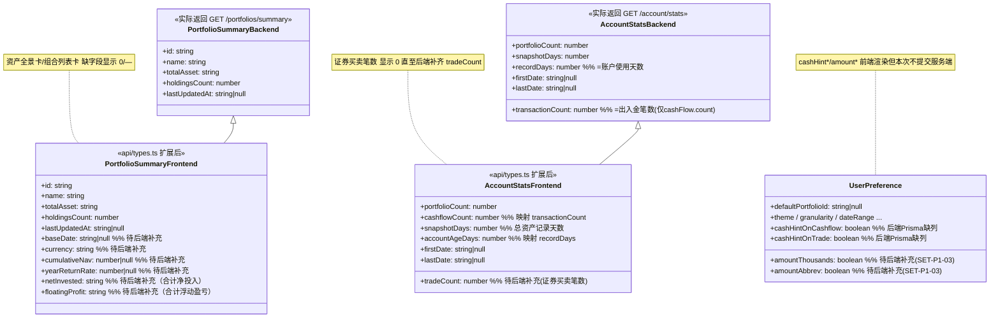

# 投资收益统计系统 · 账户域前端增量对齐设计（v3.1.8）

> 架构师：高见远（software-architect）
> 范围：账户页 `/account`、设置页 `/settings`、编辑资料卡片 `EditProfileDialog`、登录页注销恢复提示
> 性质：**增量前端对齐**（非新功能），仅动前端；数据管理区仅视觉对齐保持占位
> 设计源头：`docs/PRD.md` v3.1.8 §5.7 / §5.8 / §5.8.1 / §6.8 / §6.9 / §6.10.1 / §7.7 / §7.8 / §7.9 / §7.10
> 硬约束：§7.8 L1402 注销确认文案**严禁**出现「如需恢复请联系客服」

---

## Part A：系统设计

### 1. 实现方案 + 框架选型

- **框架选型**：复用现有前端栈，**无新框架**。`Vite + React 18 + TS + Tailwind + shadcn/ui + TanStack Query + Zustand`。
- **核心难点与处理**：
  1. 账户页草图字段远超现有 `getPortfoliosSummary` / `getAccountStats` 返回能力 → 采用「**前端按现有字段渲染 + 缺失字段统一显示 0 / — + 后端缺口标注**」策略（遵循 SYS-P0-05 四态，缺数据不白屏），不自行在前端伪造金融计算（严守 FIN-F0-09 C-01）。
  2. 后端 `ValidationPipe({ forbidNonWhitelisted: true })`：偏好 DTO 未含 `cashHintOnCashflow/cashHintOnTrade` 与金额格式字段，若前端提交会被 400。本次前端**只渲染开关/勾选 UI**，不把这些字段塞进服务端 PATCH（避免 400），持久化待后端补齐字段。
  3. 注销文案硬约束：直接替换 `settings.tsx` L822 违规文本，删除「客服」表述。
- **架构模式**：既有的「页面 + 特性组件 + hooks（TanStack Query）+ Zustand store」分层，本次沿用，不引入新抽象。

### 2. 文件清单（仅前端，相对 `packages/web/src/`）

| 文件 | 改动性质 | 对应 PRD |
|---|---|---|
| `pages/AccountPage.tsx` | 重构（账户页只读对齐） | §7.7 / ACC-P0-02/03/04/05/06 |
| `pages/settings.tsx` | 修改（五分区对齐 + 硬约束修正） | §7.8 / SET-P0-01/06/07/08 + SET-P1-03 + SET-P0-06 |
| `features/account/edit-profile-dialog.tsx` | 微调（头像 URL 显式 [应用] 按钮） | §7.9 / SET-P0-01 验收2 |
| `pages/login.tsx` + `features/auth/account-restore-prompt.tsx` | 核查（冷静期分支已接入，仅确认边界） | §7.10 / SYS-P1-02 |
| `api/types.ts` | 扩展类型（新增可选字段，向后兼容） | ACC-P0-03/04/06 |
| `hooks/use-preferences.ts` | 不改逻辑，仅确认 PATCH 白名单 | SET-P0-07 |

> 数据管理区（§7.8 ③ 导出/导入 CSV）**本次仅视觉对齐**，保持现有 3 个 `disabled` 占位按钮，**不新增 export/import API 调用**。

### 3. 数据结构与接口（字段映射）



**字段映射表（PRD 草图字段 ↔ 现有 API 返回 ↔ 前端展示）**

| PRD 草图字段 | 后端现有返回 | 前端处理 |
|---|---|---|
| 资产全景·组合数 | `summary.length` | 直接 |
| 资产全景·合计总资产 | `Σ totalAsset` | 直接求和 |
| 资产全景·合计净投入 | **无** | 待后端 `netInvested`；显示 0 + 缺口注 |
| 资产全景·合计浮动盈亏 | **无** | 待后端 `floatingProfit`；显示 0 + 缺口注 |
| 组合列表·成立日 | **无** | 待后端 `baseDate`；显示 — |
| 组合列表·币种 | **无** | 待后端 `currency`；显示 —（前端已知组合 currency，可改取 `usePortfolios`） |
| 组合列表·最新总资产 | `totalAsset` | 直接 |
| 组合列表·净值 | **无** | 待后端 `cumulativeNav`；显示 — |
| 组合列表·当年% | **无** | 待后端 `yearReturnRate`；显示 — |
| 组合列表·更新日 | `lastUpdatedAt` | 直接 |
| 统计·出入金笔数 | `transactionCount`(=cashFlow) | 直接（改名标签） |
| 统计·证券买卖笔数 | **无** | 待后端 `tradeCount`；显示 0 + 缺口注 |
| 统计·总资产记录天数 | `snapshotDays`(=总资产记录去重天数) | 直接 |
| 统计·数据区间 | `firstDate`~`lastDate` | 直接 |
| 统计·账户使用天数 | `recordDays`(=注册至今天数) | 直接 |

### 4. 程序调用流程

```mermaid
sequenceDiagram
    participant U as 用户
    participant AP as AccountPage
    participant S as settings
    participant Dialog as EditProfileDialog
    participant Q as TanStack Query
    participant API as 后端

    Note over U,AP %% 账户页只读 + 跳转
    U->>AP: 访问 /account
    AP->>Q: getPortfoliosSummary() / getAccountStats()
    Q->>API: GET /portfolios/summary, /account/stats
    API-->>Q: 现有字段(缺 netInvested/floatingProfit/tradeCount 等)
    Q-->>AP: 渲染(缺失字段 0/— + 缺口注)
    U->>AP: 点击「前往设置 →」
    AP->>S: navigate(ROUTE_PATH.SETTINGS)
    U->>AP: 点击「+新建组合」
    AP->>Dialog: 打开 PortfolioDialog(复用)

    Note over U,S %% 设置页（含硬约束修正 + 设为默认）
    U->>S: 点击组合操作列「设为默认」
    S->>Q: useUpdatePreferences({defaultPortfolioId})
    Q->>API: PATCH /users/preferences(仅已支持字段)
    API-->>Q: 200
    S->>S: setCurrentPortfolio(id)(既有副作用)
    U->>S: 点击「注销账户」→ 确认框
    S->>S: 修正文案(删除"联系客服"，改自助恢复口径)

    Note over U,Dialog %% 编辑资料卡（头像URL并列）
    U->>Dialog: 输入头像URL → [应用]
    Dialog->>Dialog: setValue('avatar', url)
    U->>Dialog: [保存]
    Dialog->>Q: useUpdateProfile({avatar:url,...})
    Q->>API: PATCH /auth/profile
```

### 5. 任务列表（有序，含依赖，按实现顺序）

| Task | 名称 | 源文件 | 依赖 | 优先级 | 对应 PRD |
|---|---|---|---|---|---|
| **T01** | 账户页只读对齐 | `pages/AccountPage.tsx`、`api/types.ts` | — | P0 | ACC-P0-02/03/04/05/06, §7.7 |
| **T02** | 设置页分区对齐 + 注销文案硬约束 | `pages/settings.tsx` | — | P0 | SET-P0-01/06/07, SET-P1-03, SET-P0-06, §7.8, §7.8 L1402 |
| **T03** | 编辑资料卡头像 URL [应用] 对齐 | `features/account/edit-profile-dialog.tsx` | — | P0 | SET-P0-01 验收2, §7.9 |
| **T04** | 登录注销冷静期恢复核查 | `pages/login.tsx`、`features/auth/account-restore-prompt.tsx` | — | P1 | SYS-P1-02, §7.10 |
| **T05** | 类型扩展 + 缺口标注收尾 | `api/types.ts`、`hooks/use-preferences.ts` | T01 | P1 | 全局一致性 |

> 任务最小分组，每个 ≥3 文件（T04/T05 为核查/收尾，文件数略少但属独立可验收单元）。T01/T02 可并行；T05 在 T01 之后做类型收口。

### 6. 依赖包列表

**本次几乎无新增依赖。** 全部复用既有：`react`、`react-router-dom`、`@tanstack/react-query`、`zustand`、`zod`、`react-hook-form`、`@hookform/resolvers`、`sonner`、`lucide-react`、`tailwindcss`、`shadcn/ui`（组件已存在）。
唯一可能新增：`classnames`（若工程师偏好），但现有 `cn()` 已足够，**不建议新增**。

### 7. 共享知识（跨文件约定）

- **数据口径来源约定**：资产全景汇总一律从 `getPortfoliosSummary`（`overview.api`）取；账户统计口径一律从 `getAccountStats`（`account.api`）取；不各自调接口、不与 dashboard 重复开发（ACC-P0-03/04 共用 summary）。
- **缺失字段统一呈现**：后端缺字段时，数值型显示 `0`、文本型显示 `—`，并在卡片底部加一行 `ⓘ 部分指标待后端补充` 注记（SYS-P0-05 四态，不得白屏/报错）。
- **偏好提交白名单**：`useUpdatePreferences` 的 PATCH payload **仅含后端已支持字段**（`defaultPortfolioId/granularity/dateRange/aggregation/weekStartsOn/navDecimals/xirrDecimals/theme/staleDays`）。本次新增的 `cashHintOnCashflow/cashHintOnTrade` 与金额格式字段**不进 payload**（后端 `forbidNonWhitelisted` 会 400）。
- **导航常量**：跳转一律用 `ROUTE_PATH.ACCOUNT` / `ROUTE_PATH.SETTINGS`，不得硬编码路径。
- **头像修改唯一入口**在 `EditProfileDialog` 内（本地上传 + URL 并列）；账户页 / 设置页账户区均不另设头像输入（§5.8.1 一致性）。

### 8. 待明确事项 / 后端缺口（本次只动前端，下列标注供交付说明）

**A. 必须后端补字段（账户页草图才能全亮）**
1. `GET /portfolios/summary`（`portfolio.service.getSummary` + `PortfolioSummaryDto`）：新增
   - `baseDate`(成立日)、`currency`(币种)、`cumulativeNav`(净值)、`yearReturnRate`(当年%)、`netInvested`(合计净投入)、`floatingProfit`(合计浮动盈亏)。
   - 注：组合 `currency` 前端其实已从 `usePortfolios` 拿到，可前端补；但净值/净投入/浮动盈亏必须由后端算（FIN-F0-09）。
2. `GET /account/stats`（`account.service.getStats`）：将 `transactionCount` 拆为 `cashflowCount`(出入金) 与 `tradeCount`(证券买卖，来自 `securityTrade.count`)。`recordDays` 已可当「账户使用天数」用。
3. `UserPreference`（`prisma/schema.prisma` + `UpdatePreferenceDto` + service）：新增 `cashHintOnCashflow`、`cashHintOnTrade`（SET-P0-07 软提示持久化），以及金额格式字段 `amountThousands`、`amountAbbrev`（SET-P1-03）。补齐前前端只渲染开关不提交。

**B. 仅视觉对齐（保持占位，不实现）**
- 数据管理区导出/导入 CSV（SET-P0-03/04）：本次保留 3 个 `disabled` 按钮，不写 export/import 逻辑。

**C. 已确认的既有正确项（无需改动）**
- `EditProfileDialog` 头像 URL 已与本地上传并列、随保存提交（验收2 已满足），本次仅加显式 [应用] 按钮提升可见性。
- 设置页「退出登录」已实现 `logout()+navigate(LOGIN)`，符合 SET-P0-09。
- 登录页冷静期分支（§7.10）据既有实现已接入，T04 仅做边界文案核查，不保证改动。

**D. 需工程师落地时确认**
- `ROUTE_PATH.ACCOUNT` 常量是否已存在（侧栏「账户」入口/顶栏「账户中心」是否已在别处接好）。若未接，属 ACC-P0-01 范畴，本次增量可复用既有路由注册，不重做入口。
- 组合列表「币种」前端可从 `usePortfolios()` 取 `p.currency` 填充，避免等后端。
