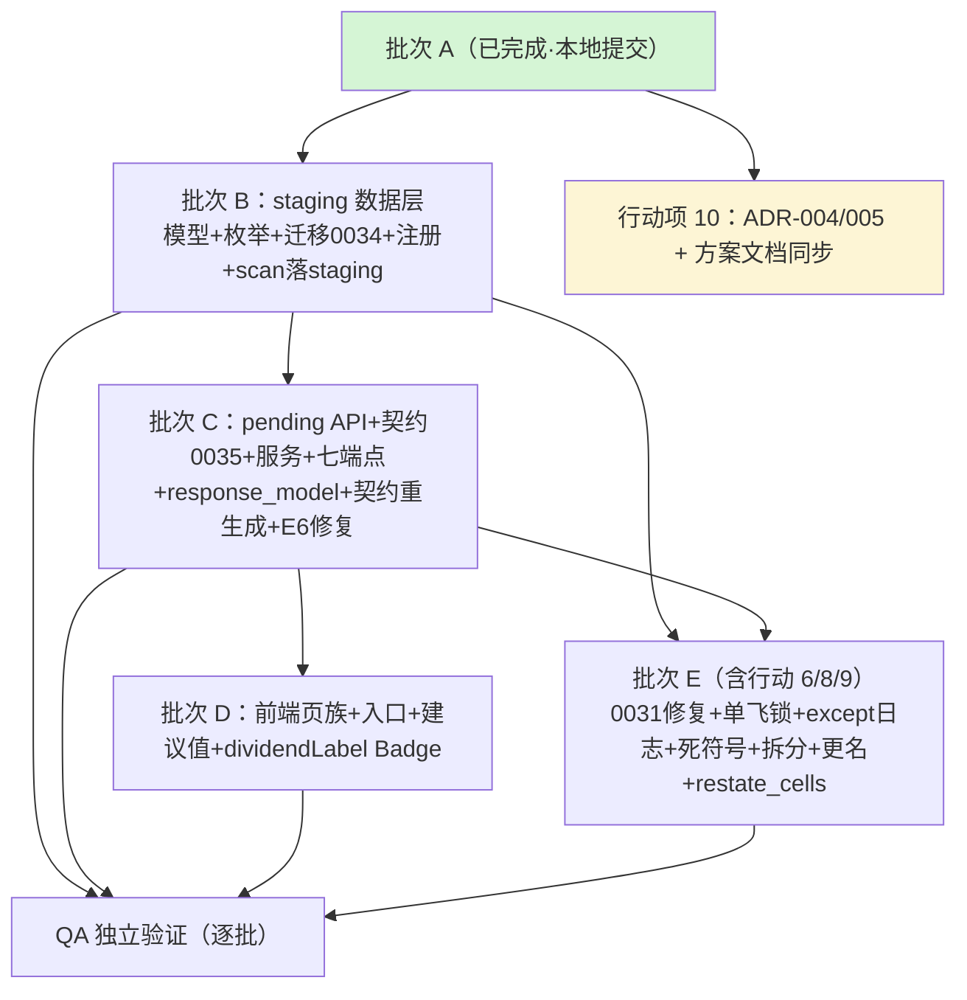
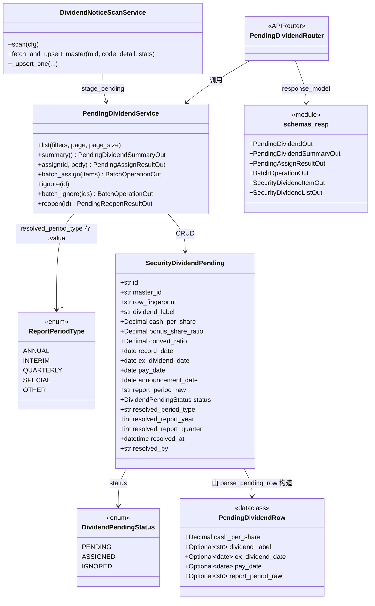
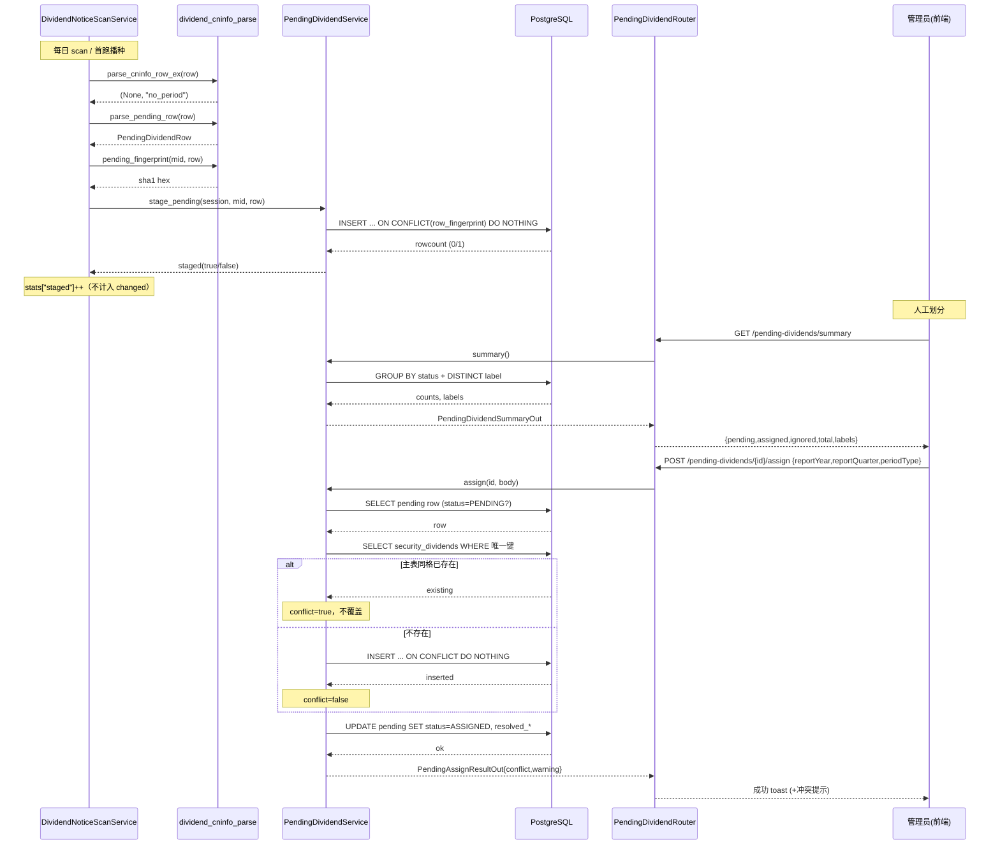

# 增量设计文档 · 分红采集链路迁移（批次 B–E + 行动项 6/8/9/10）

- **文档类型**：增量设计锁定 + 任务分解（供工程师按序实施）
- **范围**：`docs/reviews/review-dividend-manual-period-2026-09-21.md` §9 的**批次 B → C → D → E** + 行动项 **6 / 8 / 9 / 10**
- **明确排除**：行动项 7「数据批」（备份 → 部署迁移 → 先删旧源 → 播种 19h）本次**不做**，仅在其前置代码就绪后再由 ops 执行
- **基准**：批次 A 已落地并本地提交（`12fc615`/`1cc9b98`/`02dacbe`/`89c666e`/`00d4ff1`）
- **日期**：2026-09-22
- **作者**：高见远（系统架构师）
- **核实方式**：全部结论**回源码核实**（Read/Grep 工具，非照抄报告行号）；报告行号已因批次 A 落地漂移，本文所引行号均为**当前工作树真实行号**
- **codebase-memory MCP 状态**：本会话该 MCP **仍处 connecting、工具未注册，不可用** → 已改用 Read/Glob/Grep 文件检索完成全部核实

---

## TL;DR

把报告里的「staging 队列 + 人工划分」从语义裁决**落到可实施级**：新增表 `security_dividend_pending`（迁移 `0034`）+ 原生枚举 `DividendPendingStatus`，把 `fetch_and_upsert_master` 里「无报告期 → 静默丢弃」改为「无报告期 → 落 staging 待人工划分」，再配 **pending 六端点 + reopen** 的**全程 Pydantic `response_model`** 契约、`dividend_retention_years` 配置化、批量部分失败契约；前端新增 `admin/pages/` 独立页族承载人工划分。同时闭合**批次 A 交付时发现的隐性契约缺口**（`/{master_id}/dividends` 端点手工拼 dict、`dividendLabel` 未进 OpenAPI → 前端拿不到类型），并冻结 `notice_scan.py` 四处并发修改的**单工程师串行编辑顺序**以杜绝返工。

**五个批次均可独立提交、自带单测、独立自洽**：批次 B（staging 数据层）→ C（pending API + 契约）→ D（前端页族）→ E（死符号 + 拆分 + `0031` 修复 + 单飞锁）；行动项 10（ADR + 文档同步）纯文档、可与代码并行。

---

## 0. 范围与不做项

| 类别 | 内容 |
|---|---|
| **本次设计范围** | 批次 B、C、D、E；行动项 6（`0031` 修复 F1）、8（单飞锁 + except 日志 + UI 文案）、9（`restate_cells` 三边界 + 死符号 + 拆分 + 更名）、10（ADR-004/005 + 方案文档同步） |
| **明确不做** | ① 行动项 7「数据批」（备份/部署迁移/删旧源/播种/人工划分执行）；② 行动项 1~5（已完成或被本范围覆盖）；③ L2 跨源去重语义单独立项（`89c666e` 已做跨源限定）；④ `deliverables/` 未提交项（工作树已知未提交，**不得触碰**） |
| **不做项的关键理由** | 数据批依赖「代码就绪 + 巨潮接口复测恢复」；本设计只保证其**前置代码**（staging + pending API）就绪，不触发任何真实数据写入 |

> **环境硬约束复述**（违反即返工）：禁止改开发库 `investment_tracker`；单文件 ≤400 行（人工约定）；PG 原生枚举 `postgresql.ENUM(..., create_type=False)`；downgrade 先 `drop_table` 再 `DROP TYPE`；`ADD VALUE` 走 `autocommit_block()`；pytest 串行执行（conftest session 级 DROP/CREATE 测试库）；ruff 用 `uvx --offline ruff check app tests conftest.py`；本地 commit 不 push、作者 `senior-dev <dev@local>`；生成物禁手改。

---

## 1. 冻结决策表（10 项，全部落地为可实施规格）

| # | 决策项 | **冻结结论** | 理由 | 依据（当前行号） |
|---|---|---|---|---|
| **D-1** | 迁移 `0034` 规格 | 建 `security_dividend_pending`（见 §3）；`down_revision = "0033_extend_report_period_type"`（**确认当前 alembic head 即 0033**） | head 已由 migration 链核实：0001→…→0033 单链，0033 无后继 | `backend/alembic/versions/0033_...py:27-28`；链核实见 §3.0 |
| **D-2** | 三条强制注册精确落点 | ① `app/models/__init__.py` 双注册（import 块 + `__all__`）；② `tests/test_models.py` **表清单**（`==` 相等断言）补 `security_dividend_pending`；③ **枚举名清单**补 `DividendPendingStatus` | 漏一必红：metadata 建表漏表 / set 相等断言失败 | `app/models/__init__.py:8-14`(cast import) `:15-31`(enum import) `:44-86`(`__all__`)；`tests/test_models.py:33-68`(表集) `:76-94`(枚举集) |
| **D-3** | assign 撞键可见性 | `POST /{id}/assign` 返回 `conflict: bool` + `warning: str \| null`；**命中主表同格则「保留旧值、不覆盖」并置 `conflict=true`** | owner 已定「可见」；与 scan 撞键护栏同口径（保留旧值） | 报告 §5.3.8 D-3；护栏范式 `dividend_notice_scan.py:407-417` |
| **D-4** | 留存窗年数常量 | `dividend_yield_settings` 加列 `dividend_retention_years`（Integer，可空，`server_default='5'`）；`retention_cleanup` 改读它（弃 `_RETENTION_YEARS` 常量）；`GET/PUT /settings` 暴露；前端读 `GET /settings` | owner 已定「完整可配」；避免前端硬编码 `cur-4` 漂移 | `dividend_sync.py:41,83`；`settings_router.py:38-50,117-135`（迁移 `0035`） |
| **D-5** | reopen 端点 | 加 `POST /pending-dividends/{id}/reopen`：`ASSIGNED→PENDING`、清 `resolved_*`、**连带删除 assign 写入的主表同键行**；返回 `{id, status, rolledBack}` | owner 已定「可撤销」 | 报告 §5.3.8 D-5 |
| **D-6** | 读权限（auditor） | **读端点** `require_any_role("admin","auditor")`；**写端点** `require_admin`；前端读门控 `useHasRole('admin','auditor')` | owner 已定「a：auditor 只读可见」；与日志中心同口径 | `app/services/auth.py:89-110`；`LogCenterPage.vue:43`；`auth.store.ts:114-121` |
| **D-7** | 批量响应契约 + 列表排序 | 批量返回 `{succeeded:int, failed:[{id,code,reason}]}`；列表**固定** `ORDER BY created_at DESC, id DESC`（不提供 `sort` 参数） | 翻页稳定；部分失败可重试 | 报告 §5.3.4/§5.3.6；`services/base.py:87-106`(`paged`) |
| **D-8** | `dividend_label` 取值集合 | **后端返回 `labels[]`**（`KNOWN_LABELS` ∪ pending 表内 DISTINCT 非空 label），前端据此渲染筛选项，**不硬编码** | 源站词表**非闭集**（5 精确映射 vs 实测 7 标签）；硬编码必漂移（`重整转增`/`承诺补偿` 已缺失） | `dividend_cninfo_parse.py:38-47`；报告 §2.2/§4 |
| **D-9** | E6 契约缺口修复 | 给 `GET /{master_id}/dividends` 补 `response_model=SecurityDividendListOut`（新增于 `schemas_resp.py`），纳入契约重生成 | 该端点手工拼 dict、`dividendLabel` 未进 OpenAPI → 前端无字段类型 | `router.py:287-343`（响应 dict `:320-342`，`dividendLabel` `:332`）；`schemas_resp.py:1-11`（response_model 仅用于暴露 schema、运行时零风险） |
| **D-10** | `notice_scan.py` 四处并发修改 | 单工程师**严格串行**一次改完：**先删死符号 → 再补 except 日志 → 再落 staging → 最后拆分**（见 §6） | 四批同时改一文件必冲突/返工（595 行） | `dividend_notice_scan.py`（当前 **596 行**） |

### 补充冻结（报告「已定」条目，照做）

| 条目 | 结论 | 依据 |
|---|---|---|
| sync 落 staging 后失败模式 | 从「静默丢失」转「静默不消费」→ 度量 `stats["staged"]`（队列写入数） | 报告 §8 元结论 |
| staging 幂等 | `row_fingerprint`(sha1) 唯一键 + `ON CONFLICT (row_fingerprint) DO NOTHING` | 报告 §5.2 |
| assign 不改删行 | assign 后置 `ASSIGNED`，**不删行**（删行会因 fingerprint 缺失去重而在下次 scan 复活） | 报告 §5.2 |
| 主表写入原子性 | assign 用 `INSERT ... ON CONFLICT (master_id,report_year,report_quarter,period_type) DO NOTHING`（并发 scan 不 IntegrityError；命中即视为 `conflict=true` 不覆盖） | 报告 §5.2 + D-3 的调和（见 §4.3） |
| 端点必须有 `response_model` | pending 全端点 + `/{master_id}/dividends` 全部声明 Pydantic `response_model` | 报告 §7 Rex 收尾清单；`schemas_resp.py:5-6` |
| 断言红线 | downgrade 后**不得**断言枚举值消失（`ADD VALUE` downgrade 是 no-op）；`resolved_period_type` 走**字符串往返**、禁止枚举断言 | 报告 §8 |

---

## 2. 文件清单（新增 / 修改）

> 行数为**预估**（增删净变动）。「批次」列指该文件主要归属；跨批文件以**首次改动批**为准。

### 2.1 后端 · 新增

| 文件 | 职责 | 预估行 | 批次 |
|---|---|---|---|
| `backend/alembic/versions/0034_create_dividend_pending.py` | 建 pending 表 + `DividendPendingStatus` 原生枚举 + 索引；downgrade 先 `drop_table` 再 `DROP TYPE` | ~70 | B |
| `backend/alembic/versions/0035_add_dividend_retention_years.py` | `dividend_yield_settings` 加列 `dividend_retention_years`（可空，`server_default='5'`） | ~30 | C |
| `backend/app/services/dividend_pending.py` | pending 服务：`stage_pending()`（幂等写入，供 scan/seed）、`list/summary`、主表原子 upsert。**2026-09-24 按 B4 拆分**：裁定写路径 → `dividend_pending_assign.py`（`PendingDividendAssignMixin`）、主表写入原语 → `dividend_pending_main_write.py`（`DividendMainWriteMixin`）；导入路径 `stage_pending` / `PendingDividendService` 不变 | ~230 | B（stage）/ C（其余） |
| `backend/app/modules/dividend_yield/pending_router.py` | pending 七端点（六 + reopen）；子 router 自带 `route_class=EnvelopeRoute` | ~170 | C |
| `backend/tests/test_dividend_pending.py` | 服务层单测：staging 幂等 / fingerprint 稳定 / assign 冲突 / reopen 回滚 / 状态机 | ~160 | B+C |
| `backend/tests/test_dividend_pending_api.py` | 端点单测：鉴权矩阵 / 分页筛选 / 批量部分失败 / 契约字段 | ~180 | C |

### 2.2 后端 · 修改

| 文件 | 改动 | 预估行 | 批次 |
|---|---|---|---|
| `backend/app/models/enums.py` | 追加 `DividendPendingStatus`（`PENDING/ASSIGNED/IGNORED`，`str, Enum`） | +6 | B |
| `backend/app/models/dividend_yield.py` | 新增 `SecurityDividendPending` 模型；`DividendYieldSettings` 加 `dividend_retention_years` 列 | +55 | B/C |
| `backend/app/models/__init__.py` | 双注册：import `SecurityDividendPending`、import `DividendPendingStatus`；`__all__` 补两者 | +4 | B |
| `backend/tests/test_models.py` | 表集补 `security_dividend_pending`；枚举集补 `DividendPendingStatus` | +2 | B |
| `backend/app/services/dividend_cninfo_parse.py` | 新增 `PendingDividendRow` dataclass + `parse_pending_row()` + `pending_fingerprint()`（纯函数） | +45 | B |
| `backend/app/services/dividend_notice_scan.py` | **按序**：删 4 死符号 → `except` 补日志 → 落 staging（调 `stage_pending`）→ 拆分（§6） | 净 −≈120 | B/E（§6 顺序） |
| `backend/app/services/dividend_seed.py` | `except` 补日志（对齐 `dividend_yield_refresh.py:158-160`）；`staged` 桶摘要 | +12 | E |
| `backend/app/services/dividend_sync.py` | `retention_cleanup` 改读 `settings.dividend_retention_years`（弃 `_RETENTION_YEARS`；保留常量作默认） | +8 | C |
| `backend/app/modules/dividend_yield/settings_router.py` | `SettingsUpdateBody` 加 `dividend_retention_years`；`_settings_out` 暴露；PUT 校验（范围 1~10） | +20 | C |
| `backend/app/modules/dividend_yield/router.py` | `include_router(pending_router)`；`/{master_id}/dividends` 补 `response_model` | +6 | C |
| `backend/app/schemas_resp.py` | 新增 7 个响应模型（见 §4.4），含 `SecurityDividendItemOut`/`SecurityDividendListOut` | +90 | C |
| `backend/alembic/versions/0031_remove_quarterly_dividend_fetch.py` | F1 修 4 处（`_ENUM_VALUES_ALL` / `enabled` / 注释 / 重建前 DELETE） | +4/−2 | E（行动 6） |
| `backend/tests/test_dividend_notice_scan.py` | 删 2 处死符号引用（import + 用例）；`staged` 桶断言 | +10/−20 | B/E |
| `backend/tests/test_dividend_seed.py` | `staged` 桶断言 | +6 | B |
| `backend/tests/test_dividend_cninfo_parse.py` | `parse_pending_row` / `pending_fingerprint` 用例 | +40 | B |
| `backend/tests/test_dividend_yield_dividends_api.py` | 断言 `dividendLabel` 字段存在 | +10 | C |
| `backend/tests/test_dividend_sync.py` | `retention_cleanup` 读配置列用例 | +15 | C |
| `backend/app/services/dividend_notice_scan.py`（拆分后新文件，见 §6.3） | 承接拆分出的解析/采集职责 | 见 §6.3 | E |
| `docs/openapi.json` | **重新生成**（禁手改） | — | C |
| `web/src/types/api.ts` | **重新生成**（禁手改） | — | C |

### 2.3 前端 · 新增

| 文件 | 职责 | 预估行 | 批次 |
|---|---|---|---|
| `web/src/modules/admin/pages/PendingDividendsPage.vue` | 路由页：权限自守卫、筛选/分页/选中态、批量编排、弹窗挂载、结果反馈 | ~185 | D |
| `web/src/modules/admin/components/PendingDividendTable.vue` | 哑表格：9 列、checkbox 三态、sticky 首列、行内操作 | ~145 | D |
| `web/src/modules/admin/components/PendingDividendAssignDialog.vue` | 指定弹窗：原文摘要 + 建议值 + 一键采纳 + 自定义表单 + 校验 | ~155 | D |
| `web/src/modules/dividend-yield/composables/use-pending-dividends.ts` | vue-query：list/summary/assign/batch/ignore/reopen | ~115 | D |
| `web/src/modules/dividend-yield/lib/suggest-report-period.ts` | 纯函数：建议报告期算法 + 类型↔季度合法性 + 留存窗判定（读 `GET /settings` 的 `dividend_retention_years`） | ~75 | D |
| `web/src/modules/admin/__tests__/pending-dividends-page.test.ts` | 页权限门控 / 筛选重置选中 / 批量确认 | ~110 | D |
| `web/src/modules/dividend-yield/__tests__/suggest-report-period.test.ts` | 7 真样本回归（§5.3.5） | ~90 | D |

### 2.4 前端 · 修改

| 文件 | 改动 | 预估行 | 批次 |
|---|---|---|---|
| `web/src/api/dividend-yield.api.ts` | 新增 7 个端点函数 + `PendingDividendFilters`/类型；`SecurityDividendItem` 增 `dividendLabel: string \| null` | +72 | D（类型可随 C） |
| `web/src/lib/constants.ts` | `ROUTE_PATH` 增 `ADMIN_PENDING_DIVIDENDS: '/admin/pending-dividends'` | +1 | D |
| `web/src/router/index.ts` | `admin` children 增 `admin/pending-dividends` 路由（`component: () => import(...)`） | +7 | D |
| `web/src/modules/admin/components/GlobalSettingsDividendInitBlock.vue` | 入口按钮「待人工划分 N 笔 →」；**同时**修 `:88` 文案（播种不写 `job_run_logs`） | +34 | D（文案属行动 8，见 §6.4） |
| `web/src/modules/dividend-yield/components/SecurityDetailPanel.vue` | 明细行加 `<Badge v-if="d.dividendLabel">{{ d.dividendLabel }}</Badge>` | +5 | D |
| `web/src/modules/admin/__tests__/global-settings-dividend-tab.test.ts` | 新增入口按钮断言（N>0 / N=0 置灰 / 非 admin 不渲染） | +20 | D |
| `web/src/modules/admin/__tests__/global-settings-page-qa.test.ts` | 同上（mock `usePendingDividendsSummary`） | +15 | D |
| `web/src/modules/dividend-yield/__tests__/security-detail-panel-dividends.test.ts` | `dividendLabel` Badge 断言 | +12 | D |

### 2.5 文档（行动项 10）

| 文件 | 改动 | 批次 |
|---|---|---|
| `docs/adr/ADR-004-dividend-report-period-and-manual-assignment.md` | 新增（骨架见 §7.1） | 10 |
| `docs/adr/ADR-005-bonus-share-market-neutral-and-ex-dividend-restatement.md` | 新增（骨架见 §7.1） | 10 |
| `docs/adr/ADR-002-quote-interface-priority-chain.md` | 修订补记：分红明细源切至巨潮、`dividend_report_source_interface_id` 退役 | 10 |
| `docs/分红采集链路迁移方案.md` | 同步 `:264`（其余→OTHER）、`:404`（不可先删后采）、补 OTHER/`dividend_label`/人工划分章节（先 Read 核实行号再改） | 10 |

---

## 3. 迁移 `0034` 完整规格

### 3.0 与 head 的衔接（已核实）

`alembic/versions/` 现为**单线性链**：`squashed_0001_initial → 0002 → … → 0009 → 0010 → 0011 → 0012 → 0015 → 0019 → 0020 → 0021 → 0025 → 0026 → 0027 → 0028 → 0030 → 0031 → 0032 → 0033`。`0033_extend_report_period_type` 的 `down_revision = "0032_drop_dividend_report_source"`，且**无任何迁移以 0033 为 `down_revision`** ⇒ **head = `0033_extend_report_period_type`**。

> 说明：`0010` 的 `down_revision` 为跨行字面量（`"|\n"0009..."`），脚本粗解析时会误列为 head 候选；人工确认其为 `0009_fix_dividend_interface_code_fields`，链不断。
> 因此：`0034.down_revision = "0033_extend_report_period_type"`；`0035.down_revision = "0034_create_dividend_pending"`。

### 3.1 `security_dividend_pending` 列定义

| 列名 | 类型 | 可空 | 默认 | 说明 |
|---|---|---|---|---|
| `id` | `String(36)` PK | 否 | `gen_random_uuid()`(DB) / `pk_uuid()` | 与全仓 UUID 主键一致 |
| `master_id` | `String(36)` FK `securities.id` | 否 | — | `ondelete=CASCADE`、`deferrable=True`、`initially="DEFERRED"`（对齐 `SecurityDividend.master_id`） |
| `row_fingerprint` | `String(40)` | 否 | — | **sha1 hex** 幂等键（唯一）；避开「复合唯一键含可空日期 → PG NULL 不相等」 |
| `dividend_label` | `String(32)` | 是 | — | 源站「分红类型」原文（`normalize_label` 截断 32） |
| `cash_per_share` | `Numeric(18,6)` | 否 | — | 每股派息（源「每 10 股」÷10，与 `SecurityDividend` 同口径） |
| `bonus_share_ratio` | `Numeric(18,6)` | 是 | — | 每股送股比例（÷10） |
| `convert_ratio` | `Numeric(18,6)` | 是 | — | 每股转增比例（÷10） |
| `record_date` | `Date` | 是 | — | 股权登记日 |
| `ex_dividend_date` | `Date` | 是 | — | 除权日 |
| `pay_date` | `Date` | 是 | — | **派息日**（`SecurityDividend` 未落、pending 保留，§5.2） |
| `announcement_date` | `Date` | 是 | — | 公告日 |
| `report_period_raw` | `String(32)` | 是 | — | 「报告时间」**原文**（不可解析故入 staging，保留原样供人工判读） |
| `status` | 原生枚举 `DividendPendingStatus` | 否 | `'PENDING'` | `PENDING/ASSIGNED/IGNORED` |
| `resolved_period_type` | `String(16)` | 是 | — | 人工裁定后的报告期类型；**刻意非 native enum**（避免枚举值演进触发重建） |
| `resolved_report_year` | `Integer` | 是 | — | 裁定年份 |
| `resolved_report_quarter` | `SmallInteger` | 是 | — | 裁定季度 1~4 |
| `resolved_at` | `DateTime(timezone=True)` | 是 | — | 裁定时间 |
| `resolved_by` | `String(36)` | 是 | — | 裁定人 user_id |
| `created_at` | `DateTime(timezone=True)` | 否 | `now()` | 由 `TimestampMixin`（对齐现有模型） |
| `updated_at` | `DateTime(timezone=True)` | 否 | `now()` | 由 `TimestampMixin` |

> **不保留**：`股份到账日`、`实施方案分红说明`（§9.3-A6 决定不落库）。

### 3.2 索引

| 名称 | 列 | 类型 | 用途 |
|---|---|---|---|
| `uq_security_dividend_pending_fingerprint` | `row_fingerprint` | UNIQUE | 幂等键（`ON CONFLICT` 目标） |
| `ix_security_dividend_pending_status` | `status` | 普通 | summary 计数 / 列表状态筛选 |
| `ix_security_dividend_pending_master` | `master_id` | 普通 | 按证券查询 / 级联 |

> 列表默认查询 `WHERE status=... ORDER BY created_at DESC, id DESC`：可在 `status` 索引基础上结合 `id`/`created_at` 排序；数据量极小（全市场估数十行），无需复合索引。

### 3.3 `upgrade()` SQL 意图

```python
# 1) 先建原生枚举类型（PG），列引用处 create_type=False（AGENTS.md §3）
pending_status = postgresql.ENUM(
    "PENDING", "ASSIGNED", "IGNORED", name="DividendPendingStatus", create_type=False
)
pending_status.create(op.get_bind(), checkfirst=True)
# 2) create_table(...)  —— 用 op.create_table，status 列写 postgresql.ENUM(..., create_type=False)
#    其余列按 §3.1；master_id 外键 deferrable/initially DEFERRED；TimestampMixin 两列
# 3) 建 §3.2 三个索引（唯一约束可与 create_table 合并或单独 create_index(unique=True)）
```

- **原子性**：建表 + 索引 **单事务原子**（与 `0033` 的「ALTER TYPE + 加列」非原子不同——本迁移无 `ADD VALUE`）。
- 枚举创建用 `create_type=False` + 显式 `.create(checkfirst=True)`，避免 `create_table` 隐式重复建类型。

### 3.4 `downgrade()` SQL 意图（顺序不可颠倒）

```python
op.drop_index("ix_security_dividend_pending_master", table_name="security_dividend_pending")
op.drop_index("ix_security_dividend_pending_status", table_name="security_dividend_pending")
op.drop_table("security_dividend_pending")                       # 必须先删表
op.execute('DROP TYPE "DividendPendingStatus"')                  # 再删类型
```

> ⚠️ **必须先 `drop_table` 再 `DROP TYPE`**：反序会因「列仍引用该类型」报依赖错误。

### 3.5 `0035_add_dividend_retention_years`

```python
def upgrade():
    with op.batch_alter_table("dividend_yield_settings") as b:
        b.add_column(sa.Column("dividend_retention_years", sa.Integer,
                               nullable=True, server_default="5"))
def downgrade():
    with op.batch_alter_table("dividend_yield_settings") as b:
        b.drop_column("dividend_retention_years")
```

> 纯加列、无枚举重建，走 `batch_alter_table`（同 `0030`）。

### 3.6 `row_fingerprint`（sha1）生成口径

**纯函数**（放 `dividend_cninfo_parse.py`，无 IO，可单测）：

```python
def pending_fingerprint(master_id: str, row: PendingDividendRow) -> str:
    """身份指纹：sha1('\x1f'.join(canonical fields)).hexdigest()（40 hex）。

    字段顺序固定、缺失归一为空串，保证「同一源行重复 scan → 同一指纹」。>
    纳入字段：master_id | dividend_label | cash_per_share | bonus_share_ratio
             | convert_ratio | record_date | ex_dividend_date | pay_date
             | announcement_date | report_period_raw
    """
```

- **为何含 `master_id`**：表内跨证券去重；同源行归属唯一证券。
- **为何用 sha1 而非复合唯一键**：复合键含**可空日期**，PG 唯一索引对 NULL 视为互不相等 → 无法幂等；单一 sha1 文本列规避之（§5.2 原话）。
- **稳定性权衡（已知局限，转「待明确事项」）**：上游修正任一字段 → 生成新 `PENDING` 而非更新原行（报告已留痕）。
- **写法**：`canonical = "\x1f".join([master_id, label or "", str(cash), str(bonus or ""), str(convert or ""), str(record or ""), str(ex or ""), str(pay or ""), str(ann or ""), report_raw or ""])`；`hashlib.sha1(canonical.encode("utf-8")).hexdigest()`。

### 3.7 幂等写入（staging）

```python
async def stage_pending(session, master_id: str, row: PendingDividendRow) -> bool:
    fp = pending_fingerprint(master_id, row)
    stmt = pg_insert(SecurityDividendPending).values(
        id=<uuid>, master_id=master_id, row_fingerprint=fp, **row.fields(),
        status=DividendPendingStatus.PENDING,
    ).on_conflict_do_nothing(index_elements=["row_fingerprint"])
    res = await session.execute(stmt)
    return bool(res.rowcount)   # 仅「新插入」为 True（不触发快照重算）
```

- **`ON CONFLICT DO NOTHING`**：重复 scan 不产生重复行。
- **不计入 `changed`**：staging 不影响派生快照（调用方**不得**因它把 mid 加入重算集）。

---

## 4. pending 端点契约表

> 全部挂在 `router_dividend_yield`（prefix `/api/dividend-yield`）下；子 router 自带 `route_class=EnvelopeRoute`（`include_router` **不继承** route_class，见 `admin/router.py:12-15` 同类警告）。**全部声明 `response_model`**（否则 openapi schema 为空、前端无类型）。

### 4.1 端点总表

| 方法 | 路径 | 请求模型 | 响应模型 | 权限 | 状态码 |
|---|---|---|---|---|---|
| GET | `/pending-dividends` | query：`status?` `label?` `q?` `page=1` `pageSize=20` | `Paginated[PendingDividendOut]` | `require_any_role("admin","auditor")` | 200 / 401 / 403 |
| GET | `/pending-dividends/summary` | — | `PendingDividendSummaryOut` | `require_any_role("admin","auditor")` | 200 / 401 / 403 |
| POST | `/pending-dividends/{id}/assign` | `PendingAssignBody` | `PendingAssignResultOut` | `require_admin` | 200 / 400 / 401 / 403 / 404 |
| POST | `/pending-dividends/batch-assign` | `PendingBatchAssignBody` | `BatchOperationOut` | `require_admin` | 200 / 401 / 403 |
| POST | `/pending-dividends/{id}/ignore` | — | `PendingIgnoreResultOut` | `require_admin` | 200 / 401 / 403 / 404 |
| POST | `/pending-dividends/batch-ignore` | `PendingBatchIgnoreBody` | `BatchOperationOut` | `require_admin` | 200 / 401 / 403 |
| POST | `/pending-dividends/{id}/reopen` | — | `PendingReopenResultOut` | `require_admin` | 200 / 401 / 403 / 404 / 409 |

> **路由声明顺序**：`summary` / `batch-assign` / `batch-ignore` 为**静态段**，`{id}/assign` 等为**子段**，二者不冲突；仍建议静态段先声明，免踩「`{id}` 吞掉静态段」的隐患。

### 4.2 请求模型（`pending_router.py` 内定义，`extra="forbid"`）

```python
class PendingAssignBody(BaseModel):
    model_config = ConfigDict(extra="forbid")
    reportYear: int          # 1990 ~ 次年
    reportQuarter: int       # 1~4
    periodType: str          # ANNUAL|INTERIM|QUARTERLY|SPECIAL|OTHER（服务层枚举校验）

class PendingBatchAssignBody(BaseModel):
    model_config = ConfigDict(extra="forbid")
    items: list[PendingAssignItem]   # {id, reportYear, reportQuarter, periodType}

class PendingBatchIgnoreBody(BaseModel):
    model_config = ConfigDict(extra="forbid")
    ids: list[str]           # 1~200 条
```

### 4.3 assign 语义（D-3 冲突可见 + §5.2 原子性调和）

```
1) 取 pending 行；非 PENDING（已 ASSIGNED/IGNORED）→ 404/409（INVALID_STATE）
2) 校验 periodType ∈ 枚举、quarter 合法（服务层 coerce_enum → 400）
3) 主表同键定位 (master_id, reportYear, reportQuarter, periodType)：
   - 命中 → conflict=True，**不覆盖**（保留旧值），warning="主表同格已存在、未覆盖（原标签=X / 本次=Y）"
   - 未命中 → INSERT ... ON CONFLICT (唯一键) DO NOTHING（并发 scan 不 IntegrityError），conflict=False
4) pending 行置 status=ASSIGNED + resolved_* （period_type 存**字符串**、year/quarter、resolved_at、resolved_by）
5) 一次事务 commit；返回 {id, status, conflict, warning, reportYear, reportQuarter, periodType}
```

> **§5.2「DO UPDATE」与 D-3「未覆盖」的调和**：以 D-3（后定、owner 已拍板）为准 → 用 **`DO NOTHING`** 兼顾「并发安全」与「不覆盖既有」；`DO UPDATE` 会违背 D-3。已在 §1 记录该调和。

### 4.4 响应模型（追加至 `app/schemas_resp.py`，camelCase 对齐 wire）

```python
class PendingDividendOut(BaseModel):
    id: str
    masterId: str
    code: Optional[str] = None
    name: Optional[str] = None
    exchange: Optional[str] = None
    dividendLabel: Optional[str] = None
    cashPerShare: str                      # Decimal → str（信封编码器保证）
    bonusShareRatio: Optional[str] = None
    convertRatio: Optional[str] = None
    recordDate: Optional[date] = None
    exDividendDate: Optional[date] = None
    payDate: Optional[date] = None
    announcementDate: Optional[date] = None
    reportPeriodRaw: Optional[str] = None
    status: str                            # PENDING|ASSIGNED|IGNORED
    resolvedPeriodType: Optional[str] = None
    resolvedReportYear: Optional[int] = None
    resolvedReportQuarter: Optional[int] = None
    createdAt: datetime
    resolvedAt: Optional[datetime] = None

class PendingDividendSummaryOut(BaseModel):
    pending: int
    assigned: int
    ignored: int
    total: int
    labels: list[str] = []                 # D-8：KNOWN_LABELS ∪ 表内 DISTINCT 非空 label

class PendingAssignResultOut(BaseModel):
    id: str
    status: str
    conflict: bool
    warning: Optional[str] = None
    reportYear: int
    reportQuarter: int
    periodType: str

class PendingIgnoreResultOut(BaseModel):
    id: str
    status: str

class PendingReopenResultOut(BaseModel):
    id: str
    status: str
    rolledBack: bool                       # 是否连带删除了主表同键行

class BatchFailedItemOut(BaseModel):
    id: str
    code: str                              # NOT_FOUND|INVALID_STATE|VALIDATION_FAILED|DB_ERROR
    reason: str

class BatchOperationOut(BaseModel):
    succeeded: int
    failed: list[BatchFailedItemOut] = []

# —— E6 修复：单证券分红明细（含 dividendLabel）——
class SecurityDividendItemOut(BaseModel):
    reportYear: int
    reportQuarter: int
    periodType: str
    periodLabel: str
    planLabel: str
    cashPerShare: str
    dividendLabel: Optional[str] = None
    status: str
    exDividendDate: Optional[date] = None
    announcementDate: Optional[date] = None

class SecurityDividendListOut(BaseModel):
    masterId: str
    items: list[SecurityDividendItemOut] = []
```

> 字段名必须与 `router.py:320-342` 的现有手工 dict 键**逐字一致**（`periodLabel`/`planLabel`/`cashPerShare`/`dividendLabel`…），否则前端既有消费字段漂移。

### 4.5 列表默认排序 / 筛选（D-7）

- **排序固定**：`ORDER BY created_at DESC, id DESC`（服务层硬编码，**不接受 `sort` 参数**，前端不臆造列头排序）。
- **筛选**：`status`（PENDING/ASSIGNED/IGNORED）、`label`（原文标签精确匹配）、`q`（证券代码/名称 `ilike`，前后端同口径）；任一筛选变化 → `page=1` 且清空选中集（前端职责）。
- **分页**：复用 `services/base.py:paged`（`page>=1`、`pageSize 1~200`）。

### 4.6 reopen 语义（D-5）

```
1) 取 pending 行；非 ASSIGNED → 409（仅 ASSIGNED 可撤销）
2) 用该行 resolved_* 组成主表唯一键，DELETE 命中行（仅 assign 曾写入此键 → 删除安全）
   rolledBack = (删除行数 > 0)
3) pending 行 status→PENDING，清空 resolved_*（period_type/year/quarter/at/by）
4) 返回 {id, status: "PENDING", rolledBack}
```

> **边界**：若 assign 后 daily scan 又在该键写入一行（窗口外/正常刷新），reopen 会一并删除——属「恢复为未划分」的预期副作用；文档留痕，不额外加溯源列（保持简单）。

---

## 5. 依赖图 / 实现顺序

### 5.1 批次依赖图



### 5.2 可并行 / 必须串行

| 关系 | 说明 |
|---|---|
| **B → C → D**：严格串行 | C 的端点契约依赖 B 的表/服务；D 的类型依赖 C 重生成的 `openapi.json`→`api.ts` |
| **E 内部：串行**（单工程师） | `notice_scan.py` 四处并发修改必须一次改完（§6） |
| **E 与 B/C/D：可部分并行，但受文件约束** | `0031` 修复、`backfill_router` 单飞锁、`restate_cells` 与 B/C/D **无文件交叠**，可并行；但 `notice_scan.py`（B 落 staging）与 E（删死符号/拆分）**必须串行同人** |
| **行动项 10：完全并行** | 纯文档，无代码交叠 |
| **QA：逐批后置** | 每批提交后跑；末批做全量回归（串行 pytest） |

### 5.3 `notice_scan.py` 单工程师串行编辑顺序（硬约束，D-10）

> **全部由同一工程师、按下列顺序、在同一提交链里改完**，禁止拆分给多人并发：

```
① 删 4 个死符号（批次 E）
     _TITLE_SPECIAL_RE(:68) / _match_proposed(:525) / _exists_anchor(:545) / _has_proposed(:554)
     —— 连带改 tests/test_dividend_notice_scan.py（import :51 + :220/221/225 + :727/738）
② except 补日志（行动 8）
     scan() 的 :259 except → 补 logger.warning(..., exc_info=True)（对齐 dividend_yield_refresh.py:158-160）
③ 落 staging（批次 B）
     fetch_and_upsert_master 的 :382-385 分支：no_period → parse_pending_row + stage_pending
     _STATS_KEYS(:86-89) 增 "staged"；摘要(:287-293) 加 staged 计数
④ 拆分到 ≤400 行（批次 E / 行动 9，见 §6.3）
```

**为何此顺序**：① 先删死符号可缩小文件、② 补日志是独立小改、③ 落 staging 会重排 `fetch_and_upsert_master`、④ 拆分放最后以免前面改动打乱行号/职责边界造成二次返工。

---

## 6. 批次 E + 行动项 6/8/9 的精确落点

### 6.1 行动项 6（F1）：`0031` 三处（+1）缺陷

> 核实：`0031_remove_quarterly_dividend_fetch.py` 当前 `_ENUM_VALUES_KEEP`(:23-33)=9 项、`_ENUM_VALUES_ALL`(:34)=`KEEP + ["DIVIDEND_QUARTERLY_FETCH"]`= **10 项**。而 DB 中 `JobTaskType` 经 `0011 ADD VALUE`(:5-6)/`0019 ADD VALUE` 累计为 **11 项**（9 + `DIVIDEND_SPECIAL_BACKFILL` + `DIVIDEND_QUARTERLY_FETCH`）。

| 处 | 现状 | **修法** |
|---|---|---|
| ① `_ENUM_VALUES_ALL`(:34) | 缺 `DIVIDEND_SPECIAL_BACKFILL` → 反向链在 `0015.downgrade` 的 `CAST('DIVIDEND_SPECIAL_BACKFILL' AS "JobTaskType")`(:37) 处**断链** | 改为 `_ENUM_VALUES_KEEP + ["DIVIDEND_SPECIAL_BACKFILL", "DIVIDEND_QUARTERLY_FETCH"]`（**11 项**） |
| ② `downgrade` `enabled`(:75) | 写 `TRUE`，与自身 docstring「默认禁用」及 `0008:65/76`（FALSE）矛盾 | 改 **`FALSE`** |
| ③ 注释(:22) | 「当前 10 个值」 | 改「当前 11 个值」 |
| ④ 重建前 | 仅按 `name` 删除种子行，若存在**引用被删枚举值的普通任务行**则 `USING task_type::text::"JobTaskType"` 转换失败 | `_rebuild_enum` 前补 `DELETE FROM job_configs WHERE task_type::text NOT IN (<目标保留值列表>)` |

> `_ENUM_VALUES_KEEP`(:23-33) **保持 9 项不变**（upgrade 目标即「剔除 QUARTERLY 与 SPECIAL_BACKFILL 的现状」——二者均无行引用；`_ENUM_VALUES_ALL` 才是「全历史 11 项」的还原目标）。

### 6.2 行动项 8

| 子项 | 落点 | 修法 |
|---|---|---|
| 播种单飞锁 | `backfill_router.py:67-90`（`seed_initial_dividends`） | 加进程内单飞：模块级 `asyncio.Lock`（或 `threading.Lock` 保护的 `bool` 标志），`lock.locked()` → 返回 `{message: "已有播种任务在运行"}` + 409；避免连点触发多个 19h 任务打满 `rate_limit=10/min` |
| `except` 补日志 | `dividend_notice_scan.py:259`、`dividend_seed.py:98` | 补 `logger.warning("... master_id=%s", mid, exc_info=True)`（对照 `dividend_yield_refresh.py:158-160`）；**失败占比过高改为抛错**（按 `stats["skipped"]/total` 阈值，例如 >50% → `raise RuntimeError`，使 scheduler 记 FAILED 而非 SUCCESS） |
| UI 文案落点修正 | `GlobalSettingsDividendInitBlock.vue:88` | 现「进度可在『定时任务日志』查看」→ 播种**不写 `job_run_logs`**，改为「进度见应用日志」（与 `GlobalSettingsPage.vue:171`/`GlobalSettingsDividendInitSection.vue:34` 口径一致） |

> ⚠️ **UI 文案与批次 D 的文件争用**：`GlobalSettingsDividendInitBlock.vue` 同时被 **批次 D**（加入口按钮）与 **行动 8**（改 `:88` 文案）修改。**规则**：该文件**只编辑一次**——建议**在批次 D 一并完成 1 行文案修正**（文件已打开、成本 0），行动 8 的实施者改为「**校验**该文案已修」而非重改。见 §8 协调规则。

### 6.3 行动项 9：`notice_scan.py` 拆分到 ≤400 行

**现状**：`dividend_notice_scan.py` **596 行**（`dividend_cninfo_parse.py:4` / `dividend_seed.py:9` 的「已压回 400 行内/575 行」注释**均不实**，需同步更正）。

**拆分方案（目标：每文件 ≤400 行；职责内聚，最小化跨模块私有耦合）**：

| 目标文件 | 承接内容 | 预估行 |
|---|---|---|
| `dividend_notice_scan.py`（保留，瘦身） | `scan()` 主流程 + 逐只容错骨架 + `fetch_and_upsert_master` + `_upsert_one` + `_locate_cell` + `_westward_dup` + 模块 handler | ~330 |
| `dividend_notice_meta.py`（新） | 公告标题二筛（`_TITLE_*_RE`、`_classify_notices`）+ `_resolve_notice_itf` / `_resolve_detail_itf` / `_settings` / `_provider_enabled` / `_master_code_map` + `_re_resolve_*` 韧性 | ~180 |
| `dividend_pending.py`（批次 B 已建） | staging 写入 + 人工划分服务 | 现状 ~230 |

> 备选（若拆分粒度想更细）：把「逐只容错骨架」（scan 与 seed 重复 ≈30 行，报告 D9）抽到 `dividend_notice_meta.py` 的公共函数；**本次不做**（D9 未列入硬范围），仅记为可选优化。

### 6.4 行动项 9：`restate_cells` 三边界修复（`dividend_yield.py:156-197`）

| 边界 | 现状 | 修法 |
|---|---|---|
| ① **非幂等**（二次调用重复缩股） | 无重入标记 | 加**窗口级纯函数**不变式：`restate_cells` 只接受「未重述」的原始 cell；二次调用在同一调用链内被禁止（调用方保证只调一次——`refresh_yields_for_masters:137`、`router.py:227`、`compute_yield_at:273` 各恰一次，已核实）。**加断言/文档**：新增单测断言「对 `restate_cells` 的输出再次调用不改变结果」或「显式标记已重述」。**推荐**：保持纯函数无状态，改用「调用点唯一」契约 + 单测守护（最小改动、无重入标记） |
| ② `splits` **不过滤 status** → REJECTED 污染复权基准 | `:163-169` 的 `splits` 取全部含送转行 | `splits` 仅取 `status in (PROPOSED, PAID)`（复用 `_PAYABLE` 口径），排除 REJECTED |
| ③ `i_date is None` 时套用 as_of 前**全部**送转因子 | `:178` `if i_date is None or ex_date >= i_date` | 方案 §9.1 未定义该情形。**冻结**：`i_date is None` 的行**不参与重述**（原样透传），因无除权锚点无法判定「之后发生的送转」；避免对未来/全部送转滥用因子 |

### 6.5 行动项 9：`backfill_router.py` 更名

`backfill_router.py` 已无 backfill（只剩 rebuild + seed）→ 更名 `trigger_router.py`（或 `manual_router.py`），同步 `router.py:48` 的 import 与 `:56` 的 `include_router`；`__init__` 无需改（`router_dividend_yield` 门面不变）。**注意**：更名属**纯改名**，OpenAPI path 不变，**不触发契约变更**。

---

## 7. 行动项 10：ADR + 方案文档同步

### 7.1 ADR 文件命名与骨架

> 先 `Read docs/adr/` 现有文件名（已核实）：已存在 `ADR-002-incremental-tasks.md`、`ADR-002-quote-interface-priority-chain.md`、`ADR-003-security-model-split.md`，命名风格 `ADR-00X-<kebab-slug>.md`。**注意 ADR-004/005 序号未被占用**（现有仅 001/002/003）。

| 文件 | 标题 | Context 三事实 | Decision 要点 | Consequences |
|---|---|---|---|---|
| `docs/adr/ADR-004-dividend-report-period-and-manual-assignment.md` | 分红报告期类型扩展与「无报告期」人工划分 | ① 源站词表**非闭集**（实测 7 标签）；② 同一次分配被拆成**多行**（同 ex_date、金额不同）；③ **股改分红实测集中 2006~2007 + 80% 无报告时间 → 大概率永不落主表** | 枚举 **5 值**（+`OTHER`）+ `dividend_label` 原文列 + staging 队列（`security_dividend_pending`）+ 人工划分 UI；股改**并入 OTHER**（不单列 `SHARE_REFORM`） | 撞键护栏成为必需（OTHER 为 catch-all）；队列需独立龄期策略（E5=不随留存清理）；上报度量从「丢弃行数」转「队列深度×龄期」 |
| `docs/adr/ADR-005-bonus-share-market-neutral-and-ex-dividend-restatement.md` | 送转市值中性与「除权复权重述」股息率口径 | 送转是股票股利、除权后股价同比例下调、市值中性；原「送转并入综合收益率」方法 A 会系统性虚增 | 送转**不进收益率**；改按 `cash_adj = cash/Π(1+bonus+convert)` 重述到当前股本基准，`restate_cells` 由快照/曲线/排名三调用方共用 | 分子分母同基准；`compute_yield` 分子仍只计现金；纯送转行不落库、不计入连续分红 |

- **ADR-002 修订补记**：在 `ADR-002-quote-interface-priority-chain.md` 追加修订条目——分红明细源切至巨潮 `stock_dividend_cninfo`；`dividend_report_source_interface_id` 退役（迁移 `0032`）；`quote_interface` 优先级链语义不变。

### 7.2 方案文档同步（`docs/分红采集链路迁移方案.md`）

> 行号以**当前工作树**为准，实施前先 Read 核实（报告给的 `:263/:264/:394/:404` 可能已漂移）。

| 位置 | 现状（已被报告推翻） | 同步内容 |
|---|---|---|
| §5.3 字段映射表 `:264`（`period_type` 行） | 「其余 → `QUARTERLY`」 | 改「**未收录标签 → `OTHER`**」，并补 5 项精确映射 + `dividend_label` 列说明 |
| §6 `:404` | 「先切换配置 → 跑一轮 → 再删旧行（**不可先删后采**）」 | 改「**先删旧源 → 立即播种（一次）**」（避免 2×19h；C1 接口已复测恢复）；加「先删后采」新时序图 |
| §5.3 / 新增章节 | 无 OTHER / `dividend_label` / 人工划分内容 | 补「报告期分类扩展（5 值 + `dividend_label`）」与「无报告期 → staging 人工划分」两节，交叉引用 ADR-004 |
| §8 分批顺序表 | 未含批次 B~E | 补批次 B/C/D/E 与行动项 6/8/9/10 |

---

## 8. 任务列表（有序 · 含依赖 · 含单测要求）

> 沿用主理人 TaskList 的编号（#2~#7）；每批**必须能独立提交且自洽**（自带单测 + 不破坏既有绿灯）。本任务为**增量续作**（承接已完成的批次 A），故任务数按主理人既定批次结构给出。

| ID | 任务 | 源文件（见 §2） | 依赖 | 优先级 | 自带单测 |
|---|---|---|---|---|---|
| **#2** | **批次 B · staging 数据层**：`DividendPendingStatus` 枚举 + `SecurityDividendPending` 模型 + 迁移 `0034` + 三条注册 + `parse_pending_row`/`pending_fingerprint`/`stage_pending` + scan/seed 落 staging | `models/enums.py`、`models/dividend_yield.py`、`models/__init__.py`、`alembic/versions/0034_*.py`、`services/dividend_cninfo_parse.py`、`services/dividend_pending.py`(stage)、`services/dividend_notice_scan.py`(③)、`services/dividend_seed.py` | A（已完成） | P0 | ① `test_models.py` 表集/枚举集断言通过；② 迁移 0034 up/down 往返；③ staging 幂等（重复同 fingerpeint 不新增）；④ `no_cash` 不入 staging；⑤ `_STATS_KEYS` 双入口含 `staged` 且相等 |
| **#3** | **批次 C · pending API + 契约**：迁移 `0035` + `dividend_retention_years` 配置化 + pending 七端点 + 全部 `response_model` + E6 修复 + **契约重生成** | `alembic/versions/0035_*.py`、`models/dividend_yield.py`(列)、`services/dividend_sync.py`、`services/dividend_pending.py`、`modules/dividend_yield/pending_router.py`、`modules/dividend_yield/router.py`、`modules/dividend_yield/settings_router.py`、`app/schemas_resp.py`、`docs/openapi.json`、`web/src/types/api.ts` | #2 | P0 | ① `test_dividend_pending_api.py`（鉴权矩阵 admin/auditor/401/403、分页/筛选/固定排序、assign 冲突、批量部分失败、reopen 回滚）；② `test_dividend_yield_dividends_api.py` 断言 `dividendLabel`；③ `retention_cleanup` 读配置列；④ openapi 契约重生成后 **paths 计数 = 96 + 7 = 103**、`SecurityDividendItemOut`/`PendingDividendOut` 等 schema 出现 |
| **#4** | **批次 D · 前端页族 + 入口 + 建议值**：独立路由页 + 哑表格 + 指定弹窗 + composable + 建议算法 + 入口按钮 + `dividendLabel` Badge + **（顺带）UI 文案修正** | `admin/pages/PendingDividendsPage.vue`、`admin/components/PendingDividendTable.vue`、`admin/components/PendingDividendAssignDialog.vue`、`dividend-yield/composables/use-pending-dividends.ts`、`dividend-yield/lib/suggest-report-period.ts`、`api/dividend-yield.api.ts`、`lib/constants.ts`、`router/index.ts`、`GlobalSettingsDividendInitBlock.vue`、`SecurityDetailPanel.vue` + 4 测试文件 | #3 | P1 | ① `suggest-report-period.test.ts` 7 真样本回归；② `pending-dividends-page.test.ts` 权限门控/筛选清选中/批量确认；③ 入口按钮三态 + 非 admin 不渲染；④ `dividendLabel` Badge；⑤ `vue-tsc --noEmit`（见 §9 前端命令） |
| **#5** | **批次 E + 行动 6/8/9**：`0031` 修复 + 单飞锁 + `except` 补日志（+失败阈值抛错）+ 4 死符号删除 + `notice_scan.py` 拆分 + `backfill_router` 更名 + `restate_cells` 三边界 | `alembic/versions/0031_*.py`、`services/dividend_notice_scan.py`、`services/dividend_notice_meta.py`(新)、`services/dividend_seed.py`、`services/dividend_yield.py`、`modules/dividend_yield/backfill_router.py`(→`trigger_router.py`)、`modules/dividend_yield/router.py` + 测试 | #2（`notice_scan` 同人串行）；与 #3/#4 无文件交叠可并行 | P1 | ① 0031 up/down 往返（含 `0015.downgrade` 不断链）；② 单飞锁并发触发仅一次；③ 失败占比超阈值抛错；④ 死符号删除后全仓零引用（Grep 核实）；⑤ `restate_cells` 三边界用例（幂等/REJECTED 不污染/`i_date=None` 透传）；⑥ 拆分后各文件 ≤400 行 |
| **#6** | **行动项 10 · ADR + 方案文档同步** | `docs/adr/ADR-004-*.md`、`ADR-005-*.md`、`ADR-002-*.md`、`docs/分红采集链路迁移方案.md` | 无（可与代码并行） | P2 | 无代码单测；文档自查（命名风格 / kebab-slug / 交叉引用 / 行号已核实） |
| **#7** | **QA 独立验证与回归（逐批）** | — | 各批完成后 | P0 | 逐批：`uvx --offline ruff check app tests conftest.py`；定向 pytest；末批**全量 pytest（串行）** + 前端 `vitest run` + `vue-tsc`；覆盖率阈值 finance_core≥90 / services≥60 / app≥70 |

### 8.1 文件争用协调规则（防返工，硬约束）

| 文件 | 被哪些批触碰 | 规则 |
|---|---|---|
| `services/dividend_notice_scan.py` | #2(③落 staging)、#5(①②④) | **单工程师按 §5.3 顺序一次改完** |
| `admin/components/GlobalSettingsDividendInitBlock.vue` | #4(入口按钮)、#5(行动 8 文案) | **#4 一并完成文案修正**；#5 只校验 |
| `services/dividend_yield.py` | #5(restate_cells) | 仅 #5；`router.py`/`refresh.py` 调用点各恰一次，无需改调用方 |
| `modules/dividend_yield/router.py` | #3(include pending_router + E6)、#5(backfill_router 更名 import) | #3 先，**#5 的改名只动 import 行**，避免与 #3 的 `include_router` 相邻冲突（谨慎合并） |
| `models/dividend_yield.py` | #2(新表)、#3(配置列) | #3 在 #2 之后（串行），无并发 |

---

## 9. 共享知识 / 跨文件约定

### 9.1 命名与枚举

- **表**：`security_dividend_pending`；**模型**：`SecurityDividendPending`；**枚举**：`DividendPendingStatus`（PG 类型名同，`str, Enum`，追加至 `enums.py` 末尾，**无排序约束**）。
- **`resolved_period_type` 为 `String(16)`**，值取 `ReportPeriodType` 的 `.value` 字符串；**禁枚举断言**，走字符串往返。
- **wire 字段一律 camelCase**（`reportYear`/`cashPerShare`/`dividendLabel`/`resolvedPeriodType`…），与 `schemas_resp.py` 既有模型一致。
- **金额**：DB `Numeric(18,6)`，wire 为 **str**（信封 `decimal_jsonable_encoder` 保证，`envelope.py:30-55`）。

### 9.2 字段口径

- `cash_per_share` / `bonus_share_ratio` / `convert_ratio` 均为**每股**（源「每 10 股」÷10）。
- `status` 推导：除权日非空 → `PAID`，否则 `PROPOSED`（`dividend_cninfo_parse.py:125`）。
- staging 条件：**现金 >0 且「报告时间」不可解析**（`no_period`）→ 入队列；纯送转（`no_cash`）与窗口外行**不入队列**。
- `labels[]`：`sorted(set(KNOWN_LABELS) | {表内 DISTINCT 非空 label})`。

### 9.3 错误码

- HTTP 层复用 `BusinessErrorCode`（`VALIDATION_FAILED`=400 / `NOT_FOUND`=404 / `FORBIDDEN`=403 / `UNAUTHORIZED`=401）。
- **批量项级 `code`（纯字符串）**：`NOT_FOUND`（id 不存在）、`INVALID_STATE`（非 PENDING/ASSIGNED）、`VALIDATION_FAILED`（reportYear/quarter/periodType 非法）、`DB_ERROR`（单项入库异常）。

### 9.4 契约生成链（禁颠倒、生成物禁手改）

```
backend/scripts/gen_openapi.py            → docs/openapi.json
python web/scripts/gen-api-types.py docs/openapi.json web/src/types/api.ts
```

- 手写 API 函数只改 `web/src/api/dividend-yield.api.ts`（**不改** `web/src/api/types.ts`，后者非本链路；`types/api.ts` 为生成物）。
- **验证点**：重生成后 `docs/openapi.json` paths 由 **96 → 103**（+7 pending path）。

### 9.5 前端约定

- 权限：读 `useHasRole('admin','auditor')`；写 `useIsAdmin()`；后端读 `require_any_role`、写 `require_admin`（双层兜底）。
- queryKey：`['dividend-yield','pending-list', ...filters]`、`['dividend-yield','pending-summary']`（`staleTime 30s`，非 admin 不发请求 `enabled`）。
- mutation `onSuccess` 失效：`assign`/`batch-assign`/`ignore`/`batch-ignore`/`reopen` 均 invalidate `pending-summary` 与 `pending-list`。
- 模板纪律：`v-if/v-else-if/v-else` 连续兄弟（注释只放块外）；禁 `v-if` 与 `v-for` 同元素；窄屏首列 `sticky` + `overflow-x-auto`；批量条 `sticky bottom-0`。

### 9.6 验证命令（本环境特化）

```bash
# 后端 lint（cwd=backend）
uvx --offline ruff check app tests conftest.py
# 后端测试（串行！显式传库 URL；conftest 会 session 级 DROP/CREATE 测试库）
DATABASE_URL=... TEST_DATABASE_URL=... uv run pytest -p no:randomly
# 前端类型（pnpm 启动脚本在本沙箱不可用，改为直接调 vue-tsc 并注入 NODE_PATH）
node "<web>/.pnpm/vue-tsc@2.2.12.../node_modules/vue-tsc/bin/vue-tsc.js" --noEmit -p tsconfig.app.json
```

---

## 10. 待明确事项

| # | 事项 | 影响 | 建议 |
|---|---|---|---|
| 1 | `row_fingerprint` **稳定性**：上游修正某字段会产生**新** `PENDING` 而非更新原行（兜底未定） | 可能累积近似重复的待办 | 本期接受（报告 §「待完善」已留痕）；后续可加「同 master + 同 ex_date 归并」策略 |
| 2 | pending 队列**无 `report_year`** → `retention_cleanup` 不清理它 | 队列无自动龄期治理 | 本期按 E5=「不清理」；独立龄期脚本/端点另立小项（非本期） |
| 3 | `_code_of`（`dividend_sync.py:46-57`）是否随批次 E 删除 | 它是报告 §6 列的第 5 个死符号，但被 **6 处测试**导入（`test_qa_round2_regression.py:20,49,93,151`、`test_response_fields_equivalence.py:23,127`） | **本期批次 E 只删 `notice_scan.py` 的 4 个**（主理人已定）；`_code_of` 单独立项（删需连带改 6 处测试） |
| 4 | `reopen` 是否需溯源列区分「assign 写入」与「scan 刷新」的主表行 | 极端并发下 reopen 可能误删 scan 新写入行 | 本期不做（保持简单），文档留痕（§4.6） |
| 5 | `restate_cells` 幂等修复采用「无状态 + 调用点唯一 + 单测守护」vs「加重入标记」 | 影响改动面 | **建议无状态 + 单测守护**（最小改动、符合纯函数设计）；若 owner 要求强保证再加标记 |
| 6 | 行动 8「失败占比过高」的**阈值**取值 | 影响 scheduler 记 FAILED 的灵敏度 | 建议 `skipped/total > 0.5` 抛错；具体值由工程师按运维口径定，设计不锁死 |
| 7 | `docs/分红采集链路迁移方案.md` 的**真实行号**（报告给 `:263/:264/:394/:404`） | 影响文档同步精确落点 | 实施前 **Read 核实**后再改（行号可能已漂移） |

> 除以上 7 项外，**无其他未决**；owner 此前 §11 的 E1~E7 / F1~F3 **已全部拍板取首选项**，本设计已按其落地。

---

## 附：核心类与调用序列（Mermaid）

### A. 类图



### B. 序列图（scan 落 staging + 人工 assign）



---

> 本文档为**增量设计**，仅覆盖批次 B–E 与行动项 6/8/9/10；不含数据批。所有行号均以当前工作树为准，实施中若文件已变更请先 Read 核实再落地。
