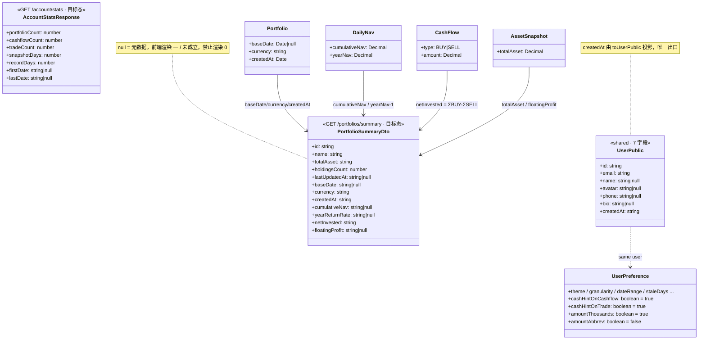

# 账户域增量设计 v2 · 后端缺口补齐 + 前端 4 项微调

> 架构师：高见远（software-architect）
> 上游：`../archive/system_design.md`（v1，账户域前端对齐，已标注缺口 A/B/C/D）、`docs/PRD.md` v3.1.8
> 本轮性质：**后端补字段（让「—」变真值）+ 前端 4 项微调**；Gap D（数据管理 CSV）不做
> 核查方式：逐文件实读 `schema.prisma` / `portfolio.service.ts` / `account.service.ts` / `overview.service.ts` / `preference.*` / `user-public.mapper.ts` / `calculation.service.ts` / `AccountPage.tsx` / `settings.tsx` / `edit-profile-dialog.tsx` / `api/types.ts`，结论以源码为准

---

## 0. 结论速览（含对任务书的 3 处规格修正）

| # | 事项 | 结论 |
|---|---|---|
| ① | **偏好 4 列默认值** | 任务书写「默认 false」，**与 PRD 冲突，以 PRD 为准**：PRD §6.9.1 L908/909 明确 `cashHintOnCashflow`/`cashHintOnTrade` 默认 **`true`**；PRD §7.8 草图 L1377 `[x] 千分位  [ ] 万/亿缩写` → `amountThousands` 默认 **`true`**、`amountAbbrev` 默认 **`false`**。前端 `DEFAULT_PREFERENCES` 已是 `true/true/true/false`，若后端落 false 会**翻转用户可见默认值**并造成前后端默认打架。 |
| ② | **微调 4-b「成立日显示 —」** | **不是 bug，不要修数据**。PRD FIN-D6：「净值基准日 = 第一笔存入日，与『组合成立日』语义一致」。`Portfolio.baseDate` 由 `calculation.service.ensureBaseDate()` 在**首笔 BUY 出入金**时写入；新建组合尚无存入 → `baseDate = null` 是**正确态**。若在新建组合时默认填创建日，会污染净值基准日语义、并让 `query-enhanced.service` 的 `all` 区间起点提前到无数据日。修法 = **把 null 表达清楚**（Gap A 返回 `baseDate` + `createdAt`，前端 null 时显示「未成立」并给 tooltip），而非造数。 |
| ③ | **微调 4-a「注册日期显示 -」** | **是真 bug，根因在后端**：`packages/shared/src/types/user.ts` 的 `UserPublic` 只有 6 个字段，`auth/user-public.mapper.ts` 的白名单投影**没有 `createdAt`**；而 `packages/web/src/api/types.ts:58` 的 `UserPublic` 却声明了 `createdAt: string`（类型说谎）→ 运行时永远 `undefined` → `AccountPage` L230 三元回落 `'-'`。修复点在**后端 mapper + shared 类型**，前端渲染代码无需改。 |

其余：Gap A/B/C 全部可落地，**无需引入任何新依赖**；Gap A 的四个金融字段**全部有现成数据源**（`DailyNav` / `CashFlow` / `AssetSnapshot`），不需要调用 overview 的重计算路径。

---

## Part A · 后端缺口最终规格

### A1. Gap A — `GET /portfolios/summary` 补 6 字段

#### A1.1 现状核查

- `portfolio.service.ts:241-318 getSummary()`：已 `findMany` 出完整 `Portfolio` 实体（**`baseDate` / `currency` / `createdAt` 已在内存里，只是没往外吐**），并 include 最新 1 条 `snapshots` 与 `securityTrades`；另有一段按组合循环的 `holdingsCount` 推导（既有 N+1，不在本轮改造范围）。
- `dto/portfolio-summary.dto.ts`：`PortfolioSummaryDto` 现 5 字段。
- **Prisma schema 无需任何改动**：`Portfolio.baseDate DateTime? @db.Date`、`Portfolio.currency String @default("CNY")` 均已存在（`schema.prisma:37-38`）。

#### A1.2 计算来源（关键：全部复用现成落库数据，不复用 `OverviewService`）

`OverviewService.getOverview()` 是**单组合重路径**（含 `holdingDerivationService.derive()` 逐标的推导 + 最近交易查询），逐组合调用会把 summary 拖成 O(组合数 × 持仓推导)，**不予复用**。但它的**口径**可以照抄——本设计与 overview 保持**同口径同精度**：

| 新字段 | 类型 | 数据来源 | 口径（与 `overview.service.ts` 完全一致） |
|---|---|---|---|
| `baseDate` | `string \| null` | `Portfolio.baseDate` | `YYYY-MM-DD`；null = 尚无首笔存入（组合未成立），**保持 null，不回落 createdAt** |
| `currency` | `string` | `Portfolio.currency` | 当前恒为 `'CNY'` |
| `createdAt` | `string` | `Portfolio.createdAt` | ISO 8601；**新增**，供前端在 `baseDate` 为 null 时展示「创建于 …（未成立）」 |
| `cumulativeNav` | `string \| null` | 最新一条 `DailyNav.cumulativeNav` | `toFixed(6)`（对齐 `overview.cumulativeNav`）；无 `DailyNav` 记录 → `null` |
| `yearReturnRate` | `string \| null` | 最新一条 `DailyNav.yearNav` | **比率**（非百分数）= `yearNav - 1`，`toFixed(8)`（对齐 `overview.yearReturnRate`）；无记录 → `null` |
| `netInvested` | `string` | `CashFlow` 聚合 | `Σ(type=BUY) - Σ(type=SELL)`，`toFixed(2)`（对齐 `overview.netInvested`） |
| `floatingProfit` | `string \| null` | 派生 | `totalAsset - netInvested`，`toFixed(2)`；**无总资产快照时返回 `null`**（此时 `totalAsset` 兜底为 `'0'`，相减会得到一个大幅为负的假亏损，必须避免） |

> ⚠️ 单位契约：`yearReturnRate` 是**比率**（`0.0523` = 5.23%），前端 `formatPercent()` 内部 `× 100`，两端已自洽，**不要在后端乘 100**。

#### A1.3 DTO 改动 — `packages/backend/src/modules/portfolio/dto/portfolio-summary.dto.ts`

```ts
export interface PortfolioSummaryDto {
  id: string;
  name: string;
  totalAsset: string;
  holdingsCount: number;
  lastUpdatedAt: string | null;

  // ===== 本轮新增（Gap A）=====
  /** 组合成立日 = 首笔存入日（FIN-D6）YYYY-MM-DD；null = 尚无存入，组合未成立 */
  baseDate: string | null;
  /** 组合币种（v1 恒为 CNY） */
  currency: string;
  /** 组合创建时间 ISO 8601（baseDate 为 null 时供前端展示「创建于 …」） */
  createdAt: string;
  /** 最新累计净值，6 位小数字符串；null = 尚无 DailyNav */
  cumulativeNav: string | null;
  /** 当年收益率（比率，非百分数）= yearNav - 1，8 位小数字符串；null = 尚无 DailyNav */
  yearReturnRate: string | null;
  /** 净投入 = Σ存入 - Σ取出，2 位小数字符串 */
  netInvested: string;
  /** 浮动盈亏 = totalAsset - netInvested，2 位小数字符串；null = 无总资产记录 */
  floatingProfit: string | null;
}
```

#### A1.4 Service 改动 — `portfolio.service.ts` `getSummary()`

在现有 `portfolios` 查询与 `holdingsCounts` 之后、`return portfolios.map(...)` 之前，插入两个**批量**查询（总计 +2 条 SQL，与组合数无关）：

```ts
import { Prisma } from '@prisma/client';   // 文件顶部补 value import（现有仅 type import）

// ...existing: portfolios / portfolioIds / holdingsCounts / countMap

// 🆕 每组合最新一条日净值（Postgres 下 Prisma 会把 distinct+orderBy 下推为 DISTINCT ON）
const latestNavs = portfolioIds.length
  ? await this.prisma.dailyNav.findMany({
      where: { portfolioId: { in: portfolioIds } },
      orderBy: [{ portfolioId: 'asc' }, { date: 'desc' }],
      distinct: ['portfolioId'],
      select: { portfolioId: true, cumulativeNav: true, yearNav: true },
    })
  : [];
const navMap = new Map(latestNavs.map((n) => [n.portfolioId, n]));

// 🆕 净投入：按 (组合, 类型) 聚合，一次查完
const cashflowSums = portfolioIds.length
  ? await this.prisma.cashFlow.groupBy({
      by: ['portfolioId', 'type'],
      where: { portfolioId: { in: portfolioIds } },
      _sum: { amount: true },
    })
  : [];
const netInvestedMap = new Map<string, Prisma.Decimal>();
for (const row of cashflowSums) {
  const amt = row._sum.amount ?? new Prisma.Decimal(0);
  const cur = netInvestedMap.get(row.portfolioId) ?? new Prisma.Decimal(0);
  netInvestedMap.set(
    row.portfolioId,
    row.type === 'BUY' ? cur.plus(amt) : cur.minus(amt),
  );
}
```

`map()` 内追加（**全程 `Prisma.Decimal` 运算，不落 float**）：

```ts
const nav = navMap.get(p.id) ?? null;
const netInvestedDec = netInvestedMap.get(p.id) ?? new Prisma.Decimal(0);
const totalAssetDec = latestSnapshot?.totalAsset ?? null;

return {
  id: p.id,
  name: p.name,
  totalAsset: totalAssetDec?.toString() ?? '0',
  holdingsCount: countMap.get(p.id) ?? 0,
  lastUpdatedAt,
  // 🆕
  baseDate: p.baseDate ? p.baseDate.toISOString().split('T')[0] : null,
  currency: p.currency,
  createdAt: p.createdAt.toISOString(),
  cumulativeNav: nav ? nav.cumulativeNav.toFixed(6) : null,
  yearReturnRate: nav ? nav.yearNav.minus(1).toFixed(8) : null,
  netInvested: netInvestedDec.toFixed(2),
  floatingProfit: totalAssetDec ? totalAssetDec.minus(netInvestedDec).toFixed(2) : null,
};
```

#### A1.5 性能与风险

- 改造后 SQL 数 = `1(portfolios) + N(holdingsCounts，既有) + 2(新增批量)`。**新增部分与组合数无关**，不引入新的 N+1。
- `distinct: ['portfolioId']`：Prisma 5.15 + PostgreSQL 会下推 `DISTINCT ON`。若工程师实测发现被降级为内存去重（读全量 `daily_nav`），**回退方案**：改为 `Promise.all(portfolioIds.map(pid => prisma.dailyNav.findFirst({ where:{portfolioId:pid}, orderBy:{date:'desc'}, select:{...} })))` —— N 条轻查询，与既有 `holdingsCounts` 同风格，行为绝对确定。
- `portfolio.service.spec.ts` **当前没有 `getSummary` 用例**（已核查），无需改测试；建议新增 1 个「无快照 / 无净值组合 → `cumulativeNav=null` 且 `floatingProfit=null`」用例。

---

### A2. Gap B — `GET /account/stats` 交易笔数拆分

#### A2.1 现状核查
`account.service.ts:53-55` 的 `transactionCount` = `prisma.cashFlow.count()`，**只含出入金**，字段名严重误导；`recordDays`（注册至今天数）与 `snapshotDays`（跨组合去重快照天数）口径正确，保留。`packages/backend/src/modules/account/` **无 spec 文件**，无测试需要同步。

#### A2.2 改动 — `AccountStatsResponse` + `getStats()`

```ts
export interface AccountStatsResponse {
  portfolioCount: number;
  /** 🆕 出入金笔数（CashFlow 计数）—— 原 transactionCount 改名 */
  cashflowCount: number;
  /** 🆕 证券买卖笔数（SecurityTrade 计数） */
  tradeCount: number;
  snapshotDays: number;
  firstDate: string | null;
  lastDate: string | null;
  recordDays: number;
}
```

`Promise.all` 数组内新增一项（保持并行，不加串行开销）：

```ts
// 所有组合累计证券买卖笔数（方案B：SecurityTrade 为持仓唯一来源）
this.prisma.securityTrade.count({ where: { portfolio: { userId } } }),
```

返回体：`transactionCount: totalTransactionCount` → `cashflowCount: totalCashflowCount, tradeCount,`。

> **契约变更说明**：`transactionCount` **直接改名、不保留兼容别名**。全仓核查：该字段前端仅 `AccountPage.tsx:444` 一处消费 + `api/types.ts` 一处声明，同批次（T03）改完即闭合，留别名反而是长期误导债。

---

### A3. Gap C — `UserPreference` 增 4 列

#### A3.1 Prisma — `packages/backend/prisma/schema.prisma`（`model UserPreference`，`staleDays` 之后）

```prisma
  cashHintOnCashflow Boolean  @default(true)  @map("cash_hint_on_cashflow")
  cashHintOnTrade    Boolean  @default(true)  @map("cash_hint_on_trade")
  amountThousands    Boolean  @default(true)  @map("amount_thousands")
  amountAbbrev       Boolean  @default(false) @map("amount_abbrev")
```

> 默认值依据 PRD §6.9.1 L908/909 与 §7.8 草图 L1377，**不是 false**（见 §0 修正①）。命名沿用本文件既有 snake_case `@map` 约定。

#### A3.2 Migration 方式

仓库已有 `prisma/migrations/{20260804_init_schema_b, 20260805_add_user_soft_delete}` + `migration_lock.toml` → **必须走 migrate，禁止 `db push`**（否则迁移历史断裂）：

```bash
pnpm --filter @investment-tracker/backend exec prisma migrate dev --name add_preference_display_flags
pnpm --filter @investment-tracker/backend exec prisma generate
```

四列均为 `NOT NULL DEFAULT`，存量行自动回填，**无数据迁移脚本、无停机**。

#### A3.3 `UpdatePreferenceDto`（`dto/update-preference.dto.ts`）

追加 4 个可选布尔（`@IsBoolean` 需从 `class-validator` 补 import）：

```ts
  @ApiPropertyOptional({ description: '出入金后现金余额软提示开关（SET-P0-07）' })
  @IsOptional()
  @IsBoolean()
  cashHintOnCashflow?: boolean;

  @ApiPropertyOptional({ description: '证券买卖后现金余额软提示开关（SET-P0-07）' })
  @IsOptional()
  @IsBoolean()
  cashHintOnTrade?: boolean;

  @ApiPropertyOptional({ description: '金额千分位（SET-P1-03）' })
  @IsOptional()
  @IsBoolean()
  amountThousands?: boolean;

  @ApiPropertyOptional({ description: '金额万 / 亿缩写（SET-P1-03）' })
  @IsOptional()
  @IsBoolean()
  amountAbbrev?: boolean;
```

> 这是解锁前端「不进 payload」限制的关键：`ValidationPipe({ forbidNonWhitelisted: true })` 只放行 DTO 白名单字段。

#### A3.4 `preference.service.ts` 四处同改

1. `PreferenceResponse` 接口 += 4 个 `boolean`；
2. `DEFAULTS` 常量 += `cashHintOnCashflow: true, cashHintOnTrade: true, amountThousands: true, amountAbbrev: false`；
3. 两处 `userPreference.create({ data: {...} })`（`get()` L65 / `update()` L139）各 += 4 项（也可依赖 Prisma `@default` 省略，但现有代码风格是显式列全，**保持一致**）；
4. `update()` 的 `data` 组装 += 4 行 `if (dto.x !== undefined) data.x = dto.x;`；
5. 两处 `return { ... }` 映射（L93 / L194）各 += 4 个字段。

`preference.service.spec.ts`（260 行）：mock 的 `userPreference` 对象需补这 4 个键；已核查其无 `Object.keys().toEqual()` 式全量键断言，**不会大面积红**。

---

### A4. Gap D — 数据管理 CSV：**本轮不做**

`settings.tsx` 数据管理区 3 个 `disabled` 占位按钮**原样保留**，不新增 export/import API、不改文案。仅在此登记：SET-P0-03 / SET-P0-04 仍为未实现。

---

### A5. 微调 4-a 的后端修复 — `UserPublic` 补 `createdAt`

| 文件 | 改动 |
|---|---|
| `packages/shared/src/types/user.ts` | `interface UserPublic` += `/** 注册时间 ISO 8601 */ createdAt: string;` |
| `packages/backend/src/modules/auth/user-public.mapper.ts` | 白名单投影 += `createdAt: user.createdAt.toISOString(),` |
| `packages/backend/src/modules/auth/auth.service.spec.ts` | L114 `USER_PUBLIC_KEYS` → `['avatar','bio','createdAt','email','id','name','phone']`（sorted）；**删除** L674 `expect(result).not.toHaveProperty('createdAt')`；L96 `buildUser()` 已带 `createdAt`，无需改 |

> 一处改动全链路生效：`register` / `login` / `getProfile` / `updateProfile` / `updateEmail` / `updatePassword` / `upload.service`（均经 `toUserPublic`）。
> `updatedAt` **不补**（无任何 UI 消费），改为把前端类型标可选，见 B5。

---

## Part B · 前端 4 项微调（组件级）

### B1. 微调 1 — 头像 URL 输入框不回显站内上传路径
**文件**：`packages/web/src/features/account/edit-profile-dialog.tsx`

**根因**：L130-132 的 `useEffect(() => setAvatarUrlDraft(avatarValue), [avatarValue])` 无差别回灌——本地上传成功后 `setValue('avatar', data.url)`（`/api/uploads/avatar/xxx`）会把内部路径写进「头像 URL」输入框。

**方案**（只改「回灌」与「展示」，不动上传/保存链路，也不动 zod 校验——zod 仍需放行站内相对路径，因为表单 `avatar` 字段照旧承载它）：

```ts
/** 仅 http(s) 外链才回灌输入框；站内上传路径不对外暴露 */
const isExternalUrl = (v: string): boolean => /^https?:\/\//i.test(v);

// L130-132 替换
useEffect(() => {
  setAvatarUrlDraft(isExternalUrl(avatarValue) ? avatarValue : '');
}, [avatarValue]);

/** 当前头像来自本地上传（有值但不是外链） */
const isUploadedAvatar = Boolean(avatarValue) && !isExternalUrl(avatarValue);
```

配套（L298-336 头像 URL 区块）：
- `<Input placeholder>`：`isUploadedAvatar ? '已通过本地上传设置头像' : 'https://example.com/avatar.png'`；
- `[应用]` `disabled`：`isBusy || avatarUrlDraft.trim() === '' || avatarUrlDraft.trim() === avatarValue`（原 `avatarUrlDraft === avatarValue` 在草稿被清空后会误灰）；
- 说明文案追加一句：「本地上传的头像不会显示为 URL（站内路径不对外暴露）；此处仅用于粘贴外部图片地址」。

**覆盖的 3 条路径**：打开对话框（已有站内头像→框空+占位提示）、上传成功（框保持空）、移除头像（`avatarValue=''`→框空+默认占位）。用户手动粘贴外链 → 点应用 → `avatarValue` 变外链 → 回灌成立，输入框正常显示。

---

### B2. 微调 2 — 账户页去重「前往设置」+ 四卡横排
**文件**：`packages/web/src/pages/AccountPage.tsx`

**(a) 去掉冗余入口**：删除 `PageHeader` 的 `actions` 块（L190-199 的「前往设置 →」按钮），**保留个人信息卡内 L239-246 的「前往设置修改 →」**（更贴近「卡内零修改控件、仅提供跳转」的 §7.7 语义）。同步删除 L41 `Settings` 图标 import（否则 `noUnusedLocals` 报错）。

**(b) 布局改横排**：删掉右侧那层 `<div className="space-y-6 lg:col-span-2">`（L251、L495），把四张 Card 拉平进同一个 12 列栅格：

```tsx
<div className="grid grid-cols-1 gap-6 xl:grid-cols-12">
  <Card className="xl:col-span-3"> 个人信息 </Card>
  <Card className="xl:col-span-5"> 资产全景 </Card>
  <Card className="xl:col-span-4"> 数据统计 </Card>
  <Card className="xl:col-span-12"> 我的组合 </Card>
</div>
```

- **DOM 顺序变化**：「数据统计」上移到「我的组合」之前（横排必需），需在 PR 说明中点出。
- **「我的组合」独占整行**：7 列表格（名称/成立日/币种/总资产/净值/当年%/更新日）挤进 1/3 宽会不可读，整行是唯一可用解。若产品坚持四卡同一行，则表格必须加横向滚动 —— **不推荐**，本设计选整行方案。
- **窄屏回退**：`grid-cols-1` 为基线，`xl`(≥1280px) 才生效横排，天然纵向回退。
- **卡内栅格同步收窄**：资产全景 `grid-cols-2 gap-4 sm:grid-cols-4` → `grid-cols-2 gap-4`（2×2）；数据统计 `grid-cols-2 gap-4 sm:grid-cols-3` → `grid-cols-2 gap-4`；两处 loading 骨架同改。
- 加载态骨架（L163）`lg:grid-cols-3` → `xl:grid-cols-12` + 三块 `xl:col-span-4`，或简单保持 3 列亦可。

**(c) 缺口注脚清理**（Gap A/B 落地后）：删除 L299-305、L408-410、L484-486 的「待后端补充」提示与文件头 L20-26 的缺口 A/B/C 注释块；`missingAssetCount` 与 Q-07 那两条注脚**保留**（仍然成立）。

---

### B3. 微调 3 — 设置页偏好 4 项横排
**文件**：`packages/web/src/pages/settings.tsx`

现状：外观主题（L617-635）、软提示开关（L643-664）、金额格式（L670-689）、快照过期阈值（L691-709）是 4 个平级 `<div className="space-y-2">`，落在外层 `space-y-6` 里 → 纵向堆叠。

**方案**：用一个栅格把这 4 块整体包住（**不改各块内部结构**，diff 最小）：

```tsx
<div className="grid grid-cols-1 gap-4 sm:grid-cols-2 xl:grid-cols-4">
  {/* 外观主题 */}      <div className="space-y-2"> …原样… </div>
  {/* 软提示开关 */}    <div className="space-y-2"> …原样… </div>
  {/* 金额格式 */}      <div className="space-y-2"> …原样… </div>
  {/* 快照过期阈值 */}  <div className="space-y-2"> …原样… </div>
</div>
```

- 断点：窄屏 1 列 → `sm` 2×2 → `xl` 4 列一行，满足「横排 + 窄屏回退纵向」。
- 微调配套：软提示 / 金额格式内部 `flex flex-wrap items-center gap-6` → `gap-4`（1/4 列宽下允许换行）；快照阈值 `<Input className="w-[120px]">` → `className="w-full"`（贴合列宽）；外观主题 `RadioGroup orientation="horizontal"` 三项在 ~250px 列宽可容纳，如实测溢出则给其容器加 `flex-wrap`。
- **约束不变**：本项纯布局，**不改变「金额格式/软提示当前不进 payload」的既有约束**；解锁在 T03（Gap C 落地后）统一做。

---

### B4. 微调 4 — 注册日期 / 成立日期

#### (a) 注册日期（确认为 bug，主修在后端）
- 后端修复见 **A5**。
- 前端：`web/src/api/types.ts` 的 `UserPublic.createdAt` **已存在**，`AccountPage.tsx:227-233` **已渲染** `formatDate(currentUser.createdAt)` —— 后端补投影后自动亮。
- ⚠️ 唯一需要动的前端点：`AccountPage.tsx:156` 的 `const currentUser = user ?? profile.data;` → 改为 **`profile.data ?? user`**。原因：`auth.store` 从 `localStorage` 恢复的**旧缓存 user 不含 `createdAt`**，`user` 优先会让老用户在下次重新登录前一直看到 `-`；`profile.data` 来自 `GET /auth/profile` 的新鲜响应。

#### (b) 组合成立日（**不是 bug**，见 §0 修正②）
- 链路核查结论：
  - `portfolio.service.create()`（L76-86）**只写 `userId/name/description/currency`，不写 `baseDate`** —— 这是**有意为之**；
  - `baseDate` 唯一写入点 = `calculation.service.ensureBaseDate()`（L106-128），在**首笔 BUY 出入金**落库时设为该笔日期；
  - `clearData()`（L165）会把 `baseDate` 重置为 null（SET-P0-05 验收 4）；
  - 前端 `PortfolioDialog` 仅提交 `{name, description}`，`CreatePortfolioRequest` 无 `baseDate` 字段 —— 与后端一致，**无需改**。
- 因此：新建组合 / 已清空数据的组合 `baseDate = null` → 显示「—」在语义上正确，用户感知的「bug」是**表达不清**。
- **修复点（表达层）**：Gap A 让 summary 直接返回 `baseDate` + `createdAt`；`AccountPage` 组合列表「成立日」单元格改为：

```tsx
{p.baseDate ? (
  formatDate(p.baseDate)
) : (
  <span className="text-muted-foreground" title="成立日 = 首笔存入日（FIN-D6）；该组合尚无存入记录">
    未成立
  </span>
)}
```

  可选增强：`未成立` 下方以 `text-[11px]` 补一行 `创建于 {formatDate(p.createdAt)}`。
- 同时**删除 L347-350 的 `portfolioMetaMap` 兜底**（`meta?.baseDate` / `meta?.currency`）与 L121 的 `usePortfolios()` 依赖 —— Gap A 后 summary 是单一数据源，兜底属重复取数（若 `usePortfolios` 在该页无其它用途则一并移除 import）。

---

### B5. 类型与 hooks 收口（`api/types.ts` / `use-preferences.ts` / `preference.store.ts`）

| 位置 | 改动 |
|---|---|
| `api/types.ts` `PortfolioSummary` | 6 个「⚠️ 后端缺口」注释删除；`baseDate: string \| null`、`currency: string`、`createdAt: string`、`netInvested: string`、`floatingProfit: string \| null` 转为**必填**；`cumulativeNav`/`yearReturnRate` 类型 `number \| null` → **`string \| null`**（后端按金融精度传字符串，`formatDecimal`/`formatPercent` 均已接受 string） |
| `AccountPage.tsx` 当年% 着色 | `p.yearReturnRate >= 0` → `Number(p.yearReturnRate) >= 0`（字符串化后 TS 会报错，必须显式转数） |
| `api/types.ts` `AccountStats` | `transactionCount: number` → `cashflowCount: number`；`tradeCount?: number` → **`tradeCount: number`**（必填）；删缺口注释 |
| `api/types.ts` `UserPublic` | `createdAt: string` 保持；`updatedAt: string` → `updatedAt?: string`（后端不返回，避免类型说谎） |
| `api/types.ts` `UserPreference` / `UpdatePreferenceDto` | += `amountThousands: boolean`、`amountAbbrev: boolean`（`cashHint*` 两项已存在） |
| `stores/preference.store.ts` `DEFAULT_PREFERENCES` | += `amountThousands: true, amountAbbrev: false`（`cashHint*` 已是 `true/true`，与后端新默认一致 ✔） |
| `settings.tsx` | 删除 `uiOnlyPrefs` / `updateUiOnlyPref` 整块（L221-235），4 项并入 `prefForm` + `handleSavePreferences` payload + `hasPrefChanges` 比较项 + `useEffect` 服务端同步；删除相关「⚠️ 后端缺口 D」注释与两处「待后端补充字段后方可持久化」脚注 |
| `hooks/use-preferences.ts` | **无需改**（透传 `UpdatePreferenceDto`，无硬编码白名单，已核查） |

---

## Part C · 任务列表（按实现顺序）

| Task | 名称 | 端 | 源文件 | 依赖 | 优先级 | PRD ID |
|---|---|---|---|---|---|---|
| **T01** | 后端 Gap A + Gap B + `UserPublic.createdAt` | 后端 | `portfolio/dto/portfolio-summary.dto.ts`、`portfolio/portfolio.service.ts`、`account/account.service.ts`、`shared/src/types/user.ts`、`auth/user-public.mapper.ts`、`auth/auth.service.spec.ts` | — | P0 | ACC-P0-03 / ACC-P0-04 / ACC-P0-06 / ACC-P0-02 |
| **T02** | 后端 Gap C：偏好 4 列（schema + migration + DTO + service + spec） | 后端 | `prisma/schema.prisma`、`prisma/migrations/*`、`preference/dto/update-preference.dto.ts`、`preference/preference.service.ts`、`preference/preference.service.spec.ts` | — | P0 | SET-P0-07 / SET-P1-03 |
| **T03** | 前端接真值：类型收口 + 账户页去占位 + 偏好入 payload | 前端 | `api/types.ts`、`pages/AccountPage.tsx`、`pages/settings.tsx`、`stores/preference.store.ts` | T01, T02 | P0 | ACC-P0-03/04/06、SET-P0-07、SET-P1-03 |
| **T04** | 前端 4 项微调（布局 + 交互，纯 UI） | 前端 | `features/account/edit-profile-dialog.tsx`、`pages/AccountPage.tsx`、`pages/settings.tsx` | — | P0 | §7.7 / §7.8 / §7.9、SET-P0-01 |
| **T05** | 联调验收 + 文档收口 | 全栈 | `../archive/system_design.md`、`../archive/class-diagram-account-v2.mermaid`、`docs/PRD-COVERAGE-MATRIX.md`、回归清单 | T03, T04 | P1 | 全局一致性 |

**并行建议**：T01 / T02 / T04 三者互不冲突，可同时开工（T04 只碰布局与 `edit-profile-dialog`，T03 只碰数据绑定）。**T03 与 T04 同时改 `AccountPage.tsx` / `settings.tsx`** —— 若由同一工程师串行做（T04 → T03）可完全避免冲突；若并行，请约定 T04 只动 JSX 容器/className、T03 只动数据表达式。

**T05 验收清单（逐条可勾）**
1. 账户页「合计净投入 / 合计浮动盈亏」显示真实金额（非「—」）；无快照组合不参与浮动盈亏合计。
2. 组合列表「净值 / 当年%」有数据的组合显示数值，当年% 正负着色正确（比率 ×100 后为百分比）。
3. 组合列表「成立日」：有存入的组合显示日期；无存入显示「未成立」+ tooltip，**不显示创建日冒充成立日**。
4. 「币种」显示 CNY（来自 summary，非 `usePortfolios` 兜底）。
5. 数据统计「出入金笔数 / 证券买卖笔数」两项均为真实计数且口径可对账。
6. 个人信息卡「注册于 …」显示真实注册日期（含**清 localStorage 重登** + **不清缓存直接刷新**两种场景）。
7. 账户页只剩 1 处「前往设置」入口；四卡在 ≥1280px 横排、窄屏纵向。
8. 设置页 4 项偏好横排；勾选「千分位/软提示」后点「保存偏好」→ **200 而非 400**，刷新后保持。
9. 新用户首次 `GET /users/preferences` 返回 `cashHintOnCashflow=true, cashHintOnTrade=true, amountThousands=true, amountAbbrev=false`。
10. 编辑资料：本地上传头像后 URL 输入框为空并显示「已通过本地上传设置头像」；粘贴外链→[应用]→预览刷新→[保存]生效。
11. 回归：注销确认文案**不含「联系客服」**（§7.8 L1402 硬约束，本轮禁止触碰）。
12. 回归：概览页 `dashboard.tsx` 消费 `PortfolioSummary` 的部分不因新增字段/类型变更而编译失败。

---

## Part D · 共享知识（跨文件约定）

### D1. 字段映射（PRD 草图 ↔ 后端 ↔ 前端）

| 草图字段 | 后端来源 | API 字段（本轮后） | 前端消费 |
|---|---|---|---|
| 资产全景·合计净投入 | `Σ CashFlow(BUY) - Σ(SELL)` | `PortfolioSummaryDto.netInvested: string` | `Σ` 求和（金额类求和允许，Q-07 只禁跨组合 XIRR/净值） |
| 资产全景·合计浮动盈亏 | `totalAsset - netInvested` | `floatingProfit: string \| null` | `Σ`（跳过 null） |
| 组合列表·成立日 | `Portfolio.baseDate`（首笔存入日，FIN-D6） | `baseDate: string \| null` | null → 「未成立」 |
| 组合列表·币种 | `Portfolio.currency` | `currency: string` | 直显 |
| 组合列表·净值 | 最新 `DailyNav.cumulativeNav` | `cumulativeNav: string \| null`（6 位） | `formatDecimal` |
| 组合列表·当年% | 最新 `DailyNav.yearNav - 1` | `yearReturnRate: string \| null`（**比率**，8 位） | `formatPercent`（内部 ×100） |
| 统计·出入金笔数 | `cashFlow.count` | `AccountStats.cashflowCount` | 直显 |
| 统计·证券买卖笔数 | `securityTrade.count` | `AccountStats.tradeCount` | 直显 |
| 统计·账户使用天数 | `now - user.createdAt` | `recordDays`（不变） | 直显 |
| 个人信息·注册日期 | `User.createdAt` | `UserPublic.createdAt`（ISO） | `formatDate` |
| 偏好·软提示 / 金额格式 | `UserPreference` 4 新列 | `UserPreference` / `UpdatePreferenceDto` | 进 payload（T03 后） |

### D2. 硬约定
- **金额 / 净值 / 收益率一律以 `string` 跨网**（`Prisma.Decimal.toFixed(n)`），禁止后端转 `number` 再序列化；精度：金额 2 位、净值 6 位、收益率 8 位（与 `overview.service` 完全一致）。
- **收益率是比率不是百分数**：`0.0523` = 5.23%，前端 `formatPercent` 负责 ×100。
- **「无数据」用 `null`，不用 `0`/`''`**（`cumulativeNav` / `yearReturnRate` / `floatingProfit` / `baseDate`）；前端 null → `—` 或「未成立」，禁止把 null 渲染成 0。
- **金融指标不在前端计算**（FIN-F0-09 C-01）；跨组合**纯金额求和**是既有豁免（`totalAsset` 已如此）。
- **`toUserPublic` 是 User 对外投影的唯一出口**，加字段只改这一处（`auth` 与 `upload` 共用）。
- **偏好写入必须过 DTO 白名单**（`forbidNonWhitelisted`）：新字段必须同时出现在 `UpdatePreferenceDto` 与 service 的 `data` 组装里，缺一即静默丢失或 400。
- **偏好默认值以 PRD §6.9.1 为唯一权威**，后端 `@default` / 后端 `DEFAULTS` / 前端 `DEFAULT_PREFERENCES` 三处必须一致（`true/true/true/false`）。
- **`Portfolio.baseDate` 只由 `ensureBaseDate()` 写、由 `clearData()` 清**，任何其它位置（含创建组合）**不得赋值**。

### D3. 类图（目标态）



（`../archive/class-diagram-account-v2.mermaid` 已同步替换为上述目标态。）

---

## Part E · 待明确事项 / 风险登记

| # | 事项 | 现状结论 | 需谁确认 |
|---|---|---|---|
| E1 | **偏好 4 列默认值 false vs true** | 本设计取 PRD §6.9.1 的 `true/true/true/false`，与任务书「默认 false」冲突 | **主理人拍板**（架构建议：从 PRD） |
| E2 | `user.createdAt` 是否已有 | **有**（`User.createdAt @default(now())`），但未投影到 `UserPublic` → 需 A5 修复 | 已定论 |
| E3 | 新建组合 `baseDate` 赋值来源 | **有意不赋值**，由首笔 BUY 出入金触发（FIN-D6）；本轮**不改**，改为「未成立」表达 | 已定论；若产品坚持「创建日即成立日」→ 属 PRD 变更，需改 FIN-D6 与净值基准日口径，**不在本轮** |
| E4 | `distinct: ['portfolioId']` 是否下推 DISTINCT ON | Prisma 5.15 + PG 预期下推；若实测退化为内存去重，用 A1.5 的 `findFirst × N` 回退方案 | 工程师实测 |
| E5 | 「我的组合」是否必须与其余三卡同一行 | 本设计让其独占整行（7 列表格可读性刚性要求） | 主理人/用户确认，若坚持同行则表格需横向滚动 |
| E6 | `transactionCount` 改名是否需兼容期 | 全仓仅 2 处引用，同批闭合，**不留别名** | 已定论 |
| E7 | 千分位 / 万亿缩写偏好落库后是否要接入 `formatCurrency` | PRD SET-P1-03 验收 1 要求「全站金额走 `formatCurrency` 读偏好」——本轮**只落库不接渲染**，全站接入是独立 P1 任务 | 主理人排期 |
| E8 | Gap D（CSV 导出/导入） | 本轮不做，占位保持 disabled | 已定论 |
