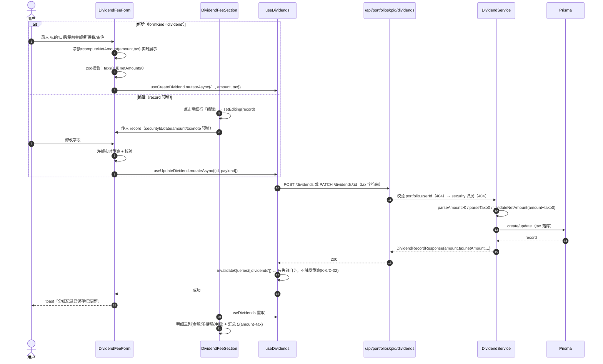
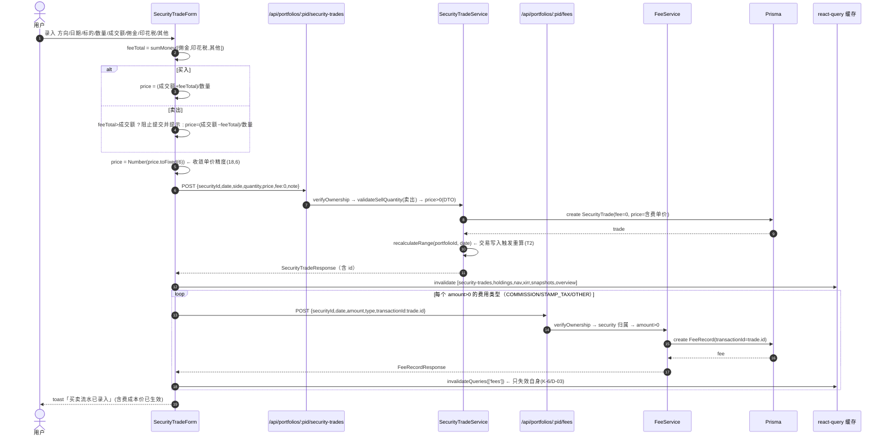
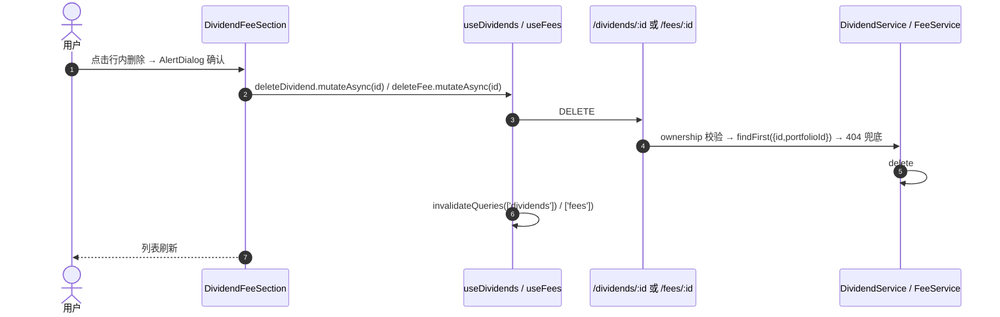
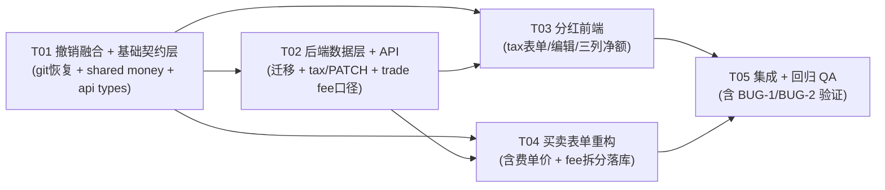

# 增量设计 v1 · 分红去融合 + 所得税 + 编辑 / 费用并入买卖 + 含费成本价

> 架构师：高见远（architect）
> 上游：`docs/designs/incremental-dividend-fee-rework-v1.md`（增量 PRD v1，**原文不动**）、`docs/PRD.md`、`docs/ARCHITECTURE.md`
> 本文件性质：**增量系统设计 + 任务分解**（仅设计，不含代码；撤销融合的 git 操作由工程师执行，本文件只描述方案）
> 状态：设计完成，待工程实现

---

## 0. 结论速览（先看这里）

| # | 结论 | 依据 |
|---|---|---|
| C-1 | **撤销融合 = 2 条 git 命令**，作为 T01 第一件事：`git checkout -- packages/web/src/pages/HoldingsPage.tsx` + `rm packages/web/src/features/security-trade/__tests__/trade-dialog-dividend-tab.test.tsx` | 已核 diff：HoldingsPage 只多 `TradeDialogTab`/Tab/`openTradeDialog` 三处改动（+46/−9），`git diff --stat` 确认仅此一个文件被改 |
| C-2 | **DividendRecord.tax 迁移零风险**：`ALTER TABLE dividend_records ADD COLUMN tax NUMERIC(18,2) NOT NULL DEFAULT 0`，存量行自动 tax=0（Q-1 默认） | schema.prisma 现无 tax；迁移格式对齐现有 `migration.sql` |
| C-3 | **分红 PATCH 端点**：`PATCH /api/portfolios/:portfolioId/dividends/:id`，DTO 全可选，服务层 resolve 后校验 `netAmount = amount − tax ≥ 0`，响应统一加 `tax` + `netAmount` | 沿用 dividend 模块既有 ownership 双闸范式（portfolio → security） |
| C-4 | **费用拆分提交形态（关键决策）**：**前端顺序调用** —— 先 `POST /security-trades`（fee 强制 0，price=含费单价）拿 `trade.id`，再对 **amount>0 的每个类型** 逐个 `POST /fees`（带 `transactionId`）；**不新增**后端批量事务端点 | 理由见 §1.4：复用现有 fee POST（已支持 transactionId）、费用独立于交易（Q-3 不级联）、失败可补录、后端零新增契约 |
| C-5 | **trade.fee 口径**：`create` 强制落 0（忽略 DTO.fee）；`update` **忽略 fee 字段**（保留现值，存量 fee≠0 数据不丢失） | 关键验证：holding 推导 `costTotal += qty×price + fee`，新口径 fee=0 + price=含费单价 后结果与旧口径**自动等价**，推导公式零改动（见 §1.3） |
| C-6 | **费用为 0 的类型不落 FeeRecord**（明确建议，收口 PRD K-4 留给工程师的细节） | 落 0 记录会污染费用明细与累计费用展示，且无信息量 |
| C-7 | **卖出「费用合计 > 成交额」双闸**：前端表单层阻止（明确文案）+ 后端 `price > 0` DTO 校验兜底（费用>成交额 ⇒ 计算价 ≤ 0 ⇒ 400） | 后端不接收费用拆分，无法做明细级校验；price 正数校验即等价兜底 |
| C-8 | **金额校验工具收敛到 shared**：新增 `packages/shared/src/money.ts`（`isMoneyString` / `computeNetAmount` / `sumMoney`，整数分运算防浮点），前后端共用 | PRD §8 备注明确建议收敛，避免两套正则漂移 |
| C-9 | **任务拆分 5 个**（T01 基础设施+撤销 / T02 后端数据层+API / T03 分红前端 / T04 买卖表单 / T05 集成+回归 QA），T03/T04 依赖 T01+T02 后可并行 | 符合「≤5 任务、每任务 ≥3 文件、按层次分组」硬约束 |
| C-10 | **本轮不做存量 trade 数据迁移**（旧 fee≠0 的 trade 不重算、不拆分 FeeRecord），编辑时给提示 | PRD 未要求迁移；Q-5 允许工程师说明口径 |

---

## Part A · 系统设计

### 1. 实现方案 + 框架选型

#### 1.1 核心难点与对策

| 难点 | 对策 |
|---|---|
| 分红净额口径（税前−税、≥0）前后端一致 | 后端 service 层以 `Prisma.Decimal` 强校验（`parseAmount` / 新增 `parseTax` / `validateNetAmount`）；前端 zod schema 同口径 refine；响应统一返回 `netAmount`，前端**不自行二次计算**（口径漂移最小化） |
| 「先建 trade 拿 id 再建 fee」的时序与一致性 | 选**前端顺序调用**（见 §1.4），trade 成功后才逐个 POST fee；失败时交易已落库、费用可在【E】区补录（费用本就独立于交易，Q-3） |
| 含费单价反推会导致编辑态无法还原费用拆分 | 编辑态**不展示费用三框**、不重算 FeeRecord；仅保留「数量 + 含费单价」直编 + 只读换算成交额；存量 fee≠0 提示口径 |
| 金额浮点丢精 | 金额/税/费用：**字符串**传输（IsDecimal + zod refine）；单价：沿用现有 IsNumber 契约、前端 `toFixed(6)` 收敛（K-7 在 trade 上的既有例外，见待明确 U-3） |
| 撤销融合与后续开发的文件冲突 | T01 第一动作即 git 恢复 + 删测试文件，之后所有开发在干净基线上进行 |

#### 1.2 框架选型（延续现有技术栈，**零新依赖**）

- **后端**：NestJS + Prisma + PG16（现状），新增 PATCH 沿用 `@Patch` + class-validator 校验管线；金额计算用 `Prisma.Decimal`（现状已有）。
- **前端**：Vite + React 18 + TS + Tailwind + shadcn/ui（现状），表单继续用 `react-hook-form` + `zodResolver`，数据层继续用 `@tanstack/react-query`。
- **shared**：新增纯 TS 工具模块 `packages/shared/src/money.ts`（无外部依赖），前端/后端均从 `@investment-tracker/shared` 导入。
- **不引入**：不新增任何第三方包（PRD 约束「不引入新依赖」）；费用批量提交**不新增**后端批量端点。

#### 1.3 关键验证：持仓推导公式零改动

`holding-derivation.service.ts` 买入成本计算为 `costTotal += qty × price + fee`。

- 旧口径：price = 成交单价（不含费），fee = 手续费 → `qty×p + fee` = 实付成本
- 新口径（K-3）：price = 含费单价 = (成交额+费用合计)/qty，fee = 0 → `qty×p + 0` = 成交额 + 费用合计 = 实付成本

**两者数值等价** ⇒ 后端持仓推导、概览、快照、XIRR 链路**全部零改动**。这是「含费成本价」能安全落库的关键前提，写入共享知识（§K-1）。

#### 1.4 费用提交接口形态决策（R-7 核心）

**推荐：前端顺序调用（复用现有端点），不新增批量接口。**

```
POST /security-trades            → { …, price: 含费单价, fee: 0 }   → 返回 trade.id
POST /fees  (≤3 次，仅 amount>0)  → { securityId, date, amount, type, transactionId: trade.id }
```

理由：
1. **后端零新增契约**：`CreateFeeRecordDto` 已支持 `transactionId`（`fee.service.create` 已落库），`fee.api.ts`/`useCreateFee` 已存在，仅需前端编排。
2. **与业务定位一致**：FeeRecord 是独立信息记录（Q-3 删除交易默认不级联），trade 与 fee 之间允许「交易成功、费用待补」的中间态，天然可重试。
3. **失败面小**：3 次小请求，失败时 toast 提示「交易已录入，费用补录失败，请到『分红/费用』区补录」，不阻塞主流程。
4. **备选（不采用，记录为 P2）**：`POST /security-trades` 增加可选 `fees[]` 数组，后端 `$transaction` 一次落库 —— 强一致但扩大后端契约与测试面，且与「费用独立」定位冲突，本轮不做。

> 时序：`createSecurityTrade.mutateAsync` 需从现有 `mutate` 改为 `mutateAsync` 以拿 trade.id（前端唯一必要的调用方式变更）。

#### 1.5 边界口径决策

| 边界 | 决策 | 理由 |
|---|---|---|
| 存量 trade（fee≠0）编辑 | 编辑表单隐藏费用三框；保存时后端 update **忽略 fee**（现值保留）；前端对 `trade.fee !== '0'` 显示提示「旧口径记录，编辑不改成本口径，如需费用拆分请删除重录」 | PRD Q-5 / 验收 7.4「口径一致或给出明确提示」；强制置 0 会破坏旧成本（holding 推导少算费用） |
| 费用为 0 的类型 | **不落 FeeRecord** | K-4 业务口径「有值的费用类型各落一条」；落 0 污染明细与累计费用 |
| 卖出费用>成交额 | 前端表单阻止（zod refine + 提示「费用合计不能超过成交额」）+ 后端 `price>0` DTO 兜底（400） | 后端不接收费用拆分，price 正数即等价校验（见 C-7） |
| 存量分红数据 | 迁移默认 tax=0，`netAmount = amount`；service `toResponse` 以 `record.tax ?? 0` 防御 | Q-1 默认 |
| 分红编辑改标的 | 允许（沿用新增时 `validateSecurityInPortfolio` 双闸） | Q-2 |
| 编辑后缓存 | 只失效 `['dividends']`，不触发任何重算 | R-10 / K-6 / D-02 |

---

### 2. 文件列表（相对仓库根）

> 标注：🆕=新增，✏️=修改，🗑=删除，🔄=git 恢复（不改代码）

**shared（T01）**
| 文件 | 动作 | 说明 |
|---|---|---|
| `packages/shared/src/money.ts` | 🆕 | 金额/税/费用工具：`MONEY_RE`、`isMoneyString`、`computeNetAmount`、`sumMoney`（整数分运算） |
| `packages/shared/src/index.ts` | ✏️ | 导出 money 工具 |

**backend（T02）**
| 文件 | 动作 | 说明 |
|---|---|---|
| `packages/backend/prisma/schema.prisma` | ✏️ | `DividendRecord` 增加 `tax Decimal @default(0) @db.Decimal(18,2)` |
| `packages/backend/prisma/migrations/20260808_add_dividend_tax/migration.sql` | 🆕 | `ALTER TABLE "dividend_records" ADD COLUMN "tax" NUMERIC(18,2) NOT NULL DEFAULT 0;` |
| `packages/backend/src/modules/dividend/dto/create-dividend-record.dto.ts` | ✏️ | 增加 `tax?: string`（IsDecimal 0,2 + IsOptional） |
| `packages/backend/src/modules/dividend/dto/update-dividend-record.dto.ts` | 🆕 | 全可选：securityId/date/amount/tax/note |
| `packages/backend/src/modules/dividend/dividend.service.ts` | ✏️ | `parseTax`、`validateNetAmount`、`update()`、响应加 `tax`/`netAmount` |
| `packages/backend/src/modules/dividend/dividend.controller.ts` | ✏️ | 新增 `@Patch(':id') update()` |
| `packages/backend/src/modules/security-trade/security-trade.service.ts` | ✏️ | create 强制 `fee: 0`；update 移除 fee 写入（保留现值） |
| `packages/backend/src/modules/security-trade/security-trade.dto.ts` | ✏️ | `CreateSecurityTradeDto.fee` 标注 `@IsOptional`（兼容旧前端；服务层仍强制 0） |
| `packages/backend/src/modules/dividend/dividend.service.spec.ts` | ✏️ | 增加 tax 解析 / netAmount 校验 / update 用例 |
| `packages/backend/src/modules/dividend/dividend-fee-acceptance.spec.ts` | ✏️ | 增加 tax 双闸、PATCH 越权 404、netAmount 响应断言 |
| `packages/backend/src/modules/security-trade/security-trade.service.spec.ts` | 🆕 | 新建：create 强制 fee=0（传 5.0 仍落 0）、update 忽略 fee、price>0 卖出兜底 |

**web（T01 / T03 / T04 / T05）**
| 文件 | 动作 | 说明 |
|---|---|---|
| `packages/web/src/pages/HoldingsPage.tsx` | 🔄 | T01 git 恢复（无代码改动）；T05 验证无 Tab 残留 |
| `packages/web/src/features/security-trade/__tests__/trade-dialog-dividend-tab.test.tsx` | 🗑 | T01 删除（未跟踪文件） |
| `packages/web/src/api/types.ts` | ✏️ | `DividendRecord` +tax/netAmount；`CreateDividendRecordDto` +tax；🆕`UpdateDividendRecordDto`；trade 注释 fee 恒 0 |
| `packages/web/src/api/dividend.api.ts` | ✏️ | 新增 `updateDividend`（PATCH） |
| `packages/web/src/hooks/use-dividends.ts` | ✏️ | 新增 `useUpdateDividend`（只失效 `['dividends']`） |
| `packages/web/src/features/security-income/dividend-fee-form.tsx` | ✏️ | 增加 tax 输入 + 净额实时展示 + 编辑态（`record` prop 预填） |
| `packages/web/src/features/security-income/dividend-fee-section.tsx` | ✏️ | 移除「录入费用」按钮；分红明细三列 + 编辑入口；汇总改 Σ净额；`aggregateBySecurity` 净额口径 |
| `packages/web/src/features/security-trade/security-trade-form.tsx` | ✏️ | 重构：成交额 + 三费用框 + 费用合计 + 含费单价展示 + 卖出校验 + 先 trade 后 fee |
| `packages/web/src/features/security-income/__tests__/dividend-fee-tax.test.tsx` | 🆕 | tax 字段 / 净额实时 / 税>金额阻止 / 编辑预填 |
| `packages/web/src/features/security-trade/__tests__/security-trade-form-fee.test.tsx` | 🆕 | 含费单价公式 / 费用合计 / 卖出阻止 / 提交序列（trade→fee） |
| `packages/web/src/features/security-trade/__tests__/security-type-shared.test.tsx` | ✏️ | 适配表单重构（字段名/提交载荷断言） |
| `packages/web/src/features/security-income/__tests__/dividend-fee-acceptance.test.tsx` | ✏️ | 扩展：净额汇总、三列、编辑入口 |
| `packages/web/src/pages/__tests__/holdings-page.test.tsx` | ✏️ | 回归：弹窗无 Tab、分红入口仅【E】 |
| `packages/web/src/pages/__tests__/holdings-dividend-fee.test.tsx` | ✏️ | 回归：净额口径、费用入口移除 |

**仅验证不修改（T05）**：`packages/web/src/pages/snapshots.tsx`、`packages/web/src/api/snapshot.api.ts`（旧 BUG-1/BUG-2 回归）。

---

### 3. 数据结构与接口（类图）

```mermaid
classDiagram
    direction LR

    class DividendRecord {
        +string id
        +string portfolioId
        +string securityId
        +string date
        +string amount   «税前»
        +string tax      «所得税,18,2,默认0»
        +DividendType type
        +string note
        +string securityName
        +string securityCode
        +string createdAt
        +string netAmount  «派生=amount−tax»
    }

    class CreateDividendRecordDto {
        +string securityId
        +string date
        +string amount
        +string tax?
        +DividendType type?
        +string note?
    }

    class UpdateDividendRecordDto {
        +string securityId?
        +string date?
        +string amount?
        +string tax?
        +string note?
    }

    class DividendController {
        +findAll(portfolioId, securityId?)
        +create(portfolioId, dto)
        +update(portfolioId, id, dto)
        +remove(portfolioId, id)
    }

    class DividendService {
        +create(portfolioId, userId, dto) DividendRecordResponse
        +findAll(portfolioId, userId, securityId?) DividendRecordResponse[]
        +update(portfolioId, id, userId, dto) DividendRecordResponse
        +remove(portfolioId, id, userId) null
        -parseAmount(raw) Decimal
        -parseTax(raw) Decimal
        -validateNetAmount(amount, tax) void
        -validatePortfolioOwnership(portfolioId, userId) void
        -validateSecurityInPortfolio(portfolioId, securityId) void
        -toResponse(record) DividendRecordResponse
    }

    class FeeRecord {
        +string id
        +string portfolioId
        +string securityId
        +string date
        +string amount
        +FeeType type
        +string transactionId
        +string note
        +string securityName
        +string securityCode
    }

    class CreateFeeRecordDto {
        +string securityId
        +string date
        +string amount
        +FeeType type?
        +string transactionId?
        +string note?
    }

    class FeeService {
        +create(portfolioId, userId, dto) FeeRecordResponse
        +findAll(portfolioId, userId, securityId?) FeeRecordResponse[]
        +remove(portfolioId, id, userId) null
    }

    class SecurityTrade {
        +string id
        +string portfolioId
        +string securityId
        +string date
        +SecuritySide side
        +string quantity
        +string price  «含费单价,18,6»
        +string fee    «新口径恒0»
        +string note
    }

    class CreateSecurityTradeDto {
        +string securityId
        +string date
        +SecuritySide side
        +number quantity
        +number price    «含费单价»
        +number fee?     «服务层强制0»
        +string note?
    }

    class SecurityTradeService {
        +create(userId, portfolioId, dto) SecurityTradeResponse «fee强制0»
        +findAll(userId, portfolioId, query)
        +findOne(userId, portfolioId, id)
        +update(userId, portfolioId, id, dto) «忽略fee字段»
        +remove(userId, portfolioId, id)
        -validateSellQuantity(portfolioId, securityId, date, quantity) void
    }

    class RecalculationService {
        +recalculateRange(portfolioId, date)
    }

    class HoldingDerivationService {
        +derive(portfolioId, date) HoldingView[]
        «costTotal += qty×price+fee — fee=0后自动等价含费口径，零改动»
    }

    class MoneyUtils {
        +isMoneyString(v, opts) boolean
        +computeNetAmount(amount, tax) string
        +sumMoney(values) string
    }

    class DividendFeeForm {
        +IncomeRecordKind kind
        +DividendRecord? record «编辑态预填»
        +onSuccess?()
    }

    class DividendFeeSection {
        +string portfolioId
        +aggregateBySecurity(dividends, fees) SecurityIncomeRow[]
        +sumNetAmount(records) number
    }

    class SecurityTradeForm {
        +string tradeAmount  «成交额,用户输入»
        +string commission
        +string stampTax
        +string other
        +string feeTotal «自动Σ»
        +number derivedPrice «含费单价=(成交额±费用)/数量»
        +SecurityTradeResponse? trade «编辑态»
    }

    DividendController --> DividendService
    DividendService --> CreateDividendRecordDto
    DividendService --> UpdateDividendRecordDto
    DividendService ..> DividendRecord : toResponse(含netAmount)
    FeeService --> CreateFeeRecordDto
    FeeService ..> FeeRecord : toResponse
    SecurityTradeService --> CreateSecurityTradeDto
    SecurityTradeService --> RecalculationService
    HoldingDerivationService ..> SecurityTrade : 推导读取
    DividendFeeForm --> MoneyUtils
    DividendFeeSection --> MoneyUtils
    SecurityTradeForm --> MoneyUtils
    DividendFeeSection --> DividendFeeForm
    SecurityTradeForm ..> FeeService : POST /fees (transactionId)
    DividendFeeSection ..> DividendService : PATCH /dividends/:id
```

---

### 4. 程序调用流程（时序图）

**流程 A：分红新增 / 编辑（tax + netAmount）**



**流程 B：买卖录入（含费单价 + 费用拆分落 FeeRecord）**



**流程 C：删除分红 / 删除费用（既有能力保留）**



---

### 5. 待明确事项（增量 PRD §6 之外的设计级问题）

| # | 事项 | 设计默认（无反对按此执行） |
|---|---|---|
| U-1 | 存量 trade（fee≠0）是否做一次性数据迁移（重算含费单价 + fee 置 0 + 拆分 FeeRecord）？ | **本轮不做迁移**；编辑时提示口径。若产品要求彻底收敛，另立数据修复任务（P2） |
| U-2 | 费用为 0 的类型是否落 FeeRecord？ | **不落**（C-6）。若产品要求「三类型各一条含 0」，需在明细展示处过滤 0，工作量反增 |
| U-3 | K-7「前端字符串传输」与 trade 现有 `IsNumber` 契约冲突？ | 本轮 trade 保持 number + 前端 `toFixed(6)` 收敛（避免破坏 security-trade DTO 与既有测试）；分红/费用/tax 走字符串。trade 契约字符串化另立任务 |
| U-4 | 买卖编辑态是否允许「重算费用拆分」？ | 不允许（C-10）；编辑只改 日期/标的/数量/单价/备注，不动 FeeRecord（R-12 延后） |
| U-5 | fee POST 中途失败的重试策略？ | 失败 toast 提示「交易已录入，费用补录失败」，用户在【E】区按交易信息补录（费用独立、可追溯） |
| U-6 | 旧快照页 BUG-1/BUG-2 回归范围？ | 仅验证（pageSize=1000 不再 400、分页不丢数据），**不新修**；发现回归立即报主理人 |

---

## Part B · 任务分解

### 6. 依赖包列表

**零新增第三方依赖**（PRD 约束）。复用的既有依赖：

```
# backend（已存在）
@nestjs/common / @nestjs/swagger        : Controller/PATCH/DTO 装饰器
class-validator / class-transformer     : DTO 校验（IsDecimal/IsUUID/IsDateString）
@prisma/client                          : Prisma.Decimal 金额运算 + ORM
@investment-tracker/shared (workspace)  : 复用 money 工具（T01 新增）

# web（已存在）
react-hook-form + @hookform/resolvers/zod : 表单与 schema 校验
zod                                      : 金额/净额 refine
@tanstack/react-query                    : mutation + 缓存失效
lucide-react / shadcn/ui (dialog/table/badge/alert-dialog) : 渲染
@investment-tracker/shared (workspace)  : 复用 money 工具
```

### 7. 任务列表（按实现顺序）

> 硬约束：≤5 任务；每任务 ≥3 文件；T01 为「项目基础设施」；T03/T04 依赖 T01+T02 后并行。

#### T01 · 撤销融合 + 基础契约层（shared 金额工具 + web API 类型/接口）

- **优先级**：P0
- **依赖**：无
- **涉及文件**：
  1. `packages/web/src/pages/HoldingsPage.tsx`（🔄 `git checkout --` 恢复，放弃 Tab 融合改动）
  2. `packages/web/src/features/security-trade/__tests__/trade-dialog-dividend-tab.test.tsx`（🗑 `rm` 删除）
  3. `packages/shared/src/money.ts`（🆕）
  4. `packages/shared/src/index.ts`（✏️ 导出）
  5. `packages/web/src/api/types.ts`（✏️ DividendRecord/Create/Update DTO）
  6. `packages/web/src/api/dividend.api.ts`（✏️ 新增 updateDividend PATCH）
- **验收**：
  - [ ] `git status` 中 HoldingsPage 无 diff；未跟踪测试文件已消失
  - [ ] 持仓页「录入买卖」弹窗只有买卖表单，无「买入/卖出 | 分红」Tab；分红入口仅【E】「录入分红」（人工/页面测试确认）
  - [ ] `packages/shared/src/money.ts` 单测：`isMoneyString('0.00')=true`、`computeNetAmount('1500','300')='1200.00'`、`sumMoney(['45.00','0','5'])='50.00'`（整数分运算无浮点毛刺）
  - [ ] web `tsc --noEmit` 通过

#### T02 · 后端数据层 + API（迁移 / 分红 tax+PATCH / trade fee 口径）

- **优先级**：P0
- **依赖**：T01
- **涉及文件**：
  1. `packages/backend/prisma/schema.prisma`（✏️ DividendRecord.tax）
  2. `packages/backend/prisma/migrations/20260808_add_dividend_tax/migration.sql`（🆕）
  3. `packages/backend/src/modules/dividend/dto/create-dividend-record.dto.ts`（✏️ +tax）
  4. `packages/backend/src/modules/dividend/dto/update-dividend-record.dto.ts`（🆕）
  5. `packages/backend/src/modules/dividend/dividend.service.ts`（✏️ tax/netAmount/update）
  6. `packages/backend/src/modules/dividend/dividend.controller.ts`（✏️ @Patch）
  7. `packages/backend/src/modules/security-trade/security-trade.service.ts`（✏️ create fee=0 / update 忽略 fee）
  8. `packages/backend/src/modules/security-trade/security-trade.dto.ts`（✏️ fee @IsOptional）
  9. `packages/backend/src/modules/dividend/dividend.service.spec.ts`（✏️ 扩展）
  10. `packages/backend/src/modules/dividend/dividend-fee-acceptance.spec.ts`（✏️ 扩展）
  11. `packages/backend/src/modules/security-trade/security-trade.service.spec.ts`（🆕）
- **验收**：
  - [ ] `pnpm db:migrate`（或 `prisma migrate dev --name add_dividend_tax`）成功；`migration.sql` 含 `ADD COLUMN "tax" NUMERIC(18,2) NOT NULL DEFAULT 0`；存量行 tax=0
  - [ ] `POST /dividends` 带 `tax:'300.00'` 返回 `{amount:'1500.00', tax:'300.00', netAmount:'1200.00'}`；`tax>amount` → 400「净额不能为负」；`tax<0` → 400
  - [ ] `PATCH /dividends/:id` 可改 securityId/date/amount/tax/note；netAmount<0 → 400；越权（他人组合/跨组合标的）→ 404
  - [ ] `POST /security-trades` 传 `fee:5` 落库后 `trade.fee='0'`、price=传入含费单价；`PATCH` 编辑不含 fee 时 fee 列保留现值（存量 fee≠0 不丢）
  - [ ] 后端 `jest` 全绿（含新增 security-trade.service.spec）
  - [ ] `FeeRecord.transactionId` 落库行为不变（既有 spec 保持绿）

#### T03 · 分红前端（tax 表单 + 编辑态 + 三列净额 + 移除费用入口）

- **优先级**：P0
- **依赖**：T01、T02
- **涉及文件**：
  1. `packages/web/src/hooks/use-dividends.ts`（✏️ +useUpdateDividend，只失效 ['dividends']）
  2. `packages/web/src/features/security-income/dividend-fee-form.tsx`（✏️ tax + 净额 + record 编辑态）
  3. `packages/web/src/features/security-income/dividend-fee-section.tsx`（✏️ 三列 + 编辑入口 + Σ净额 + 移除「录入费用」按钮 + aggregateBySecurity 净额口径）
  4. `packages/web/src/features/security-income/__tests__/dividend-fee-tax.test.tsx`（🆕）
  5. `packages/web/src/features/security-income/__tests__/dividend-fee-acceptance.test.tsx`（✏️ 扩展净额/编辑断言）
- **验收**：
  - [ ] 表单含「分红额（税前）/所得税/净额（自动）」，净额实时 = 税前−税；税>税前 → 阻止提交
  - [ ] 明细行三列：金额 / 所得税 / 净额；汇总卡与按标的汇总均 = Σ(amount−tax)（示例两条 ¥800+¥1200 → ¥2,000，非 ¥2,500）
  - [ ] 行内「编辑」→ 预填弹窗 → 保存走 PATCH；网络面板确认只重取 dividends，无 holdings/nav/xirr 请求
  - [ ] 【E】区块无「录入费用」按钮；费用明细展示 + 删除保留
  - [ ] web `vitest` 相关用例全绿

#### T04 · 买卖表单重构（成交额 + 三费用 → 含费单价 + 先 trade 后 fee）

- **优先级**：P0
- **依赖**：T01、T02
- **涉及文件**：
  1. `packages/web/src/features/security-trade/security-trade-form.tsx`（✏️ 重构）
  2. `packages/web/src/features/security-trade/__tests__/security-trade-form-fee.test.tsx`（🆕）
  3. `packages/web/src/features/security-trade/__tests__/security-type-shared.test.tsx`（✏️ 适配字段/载荷断言）
  4. `packages/web/src/hooks/use-security-trades.ts`（✏️ 如需：create 成功后对 `['fees']` 也失效，兜底 fee POST 时序竞态）
- **验收**：
  - [ ] 弹窗费用区「佣金/印花税/其他」三框并列 + 费用合计自动求和；【E】无独立费用录入入口
  - [ ] 买入：`price=(成交额+合计)/数量`（如 (150000+45)/100=1500.45）→ 写入 trade.price，trade.fee=0
  - [ ] 卖出：`price=(成交额−合计)/数量`；费用合计>成交额 → 阻止提交并提示
  - [ ] 提交序列：先 POST trade 拿 id → 仅 amount>0 的类型 POST fee（≤3 次），`transactionId`=trade.id、date/securityId 与交易一致；值为 0 不落 FeeRecord
  - [ ] 编辑态：无费用三框；存量 fee≠0 显示口径提示；保存不触发 FeeRecord 变更
  - [ ] web `vitest` 相关用例全绿

#### T05 · 集成 + 统一回归 QA（含旧快照页 BUG-1/BUG-2 验证）

- **优先级**：P0
- **依赖**：T03、T04
- **涉及文件**：
  1. `packages/web/src/pages/__tests__/holdings-page.test.tsx`（✏️ 回归：无 Tab 残留、弹窗只含买卖表单）
  2. `packages/web/src/pages/__tests__/holdings-dividend-fee.test.tsx`（✏️ 回归：净额口径、费用入口移除）
  3. `packages/web/src/features/security-income/dividend-fee-section.tsx`（✏️ 最终联调微调，如测试暴露的文案/排序问题）
  4. 快照页（`packages/web/src/pages/snapshots.tsx` + `api/snapshot.api.ts`）——**只验证不修改**
- **验收**：
  - [ ] 全量回归：`turbo run test` 前后端全绿
  - [ ] PRD §7 验收清单逐条可勾（7.1–7.5）
  - [ ] 旧 BUG-1 回归：快照页无 pageSize=1000 → 400 报错（仅验证）
  - [ ] 旧 BUG-2 回归：快照分页不丢老数据（翻页/大数据量完整，仅验证）
  - [ ] 持仓推导 / XIRR / 净值在分红/费用写入后无重算请求（网络面板确认）；买卖写入后重算正常
  - [ ] 撤销融合无回归：持仓页无 Tab 代码残留

---

### 8. 共享知识（跨文件约定）

- **K-1 含费成本价与推导等价**：`costTotal += qty×price + fee`，新口径 fee=0 + price=含费单价，与旧口径数值等价 ⇒ 后端推导/概览/快照/XIRR 零改动（`holding-derivation.service.ts` 不动）。
- **K-2 净额口径**：`netAmount = amount − tax`，≥ 0；`amount` 恒为税前；响应统一带 `netAmount`，前端不自行计算。
- **K-3 精度**：金额/税/费用 NUMERIC(18,2) 字符串传输；单价 NUMERIC(18,6)，前端 `Number(x.toFixed(6))` 后按现有 number 契约提交（U-3 例外）；金额计算用 shared `MoneyUtils`（整数分）。
- **K-4 费用归属**：买卖费用按类型拆 FeeRecord（type∈COMMISSION/STAMP_TAX/OTHER），`transactionId`=新 trade.id；值为 0 不落；`trade.fee` create 强制 0、update 忽略。
- **K-5 卖出校验**：费用合计 > 成交额 → 前端阻止 + 后端 price>0 兜底 400。
- **K-6 缓存失效**：分红写入/编辑/删除只失效 `['dividends']`；费用写入只失效 `['fees']`；均不触发重算（D-02/D-03）。trade 写入失效 6 组 key（security-trades/holdings/nav/xirr/snapshots/overview）并触发后端 recalculateRange（T2）。
- **K-7 所有权范式**：dividend/fee 模块沿用 portfolio.userId 404 + security 归属 404 双闸；PATCH 同范式。
- **K-8 撤销融合**：HoldingsPage 保持「单弹窗（仅买卖表单）」；分红入口仅【E】；任何后续改动不得复活 Tab。
- **K-9 编辑口径**：分红编辑可改 日期/标的/税前/税/备注（净额重算）；交易编辑不动 FeeRecord、不重算费用拆分（R-12 延后）。
- **K-10 测试基座**：后端 Jest（service 单测 + controller/service 验收 spec，prisma 全 mock）；前端 Vitest+RTL（Radix Select 需按既有 mock 替身模式）；金额断言用 DOM 文本而非 toBeCloseTo（防浮点毛刺被掩盖，延续 dividend-fee-acceptance 既有约定）。

---

### 9. 任务依赖图



---

## 附：工程师执行提示（撤销融合，仅 T01 第一动作）

```bash
# 在仓库根目录执行（不 commit，本次只恢复工作区）
git checkout -- packages/web/src/pages/HoldingsPage.tsx
rm packages/web/src/features/security-trade/__tests__/trade-dialog-dividend-tab.test.tsx

# 验证
git status --short   # HoldingsPage 无 diff、测试文件不在列表
```
