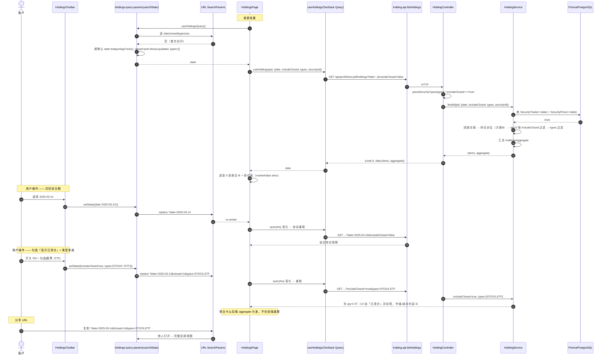
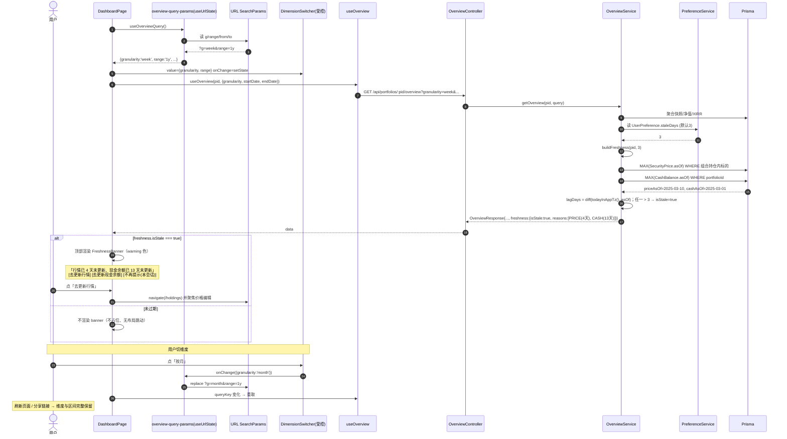
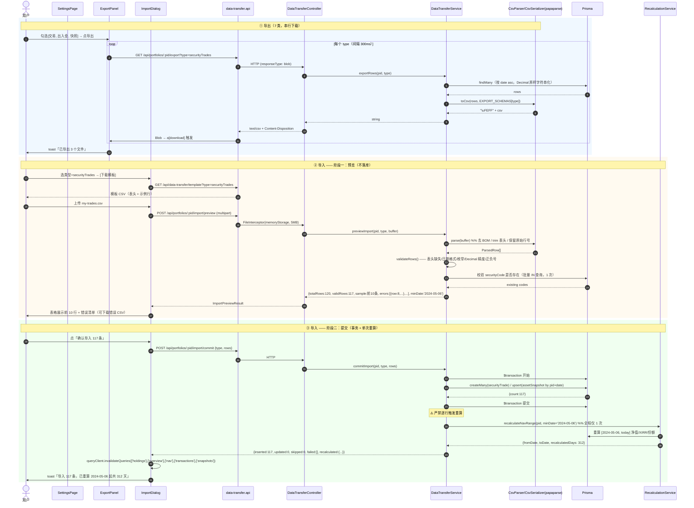
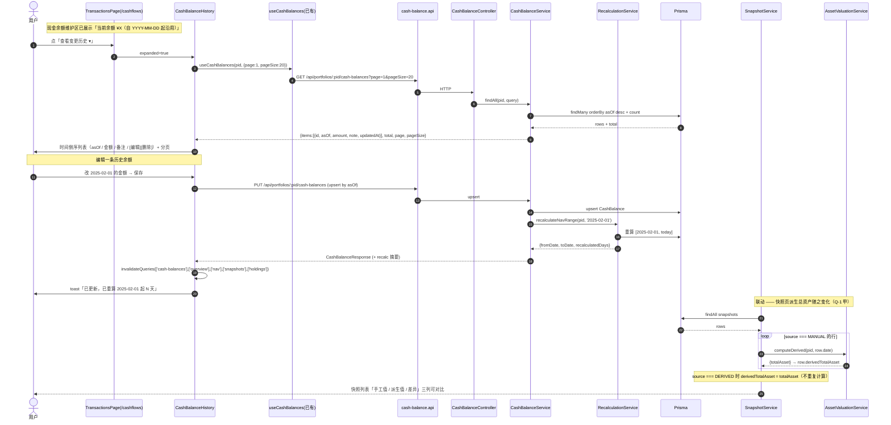
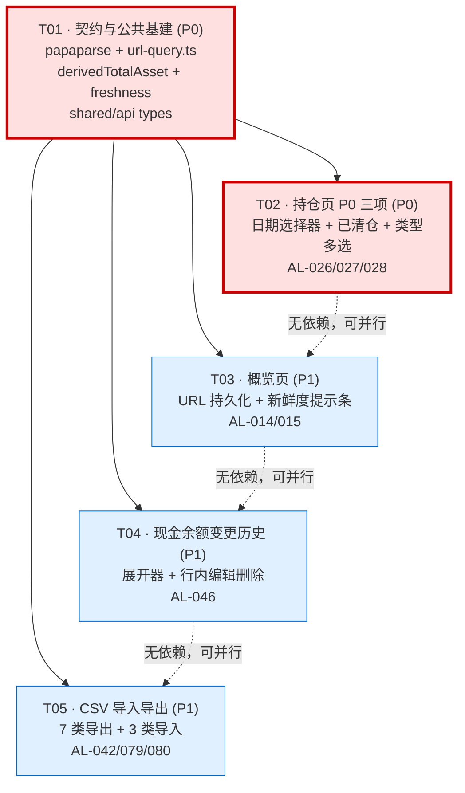

# 「8 页 PRD 对齐」增量系统设计 + 任务列表 v1

> 架构师：高见远（software-architect）
> 上游输入（权威）：`docs/designs/pages-prd-alignment.md` §7 决策表（Q-1~Q-7 用户已拍板）+ `docs/PRD.md` v3.1.8 + `docs/ARCHITECTURE.md` v2.0（Canonical 真相源）
> 核查方式：逐文件实读后端 7 模块（holding / cash-balance / valuation / overview / snapshot / upload / common util）+ 前端 18 文件（HoldingsPage / dashboard / transactions / settings / dimension-switcher / query-params / api 层 / hooks 层 / constants）+ 两个 package.json，结论以源码为准
> 轮次约束：**不修改方案 B 数据架构，只加功能**；**本轮 Prisma schema 零变更**；最小改动、不重构无关代码

---

## 0. 结论速览

**核心发现：本增量 80% 是前端接线，后端只有 2 处小改，Prisma 零迁移。**

| 决策 | 结论 | 覆盖 AL | 后端改动 | 前端改动 | 优先级 |
|---|---|---|---|---|---|
| **Q-2 甲 + Q-3 本轮做** | 持仓页日期选择器 + 已清仓标的 + 类型多选筛选 | AL-026 / AL-027 / AL-028 | **无**（接口已全支持） | 大 | **P0** |
| Q-4 甲 | 概览页查询维度 URL query 持久化 | AL-014 | 无 | 中 | P1 |
| Q-5 甲 | 概览页数据新鲜度提示条 | AL-015 | 小（overview 加 `freshness`） | 中 | P1 |
| Q-7 甲 | 现金余额「变更历史展开器」 | AL-046 | **无**（列表接口已就绪） | 小 | P1 |
| Q-6 乙 | CSV 导入 / 导出（不做 Excel/API） | AL-042 / AL-079 / AL-080 | 大（新 data-transfer 模块） | 中 | P1 |
| Q-1 甲 | `derivedTotalAsset` 派生字段独立返回 | AL-054 | 小（snapshot 响应加字段） | 小（删近似算法） | P1（阻塞前端 F5） |

**关键事实核对（推翻/确认任务书线索）：**

| # | 线索 | 实读结论 |
|---|---|---|
| ① | 持仓页需要后端支持 `date` / `includeClosed` / `types` | **后端已完整实现**。`holding.controller.ts:39-78` 已解析 `date`、`securityId`、`includeClosed === 'true'`、`parseSecurityTypes(types)`（逗号分隔或数组）。→ **本轮持仓 P0 三项是纯前端工作**，风险大幅降低。 |
| ② | 前端持仓 API 参数完整 | **确认差距**。`holding.api.ts` 的 `HoldingQueryParams` 只有 `{date?, securityId?, includeClosed?}`，**缺 `types`**，需补一个字段。 |
| ③ | 持仓页当前日期来源 | **确认差距**。`HoldingsPage.tsx:75-81` 存在**本地私有 `todayIso()`**，line 105 硬编码 `useHoldings(pid, { date: todayIso() })`，未走 `lib/constants.ts` 的 `todayInAppTzIso()`。→ 顺手统一口径。 |
| ④ | 现金余额「变更历史」需要新建审计表 | **不需要**。PRD CASH-P1-01 验收语义 = **多行 `asOf` 记录列表（可编辑/删除）**，而非字段级修改审计。`cash-balance.service.findAll` 已返回 `asOf desc` 分页历史，`useCashBalances` 已就绪。`transactions.tsx:471` 原注释「后端列表接口与 useCashBalances 已就绪，后续可复用」即为此。**零后端改动、零新表。** |
| ⑤ | `derivedTotalAsset` 前端契约 | **前端已预留**。`api/types.ts:~431` 已有 `derivedTotalAsset?: string \| null`（注释「F5 待后端」）。后端 `SnapshotResponse` 缺该字段；数据源 `assetValuation.computeDerived(portfolioId, date)` 已存在且返回 `{totalAsset, marketValue, cashBalance, valuationFlag}`。→ 后端只需在 `source === MANUAL` 时补算并回填。 |
| ⑥ | AL-054 前端临时近似 | **确认**。`use-query-data.ts:78` `useNavTotalAssetMap` 用 `cumulativeNav × shares` 近似总资产。Q-1 甲落地后**删除近似、改读真值**。 |
| ⑦ | 新鲜度数据源 | **overview 响应缺口**。`overview.service.ts` 的 `OverviewResponse` 只有 `latestDate` / `latestSource`，**无最新行情 asOf、无最新现金 asOf**。而 PRD DASH-P1-03 判定口径 = 「最新行情 asOf **或** 最新现金 asOf 超过 N 天」。`dashboard.tsx` 现用 `isStale(ov.latestDate, staleDays)` 是**旧口径（快照日期）**，与 PRD 不符。→ 后端补 `freshness` 对象，一次请求拿全，避免前端拼 3 个接口。 |
| ⑧ | CSV 依赖 | **`papaparse` 不在任何 package.json 中**，需新增（前后端同构复用）。后端 `upload` 模块已有 `FileInterceptor` + multer memory storage，可直接复用做 CSV 上传。 |
| ⑨ | URL query 模式 | **已有成熟范式**。`features/cashflow/query-params.ts:1-89`（`parseTypesParam` / `typesToParam` / `parsePageParam` / `parseSortParam` + `useSearchParams` 白名单）。→ 抽取为通用 `lib/url-query.ts`，持仓页 / 概览页复用，避免三处各写一套。 |
| ⑩ | 概览页维度组件 | `features/query/dimension-switcher.tsx` 已是**受控组件**（`value` + `onChange`），天然适配 URL 状态源；`dashboard.tsx` 只需把 `useState` 换成 URL state hook，组件本身零改动。 |

---

## 1. 实现方案（Implementation Approach）

### 1.1 技术难点

| 难点 | 应对 |
|---|---|
| **D1 三个页面各自要 URL query 持久化**，若各写一套会产生 3 份重复的 parse/serialize 逻辑，且 key 命名易发散 | 抽取通用 `lib/url-query.ts`（`useUrlState<T>` + codec 原语），页面各自定义 schema（白名单 + 默认值 + codec）。**默认值不写入 URL**（保持 URL 干净、可分享）。 |
| **D2 持仓页日期选择器下限「首个交易日」** —— 前端无该数据 | 不新增接口：用**已有** `useTransactions(portfolioId, {page:1, pageSize:1, sortBy:'date', sortOrder:'asc'})` 取首条交易日期；无交易时下限 = 组合 `createdAt` 日期，上限恒为 `todayInAppTzIso()`。（备选方案见 §8 待确认 O-4） |
| **D3 CSV 解析的边界** —— 引号内逗号、CRLF、UTF-8 BOM、中文表头、Excel 打开乱码 | 用 `papaparse`（前后端同一库，行为一致）：导出时**手动前置 `\uFEFF` BOM**（PRD FLOW-P1-01 明确要求）；导入时 `Papa.parse(file, {header:true, skipEmptyLines:'greedy', transformHeader: trim})`。**不手写 CSV**。 |
| **D4 CSV 导入必须「预览 10 行 + 逐行错误 + 一次性重算」**（PRD FLOW-P1-01 / SET-P0-04） | 拆成 **preview / commit 两阶段接口**：preview 只校验不落库（返回前 10 行 + 全量行级错误）；commit 在**单个 Prisma 事务**内批量写入，**事务提交后只调用一次** `recalculateNavRange(portfolioId, minDate)`（**严禁逐行触发重算**，否则 N 行 = N 次全量重算）。 |
| **D5 导出 7 类数据，若打包 zip 需新依赖** | **不引 zip**。每类一个 `GET .../export?type=xxx` 返回 `text/csv`；前端多选时**串行逐个下载**（间隔 300ms 避免浏览器拦截多文件下载）。 |
| **D6 新鲜度口径要与 PRD 一致（行情 asOf / 现金 asOf，非快照日期）** | 后端 `overview` 增加 `freshness` 聚合对象，判定与阈值全部在后端算（遵循「后端算、前端显示」铁律），前端只渲染 banner + 跳转链接。 |

### 1.2 框架选型（现有栈内，仅 1 个新依赖）

| 能力 | 选型 | 理由 |
|---|---|---|
| CSV 解析/生成 | **`papaparse@^5.4.1`**（web + backend 各装一份） | 唯一新增依赖。正确处理引号转义、CRLF、BOM、流式大文件；前后端同库保证解析行为一致，避免「前端预览通过、后端导入报错」。手写 CSV 在引号/换行场景必然出错。 |
| 日期选择器 | **复用现有 shadcn/ui 体系**；若仓库尚无 `Calendar`，用 `<Input type="date" min max>`（零依赖） | 不为一个选择器引 `react-day-picker`。持仓页只需「选一天 + 上下限约束」，原生 date input 完全满足且移动端体验更好。 |
| 类型多选 | 复用 `transactions.tsx` 已有的 Popover + Checkbox 多选模式 | 保持交互一致性，零新组件库。 |
| URL 状态 | `react-router` `useSearchParams` + 自研 codec | 已在 cashflow 页验证可行，不引 `nuqs` 之类。 |
| 文件上传 | 复用后端 `upload` 模块的 `FileInterceptor`（multer memoryStorage） | 已有基建，CSV 体积小，内存存储即可（限 5MB）。 |

### 1.3 架构约束（不可违背）

1. **方案 B 不动**：Holding 仍不落库、由 SecurityTrade 回放派生；CashBalance 仍独立零联动；AssetSnapshot 仍 `UNIQUE(portfolioId, date)`。
2. **Prisma schema 本轮零变更**（`derivedTotalAsset` 是**运行时计算的响应字段，不落库**）。
3. **所有金融计算在后端**：新鲜度判定、派生总资产、导入后重算，前端一律不算。
4. **重算级联铁律**：任何写入历史日期数据的路径（CSV 导入），必须在事务提交后调用 `recalculateNavRange(portfolioId, minDate)` → `[minDate, today]`，且**只调一次**。

---

## 2. 文件清单（File List）

> 图例：**[新]** 新建 · **[改]** 修改 · 路径均为仓库相对路径

### 2.1 packages/backend

```
src/modules/snapshot/
  snapshot.service.ts                       [改] SnapshotResponse 增 derivedTotalAsset；MANUAL 时调 computeDerived
  snapshot.controller.ts                    [改] 响应类型同步
src/modules/overview/
  overview.service.ts                       [改] OverviewResponse 增 freshness 聚合对象
  overview.controller.ts                    [改] 响应类型同步
src/modules/data-transfer/                  [新] CSV 导入导出模块
  data-transfer.module.ts                   [新]
  data-transfer.controller.ts               [新] export / import-preview / import-commit / template
  data-transfer.service.ts                  [新] 编排：解析 → 校验 → 事务写入 → 单次重算
  csv/csv-serializer.ts                     [新] 对象数组 → CSV（BOM + Decimal 字符串化）
  csv/csv-parser.ts                         [新] CSV → 对象数组（papaparse 封装 + 行号保留）
  csv/export-schemas.ts                     [新] 7 类导出的列定义
  csv/import-schemas.ts                     [新] 3 类导入的 zod/class-validator 行校验 schema
  dto/export-query.dto.ts                   [新]
  dto/import-commit.dto.ts                  [新]
src/app.module.ts                           [改] 注册 DataTransferModule
prisma/schema.prisma                        —— 本轮零变更
```

### 2.2 packages/shared

```
src/types/data-transfer.ts                  [新] ExportType / ImportType / ImportRowError / ImportPreviewResult / ImportCommitResult
src/types/overview.ts                       [改] FreshnessInfo
src/types/snapshot.ts                       [改] derivedTotalAsset
src/index.ts                                [改] 导出
```

### 2.3 packages/web —— 公共层

```
src/lib/url-query.ts                        [新] useUrlState + codec 原语（str/num/bool/csv/enum/date）
src/api/types.ts                            [改] SnapshotResponse.derivedTotalAsset 去掉「待后端」注释；新增 FreshnessInfo / data-transfer 类型
src/lib/constants.ts                        [改] 新增 HOLDINGS_QUERY_KEYS / OVERVIEW_QUERY_KEYS / EXPORT_TYPE_OPTIONS
package.json                                [改] + papaparse ^5.4.1 / -D @types/papaparse ^5.3.14
```

### 2.4 packages/web —— 持仓页（P0）

```
src/api/holding.api.ts                      [改] HoldingQueryParams 增 types?: SecurityType[]
src/hooks/use-holdings.ts                   [改] queryKey 纳入 types（对象已整体入 key，确认序列化稳定）
src/features/holdings/holdings-query-params.ts   [新] URL schema：date / closed / types / sec
src/features/holdings/holdings-toolbar.tsx       [新] 日期选择器 + 「显示已清仓」开关 + 资产类型多选
src/pages/HoldingsPage.tsx                  [改] 删本地 todayIso()；接入 toolbar；接入 URL state
```

### 2.5 packages/web —— 概览页

```
src/features/overview/overview-query-params.ts   [新] URL schema：g / range / from / to
src/features/overview/freshness-banner.tsx       [新] 数据新鲜度提示条
src/pages/dashboard.tsx                     [改] useState → useUrlState；顶部挂 FreshnessBanner；isStale 旧口径替换
src/hooks/use-query-data.ts                 [改] useNavTotalAssetMap 删除 cumulativeNav×shares 近似，改读 derivedTotalAsset
```

### 2.6 packages/web —— 现金流页

```
src/features/cashflow/cash-balance-history.tsx   [新] 变更历史展开器（列表 + 行内编辑/删除）
src/features/cashflow/query-params.ts       [改] 复用 lib/url-query 原语（去重，不改外部行为）
src/pages/transactions.tsx                  [改] 现金余额区挂「查看变更历史 ▾」
```

### 2.7 packages/web —— 导入导出

```
src/api/data-transfer.api.ts                [新] exportCsv / previewImport / commitImport / downloadTemplate
src/hooks/use-data-transfer.ts              [新] useExportCsv / useImportPreview / useImportCommit
src/features/data-transfer/export-panel.tsx      [新] 7 类多选 + 串行下载
src/features/data-transfer/import-dialog.tsx     [新] 选类型 → 上传 → 预览 10 行 + 错误表 → 确认导入
src/features/data-transfer/csv-download.ts       [新] Blob + BOM + a[download] 触发
src/pages/settings.tsx                      [改] 数据管理区挂 ExportPanel / ImportDialog
```

**统计：新增 25 个文件，修改 17 个文件，Prisma 迁移 0 个。**

---

## 3. 数据结构与接口（Data Structures and Interfaces）

### 3.1 类图

```mermaid
classDiagram
    %% ================= Backend: 派生与新鲜度 =================
    class AssetValuationService {
        +computeDerived(portfolioId: string, date: string) DerivedResult
    }
    class DerivedResult {
        +totalAsset: Decimal
        +marketValue: Decimal
        +cashBalance: Decimal
        +valuationFlag: SnapshotValuation
    }
    class SnapshotService {
        -assetValuation: AssetValuationService
        +findAll(portfolioId, query) PaginatedSnapshotResponse
        +findOne(portfolioId, date) SnapshotResponse
        -attachDerivedTotalAsset(rows) SnapshotResponse[]
    }
    class SnapshotResponse {
        +id: string
        +date: string
        +totalAsset: string
        +marketValue: string
        +cashBalance: string
        +source: SnapshotSource
        +valuationFlag: SnapshotValuation
        +derivedTotalAsset: string|null
    }

    class OverviewService {
        -prisma: PrismaService
        +getOverview(portfolioId, query) OverviewResponse
        -buildFreshness(portfolioId, staleDays) FreshnessInfo
    }
    class OverviewResponse {
        +latestDate: string|null
        +latestSource: SnapshotSource|null
        +totalAsset: string
        +freshness: FreshnessInfo
    }
    class FreshnessInfo {
        +staleDays: number
        +isStale: boolean
        +latestPriceAsOf: string|null
        +latestPriceLagDays: number|null
        +latestCashAsOf: string|null
        +latestCashLagDays: number|null
        +reasons: FreshnessReason[]
    }
    class FreshnessReason {
        +kind: PRICE|CASH
        +asOf: string|null
        +lagDays: number
        +label: string
    }

    %% ================= Backend: CSV =================
    class DataTransferController {
        +export(portfolioId, type) StreamableFile
        +template(type) StreamableFile
        +preview(portfolioId, type, file) ImportPreviewResult
        +commit(portfolioId, dto) ImportCommitResult
    }
    class DataTransferService {
        -prisma: PrismaService
        -recalculation: RecalculationService
        +exportRows(portfolioId, type) string
        +previewImport(portfolioId, type, buffer) ImportPreviewResult
        +commitImport(portfolioId, type, rows) ImportCommitResult
        -validateRows(type, rows) ValidatedRows
        -writeInTransaction(type, rows) WriteStats
    }
    class ImportPreviewResult {
        +type: ImportType
        +totalRows: number
        +validRows: number
        +sample: Record[]
        +errors: ImportRowError[]
        +minDate: string|null
        +token: string
    }
    class ImportRowError {
        +row: number
        +field: string|null
        +code: string
        +message: string
    }
    class ImportCommitResult {
        +inserted: number
        +updated: number
        +skipped: number
        +failed: ImportRowError[]
        +recalculated: RecalcSummary
    }
    class RecalcSummary {
        +fromDate: string
        +toDate: string
        +recalculatedDays: number
    }
    class CsvSerializer {
        +toCsv(rows, columns) string
    }
    class CsvParser {
        +parse(buffer) ParsedRow[]
    }

    %% ================= Frontend: URL state =================
    class UrlQueryLib {
        +useUrlState(schema) [state, setState]
        +codecString() Codec
        +codecBool() Codec
        +codecCsvEnum(values) Codec
        +codecDate() Codec
    }
    class HoldingsQueryState {
        +date: string
        +includeClosed: boolean
        +types: SecurityType[]
        +securityId: string|null
    }
    class OverviewQueryState {
        +granularity: Granularity
        +range: QuickRangeKey|null
        +startDate: string|null
        +endDate: string|null
    }

    %% ================= Frontend: components =================
    class HoldingsPage
    class HoldingsToolbar
    class DashboardPage
    class FreshnessBanner
    class CashBalanceHistory
    class ExportPanel
    class ImportDialog

    SnapshotService --> AssetValuationService : 调用
    AssetValuationService --> DerivedResult : 返回
    SnapshotService --> SnapshotResponse : 产出
    OverviewService --> OverviewResponse : 产出
    OverviewResponse *-- FreshnessInfo
    FreshnessInfo *-- FreshnessReason
    DataTransferController --> DataTransferService : 委托
    DataTransferService --> CsvSerializer : 使用
    DataTransferService --> CsvParser : 使用
    DataTransferService --> ImportPreviewResult : 产出
    DataTransferService --> ImportCommitResult : 产出
    ImportCommitResult *-- RecalcSummary
    HoldingsPage --> HoldingsToolbar : 组合
    HoldingsPage ..> HoldingsQueryState : 读写
    HoldingsQueryState ..> UrlQueryLib : 基于
    DashboardPage --> FreshnessBanner : 组合
    DashboardPage ..> OverviewQueryState : 读写
    OverviewQueryState ..> UrlQueryLib : 基于
    CashBalanceHistory ..> HoldingsQueryState : 无关
    ExportPanel ..> DataTransferController : HTTP
    ImportDialog ..> DataTransferController : HTTP
    FreshnessBanner ..> FreshnessInfo : 渲染
```



### 3.2 API 契约变更

| # | 方法 | 路径 | 变更 | 说明 |
|---|---|---|---|---|
| A1 | GET | `/api/portfolios/:portfolioId/holdings` | **无变更** | 已支持 `?date&securityId&includeClosed&types`。前端补传 `types` 即可。 |
| A2 | GET | `/api/portfolios/:portfolioId/snapshots` | **响应加字段** | 每项增 `derivedTotalAsset: string \| null`。`source=DERIVED` 时 = `totalAsset`；`source=MANUAL` 时 = `computeDerived(pid, date).totalAsset`；计算失败返回 `null`（不抛错）。 |
| A3 | GET | `/api/portfolios/:portfolioId/snapshots/:date` | 同 A2 | 单条同样返回。 |
| A4 | GET | `/api/portfolios/:portfolioId/overview` | **响应加对象** | 增 `freshness: FreshnessInfo`（见 §3.1）。`staleDays` 取自 `UserPreference.staleDays`（默认 3）。 |
| A5 | GET | `/api/portfolios/:portfolioId/cash-balances` | **无变更** | 已返回 `asOf desc` 分页历史，直接喂给变更历史展开器。 |
| A6 | GET | `/api/portfolios/:portfolioId/export?type={ExportType}` | **新增** | `Content-Type: text/csv; charset=utf-8`，`Content-Disposition: attachment; filename="{portfolio}-{type}-{YYYYMMDD}.csv"`，正文首字节 BOM。 |
| A7 | GET | `/api/data-transfer/template?type={ImportType}` | **新增** | 返回只含表头 + 1 行示例的模板 CSV（PRD SET-P0-04 要求）。不需要 portfolioId。 |
| A8 | POST | `/api/portfolios/:portfolioId/import/preview` | **新增** | `multipart/form-data`：`file`（≤5MB）+ `type`。返回 `ImportPreviewResult`（`sample` 固定前 10 条有效行，`errors` 为**全量**行级错误）。**不落库**。 |
| A9 | POST | `/api/portfolios/:portfolioId/import/commit` | **新增** | `application/json`：`{ type, rows }`（rows 为 preview 回传的已校验行）。事务内批量写入 → 提交后**单次** `recalculateNavRange(pid, minDate)`。返回 `ImportCommitResult`。 |

**导出 7 类（`ExportType`）：**
`securities` / `securityTrades` / `cashFlows` / `cashBalances` / `securityPrices` / `assetSnapshots` / `navSeries`

**导入 3 类（`ImportType`）：**
`securityTrades` / `cashFlows` / `assetSnapshots`

**导入冲突策略（默认，见 §8 O-3 待确认）：**
- `securityTrades` / `cashFlows`：**纯 insert**，不去重（这两者天然可重复发生在同一天）。
- `assetSnapshots`：**upsert by (portfolioId, date)**，`source` 强制写 `MANUAL`，命中已有记录计入 `updated`。

### 3.3 URL Query Key 规范（新增，写入共享知识）

| 页面 | Key | 类型 | 缺省（不写入 URL） |
|---|---|---|---|
| 持仓 `/holdings` | `date` | `YYYY-MM-DD` | `todayInAppTzIso()` |
| 持仓 | `closed` | `1` / `0` | `0`（取自 `UserPreference.showLiquidated` 作为初值） |
| 持仓 | `types` | 逗号分隔 enum | 空（=全部） |
| 持仓 | `sec` | securityId | 空 |
| 概览 `/` | `g` | `day\|week\|month\|year` | `month` |
| 概览 | `range` | `1m\|3m\|6m\|1y\|ytd\|all` | `all` |
| 概览 | `from` / `to` | `YYYY-MM-DD` | 空（仅 `range=custom` 时出现） |
| 现金流 `/cashflows` | 沿用 `query-params.ts` 现有 key | — | — |

**规则**：小写 key；布尔用 `1/0`；多值逗号分隔；**等于默认值时从 URL 移除**；未知 key 忽略（白名单）；非法值降级为默认值且不报错。

---

## 4. 调用流程（Program Call Flow）

### 4.1 持仓页：日期选择 + 类型多选 + 已清仓（P0）



### 4.2 概览页：URL 持久化 + 数据新鲜度提示条



### 4.3 CSV 导出 / 导入（预览 → 提交 → 单次重算）



### 4.4 现金余额「变更历史展开器」（含派生总资产联动）



---

## 5. 任务列表（核心交付 · 5 个任务 · 按依赖顺序）

> 规则：P0 排最前；T02~T05 只依赖 T01，彼此**完全独立可并行**（避免长依赖链）。

---

### **T01 · 契约与公共基建**（P0 · 阻塞全部后续任务）

| 项 | 内容 |
|---|---|
| **模块** | backend/snapshot + backend/overview + shared + web/lib + web/api |
| **依赖** | 无 |
| **优先级** | **P0**（本身含 Q-1 甲；同时是 T02~T05 的地基） |

**源文件：**
- `packages/web/package.json` [改] — 加 `papaparse@^5.4.1` + `-D @types/papaparse@^5.3.14`
- `packages/backend/package.json` [改] — 同上
- `packages/web/src/lib/url-query.ts` [新] — `useUrlState<T>(schema)` + codec 原语
- `packages/web/src/lib/constants.ts` [改] — `HOLDINGS_QUERY_KEYS` / `OVERVIEW_QUERY_KEYS` / `EXPORT_TYPE_OPTIONS`
- `packages/web/src/api/holding.api.ts` [改] — `HoldingQueryParams` 增 `types?: SecurityType[]`
- `packages/web/src/api/types.ts` [改] — `SnapshotResponse.derivedTotalAsset` 转正式；新增 `FreshnessInfo`
- `packages/shared/src/types/{snapshot,overview,data-transfer}.ts` [新/改] + `index.ts` [改]
- `packages/backend/src/modules/snapshot/snapshot.service.ts` [改] — 注入 `AssetValuationService`，`attachDerivedTotalAsset()`
- `packages/backend/src/modules/snapshot/snapshot.controller.ts` [改] — 响应类型
- `packages/backend/src/modules/overview/overview.service.ts` [改] — `buildFreshness()` + 响应 `freshness`
- `packages/backend/src/modules/overview/overview.controller.ts` [改] — 响应类型
- `packages/web/src/hooks/use-query-data.ts` [改] — `useNavTotalAssetMap` 删除 `cumulativeNav × shares` 近似

**验收标准：**
1. `GET /api/portfolios/:pid/snapshots` 每项含 `derivedTotalAsset`；`source=DERIVED` 时等于 `totalAsset`；`source=MANUAL` 时等于 `computeDerived(pid,date).totalAsset`；计算异常返回 `null` 且**不影响列表返回 200**。
2. N 条 MANUAL 快照的列表请求，`computeDerived` 调用次数 ≤ N（不得 N+1 查库；按 date 批量或缓存组合内交易/价格）。
3. `GET /api/portfolios/:pid/overview` 返回 `freshness{staleDays,isStale,latestPriceAsOf,latestPriceLagDays,latestCashAsOf,latestCashLagDays,reasons[]}`；`staleDays` 读自 `UserPreference`（默认 3）；判定口径 = **行情 asOf 或 现金 asOf 滞后 > staleDays**（PRD DASH-P1-03），**不再用快照 latestDate**。
4. `useUrlState` 单测：默认值不写入 URL、非法值降级为默认、未知 key 被忽略、连续 setState 合并为一次 `replace`（不产生多余 history 条目）。
5. `useNavTotalAssetMap` 不再出现 `cumulativeNav * shares`；`pnpm -w typecheck` 与 `lint` 全绿。
6. Prisma schema 与 migrations 目录 **零变更**（CI diff 校验）。

---

### **T02 · 持仓页 P0 三项（日期选择器 + 已清仓 + 类型多选）**（P0）

| 项 | 内容 |
|---|---|
| **模块** | web/holdings |
| **依赖** | **T01** |
| **优先级** | **P0** — AL-026 / AL-027 / AL-028 |

**源文件：**
- `packages/web/src/features/holdings/holdings-query-params.ts` [新]
- `packages/web/src/features/holdings/holdings-toolbar.tsx` [新]
- `packages/web/src/pages/HoldingsPage.tsx` [改]
- `packages/web/src/hooks/use-holdings.ts` [改]

**验收标准：**
1. **HOLD-B-P0-11 日期选择器**：默认今日（`todayInAppTzIso()`，**删除页内私有 `todayIso()`**）；可选范围 `[首个交易日, 今日]`，越界日期不可选；切换后请求 `?date=` 且表格/5 张聚合卡同步刷新。
2. **HOLD-B-P0-04 已清仓**：默认隐藏 `qty=0` 标的；「显示已清仓」开关打开后调 `?includeClosed=true`，已清仓行带灰色「已清仓」标签且排在正常持仓之后。
3. **HOLD-B-P0-11 类型多选**：Popover + Checkbox 多选（股票/ETF/基金/债券/其他），全不选 = 全部；选中项以逗号拼接进 `?types=`；已选数量在按钮上显示徽标。
4. **URL 持久化**：`?date=&closed=1&types=STOCK,ETF&sec=xxx` 刷新后完整还原；复制链接他人打开视图一致；默认值不出现在 URL。
5. **聚合卡以后端 `aggregate` 为准**，前端不重算总市值/总盈亏（防口径漂移）。
6. 「显示已清仓」初值取自 `UserPreference.showLiquidated`；**URL 参数优先级高于 preference**。
7. 三个筛选器组合切换时，TanStack Query 命中不同 queryKey，无请求竞态导致的旧数据闪烁（`keepPreviousData` + loading 骨架）。

---

### **T03 · 概览页 URL 持久化 + 数据新鲜度提示条**（P1）

| 项 | 内容 |
|---|---|
| **模块** | web/overview |
| **依赖** | **T01** |
| **优先级** | P1 — AL-014（Q-4 甲）/ AL-015（Q-5 甲） |

**源文件：**
- `packages/web/src/features/overview/overview-query-params.ts` [新]
- `packages/web/src/features/overview/freshness-banner.tsx` [新]
- `packages/web/src/pages/dashboard.tsx` [改]

**验收标准：**
1. `granularity` / `range` / `from` / `to` 四个状态从 `useState` 迁至 URL query（key 见 §3.3）；刷新、前进后退、分享链接均能还原。
2. `DimensionSwitcher` **组件本体零改动**（已是受控组件），仅替换其 `value`/`onChange` 数据源。
3. **DASH-P1-03 新鲜度条**：`freshness.isStale === true` 时在页面顶部渲染 warning banner，文案列出全部 `reasons`（如「行情已 4 天未更新」「现金余额已 13 天未更新」）；提供 `[去更新行情]`（跳持仓页）`[去更新现金余额]`（跳 `/cashflows`）`[本次会话不再提示]`。
4. `isStale === false` 时 **完全不渲染** banner（不占位、无布局跳动）。
5. **移除** `dashboard.tsx` 中基于 `ov.latestDate` 的旧口径 `isStale(...)` 描述文案，统一走后端 `freshness`。
6. 阈值改动路径打通：设置页改 `staleDays` → 概览页 `invalidate` 后 banner 判定即时变化。

---

### **T04 · 现金余额变更历史展开器**（P1）

| 项 | 内容 |
|---|---|
| **模块** | web/cashflow |
| **依赖** | **T01** |
| **优先级** | P1 — AL-046（Q-7 甲） |

**源文件：**
- `packages/web/src/features/cashflow/cash-balance-history.tsx` [新]
- `packages/web/src/features/cashflow/query-params.ts` [改]（复用 `lib/url-query` 原语去重，外部行为不变）
- `packages/web/src/pages/transactions.tsx` [改]（移除 line 471「本轮不做」注释）

**验收标准：**
1. **CASH-P1-01**：现金余额维护区出现「查看变更历史 ▾」，展开后按 `asOf` 倒序列出全部记录（生效日 / 金额 / 备注 / 更新时间），支持分页（pageSize 20）。
2. 每行可**编辑**（改金额/备注）与**删除**；编辑走 upsert、删除走 remove，二者均由后端触发 `recalculateNavRange(pid, asOf)`。
3. 操作成功后 toast 展示重算摘要「已重算 YYYY-MM-DD 起 N 天」；后端未返回天数时降级显示「已重算（自 YYYY-MM-DD 起）」，不报错。
4. 成功后 `invalidateQueries` 覆盖 `['cash-balances'] ['overview'] ['nav'] ['snapshots'] ['holdings']`。
5. **不新增审计表、不改 Prisma**：「变更历史」= 多行 `asOf` 记录列表（PRD 语义），复用现有 `useCashBalances`。
6. 折叠状态默认收起，展开状态不写入 URL（纯 UI 局部状态）。

---

### **T05 · CSV 导入 / 导出**（P1）

| 项 | 内容 |
|---|---|
| **模块** | backend/data-transfer + web/data-transfer + web/settings |
| **依赖** | **T01** |
| **优先级** | P1 — AL-042 / AL-079 / AL-080（Q-6 乙） |

**源文件（后端）：**
- `packages/backend/src/modules/data-transfer/data-transfer.{module,controller,service}.ts` [新]
- `packages/backend/src/modules/data-transfer/csv/{csv-serializer,csv-parser,export-schemas,import-schemas}.ts` [新]
- `packages/backend/src/modules/data-transfer/dto/{export-query,import-commit}.dto.ts` [新]
- `packages/backend/src/app.module.ts` [改]

**源文件（前端）：**
- `packages/web/src/api/data-transfer.api.ts` [新]
- `packages/web/src/hooks/use-data-transfer.ts` [新]
- `packages/web/src/features/data-transfer/{export-panel,import-dialog,csv-download}.{tsx,ts}` [新]
- `packages/web/src/pages/settings.tsx` [改]

**验收标准：**
1. **SET-P0-03 导出**：7 类（`securities/securityTrades/cashFlows/cashBalances/securityPrices/assetSnapshots/navSeries`）均可导出；文件名 `{组合名}-{类型}-{YYYYMMDD}.csv`；正文以 **UTF-8 BOM** 开头，Excel 直接双击打开中文不乱码；Decimal 以**字符串原样输出**，不做科学计数、不丢精度。
2. **SET-P0-04 模板**：3 类导入类型均可下载模板（表头 + 1 行示例）。
3. **FLOW-P1-01 预览**：上传后展示**前 10 行**有效数据 + **全量行级错误**（行号 / 字段 / 原因），错误可导出为 CSV；预览阶段**绝不写库**。
4. **FLOW-P1-01 提交**：写入在**单个 Prisma 事务**内完成；事务提交后**全流程仅调用 1 次** `recalculateNavRange(pid, minDate)`（需有单测断言调用次数 === 1）；返回 `{inserted, updated, skipped, failed[], recalculated{fromDate,toDate,recalculatedDays}}`。
5. **冲突策略**：`securityTrades`/`cashFlows` 纯 insert；`assetSnapshots` 按 `(portfolioId, date)` upsert 且 `source` 强制 `MANUAL`（如 §8 O-3 用户另有决策，以决策为准）。
6. 上传限制：仅 `.csv`（MIME + 后缀双校验）、≤5MB、行数 ≤10000；超限返回明确错误码而非 500。
7. 导入成功后 `invalidateQueries` 覆盖 `['holdings'] ['overview'] ['nav'] ['transactions'] ['snapshots'] ['cash-balances']`。
8. 跨组合安全：`export`/`import` 均校验 `portfolioId` 归属当前用户；CSV 中若含其它 `portfolioId` 列一律忽略（以路径参数为准）。
9. **不引入 zip 依赖**：多类型导出由前端串行触发多个下载。

---

## 6. 依赖包（Required Packages）

**新增（唯一）：**
```
papaparse@^5.4.1              # CSV 解析/生成（packages/web + packages/backend 各装一份）
@types/papaparse@^5.3.14      # devDependency（两处）
```
**选型理由**：正确处理引号内逗号/换行、CRLF、BOM；前后端同库保证「预览通过 = 导入通过」；零运行时依赖、体积 ~45KB。手写 CSV 在真实券商导出文件（备注含逗号/换行）上必然出错。

**明确不引入：**
| 候选 | 不引入理由 |
|---|---|
| `xlsx` / `exceljs` | Q-6 决策为**乙（仅 CSV）** |
| `jszip` / `archiver` | 多类型导出改为前端串行下载，不打包 |
| `react-day-picker` | 日期选择器用原生 `<input type="date">` 或已有 shadcn Calendar |
| `nuqs` / `use-query-params` | 自研 `lib/url-query.ts` 约 120 行，已有 `query-params.ts` 范式可复用 |

**已有可直接复用（无需新增）：**
`@nestjs/platform-express`（`FileInterceptor` + multer memoryStorage，见 `upload` 模块）、`class-validator`、`date-fns`、`sonner`、`@tanstack/react-query`、`zustand`、`react-router`。

---

## 7. 共享知识（Shared Knowledge · Engineer 必读）

### 7.1 日期与时区
- 应用时区固定 **UTC+8**。后端一律用 `todayInAppTz()`，前端一律用 `todayInAppTzIso()`（`lib/constants.ts`）。
- **禁止**在页面内自建 `todayIso()`（本轮需删除 `HoldingsPage.tsx:75-81` 的私有实现）。
- 所有对外日期字段格式 `YYYY-MM-DD`；`asOf` / `date` 均为日期（无时分秒）；`recordedAt` / `createdAt` / `updatedAt` 为 ISO 8601 UTC 时间戳。
- CSV 中日期只接受 `YYYY-MM-DD`（导入校验拒绝 `YYYY/MM/DD`、`2025-3-4` 等变体，错误码 `INVALID_DATE_FORMAT`）。

### 7.2 精度（与 ARCHITECTURE §16 一致，不得偏离）
| 语义 | DB 类型 | 传输 | 展示 |
|---|---|---|---|
| 金额 / 快照 / 现金余额 | `DECIMAL(18,2)` | **string** | 2 位，千分位 |
| 份额 / 数量 / 均价 / 价格 | `DECIMAL(18,6)` | **string** | **份额 6 位**、数量 4 位、价格 4 位 |
| 净值 NAV | `DECIMAL(12,6)` | **string** | 4 位 |
| XIRR | `DECIMAL(20,8)` | **string** | 百分比 2 位 |

- **所有 Decimal 在 API 层一律以 string 传输**，前端不得用 `Number()` 参与金额运算（仅展示时格式化）。
- CSV 导出直接写 string，不经过 `Number`；CSV 导入用字符串正则校验小数位数，超精度报错而非静默截断。

### 7.3 金融口径
- **方案 B（交易明细法）**：Holding **不落库**，由 SecurityTrade 回放派生；CashBalance 独立、与出入金**零联动**；AssetSnapshot `UNIQUE(portfolioId, date)`。
- 累计净值 = **单位份额法**；年度净值**每年重置为 1**；XIRR 为**逐日累计**、Newton-Raphson 迭代。
- **一切计算在后端**：新鲜度判定、`derivedTotalAsset`、导入后重算，前端一律不算、不兜底、不近似。
- `derivedTotalAsset` 语义 = 「若该日不使用手工快照，系统按持仓×行情+现金推导出的总资产」，用于快照页「手工值 vs 派生值」差异对比。

### 7.4 重算级联（铁律）
任何写入/修改历史日期数据的路径，必须在**事务提交后**调用：
```
recalculateNavRange(portfolioId, minAffectedDate)   // 区间 [minAffectedDate, today]
```
- CSV 导入：取全部导入行的**最小日期**，**全流程只调 1 次**（严禁逐行调用）。
- 现金余额编辑/删除：取该条 `asOf`。
- 返回的 `{fromDate, toDate, recalculatedDays}` 应透出到 toast；后端未返回时前端降级为「已重算（自 X 起）」，不得报错。

### 7.5 API 约定
- Base `/api`（无 `/v1`）；`Authorization: Bearer <JWT>`；统一信封 `{code, data, message}`（`code===0` 为成功）。
- 分页 `?page=1&pageSize=20`，响应 `{items, total, page, pageSize}`。
- 文件下载接口（export/template）**不套信封**，直接返回 `text/csv` + `Content-Disposition`；前端用 `responseType:'blob'`。
- `ValidationPipe` 全局 `whitelist + forbidNonWhitelisted`：**新增 query 参数必须同步扩 DTO**，否则 400。

### 7.6 URL Query 命名规范
见 §3.3 表。核心 4 条：**小写 key**；**布尔 `1/0`**；**多值逗号分隔**；**等于默认值时从 URL 移除**。非法值静默降级为默认值，不弹错。

### 7.7 CSV 约定
- 编码 UTF-8，导出**必须前置 BOM `\uFEFF`**（Excel 兼容，PRD 明确要求）。
- 表头使用**英文字段名**（与 API 字段一致，便于导出→修改→导入闭环），模板文件第一行为表头、第二行为示例值。（中文表头方案见 §8 O-2）
- 换行 `\r\n`；含逗号/引号/换行的值用双引号包裹并转义 `""`（由 papaparse 处理）。
- 空值输出空字符串（不输出 `null`/`NULL`）。
- 导入忽略未知列；缺失必填列在 preview 阶段整体报错（`MISSING_REQUIRED_COLUMN`）而非逐行报错。

### 7.8 错误码（导入新增）
`INVALID_FILE_TYPE` / `FILE_TOO_LARGE` / `TOO_MANY_ROWS` / `MISSING_REQUIRED_COLUMN` / `INVALID_DATE_FORMAT` / `INVALID_DECIMAL_PRECISION` / `INVALID_ENUM_VALUE` / `SECURITY_NOT_FOUND` / `DUPLICATE_SNAPSHOT_DATE`

### 7.9 查询失效矩阵（invalidateQueries）
| 操作 | 需失效的 queryKey |
|---|---|
| CSV 导入 commit | `holdings` `overview` `nav` `transactions` `snapshots` `cash-balances` |
| 现金余额编辑/删除 | `cash-balances` `overview` `nav` `snapshots` `holdings` |
| 行情价格更新 | `holdings` `overview` `nav` `snapshots` |
| 偏好 `staleDays` 变更 | `overview`（触发 banner 重判） |

---

## 8. 待确认事项（需主理人 / PM 拍板）

| # | 事项 | 我的默认方案（未拍板则按此实现） | 影响 |
|---|---|---|---|
| **O-1** | **导出 7 类的确切清单**。我按 `securities / securityTrades / cashFlows / cashBalances / securityPrices / assetSnapshots / navSeries` 拟定，需与 PRD SET-P0-03 原文逐项核对（尤其 `navSeries` 是否应为 `dailyReturns`，二者字段差异较大） | 按上述 7 类实现，`navSeries` 含 `date/cumulativeNav/yearlyNav/shares/totalAsset/xirr` | T05 列定义 |
| **O-2** | **CSV 表头语言**：英文字段名（导出→改→导入闭环友好、工程可靠）vs 中文表头（用户直接看懂，但导入需维护中英映射表且易因用户改表头而失败） | **英文字段名**，模板附第二行中文说明注释行（导入时以 `#` 开头的行跳过） | T05 全部 schema |
| **O-3** | **导入冲突策略**：`securityTrades`/`cashFlows` 是否需要去重（例如同日同标的同价同量视为重复）？重复导入会产生双份交易，影响持仓与 XIRR | 默认**纯 insert 不去重**（同日多笔交易是合法业务）；预览阶段对「疑似重复行」给 **warning（不阻断）** 提示 | T05 语义正确性，**风险最高项** |
| **O-4** | **持仓页日期下限「首个交易日」的取数方式**：(甲) 前端用 `useTransactions(pageSize:1, sortOrder:'asc')` 额外发一次请求；(乙) 后端在 holdings 响应或 portfolio 详情中增加 `firstTradeDate` 字段（更干净但需改接口） | **甲**（零后端改动，符合本轮最小改动）；若主理人认为多一次请求不可接受则改乙 | T02 |
| **O-5** | **`staleDays` 的作用域**：`UserPreference.staleDays` 当前是**用户级全局**，是否需要下沉到组合级（不同组合更新频率不同）？ | 保持**用户级全局**（避免改 Prisma） | T01 / T03 |
| **O-6** | **新鲜度「最新行情 asOf」的取数范围**：应取「组合当前持仓标的的最早 asOf（最落后的那只）」还是「全库最新 asOf」？前者更严格（只要一只没更新就提示），后者宽松 | **前者**：`MIN(latest asOf per held security)`，即「最落后标的」，符合「数据不新鲜」的用户直觉 | T01 后端实现 |
| **O-7** | **「本次会话不再提示」的持久化粒度**：sessionStorage（关标签页失效）vs UserPreference（永久关闭需要设置页开关） | **sessionStorage**（轻量、不改后端） | T03 |
| **O-8** | **CSV 导入是否需要「回滚/撤销」**：一次导入 100+ 条后若发现有误，目前只能逐条删除 | 本轮**不做**；导入前提示用户先导出备份。若需要，将引入 `importBatchId` 字段（**需 Prisma 迁移**，超出本轮约束） | T05 范围 |
| **O-9** | AL-082 / AL-083（另外 2 个 P0 边界项）本轮未纳入 §7 决策，需确认是否随本增量一并处理 | 本轮**不纳入**，待主理人明确 | 整体范围 |

---

## 9. 任务依赖图



**关键路径**：`T01 → T02`（P0 主线，必须最先完成）。
**并行窗口**：T01 完成后，T02 / T03 / T04 / T05 可 4 路并行；若单人串行，建议顺序 **T01 → T02 → T03 → T04 → T05**（P0 先落地、CSV 工作量最大放最后）。

---

## 10. 风险与缓解

| 风险 | 等级 | 缓解 |
|---|---|---|
| CSV 导入逐行触发重算导致 N 次全量重算，接口超时 | **高** | T05 验收标准 4 强制单测断言 `recalculateNavRange` 调用次数 === 1 |
| 重复导入产生双份交易，持仓/XIRR 全错且难回滚 | **高** | O-3 待拍板；预览阶段给疑似重复 warning；导入前提示先导出备份 |
| `computeDerived` 在快照列表中 N+1 查库 | 中 | T01 验收标准 2：批量预取组合交易/价格后复用，或按 date 去重批量算 |
| 新鲜度口径与 PRD 不一致（沿用旧的 `latestDate`） | 中 | T03 验收标准 5 强制移除旧口径；后端统一出判定结果 |
| URL query 三处各写一套导致 key 发散 | 中 | T01 先出 `lib/url-query.ts`，T02/T03/T04 强制复用；§3.3 规范入库 |
| Decimal 经 `Number()` 丢精度（CSV 往返场景尤甚） | 中 | §7.2 明确 string 传输；导出不过 Number；导入用字符串正则校验精度 |
| 持仓页三筛选器并发切换引发请求竞态 | 低 | TanStack Query queryKey 天然隔离 + `keepPreviousData` |
