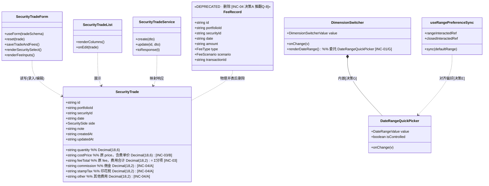
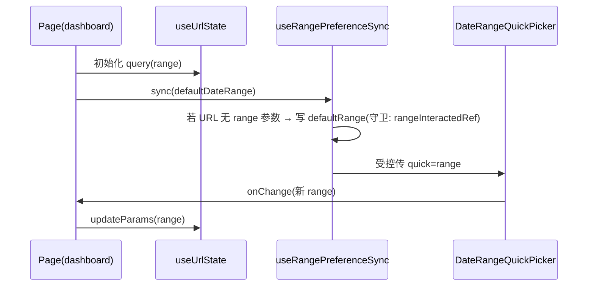
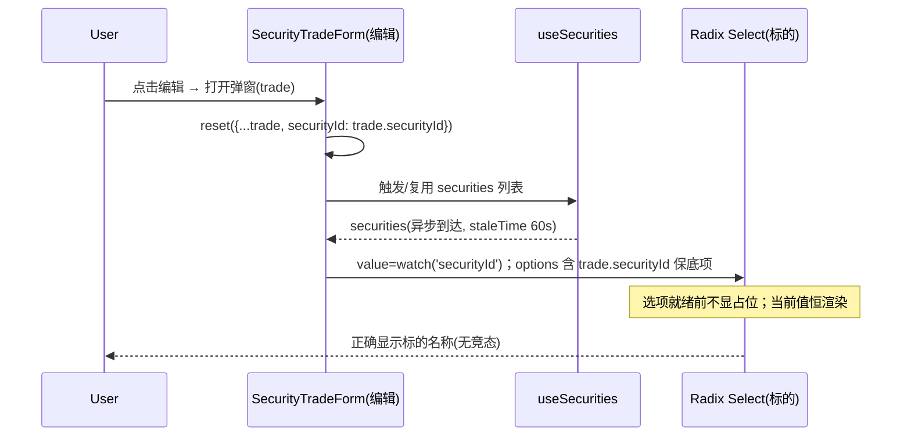
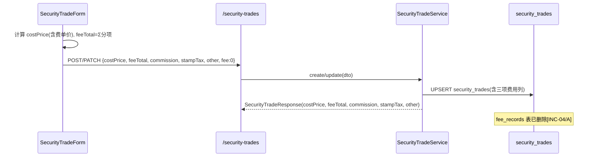
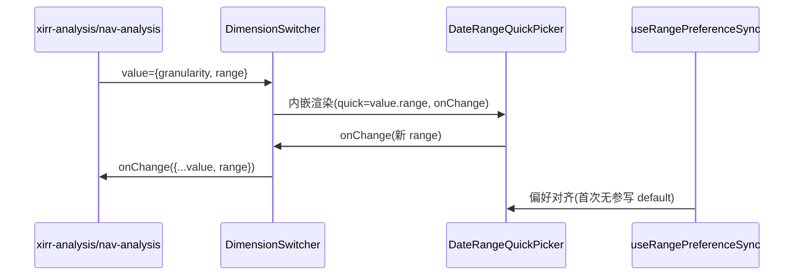

# 交易记录 5 项优化 · 增量架构设计 + 任务分解（v1.2 PRD 落地）

> **文档定位**：增量设计，仅描述相对 `ARCHITECTURE.md` v2.8 + 现行代码的**变更点**，不重复通用架构。
> **依据**：`docs/designs/incremental-tx-opt-PRD.md`（v1.2，终审）、`docs/ARCHITECTURE.md`（v2.8）、`docs/designs/incremental-dividend-fee-rework-design.md`（参考范式）。
> **范围**：INC-01 ~ INC-05。严禁进入编码/工程阶段；本文档不修改任何源码或 `ARCHITECTURE.md`（仅产出"修订建议"）。
> **语言**：中文（与 PRD 一致）。

---

## 0. 已终审决策（强制约束）

| 决策 | 内容 | 对设计的影响 |
|------|------|--------------|
| **A** | 物理并表：改 `security_trades` + 删 `fee_records`，**推翻旧裁决 Q-8** | INC-04 schema 加三列、删 `FeeRecord` |
| **B** | 成本价仅改名（含费单价），不动金融计算 | INC-03 仅 `price→costPrice` 重命名 |
| **C** | INC-02 是真实 bug（标的回填竞态） | 非样式问题，须修根因 |
| **D** | 分批：第一批 1/2/5，第二批 3/4 | 任务分两批，批间依赖明确 |
| **E** | 5 页统一按持仓页完整范式 | `useDefaultDateRange` + 偏好对齐 effect + 交互守卫 |
| **F** | 无迁移、无存量数据，schema 级回滚 | 删除 `fee_records` 不需数据回填 |
| **G** | 控件统一：仅 `DateRangeQuickPicker` 一个 canonical 控件 | `DimensionSwitcher` 内嵌范围委托给它 |
| **H** | 文案统一：同功能唯一文案 | 抽 `ENTRY_BUTTON_LABELS` 常量字典 |

---

## 1. 实现方案（Implementation Approach）

### 1.1 核心难点

1. **INC-04 物理并表（推翻 Q-8）**：现有架构按 Q-8 走"展示层聚合 + `fee_records` 明细保留"。决策 A 要求把分项费用（`commission`/`stampTax`/`other`）物理收进 `security_trades`，并**删除 `fee_records` 表 + `FeeType`/`FeeScenario` 枚举 + 整个 fee 模块**。外溢面大：backend 的 `fee` 模块、shared 的 `fee.ts`/`FeeType`、web 的 `use-fees`/`fee.api.ts`/`dividend-fee-section` 费用部分、聚合工具 `groupByMergeKey` 全部须下线。
2. **INC-02 根因修复**：编辑弹窗打开时 `reset` 已正确写入 `securityId`，但标的 `Radix Select` 的 `value` 依赖 `securities` 异步加载（staleTime 60s，首帧可能为空）。若选项未渲染，`SelectValue` 显示 placeholder"选择标的"，形成"值已设但下拉显占位"的竞态（见 §4 裁定）。
3. **INC-01 控件单一化（决策 G）**：`DimensionSwitcher` 内嵌的私有"Select+Input"范围子组件须整体替换为 `DateRangeQuickPicker`；同时 5 个页面的日期范围须从"非受控占位"升级为"受控 `quick` + 偏好对齐 effect"的持仓页范式（决策 E）。
4. **INC-03/INC-04 字段命名收敛**：`price→costPrice`、`fee→feeTotal`，并新增三项费用列。前端列表/表单/类型须同步，且 backend DTO 与 `toResponse` 映射同步。

### 1.2 框架 / 库选型（无新增依赖）

| 关注点 | 选型 | 说明 |
|--------|------|------|
| 前端框架 | Vite + React 18 + TS（现状） | 不引入新框架 |
| 表单 | react-hook-form + zod（现状） | `tradeSchema` 复用录入/编辑，仅扩字段 |
| 日期控件 | `DateRangeQuickPicker`（唯一） | 见决策 G，`DimensionSwitcher` 内嵌 |
| 下拉 | Radix Select（现状） | INC-02 修复在 `value`/options 守卫层，不换控件 |
| 状态/请求 | TanStack Query（现状） | `useSecurities`/`useFees`(下线) |
| 后端 | NestJS + Prisma + PostgreSQL16（现状） | INC-04 改 schema + 删 fee 模块 |
| **新增依赖** | **无** | 全部复用既有栈 |

### 1.3 架构模式

- **分层保持**：`packages/web` → `packages/backend` → `packages/shared`（类型契约唯一真源）→ `packages/finance-core`（不参与本次变更）。
- **增量原则**：仅动"交易记录"相关链路；分红模块 `dividend-fee-section` 仅剥离费用部分、保留分红。
- **范式复用**：日期范围一律走 `DateRangeQuickPicker` + `useRangePreferenceSync`（新抽共享 hook，承载决策 E 的偏好对齐守卫），消除 6 处重复。

### 1.4 专项裁定（必读结论）

| 裁定项 | 结论 | 理由 |
|--------|------|------|
| **INC-04 字段设计** | 用 `commission`/`stampTax`/`other` 三个 `Decimal(18,2)` 列承载分项费用；旧 `fee` 列**改名** `feeTotal`（`=commission+stampTax+other`，恒等于三者之和，不单独落库计算）；`price` 改名 `costPrice`（含费单价） | ①可分项展示、合计可算 ②不回冲成本（沿用 C-09）③PG/Prisma 原生 `Decimal` 支持，精度可控 ④删 `fee_records` 后无需 JSON 聚合。**不采用单一 JSON 列**：失去分项列查询/索引能力，且违反现有 `Decimal` 字符串口径约定。 |
| **DimensionSwitcher 改造形态** | **内部透传 `DateRangeQuickPicker`**：保留 `DimensionSwitcher` 承载维度 Tabs + 聚合；日期范围委托给 `DateRangeQuickPicker`。`DimensionSwitcherValue.startDate/endDate`（`string\|undefined`）与 `DateRangeQuickPicker`（`string`，空串=不限）空值语义对齐为 `undefined→''` | 决策 G 唯一 canonical 控件；外溢面封顶（XIRR/净值仅 2 处调用）；`QUICK_RANGE_OPTIONS` 常量仍由 `dimension-switcher` 导出（仅常量真相源，不再渲染私有 Select）。 |
| **状态同步是否抽共享 hook** | **抽 `useRangePreferenceSync`** | 决策 E 要求 5 页统一范式，各页状态载体差异（URL/useState）由 hook 内部适配；避免 6 处重复对齐 effect + 守卫 refs。 |
| **INC-02 根因** | 编辑弹窗 `reset` 正确设 `securityId`，但标的 `Radix Select` 的 `value` 依赖 `securities` 异步加载；选项未渲染时 `SelectValue` 显 placeholder → "值已设但下拉显占位"竞态 | 修复：受控 `value` 恒含当前 `trade.securityId`（即便 `securities` 未全加载，也在 options 中保底插入当前项）；`disabled` 期间不显占位。 |
| **死代码清理清单** | 见 §1.5 | INC-04 删除 `fee_records` 触发的全链路下线。 |

### 1.5 死代码清理清单（INC-04 触发）

| 层 | 文件 / 符号 | 动作 |
|----|-------------|------|
| backend | `src/modules/fee/fee.module.ts` / `fee.service.ts` / `fee.controller.ts` | **删除整模块**；从 `AppModule` 解注册 |
| backend | `prisma/schema.prisma`：`model FeeRecord` / `enum FeeType` / `enum FeeScenario` | **删除** |
| shared | `src/types/fee.ts`（整文件） | **删除** |
| shared | `src/enums.ts` 中 `FeeType`/`FeeScenario` 常量+类型 | **删除**（仅被 FeeRecord 使用） |
| web-api | `src/api/types.ts` 中 `FeeRecord*`（含 `FeeGroupedRow`） | **删除** |
| web-api | `src/api/fee.api.ts` | **删除** |
| web-hooks | `src/hooks/use-fees.ts` | **删除**（所有消费方一并移除） |
| web-feature | `src/features/security-income/dividend-fee-section.tsx` | **剥离费用部分**：累计费用卡、按标的汇总列、费用记录 Tab；保留分红板块 |
| web-utils | `src/features/security-trade/group-by-merge-key.ts`（若仅服务 fee 聚合） | **删除** |
| web-form | `security-trade-form.tsx` legacy 分支（`trade.fee !== 0 && linkedFees.length === 0`） | **删除**（决策 F 无存量，无需并入含费单价提示） |
| web-props | `holdings-toolbar.tsx` `defaultRange` dead prop | **删除**（声明未使用） |

---

## 2. 文件列表（File List）

> 按层分组；标注 `[改]` 修改 / `[新]` 新建 / `[删]` 删除 / `[参]` 仅参考不动。

### 后端 `packages/backend`
- `prisma/schema.prisma` `[改]` — `SecurityTrade` 加 `commission`/`stampTax`/`other`，`price→costPrice`、`fee→feeTotal`；删 `FeeRecord` model、`FeeType`/`FeeScenario` enum。
- `src/modules/security-trade/dto/create-security-trade.dto.ts` `[改]` — 字段改名 + 加三项费用。
- `src/modules/security-trade/dto/update-security-trade.dto.ts` `[改]` — 同上。
- `src/modules/security-trade/security-trade.service.ts` `[改]` — `toResponse` 映射新字段；移除 FeeService 调用。
- `src/modules/security-trade/security-trade.controller.ts` `[改]` — 入参校验对齐 DTO。
- `src/modules/fee/fee.module.ts` `[删]`
- `src/modules/fee/fee.service.ts` `[删]`
- `src/modules/fee/fee.controller.ts` `[删]`
- `src/app.module.ts` `[改]` — 解注册 FeeModule。

### 共享 `packages/shared`
- `src/types.ts` `[改]` — `SecurityTrade` interface 改名 + 加三项费用；`price→costPrice`、`fee→feeTotal`。
- `src/types/fee.ts` `[删]`
- `src/enums.ts` `[改]` — 删 `FeeType`/`FeeScenario`。

### 前端 `packages/web`
**控件 / hook**
- `src/components/date/date-range-quick-picker.tsx` `[参]` — canonical 控件，不改或仅微调导出。
- `src/features/query/dimension-switcher.tsx` `[改]` — 删除私有范围 Select+Input（L146-147/L157-158/L212-270），内嵌 `DateRangeQuickPicker`；`QUICK_RANGE_OPTIONS` 常量保留导出。
- `src/features/query/use-default-date-range.ts` `[参]`
- `src/hooks/use-range-preference-sync.ts` `[新]` — 共享偏好对齐 hook（决策 E）。
- `src/hooks/use-securities.ts` `[改]` — 确保 options 含当前 `securityId` 保底项（INC-02）。
- `src/hooks/use-fees.ts` `[删]`

**常量**
- `src/constants/entry-button-labels.ts` `[新]` — `ENTRY_BUTTON_LABELS` 文案字典（决策 H）。

**页面（5 页统一范式，决策 E）**
- `src/pages/dashboard.tsx` `[改]` — 补齐对齐 effect（已受控传 quick，缺 effect）。
- `src/pages/transactions.tsx` `[改]` — 传 `quick`；按钮"新增出入金"→"录入出入金"。
- `src/pages/snapshot-list.tsx` `[改]` — 传 `quick`；按钮"＋ 新建记录"→"录入资产记录"。
- `src/features/cashflow/cash-balance-history.tsx` `[改]` — 传 `quick`。
- `src/features/snapshot/snapshot-list.tsx` `[改]` — 传 `quick`。
- `src/pages/xirr-analysis.tsx` `[改]` — `DimensionSwitcher` 内嵌后无需改范围逻辑；确认对齐 effect 兼容。
- `src/pages/nav-analysis.tsx` `[改]` — 同上。
- `src/pages/HoldingsPage.tsx` `[参]` — 范式参照（已完整）。
- `src/features/holdings/holdings-toolbar.tsx` `[改]` — 删 `defaultRange` dead prop。

**证券买卖（INC-02/03/04）**
- `src/features/security-trade/security-trade-form.tsx` `[改]` — INC-02 修复 + INC-03/04 列与三项费用输入 + 删 legacy 分支。
- `src/features/security-trade/security-trade-list.tsx` `[改]` — 列改名（单价→成本价、费用→费用合计）+ 加佣金/印花税/其他列 + 移除 feeRecords 分组。
- `src/features/security-income/dividend-fee-section.tsx` `[改]` — 剥离费用部分（INC-04 死代码）。

**API 类型**
- `src/api/types.ts` `[改]` — `SecurityTradeResponse` 改名+加字段；删 `FeeRecord*` 类型。
- `src/api/security-trade.api.ts` `[改]` — DTO 加三项费用。
- `src/api/fee.api.ts` `[删]`

**工具**
- `src/features/security-trade/group-by-merge-key.ts` `[删]`（若仅服务 fee 聚合）。

---

## 3. 数据结构与接口（classDiagram）



---

## 4. 程序调用流程（sequenceDiagram）

### SEQ-1 · INC-01 偏好对齐（以 dashboard 为例，补齐对齐 effect）



### SEQ-2 · INC-02 标的回填竞态修复



### SEQ-3 · INC-03/INC-04 录入并表保存



### SEQ-4 · INC-01 DimensionSwitcher 内嵌（XIRR/净值）



---

## 5. 任务列表（两批，含依赖）

> 分批依据决策 D：第一批 INC-01/02/05，第二批 INC-03/04。
> 跨 INC 共享任务（类型归并、死代码清理）单列，避免重复。

### 第一批（INC-01 / INC-02 / INC-05）

| Task | 名称 | 源文件 | 依赖 | 优先级 |
|------|------|--------|------|--------|
| **T01** | 基础设施与共享类型归并 | `shared/src/types.ts`、`web/src/constants/entry-button-labels.ts`、`web/src/hooks/use-range-preference-sync.ts` | — | P0 |
| **T02** | INC-01 控件统一（DimensionSwitcher 内嵌 + 5 页受控 quick + 对齐 effect） | `dimension-switcher.tsx`、`dashboard.tsx`、`transactions.tsx`、`snapshot-list.tsx`、`cash-balance-history.tsx`、`features/snapshot/snapshot-list.tsx`、`xirr-analysis.tsx`、`nav-analysis.tsx`、`holdings-toolbar.tsx` | T01 | P0 |
| **T03** | INC-02 标的回填竞态修复 | `security-trade-form.tsx`、`hooks/use-securities.ts` | T01 | P0 |
| **T04** | INC-05 按钮样式 + 文案统一 | `transactions.tsx`、`snapshot-list.tsx`、`constants/entry-button-labels.ts` | T01 | P1 |

### 第二批（INC-03 / INC-04）

| Task | 名称 | 源文件 | 依赖 | 优先级 |
|------|------|--------|------|--------|
| **T05** | INC-03 列重命名（costPrice / feeTotal） | `schema.prisma`、`shared/src/types.ts`、`api/types.ts`、`security-trade-list.tsx`、`security-trade-form.tsx`、backend DTO/service | T01 | P0 |
| **T06** | INC-04 物理并表（加三项费用列 + 删 fee_records） | `schema.prisma`、backend fee 模块(删)、shared `fee.ts`(删)、`api/fee.api.ts`(删)、`use-fees.ts`(删)、`dividend-fee-section.tsx`(剥离)、`group-by-merge-key.ts`(删)、`security-trade-form.tsx`(三项费用输入)、`app.module.ts` | T05 | P0 |
| **T07** | 死代码清理与回归校验 | 上述所有 `[删]` 文件、`ARCHITECTURE.md` 修订建议登记（不修改文件，仅产出建议） | T06 | P1 |

### 依赖说明

- `T01` 是所有后续任务的地基：类型归并（`SecurityTrade` 改名）+ 文案字典 + 共享 hook。
- `T02/T03/T04` 同属第一批，互相独立，仅依赖 `T01`。
- `T05`（INC-03 改名）必须先于 `T06`（INC-04 加列）：schema 字段先改名再扩展，避免 DTO 字段名错位。
- `T06` 触发 `T07` 死代码清理（删 `fee_records` 必带全链路下线）。
- 回归：因决策 F 无存量数据，T06/T07 不需数据回填，仅需类型/导入链路静态校验通过。

---

## 6. 依赖包（Required Packages）

> **预期无新增依赖**，全部复用既有栈。

```
- react@^18.2.0            UI 框架（现状）
- react-hook-form@^7      表单（现状，tradeSchema 扩字段）
- zod@^3                   schema 校验（现状）
- @radix-ui/react-select  标的下拉（现状，INC-02 修复在守卫层）
- @tanstack/react-query@^5 请求（现状；use-fees 下线）
- tailwindcss             样式（现状）
- echarts                 图表（现状，不参与本次变更）
```

---

## 7. 共享知识（Shared Knowledge）

- **控件唯一真相源**：`DateRangeQuickPicker` 为日期范围唯一 canonical 控件；`QUICK_RANGE_OPTIONS`（7 项 `1w/1m/3m/6m/1y/ytd/all`）常量仍由 `dimension-switcher` 导出（仅常量真相源），不再渲染私有 Select。
- **文案唯一真相源**：`ENTRY_BUTTON_LABELS` 常量字典（决策 H），同功能唯一文案；禁止散落硬编码。
- **精度约定**：金额 `Decimal(18,2)` / 净值 `Decimal(12,6)` / 份额 `Decimal(18,6)` / XIRR `Decimal(20,8)`；Decimal 一律以 **string** 传输，避免 JSON 精度丢失。
- **成本价口径（决策 B）**：`SecurityTrade.costPrice` 恒为**含费单价**；`feeTotal` 恒 `= commission + stampTax + other`，不单独参与金融计算、不回冲成本（沿用 C-09）。
- **偏好对齐（决策 E）**：`useRangePreferenceSync` 守卫 `rangeInteractedRef` / `closedInteractedRef`，仅当用户未手动交互时才用 `defaultDateRange` 覆盖。
- **回滚粒度（决策 F）**：INC-04 为 schema 级；因无存量数据，删 `fee_records` + 加三列可逆，反向 migration 即可恢复。

---

## 8. 待明确事项（Open Questions）

> 以下为 PRD §8 待用户拍板的文案项，需主理人/用户最终签字。设计已按"推荐值"预留实现位，但**落库前须确认**。

| ID | 领域 | 推荐统一文案（设计侧建议） | 状态 |
|----|------|----------------------------|------|
| **Q-H1** | 录入类按钮前缀 | 统一"录入"（出入金/资产记录/买卖） | 待拍板 |
| **Q-H2** | 编辑类按钮 | 保持"编辑" | 待拍板 |
| **Q-H3** | INC-05 按钮样式 | 统一主按钮视觉（shadcn `variant` 一致） | 待拍板 |
| **Q-H4** | 去除"+"字面符号 | 删 `＋`/`+` 前缀，文案即动作（如"录入资产记录"） | 待拍板 |
| **Q-H5** | 买卖录入入口文案 | "录入买入"/"录入卖出" 或统一"录入买卖" | 待拍板 |
| **Q-G1** | 控件相关文案 | `DateRangeQuickPicker` 起止标签统一（开始/结束） | 待拍板 |

> 已确认可立即落地的两处（不阻塞）：`transactions` "新增出入金"→"录入出入金"；`snapshot-list` "＋ 新建记录"→"录入资产记录"。

---

## 9. 回滚方案（Rollback）

| 变更 | 回滚方式 | 风险 |
|------|----------|------|
| INC-01 / INC-02 / INC-05（纯前端） | `git revert` 对应提交 | 低 |
| INC-03（改名 `price→costPrice`、`fee→feeTotal`） | 反向 migration：`ALTER` 列改名回退；backend DTO 同步回退 | 低（仅重命名） |
| INC-04（加三列 + 删 `fee_records` + 删枚举/模块） | **schema 级反向 migration**：`DROP` `commission`/`stampTax`/`other` 三列；`CREATE TABLE fee_records` + 恢复 `FeeType`/`FeeScenario` 枚举；重新注册 fee 模块。因决策 F 无存量数据，回滚安全、无需数据回填 | 中（多文件，但无数据风险） |

> 回滚原则（决策 F）：所有 schema 变更均提供正向 + 反向 migration；`fee_records` 删除不可逆数据层面，但无存量故可接受。

---

## 10. ARCHITECTURE.md 修订建议（仅建议，不修改文件）

> 本文档**不修改** `ARCHITECTURE.md`，以下为落地后须由主理人登记的修订点。

1. **正式推翻 Q-8**：在 §3.2.5、§10.1.8(c)、§16.9 标注"裁决 Q-8（展示层聚合+明细保留）已被 INC-04 决策 A（物理并表）推翻"；费用字段真相源收敛到 `SecurityTrade.commission`/`stampTax`/`other`。
2. **Schema 段（§5.2 / L591-744）**：
   - `SecurityTrade` 增加 `commission`/`stampTax`/`other` `Decimal(18,2)`；
   - `price → costPrice`（注释：含费单价）、`fee → feeTotal`（注释：=Σ分项）；
   - **删除** `model FeeRecord`、`enum FeeType`、`enum FeeScenario`、`fee_records` 表说明。
3. **§16.9 共享约定**：
   - `QUICK_RANGE_OPTIONS` 仍由 `dimension-switcher` 导出（常量真相源），但**渲染权移交 `DateRangeQuickPicker`**；新增"日期控件唯一化"条目（决策 G）；
   - 新增 `ENTRY_BUTTON_LABELS` 文案真相源条目（决策 H）；
   - 修订 `trade.fee` 口径：删除关于 `FeeRecord` 的关联说明，改为 `feeTotal = commission + stampTax + other`。
4. **修订史**：登记 v2.9（或 v3.0）"增量 TX 优化（INC-01~05）"，引用本文档与 PRD v1.2。

---

## 附录：跨团队交接清单

- **主理人裁决**：§8 的 Q-H1~Q-H5 / Q-G1 文案最终值。
- **工程师前置**：T01 必须先合入（类型/常量/hook 地基）；T06 须配套正向+反向 migration（决策 F）。
- **测试重点**：INC-02 编辑弹窗标的显示（竞态）、INC-01 5 页 URL 与偏好对齐、INC-04 删 `fee_records` 后无残留导入/类型报错。
