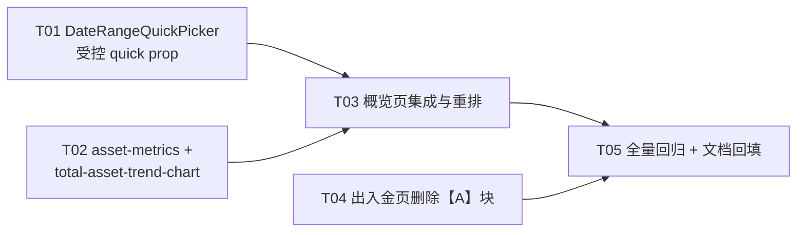
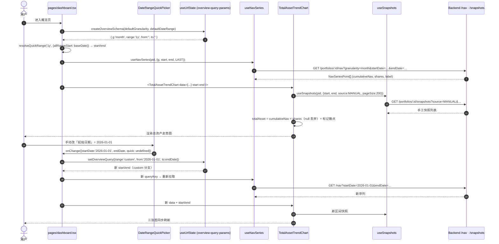

# 总资产概览融合到概览页 — 增量架构设计 + 任务分解

> **版本**: v1.0
> **架构师**: 高见远（Gao）
> **日期**: 2026-08-06
> **依据**: 用户拍板需求（见 §1）+ `docs/PRD.md` v3.1.9 + `docs/ARCHITECTURE.md` v2.5（Canonical）
> **范围**: 前端 `packages/web` 单包改动；**后端零改动（已查证，见 §5）**
> **关联**: 旧方案分支 `fusion/portfolio-overview-cards`（commit `6138f9a`，未合入 main，仅供参考）

---

## 1. 需求与已确认决策

### 1.1 用户原话

> 把出入金页里总资产概览的 3 张指标卡和走势图都融合到概览页，并且走势图不再固定只 30 天，而是跟收益分析一样，加上日期筛选；能接受融合带来的小差异，整个概览页重新设计草图都可以。

### 1.2 已拍板决策

| # | 决策 | 说明 |
|---|------|------|
| D-1 | 出入金页【A】总资产概览块**完全移除** | 3 卡 + 走势图 + 手工记录标记全删，出入金页回归纯粹流水管理 |
| D-2 | 总资产概览**只存在于概览页** | 不再有跨页共享需求 |
| D-3 | 走势图支持日期筛选 | 对齐收益分析页交互（快捷范围 + 起止日期） |
| D-4 | 允许概览页重新设计布局 | 用户明确授权 |
| D-5 | 接受融合带来的小差异 | 见 §7.3 差异清单 |

### 1.3 前情提要（避免重复踩坑）

- 上一轮曾抽出共享组件 `components/portfolio-overview-cards.tsx`（196 行），意图两页共用。该版已从 main 摘出、隔离在分支 `fusion/portfolio-overview-cards`。
- **该方案的前提（两页共用）已被 D-1/D-2 推翻** —— 无需共享组件，落点回到 `features/overview/`，旧方案的「组件放 `components/` 根还是 `features/`」分层纠结点自然消失（详见 §3.1）。
- ⚠️ **必须保留的旧分支修复**：`formatAmountOrEmpty` —— 修「金额 `0` / `''` 被 falsy 判断误吞」的 bug。新实现照单继承（详见 §4.1）。

---

## 2. 现状查证结论（只读调研，全部经代码核实）

### 2.1 出入金页 `packages/web/src/pages/transactions.tsx`（629 行）

| 项 | 位置 | 说明 |
|---|------|------|
| 【A】总资产概览 Card | **L372–442** | 3 个 muted 色块 + 近 30 日 ECharts 折线 + 手工记录散点 + 2 个跳转链接 |
| `daysAgoIso` helper | L77–82 | **仅 L187 一处使用** → 删块后成死代码 |
| `AxisTooltipParam` | L84–91 | 仅【A】图表 tooltip 使用 |
| `overview` query | L179–184 | 仅供【A】3 卡 |
| `nav30` / `snapshots30` | L188–198 | 固定 `daysAgoIso(30)` ~ today |
| `trendData` / `manualDates` / `chartOption` | L218–303 | 图表派生数据 |
| `totalAsset` / `marketValue` | L305–306 | 仅【A】使用 |
| `cashBalance` / `latestBalance` | L307 / L185 | ⚠️ **【B】现金余额块仍在用（L457/L461/L463），不可删** |

**跳转入口影响**：【A】内的「查看全部历史 →」与「⚙ 管理历史记录 →」（`/snapshots?manage=1`）是 `manage=1` 深链在全站的**唯一 UI 入口**（`grep` 确认仅 `transactions.tsx:386` 一处）。侧边栏虽有「资产记录」入口，但不带管理态参数。→ **本设计将这两个链接迁到概览页新走势图卡片头部**（§4.2），避免功能静默丢失。

### 2.2 概览页 `packages/web/src/pages/dashboard.tsx`（683 行）

- **确认：当前概览页压根没有「总资产走势图」**。现有两张趋势图是「净值趋势（累计+当年）」`NavTrendChart` 与「XIRR 趋势」`XirrTrendChart`，走的是净值/XIRR 口径，**不是资产金额口径**。
- 现有 6 张指标卡（L408–469）：当前总资产 / 累计收益率 / 当年收益率 / 年化 XIRR / 累计净值 / 净投入。
- **日期范围已落地且已持久化到 URL**：`useUrlState<OverviewQueryState>(createOverviewSchema(...))`（L219–224），派生 `{startDate, endDate}`（L225–238）下发给 `useNavSeries` / `useXirrSeries`。
- 现有 UI 只有一个**快捷范围 `Select`**（L488–504），受控于 `overviewQuery.range`。

### 2.3 `features/overview/overview-query-params.ts` — 关键发现

URL schema **已经支持 `custom` + `from` + `to`**：

```ts
export const OVERVIEW_RANGE_VALUES = ['1w','1m','3m','6m','1y','ytd','all','custom'] as const;
// from: dateCodec(''), to: dateCodec('')
```

文件头注释明确写着：

> 说明：当前 UI 仅提供快捷范围下拉（**无自定义范围输入**），from/to 主要为「复制链接 / 分享」场景保留。

→ **本次需求正好补齐这个「设计已就绪但 UI 未接线」的能力**，无需新建 URL schema，`overview-query-params.ts` **零改动**。

### 2.4 收益分析页交互基准 `pages/xirr-analysis.tsx`

- 用的是 `DimensionSwitcher`（重量级：维度 Tabs + 聚合方式 + 快捷范围 + 起止日期输入），**不是** `DateRangeQuickPicker`。
- 状态归属：页面 `useState<DimensionSwitcherValue>`，**不写 URL**。
- `allRangeStart={baseDate}`，`baseDate = usePortfolioBaseDate()`。

> **裁决**：概览页**不照搬** `DimensionSwitcher`。原因：概览页已有独立的维度 Tabs + URL 持久化机制（比收益分析页更完善），换成 `DimensionSwitcher` 会退化掉 URL 持久化并重复渲染维度 Tabs。取「交互观感对齐」（快捷范围 + 起止日期输入），不取「组件照抄」。

### 2.5 `components/date/date-range-quick-picker.tsx` — 复用阻碍点

Props：`{ startDate, endDate, onChange, allRangeStart?, quickRanges?, startLabel?, endLabel?, className? }`。

⚠️ **快捷范围下拉是「内部非受控」的**：

```ts
const [quickRange, setQuickRange] = useState<string>(QUICK_RANGE_PLACEHOLDER);
```

初值恒为占位符，**不反映父级传入的区间**。概览页的 `range` 来自 URL / 用户偏好，必须回显 —— 直接套用会导致「偏好设的是『今年』，下拉却显示『选择范围』」。

**且这会打破既有测试**：`pages/__tests__/dashboard-alignment.test.tsx` 的 A8 组有 3 例断言

```ts
const combo = screen.getByRole('combobox');   // 单数！多于 1 个会抛错
expect(combo.textContent).toContain('今年');
```

→ 若在现有 `Select` **之外**再加一个 `DateRangeQuickPicker`（内含 Select），页面就有 2 个 combobox，`getByRole` 抛「found multiple elements」，**A8 的 5 个用例全红**。

**解法（§4.3）**：给 `DateRangeQuickPicker` 增加**可选受控 prop `quick`**，并用它**替换**（而非并列）概览页原有 `Select` —— 页面仍只有 1 个 combobox，标签仍由 `overviewQuery.range` 驱动，**A8 全部保持绿灯**。可选 prop 缺省时维持原内部状态行为，`transactions` / `snapshot-list` / `cash-balance-history` 三处既有调用方**零影响**。

### 2.6 数据源 hooks

| Hook | 文件 | 入参 |
|---|---|---|
| `useNavSeries` | `hooks/use-query-data.ts` L35 | `NavQueryParams { granularity?, startDate?, endDate?, aggregation?, metric? }` —— 起止日期**已是可选 query** |
| `useSnapshots` | `hooks/use-snapshots.ts` L39 | `SnapshotQuery { startDate?, endDate?, page?, pageSize?, source? }` —— **支持 `source` 服务端筛选** |

### 2.7 后端 nav-series 接口能力（**核心查证项**）

| 层 | 文件 | 结论 |
|---|---|---|
| Controller | `backend/src/modules/query/query.controller.ts` L59–67 | `@Get('nav')` + `@Query() query: NavQueryDto` |
| DTO | `backend/src/modules/query/dto/query.dto.ts` L42 | `class NavQueryDto extends DateRangeDto` |
| DateRangeDto | `backend/src/common/dto/date-range.dto.ts` | `@IsOptional() @IsDateString() startDate / endDate` —— **无任何区间长度约束** |
| Service | `query.service.ts` L228–246 | `where: this.buildDateRange(portfolioId, query.startDate, query.endDate)` |
| buildDateRange | `query.service.ts` L172–184 | `date: { gte: new Date(startDate), lte: new Date(endDate) }` —— **纯 Prisma 范围过滤，无默认 30 天、无上限** |

✅ **结论：后端 `GET /api/portfolios/:portfolioId/nav` 原生支持任意起止日期范围。本次需求后端零改动。**

快照接口同理已查证：`SnapshotQueryDto`（`backend/src/modules/snapshot/dto/upsert-snapshot.dto.ts`）支持 `startDate` / `endDate` / `source` / `pageSize`（`@Max(200)`）。

---

## 3. 落点与分层裁决

### 3.1 落点

```
packages/web/src/features/overview/
├── freshness-banner.tsx           （已存在）
├── overview-query-params.ts       （已存在，本次零改动）
├── asset-metrics.ts               🆕 指标构造 + formatAmountOrEmpty（纯函数）
├── total-asset-trend-chart.tsx    🆕 总资产走势图（含手工记录标记）
└── __tests__/
    ├── asset-metrics.test.ts            🆕
    └── total-asset-trend-chart.test.tsx 🆕
```

### 3.2 为何**不需要**修改 §10.1.2 组件分层约定

现行约定：

| 层级 | 目录 | 职责 |
|------|------|------|
| **features** | `src/features/` | 业务功能组件（如 dashboard 统计卡片、交易表单），含业务逻辑 |
| **components/ui** | `src/components/ui/` | shadcn/ui 基础组件，纯展示 |

- 新增两个文件都是**概览页专属的业务零件**（依赖 overview 契约、快照来源枚举、组合 baseDate），**只被 `pages/dashboard.tsx` 引用**，完全落在 `features/` 的既有定义内。
- `features/overview/` 目录已存在（8 页对齐时建立），本次只是**在既有目录里加文件**，不新增层级、不新增跨层依赖方向。
- 旧方案之所以纠结分层，是因为它要被 `dashboard` + `transactions` **两个不同领域的页面**共用，`features/overview/` 装不下 → 只能上浮到 `components/` 根。**D-1/D-2 拍板后这个前提消失**，无需上浮。

✅ **§10.1.2 分层表零改动。** 仅 §1.3 目录树需补 3 行（新增文件），见 §9。

### 3.3 为何**不**把 3 卡 + 走势图打包成一个 `TotalAssetOverview` 组件

> 团队交办建议「`features/overview/` 下新增 `total-asset-overview.tsx` 承载 3 卡 + 走势图」。**此处给出不同推荐并说明理由。**

**关键观察：3 卡与概览页现有 6 卡存在指标重叠。**

| 出入金页 3 卡 | 概览页 6 卡 | 关系 |
|---|---|---|
| 当前总资产 | **当前总资产** | 🔴 **完全重复** |
| 持仓市值 | — | 新增 |
| 现金余额 | — | 新增 |

若把 3 卡整块搬过去，概览页会同时出现**两个「当前总资产」**（一个在 6 卡组、一个在 3 卡组）—— 这恰恰把用户抱怨的「跨页重复」原封不动地变成了「**页内重复**」，与需求初衷相悖。

✅ **推荐方案**：
- **指标卡不做独立分组**，而是**并入概览页统一卡片网格**：6 卡 + 新增「持仓市值」「现金余额」= **8 张卡**（当前总资产去重），按语义重排为「资产构成 4 卡 / 收益表现 4 卡」两行（§7.1）。
- **只把走势图**抽成组件 `total-asset-trend-chart.tsx`。
- 指标构造逻辑（含 `formatAmountOrEmpty`）抽成**纯函数模块** `asset-metrics.ts`，便于不渲染即可单测。

**收益**：彻底消灭重复指标；卡片网格 8 = 4×2 整齐；走势图组件职责单一。

---

## 4. 组件 API 设计

### 4.1 `features/overview/asset-metrics.ts` 🆕（纯函数）

```ts
import type { SnapshotSource } from '@investment-tracker/shared';

/** 金额为空时的统一占位文案 */
export const EMPTY_AMOUNT_TEXT = '暂无数据';

/** 金额格式化选项（与 formatCurrency 第三参一致） */
export interface AmountFormatOptions {
  thousands?: boolean;
  abbreviate?: boolean;
}

/**
 * 金额格式化 + 空值兜底（唯一口径，继承自 fusion 分支的修复）。
 *
 * 🔴 `null` / `undefined` / `''` → EMPTY_AMOUNT_TEXT；
 *    但 `0` 与 `'0'` 是**合法金额**，必须照常格式化 —— 不可用 falsy 判断，
 *    旧代码 `totalAsset ? format(...) : '暂无数据'` 会把 0 误显示为「暂无数据」。
 */
export function formatAmountOrEmpty(
  value: string | number | null | undefined,
  format?: AmountFormatOptions,
): string;

/** 单张指标卡的展示模型 */
export interface OverviewMetric {
  /** React key，同时作为测试定位标识 */
  key: string;
  title: string;
  /** 已格式化的展示值（含空值兜底） */
  value: string;
  description?: string;
  trend: 'up' | 'down' | 'neutral';
  /** 分组：'asset' = 资产构成行；'return' = 收益表现行 */
  group: 'asset' | 'return';
}

export interface BuildOverviewMetricsInput {
  /* —— 资产构成（4 张） —— */
  totalAsset?: string | number | null;
  latestDate?: string | null;
  /** 最新快照来源，'MANUAL' 时「当前总资产」描述追加「✋手工」 */
  latestSource?: SnapshotSource | null;
  marketValue?: string | number | null;
  cashBalance?: string | number | null;
  cashAsOf?: string | null;
  netInvested?: string | number | null;
  /* —— 收益表现（4 张） —— */
  totalReturnRate?: string | number | null;
  yearReturnRate?: string | number | null;
  xirr?: string | number | null;
  cumulativeNav?: string | number | null;
  yearNav?: string | number | null;
  /* —— 格式化偏好 —— */
  format?: AmountFormatOptions;
  navDecimals?: number;
  xirrDecimals?: number;
}

/**
 * 构造概览页 8 张指标卡（固定顺序）。
 *
 * 顺序：
 *  asset  : total-asset / market-value / cash-balance / net-invested
 *  return : total-return-rate / year-return-rate / xirr / cumulative-nav
 */
export function buildOverviewMetrics(
  input: BuildOverviewMetricsInput,
): OverviewMetric[];
```

**要点**
- 纯函数、无 React 依赖 → `asset-metrics.test.ts` 可直接断言，不需 `render`。
- 收敛「格式化 + 空态文案 + trend 方向」三件事，杜绝 8 张卡各写各的三元表达式（当前 `dashboard.tsx` L409–468 正是这种散装写法）。
- `trend` 计算口径保持与现状一致（收益率 ≥0 → up；累计净值 ≥1 → up；金额类恒 neutral）。

### 4.2 `features/overview/total-asset-trend-chart.tsx` 🆕

```ts
import type { NavSeriesPoint } from '@investment-tracker/shared';

export interface TotalAssetTrendChartProps {
  /** 净值序列（由页面传入，与「净值趋势」共用同一份数据，见下方说明） */
  data: NavSeriesPoint[];
  loading?: boolean;
  /** 当前组合 ID —— 组件内自取手工记录标记所需的快照 */
  portfolioId: string;
  /** 图表区间（仅用于查询手工记录快照，与 data 的区间保持一致） */
  startDate: string;
  endDate: string;
  /** 金额格式化偏好 */
  amountThousands?: boolean;
  amountAbbrev?: boolean;
  title?: string;
  className?: string;
}

export function TotalAssetTrendChart(
  props: TotalAssetTrendChartProps,
): JSX.Element;
```

**数据获取位置裁决（混合式）**

| 数据 | 来源 | 理由 |
|---|---|---|
| 净值序列 `data` | **页面传入** | 概览页已为「净值趋势」调用 `useNavSeries(portfolioId, { granularity: g, startDate, endDate, aggregation: LAST })`。传入复用 → **零额外请求**，且保证「总资产走势」与「净值趋势」基于**同一批数据点**，两图不会互相打架 |
| 手工记录标记 | **组件内 `useSnapshots`** | 概览页现在不需要快照数据，仅本图需要 → 内聚在组件里，页面不被污染 |

> 若改为组件内 `useNavSeries`，虽然 TanStack Query 同 key 会命中缓存，但一旦任一侧参数漂移（如页面加了 `metric`）就会**静默变成两次请求**。显式传参更稳。

**总资产口径**（与旧实现一致）

```
totalAsset(t) = cumulativeNav(t) × shares(t)
```

任一为 `null` 则该点丢弃（`.filter()`），与旧 `transactions.tsx` L218–230 完全一致。

⚠️ **口径约束**：该乘法仅在 `aggregation = LAST`（期末值）下成立。若聚合方式改为 `AVG`，`avg(nav) × avg(shares) ≠ avg(nav × shares)`。概览页目前**硬编码 `AggregationMethod.LAST`**，成立；组件 JSDoc 须显式写明此前提，防止后续有人加 AVG 开关时踩坑。

**手工记录标记查询（关键改进）**

```ts
const manualSnapshots = useSnapshots(portfolioId, {
  startDate,
  endDate,
  source: SnapshotSource.MANUAL,  // ✅ 服务端筛选
  pageSize: 200,                   // 后端 @Max(200) 上限
});
```

- 旧实现 `pageSize: 60` **不带 source 筛选**、拉全部快照再前端 `filter(s => s.source === 'MANUAL')`。30 天场景下 30 ≤ 60 侥幸正确；**改成任意区间后必然截断**（如「全部」= 2 年 ≈ 730 条 ≫ 60，只会拿到前 60 天）。
- 新实现用**服务端 `source=MANUAL` 筛选**：返回的只有手工记录行。手工录入天然稀疏，200 条上限对个人投资场景绰绰有余。
- 兜底：若 `total > 200`，仅渲染前 200 个标记并在图例旁给一行灰字提示，不阻塞主线。

**卡片头部（承接 §2.1 的入口迁移）**

```
┌──────────────────────────────────────────────────────────┐
│ 总资产走势            查看全部历史 →   ⚙ 管理历史记录 → │
└──────────────────────────────────────────────────────────┘
```

分别跳 `/snapshots` 与 `/snapshots?manage=1`（沿用 `ROUTE_PATH.SNAPSHOTS`），把从出入金页删掉的两个入口原样补回，`manage=1` 深链不失联。

**空/载入态**：沿用旧实现三态 —— `loading` → `<Skeleton className="h-[260px]" />`；`data` 为空 → 「当前范围暂无资产数据」；否则渲染图表。

**样式**：`grid: chartGrid()`（统一 right:40 防末位日期裁切）；主线色 `hsl(217, 91%, 60%)`（与净值趋势累计线同色系）；手工记录散点 `hsl(0, 84%, 48%)`、`symbolSize: 8`；y 轴 `万` 单位 formatter；`legend { bottom: 0 }`。高度 **260px**（比旧 220px 略高，因概览页为全宽单栏）。

### 4.3 `components/date/date-range-quick-picker.tsx` — 增量改造（向后兼容）

```ts
export interface DateRangeQuickPickerProps {
  startDate: string;
  endDate: string;
  onChange: (range: DateRangeValue) => void;
  allRangeStart?: string | null;
  quickRanges?: ReadonlyArray<QuickRangeOption>;
  startLabel?: string;
  endLabel?: string;
  className?: string;

  /**
   * 🆕 受控快捷范围值（如 '1m' / 'all'）。
   *
   * - **传入时**：下拉回显完全由父级驱动（受控），内部状态不再参与；
   *   传入 `undefined` 或不在 `quickRanges` 中的值（如 'custom'）→ 渲染占位。
   * - **不传时**：维持原有内部 useState 行为，既有调用方（transactions /
   *   snapshot-list / cash-balance-history）零影响。
   */
  quick?: string;
}
```

**实现要点**（受控/非受控双模，React 惯用法）

```ts
const [innerQuick, setInnerQuick] = useState(QUICK_RANGE_PLACEHOLDER);
const isControlled = quick !== undefined;
const shown = isControlled
  ? (quickRanges.some(o => o.value === quick) ? quick : QUICK_RANGE_PLACEHOLDER)
  : innerQuick;
// handleQuickChange 里：非受控才 setInnerQuick，受控交给父级 onChange 驱动
```

⚠️ **红线**：`quick` 必须是**可选**参数，且缺省行为与现状逐字节一致 —— `date-range-quick-picker.test.tsx` 现有 7 个用例均以非受控方式调用，必须全绿。

---

## 5. 后端影响评估

✅ **结论：后端零改动。**

依据（§2.7 已列查证链路）：

1. `GET /api/portfolios/:portfolioId/nav` 的 `NavQueryDto extends DateRangeDto`，`startDate` / `endDate` 为 `@IsOptional() @IsDateString()`，**无区间长度约束、无默认 30 天逻辑**。
2. `QueryService.queryNavSeries` 直接把两个日期交给 `buildDateRange` → Prisma `date: { gte, lte }`，任意范围均可。
3. 「近 30 天」这个限制**从来就只存在于前端** —— `transactions.tsx` L78–82 的本地 `daysAgoIso(30)` 硬编码。删掉它，能力即刻解锁。
4. 手工记录标记所需的 `source=MANUAL` 服务端筛选，后端 `SnapshotQueryDto` 已支持（`@IsEnum(SnapshotSource) source?`），前端 `SnapshotQuery` 类型亦已声明。

**无需变更**：接口路径、query 参数、DTO、service、Prisma schema、migration。

---

## 6. 出入金页删除清单（精确到行，避免死代码）

> 基准：`packages/web/src/pages/transactions.tsx` @ main（629 行）。
> ⚠️ 行号会随删除滚动，**建议自下而上执行**（先删 JSX，再删派生变量，最后删 imports）。

### 6.1 删除 JSX

| 范围 | 内容 |
|---|---|
| **L372–442** | 整个 `{/* 【A】总资产展示卡片（纯展示） */}` `<Card>…</Card>` 块（含 3 个 muted 色块、近 30 日走势图、2 个跳转 Button） |

### 6.2 删除派生变量 / 查询 / helper

| 行 | 符号 | 备注 |
|---|---|---|
| L77–82 | `function daysAgoIso(days)` | ✅ 全仓 grep 确认仅 L187 使用；`dashboard-alignment.test.tsx` 内的同名函数是**测试自有的独立副本**，不受影响 |
| L84–91 | `interface AxisTooltipParam` | 仅【A】tooltip 使用 |
| L94 | `const navigate = useNavigate();` | 仅 L380 / L386 使用 |
| L179–184 | `const overview = useQuery({...})` | 仅【A】3 卡使用 |
| L186 | `const todayIso = ...` | 仅 L191 / L195 使用（L202、L508 是各自独立的 `toIsoDate(new Date())`） |
| L187 | `const start30 = daysAgoIso(30);` | — |
| L188–192 | `const nav30 = useNavSeries(...)` | — |
| L193–198 | `const snapshots30 = useSnapshots(...)` | — |
| L218–230 | `const trendData = useMemo(...)` | — |
| L232–238 | `const manualDates = useMemo(...)` | — |
| L240–303 | `const chartOption = useMemo(...)` | — |
| L305 | `const totalAsset = ...` | — |
| L306 | `const marketValue = ...` | — |

### 6.3 删除 import

| 行 | 改动 |
|---|---|
| L13 | `import { useNavigate, useSearchParams }` → **`import { useSearchParams }`** |
| L14 | `import ReactECharts from 'echarts-for-react';` → **整行删除** |
| L15–22 | lucide 图标：删 **`ChevronRight`**、**`Settings2`**；保留 `Camera` / `Info` / `Plus` / `RotateCcw` |
| L64 | `import { useQuery } from '@tanstack/react-query';` → **整行删除**（全文件仅 L179 一处 `useQuery(`） |
| L65 | `import { getOverview } from '@/api/overview.api';` → **整行删除** |
| L67 | `import { useNavSeries } from '@/hooks/use-query-data';` → **整行删除** |
| L68 | `import { useSnapshots } from '@/hooks/use-snapshots';` → **整行删除** |
| L70 | `import { chartGrid } from '@/components/charts/chart-grid';` → **整行删除** |
| L72 | `import { ROUTE_PATH } from '@/lib/constants';` → **整行删除**（L71 的 `toIsoDate` 是**另一条独立 import**，保留） |
| L74 | `import { QueryGranularity } from '@investment-tracker/shared';` → **整行删除** |

### 6.4 🔴 必须保留（易误删清单）

| 符号 | 仍被谁使用 |
|---|---|
| `latestBalance`（L185） | 【B】L421–423、L461–464 |
| `cashBalance`（L307） | 【B】L457、L461 |
| `formatCurrency` / `formatDate`（L73） | 【B】L458、L463 |
| `toIsoDate`（L71） | L202 `balanceDate` 初值、L508 `max` 属性 |
| `amountThousands` / `amountAbbrev`（L101–102） | 【B】L458 |
| `baseDate` / `usePortfolioBaseDate`（L59/L98） | 【C】L569 `allRangeStart` |
| `DateRangeQuickPicker`（L69） | 【C】L566 |
| `Skeleton`（L46） | L329–330 加载态 |
| `CardDescription`（L26） | 【B】L448、【C】L533 |
| `useMemo`（L12） | L106 `parsed`、L167 `listQuery` |

### 6.5 文件头注释同步

L1–10 的模块 JSDoc 删除【A】段落（L4–6），并把摘要改为「【B】现金余额 + 【C】出入金流水」两块；补一句说明「总资产概览已迁至概览页（见 `docs/designs/overview-fusion-2026-08-06.md`）」。

**保留 `【B】`/`【C】` 编号不重排** —— 全站 grep 显示 PRD §7.1 与多处注释引用这两个编号，重排会引发无谓的跨文档同步成本。

---

## 7. 概览页重设计草图

### 7.1 布局（桌面 ≥1024px）

```
┌────────────────────────────────────────────────────────────────────────────┐
│  概览                          数据截止 2026-08-06   [+录入出入金] [+录入买卖] │
├────────────────────────────────────────────────────────────────────────────┤
│  ⚠ 数据新鲜度提示条（FreshnessBanner · isStale=false 时不渲染）              │
├────────────────────────────────────────────────────────────────────────────┤
│                        ▍资产构成（4 卡 · lg:grid-cols-4）                    │
│  ┌───────────┐ ┌───────────┐ ┌───────────┐ ┌───────────┐                   │
│  │当前总资产 │ │ 持仓市值  │ │ 现金余额  │ │  净投入   │                   │
│  │ ¥1,234,567│ │  ¥987,654 │ │  ¥246,913 │ │  ¥800,000 │                   │
│  │截至 08-06 │ │由买卖推导 │ │生效 08-01 │ │ 存入-取出 │                   │
│  └───────────┘ └───────────┘ └───────────┘ └───────────┘                   │
│                        ▍收益表现（4 卡 · 同一网格续行）                      │
│  ┌───────────┐ ┌───────────┐ ┌───────────┐ ┌───────────┐                   │
│  │累计收益率 │ │当年收益率 │ │ 年化 XIRR │ │ 累计净值  │                   │
│  │  +54.32% ↑│ │  +12.34% ↑│ │  +18.76% ↑│ │  1.543210 │                   │
│  │净值 1.5432│ │净值 1.1234│ │  累计年化 │ │  单位净值 │                   │
│  └───────────┘ └───────────┘ └───────────┘ └───────────┘                   │
├────────────────────────────────────────────────────────────────────────────┤
│  ▍筛选栏（仅作用于下方图表区）                                              │
│  [日|周|月|年]   快捷范围[近1年▾]   起始日期[2025-08-06]  结束日期[2026-08-06]│
├────────────────────────────────────────────────────────────────────────────┤
│  ▍总资产走势（全宽 · 260px）        查看全部历史 →   ⚙ 管理历史记录 →       │
│    ╭──────────────────────────────────────────────────────────────────╮    │
│    │                                        ╱‾‾‾●                     │    │
│    │                          ●___╱‾‾‾‾‾‾‾‾╱                          │    │
│    │        ╱‾‾‾‾‾‾‾‾‾‾‾‾‾‾‾‾╱                                        │    │
│    │  ╱‾‾‾‾╱                              ● = 手工记录                │    │
│    ╰──────────────────────────────────────────────────────────────────╯    │
│              ── 总资产    ● 手工记录                                        │
├────────────────────────────────────────────────────────────────────────────┤
│  ▍四宫格（lg:grid-cols-2，保持现状）                                        │
│  ┌────────────────────────────┐  ┌────────────────────────────┐            │
│  │ 净值趋势（累计 + 当年）    │  │ XIRR 趋势                  │            │
│  └────────────────────────────┘  └────────────────────────────┘            │
│  ┌────────────────────────────┐  ┌────────────────────────────┐            │
│  │ 近期出入金      查看全部 → │  │ 组合表现对比               │            │
│  └────────────────────────────┘  └────────────────────────────┘            │
└────────────────────────────────────────────────────────────────────────────┘
```

**关键排布决策**

| 决策 | 理由 |
|---|---|
| 8 卡合一个网格（`grid-cols-1 sm:grid-cols-2 lg:grid-cols-4`） | 消除「当前总资产」页内重复（§3.3）；4×2 比 3+6 混排整齐；语义分两行：**资产构成**（我有多少）/ **收益表现**（赚了多少） |
| 筛选栏放在**卡片之下、图表之上** | 8 张卡取的是 overview 接口的**最新值**，**不随区间变化**；筛选栏若上移会误导用户以为卡片被筛选。当前位置（L471–505）本就正确，**位置不动**，只把控件从「单个 Select」升级为「Select + 起止日期」 |
| 总资产走势图**全宽独占一行** | 它是本次融合的主角、金额量纲（万元级）需要横向空间；且其卡头承载了迁移过来的两个 `/snapshots` 入口 |
| 四宫格保持原样 | 零回归风险，A6/A7 测试不受影响 |

### 7.2 响应式

| 断点 | 指标卡 | 筛选栏 | 走势图 | 四宫格 |
|---|---|---|---|---|
| `<640px` | 1 列（8 行） | `flex-wrap` 换行堆叠 | 全宽 260px | 1 列 |
| `640–1024px` | 2 列（4 行） | 2 行（维度 / 日期） | 全宽 260px | 1 列 |
| `≥1024px` | 4 列（2 行） | 1 行 | 全宽 260px | 2 列 |

筛选栏容器沿用现有 `flex flex-wrap items-center gap-3`；`DateRangeQuickPicker` 内部本就是 `flex flex-wrap items-end gap-3`，两者嵌套后小屏自然换行，无需额外媒体查询。

> ⚠️ 对齐细节：现有筛选栏是 `items-center`（维度 Tabs 无 Label），而 `DateRangeQuickPicker` 每列是「Label(text-xs) + h-9 控件」结构。建议把容器改为 **`items-end`**，并给维度 Tabs 包一层 `<div className="space-y-1.5"><Label className="text-xs text-muted-foreground">维度</Label>…</div>`，与日期控件底边对齐 —— 这正是 `xirr-analysis` / `dimension-switcher` 的既有做法（`transactions.tsx` L538–543 注释记录过同类错位问题，避免重蹈）。

### 7.3 融合后两页差异清单（用户已接受）

| # | 差异 | 影响 | 处置 |
|---|---|---|---|
| Δ1 | 出入金页不再有总资产视图 | 用户在出入金页看不到当前总资产 | ✅ 用户拍板接受（D-1）。概览页是唯一入口，侧边栏一键可达 |
| Δ2 | 走势图默认区间 30 天 → **跟随页面 `range`（偏好 `defaultDateRange`，通常近 1 年）** | 首屏曲线更长、点更密 | ✅ 见 §8 默认区间论证 |
| Δ3 | 走势图粒度 固定日 → **跟随页面 `g`（偏好 `defaultGranularity`，通常月）** | 月粒度下点更稀疏、曲线更平滑 | ✅ 与同页「净值趋势」口径统一，反而消除了原先两图粒度打架的问题；用户可用 [日] Tab 切回 |
| Δ4 | 「查看全部历史 / 管理历史记录」入口位置迁移 | 从出入金页 → 概览页走势图卡头 | ✅ 功能不丢（§4.2），`?manage=1` 深链保活 |
| Δ5 | 3 卡视觉 muted 色块 → **`StatCard` 卡片** | 观感统一为概览页风格 | ✅ 页内一致性优先 |
| Δ6 | 手工记录标记查询口径变更 | `pageSize:60` 无筛选 → `source=MANUAL` + `pageSize:200` | ✅ 属**缺陷修复**（长区间不再截断），非退化 |

---

## 8. 默认区间建议

### 8.1 推荐：**复用页面既有 `range` 状态，不为走势图引入独立默认值**

即：总资产走势图与「净值趋势」「XIRR 趋势」**共用同一个 `startDate`/`endDate`**，其初值来自用户偏好 `defaultDateRange`（出厂通常 `1y` = 近 1 年）。

### 8.2 论证

| 备选 | 评价 |
|---|---|
| 保持固定 30 天 | ❌ 违背需求（D-3 明确要可筛选）；且同页三张图三种区间，认知割裂 |
| 走势图独立默认「近 3 月」 | ❌ 需新增第二套 `range` 状态 + 第二套 URL 参数 + 第二个筛选控件 → 页面出现两个 combobox，**打破 A8 测试**（§2.5），复杂度陡增，收益为零 |
| **复用页面 `range`（推荐）** | ✅ 单一时间口径，三图同步；✅ URL 持久化/分享/前进后退一次到位；✅ 用户可在「设置」改 `defaultDateRange` 自定义首屏；✅ 零新增状态、零新增 URL 参数；✅ 保持单 combobox，既有测试全绿 |

### 8.3 为何不是「近 1 月」

30 天区间对**资产总额**这类慢变量信息量太低（个人投资组合月内波动常在个位数百分比，曲线近乎水平）。近 1 年能同时呈现趋势与波动，且与同页净值/XIRR 图对齐。**若用户偏好本就是 `1m`，则自动跟随** —— 这正是复用偏好的好处：不硬编码，由用户决定。

### 8.4 状态归属与 URL 同步

**状态归属**：`pages/dashboard.tsx`（唯一持有者），复用现有

```ts
const [overviewQuery, setOverviewQuery] = useUrlState<OverviewQueryState>(
  createOverviewSchema(getPreference('defaultGranularity'), getPreference('defaultDateRange')),
);
```

**URL 同步**：✅ 同步，且 **`overview-query-params.ts` 零改动**（`custom` / `from` / `to` 已在 schema 内，§2.3）。

**交互 → URL 映射**

| 用户动作 | `setOverviewQuery` 参数 | URL 结果 |
|---|---|---|
| 选快捷项（`onChange` 带 `quick`） | `{ range: quick, from: '', to: '' }` | `?range=3m`（默认值不写入） |
| 手改起/止日期（`quick === undefined`） | `{ range: 'custom', from: r.startDate, to: r.endDate }` | `?range=custom&from=2026-01-01&to=2026-06-30` |
| 切维度 Tab | `{ g: v }` | `?g=day` |

**回显**：`quick={overviewQuery.range === 'custom' ? undefined : overviewQuery.range}` → `custom` 时下拉显示占位「选择范围」，起止日期输入框显示具体值。语义准确。

派生逻辑 `useMemo`（L225–238）**保持不变** —— 它已经正确处理了 `range==='custom' && from && to` 分支，本次只是让这条分支第一次真正被 UI 触达。

---

## 9. 文档同步范围

| 文档 | 改动 |
|---|---|
| `docs/designs/overview-fusion-2026-08-06.md` | 🆕 本文件 |
| `docs/designs/README.md` | 索引表追加 1 行 |
| `docs/ARCHITECTURE.md` §1.3 目录树（L417–419 附近） | `features/overview/` 下补 `asset-metrics.ts`、`total-asset-trend-chart.tsx`、`__tests__/` 三行 |
| `docs/ARCHITECTURE.md` 版本行（L3–L6） | v2.5 → **v2.6**，「近期修订」改写 |
| `docs/ARCHITECTURE-CHANGELOG.md` | 追加 `## v2.6` 条目 |
| `docs/ARCHITECTURE.md` §10.1.2 | ❌ **不改**（理由见 §3.2） |

---

## 10. 任务列表

> 依赖顺序即实现顺序。**后端无任务**（§5）。

### T01 · 共享控件受控化：`DateRangeQuickPicker` 支持 `quick` prop

- **优先级**: P0 ｜ **依赖**: 无 ｜ **风险**: 中（共享组件，3 个既有调用方）
- **文件**
  - `packages/web/src/components/date/date-range-quick-picker.tsx`（改）
  - `packages/web/src/components/date/__tests__/date-range-quick-picker.test.tsx`（改，追加受控用例）
- **内容**
  1. 新增可选 prop `quick?: string`（§4.3 签名与双模实现）。
  2. 受控判定 `quick !== undefined`；值不在 `quickRanges` 内（如 `'custom'`）→ 渲染占位。
  3. 非受控路径**逐字节保持现状**。
  4. 追加用例：① 传 `quick='3m'` → 触发器显示「近3月」；② 传 `quick='custom'` → 显示占位；③ 不传 → 仍显示占位且选中后内部回显（回归）。
- **验收**: 既有 7 个用例全绿；`transactions` / `snapshot-list` / `cash-balance-history` 三处渲染无变化。

### T02 · 新建概览页零件：指标构造 + 总资产走势图

- **优先级**: P0 ｜ **依赖**: 无（可与 T01 并行）
- **文件**
  - `packages/web/src/features/overview/asset-metrics.ts`（新）
  - `packages/web/src/features/overview/total-asset-trend-chart.tsx`（新）
  - `packages/web/src/features/overview/__tests__/asset-metrics.test.ts`（新）
  - `packages/web/src/features/overview/__tests__/total-asset-trend-chart.test.tsx`（新）
- **内容**
  1. `asset-metrics.ts`：`formatAmountOrEmpty`（🔴 保留 fusion 分支对 `0` / `''` 的保护）+ `buildOverviewMetrics` 输出 8 项（§4.1）。
  2. `total-asset-trend-chart.tsx`：`data` 由页面传入；组件内 `useSnapshots({ source: MANUAL, pageSize: 200 })` 取手工标记；`totalAsset = cumulativeNav × shares`（null 丢弃）；`chartGrid()`；三态（loading/empty/chart）；卡头两个 `/snapshots` 链接（§4.2）。
  3. 测试：`asset-metrics` 断言 `0` → `¥0.00` 而非「暂无数据」、`null`/`''` → 「暂无数据」、8 项顺序与 `group`；图表组件断言空态文案、手工标记散点数量、`source=MANUAL` 查询参数。
- **验收**: 新增测试全绿；组件不被 `transactions.tsx` 引用。

### T03 · 概览页集成与重排

- **优先级**: P0 ｜ **依赖**: **T01, T02**
- **文件**: `packages/web/src/pages/dashboard.tsx`（改）
- **内容**
  1. 引入 `useLatestCashBalance(currentPortfolioId)` 取现金余额（新增卡所需）。
  2. 用 `buildOverviewMetrics(...)` 替换 L409–468 的 8 段散装 `<StatCard>` 三元表达式；网格改 `grid-cols-1 sm:grid-cols-2 lg:grid-cols-4`，按 `group` 排「资产构成 4 / 收益表现 4」。
  3. 筛选栏（L471–505）：**移除**原 `Select`，替换为 `DateRangeQuickPicker`（`quick` / `startDate` / `endDate` / `allRangeStart={baseDate}`）；容器改 `items-end`，维度 Tabs 补 Label（§7.2 注意项）。
  4. `onChange` 写 URL：带 `quick` → `{ range: quick, from:'', to:'' }`；否则 → `{ range:'custom', from, to }`（§8.4）。
  5. 在筛选栏与四宫格之间插入 `<TotalAssetTrendChart data={navSeries.data ?? []} loading={navSeries.isLoading} … />`，置于 `{!hasNoData && …}` 条件内（空态时不渲染，与四宫格一致）。
  6. 更新文件头 JSDoc。
- **验收**: 页面仍**只有 1 个 combobox**；`dashboard-alignment.test.tsx` A6/A7/A8 全绿。

### T04 · 出入金页删除【A】总资产概览块

- **优先级**: P0 ｜ **依赖**: 无（可与 T01–T03 并行；建议 T03 后合并以便对照验收）
- **文件**: `packages/web/src/pages/transactions.tsx`（改）
- **内容**: 严格执行 §6 清单 —— 删 JSX L372–442 → 删派生变量/查询/helper → 删 9 处 import → 更新文件头 JSDoc。**逐条核对 §6.4 保留清单**。
- **验收**: `pnpm --filter web tsc --noEmit` 0 error（无 unused 残留）；ESLint 无 `no-unused-vars`；页面仅剩【B】【C】两块且功能正常。

### T05 · 全量回归与文档落地对照

- **优先级**: P0 ｜ **依赖**: **T01, T02, T03, T04**
- **文件**: 无源码改动（仅修复回归 + `docs/designs/README.md` 回填落地 commit）
- **内容**
  1. `pnpm -w turbo run typecheck` / `pnpm --filter web vitest run` 全绿。
  2. 按 §11 QA 清单人工走查。
  3. 在 `docs/designs/README.md` 索引行回填本轮落地 commit 号。
- **验收**: tsc 0 error、web vitest 全绿、§11 清单逐项通过。

### 10.1 依赖图



### 10.2 依赖包

**无新增依赖。** 全部复用现有：`echarts-for-react`、`echarts`、`@tanstack/react-query`、`react-router-dom`、`lucide-react`、shadcn/ui。

---

## 11. 测试要点（交付 QA）

### 11.1 新功能 — 走势图日期筛选

| # | 用例 | 期望 |
|---|---|---|
| N-1 | 首次进入概览页（偏好 `defaultDateRange=1y`） | 走势图区间 = 近 1 年；快捷范围下拉显示「近1年」；URL **不含** `range`（默认值不写入） |
| N-2 | 选「近3月」 | 三张图（总资产/净值/XIRR）**同步**变为近 3 月；URL → `?range=3m` |
| N-3 | 选「全部」 | `startDate` = 组合 `baseDate`；组合无 `baseDate` 时回落 `2000-01-01` |
| N-4 | 手改「起始日期」为 2026-01-01 | URL → `?range=custom&from=2026-01-01&to=<今天>`；下拉回落占位「选择范围」；图表刷新 |
| N-5 | 带 `?range=custom&from=…&to=…` 直接打开 | 起止输入框回显该区间，图表按此区间渲染 |
| N-6 | F5 刷新 / 浏览器前进后退 | 区间与维度均正确还原 |
| N-7 | 切维度 [日]/[周]/[月]/[年] | 走势图点密度随之变化，区间不变 |
| N-8 | 页面 combobox 数量 | **恰好 1 个**（`getByRole('combobox')` 不得抛 multiple） |

### 11.2 新功能 — 8 张指标卡

| # | 用例 | 期望 |
|---|---|---|
| N-9 | 卡片数量与顺序 | 8 张；第 1 行 = 当前总资产/持仓市值/现金余额/净投入；第 2 行 = 累计收益率/当年收益率/年化 XIRR/累计净值 |
| N-10 | **「当前总资产」只出现 1 次** | `getAllByText('当前总资产')` 长度 = 1（融合去重的核心验收） |
| N-11 | 🔴 金额为 `0` / `'0'` | 显示 `¥0.00`，**不得**显示「暂无数据」（`formatAmountOrEmpty` 回归） |
| N-12 | 金额为 `null` / `undefined` / `''` | 显示「暂无数据」 |
| N-13 | 现金余额未维护 | 值「暂无数据」，描述「未维护，可在下方录入」类文案 |
| N-14 | 千分位 / 缩写偏好开关 | 8 张卡金额同步响应 |
| N-15 | 响应式 | ≥1024px 4 列；640–1024px 2 列；<640px 1 列 |

### 11.3 新功能 — 总资产走势图

| # | 用例 | 期望 |
|---|---|---|
| N-16 | 手工记录标记 | 有 MANUAL 快照的日期出现红色散点；tooltip 显示「手工记录：¥…」 |
| N-17 | 长区间（「全部」，跨 > 60 天且含手工记录） | 🔴 标记**不被截断**（旧 `pageSize:60` 缺陷回归项）；网络面板确认请求带 `source=MANUAL&pageSize=200` |
| N-18 | 区间内无数据 | 显示「当前范围暂无资产数据」，不显示空白图表 |
| N-19 | 加载中 | 显示 Skeleton |
| N-20 | 末位日期标签 | 完整可见不被裁切（`chartGrid()` right:40 生效） |
| N-21 | 卡头链接 | 「查看全部历史 →」跳 `/snapshots`；「⚙ 管理历史记录 →」跳 `/snapshots?manage=1` 且进入管理态 |
| N-22 | 网络请求数 | 走势图**不额外**发起 nav-series 请求（复用页面查询） |

### 11.4 回归 — 概览页现有能力

| # | 用例 | 期望 |
|---|---|---|
| R-1 | `dashboard-alignment.test.tsx` **A8 全 8 例** | 全绿（偏好 ytd/1w/6m 触发器文案、1w/all/未知值解析下发、维度下发） |
| R-2 | A6 近期出入金「查看全部」 | 链接指向 `/cashflows`，全页仅 1 处「查看全部」 |
| R-3 | A7 三步引导（overview 返回空） | 引导卡替换四宫格；**总资产走势图同样不渲染**；8 指标卡与筛选栏照常显示 |
| R-4 | overview 请求**失败** | 不得伪装成空态；四宫格与走势图仍渲染 |
| R-5 | `dashboard-comparison.test.tsx` | 全绿 |
| R-6 | FreshnessBanner | `isStale=false` 不渲染，行为不变 |
| R-7 | 「+录入出入金」「+录入买卖」弹窗 | 正常开合 |

### 11.5 回归 — 出入金页删除后

| # | 用例 | 期望 |
|---|---|---|
| R-8 | 页面渲染 | 仅【B】现金余额 + 【C】流水列表；无「总资产概览」标题、无图表 |
| R-9 | 🔴 **死代码扫描** | `grep -n "daysAgoIso\|ReactECharts\|chartGrid\|getOverview\|useNavSeries\|useSnapshots\|ROUTE_PATH\|Settings2\|ChevronRight\|QueryGranularity\|useNavigate" packages/web/src/pages/transactions.tsx` → **0 命中** |
| R-10 | 【B】现金余额 | 当前余额展示、ⓘ 提示、变更历史、金额/日期/保存全部正常（验证 `latestBalance`/`cashBalance` 未被误删） |
| R-11 | 【C】流水列表 | 类型多选、日期范围（`allRangeStart=baseDate`）、排序、分页、重置、URL 持久化全部正常 |
| R-12 | FLOW-P0-06 软提示「去更新」 | 仍能聚焦【B】金额输入框（`CASH_BALANCE_FOCUS_EVENT` 未受影响） |
| R-13 | 控制台 | 无 error / warning |

### 11.6 回归 — 共享控件 `DateRangeQuickPicker`

| # | 用例 | 期望 |
|---|---|---|
| R-14 | `date-range-quick-picker.test.tsx` 现有 7 例 | 全绿 |
| R-15 | 资产记录页 `snapshot-list` 筛选 | 行为与视觉无变化 |
| R-16 | 现金余额变更历史 `cash-balance-history` | 行为与视觉无变化 |
| R-17 | 出入金页【C】日期筛选 | 行为与视觉无变化 |

### 11.7 门禁

```bash
pnpm -w turbo run typecheck      # tsc 0 error
pnpm --filter web vitest run     # web 全部用例绿
pnpm -w turbo run lint           # 无 no-unused-vars
```

---

## 12. 风险与缓解

| # | 风险 | 等级 | 缓解 |
|---|---|---|---|
| K-1 | 改共享 `DateRangeQuickPicker` 波及 3 个既有调用方 | 中 | `quick` 设为**可选**、双模实现；缺省路径不改；T01 单独成任务先行验收（R-14~R-17） |
| K-2 | 概览页新增 combobox 打破 A8 `getByRole('combobox')` 单数断言 | **高** | 设计上**替换**而非并列原 Select（§2.5）；N-8 显式验收 combobox 数量 = 1 |
| K-3 | 删【A】块误删【B】仍在用的 `latestBalance` / `cashBalance` | 中 | §6.4 保留清单逐条核对；R-10 专项回归；tsc 会捕获引用缺失 |
| K-4 | 长区间手工标记被 `pageSize` 截断 | 中 | 改用服务端 `source=MANUAL` + `pageSize:200`；N-17 专项验收；超 200 时给灰字提示 |
| K-5 | `cumulativeNav × shares` 在 `AVG` 聚合下口径错误 | 低 | 概览页硬编码 `LAST`；组件 JSDoc 显式声明前提；如未来加 AVG 开关须改为后端直出总资产序列 |
| K-6 | `?manage=1` 深链入口随【A】删除而失联 | 中 | 迁到走势图卡头（§4.2）；N-21 验收 |
| K-7 | 8 卡在中屏（640–1024px）显 2 列 → 4 行，页面偏长 | 低 | 可接受；筛选栏与图表仍在首屏下方一屏内。若反馈强烈可改 `md:grid-cols-3`（8 卡 → 3/3/2，观感略碎，故不作首选） |

---

## 13. 待明确事项

| # | 事项 | 现处置（不阻塞实现） |
|---|---|---|
| U-1 | 「持仓市值」「现金余额」两张新卡是否需要 PRD 条目号 | 现有 6 卡对应 DASH-P0-01。建议本轮沿用该条目，PRD 同步由主理人排期（本设计不改 PRD） |
| U-2 | 「当前总资产」是否展示 `latestSource === 'MANUAL'` 的「✋手工」徽标 | `OverviewResponse.latestSource` 后端已透出（Q-2 乙）。`asset-metrics.ts` 已预留入参，默认**在 description 追加「· ✋手工」**；如需独立 Badge 组件另行提需求 |
| U-3 | 手工记录标记数 > 200 的提示文案 | 暂定灰字「仅显示前 200 个手工记录标记」，文案可由主理人定稿 |
| U-4 | 概览页是否需要「重置筛选」按钮 | 现状无，本次不加（快捷范围下拉本身即可回到默认）。如需要另行提需求 |

---

## 14. 附：核心时序



---

**文档结束。**
