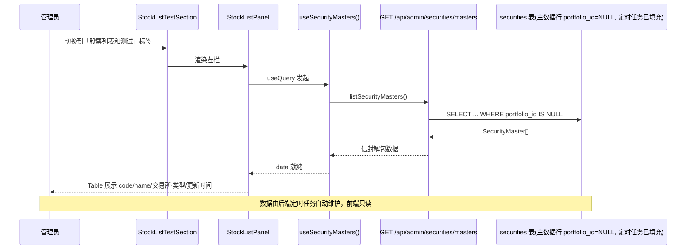
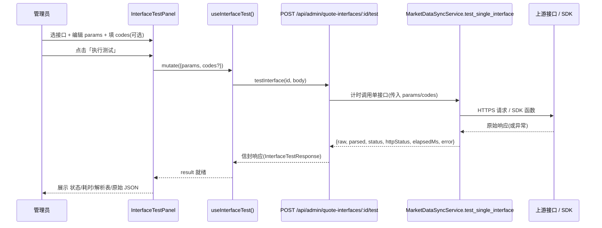

# 「股票列表和测试」分页 — 前端页面结构方案（设计 / 提案）

> 本文档是**前端页面结构方案（设计 / 提案）**，不含实现代码，仅描述结构、组件树、数据流、类型契约与后端前置依赖。
> 所有结论均基于真实代码阅读（见「参考代码」一节），文件路径与字段以实际仓库为准。
>
> 参考代码：
> - `web/src/pages/admin.tsx`
> - `web/src/features/admin/quote-provider-section.tsx`（含 `ProviderInterfaces` / `InterfacesByCategoryOverview` 等子组件组织方式）
> - `backend/app/models/security.py`（`Security` 模型）
> - `backend/app/models/quote_interface.py`（`QuoteInterface` 模型）
> - `backend/app/services/market_data_sync.py`（`MarketDataSyncService`）
> - `backend/app/modules/admin/router.py`（`router_admin`，前缀 `/api/admin`，`EnvelopeRoute` 自动包信封）
> - `web/src/api/quote-interface.api.ts`、`web/src/api/security.api.ts`、`web/src/api/types.ts`
> - `web/src/hooks/use-quote-interface.ts`
> - `web/src/components/ui/`（shadcn 可用组件：card / table / button / badge / dialog / alert-dialog / input / select / textarea / tabs / skeleton 等）

---

## TL;DR（要点摘要）

- **入口**：在 `admin.tsx` 的 `MODULES` 注册表追加第三个分页 `股票列表和测试`，挂载新组件 `StockListTestSection`。
- **布局**：`StockListTestSection` 顶部做左右两栏（`lg:grid-cols-2`）；左栏 `StockListPanel`（只读展示系统级股票主数据），右栏 `InterfaceTestPanel`（选接口 → 填参数 → 执行测试 → 看原始响应）。
- **左栏数据**：当前 `securities` 表是**组合（portfolio）维度**主数据、由用户交易产生，**不是**系统级全市场股票主数据。（详见 §4.2「改造 securities」方案：不新建表，`portfolio_id` 可空 + 新增 `exchange`，列表端点 `GET /api/admin/securities/masters`。）**主数据获取走「已配置接口」（非硬编码 AKShare）、支持多资产类别（A股/港股/可转债/基金…）扩展，机制见 §11。**
- **右栏数据**：选中接口（`listAllInterfaces`）→ 动态渲染该接口 `params` 模板为可编辑键值对（支持增删多个参数）→ 可选填 codes → 「执行测试」调**新端点** `POST /api/admin/quote-interfaces/:id/test`（body `{params, codes?}`）→ 展示原始响应（pretty-print JSON）+ 解析出的 `{code→price}` + 状态 / 耗时。**该测试端点目前不存在，是后端前置依赖。**
- **风格一致性**：复用 shadcn（Card/Table/Button/Badge/Input/Select/Textarea/Dialog）、TanStack Query（`useQuery`/`useMutation`）、`lucide-react` 图标、`sonner` toast，对齐 `quote-provider-section.tsx` 组织方式。
 - **后端前置依赖**（§8 决策后已收窄）：① 改造 `securities`（portfolio_id 可空 + exchange + 部分唯一索引）+ 定时同步任务 + `GET /api/admin/securities/masters`（+ 可选 `POST /api/admin/securities/sync`）；② 单接口测试端点 `POST /api/admin/quote-interfaces/{id}/test`（执行单接口、回传原始响应）。① 已扩展为「**配置驱动、多资产类别**」：`QuoteInterface` 加 `asset_class`/`purpose`/`resp_name_field`/`resp_exchange_field`，`SecurityType` 扩展 `HK_STOCK`/`CONVERTIBLE_BOND`/`ETF`/`INDEX`，sync 走 `purpose=MASTER_LIST` 接口、复用现有 `priority` 降级链，详见 §11。
- **决策点状态**：§8 五项已全部拍板（改造 securities / 不持久化 / 任意 enabled 接口 / 支持左右联动 / `.../quote-interfaces/{id}/test`）。详见 §8。
- **补充需求（§10）**：录入买卖界面移除「新建标的」、改为证券搜索（code/名称/拼音首字母），选中主数据后由后端 `resolve` 懒实例化为组合标的。影响：后端 `securities` 需新增 `pinyin_initials` 字段 + 搜索端点支持拼音 + `resolve` 端点（§7 ①③）；前端 `security-trade-form.tsx` 替换为 `SecuritySearchCombobox`（依赖 `cmdk`）。新待确认决策 6–9 见 §10.6。

---

## 1. 页面定位与入口

「股票列表和测试」是「金融数据接口」管理页（`web/src/pages/admin.tsx`）内的**第三个分页（标签）**。该页本身仅管理员可见（`useIsAdmin()` 门禁），页内以 `MODULES` 注册表驱动标签分页：

```ts
// web/src/pages/admin.tsx（结构示意，非实现）—— 在 MODULES 追加第三项
import { ServerCog, Tags, ListChecks } from 'lucide-react';
import { QuoteProviderSection } from '@/features/admin/quote-provider-section';
import { InterfaceCategorySection } from '@/features/admin/interface-category-section';
import { StockListTestSection } from '@/features/admin/stock-list-test-section'; // 新增

const MODULES: AdminModule[] = [
  { key: 'quote-provider',   label: '接口API来源',   icon: <ServerCog className="mr-2 h-4 w-4" />, component: QuoteProviderSection },
  { key: 'interface-category', label: '接口分类管理', icon: <Tags className="mr-2 h-4 w-4" />,      component: InterfaceCategorySection },
  // ↓↓↓ 新增：股票列表和测试 ↓↓↓
  { key: 'stock-list-test',  label: '股票列表和测试', icon: <ListChecks className="mr-2 h-4 w-4" />, component: StockListTestSection },
];
```

**挂载关系**：`admin.tsx` 不改变（仅追加 `MODULES` 项 + 顶部 `import`）；标签切换时按 `active` key 渲染 `StockListTestSection`（即 `findModule(active).component`）。`StockListTestSection` 内部自行编排左右两栏与各自子组件，与现有两个 section 平级，无额外权限处理（已继承 admin 门禁）。

---

## 2. 组件树

```mermaid
classDiagram
    direction TB
    class StockListTestSection {
        +JSX 渲染入口
        布局: lg:grid-cols-2 左右两栏
        内含 StockListPanel + InterfaceTestPanel
    }
    class StockListPanel {
        +useSecurityMasters() 读取主数据
        +本地 state: query(搜索)
        只读 Table: code/name/exchange/type/updatedAt
    }
    class InterfaceTestPanel {
        +useQuoteInterfacesAll() 接口下拉
        +useInterfaceTest() 执行测试
        +state: selectedInterfaceId
        +state: paramRows[{key,value}]
        +state: codesText
        +state: result(测试响应)
        选接口 → 渲染 params → 填 codes → 执行 → 展示原始响应+解析
    }
    StockListTestSection --> StockListPanel : 左栏(只读)
    StockListTestSection --> InterfaceTestPanel : 右栏(测试)
```

> 组织方式对齐 `quote-provider-section.tsx`：**三个组件同文件 `stock-list-test-section.tsx`**（`StockListTestSection` 导出为主，内部含 `StockListPanel` / `InterfaceTestPanel` 及必要的辅助子组件），避免文件零散。

### 组件职责与 props/state 设计

| 组件 | 职责 | 主要 state / hooks | 关键 UI |
|------|------|--------------------|----------|
| `StockListTestSection` | 顶层容器，左右两栏布局；串联左右两面板 | 无（或统管 loading 态） | `Card` 包裹两栏；`grid grid-cols-1 lg:grid-cols-2 gap-6` |
| `StockListPanel`（左） | 只读展示系统级股票主数据；支持关键字搜索 | `useSecurityMasters()`（见§4）；`query: string` | `CardHeader`(标题+说明) + `Input`(搜索) + `Table`(code/name/交易所·类型/更新时间) |
| `InterfaceTestPanel`（右） | 选接口、动态渲染 `params`、可选 codes、执行测试、展示原始响应 | `useQuoteInterfacesAll()`、`useInterfaceTest()`；`selectedInterfaceId`、`paramRows: {key,value}[]`、`codesText`、`result` | `Select`(接口) + 可编辑键值对表格(增删) + `Textarea`(codes) + `Button`(执行) + `Card`(响应区：状态 Badge / 耗时 / 解析表 / 原始 JSON) |

**左右联动（§8 决策 4，支持）**：左栏每行提供「填入测试」操作，将 `code` 注入右栏 `InterfaceTestPanel` 的 `codesText`（追加，不覆盖）；默认两面板仍解耦、互不依赖。

---

## 3. 文件清单

| 文件 | 操作 | 说明 |
|------|------|------|
| `web/src/pages/admin.tsx` | 修改 | `MODULES` 追加 `stock-list-test` 项 + 顶部 `import { StockListTestSection }` |
| `web/src/features/admin/stock-list-test-section.tsx` | **新增** | `StockListTestSection` + `StockListPanel` + `InterfaceTestPanel`（同文件，对齐现有 section 组织） |
| `web/src/api/security-master.api.ts` | **新增** | `listSecurityMasters()`（→ `GET /api/admin/securities/masters`）；可选 `syncSecurityMasters()`（→ `POST /api/admin/securities/sync`）；并定义 `SecurityMaster` / 测试相关类型 |
| `web/src/api/quote-interface.api.ts` | 修改 | 扩展 `testInterface(id, body)`（→ `POST /api/admin/quote-interfaces/:id/test`）；定义 `InterfaceTestRequest` / `InterfaceTestResponse` 类型 |
| `web/src/hooks/use-security-master.ts` | **新增** | `useSecurityMasters()`（`useQuery`，`enabled: isAdmin`）；可选 `useSyncSecurityMasters()`（`useMutation`） |
| `web/src/hooks/use-interface-test.ts` | **新增** | `useInterfaceTest()`（`useMutation`，调 `testInterface`，`onSuccess/onError` toast） |
| `web/src/components/security/security-search-combobox.tsx` | **新增（§10）** | 共享证券搜索 Combobox（`Input`+下拉候选，依赖 `cmdk`），录入买卖界面必用；后续分红/价格等可复用 |
| `web/src/api/types.ts` | 可选 | 若项目约定类型集中放此处，可把 `SecurityMaster` / 测试类型 re-export 到此（当前 `Security` 即在此，`QuoteInterface` 类型在 `quote-interface.api.ts`） |

> 说明：现有类型约定为「接口类型就近放在其 api 文件」（如 `QuoteInterface` 在 `quote-interface.api.ts`，`Security` 在 `api/types.ts`）。本方案将 `SecurityMaster` / `InterfaceTest*` 类型就近放入 `security-master.api.ts` 与 `quote-interface.api.ts`，保持与现状一致。

---

## 4. 左栏数据流（StockListPanel）

### 4.1 关键事实：现有 `securities` 不是系统级股票主数据

`backend/app/models/security.py` 的 `Security`：

```
Security(portfolio_id, code, name, type, currency)
UniqueConstraint("portfolio_id", "code")
```

- 它是**组合（portfolio）维度**的主数据，`portfolio_id` 为外键；由用户的证券买卖流水（`SecurityTrade`）产生，是「我持有的标的」，**不是全市场股票字典**。
- 现有前端 `listSecurities(portfolioId)`（`web/src/api/security.api.ts`）按组合拉取，返回 `PaginatedResponse<Security>`，类型定义见 `web/src/api/types.ts`（`Security`：`{id, portfolioId, code, name, type, note, createdAt, updatedAt}`）。

因此**不能**直接用「用户持仓行」充当全市场字典；但经 §8 决策，采用**改造 `securities`** 方案（见 §4.2）：新增 `portfolio_id IS NULL` 的系统主数据行承载全市场代码与名称，与用户持仓行同表共存、互不污染。

### 4.2 最终决策（改造 securities，即「方案 A」的落地形态，§8 决策 1）

经用户拍板：**不新建 `stock_masters` 表**，而是**改造现有 `securities` 表**以同时承载「系统级全市场股票主数据」与「用户持仓标的」两种语义——因为下游持仓标的（`SecurityTrade`）正是按 `code` 关联 `securities` 并读取其 name/code 的，让主数据即 `securities` 本身，**不存在污染「持仓标的」语义**，反而成为单一可信源（Single Source of Truth）。

`Security` 模型改造点（具体迁移见实现阶段）：

- `portfolio_id`：`nullable=False` → `nullable=True`。
  - **系统级主数据行**：`portfolio_id = NULL`（NULL 不触发 `portfolios` 的 `ON DELETE CASCADE`，语义干净）。
  - **用户持仓行**：仍填真实组合 id，保持原有 CASCADE 行为不变。
- 新增 `exchange: Mapped[Optional[str]]`（如 `SH`/`SZ`/`BJ`，可空）—— 同步任务填充。
- **新增 `pinyin_initials: Mapped[Optional[str]]`（如 `贵州茅台`→`gzm`，可空）** —— 同步任务用 `pypinyin` 计算首字母并填充（见 §7 ① 与 §10 数据匹配逻辑）。**这是为支持录入界面「按名称拼音首字母搜索」而追加的字段，原 §8 决策 1 的改造清单未含，属本补充需求带来的新增依赖。**
- `type`：已存在（`SecurityType` 枚举），需**扩展** `HK_STOCK` / `CONVERTIBLE_BOND` / `ETF` / `INDEX`（见 §11.3）；同步主数据时 `type` 直接取来源接口的 `asset_class`。
- `updated_at`：`Security` 已继承 `TimestampMixin`，同步 upsert 时自动刷新，直接作为「最近同步时间」展示，无需新增列。
- **唯一约束调整**：保留现有 `uq_securities_portfolio_code(portfolio_id, code)`（约束用户行）；系统主数据行（`portfolio_id IS NULL`）需按 `资产类别+code` 唯一，新增 **PostgreSQL 部分唯一索引** `uq_securities_master_asset_code ON securities(asset_class, code) WHERE portfolio_id IS NULL`（避免港股 5 位码等跨类命名空间碰撞，不干扰用户行）。
  - （备选：新增 `is_master: bool` 标志 + 部分索引；当前采用 `portfolio_id IS NULL` 判定，零新增列、最简洁。）

定时同步任务：

- 沿用 `MarketDataSyncService`，新增 `sync_security_masters(asset_class?)`：**不再硬编码 AKShare**，改为查询 `purpose=MASTER_LIST` 的 `QuoteInterface` 配置行（可跨 provider），复用 `_call_interface` 的 https/sdk 分派拉取原始行，按 `resp_code_field`/`resp_name_field`/`resp_exchange_field` 解析为 `(code, name, exchange)`，按 `asset_class` 分组 upsert 到 `securities` 主数据行（`portfolio_id = NULL`；存在更新 `name`/`exchange`/`type`/`pinyin_initials`，不存在 insert）；刷新 `updated_at`。AKShare 仅是「其中一个 provider」配置（`access_method=sdk`, `config.sdk_func=...`），换成付费 HTTPS 源只需改配置、零代码改动（详见 §11）。
- 触发：调度器（APScheduler/Celery beat）定时 + 可选管理面手动端点 `POST /api/admin/securities/sync`（对齐现有 `POST /api/admin/quote-providers/sync` 风格）。
- 交易所/类型：由 `resp_exchange_field` 或代码前缀推断 + `asset_class`（枚举见 §11.3）落地，前端仅展示，不强制约束。

列表端点：`GET /api/admin/securities/masters`

- 返回 `portfolio_id IS NULL` 的 `securities` 行，即系统级股票主数据（`SecurityMaster[]`：`code`/`name`/`exchange`/`type`/`updated_at`）。
- 支持可选 `?q=` 关键字搜索（匹配 `code`/`name`）；量级可控，建议一次性返回或较大 pageSize。

> 原「方案 B（复用 securities 伪造 portfolio 上下文）」已被本决策取代，不再采用——本方案虽仍复用 `securities` 表，但**以 `portfolio_id IS NULL` 正名系统行**，而非伪造组合，语义清晰。

### 4.3 取舍回顾（改造 securities vs 原新表方案）

| 维度 | 改造 securities（采用） | 原新表 stock_masters（未采用） |
|------|--------------------------|--------------------------------|
| 语义 | ✅ 主数据即 securities 单一可信源，持仓按 code 关联，无污染 | 多一张表，持仓仍需关联 |
| 迁移成本 | 中（portfolio_id 改可空 + exchange 列 + 部分唯一索引） | 中（新模型+迁移+任务+端点） |
| 对现有表 | 侵入 securities（但语义正向收敛） | 无侵入 |
| 前端 | 新增 `security-master.api.ts` + hook，读 `securities/masters` | 新增 `stock-master.api.ts` |

**结论：采用改造 securities 方案**（§8 决策 1）。

### 4.5 左栏调用流（sequence）



---

## 5. 右栏数据流（InterfaceTestPanel）

### 5.1 交互与数据流

1. **选接口**：`Select` 数据源来自 `useQuoteInterfacesAll()`（→ `listAllInterfaces()`，返回全部 `QuoteInterface`）。（§8 决策 3：允许对任意 `enabled` 接口测试，不限分类。）
2. **动态渲染 params**：读取选中接口的 `params: Record<string, unknown>` 模板，渲染为「可编辑键值对」表格。每行 `{key, value}`，支持：
   - 编辑 value（覆盖模板默认值）；
   - **新增**参数行（灵活添加多个参数）；
   - **删除**参数行。
3. **可选 codes**：`Textarea` / `Input` 输入以逗号或换行分隔的 `codes`（可选，对应 `MarketDataSyncService` 中 `codes` 入参，用于接口按 code 过滤）。
4. **执行测试**：`useInterfaceTest()` 调新端点 `POST /api/admin/quote-interfaces/:id/test`，body `{ params, codes? }`。
5. **结果展示**（`Card` 响应区）：
   - 状态 Badge（成功 / 失败）；
   - 耗时（`elapsedMs`）；
   - 解析出的 `{code→price}` 表（`parsed`，用接口的 `resp_code_field` / `resp_price_field` 解析）；
   - **原始响应**（`raw`）：`Textarea`（只读）pretty-print JSON；若为 list-of-dicts 也可表格渲染。

### 5.2 新测试端点（后端前置依赖，当前不存在）

> 经阅读 `backend/app/modules/admin/router.py` 与 `market_data_sync.py` 确认：**目前没有「单独测试某接口并回传原始响应」的端点**；现有 `POST /api/admin/quote-providers/sync` 是整库全组合同步，不回传单接口原始响应。需新增：

- **端点**：`POST /api/admin/quote-interfaces/{interface_id}/test`
  - 命名参考现有 `PATCH /api/admin/quote-interfaces/reorder`（同用 `/quote-interfaces/` 前缀）。
  - 鉴权：`Depends(require_admin)`（与同文件其它端点一致）。
- **请求体**：`{ params: Record<string, unknown>, codes?: string[] }`
  - `params`：经前端编辑后的**完整有效参数**（后端可直接用于调用，覆盖 `itf.params`；或由后端 merge —— 建议以前端提交的 `params` 为准）。
  - `codes`：可选代码列表。
- **响应**（建议结构，由 `EnvelopeRoute` 自动包 `{code,data,message}`）：
  - `ok: boolean`
  - `status: 'success' | 'error'`
  - `httpStatus?: number`（HTTPS 接口的上游状态码；SDK 接口可无）
  - `elapsedMs: number`（调用耗时）
  - `raw: unknown`（HTTPS：`resp.json()`；SDK：`DataFrame` 转 `list[dict]`）
  - `parsed: Record<string, string> | null`（按 `resp_code_field`/`resp_price_field` 解析出的 `{code→price}`）
  - `error?: string`（异常信息）
  - `interfaceId: string`
- **后端实现建议**：在 `MarketDataSyncService` 新增 `test_single_interface(interface_id, params, codes)` 方法，复用 `_call_interface` 的 HTTPS/SDK 分派逻辑，但用**调用方传入的 `params`** 而非 `itf.params`，并用 `time.perf_counter()` 计时、捕获异常、原样回传 `raw` 与解析结果（不计入 `consecutive_failures` 告警，仅做测试用途）。

### 5.3 右栏调用流（sequence）



---

## 6. 与现有风格一致性

| 维度 | 现有约定（已确认） | 本方案遵循 |
|------|---------------------|------------|
| UI 组件 | shadcn：`Card`/`Table`/`Button`/`Badge`/`Dialog`/`AlertDialog` | 左栏 `Card+Table`，右栏 `Card+Select+Input+Textarea+Table`；状态用 `Badge`（`variant="success"|"secondary"` 对齐 `EnabledBadge`） |
| 数据请求 | TanStack Query：`useQuery`（配 `enabled: isAdmin`）+ `useMutation` + `queryClient.invalidateQueries` | `useSecurityMasters()` / `useInterfaceTest()` 完全一致 |
| 图标 | `lucide-react`（如 `ServerCog`/`Tags`/`Loader2`/`Plus`） | 新分页用 `ListChecks`；加载用 `Loader2`；增删用 `Plus`/`Trash2` |
| 反馈 | `sonner` `toast.success/error` | 测试成功/失败、`useSecurityMasters` 错误回退提示沿用 |
| 加载/错误态 | `Loader2` 旋转 + 「加载中…」/「加载失败，请刷新重试」 | `StockListPanel` 复用同一套占位文案 |
| 信封 | 后端 `EnvelopeRoute`（`/api/admin`）自动包 `{code,data,message}`，前端 `http` 已解包 | `listSecurityMasters()` / `testInterface()` 经 `http` 直接拿 `data`，与现有 api 文件一致 |
| 组件组织 | 一个 section 文件内含主组件 + 子组件（如 `quote-provider-section.tsx`） | `stock-list-test-section.tsx` 内含 `StockListTestSection`+`StockListPanel`+`InterfaceTestPanel` |

> 前端**无需引入新依赖包**（shadcn / `@tanstack/react-query` / `sonner` / `lucide-react` 均已存在）。后端如采用 AKShare 拉取股票主数据，需确保 `akshare` 已在依赖中（现有 `_fetch_sdk` 已懒导入 `akshare`，说明环境中已具备）。

---

## 7. 后端前置依赖清单（独立一节，便于转交实现 / 架构评审）

> 以下均为**当前不存在**、需后端补齐的能力。

### ① 改造 `securities` 承载系统级股票主数据（左栏数据源 + 录入搜索数据源，§8 决策 1 + §10 补充）
- **模型 + 迁移**：改造 `Security`（`securities` 表）：
  - `portfolio_id` 由 `nullable=False` 改为 `nullable=True`；系统主数据行置 `NULL`（不触发 portfolios CASCADE）。
  - 新增 `exchange: Optional[str]`（SH/SZ/BJ，可空）。
  - **新增 `pinyin_initials: Optional[str]`**（如 `贵州茅台`→`gzm`，可空）—— 录入搜索按拼音首字母匹配所需，**同步任务填充**（见 §10 数据匹配逻辑）。
  - **`QuoteInterface` 模型扩展（承载证券列表获取语义，§11）**：新增 `purpose: InterfacePurpose`（`QUOTE`/`MASTER_LIST`，默认 `QUOTE`）区分价格与列表接口；`asset_class: Optional[SecurityType]`（类型标识字段，复用现有枚举，见 §11.3）；`resp_name_field: Optional[str]`（列表解析的证券名称字段，默认 `name`）；`resp_exchange_field: Optional[str]`（交易所字段，缺失则代码前缀推断）。主数据同步只选 `purpose=MASTER_LIST` 接口、按 `asset_class` 分组、复用现有 `priority` 降级链（与价格同步共用 `consecutive_failures` + 告警机制）。
  - `updated_at` 继承 `TimestampMixin` 已存在，同步时刷新即「最近同步时间」。
  - `type`：沿用并**扩展** `SecurityType` 枚举（新增 `HK_STOCK` / `CONVERTIBLE_BOND` / `ETF` / `INDEX`，纯新增值，PG `ALTER TYPE SecurityType ADD VALUE` 安全、不重写既有行）；主数据行 `type` 直接取来源接口的 `asset_class`（§11.3）。
  - 唯一约束：保留 `uq_securities_portfolio_code(portfolio_id, code)`（用户行）；新增 **部分唯一索引** `uq_securities_master_asset_code ON securities(asset_class, code) WHERE portfolio_id IS NULL`（主数据行按 资产类别+code 唯一，避免港股 5 位码等跨类命名空间碰撞）。
  - **建议索引**：在 `pinyin_initials`、`code`、`name` 上分别建索引（或 `(pinyin_initials, code)` 复合），加速 `ILIKE` 搜索。
- **定时同步任务（配置驱动，非硬编码 AKShare，§11）**：新增 `MarketDataSyncService.sync_security_masters(asset_class?)`，查询 `purpose=MASTER_LIST` 的 `QuoteInterface`（可跨 provider、按 `asset_class` 过滤），复用 `_call_interface` 的 https/sdk 分派拉原始行，按 `resp_code_field`/`resp_name_field`/`resp_exchange_field` 解析为 `(code,name,exchange)`，upsert 到 `portfolio_id IS NULL` 的 `securities` 行（存在更新、不存在 insert）；**同步时用 `pypinyin` 计算 `pinyin_initials`**（新增后端依赖，加入 `pyproject.toml`）。由调度器（APScheduler/Celery beat）定时触发；同一 `asset_class` 配多个接口即自动形成 `priority` 降级链（复用 `_mark_success`/`_mark_failure` + 告警）。
- **列表端点**：`GET /api/admin/securities/masters`（返回主数据行 `SecurityMaster[]`）。
  - 支持 `?q=` 关键字搜索：**匹配 `code` / `name` / `pinyin_initials`**（后端 `ILIKE`，大小写不敏感），用于录入界面证券搜索（见 §10）。
  - 支持 `?limit=` 限制返回条数（默认如 20，避免全市场 5000+ 行一次性下推）；按需返回 `exchange`/`type`/`pinyin_initials` 供前端展示。
- **（可选）手动触发端点**：`POST /api/admin/securities/sync`（对齐 `POST /api/admin/quote-providers/sync` 风格，便于联调）。

### ② 单接口测试端点（右栏数据源）
- **端点**：`POST /api/admin/quote-interfaces/{interface_id}/test`，`Depends(require_admin)`。
- **请求**：`{ params: Record<string, unknown>, codes?: string[] }`。
- **响应**：`{ ok, status, httpStatus?, elapsedMs, raw, parsed, error?, interfaceId }`（见 §5.2）。
- **实现**：`MarketDataSyncService.test_single_interface(...)` 复用 `_call_interface` 的 HTTPS/SDK 分派，用调用方 `params`、计时、捕异常、原样回传 `raw`；**不**计入 `consecutive_failures` 告警。

### ③ 录入界面「选中主数据 → 落库为组合标的」解析端点（§10 补充，关键衔接点）
> 录入界面证券搜索选中的是**系统主数据行**（`portfolio_id IS NULL`），而 `security_trades.security_id` 必须指向一个**组合（portfolio）维度**的 `securities` 行（否则会污染持仓列表、破坏 `uq_securities_portfolio_code` 语义）。因此需要后端在选中标的前后做一次**解析 / 懒实例化**。

- **端点**：`POST /api/portfolios/{portfolio_id}/securities/resolve`，`Depends(require_login)`（普通登录即可，非仅 admin）。
- **请求**：`{ code: string, name?: string, type?: SecurityType, exchange?: string }`（code 必填；name/type/exchange 取自主数据行，用于首次实例化时复制）。
- **逻辑（幂等 upsert by `(portfolio_id, code)`）**：
  1. 该组合已存在同 `code` 的 portfolio 行 → 直接返回其 `id`。
  2. 否则以主数据行（`portfolio_id IS NULL`、同 `code`）的 `code`/`name`/`type`/`exchange` 为模板，在 `portfolio_id = {portfolio_id}` 下新建一条 portfolio 行，返回其 `id`。
  3. 若主数据行也不存在该 `code`（异常路径，如手动输入了库外代码）→ 按请求体 name/type 新建组合行（兜底；但正常流程用户只能从搜索候选中选，故极少触发）。
- **响应**：`{ id: string, code, name, type, exchange, isNew: boolean }`（前端用 `id` 作为 `securityId` 写入表单）。
- **复用**：该端点内部即复用现有 `POST /securities` 的建行逻辑（无需新建独立建表路径）；前端录入界面移除「新建标的」后，`createSecurity` 端点不再由录入 UI 直接调用，改由本 `resolve` 端点内部使用。

### ④ 前端共享组件依赖（§10 补充）
- 当前 `web/src/components/ui/` **无 Combobox / Command 组件**（仅有 `Select`/`Input`/`Dialog` 等）。录入界面证券搜索需新增一个 **`SecuritySearchCombobox`**：`Input`（受控，输入即触发 `?q=` 搜索）+ 下拉候选列表（虚拟滚动或 limit 截断）+ 选中回填 `securityId`。
  - 建议基于 shadcn `Command` + `Popover`（依赖 `cmdk` 库）实现；`cmdk` 需在 `web/` 新增前端依赖。
  - 该组件做成**共享组件**（`web/src/components/security/security-search-combobox.tsx`），录入买卖界面（`security-trade-form.tsx`）本次必改；后续分红 / 最新价 / 快照等录入表单的标的选择可复用（属可选增强，不在本次范围）。

---

## 8. 决策点状态（已全部拍板，2026-08-13）

| # | 决策点 | 用户拍板 | 影响 |
|---|--------|----------|------|
| 1 | 股票主数据来源 | **改造 `securities`**（portfolio_id 可空、系统行 NULL、新增 exchange），不新建 `stock_masters` 表。理由：下游持仓按 `code` 关联同一表读取 name/code，单一可信源、无「持仓标的」语义污染。 | 左栏读 `securities/masters`；§4.2 / §7 ① 改写 |
| 2 | 测试结果是否持久化 | **不保存 / 不收藏**，仅会话内展示。 | 无需测试历史表与写端点 |
| 3 | 测试范围 | **对任意 `enabled` 接口**均可测试（不限分类）。 | 下拉 = 全部 `enabled` 的 `QuoteInterface` |
| 4 | 左右联动 | **支持**：左栏行「一键填入右栏 codes」。 | `StockListPanel` 行操作注入 `codesText` |
| 5 | 测试端点命名 | **`POST /api/admin/quote-interfaces/{id}/test`**（沿用 reorder 前缀）。 | 前端 `testInterface(id, body)` 路径 |

> 全部决策已落地到本文档各节（§3 / §4 / §5 / §6 / §7 / §9）；§10 为本补充需求（录入界面证券搜索）的影响评估与新增待确认决策（6–9）。

---

## 9. 任务分解（若后续实现，按文件 / 依赖顺序）

> 仅前端侧拆解；后端依赖见 §7，应优先于前端联调。

| 顺序 | 任务 | 涉及文件 | 依赖 |
|------|------|----------|------|
| T1 | 后端补齐前置能力（§7 ① ②），提供 `GET /api/admin/securities/masters` 与 `POST .../quote-interfaces/{id}/test` 并自测 | `backend` 模型/迁移/服务/router | 无（可并行启动） |
| **T1a** | **（§11 补充）后端配置驱动 + 多资产类别**：`SecurityType` 扩展 `HK_STOCK`/`CONVERTIBLE_BOND`/`ETF`/`INDEX`（迁移 `ALTER TYPE ADD VALUE`）；`QuoteInterface` 加 `asset_class`/`purpose`/`resp_name_field`/`resp_exchange_field`；`sync_security_masters(asset_class?)` 改为查 `purpose=MASTER_LIST` 接口、按 `asset_class` 分组、复用现有 `priority` 降级链（与价格同步共用 `_mark_success`/`_mark_failure` + 告警） | `backend` 模型/迁移/服务 | T1 |
| T2 | 新增股票主数据 API + 类型 + hook | `web/src/api/security-master.api.ts`、`web/src/hooks/use-security-master.ts` | T1（① 端点） |
| T3 | 扩展接口测试 API + 类型 + hook | `web/src/api/quote-interface.api.ts`（增 `testInterface`）、`web/src/hooks/use-interface-test.ts` | T1（② 端点） |
| T4 | 实现 `stock-list-test-section.tsx`（左 `StockListPanel` + 右 `InterfaceTestPanel`） | `web/src/features/admin/stock-list-test-section.tsx` | T2、T3 |
| T5 | 接入 `admin.tsx` 的 `MODULES` 注册表 | `web/src/pages/admin.tsx` | T4 |
| T6 | 联调 + 类型 / lint 校验 + 手动验证左右两栏 | 全部新增/修改文件 | T4、T5 |
| **T7** | **（§10 补充）后端补齐录入搜索依赖**：`Security` 加 `pinyin_initials` 列 + 迁移；`sync_security_masters` 用 `pypinyin` 填拼音；`GET /api/admin/securities/masters?q=` 支持 `code`/`name`/`pinyin_initials` ILIKE + `?limit=`；新增 `POST /portfolios/{pid}/securities/resolve` 幂等 upsert（§7 ③）；后端加 `pypinyin` 依赖 | `backend` 模型/迁移/服务/router | T1（① 端点） |
| **T8** | **（§10 补充）前端录入界面证券搜索**：新增共享 `SecuritySearchCombobox`（依赖 `cmdk`）；改造 `security-trade-form.tsx` 移除「新建标的」、替换为搜索 Combobox、选中调 `resolve`；`web` 加 `cmdk` 依赖；改 2 个测试 | `web/src/components/security/security-search-combobox.tsx`、`web/src/features/security-trade/security-trade-form.tsx`、相关测试 | T7 |
| **T9** | **（§10 补充，文案）** `dividend-fee-form.tsx:203` 提示文案由「新建标的」改为「搜索并选择标的」 | `web/src/features/security-income/dividend-fee-form.tsx` | T8 |

---

## 10. 补充需求：录入界面证券搜索（移除「新建标的」）

> 用户补充需求（2026-08-13）：**securities 模块改造完成后，持仓页的录入买卖界面需完全移除「新建标的」功能，改为类似搜索的交互方式——用户输入证券代码、证券名称或名称拼音首字母时，系统自动匹配并展示候选证券供直接选中，无需手动新建。**
>
> 本节评估该需求对当前方案设计的影响，并补充必要的后端依赖与衔接点。所有结论基于真实代码（`security-trade-form.tsx` / `use-securities.ts` / `security.api.ts` / `security.py` 模型 / 后端 router）。

### 10.1 现状事实（已读代码确认）

- **录入界面当前实现**：`web/src/features/security-trade/security-trade-form.tsx` 用 Radix `Select` 下拉列出现有 `securities`（`useSecurities(portfolioId)`，组合维度），并在下拉末尾提供 `SelectItem value="__new__"`「新建标的」选项，展开折叠表单（`showNewSecurity`，含 `code`/`name`/`type`），调用 `useCreateSecurity`（`POST /portfolios/{pid}/securities`）建行后 `setValue('securityId', sec.id)`。
- **`useCreateSecurity` / `createSecurity` 的前端引用面**：仅 `security-trade-form.tsx` 及其 2 个测试（`security-trade-form-fee.test.tsx` / `security-trade-form-inc02.test.tsx`）使用；**其他录入表单（分红 / 现金余额 / 快照 / 最新价）均无「新建标的」**，仅用普通标的 `Select`（如 `dividend-fee-form.tsx` 的标的下拉）。故本需求字面仅直接改动 `security-trade-form.tsx`。
- **`Security` 模型现状**：`(portfolio_id NOT NULL, code, name, type, currency)`，无 `exchange`、无 `pinyin_initials`；搜索所需拼音字段**当前不存在**。
- **后端无证券搜索端点**：`GET /{portfolio_id}/securities`（router.py:151）是组合维度列表、无 `q` 参数；系统主数据搜索端点 `GET /api/admin/securities/masters` 尚属 §7 ① 待建（本需求要求它支持 `?q=` 匹配 code/name/拼音首字母）。

### 10.2 界面交互变更（前端，`security-trade-form.tsx`）

- **移除**：`Select` 标的下拉中的 `SelectItem value="__new__"`「新建标的」整项；`showNewSecurity` 折叠表单（state `showNewSecurity` / `newSecurity`，行 143–153）；`handleCreateSecurity`（行 287–305）；`securityOptions` 中的「当前标的」保底项逻辑可保留用于编辑态回显，但数据源需切换。
- **新增**：`SecuritySearchCombobox` 控件（见 §7 ④）替代原 `Select`：
  - 受控 `Input`：用户键入即触发 `?q=` 搜索（防抖 ~250ms），候选来自 `GET /api/admin/securities/masters?q=`（或专用搜索端点）。
  - 下拉候选：`code` / `name` / `exchange` / `type` 展示，支持 limit 截断；选中即回调 `onSelect(security)` → 前端调 `resolve` 端点（§7 ③）拿到 portfolio 行 `id` → `setValue('securityId', id)`。
  - 编辑态回显：沿用现有 `selectedSecurityId` 保底逻辑（组合已有该标的不需再搜索）。
- **校验**：`securityId: z.string().min(1, '请选择标的')` 不变（仍要求选中有值，只是来源从「下拉新建」变为「搜索选中」）。

### 10.3 数据匹配逻辑（核心）

- **三匹配维度**：① 证券代码 `code`（精确 / 前缀优先）；② 证券名称 `name`（包含）；③ 名称的**拼音首字母**（如 `gzm` → 贵州茅台）。
- **拼音来源（关键）**：`Security` 模型**无拼音字段** → 必须在同步任务中新增 `pinyin_initials` 列（§7 ① / §4.2），由 `pypinyin` 在 `sync_security_masters()` 内计算并落库。前端**不**实时算拼音（全市场 5000+ 行，浏览器算不现实）。
- **匹配执行位置**：**后端搜索端点 `ILIKE`**（大小写不敏感）命中 `code` / `name` / `pinyin_initials`；前端仅传 `q`，**不**本地全量匹配（避免把 5000+ 行拉到浏览器）。
- **排序建议**：精确 `code` 命中 > `code` 前缀 > `pinyin_initials` 前缀 > `name` 包含；返回 `limit`（默认 20）截断。
- **输入归一**：`q` 统一 `trim` + 转小写（拼音首字母本就小写；code 多为数字，name 为中文，ILIKE 已覆盖大小写）。

### 10.4 与 securities 改造的衔接点（后端，关键）

1. **搜索查主数据行**：录入搜索必须查 `portfolio_id IS NULL` 的系统主数据行（而非用户组合行），即复用 §7 ① 的 `GET /api/admin/securities/masters?q=`。该端点需**在本需求下明确支持 `?q=` 匹配 `code`/`name`/`pinyin_initials`**（原 §7 ① 已写「支持 `?q=` 搜索 code/name」，此处扩展为含拼音）。
2. **`pinyin_initials` 字段**：模型 + 迁移 + 同步填充（新增后端依赖 `pypinyin`）—— 这是本需求相对 §8 决策 1 改造清单的**新增字段**（已同步写入 §4.2 / §7 ①）。
3. **选中后落库（§7 ③ resolve 端点）**：用户选中的是主数据行，但 `security_trades.security_id` 必须指向组合行。`POST /portfolios/{pid}/securities/resolve` 幂等 upsert by `(portfolio_id, code)`：命中现有组合行直接返回；否则以主数据行为模板实例化一条组合行返回 `id`。**保证 trade 永远指向组合维度标的，不污染主数据、不破坏唯一约束。** 这是原方案未覆盖的新后端行为。

### 10.5 关联模块同步调整（影响面评估）

| 模块 / 文件 | 是否受影响 | 调整说明 |
|------|-----------|----------|
| `security-trade-form.tsx` | ✅ 核心改动 | 移除「新建标的」Select 项 + 折叠表单；替换为 `SecuritySearchCombobox`；选中调用 `resolve` 端点。 |
| `use-securities.ts`（`useCreateSecurity`） | ⚠️ 引用调整 | 录入 UI 不再直接调 `createSecurity`；`createSecurity` 端点改由 `resolve` 端点内部复用。`useCreateSecurity` 可保留（供 admin 或兜底），但录入表单移除其调用。 |
| `security-trade-form-fee.test.tsx` / `security-trade-form-inc02.test.tsx` | ✅ 测试需改 | 原测「新建标的」流程（点击 `__new__`、填 code/name、创建并选中）需改为测「搜索 → 选中候选 → resolve → 回填 securityId」。 |
| `dividend-fee-form.tsx`（分红录入） | ⚠️ 文案微调 | 行 203 提示「当前组合还没有标的，请先在『录入买卖』中新建标的」→ 改为「请先在『录入买卖』中搜索并选择标的」。其标的 `Select` 本身**不在本次范围**（仍用组合标的下拉）；但新用户首笔交易选主数据后，resolve 会实例化组合行，分红下拉即可见。 |
| `cash-balance-form.tsx` / `snapshot-form.tsx` / `inline-price-editor.tsx` | ➖ 不在范围 | 无「新建标的」，仅普通标的下拉；本次不改动。建议后续把 `SecuritySearchCombobox` 抽成共享组件复用（§7 ④）。 |
| `HoldingsPage.tsx` / holdings toolbar / filter | ➖ 不受影响 | 只读展示，依赖 `useSecurities(portfolioId)`（组合行），resolve 实例化后正常回显。 |
| 后端 `POST /securities` 端点 | ⚠️ 语义收敛 | 不再被录入 UI 直接调用，改由 `resolve` 内部复用；可保留供 admin 手动建（若需要）。 |
| `web/` 依赖 | ⚠️ 新增 `cmdk` | 支撑 `SecuritySearchCombobox`（shadcn Command+Popover）。`backend` 依赖新增 `pypinyin`。 |

### 10.6 待确认决策点（本补充需求带来，请用户拍板）

| # | 决策点 | 推荐 | 备选 / 影响 |
|---|--------|------|------------|
| 6 | 拼音匹配实现 | **后端 `pinyin_initials` 列 + `pypinyin` 同步时计算 + 端点 `ILIKE`**（推荐，全市场 5000+ 行场景最优） | 前端 `pinyin-pro` 实时算（需全量拉数据，性能差，不推荐） |
| 7 | 选中主数据后 `security_id` 落点 | **resolve 端点懒实例化组合行（§7 ③）**，trade 永远指向组合行 | 直接引用主数据行（污染持仓列表、破坏唯一约束，不推荐） |
| 8 | 搜索数据源范围 | **仅搜系统主数据**（`masters?q=`），resolve 自动去重到组合行（推荐，单一可信源） | 主数据 + 组合行合并搜（实现复杂，无必要） |
| 9 | 改动范围 | **仅 `security-trade-form.tsx`（录入买卖）**；其他录入表单的标的下拉暂不替换（推荐，先收敛） | 一次性把分红/价格等也换 Combobox（范围扩大，建议二期） |

> 决策 6–9 待拍板后，可将本补充需求并入 §9 任务分解进入实现（建议新增任务 T7 后端 resolve+pinyin、T8 前端 Combobox+表单改造）。

---

## 11. 证券主数据获取：接口优先级统一接入与多资产类别扩展

> 用户补充要求（2026-08-13）：股票列表获取**不应单一依赖 AKShare**，而应通过「已配置的接口列表」里设定的方式（HTTPS/SDK、endpoint、params、解析字段）统一获取；并需支持后续扩展港股、可转债、基金等资产类别。本节定义统一接入机制、接口配置结构、类型标识字段与扩展方式。

### 11.1 核心原则：主数据获取 = 走「已配置的接口」，不硬编码数据源

现有 `QuoteInterface`（及其所属 `SecuritiesDataProvider`）已是「行情数据接口」的唯一配置注册表，`MarketDataSyncService.fallback_fetch` 已能按 `priority` 顺序、经 `_call_interface` 的 https/sdk 分派拉取行情。主数据（证券列表）获取**复用同一套机制**，而非在 `sync_security_masters()` 里写死 `akshare.stock_info_a_code_name`：

- AKShare 只是「一个 provider」：建一个 `SecuritiesDataProvider(access_method='sdk', config={'sdk_func':'stock_info_a_code_name'})`，其下挂一条 `purpose=MASTER_LIST` 的接口即可；要换成付费 HTTPS 源，只需在 admin 另配一个 https provider + 接口，**无需改代码**。
- `sync_security_masters()` 只做：查配置 → `_call_interface()` 拉原始行 → 按 `resp_code_field`/`resp_name_field`/`resp_exchange_field` 解析 → upsert 主数据行。数据源差异全部封在接口配置里。
- 注：`access_method`（https/sdk）实际在 `SecuritiesDataProvider` 上（`quote_provider.py:27`），`_call_interface` 经 provider 关系取用，主数据 sync 与价格 sync 共用同一分派逻辑（详见文末 UNCLEAR）。

### 11.2 接口配置结构（`QuoteInterface` 扩展字段，见 §7 ①）

在 `QuoteInterface` 上新增以下字段以承载「证券列表获取」语义（价格行情接口保持不变，靠 `purpose` 区分）：

| 新字段 | 类型 | 说明 |
|--------|------|------|
| `purpose` | `InterfacePurpose` 枚举（`QUOTE`/`MASTER_LIST`），默认 `QUOTE` | 区分「价格行情」与「证券列表」两类接口。主数据同步只选 `MASTER_LIST`。 |
| `asset_class` | `SecurityType`（复用现有枚举，见 11.3），可空 | **类型标识字段**：该接口拉取的是哪类资产（A股/港股/可转债/基金…）。主数据同步按此分组。 |
| `resp_name_field` | `str \| null`，默认 `name` | 响应中证券名称字段名（列表解析用；价格接口用 `resp_price_field`，互不影响）。 |
| `resp_exchange_field` | `str \| null` | 响应中交易所字段名（如 `exchange`/`market`）；为空时由代码前缀启发式推断（见 11.4）。 |

> 复用而非新增：`asset_class` 直接复用 `SecurityType`，使「接口资产类别」与「证券 `type`」为同一套枚举，主数据行 `type` 直接 = 接口 `asset_class`，无需双份枚举维护。

### 11.3 类型标识字段（资产类别如何落地）

- **`Security.type`（现有 `SecurityType` 枚举，需扩展值）** = 主数据行的资产类别标签。现有值 `STOCK`/`FUND`/`BOND`/`OTHER`/`CASH`；扩展补 `HK_STOCK` / `CONVERTIBLE_BOND` / `ETF` / `INDEX`（**纯新增，PG `ALTER TYPE SecurityType ADD VALUE` 安全，不重写既有行**）。即资产类别全集 = `{STOCK, HK_STOCK, CONVERTIBLE_BOND, FUND, ETF, INDEX, BOND, OTHER, CASH}`；基金（FUND）已存在，无需新增。
- **`Security.exchange`（§4.2 新增列）** = 交易所/市场：`SH`/`SZ`/`BJ`/`HK`…；主数据同步填充，来源优先 `resp_exchange_field`，缺失则代码前缀推断（`6*`/`9*`→SH，`0*`/`3*`→SZ，`8*`/`4*`→BJ，`5*`→SH 基金等）。
- **唯一性**：主数据行仍 `portfolio_id IS NULL`；部分唯一索引升级为 `uq_securities_master_asset_code ON (asset_class, code) WHERE portfolio_id IS NULL`（不同资产类别 code 命名空间可能不同，如港股 5 位代码，避免跨类碰撞）。

### 11.4 统一接入 + 接口优先级机制（如何区分并 fallback 不同资产类别）

`sync_security_masters(asset_class: SecurityType | None = None)` 与现有 `fallback_fetch` 同构，仅「按键」与「解析字段」不同：

1. **选接口**：`SELECT QuoteInterface WHERE purpose=MASTER_LIST AND enabled AND (asset_class = :asset_class 若给定) ORDER BY priority NULLS LAST`。
2. **逐接口调用**（复用现有 `_mark_success`/`_mark_failure` + 告警抢占）：
   - `rows = _call_interface_list(itf)` —— 复用 `_call_interface` 的 https/sdk 分派，返回原始行 `list[dict]`（新增一个列表解析变体，或复用 `_parse_rows` 取行）。
   - 若 `rows` 非空（有响应）：逐行按 `resp_code_field`/`resp_name_field`/`resp_exchange_field`（缺失则代码前缀推断 exchange）解析为 `(code,name,exchange)`，upsert 主数据行（`type=itf.asset_class`，`pinyin` 用 `pypinyin` 计算），`_mark_success(itf)`，`break`。
   - 否则 `_mark_failure(itf)`，继续下一接口（`priority` 降级）。
3. **（可选）`sync_all_security_masters()`**：取所有 `MASTER_LIST` 接口的 distinct `asset_class`，逐个调用上函数，覆盖全资产类别。

- **区分不同资产类别**：完全由 `asset_class` 字段**数据驱动**，sync 循环无 `if asset_class==...` 分支；A股/港股/可转债/基金只是不同的接口配置行。
- **优先级 / fallback**：与价格同步共用同一套 `priority` + `consecutive_failures` + 告警机制——同一 `asset_class` 配多个接口（可跨 provider）即自动形成主备降级链。
- **解析统一**：所有资产类别共用 `code`/`name`/`exchange` 三段解析（经 `resp_*` 字段映射），差异只在配置里写的字段名。

### 11.5 新增资产类别的扩展方式（数据驱动，零代码改动）

| 步骤 | 操作 | 是否改代码 |
|------|------|-----------|
| 1 | （若该枚举值尚不存在）`SecurityType` 加值（迁移 `ALTER TYPE ADD VALUE`）；如 ETF/INDEX/HK_STOCK/CONVERTIBLE_BOND 可一次加齐 | 仅一次迁移 |
| 2 | admin 配置：新建/复用 `SecuritiesDataProvider`（https 或 sdk，填 `base_url`/`sdk_func`/`config`）+ 新建 `QuoteInterface{purpose=MASTER_LIST, asset_class=<新类>, endpoint, params, resp_code_field, resp_name_field, resp_exchange_field, priority}` | **不改代码** |
| 3 | 调度器按 `asset_class` 触发；`sync_all_security_masters()` 自动纳入 | 不改代码 |

> 结论：扩展资产类别 = 「配置接口 +（极少）加一个枚举值」，**sync 循环永远不用改**。这就是把数据源从硬编码 AKShare 改为配置驱动的核心收益。

### 11.6 配置示例（AKShare 仅作其中一个 provider）

| 资产类别 | provider | interface 配置要点 |
|----------|----------|-------------------|
| A股 | AKShare(sdk, `sdk_func=stock_info_a_code_name`) | `asset_class=STOCK`, `resp_code_field=code`, `resp_name_field=name`, `resp_exchange_field=null`(代码前缀推断) |
| 港股 | AKShare(sdk, `sdk_func=stock_hk_spot_em`) 或 HTTPS 源 | `asset_class=HK_STOCK`, `resp_code_field=symbol`, `resp_name_field=name`, `resp_exchange_field=market`(→HK) |
| 可转债 | AKShare(sdk, `sdk_func=convertible_bond_spot` 之类) | `asset_class=CONVERTIBLE_BOND` |
| 基金 | AKShare(sdk, `sdk_func=fund_open_fund_info` 之类) | `asset_class=FUND`（枚举已存在） |

> 若某类改用付费 HTTPS API：仅把 provider 换成 `access_method=https` + `base_url` + `endpoint`，接口 `resp_*` 字段对齐新响应即可，sync 代码零改动。

### 11.7 待确认决策（本需求带来）

| # | 决策点 | 推荐 |
|---|--------|------|
| 10 | 资产类别枚举：复用 `SecurityType`（扩展值）vs 新建独立 `AssetClass` 枚举 | **复用 `SecurityType`**（单一分类法，主数据 `type` 直接=接口 `asset_class`，零重复） |
| 11 | 是否预置 AKShare 的 A股/港股/可转债/基金四条 `MASTER_LIST` 接口作为种子配置 | 推荐预置（首次部署即有数据），但机制不绑定 AKShare，可后续替换 |

---

## 附录：关键类型草案（设计用，非实现）

> 仅描述契约形状，供前后端对齐；不写实现逻辑。

```ts
// web/src/api/security-master.api.ts
export interface SecurityMaster {
  id: string;
  code: string;
  name: string;
  exchange: string | null;   // SH / SZ / BJ ...（改造 securities 新增列）
  type: string | null;       // SecurityType: STOCK / INDEX / ETF ...
  updatedAt: string;         // 最近同步时间 ISO8601（TimestampMixin）
}
// GET /api/admin/securities/masters  → SecurityMaster[]（portfolio_id IS NULL 的 securities 行）
// （可选）POST /api/admin/securities/sync → { synced: number; failed: number; errors: string[] }

// web/src/api/quote-interface.api.ts（扩展）
export interface InterfaceTestRequest {
  params: Record<string, unknown>;
  codes?: string[];
}
export interface InterfaceTestResponse {
  ok: boolean;
  status: 'success' | 'error';
  httpStatus?: number;
  elapsedMs: number;
  raw: unknown;                                  // HTTPS: resp.json(); SDK: list[dict]
  parsed: Record<string, string> | null;        // {code→price}，按 resp_code_field/resp_price_field
  error?: string;
  interfaceId: string;
}
// POST /api/admin/quote-interfaces/:id/test → InterfaceTestResponse
```

---

## Anything UNCLEAR（不确定项）

- **`QuoteInterface.access_method` 归属**：`market_data_sync.py` 中 `_call_interface` 按 `itf.access_method`（https/sdk）分派，但 `quote_interface.py` 模型的可见字段未直接含 `access_method`（实际由所属 `SecuritiesDataProvider` 提供，经关系/代理暴露）。本方案把测试端点的调用分派交给后端复用 `_call_interface` 内部逻辑，前端无需感知，故不影响设计；实现时后端自行处理即可。
- **股票主数据交易所/类型枚举（已明确，§11.3）**：`SecurityType` 扩展 `HK_STOCK`/`CONVERTIBLE_BOND`/`ETF`/`INDEX`；`exchange` 取 `resp_exchange_field` 或代码前缀推断（SH/SZ/BJ/HK）。AKShare 依赖已消除——主数据获取走「已配置接口」（§11），AKShare 仅是一个可替换的 provider。
- **左栏是否分页**：股票主数据量级（全 A 股约 5000+ 行）建议后端一次性返回或给较大 pageSize；若超大再补分页，属实现细节。
- **决策点已全部拍板**（见 §8，2026-08-13）：采用改造 `securities` 承载主数据、测试结果不持久化、对任意 enabled 接口测试、支持左右联动、端点 `.../quote-interfaces/{id}/test`。
