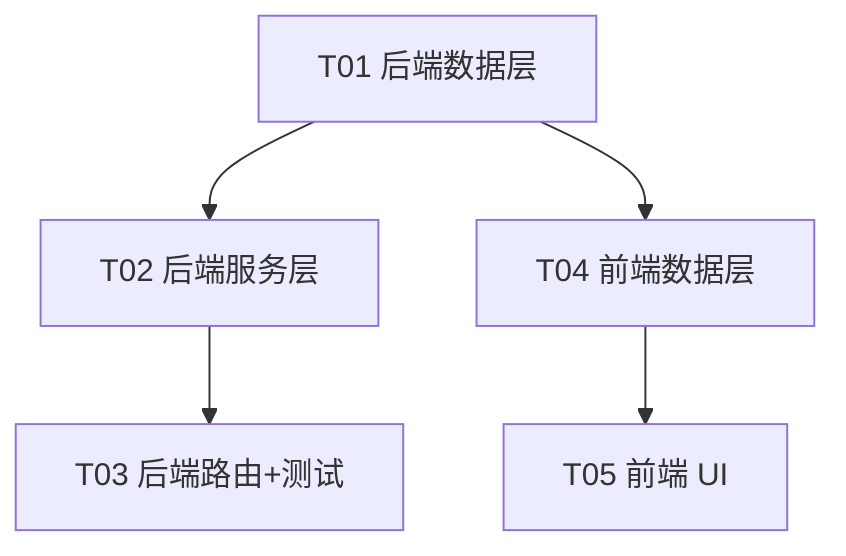

# 投资回报追踪器 · 系统管理扩展技术设计

> 范围：在现有「多提供方证券行情数据提供方管理」之上，新增
> **① 提供方下的接口 CRUD** 与 **② 接口分类后台管理** 两大特性。
> 冻结决策来源：`docs/prd-system-management.md` §6.1（评审 2026-08-12）。
> 当前 git HEAD = `4a692cc`（已落地提供方管理，但**尚无**接口 CRUD 与分类管理）。

---

## 1. 实现方案 + 框架选型

### 1.1 技术栈与复用结论
- **不引入任何新框架 / 新依赖**（见 §7）。完全复用现有栈：
  - 后端：FastAPI + SQLAlchemy 2.0 `async` + asyncpg + Alembic + pydantic v2 + PyJWT + bcrypt。
  - 前端：Vite + React + TS + TanStack Query + shadcn/ui + lucide-react + sonner（均已在 `web` 内）。
  - 信封契约 `{code,data,message}` + `EnvelopeRoute` + 金额/枚举序列化（沿用，不动）。
  - RBAC `require_admin` + 开发/测试双库隔离（沿用，不动）。
- **PG 原生枚举** 仅用于 `direction`（`interface_direction`）；`interface_type` 仍按字符串存储（允许自由文本 key）。

### 1.2 关键难点与对策
| 难点 | 对策 |
|---|---|
| 接口与提供方一对多、删除提供方需连带接口 | `provider_id` 外键 `ON DELETE CASCADE`，DB 级联（无需服务层额外处理，复用现有 provider 删除端点）|
| 分类后台可配且前端下拉从表读取 | 新增 `interface_categories` 表 + 分类 CRUD 端点；证券板块下拉读该表 + 「自定义」自由文本 |
| SDK 接口无 HTTP 概念 | 统一 `endpoint`/`http_method` 字段，SDK 时 `endpoint` 理解为「函数/方法名」、`http_method` 可空 |
| 分类删除后接口悬空 | `interface_type` 只存字符串、不强制外键；分类删除不影响接口，UI 无匹配分类时直接显示 raw key |

### 1.3 架构模式
- 沿用现有分层：`models` → `services` → `modules/admin/router`（内联 pydantic schema + `EnvelopeRoute` + `require_admin` + 信封）。
- 前端沿用：`api/*.api.ts`（纯函数 + `http` 信封解包）→ `hooks/use-*.ts`（TanStack Query）→ `pages/admin.tsx`（外壳 + 板块组件）。

---

## 2. 文件列表（相对路径，标注 [新]/[改]）

### 后端
| 文件 | 操作 | 说明 |
|---|---|---|
| `backend/app/models/enums.py` | [改] | 新增 `InterfaceDirection` 枚举 |
| `backend/app/models/quote_interface.py` | [新] | `QuoteInterface` 模型（`quote_provider_interfaces`）|
| `backend/app/models/interface_category.py` | [新] | `InterfaceCategory` 模型（`quote_provider_interface_categories`）|
| `backend/app/models/__init__.py` | [改] | 注册两个新模型 + `InterfaceDirection` 到 `__all__` |
| `backend/alembic/versions/c2d3e4f5a6b7_add_quote_interfaces_and_categories.py` | [新] | 建 PG 枚举 + 两表 + 可选种子数据 |
| `backend/app/services/quote_interface.py` | [新] | `QuoteInterfaceService`（list_by_provider/get/create/update/delete）|
| `backend/app/services/interface_category.py` | [新] | `InterfaceCategoryService`（list/get/create/update/delete）|
| `backend/app/services/__init__.py` | [改] | 导出两个新服务类 |
| `backend/app/modules/admin/router.py` | [改] | 新增接口 CRUD + 分类 CRUD 端点及内联 schema |
| `backend/tests/test_quote_interface.py` | [新] | 接口 CRUD 集成测试（require_admin + 信封 + 级联）|
| `backend/tests/test_interface_category.py` | [新] | 分类 CRUD 集成测试（require_admin + 信封 + key 唯一）|

### 前端
| 文件 | 操作 | 说明 |
|---|---|---|
| `web/src/api/quote-interface.api.ts` | [新] | 接口类型 + API 函数 |
| `web/src/api/interface-category.api.ts` | [新] | 分类类型 + API 函数 |
| `web/src/hooks/use-quote-interface.ts` | [新] | `useQuoteInterfaces` / 增改删 hooks |
| `web/src/hooks/use-interface-category.ts` | [新] | `useInterfaceCategories` / 增改删 hooks |
| `web/src/pages/admin.tsx` | [改] | 重构为**通用外壳** + `ADMIN_SECTIONS` 注册表（左栏模块列表）|
| `web/src/features/admin/quote-provider-section.tsx` | [新] | 萃取现有证券行情板块 + 按接入方式分组 + 接口子表 |
| `web/src/features/admin/interface-category-section.tsx` | [新] | 分类管理（列表 + 增改删）|
| `web/src/features/admin/quote-interface-dialog.tsx` | [新] | 接口新增/编辑对话框 |
| `web/src/features/admin/interface-category-dialog.tsx` | [新] | 分类新增/编辑对话框 |

---

## 3. 数据模型

### 3.1 `InterfaceDirection`（PG 原生枚举）
```python
class InterfaceDirection(str, enum.Enum):
    IN = "in"
    OUT = "out"
```
PG 枚举类型名：`interface_direction`。

### 3.2 `QuoteInterface`（`quote_provider_interfaces` 表）
| 列 | 类型 | 可空 | 默认 | 说明 |
|---|---|---|---|---|
| `id` | String(36) PK | 否 | `gen_random_uuid()` | `pk_uuid()` |
| `provider_id` | String(36) FK | 否 | — | → `securities_data_providers.id`，`ON DELETE CASCADE` |
| `interface_type` | String(64) | 否 | — | 分类 key（自由文本，如 `ashare_list`）|
| `name` | String(255) | 否 | — | 接口展示名 |
| `endpoint` | String(512) | 是 | — | 调用路径；SDK 时为「函数/方法名」|
| `http_method` | String(10) | 是 | — | `GET/POST/PUT/DELETE/PATCH`（大写）|
| `params` | JSON | 是 | `{}` | 请求参数模板 |
| `enabled` | Boolean | 否 | `True` | 是否启用 |
| `description` | Text | 是 | — | 备注 |
| `direction` | `interface_direction` | 否 | `'in'` | 枚举 in/out |
| `timeout` | Integer | 是 | — | 超时（秒）|
| `retry_count` | Integer | 是 | — | 重试次数 |
| `rate_limit` | String(64) | 是 | — | 频率限制（如 `100/min`）|
| `created_at` | DateTime(tz) | 否 | `now()` | `TimestampMixin` |
| `updated_at` | DateTime(tz) | 否 | `now()` | `TimestampMixin` |

> 模型定义（节选）：
> ```python
> class QuoteInterface(Base, TimestampMixin):
>     __tablename__ = "quote_provider_interfaces"
>     id: Mapped[str] = pk_uuid()
>     provider_id: Mapped[str] = mapped_column(
>         String(36), ForeignKey("securities_data_providers.id", ondelete="CASCADE"),
>         nullable=False, index=True,
>     )
>     interface_type: Mapped[str] = mapped_column(String(64), nullable=False)
>     name: Mapped[str] = mapped_column(String(255), nullable=False)
>     endpoint: Mapped[Optional[str]] = mapped_column(String(512), nullable=True)
>     http_method: Mapped[Optional[str]] = mapped_column(String(10), nullable=True)
>     params: Mapped[Optional[dict]] = mapped_column(JSON, nullable=True, default=dict)
>     enabled: Mapped[bool] = mapped_column(Boolean, nullable=False, default=True)
>     description: Mapped[Optional[str]] = mapped_column(Text, nullable=True)
>     direction: Mapped[str] = mapped_column(
>         SA_ENUM(InterfaceDirection, name="interface_direction",
>                 values_callable=lambda e: [m.value for m in e]),
>         nullable=False, default=InterfaceDirection.IN.value,
>         server_default=InterfaceDirection.IN.value,
>     )
>     timeout: Mapped[Optional[int]] = mapped_column(Integer, nullable=True)
>     retry_count: Mapped[Optional[int]] = mapped_column(Integer, nullable=True)
>     rate_limit: Mapped[Optional[str]] = mapped_column(String(64), nullable=True)
> ```

### 3.3 `InterfaceCategory`（`quote_provider_interface_categories` 表）
| 列 | 类型 | 可空 | 默认 | 说明 |
|---|---|---|---|---|
| `id` | String(36) PK | 否 | `gen_random_uuid()` | `pk_uuid()` |
| `key` | String(64) | 否 | — | 分类唯一 key（UNIQUE）|
| `label` | String(128) | 否 | — | 展示名 |
| `icon` | String(64) | 是 | — | lucide-react 图标名（如 `List`、`LineChart`）|
| `sort_order` | Integer | 否 | `0` | 排序 |
| `created_at` | DateTime(tz) | 否 | `now()` | `TimestampMixin` |
| `updated_at` | DateTime(tz) | 否 | `now()` | `TimestampMixin` |

> 模型定义（节选）：
> ```python
> class InterfaceCategory(Base, TimestampMixin):
>     __tablename__ = "quote_provider_interface_categories"
>     id: Mapped[str] = pk_uuid()
>     key: Mapped[str] = mapped_column(String(64), nullable=False, unique=True)
>     label: Mapped[str] = mapped_column(String(128), nullable=False)
>     icon: Mapped[Optional[str]] = mapped_column(String(64), nullable=True)
>     sort_order: Mapped[int] = mapped_column(Integer, nullable=False, default=0)
> ```

### 3.4 类图（Mermaid）
见 [`docs/class-diagram.mermaid`](./class-diagram.mermaid)，核心关系：
- `QuoteInterface` n→1 `SecuritiesDataProvider`（`provider_id` FK，级联删除）
- `QuoteInterfaceService` / `InterfaceCategoryService` 分别管理对应模型

### 3.5 迁移要点（Alembic）
- 新版本 `d3e4f5a6b7c8_add_quote_interfaces_and_categories.py`，`down_revision = 'c2d3e4f5a6b7'`（接在当前迁移链头 `c2d3e4f5a6b7_add_quote_providers_drop_system_configs.py` 之后；**当前链头是 `c2d3e4f5a6b7`，绝非 `b1c2d3e4f5a6`**）。**严禁删除/改动现有 `c2d3e4f5a6b7_*` 迁移文件**——它创建 `securities_data_providers` 表，删了会断链。
- `upgrade()`：`sa.Enum('in','out', name='interface_direction')` 创建原生枚举 → 建两表（含外键 + 唯一约束）→ 可选 `INSERT` 7 个预置分类（见 §8 约定）。
- `downgrade()`：按**反序** drop 两表 → drop 枚举类型 `interface_direction`。
- 写法完全参照 `b1c2d3e4f5a6_add_role_and_system_configs.py`（PK 用 `gen_random_uuid()` server_default、`created_at/updated_at` 用 `now()` server_default）。

---

## 4. API 端点清单

> 全部前缀 `/api/admin`，全部 `Depends(require_admin)`，全部经 `EnvelopeRoute` 信封。
> 错误归一：404→`NOT_FOUND(3001)`、400→`VALIDATION_FAILED(2000)`、403→`FORBIDDEN(4001)`。

### 4.1 接口 CRUD（`QuoteInterface`）
| 方法 | 路径 | 说明 | 请求 | 响应 `data` |
|---|---|---|---|---|
| GET | `/api/admin/quote-providers/{provider_id}/interfaces` | 列出某提供方全部接口（按 `interface_type` + `name` 排序）| — | `QuoteInterfaceOut[]` |
| POST | `/api/admin/quote-providers/{provider_id}/interfaces` | 新增接口 | `QuoteInterfaceCreate` | `QuoteInterfaceOut` |
| GET | `/api/admin/quote-providers/interfaces/{interface_id}` | 读取单个 | — | `QuoteInterfaceOut` |
| PATCH | `/api/admin/quote-providers/interfaces/{interface_id}` | 局部更新 | `QuoteInterfaceUpdate` | `QuoteInterfaceOut` |
| DELETE | `/api/admin/quote-providers/interfaces/{interface_id}` | 删除 | — | `{id, deleted:true}` |

**`QuoteInterfaceCreate`**（provider_id 取自路径）
```jsonc
{
  "interface_type": "ashare_list",        // 必填，自由文本 key
  "name": "沪深股票列表",                  // 必填
  "endpoint": "/api/ashare/list",          // 可空
  "http_method": "GET",                    // 可空，枚举 GET/POST/PUT/DELETE/PATCH
  "params": {"code": "string"},            // 可空 JSON
  "enabled": true,                         // 默认 true
  "description": null,                     // 可空
  "direction": "in",                       // 默认 in
  "timeout": 30,                           // 可空，秒
  "retry_count": 2,                        // 可空
  "rate_limit": "100/min"                  // 可空
}
```
**`QuoteInterfaceUpdate`**：以上全部字段可选（含 `provider_id` 不允许改）。
**`QuoteInterfaceOut`**：同 Create 字段 + `id` + `provider_id` + `created_at` + `updated_at`。

### 4.2 分类 CRUD（`InterfaceCategory`）
| 方法 | 路径 | 说明 | 请求 | 响应 `data` |
|---|---|---|---|---|
| GET | `/api/admin/interface-categories` | 列出全部分类（按 `sort_order` 升序）| — | `InterfaceCategoryOut[]` |
| POST | `/api/admin/interface-categories` | 新增分类 | `InterfaceCategoryCreate` | `InterfaceCategoryOut` |
| PATCH | `/api/admin/interface-categories/{id}` | 更新分类 | `InterfaceCategoryUpdate` | `InterfaceCategoryOut` |
| DELETE | `/api/admin/interface-categories/{id}` | 删除分类 | — | `{id, deleted:true}` |

**`InterfaceCategoryCreate`**
```jsonc
{ "key": "ashare_list", "label": "A股列表", "icon": "List", "sort_order": 0 }
```
**`InterfaceCategoryUpdate`**：`key`/`label`/`icon`/`sort_order` 全部可选。
**`InterfaceCategoryOut`**：同上 + `id` + `created_at` + `updated_at`。

### 4.3 校验与错误
- `provider_id` 对应提供方不存在 → `404 / NOT_FOUND(3001)`（`HTTPException(404)`）。
- `interface_id` / `id` 不存在 → `404 / NOT_FOUND(3001)`。
- `http_method` 非法值 → pydantic `422` → 归一 `400 / VALIDATION_FAILED(2000)`（用 `Literal["GET","POST","PUT","DELETE","PATCH"]` 或 `model_validator`）。
- `params` 非法（非 JSON 对象）→ `400 / VALIDATION_FAILED(2000)`（pydantic JSON 校验）。
- 分类 `key` 重复 → `409 + VALIDATION_FAILED(2000)`（`BusinessException(VALIDATION_FAILED, "接口分类 key 已存在", status_code=409)`，复用 2000，不新增业务码）。
- 非管理员 → `403 / FORBIDDEN(4001)`（`require_admin` 抛）。

---

## 5. 前端组件树

```
pages/admin.tsx  （通用外壳：左栏 ADMIN_SECTIONS 注册表 + 右栏选中板块）
├─ ADMIN_SECTIONS = [
│    { key:'quote-provider',    label:'证券行情设置', icon:<ServerCog/>, component:<QuoteProviderSection/> },
│    { key:'interface-category', label:'接口分类管理', icon:<Tags/>,       component:<InterfaceCategorySection/> },
│  ]
│
├─ features/admin/quote-provider-section.tsx   （萃取现有 admin.tsx 的提供方管理）
│   ├─ 提供方按接入方式分组：HTTPS 提供方 / SDK 提供方
│   ├─ 每组：提供方行（编辑 / 默认 / 当前 / 删除，沿用现有 hooks）
│   └─ 每个提供方展开区：
│        ├─ 接口子表（按 interface_type 分组，复用 useQuoteInterfaces(providerId)）
│        │   列：分类 | 名称 | endpoint | http_method | enabled | 操作(编辑/删除)
│        ├─ [+ 新增接口] → QuoteInterfaceDialog
│        └─ 行内 编辑 → QuoteInterfaceDialog（回填）/ 删除 → AlertDialog 确认
│
├─ features/admin/quote-interface-dialog.tsx   （接口新增/编辑对话框）
│   字段：interface_type(Select 读分类 + 自定义) / name / endpoint / http_method /
│         params(JSON textarea) / enabled / description / direction / timeout / retry_count / rate_limit
│
└─ features/admin/interface-category-section.tsx  （分类管理）
    ├─ 分类列表表格：label | key | icon | sort_order | 操作(编辑/删除)
    ├─ [+ 新增分类] → InterfaceCategoryDialog
    └─ 行内 编辑 → InterfaceCategoryDialog / 删除 → AlertDialog 确认
        （删除分类不删除接口；接口仍显示 raw key）
```

> 说明：`admin.tsx` 当前（HEAD `4a692cc`）**仅含证券行情提供方管理，没有通用外壳**。
> 本设计把现有内容萃取为 `QuoteProviderSection`，并在 `admin.tsx` 加 `ADMIN_SECTIONS`
> 注册表（满足 PRD P0-1/P0-2）。新增板块只需追加一条注册项，不改外壳。
> 非管理员：整页「无权限访问」且左栏不渲染（沿用 `useIsAdmin` + `enabled:isAdmin`）。

---

## 6. 任务列表（有序、含依赖、按模块分组）

> 受「≤5 个任务 / 每任务 ≥3 文件 / 按层分组」约束，将 8 步流程合并为 5 个任务。
> 后端数据层为根；前端 UI 依赖前端数据层；后端测试并入路由任务。

| 任务 | 名称 | 来源文件（≥3）| 依赖 | 优先级 |
|---|---|---|---|---|
| **T01** | 后端数据层（枚举 + 模型 + 迁移 + 注册）| `models/enums.py`[改]、`models/quote_interface.py`[新]、`models/interface_category.py`[新]、`models/__init__.py`[改]、`alembic/versions/d3e4f5a6b7c8_add_quote_interfaces_and_categories.py`[新] | 无 | P0 |
| **T02** | 后端服务层（接口 + 分类服务）| `services/quote_interface.py`[新]、`services/interface_category.py`[新]、`services/__init__.py`[改] | T01 | P0 |
| **T03** | 后端路由 + 后端测试（接口/分类 CRUD 端点 + 集成测试）| `modules/admin/router.py`[改]、`tests/test_quote_interface.py`[新]、`tests/test_interface_category.py`[新] | T02 | P0 |
| **T04** | 前端数据层（API 类型/函数 + hooks）| `api/quote-interface.api.ts`[新]、`api/interface-category.api.ts`[新]、`hooks/use-quote-interface.ts`[新]、`hooks/use-interface-category.ts`[新] | T01（仅契约/字段名）| P0 |
| **T05** | 前端 UI（通用外壳 + 证券板块 + 接口对话框 + 分类管理）| `pages/admin.tsx`[改]、`features/admin/quote-provider-section.tsx`[新]、`features/admin/interface-category-section.tsx`[新]、`features/admin/quote-interface-dialog.tsx`[新]、`features/admin/interface-category-dialog.tsx`[新] | T04 | P0 |

### 6.1 依赖图（Mermaid）


### 6.2 实现顺序建议
1. T01：建表 + 枚举 + 迁移（跑 `alembic upgrade head` 验证）。
2. T02：两个 Service（纯逻辑，可单测）。
3. T03：在 `router.py` 追加端点（内联 schema 照 `QuoteProviderCreate/Out` 风格）+ 集成测试（`pytest` 跑通）。
4. T04：前端 api/hooks（不依赖后端运行，仅契约）。
5. T05：重构 `admin.tsx` 外壳 + 两个板块 + 两个对话框；本地 `pnpm test` + `tsc --noEmit`（vitest 沙箱内 EPERM，本机跑）。

---

## 7. 依赖包列表

**本特性不引入任何新依赖。**
- 后端：沿用 FastAPI / SQLAlchemy 2.0 async / asyncpg / Alembic / pydantic v2 / PyJWT / bcrypt（无新增）。
- 前端：沿用 React / TanStack Query / shadcn-ui / lucide-react / sonner（图标复用 lucide-react，无需新包）。
- 分类图标字段存 lucide 图标名字符串，UI 用 `lucide-react` 动态映射渲染，不引入图标库。

---

## 8. 共享知识（跨文件约定）

1. **`http_method` 校验集合**：`{"GET","POST","PUT","DELETE","PATCH"}`，pydantic `Literal` 或 `model_validator` 校验，存储为大写；可空（SDK 接口可留空）。
2. **`direction` 默认**：`"in"`；PG 原生枚举 `interface_direction`，模型 `default` + `server_default` 均设 `'in'`。
3. **级联删除**：`quote_provider_interfaces.provider_id` FK `ON DELETE CASCADE`；删除提供方时接口自动随之删除（复用现有 `DELETE /api/admin/quote-providers/{id}`，无需改服务层）。
4. **信封错误码映射**（沿用 `app/core/exceptions.py`）：
   - `HTTPException(404)` → `{code:3001, message}`（`NOT_FOUND`）
   - 参数/pydantic 校验 → `{code:2000, message}`（`VALIDATION_FAILED`，HTTP 400/422）
   - `require_admin` 拒绝 → `{code:4001, message}`（`FORBIDDEN`，HTTP 403）
   - 分类 `key` 唯一冲突 → `BusinessException(VALIDATION_FAILED, "接口分类 key 已存在", status_code=409)`（复用 2000，**不新增业务码**）
5. **`interface_type` 自由文本**：存字符串、**不**强制外键到 `interface_categories`；分类删除不影响接口，UI 无匹配分类时直接显示 raw key。
6. **`params` JSON**：可空，保存时校验为可解析 JSON 对象（P1-2 的完整模板校验本期不强制，先做基础解析校验）。
7. **分类种子数据**：迁移 `upgrade()` 末尾 `INSERT` 7 个预置分类（见 PRD §5），`sort_order` 顺序与 key：
   `ashare_list/A股列表`、`ashare_quote/A股行情`、`hk_list/港股列表`、`hk_quote/港股行情`、
   `fund_list/基金列表`、`convertible_list/可转债列表`、`convertible_quote/可转债行情`；
   `icon` 给合理 lucide 名（如 `List`/`LineChart` 等）；`downgrade()` 一并清除。
8. **服务层风格**：与 `QuoteProviderService` 一致——`list/get/create/update/delete` 签名，`create/update` 用关键字参 + `Optional` 局部更新，`delete` 后 `flush`；接口服务额外提供 `list_by_provider(provider_id)`。
9. **前端 hooks 风格**：与 `use-quote-provider.ts` 一致——`useQuery`（非管理员 `enabled:isAdmin`）、`useMutation` + `invalidateQueries` + `toast`；接口列表 query key：`['admin','quote-providers', providerId, 'interfaces']`，分类：`['admin','interface-categories']`。
10. **路由风格**：新端点全部加在 `backend/app/modules/admin/router.py`（已 `include_router` 至 `app`，无需改 `main.py`/`modules/admin/__init__.py`），内联 pydantic schema，沿用 `EnvelopeRoute` + `require_admin`。

---

## 9. 待明确事项（需主理人/用户拍板）

1. **分类种子数据写入方式**：§8.7 建议迁移内 `INSERT` 7 个预置分类。若希望「迁移只建表、预设分类由管理员在 UI 手动添加」，请告知——将改为空表起步。
2. **分类删除语义**：本设计允许直接删除分类（接口保留 raw key）。是否需要在删除分类时**阻断**（若该 key 仍被接口引用则返回 409）？当前默认「允许删除」，如需阻断请确认。
3. **`direction` 是否在前端暴露**：§6.1 #4 为「预留」字段。本设计默认 UI 不展示（恒为 `in`），仅后端落库。若希望现在就可在 UI 选择 in/out，请确认。
4. **`rate_limit` 存储格式**：建议存自由文本（如 `"100/min"`、`"10/s"`），不做结构化解析。若需结构化（次数+单位两列），请确认。
5. **接口列表分组 UI**：本设计在「提供方展开区」按 `interface_type` 分组展示接口，并新增顶层「按分类汇总所有提供方接口」总览。
   **【已决议：顶层按分类汇总所有提供方，是】**（2026-08-12）——新增后端端点 `GET /api/admin/quote-providers/interfaces`（扁平返回该管理员可见的全部接口，复用 `require_admin`+`EnvelopeRoute`+信封），`QuoteInterfaceService` 加 `list_all()` 方法 + 1 条集成测试；前端据此按 `interface_type`（映射分类 label，无匹配显示 raw key）聚合渲染。该路径与现有 `GET /api/admin/quote-providers/{provider_id}/interfaces` 不冲突（段数不同）。

---

## 附录：时序图（见 `docs/sequence-diagram.mermaid`）
- 场景 A：列出某提供方接口 + 新增接口（前端 → hooks → api → 信封 → AdminRouter → Service → PG）
- 场景 B：分类管理 list / create（同上链路）
