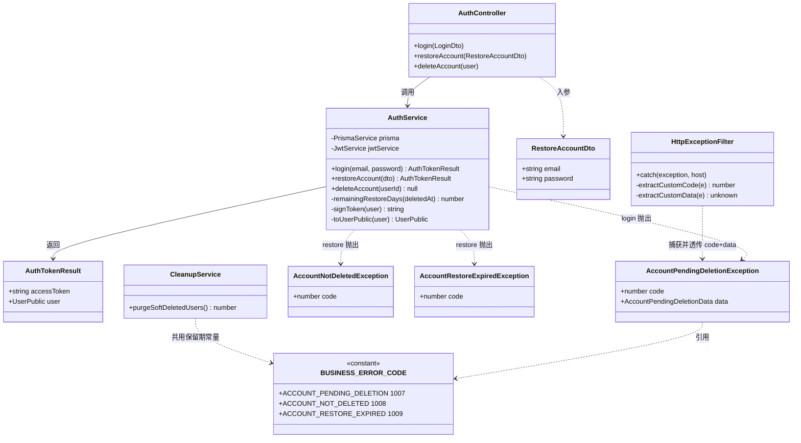
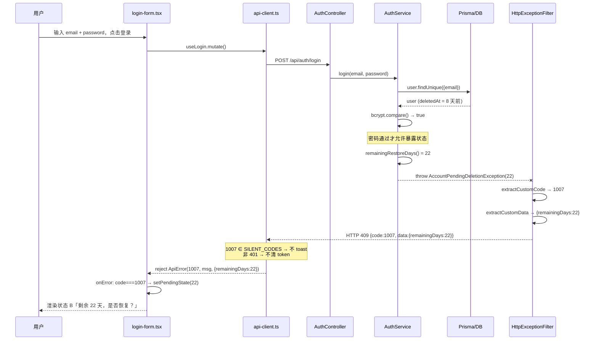
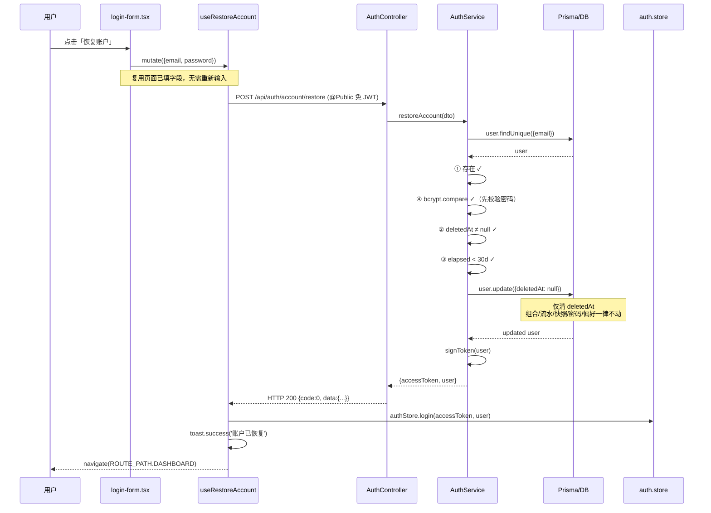
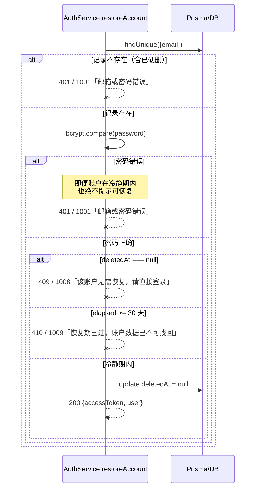
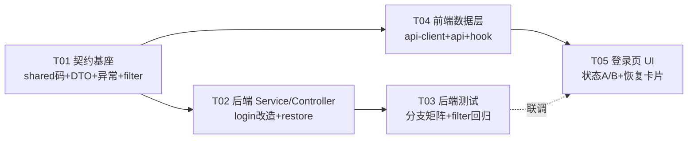

# SYS-P1-02 注销账户自助恢复 — 技术设计与任务分解

> **范围**：`SYS-P1-02`（配套 `SET-P1-06`）—— 登录页冷静期信号 + `POST /api/auth/account/restore` 自助恢复
> **PRD 权威**：`docs/PRD.md` §6.10.1（L942-985）、`SET-P1-06`（L889）、§7.10（L1429-1470）
> **架构同步**：本文契约须回写 `docs/ARCHITECTURE.md` §4.2.1（L657-664），该处为对外权威
> **架构师**：高见远　|　**状态**：待主理人拍板 §9 三项后进入实现

---

## 0. 前置勘察结论（三个决定方案形状的发现）

> 以下均为**实读代码**得出，直接推翻了任务书中的两处初始假设，请务必先看这一节。

| # | 发现 | 证据（文件:行） | 对设计的影响 |
|---|---|---|---|
| **F1** | **业务码 `1006` 已被 `FILE_INVALID` 占用** | `packages/shared/src/types/api.ts` **L90-91**；注释 L13 亦写明「1006 文件校验失败」 | ❌ 任务书建议的 `1006 ACCOUNT_PENDING_DELETION` **不可用**。改用 **1007 / 1008 / 1009**（`1005` 虽标注「预留」，但为避免与历史预留语义冲突，跳过不用） |
| **F2** | filter **尊重**自定义 `code`，但 **`data` 被硬编码为 `null`** | `http-exception.filter.ts` **L124-128**（`customCode ?? businessCodeByStatus`）vs **L30-34 / L130-134**（`data: null` 写死） | ✅ `code=1007` 可透传；❌ `data.remainingDays` **无法**透传。**必须**改 filter（约 8 行，见 §3.3） |
| **F3** | 前端 `ApiError` **不携带 data**，且 **HTTP 401 会被拦截器劫持** | `api-client.ts` **L23-30**（`ApiError` 只有 code/message）、**L33** `UNAUTH_CODES=[1001,1002]`、**L120** `if (status === 401 \|\| ...)` → 清 token + toast「登录已失效」 | ⚠️ 冷静期信号**绝不能用 HTTP 401**，否则被 L120 抢先处理；且 `ApiError` 必须扩展 `data` 字段，否则 `remainingDays` 到不了 UI |

**F2 的备选方案已排除**：曾考虑「service 直接返回信封 + HTTP 200」绕过 filter。
`main.ts` **L40** 注册的是 `ResponseInterceptor`（`response.interceptor.ts` **L32-36**），它**无条件**覆写 `code: 0`，不做信封透传检测。
（`transform.interceptor.ts` 有 `isEnvelope()` 透传逻辑，但**未被注册，是死代码**。）
→ **结论：走「自定义异常 + filter 支持 data 透传」是唯一最小改动路径。**

---

## 1. 实现方案与框架选型

### 1.1 选型：零新增框架

| 层 | 现有技术 | 本需求是否新增 |
|---|---|---|
| 后端 | NestJS + Prisma + `@nestjs/jwt` + bcrypt | ❌ 无 |
| 前端 | Vite + React + TanStack Query + Zustand + RHF/Zod + shadcn/ui + sonner | ❌ 无 |
| 共享 | `@investment-tracker/shared` | ❌ 无 |
| 限流 | **无**（见 §9.1 缺口） | ⚠️ 建议新增 `@nestjs/throttler`，但**列为需拍板项**，非本次强制 |

### 1.2 核心技术难点与对策

| 难点 | 对策 |
|---|---|
| **枚举防护 vs 信息返回的矛盾**：既要对合法用户吐露「冷静期 + 剩余天数」，又不能对攻击者泄露账户存在性 | **以「密码校验通过」作为唯一闸门**。密码不通过的一切路径（含账户确在冷静期）统一走 1001 通用文案。密码通过 ⇒ 请求方本就是账户所有者，告知冷静期不构成泄露 |
| **异常信封无法带业务数据** | 扩展 filter 的 `data` 透传（F2），保持 `{code,data,message}` 契约不变 |
| **HTTP 401 被前端拦截器劫持**（F3） | 冷静期信号改用 **HTTP 409**；恢复过期用 **410**；账户未注销用 **409**。三者均携带自定义 code，绕开 401 分支 |
| **30 天窗口双处判定易漂移** | 把 `SOFT_DELETE_RETENTION_*` 上提到 `shared`，`cleanup.service.ts`（现 L21 私有常量）与 `auth.service.ts` 共用同一真相源 |
| **按期判定 ≠ 按跑批判定** | login/restore 均**独立计算** `now - deletedAt`，不依赖 CleanupService 是否已执行（PRD §6.10.1 ① 边界口径） |
| **恢复不得成为登录后门** | `deletedAt === null` 时 restore 必须失败（1008），与 PRD §6.10.1 ③ 第 3 行一致 |

### 1.3 架构模式

沿用现有 **Controller → Service → Prisma** 三层；异常经**全局 filter** 归一为信封；前端 **api → hook → feature 组件** 三层。

---

## 2. 文件清单

### 2.1 新建（5）

| 相对路径 | 说明 |
|---|---|
| `packages/backend/src/modules/auth/dto/restore-account.dto.ts` | restore 入参 DTO（照 `login.dto.ts` 写法） |
| `packages/backend/src/modules/auth/exceptions/account-pending-deletion.exception.ts` | 1007 冷静期信号异常（携带 `data.remainingDays`） |
| `packages/backend/src/modules/auth/exceptions/account-restore.exception.ts` | 1008 未注销 / 1009 恢复期已过 两个异常 |
| `packages/web/src/features/auth/account-restore-prompt.tsx` | 登录页状态 B 卡片（PRD §7.10） |
| `packages/backend/src/common/filters/http-exception.filter.spec.ts` | filter `data` 透传回归测试（现无此 spec） |

> 目录 `modules/auth/exceptions/` 为新建；已有先例 `modules/upload/filters/file-upload-exception.filter.ts`，风格一致。

### 2.2 修改（11）

| 相对路径 | 改动要点 | 关键行 |
|---|---|---|
| `packages/shared/src/types/api.ts` | 新增 1007/1008/1009 + 保留期常量 + `AccountPendingDeletionData` 类型；补注释块 | L8-17 注释、L79-98 常量 |
| `packages/backend/src/common/filters/http-exception.filter.ts` | `data` 透传（`ErrorResponseBody.data` 放宽 + `extractCustomData()`） | L30-34、L46-56、L130-134 |
| `packages/backend/src/modules/auth/auth.service.ts` | `login()` 冷静期分支 + 新增 `restoreAccount()` + 私有 `remainingRestoreDays()` | L139-155、L272-279 |
| `packages/backend/src/modules/auth/auth.controller.ts` | 新增 `POST account/restore`（`@Public`） | L44-49 参照、L90-100 |
| `packages/backend/src/modules/auth/cleanup.service.ts` | 私有常量改引用 shared（去重） | L21 |
| `packages/backend/src/modules/auth/auth.service.spec.ts` | 补冷静期 + restore 分支矩阵用例 | 全文件 |
| `packages/web/src/lib/api-client.ts` | `ApiError` 增 `data`；静默码跳过 toast；两处 reject 带上 data | L23-30、L33、L102-113、L117-132 |
| `packages/web/src/api/types.ts` | `RestoreAccountRequest` / `RestoreAccountResponse` / `AccountPendingDeletionData` | L236-253 |
| `packages/web/src/api/auth.api.ts` | `restoreAccount()` | L63-65 参照 |
| `packages/web/src/hooks/use-account.ts` | `useRestoreAccount()` | L98-111 参照 |
| `packages/web/src/features/auth/login-form.tsx` | 状态 A/B 切换（**真正的登录 UI 在此**） | L26-99 |

> ⚠️ **`packages/web/src/pages/login.tsx` 只有 13 行、是纯壳**（仅渲染 `<LoginForm/>`），**不要改它**。

### 2.3 文档同步（1）

| 路径 | 改动 |
|---|---|
| `docs/ARCHITECTURE.md` §4.2.1（L657-664） | 补 restore 行 + 冷静期业务码说明（PRD §6.10.1 声明此处为技术契约权威） |

---

## 3. 数据结构与接口

### 3.1 业务码表（`shared/types/api.ts` 唯一真相源）

**现状占用**：`0, 1001, 1002, 1003, 1004, 1006(FILE_INVALID), 2000, 3001, 5000`；`1005` 注释标注「预留」。

| 常量名 | 取值 | HTTP | 语义 | 对外文案 |
|---|---|---|---|---|
| `ACCOUNT_PENDING_DELETION` | **1007** | **409** | 账户处于注销冷静期（登录信号） | `该账户处于注销冷静期` |
| `ACCOUNT_NOT_DELETED` | **1008** | **409** | 账户未注销，restore 无意义 | `该账户无需恢复，请直接登录` |
| `ACCOUNT_RESTORE_EXPIRED` | **1009** | **410** | 软删已满 30 天，不可恢复 | `恢复期已过，账户数据已不可找回` |

**HTTP 状态码选型理由**：
- **不用 401**：`api-client.ts` **L120** 对任何 401 一律清 token + toast「登录已失效」，会污染登录页（F3）。
- **409 Conflict**：请求与资源当前状态冲突 —— 语义贴合「账户状态不允许该操作」。默认映射 1003，但自定义 code 优先（filter L124-128），安全。
- **410 Gone**：资源曾存在、现已不可用 —— 贴合「恢复期已过」。默认映射走 `default: return status`（filter L74），同样被自定义 code 覆盖。

**新增共享常量**：

| 常量 | 值 | 用途 |
|---|---|---|
| `SOFT_DELETE_RETENTION_DAYS` | `30` | 冷静期天数（前端文案、后端判定） |
| `SOFT_DELETE_RETENTION_MS` | `30*24*60*60*1000` | 后端时间差判定；`cleanup.service.ts` L21 改为引用此常量 |

### 3.2 DTO Schema

**`RestoreAccountDto`**（新建，字段与 `LoginDto` 完全一致 —— 刻意同构，便于前端复用已填表单）

| 字段 | 类型 | 校验装饰器 | 说明 |
|---|---|---|---|
| `email` | `string` | `@IsEmail()` `@MaxLength(255)` | 必填 |
| `password` | `string` | `@IsString()` `@IsNotEmpty()` `@MaxLength(100)` | 必填，明文经 HTTPS，后端 bcrypt 比对 |

> ⚠️ **不得**套用 `register.dto.ts` 的 `@Matches(PASSWORD_PATTERN)` 强度校验。历史账户密码可能不满足现行策略，restore 是**比对**而非**设置**密码，加强度校验会误伤存量用户（`login.dto.ts` L14-18 亦是此考量）。
> ⚠️ 全局 `ValidationPipe` 开启了 `forbidNonWhitelisted`（`main.ts` L31），多传字段会 400，前端只传 email/password。

**响应（成功）**：复用 `AuthTokenResult`（`auth.service.ts` L49-52）

```
{ code: 0, data: { accessToken: string, user: UserPublic }, message: 'ok' }
```

> 与登录接口**完全同构**，前端可直接复用 `authStore.login(accessToken, user)`。
> 注意字段名是 **`accessToken`** 而非 PRD 泛称的 `token`（对齐现有 `AuthTokenResult` 与 `api/types.ts` L248-251）。

**冷静期信号响应**：

```
HTTP 409
{ code: 1007, data: { remainingDays: 23 }, message: '该账户处于注销冷静期' }
```

### 3.3 `http-exception.filter.ts` 最小改动（F2）

| 位置 | 现状 | 改为 |
|---|---|---|
| L30-34 `ErrorResponseBody` | `data: null` | `data: unknown`（或 `Record<string,unknown> \| null`） |
| L46-56 附近 | 只有 `extractCustomCode()` | 新增**同构**的 `extractCustomData()`：从 `exception.getResponse()` 取 `data` 字段，非 `undefined` 则返回，否则 `undefined` |
| L130-134 body 构造 | `data: null` 写死 | `data: customData ?? null` |

**改动量约 8 行，零破坏性**：所有现存异常均不带 `data` 字段 → `customData === undefined` → 回落 `null`，与今日行为**逐字节一致**。
必须由 `http-exception.filter.spec.ts` 锁定：①带 data 的异常能透传；②不带 data 的异常仍为 `null`。

### 3.4 错误分支映射表（PRD §6.10.1 ③ 全覆盖）

#### `POST /api/auth/account/restore`

| # | 场景 | 判定顺序 | HTTP | code | 文案 |
|---|---|---|---|---|---|
| 1 | 邮箱不存在 / 已硬删 | 查库为空 | 401 | 1001 | `邮箱或密码错误` |
| 2 | 密码错误（**含账户确在冷静期**） | bcrypt 失败 | 401 | 1001 | `邮箱或密码错误` |
| 3 | 账户未注销（`deletedAt=null`） | 密码通过后 | 409 | **1008** | `该账户无需恢复，请直接登录` |
| 4 | 软删已超 30 天（记录仍在） | 密码通过后 | 410 | **1009** | `恢复期已过，账户数据已不可找回` |
| 5 | 参数缺失/格式错 | ValidationPipe | 400 | 2000 | 校验器文案 |
| 6 | 限流触发 | Guard | 429 | *(见 §9.1)* | `尝试过于频繁，请稍后再试` |
| ✅ | 四条件全满足 | — | 200 | 0 | `{accessToken, user}` |

> **判定顺序是安全要求，不可调换**：**必先 bcrypt 校验密码**，密码不通过一律 1001；只有密码通过后才允许暴露 1008/1009 这类状态信息。
> 场景 1/2 必须**同一文案 + 同一 code + 同一 HTTP**，防账户枚举。

#### `POST /api/auth/login`（改造后）

| 场景 | 条件 | HTTP | code | 说明 |
|---|---|---|---|---|
| 正常登录 | `deletedAt=null` + 密码对 | 200 | 0 | 行为不变 |
| **冷静期信号** | `deletedAt≠null` **且** 密码对 **且** `now-deletedAt < 30d` | **409** | **1007** | `data.remainingDays` ∈ [1,30] |
| 软删 + 密码错 | — | 401 | 1001 | 通用文案（**不得**泄露冷静期） |
| 软删 + 超 30 天 | — | 401 | 1001 | 通用文案 |
| 邮箱不存在 | — | 401 | 1001 | 通用文案 |
| 密码错 | — | 401 | 1001 | 通用文案 |

> 现状 `auth.service.ts` **L142-144** 把「软删」与「不存在」合并判定并直接抛 401，**必须拆开**：先取用户 → 校验密码 → 再判 `deletedAt`。

### 3.5 剩余天数口径

```
remainingDays = ceil( (RETENTION_MS - (now - deletedAt)) / 86400000 )
```

| 约束 | 说明 |
|---|---|
| 取值域 | `1 ~ 30`（`elapsed` 趋近 0 时为 30；趋近 30 天时为 1） |
| `elapsed >= RETENTION_MS` | **不返回信号**，走通用 1001（login）/ 1009（restore），**与 CleanupService 是否跑批无关** |
| 前端 | **直接取后端值展示，禁止自行计算**（PRD §7.10 明确） |

> 等价写法：`ceil((deletedAt + RETENTION_MS - now)/86400000)`。工程师二选一，但须有边界用例：`elapsed=0` → 30；`elapsed=29.5d` → 1；`elapsed=30d` → 过期。

### 3.6 类图



---

## 4. 程序调用流程

### 4.1 登录命中冷静期信号



### 4.2 自助恢复成功



### 4.3 恢复失败分支（判定顺序）



---

## 5. 前端契约

### 5.1 `api-client.ts` 三处改动（无此改动 UI 拿不到 `remainingDays`）

| 改动 | 位置 | 内容 |
|---|---|---|
| ① `ApiError` 携带 data | L23-30 | 加 `data?: unknown` 字段与构造参数（**可选参数，全部现有 `new ApiError(a,b)` 调用点零影响**） |
| ② 静默码 | L33 附近 | 新增 `const SILENT_CODES = [BUSINESS_ERROR_CODE.ACCOUNT_PENDING_DELETION]`；L112 toast 前判断，命中则跳过 |
| ③ 两处 reject 带 data | L109/L113/L132 | `new ApiError(body.code, body.message, body.data)` |

> ② 是 PRD §7.10「**不显示**错误提示」的硬性要求 —— 否则右下角会弹出红色 toast，与状态 B 卡片并存，体验矛盾。
> 1008/1009 **不入静默名单**：它们由 toast 提示即可（也可在卡片内联展示，见 5.4）。

### 5.2 `auth.api.ts`

```
restoreAccount(payload: RestoreAccountRequest): Promise<RestoreAccountResponse>
  → http.post('/auth/account/restore', payload)
```

### 5.3 `useRestoreAccount()`（`hooks/use-account.ts`，参照 L98-111 `useDeleteAccount`）

| 项 | 行为 |
|---|---|
| `mutationFn` | `restoreAccountApi({email, password})` |
| `onSuccess` | `authStore.login(data.accessToken, data.user)` → `toast.success('账户已恢复')` → `queryClient.clear()` → `navigate(ROUTE_PATH.DASHBOARD)` |
| `onError` | **不写**（沿用 use-account.ts L8 既定约定：api-client 已全局 toast，重复处理会双弹） |

> `queryClient.clear()` 用于清掉注销前可能残留的缓存，与 `useDeleteAccount` L107 对称。

### 5.4 `login-form.tsx` 最小改动

新增一个状态：

```
const [pending, setPending] = useState<{remainingDays:number; email:string; password:string} | null>(null)
```

| 触发点 | 逻辑 |
|---|---|
| `useLogin` 的 `onError` | `if (err instanceof ApiError && err.code === 1007) setPending({remainingDays: (err.data as AccountPendingDeletionData).remainingDays, ...values})` |
| 渲染 | `pending ? <AccountRestorePrompt/> : <常规表单>`（表单区保留，卡片插在 CardContent 内，见 PRD §7.10 草图） |
| 「恢复账户」 | `restoreMutation.mutate({email: pending.email, password: pending.password})` |
| 「暂不恢复」 | `setPending(null)` + `resetField('password')`；**无任何服务端副作用** |
| 再次提交登录 | 提交前 `setPending(null)`，避免旧卡片残留 |

> ⚠️ `useLogin`（`use-auth.ts` L17-28）当前**没有 `onError`**。需让 `login-form.tsx` 能拿到错误：推荐在 `loginMutation.mutate(values, { onError })` 处传入**逐次回调**，避免改动 `use-auth.ts` 的公共语义（其他调用方不受影响）。
> 剩余天数**直接取 `err.data.remainingDays`**，前端不得自行计算（PRD §7.10）。

---

## 6. 依赖包

| 包 | 结论 |
|---|---|
| 后端 | ✅ **无需新增**（`@nestjs/jwt`、`bcrypt`、`class-validator`、`@nestjs/swagger` 均已在用） |
| 前端 | ✅ **无需新增**（`@tanstack/react-query`、`zustand`、`sonner`、`lucide-react` 均已在用） |
| shared | ✅ 无需新增 |
| ⚠️ 可选 | `@nestjs/throttler` —— **仅当**主理人拍板补限流时新增（见 §9.1） |

---

## 7. 共享知识（工程师必读）

1. **业务码唯一真相源 = `packages/shared/src/types/api.ts`**。后端 `http-exception.filter.ts` L37-44 存在**一份重复的 `BUSINESS_CODE` 字面量**、前端 `api-client.ts` L33 存在 `UNAUTH_CODES` 硬编码 —— 这是历史遗留（api.ts L74-77 注释已承认）。**本次新增的 1007/1008/1009 一律 `import` shared 常量，禁止再抄字面量。**
2. **响应信封**：成功由 `ResponseInterceptor` 包 `{code:0,data,message:'ok'}`；失败由 `HttpExceptionFilter` 包 `{code,data,message}`。
3. **`transform.interceptor.ts` 是死代码**（未在 `main.ts` 注册），改它无效，别浪费时间。
4. **service 抛业务码的既有写法**：`throw new BadRequestException({ code: 1004, message: '当前密码错误' })`（`auth.service.ts` L94）。自定义异常类照此封装。
5. **HTTP 401 在前端是"核按钮"**：`api-client.ts` L120 会清 token + 跳转。任何**不想让用户被登出**的错误都别用 401。
6. **保留期常量去重**：`cleanup.service.ts` L21 的私有 `SOFT_DELETE_RETENTION_MS` 必须改为引用 shared，否则两处 30 天会漂移。
7. **`deletedAt` 语义**：`null`=正常，非空=软删。`findUserOrThrow`（L98-105）已对软删用户抛 401 —— restore **不能**复用它，必须直接 `findUnique`。
8. **恢复的副作用边界**：**只**改 `deletedAt`。禁止顺手重置密码、偏好、组合、快照（PRD §6.10.1 ② 副作用栏）。
9. **文案一字不改**照抄 PRD §6.10.1 ③ 表格，法务/隐私已审；**严禁**出现"联系客服"类人工恢复表述（`SET-P1-06` 验收 5）。
10. **`SET-P1-06` 与 `SYS-P1-02` 须同批交付**（PRD `SYS-P1-02` 验收 7）—— 不得先上注销、后补恢复。

---

## 8. 任务列表（按实现顺序，供工程师照做）

> 依赖链：**T01 → {T02 → T03, T04 → T05}**。T02/T04 在 T01 完成后可并行。

### 任务依赖图



### 任务明细

---

#### **T01 · 契约基座（业务码 / DTO / 异常 / filter 适配）** — P0，无依赖

| 文件 | 改动要点 |
|---|---|
| `packages/shared/src/types/api.ts` **[改]** | ①`BUSINESS_ERROR_CODE` 增 `ACCOUNT_PENDING_DELETION:1007`、`ACCOUNT_NOT_DELETED:1008`、`ACCOUNT_RESTORE_EXPIRED:1009`（**注意 1006 已被 `FILE_INVALID` 占用，勿复用**）；②增 `SOFT_DELETE_RETENTION_DAYS=30` / `SOFT_DELETE_RETENTION_MS`；③增 `AccountPendingDeletionData {remainingDays:number}`；④同步更新 L8-17 错误码规划注释 |
| `packages/backend/src/modules/auth/dto/restore-account.dto.ts` **[新]** | `email`(`@IsEmail`,`@MaxLength(255)`) + `password`(`@IsString`,`@IsNotEmpty`,`@MaxLength(100)`)，加 `@ApiProperty`。**照 `login.dto.ts`，不加密码强度校验** |
| `.../auth/exceptions/account-pending-deletion.exception.ts` **[新]** | 继承 `ConflictException`（409），response 体 `{code:1007, message:'该账户处于注销冷静期', data:{remainingDays}}` |
| `.../auth/exceptions/account-restore.exception.ts` **[新]** | `AccountNotDeletedException`（409/1008）、`AccountRestoreExpiredException`（410/1009，继承 `HttpException` 指定 `HttpStatus.GONE`） |
| `packages/backend/src/common/filters/http-exception.filter.ts` **[改]** | 按 §3.3：`ErrorResponseBody.data` 放宽类型 + 新增 `extractCustomData()` + L130-134 改 `data: customData ?? null`。**保证无 data 的异常行为完全不变** |

**验收**：`pnpm -F @investment-tracker/shared build` 通过；后端编译通过；三个异常经 filter 输出信封符合 §3.1/§3.2。

---

#### **T02 · 后端 AuthService + Controller** — P0，依赖 T01

| 文件 | 改动要点 |
|---|---|
| `.../auth/auth.service.ts` **[改]** | ①**拆开 L142-144 的合并判定**：先 `findUnique` → 若无则 401/1001 → `bcrypt.compare` 失败则 401/1001 → 再判 `deletedAt`：非空且未超 30 天 → 抛 `AccountPendingDeletionException(remainingDays)`；非空且已超 30 天 → 401/1001；②新增 `restoreAccount(dto)`，判定顺序严格按 §3.4（**先密码后状态**），成功则 `update({deletedAt:null})` + `signToken` + 返回 `AuthTokenResult`；③新增私有 `remainingRestoreDays(deletedAt)` 按 §3.5 口径；④更新文件头注释错误码清单（L12-15） |
| `.../auth/auth.controller.ts` **[改]** | 新增 `@Public() @Post('account/restore')`，`@ApiOperation` 说明免 JWT + 软删恢复语义；调 `authService.restoreAccount(dto)`。**路径 `account/restore` 与既有 `@Delete('account')`（L90）不冲突** |
| `.../auth/cleanup.service.ts` **[改]** | L21 私有常量改为 `import { SOFT_DELETE_RETENTION_MS } from '@investment-tracker/shared'`，删除本地定义 |

**验收**：Swagger `/api/docs` 出现 `POST /api/auth/account/restore` 且标为公开；手工 curl 六条错误分支文案与 §3.4 逐条一致。

---

#### **T03 · 后端测试（分支矩阵 + filter 回归）** — P0，依赖 T02

| 文件 | 改动要点 |
|---|---|
| `.../auth/auth.service.spec.ts` **[改]** | 新增：①login 软删未满 30 天 + 密码对 → 抛 1007 且 `remainingDays` 正确；②login 软删 + 密码错 → 401/1001（**断言不泄露冷静期**）；③login 软删超 30 天 → 401/1001；④restore 六条分支矩阵全覆盖；⑤restore 成功仅更新 `deletedAt`（断言 `update` 入参不含其他字段）；⑥边界：`elapsed=0`→30、`29.5d`→1、`30d`→过期 |
| `packages/backend/src/common/filters/http-exception.filter.spec.ts` **[新]** | ①带 `data` 的异常 → 信封 `data` 透传；②不带 `data` 的异常 → `data:null`（**防回归，保护全站现有接口**）；③自定义 code 优先于 HTTP 映射 |

**验收**：`pnpm -F backend test` 全绿；新增用例覆盖 §3.4 全部行。

---

#### **T04 · 前端数据层（api-client / types / api / hook）** — P0，依赖 T01

| 文件 | 改动要点 |
|---|---|
| `packages/web/src/lib/api-client.ts` **[改]** | 按 §5.1 三处：`ApiError` 增**可选** `data`；`SILENT_CODES=[1007]` 跳过 toast；L109/L113/L132 三处 reject 传入 `body.data`。**不得改动 401 既有逻辑** |
| `packages/web/src/api/types.ts` **[改]** | 增 `RestoreAccountRequest{email,password}`、`RestoreAccountResponse = AuthTokenResponse`、`AccountPendingDeletionData{remainingDays}`（或从 shared re-export） |
| `packages/web/src/api/auth.api.ts` **[改]** | 增 `restoreAccount()` → `http.post('/auth/account/restore', payload)`；更新文件头接口清单注释 |
| `packages/web/src/hooks/use-account.ts` **[改]** | 增 `useRestoreAccount()`，按 §5.3；**不写 `onError`** |

**验收**：`pnpm -F web build` 通过；`ApiError` 改动不破坏任何现有调用点。

---

#### **T05 · 登录页 UI（状态 A/B）** — P0，依赖 T04

| 文件 | 改动要点 |
|---|---|
| `packages/web/src/features/auth/account-restore-prompt.tsx` **[新]** | 按 PRD §7.10 状态 B 渲染：⏳ 标题「该账户处于注销冷静期，剩余 X 天」+ 两行说明文案（**照抄 PRD**）+「暂不恢复」「恢复账户」双按钮；props: `{remainingDays, isPending, onRestore, onDismiss}`；用现有 `components/ui/*`（`SYS-P0-06` 复用优先） |
| `packages/web/src/features/auth/login-form.tsx` **[改]** | 按 §5.4：加 `pending` 状态；`mutate(values,{onError})` 捕获 1007；条件渲染卡片；「暂不恢复」清状态 + 清密码框；再次登录前重置 |

**验收**（对照 PRD §7.10）：
- 正常账户登录 → 行为无变化；
- 软删未满 30 天 + 正确密码 → **不弹 toast**，渲染状态 B 且天数正确；
- 点「恢复账户」→ 直接进概览页，**不需二次登录**，组合数据与注销前一致；
- 点「暂不恢复」→ 回到空白登录态，密码框清空，无服务端副作用；
- 密码错误 → 仅状态 A，**绝不出现**冷静期提示。

---

### 与任务书建议步骤的映射（8 步 → 5 任务，无遗漏）

| 任务书 | 归属 | 任务书 | 归属 |
|---|---|---|---|
| T1 业务码常量 | T01 | T5 filter 适配 | **T01**（与异常同批，避免半成品） |
| T2 DTO | T01 | T6 前端 api/hook | T04 |
| T3 service 改造 | T02 | T7 登录页 UI | T05 |
| T4 controller 路由 | T02 | T8 测试 | **T03**（后端）+ T05 验收（前端） |

> 合并理由：受"单任务 ≥3 文件、总数 ≤5"的分解纪律约束；且 filter 改动与自定义异常**强耦合**（异常带 data 而 filter 不透传 = 不可用），拆开会产生不可独立验收的中间态。

---

## 9. 待明确事项（需主理人 / 用户拍板）

### 9.1 🔴 登录接口零限流 —— 现状缺口（**最高优先级**）

**实测结论**：全仓 grep `Throttler` 仅命中 `auth.controller.ts` **L68 / L79** 两条 `// TODO(P2): 限流可在此挂 @UseGuards(ThrottlerGuard)` **注释**。
`@nestjs/throttler` **未安装**、`ThrottlerModule` **未注册**、**登录接口当前无任何限流**。

**冲突**：PRD §6.10.1 ② 要求 restore「须与登录接口同级做限流 / 防爆破（复用登录接口的失败次数限制）」——
**该"登录接口的失败次数限制"客观上不存在**，"同级"当前等于"同样裸奔"。

| 方案 | 内容 | 代价 | 建议 |
|---|---|---|---|
| **A（推荐）** | 本批引入 `@nestjs/throttler`，`ThrottlerModule.forRoot` 全局注册，对 `login` + `restore` 同挂 `@Throttle`（如 5 次/分钟/IP），429 映射新码 | +1 依赖，约半个任务量 | ✅ 真正满足 PRD；restore 是**免 JWT 的密码校验端点**，无限流等于开放在线撞库 |
| B | 本批不做，restore 与 login 保持同等（无）防护，登记技术债 | 0 | ⚠️ 字面满足"同级"，实质留高危口子 |

> **架构师意见：选 A。** 理由：`POST /auth/account/restore` 是**新增的公开密码校验端点**，攻击面比 login 更敏感（成功即拿 JWT + 复活账户）。若拍板选 B，请明确接受该风险并登记技术债。
> **若选 A**，需追加决策：429 的业务码取值（建议 `RATE_LIMITED: 1010`）+ 前端 `api-client` 对 429 的处理。
> **本设计的任务分解默认按 B 编排**（不含限流任务）；选 A 则在 T02 后追加 **T02b 限流**（`app.module.ts` + `auth.controller.ts` + shared 码 + package.json）。

### 9.2 🟡 业务码取值确认

因 **`1006` 已被 `FILE_INVALID` 占用**（api.ts L91），任务书建议的 `1006 冷静期 / 1007 未注销 / 1008 过期` **整体后移一位**为 **1007 / 1008 / 1009**。
`1005` 在注释中标为「预留」但无实际定义 —— 本设计**跳过 1005 不用**，避免与未知的历史预留意图冲突。
→ **请确认此编号方案**（一旦落库进前端缓存/日志，改动成本上升）。

### 9.3 🟡 登录失败提示文案错位（既有缺陷，是否顺手修）

**现状**：登录失败后端返回 **HTTP 401**，前端 `api-client.ts` **L120** 命中 `status === 401` 分支 → toast 显示 **「登录已失效，请重新登录」**，而非 PRD §7.10 状态 A 要求的 **「⛔ 邮箱或密码错误」**。
（因已在 `/login`，L123 的跳转不触发，故仅表现为文案错位。）

| 选项 | 说明 |
|---|---|
| 1 | **本批不动**，仅记录（严格控制变更面） |
| 2 | 顺手修：L120 增加"当前已在登录页则用 body.message"的判断，约 3 行 |

> 与本需求**相邻但非阻塞**。架构师倾向 **选项 2**（用户在做恢复流程时会反复看到状态 A，文案错位会显著削弱 §7.10 的体验完整性），但需主理人授权扩大变更面。

### 9.4 🟢 已按设计判断决定（无需拍板，供知悉）

| 项 | 决定 | 依据 |
|---|---|---|
| 响应字段名 `token` vs `accessToken` | 用 **`accessToken`** | PRD §6.10.1 泛称 `token`；现有 `AuthTokenResult`（L49-52）与前端 `AuthTokenResponse`（types.ts L248-251）均为 `accessToken`，保持同构 |
| 冷静期信号用异常而非正常返回 | **异常 + filter 透传** | `ResponseInterceptor`（main.ts L40）无条件覆写 `code:0`，正常返回路径无法输出非 0 码 |
| HTTP 状态码 409/410 而非 401 | **409/410** | 避开 `api-client.ts` L120 的 401 劫持 |
| restore 是否复用 `findUserOrThrow` | **不复用** | 该方法（L98-105）对软删用户直接抛 401，与 restore 语义相反 |
| restore 密码是否加强度校验 | **不加** | 是比对而非设置，加校验会误伤存量弱密码账户 |

---

## 10. 附：`docs/ARCHITECTURE.md` §4.2.1 待补内容

在 L657-664 表格后追加一行 + 一段说明：

| Method | Path | 说明 | 请求体 | 响应 data |
|--------|------|------|--------|-----------|
| POST | `/api/auth/account/restore` | 注销冷静期自助恢复（**免 JWT**，`SYS-P1-02`） | `{ email, password }` | `{ accessToken, user }` |

> **冷静期业务码**：`1007` 账户处于注销冷静期（HTTP 409，`data.remainingDays` ∈ [1,30]）、`1008` 账户未注销（409）、`1009` 恢复期已过（410）。
> 登录接口对「软删 + 密码正确 + 未满 30 天」返回 `1007`；其余失败一律 `1001`「邮箱或密码错误」以防账户枚举。
